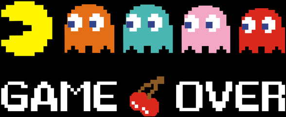

class: middle, center, title-slide

# Introduction to Artificial Intelligence

Closing remarks

  
Prof. Gilles Louppe 
[g.louppe@uliege.be](mailto:g.louppe@uliege.be)

---

class: middle

- Lecture 0: Artificial intelligence
- Lecture 1: Intelligent agents
- Lecture 2: Solving problems by searching
- Lecture 3: Adversarial search
- Lecture 4: Quantifying uncertainty
- Lecture 5: Probabilistic reasoning
- Lecture 6: Reasoning over time
- Lecture 7: Machine learning and neural networks
- Lecture 8: Making decisions
- Lecture 9: Reinforcement learning

---

class: middle, center

.width-50[]

---

class: middle

## Going further

This course is designed as an introduction to the many other courses available at ULiège and related to AI, including:

- ELEN0062: Introduction to Machine Learning
- DATS0001: Foundations of Data Science
- INFO8010: Deep Learning
- INFO8004: Advanced Machine Learning
- INFO8003: Reinforcement Learning
- INFO9023: Machine Learning Systems Design
- INFO0948: Introduction to Intelligent Robotics
- ELEN0016: Computer vision
- SPAT0263: Machine Learning in Space Sciences 

---

class: middle

## Research opportunities

Feel free to contact us
- for research Summer internship opportunities
- MSc thesis opportunities
- PhD thesis opportunities

---

class: middle

## Beyond ChatGPT and Pacman

Artificial intelligence algorithms are transforming science, engineering and society.

As future engineers or scientists, AI offers you opportunities to address some of the world's biggest challenges. 

???

- Build the next generation of aircrafts, cars, robots, ...
- Make the next app that will change the world
- Work on the next generation of medical devices, ...
- Analyze large amounts of genomic data, process biomedical images, ...
- Try to understand the brain, or the universe, ...
- Discover new drugs, new materials, ...

---

exclude: true
class: middle, black-slide

.center[
<iframe width="640" height="420" src="https://www.youtube.com/embed/NP8xt8o4_5Q?&loop=1&start=0" frameborder="0" volume="0" allowfullscreen></iframe>

A note of optimism: Don't fear intelligent machines, 
work with them (Garry Kasparov).
]

---

class: center, middle, black-slide
count: false

.center.width-70[]

  

Thanks for following Introduction to Artificial Intelligence!