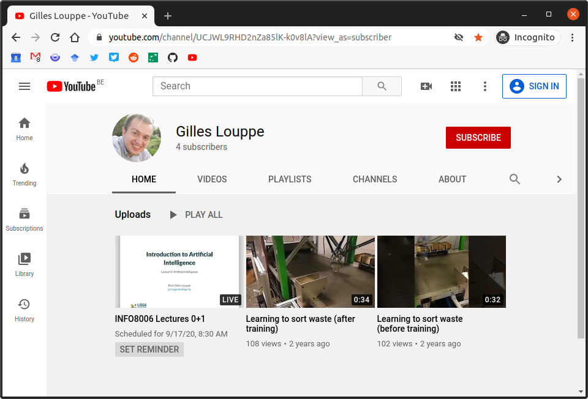
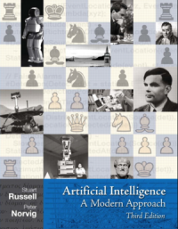
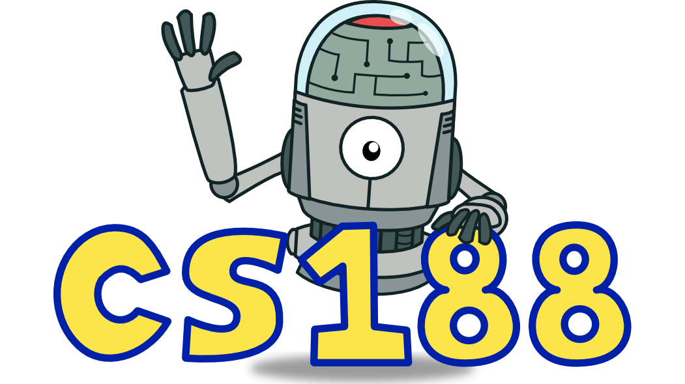
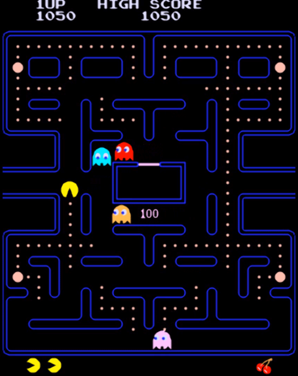
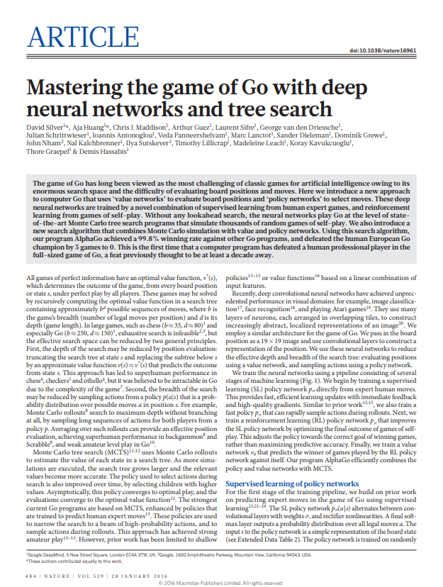

class: middle, center, title-slide

# Introduction to Artificial Intelligence

Course syllabus, Fall 2022

  
Prof. Gilles Louppe 
[g.louppe@uliege.be](mailto:g.louppe@uliege.be)

---

# Us

This course is given by:
- Theoretical lectures: Gilles Louppe
- Exercise sessions: François Rozet
- Programming projects: Arnaud Delaunoy, François Rozet

Feel free to contact us at [info8006@montefiore.ulg.ac.be](mailto:info8006@montefiore.ulg.ac.be) for help.

 
.center[
.circle.width-20[] &nbsp;
.circle.width-20[] &nbsp;
.circle.width-20[]
]

---

# Materials

The schedule and slides are available at [github.com/glouppe/info8006-introduction-to-ai](https://github.com/glouppe/info8006-introduction-to-ai).
- In HTML and in PDFs.
- Minor updates up to the day before the lesson.

.center.width-80[]

---

class: middle

## Videos

Videos from Fall 2020 are available at [https://youtube.com/playlist?list=PLLqXZ_E-UXlybvRU7vgaYMTbxZdT73ZFD](https://youtube.com/playlist?list=PLLqXZ_E-UXlybvRU7vgaYMTbxZdT73ZFD).

.center.width-60[]

---

class: middle

## Textbook

.center.width-30[]

The core content of this course is based on the following textbook:

> .italic[Stuart Russel, Peter Norvig. "Artificial Intelligence: A Modern Approach", Third Edition, Global Edition.]

This textbook is **recommended**. It covers both the theory and the exercises.

---

class: middle

## CS188

- Some lessons, exercises, and various other materials are partially adapted from [CS188 Introduction to Artificial Intelligence](https://inst.eecs.berkeley.edu/~cs188/su21/), from UC Berkeley. 
- Cartoons that you will see in those slides were all originally made for CS188. 

 
.center.width-50[]

---

# Exercise sessions

- Exercice sessions are held every week after the lecture.
- Prepare the exercises proposed the previous week.
- Use this time to get answers to your questions, and not to transcribe everything from the blackboard.
- Solutions are provided for all exercises. 

---

# Projects

## Programming projects

Implement an intelligent agent for playing **Pacman**. The project will be divided into three parts, with increasing levels of difficulty.

.center.width-40[]

---

class: middle

## Reading assignment

Read a scientific paper in Artificial Intelligence.

.center.width-40[]

---

# Evaluation

- Written exam (60%)
    - Short questions on the reading assignment will be part of the exam.
- Programming projects (40%)
    - Project 1: +0.5
    - Project 2: 20%
    - Project 3: 20%
    - Programming projects are **mandatory** for presenting the exam.

---

class: middle

## Honor code

You may consult papers, books, online references, or publicly available implementations for ideas that you may want to adapt and incorporate into your projects, so long as you clearly cite your sources in your code and your writeup. .bold[However, under no circumstances, may you base your project on someone else's implementation.] One of the main learning outcomes of the programming projects is for you to better understand the course materials.

.bold[Plagiarism is checked and sanctioned by a grade of 0. Cases of plagiarism will all be reported to the Faculty.]

---

class: end-slide, center
count: false

Let's start!
