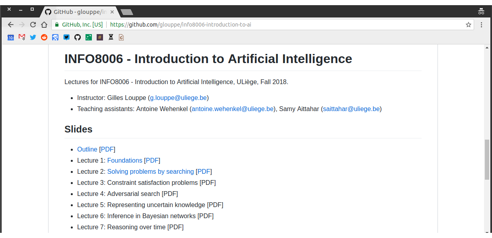
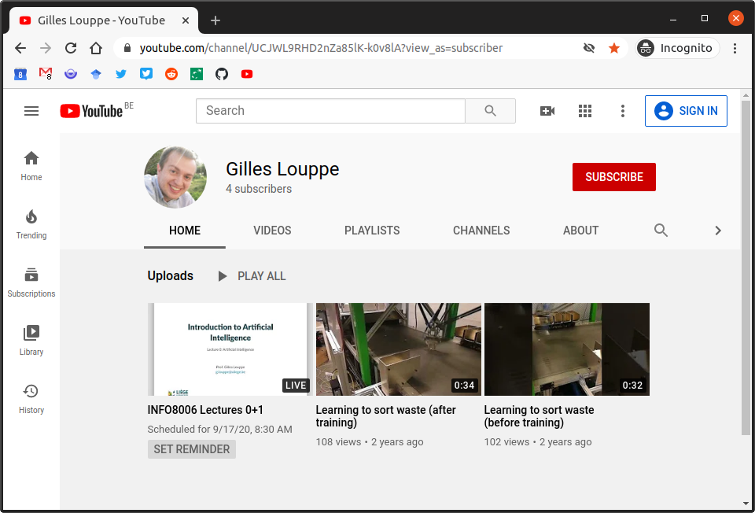
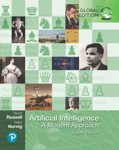
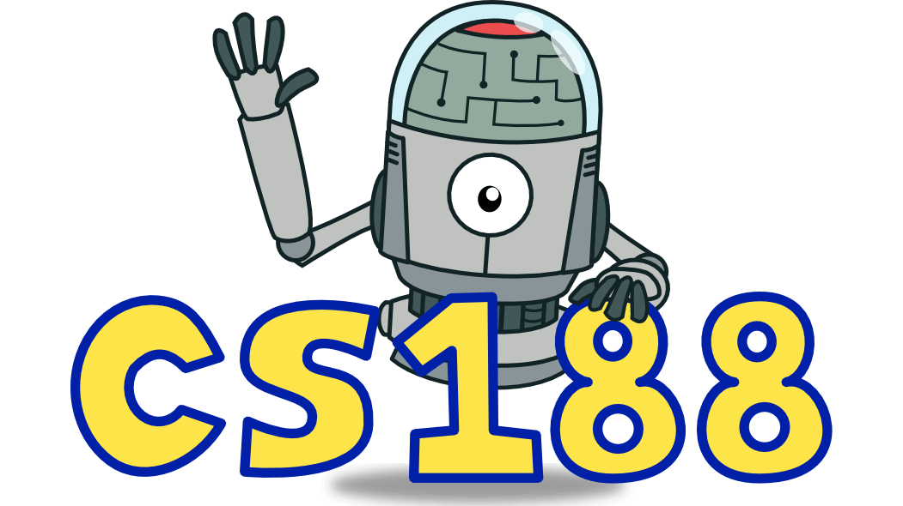
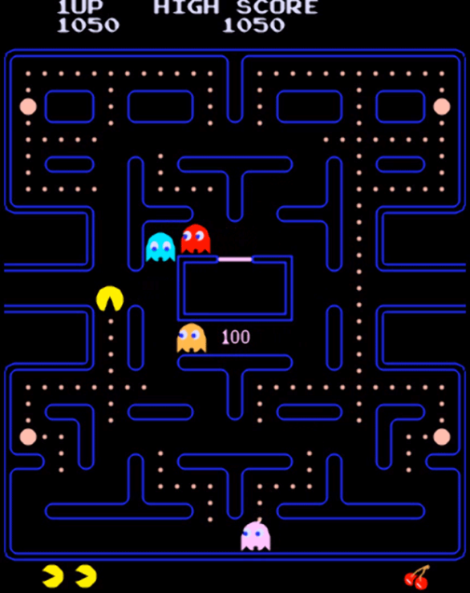

class: middle, center, title-slide

# Introduction to Artificial Intelligence

Course syllabus, Fall 2026

  
Prof. Gilles Louppe 
[g.louppe@uliege.be](mailto:g.louppe@uliege.be)

---

# Us

This course is given by
- Theoretical lectures: Gilles Louppe
- Exercise sessions: Gilles Louppe, Fanny Bodart, Thomas Savary
- Programming projects: Fanny Bodart, Thomas Savary

Feel free to contact us at [info8006@montefiore.ulg.ac.be](mailto:info8006@montefiore.ulg.ac.be) or on [Discord](https://discord.gg/Y8UP2SBu2h) for help.

 
.center[
.circle.width-20[] &nbsp;
.circle.width-20[] &nbsp;
.circle.width-20[]
]

---

# Materials

The schedule and slides are available at [github.com/glouppe/info8006-introduction-to-ai](https://github.com/glouppe/info8006-introduction-to-ai).
- In HTML and in PDFs.
- Minor updates up to the day before the lesson.

Official course description: [engagements pédagogiques](https://www.programmes.uliege.be/cocoon/20262027/cours/INFO8006-1.html).

.center.width-80[]

---

class: middle

## Videos

- Lectures from Fall 2024 are available on [MyUnicast](https://my.unicast.uliege.be/) and on [YouTube](https://youtube.com/playlist?list=PLLqXZ_E-UXly_dVpKfgzuga61h7z8XjbK&si=iGWYBiF-jZNuItl3).

- Videos from Fall 2020 are available on [YouTube](https://youtube.com/playlist?list=PLLqXZ_E-UXlybvRU7vgaYMTbxZdT73ZFD). They are not up-to-date with the current course, but they may still be useful.

.center.width-60[]

---

class: middle

## Textbook

.center.width-30[]

The core content of this course is based on the following textbook:

> .italic[Stuart Russell, Peter Norvig. "Artificial Intelligence: A Modern Approach", Fourth Edition, Global Edition.]

This textbook is .bold[recommended]. It covers both the theory and the exercises.

---

class: middle

## CS188

- Lectures, exercises, and various other materials are partially adapted from [CS188 Introduction to Artificial Intelligence](https://inst.eecs.berkeley.edu/~cs188/), from UC Berkeley. 
- Cartoons that you will see in those slides were all originally made for CS188. 

 
.center.width-50[]

---

# Exercise sessions

- Every week, after the lecture.
- You solve exercises alone or in small groups, and ask us when you are stuck.
- Solutions are provided for all exercises.

.success[The written exam asks problems of the same kind, and you sit it alone, without documents. Reading a solution does not teach you to produce one.]

---

# Programming projects

Implement an intelligent agent for playing .bold[Pacman].

.center.width-40[]

---

# Evaluation

- Written exam (70%)
- Programming projects (30%)
    - Project 0: 0% (tutorial of September 24)
    - Project 1: 15%
    - Project 2: 15%
- Programming projects are .bold[mandatory] for presenting the exam.

.alert[You must obtain at least 8/20 on the written exam. If you do, the final grade is the weighted average of the exam (70%) and the projects (30%). Otherwise, the final grade is the exam grade.]

---

class: middle

## Evaluation of the projects

- Projects are evaluated .bold[automatically] on Gradescope.
- Projects also include an .bold[oral defense]: you answer questions on your own code, justify your design decisions, and may be asked to modify or extend your implementation.

---

class: middle

## Honor code

You may consult papers, books, online references, or publicly available implementations for ideas that you may want to adapt and incorporate into your projects, so long as you clearly cite your sources in your code and your writeup. .italic[However, under no circumstances, may you base your project on someone else's implementation.]

Plagiarism is checked and sanctioned by a grade of 0. Cases of plagiarism will all be reported to the Faculty office.

???

One of the main learning outcomes of the programming projects is for you to better understand the course materials. By using someone else's implementation, you are depriving yourself of this learning opportunity. Moreover, you are also depriving yourself of the opportunity to learn how to write good code, which is an important skill for any computer scientist.

---

class: middle

## Use of AI tools

.success[AI assistants are .bold[allowed], without restriction.]

The rule is simple: everything you submit, you must be able to explain. Submitting a solution you do not understand, because an AI assistant produced it, will be strongly penalized.

---

class: end-slide, center
count: false

Let's start!
