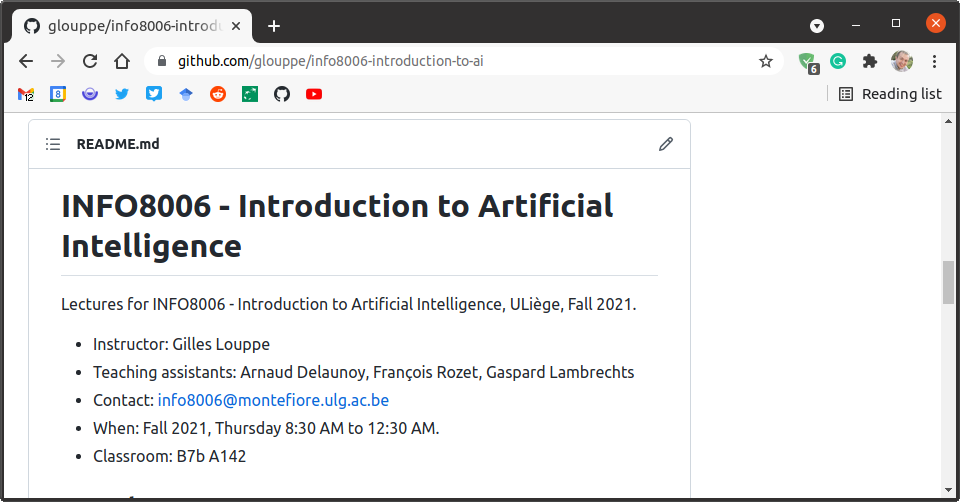

class: middle, center, title-slide

# Introduction to Artificial Intelligence

Fall 2020

  
Prof. Gilles Louppe 
[g.louppe@uliege.be](mailto:g.louppe@uliege.be)

???

R: prepare more code examples (one per course)
R: prepare handwritten developments
R: NASA Perseverance https://www.nasa.gov/feature/jpl/nasa-s-self-driving-perseverance-mars-rover-takes-the-wheel

---

# Goals and philosophy

## Thorough and detailed
- Understand the landscape of artificial intelligence.
- Be able to write from scratch, debug and run (some) AI algorithms.

## Well established algorithms and state-of-the-art
- Well-established algorithms for building intelligent agents.
- Introduction to materials new from research ($\leq$ 5 years old).
- Understand some of the open questions and challenges in the field.

## Practical
- Fun and challenging course projects.

---

# Us

This course is given by:
- Theoretical lectures: Gilles Louppe
- Exercise sessions: Antoine Wehenkel
- Programming projects: Arnaud Delaunoy, Pascal Leroy

Feel free to contact us at [info8006@montefiore.ulg.ac.be](mailto:info8006@montefiore.ulg.ac.be) for help.

 
.center[
.circle.width-20[] &nbsp;
.circle.width-20[] &nbsp;
.circle.width-20[] &nbsp;
.circle.width-20[]
]

---

# Materials

This year, the course takes place online on Youtube at [https://bit.ly/3igTphO](https://bit.ly/3igTphO).
- Theoretical lectures will be **streamed live**.
  - Use the chat to interact or ask your questions during the lecture.
- Exercise sessions will be posted as regular videos. 
  - Use the comments to ask your questions.

.center.width-60[]

---

class: middle

## Slides

The schedule and slides are available at [github.com/glouppe/info8006-introduction-to-ai](https://github.com/glouppe/info8006-introduction-to-ai).
- In HTML and in PDFs.
- Posted/updated online the day before the lesson (hopefully).
- Minor improvements/fixes from previous years.

.center.width-80[]

---

class: middle

## Textbook

.center.width-30[]

The core content of this course is based on the following textbook:

> .italic[Stuart Russel, Peter Norvig. "Artificial Intelligence: A Modern Approach", Third Edition, Global Edition.]

This textbook is **recommended**, although not required.

---

class: middle

## CS188

- Some lessons and materials are partially adapted from "[CS188 Introduction to Artificial Intelligence](https://inst.eecs.berkeley.edu/~cs188/fa20/)", from UC Berkeley.
- Cartoons that you will see in those slides were all originally made for CS188. 

 
.center.width-50[]

---

# Projects

## Reading assignment

Read a major scientific paper in Artificial Intelligence.
(Paper to be announced later.)

.center.width-40[]

---

class: middle

## Programming projects

Implement an intelligent agent for playing **Pacman**. The project will be divided into three parts, with increasing levels of difficulty.

.center.width-40[]

---

# Evaluation

- Written exam (60%)
    - Short questions on the reading assignment will be part of the exam.
- Programming projects (40%)
    - Project 1: 10%
    - Project 2: 15%
    - Project 3: 15%
    - Programming projects are **mandatory** for presenting the exam.

---

class: end-slide, center
count: false

Let's start!
