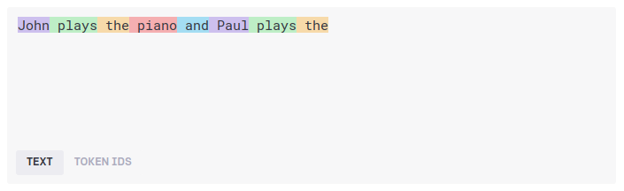
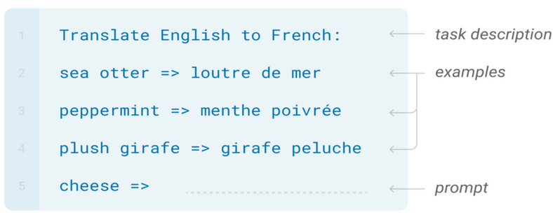
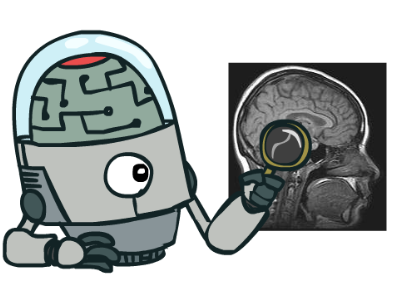
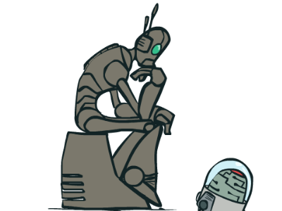
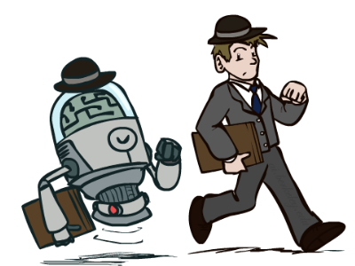
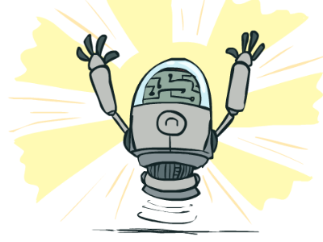
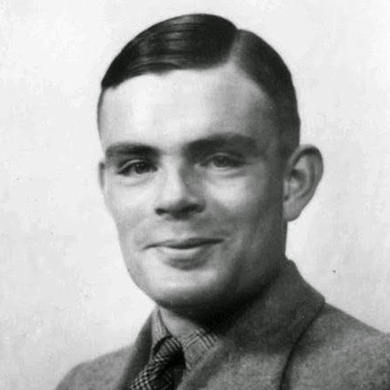
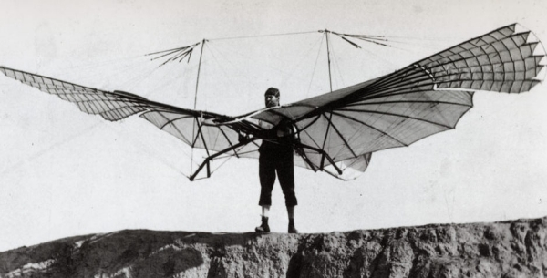
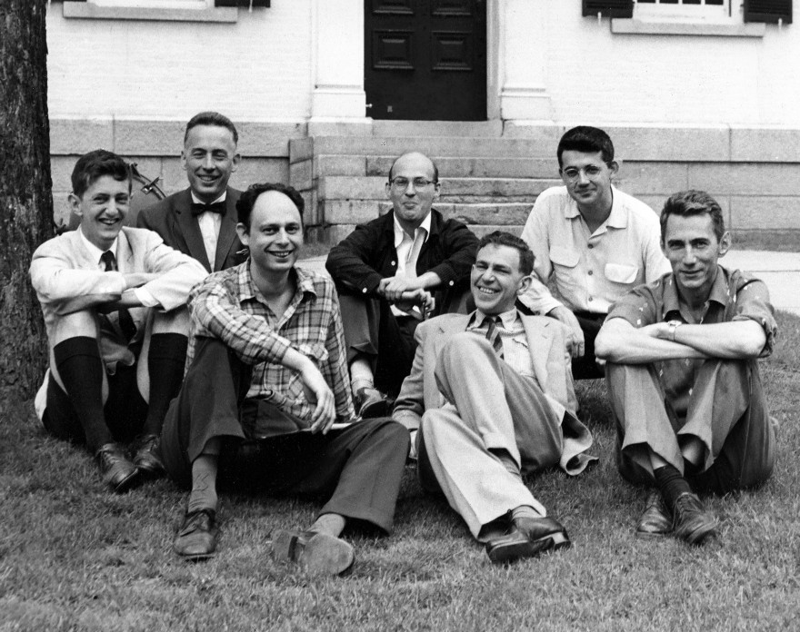

class: middle, center, title-slide

# Introduction to Artificial Intelligence

Lecture 0: Artificial Intelligence

<br><br>
Prof. Gilles Louppe<br>
[g.louppe@uliege.be](mailto:g.louppe@uliege.be)

???

R: Check https://www.youtube.com/watch?v=pd0JmT6rYcI + https://t.co/FA8sYGSv3K

---

class: middle, center
background-color: #343541

<video src="./figures/lec0/chatgpt.webm" autoplay loop muted width=640 height=640></video>

???

The elephant in the room. ChatGPT.

In november 2022, OpenAI released ChatGPT, a chatbot interface to GPT-3, a neural network trained on a very large corpus of text.

For the first time, the public got access through a simple web interface to a model that can generate text that is indistinguishable from human-written text. You can ask any question to the model, and it will answer, however complex or bizarre the question is.

For instance, in the video, I am asking ChatGPT to prepare a 1-day itinerary for a trip to Liège, Belgium, and it is answering me with a detailed itinerary, including the names of the places to visit, general information about the city, etc. I can also instruct ChatGPT to pretend that it knows all the hidden secrets of the city and revise its itinerary accordingly.

I am quite sure many of you have already used ChatGPT more or less seriously, so there is no need to introduce it further. However, I believe we can all agree that this is a very impressive technology and that it marks a milestone in the history of AI.

---

class: middle, center

.grid[
.kol-1-2[

<br><br><br><br><br><br>

One simple idea:

.bold[Guess the next word]

]
.kol-1-2[.center.width-70[]]
]

???

Despite its impressive performance and its apparent complexity, the underlying principle of ChatGPT is actually very simple.

The model is trained to guess the next word in a sentence. That's it.

It is the same principle that is used in your phone to autocomplete your messages, except that the model is much larger and has been trained on a much larger corpus of text.

What is interesting with the guess-the-next-word problem is that it is a very simple problem, but that it is also a very hard problem. It is simple because it is easy to understand, but it is hard because there are many possible next words. It is also hard because the context of a word is not always enough to predict the next word. Sometimes, we need to know more about the world to make a prediction.

---

class: middle, center

```
John plays the ___
```

???

Let's start with a simple example.

Suppose we want to predict the next word in the sentence "John plays the ___".

What is the next word?

There are many possibilities, but plausible possibilities are instruments such as "piano", "guitar", or "violin". 

This one was easy.

---

class: middle, center
count: false

```
John plays the piano and Mary plays the ____
```

???

Now, suppose we want to predict the next word in the sentence "John plays the piano and Mary plays the ___". What is the next word?

Just like before, we have to predict the next word following "plays the" but the context is now different.

It feels now more likely that the next word is "guitar", "violin" or "cello" than "piano" because "piano" is already used in the sentence.

This one was a bit harder.

---

class: middle, center
count: false

```
John plays the piano and Paul plays the ____
```

???

Now, suppose we want to predict the next word in the sentence "John plays the piano and Paul plays the ___". What is the next word?

Again, we have to predict the next word following "plays the" but the context is different.

Because the second person is now Paul, the context hints that John and Paul are the Beatles, and that the next word is likely to be "guitar" or "bass", not "violin" or "cello".

How do we know that? We know that because we have external knowledge about the world that we can use to make a prediction. In this case, we know that John and Paul are the Beatles, and that the Beatles play the piano and the bass.

---

class: middle, center

.width-60[]

???

This simple idea of guessing the next word is the basis of the transformer, a neural network architecture that has become the de facto standard for many AI tasks.

At its core, the transformer builds a representation of the context of a word, and uses it to predict the next word. The canonical architecture is made of an encoder, which builds the representation of the context, and a decoder, which uses it to predict the next word. The encoder and decoder are made of many layers which are used to process the context and to make the prediction.

The transformer is a neural architecture that can be used for many tasks, such as machine translation, question answering, text summarization, etc. However, in its decoder-only form, its most impressive application is language modeling, which is the task of predicting the next word in a sentence.

The transformer is one of the many neural network architectures that exist in deep learning. What's new is that it is a general-purpose architecture that can be used for many tasks. We used to have dedicated architectures for each task, but this is less and less the case.

---

class: black-slide
background-image: url(./figures/lec0/soundboard.jpg)
background-size: cover

???

In practice, the transformer is implemented as a regular computer program. It takes as input a sequence of tokens, which are the words of a sentence, and outputs a sequence of tokens, which are the words of the next sentence. At initialization, the parameters of the neural network are set to random values, which results in random and wrong predictions. To make correct predictions, the parameters of the neural network must be adjusted, or trained, on a large corpus of text. More precisely, the parameters can be optimized with a training procedure to minimize the error between the predicted next word and the actual next word.

Training a transformer is a bit like training a dog. You show it a lot of examples, and it learns to predict the next word. If it predicts the wrong word, you give it a negative feedback, and if it predicts the right word, you give it a positive feedback.

---

class: middle

.center.width-100[]

???

Fortunately, each sentence contains many guess-the-next-word problems that can be used to train a transformer. [For instance, the sentence "John plays the piano and Paul plays the ___" contains 8 instances of the problem, one for each word.]

Contrary to what we used to face in deep learning, acquiring data is therefore cheap and easy. There is no need to manually label the data, which is a tedious and expensive process. Instead, collecting data is as simple as downloading a large corpus of text from the internet.

For this reason, big tech companies have been able to train transformers on very large corpora of text, literally large parts of the internet counting hundreds of billions of tokens, which only they can collect.

---

class: middle, center

.center.width-90[]

???

Alright, so we have a transformer that has been trained on a large corpus of text. How do we use it?

After pre-training, a transformer is not very useful by itself just yet. It is like a dog that has been trained to guess the next word, but that cannot do anything else. To be useful, transformers must be fine-tuned or instructed to answer questions.

To do so, we can use a technique called prompt engineering or in-context learning, which consists in writing a prompt, a short text that contains instructions of a task to solve and some context. The prompt is then fed to the transformer, which is used to complete the prompt. The continuation of the prompt, obtained by guessing the next words, is likely to be consistent with the instructions and to answer the question. That's it!

As an example, the prompt in the slide can be used to instruct a transformer to translate English to French. The prompt contains a description of the task, together with a few examples of translations. The transformer is then used to complete the prompt, which results in a translation.

Similarly, ChatGPT and other chatbots are transformers that are repurposed to answer questions by using prompts that instruct them to answer questions, in the form of a conversation.

---

class: middle

.width-100[]

A brutal simplicity: 

- The more data, the better the model.
- The more parameters, the better the model.
- The more compute, the better the model.

???

The simplicity behind transformers is brutal. You'd think that there is more sophistication behind the scenes, but there is not. It is just a neural network that guesses the next words.

Not only that, but the research community has also found that the performance of transformers follows a power law. The more data, the better the model. The more parameters, the better the model. The more compute, the better the model. No matter how much data, parameters, and compute you have, you can always do better by increasing them, and there is no sign of saturation yet.

This is a very different paradigm than what we used to do in deep learning, where we would spend a lot of time designing the architecture of the neural network. Here, the architecture is always the same, and the only thing that matters is the amount of data, the number of parameters, and the amount of compute.

---

class: black-slide, center
background-image: url(./figures/lec0/robot.png)

<br>

<p class="shadow">Why does it work? How does complexity arise from<br> the simplicity of guessing the next `____`?</p>

???

Alright, so we have seen that transformers are very simple. So simple that it is hard to believe that they work so well.

And indeed, why do they work? How does complexity arise from the simplicity of guessing the next word?

The immediate answer is that it works because the transformer has seen the answer before. All the answers are in the training data and have been memorized.

However, when trained on a large corpus, a neural network cannot memorize the entire training data. It must have learned a compressed representation of the training data. 

One such representation is hypothetically a beginning of some kind of understanding of the world, stored compactly in the weights of the neural network, and that can be used to predict the next word.

This is a very exciting hypothesis, but it is still a hypothesis. We do not know for sure that this is the case. 

---

class: middle

# Artificial Intelligence

---

class: middle, center

.width-70[]

"With artificial intelligence we are summoning the demon" -- Elon Musk

???

Triggers a rich imagination fueled by science-fiction.

---


class: middle, center, black-slide

<iframe width="600" height="450" src="https://www.youtube.com/embed/DsBGaHywRhs" frameborder="0" allowfullscreen></iframe>

Geoffrey Hinton

---

class: middle, center

.width-60[]

"We're really closer to a smart washing machine than Terminator" -- Fei-Fei Li, Director of Stanford AI Lab.

???

The reality is quite different...

---

class: middle, center, black-slide

<iframe frameborder="0" width="600" height="480" src="https://www.dailymotion.com/embed/video/x7kvtfn" allowfullscreen allow="autoplay"></iframe>

Yann LeCun

---

# A definition?

Artificial intelligence is the science of making machines or programs that:
.center.grid[
.kol-1-4[]
.kol-1-4[
.caption[Think like people]
.width-100[]
]
.kol-1-4[
.caption[Think rationally]
.width-100[]]
]
.grid[
.kol-1-4[]
.kol-1-4[
.caption[Act like people]
.width-100[]
]
.kol-1-4[
.caption[Act rationally]
.width-100[]
]
]

.footnote[Image credits: [CS188](https://inst.eecs.berkeley.edu/~cs188/), UC Berkeley.]

???

Textbook definition(s) from AIMA.

---

class: middle

## The Turing test

A computer passes the **Turing test** (aka the Imitation Game) if a human operator, after posing some written
questions, cannot tell whether the written responses come from a person or from
a computer.

.grid[
.kol-2-3[
.width-80.center[<br>]
]
.kol-1-3.center[
.width-100.circle[]
.caption[Can machines think?<br> (Alan Turing, 1950)]
]
]

???

The Turing test is an *operational* definition of intelligence.

---

class: middle

An agent would not pass the Turing test without the following **requirements**:

- natural language processing
- knowledge representation
- automated reasoning
- machine learning
- computer vision (total Turing test)
- robotics (total Turing test)

Despite being proposed almost 70 years ago, the Turing test is *still relevant*
today.

---

class: middle

The Turing test tends to focus on *human-like errors*, *linguistic tricks*, etc.

However, it seems more important to study the **principles** underlying intelligence than to replicate an exemplar.

---

class: middle, center, black-slide

.center.width-80[]

Aeronautics is not defined as the field of making machines<br> that fly
so exactly like pigeons that they can fool even other pigeons.

---

# Rational agents

- A **rational agent** acts so as to achieve the *best expected* outcome.

- Rationality only concerns *what* decisions are made (not the thought process behind them, human-like or not).

- Goals are expressed in terms of the **performance** or **utility** of outcomes. Being rational means maximizing its expected performance.

- The standard of rationality is general and mathematically well defined.

---

class: middle

.center[

In this course, Artificial intelligence = **Maximizing expected performance**
]

.footnote[Image credits: [CS188](https://inst.eecs.berkeley.edu/~cs188/), UC Berkeley.]

???

Underline the importance of *expected*.

---

# A short history of AI

## 1940-1950: Early days
- 1943: McCulloch and Pitts: Boolean circuit model of the brain.
- 1950: Turing's "Computing machinery and intelligence".


---

class: middle

## 1950-1970: Excitement and expectations
- 1950s: Early AI programs, including Samuel's checkers program,
Newell and Simon's Logic Theorist and Gelernter's Geometry Engine.
- 1956: Dartmouth meeting: "Aritificial Intelligence" adopted.
- 1958: Rosenblatt invents the perceptron.
- 1965: Robinson's complete algorithm for logical reasoning.
- 1966-1974: AI discovers computational complexity.

---

class: middle

.width-60.center[]

## The Darthmouth workshop (1956)

.italic[The study is to proceed on the basis of the conjecture that every aspect of learning or any other feature of intelligence can in principle be *so precisely described* that a machine can be made to simulate it.]

---

class: middle, center, black-slide

<iframe width="600" height="450" src="https://www.youtube.com/embed/aygSMgK3BEM" frameborder="0" allowfullscreen></iframe>

---

class: middle

## 1970-1990: Knowledge-based approaches
- 1969: Neural network research almost disappears after Minsky and Papert's book (1st AI winter).
- 1969-1979: Early development of knowledge-based systems.
- 1980-1988: Expert systems industrial boom.
- 1988-1993: Expert systems industry busts  (2nd AI winter).

---

class: middle

## 1990-Present: Statistical approaches
- 1985-1995: The return of neural networks.
- 1988-: Resurgence of probability, focus on uncertainty, general increase in technical depth.
- 1995-2010: New fade of neural networks.
- 2000-: Availability of very large datasets.
- 2010-: Availability of fast commodity hardware (GPUs).
- 2012-: Resurgence of neural networks with  deep learning approaches.
- 2017: Attention is all you need (transformers).
- 2022: ChatGPT released to the public.

---

# What can an AI do today?

- Translate spoken Chinese to spoken English, live?
- Answer multiple choice questions, as good as an 8th grader?
- Solve university math problems?
- Prove mathematical theorems?
- Converse with a person for an hour?
- Play decently at Chess? Go? Poker? Soccer?
- Drive a car safely on a parking lot? in New York? in Germany?
- Identify skin cancer better than a dermatologist?
- Write computer code? 
- Tell a funny story?
- Paint like Vangogh? Compose music?
- Show common sense?

---

class: middle, center, black-slide

<iframe width="600" height="450" src="https://www.youtube.com/embed/Nu-nlQqFCKg" frameborder="0" allowfullscreen></iframe>

Speech translation and synthesis (2012)

---

class: middle, center, black-slide

<iframe width="600" height="450" src="https://www.youtube.com/embed/7gh6_U7Nfjs" frameborder="0" allowfullscreen></iframe>

Speech synthesis and question answering (Google, 2018)

---

class: middle, center, black-slide

<iframe width="600" height="450" src="https://www.youtube.com/embed/V1eYniJ0Rnk" frameborder="0" allowfullscreen></iframe>

Playing Atari games (2013)

---

class: middle, center, black-slide

<iframe width="600" height="450" src="https://www.youtube.com/embed/g-dKXOlsf98" frameborder="0" allowfullscreen></iframe>

Beat the best human Go players (2016)

---

class: middle, center, black-slide

<iframe width="600" height="450" src="https://www.youtube.com/embed/gn4nRCC9TwQ" frameborder="0" allowfullscreen></iframe>

Learning to walk (2017)

???

Single algorithm for learning! Nothing is hardcoded.

Similar to a baby learning to walk.

---

class: middle, center, black-slide

<iframe width="600" height="450" src="https://www.youtube.com/embed/yyLa6xIK9Qs" frameborder="0" allowfullscreen></iframe>

Playing soccer (2018)

---

class: middle, center, black-slide

<iframe width="600" height="450" src="https://www.youtube.com/embed/tF4DML7FIWk" frameborder="0" allowfullscreen></iframe>

... although some robots might now do better (2021).

---

class: middle, center, black-slide

<iframe width="600" height="450" src="https://www.youtube.com/embed/qhUvQiKec2U" frameborder="0" allowfullscreen></iframe>

Driving a car (NVIDIA, 2016)

---

class: middle, center, black-slide

<iframe width="600" height="450" src="https://www.youtube.com/embed/hA_-MkU0Nfw" frameborder="0" allowfullscreen></iframe>

Autonomous cars (Waymo, 2022)

---

class: middle, center, black-slide

<iframe width="600" height="450" src="https://www.youtube.com/embed/8USTGyUhnJk" frameborder="0" allowfullscreen></iframe>

Driving on Mars (NASA/JPL, 2021)

---

class: middle, center, black-slide

<iframe width="640" height="400" src="https://www.youtube.com/embed/FUUT6IrQjo4" frameborder="0" volume="0" allowfullscreen></iframe>

Predicting extreme weather events (NVIDIA, 2023)

---

class: middle, center, black-slide

<iframe width="640" height="400" src="https://www.youtube.com/embed/_eNUtLHXJkc" frameborder="0" volume="0" allowfullscreen></iframe>

Improving Tuberculosis Monitoring with Deep Learning (NVIDIA, 2020)

---

class: middle, black-slide, center

<iframe width="600" height="450" src="https://www.youtube.com/embed/gg7WjuFs8F4" frameborder="0" allowfullscreen></iframe>

Solving protein folding (Deepmind, AlphaFold, 2020)

---

class: middle, black-slide, center

<iframe width="600" height="450" src="https://www.youtube.com/embed/zrcxLZmOyNA" frameborder="0" allowfullscreen></iframe>

Powering the future of clean energy (NVIDIA, 2023)

---

class: middle, center, black-slide

<iframe width="600" height="450" src="https://www.youtube.com/embed/4RfD5JiXt3A" frameborder="0" allowfullscreen></iframe>

Write computer code (Github Copilot X, 2023)

---

class: middle, center, black-slide

<iframe width="600" height="450" src="https://www.youtube.com/embed/7c1lKFFF6dM" frameborder="0" allowfullscreen></iframe>

Learning to sort waste<br>(ULiège, 2021)

---

class: middle, center, black-slide

<iframe width="600" height="450" src="https://www.youtube.com/embed/J9Th_WYu6Eg" frameborder="0" allowfullscreen></iframe>

Cow behaviour recognition (Francois Lievens, ULiège, 2022)

---

# What is missing?

Intelligence is not just about **pattern recognition**, which is something most of these works are based on.

It is about *modeling the world*:
- explaining and understanding what we see;
- imagining things we could see but haven't yet;
- problem solving and planning actions to make these things real;
- building new models as we learn more about the world.

---

class: middle

# INFO8006 Introduction to AI

---

# Course outline

- Lecture 0: Artificial intelligence
- Lecture 1: Intelligent agents
- Lecture 2: Solving problems by searching
- Lecture 3: Adversarial search
- Lecture 4: Representing uncertain knowledge
- Lecture 5: Inference in Bayesian networks
- Lecture 6: Reasoning over time
- Lecture 7: Machine learning and neural networks
- Lecture 8: Making decisions
- Lecture 9: Reinforcement learning

---

class: middle, center

.width-50[]

---

class: middle

## My mission

By the end of this course, you will have built autonomous agents that efficiently make decisions in fully informed, partially observable and adversarial settings. Your agents will draw inferences in uncertain and unknown environments and optimize actions for arbitrary reward structures. 

The models and algorithms you will learn in this course apply to a wide variety of artificial intelligence problems and will serve as the foundation for further study in any application area (from engineering and science, to business and medicine) you choose to pursue.

---

class: middle

## Goals and philosophy

.italic[General]
- Understand the landscape of artificial intelligence.
- Be able to write from scratch, debug and run (some) AI algorithms.

.italic[Well-established and state-of-the-art algorithms] 
- Good old-fashioned AI: well-established algorithms for intelligent agents and their mathematical foundations.
- Introduction to materials new from research ($\leq$ 5 years old).
- Understand some of the open questions and challenges in the field.

.italic[Practical]
- Fun and challenging course projects.

---

class: middle

## Going further

This course is designed as an introduction to the many other courses available at ULiège and (broadly) related to AI, including:

- INFO8006: Introduction to Artificial Intelligence $\leftarrow$ **you are there**
- DATS0001: Foundations of Data Science
- ELEN0062: Introduction to Machine Learning
- INFO8010: Deep Learning
- INFO8004: Advanced Machine Learning
- INFO9023: Machine Learning Systems Design
- INFO8003: Optimal decision making for complex problems
- INFO0948: Introduction to Intelligent Robotics
- INFO9014: Knowledge representation and reasoning
- ELEN0016: Computer vision

???

Mention pre-requisites:
- programming experience
- probability theory


---

class: end-slide, center
count: false

The end.
