class: middle, center, title-slide

# Introduction to Artificial Intelligence

Lecture 0: Artificial Intelligence

<br><br>
Prof. Gilles Louppe<br>
[g.louppe@uliege.be](mailto:g.louppe@uliege.be)

---

class: middle, center
background-color: #343541

<video src="./figures/lec0/chatgpt.webm" autoplay loop muted width=640 height=640></video>

???

You have all used this, most of you this week. There is nothing left to introduce.

In the video I ask for a one-day itinerary in Liège, then tell the model to pretend it knows the hidden secrets of the city and to revise it. When this course first showed that clip, it was startling. Today it is a utility, and that is the more interesting fact: in four years the technology did not become more impressive, it became ordinary.

So rather than show you what it can do, this lecture takes it apart. What is actually computed when you type a question? Why does the same question give different answers? Why does the thing that autocompletes your phone now write code, drive a computer, and claim proofs of open problems?

One simple idea, scaled very far, then repaired in a few specific places. The simple idea is on the next slide.

---

class: middle, center

.grid[
.kol-1-2[

<br><br><br><br><br><br>

One simple idea:

.bold[Guess the next word]

]
.kol-1-2[.center.width-70[]]
]

???

Here is the whole foundation: the model is trained to guess the next word. The same principle as the autocomplete on your phone, with a much larger model and a much larger corpus.

Keep it in mind for the rest of the lecture. Everything that came after, the assistant, the reasoning, the agents, is built on this one operation.

The problem is easy to state and hard to solve. There are many possible next words, and the context is often not enough: to guess well, you need to know something about the world the text describes. That is the whole bet.

---

class: middle
count: false

```
In the 1960s, Armstrong ____
```

???

Ambiguous! Louis Armstrong or Neil Armstrong?

Possible completions: played, sang, walked, flew

---

class: middle
count: false

```
In the 1960s, Armstrong performed ___
```

???

Now leaning towards Louis Armstrong.

Possible completions: jazz, music, trumpet solos, ...

---

class: middle
count: false

```
In the 1960s, Armstrong performed a moonwalk ___
```

???

Twist!

Possible completions: on stage, during a concert, in a jazz club, ...

---

class: middle
count: false

```
In the 1960s, Armstrong performed a moonwalk on the ___
```

???

Dramatic shift of context!

Most likely completion: moon

---

class: middle
count: false

```
In the 1960s, Armstrong performed a moonwalk on the lunar ___
```

???

Further narrowing down the context!

Possible completions: surface, landscape, terrain, ...

---

class: middle
count: false

```
In the 1960s, Armstrong performed a moonwalk on the lunar surface 
and said ___
```

???

Very specific context!

Possible completions: "That's one small step for man, one giant leap for mankind."

---

class: middle

.center.circle.width-30[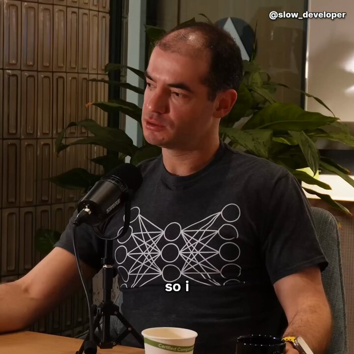]

.quote[What does it mean to predict the next token well enough? It's actually [...] a deeper question than it seems. Predicting the next token well means that you understand the underlying reality that led to the creation of that token. .author[Ilya Sutskever, 2023]]

---

class: middle

This explains why a model that does .bold[nothing but] guess the next word ...
- gives different answers to the same question, since it samples the next word;
- counts, computes and plans poorly, having no scratch space to work in;
- invents plausible details, having no way to check them;
- cannot go back on a mistake once it is written.

.question[How do we go from here to agents that use computers and prove theorems?]

???

These are the limits of the plain predictor, not of the systems you use: each is repaired later in this lecture, by letting the model write its reasoning down before answering, and by letting it act, observe and retry.

---

exclude: true
class: middle

# Artificial Intelligence

---

exclude: true

# A definition of AI?

<br>

.center.circle.width-40[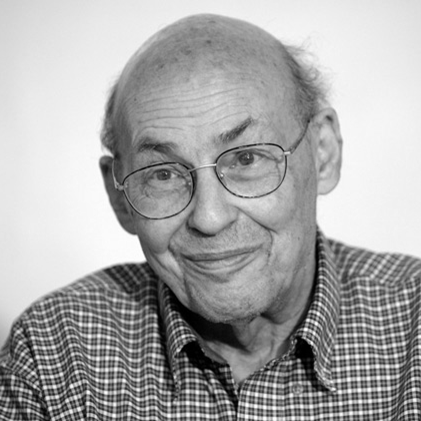]

.quote[Artificial intelligence is the science of making machines do things that would require intelligence if done by men. .author[Marvin Minsky, 1968]]

???

But what is intelligence anyway? 

---

exclude: true
class: middle

## The Turing test

A computer passes the .bold[Turing test] (aka the Imitation Game) if a human operator, after posing some written
questions, cannot tell whether the written responses come from a person or from
a computer.

.grid[
.kol-2-3[
.width-80.center[<br>]
]
.kol-1-3.center[
.width-100.circle[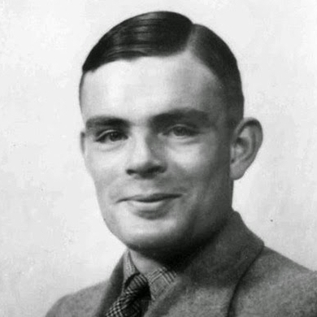]
.caption[Can machines think?<br> (Alan Turing, 1950)]
]
]

???

The Turing test is an .bold[operational] definition of intelligence.

---

exclude: true
class: middle

In 2025, a language model was judged to be the human .bold[73%] of the time, more often than the humans themselves.

.center.width-60[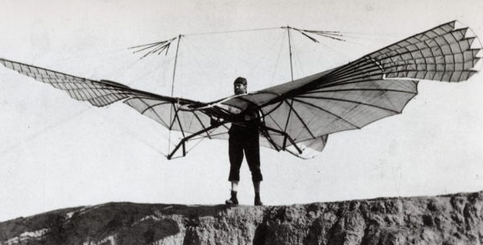]

.quote[Aeronautical engineering texts do not define the goal of their field as making "machines that fly so exactly like pigeons that they can fool even other pigeons." .author[Russell and Norvig]]

.footnote[Credits: [Jones and Bergen](https://arxiv.org/abs/2503.23674), 2025 (arXiv:2503.23674).]

???

The 2025 result: GPT-4.5, prompted to adopt a humanlike persona, in a standard three-party test (an interrogator chats with a human and a machine at the same time, then picks the human). Later published in PNAS.

Machines now pass the Turing test, which says more about the test than about intelligence. The test rewards human-like errors and linguistic tricks. It is more important to study the principles underlying intelligence than to replicate an exemplar.

---

exclude: true
class: middle

## A modern definition of AI

.quote[‘AI system’ means a machine-based system that is designed to operate with varying levels of autonomy and that may exhibit adaptiveness after deployment, and that, for explicit or implicit objectives, infers, from the input it receives, how to generate outputs such as predictions, content, recommendations, or decisions that can influence physical or virtual environments. .author[EU AI Act, Article 3, 2024]]

.footnote[[Regulation (EU) 2024/1689](https://eur-lex.europa.eu/legal-content/EN/TXT/HTML/?uri=OJ%3AL_202401689#d1e2090-1-1).]

???

Very broad definition! 

Does encompass modern deep learning models, but also many other systems.

Is a thermostat an AI system?

---

exclude: true

# A short history of AI

## 1940-1950: Early days
- 1943: McCulloch and Pitts: Boolean circuit model of the brain.
- 1950: Turing's "Computing machinery and intelligence".

## 1950-1970: Excitement and expectations
- 1950s: Early AI programs, including Samuel's checkers program,
Newell and Simon's Logic Theorist and Gelernter's Geometry Engine.
- 1956: Dartmouth meeting: "Artificial Intelligence" adopted.
- 1958: Rosenblatt invents the perceptron.
- 1965: Robinson's complete algorithm for logical reasoning.
- 1966-1974: AI discovers computational complexity.

---

exclude: true
class: middle

.width-60.center[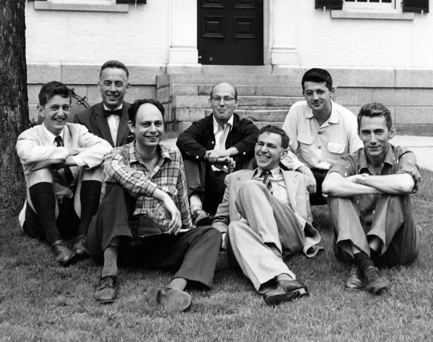]

## The Dartmouth workshop (1956)

.italic[The study is to proceed on the basis of the conjecture that every aspect of learning or any other feature of intelligence can in principle be .bold[so precisely described] that a machine can be made to simulate it.]

---

exclude: true
class: middle, center, black-slide

<iframe width="600" height="450" src="https://www.youtube.com/embed/aygSMgK3BEM" frameborder="0" allowfullscreen></iframe>

---

exclude: true
class: middle

## 1970-1990: Knowledge-based approaches
- 1969: Neural network research almost disappears after Minsky and Papert's book (1st AI winter).
- 1969-1979: Early development of knowledge-based systems.
- 1980-1988: Expert systems industrial boom.
- 1988-1993: Expert systems industry busts  (2nd AI winter).

---

exclude: true
class: middle

## 1990-2022: Statistical approaches
- 1985-1995: The return of neural networks.
- 1988-: Resurgence of probability, focus on uncertainty, general increase in technical depth.
- 1995-2010: New fade of neural networks.
- 2000-: Availability of very large datasets.
- 2010-: Availability of fast commodity hardware (GPUs).
- 2012-: Resurgence of neural networks with  deep learning approaches.
- 2017: Attention is all you need (transformers).

---

exclude: true
class: middle

## 2022-Present: From assistants to agents
- 2022: ChatGPT released to the public.
- 2024: Reasoning models write before answering.
- 2024: Nobel Prizes in Physics (Hopfield, Hinton) and Chemistry (Baker, Hassabis, Jumper).
- 2025: Barto and Sutton receive the Turing Award for reinforcement learning.
- 2025: Gold-medal score at the International Mathematical Olympiad.
- 2025-: Agents that write code and use computers.
- 2026: Agents claim a proof for the Navier–Stokes Millennium Problem.

---

class: middle

# The deep learning revolution

---

class: middle

.center.width-40[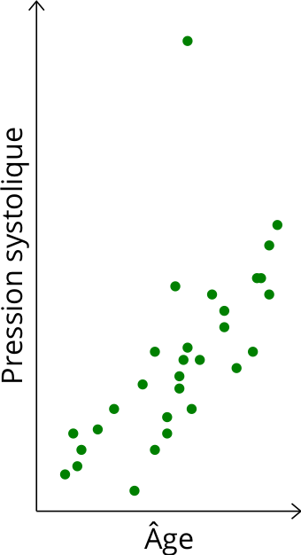]

.footnote[Credits: François Fleuret, 2023.]

???

The task here is only a pretext. Nobody needs a machine to guess blood pressure from age, and we will spend no time on medicine. What the next few slides are really about is the recipe, and the recipe does not change whether the output is a blood pressure, the next word of a sentence, or a move in a game.

So: thirty patients, age on one axis, blood pressure on the other. Can we write a program that, given the age, guesses the pressure?

One habit worth keeping from this slide: before anything else, look at the data. Plot it. That is always the first step, and it is the one most often skipped.

---

class: middle
count: false

.width-100[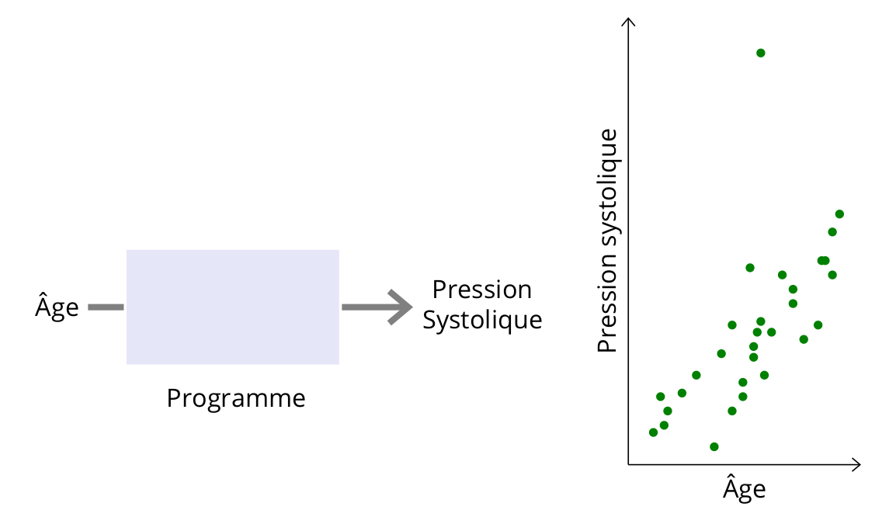]

.footnote[Credits: François Fleuret, 2023.]

???

The machine learning approach to this problem is not to hardcode some made-up computer program that would take the age of a patient and return a blood pressure. Instead, the machine learning approach is to write a computer program that will learn to make predictions by itself, by looking at the data.

---

class: middle
count: false

.width-100[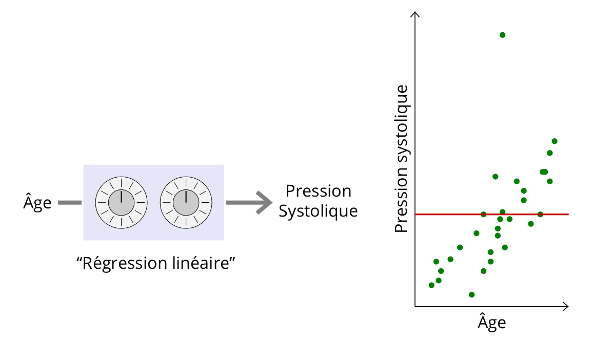]

.footnote[Credits: François Fleuret, 2023.]

???

To do so, we need to define a model, a mathematical function that will take the age of a patient as input and return a prediction of his or her blood pressure. 

Often, this model is a function with parameters. The parameters are the knobs of the model, and we will tune them to make the best predictions.

The simplest example is the linear model, which is a function of the form `y = ax + b`, where `a` and `b` are the parameters to be learned, the two knobs that we can turn to change the behavior of the model.

To find the best parameter values, we will use the data to train the model. This means that we will show the model the data, make it make predictions, and then adjust its parameters to reduce the error between its predictions and the true blood pressure values.

This process can be described mathematically and implemented in a computer program. This is what we call the training of the model.

---

class: middle
count: false

.width-100[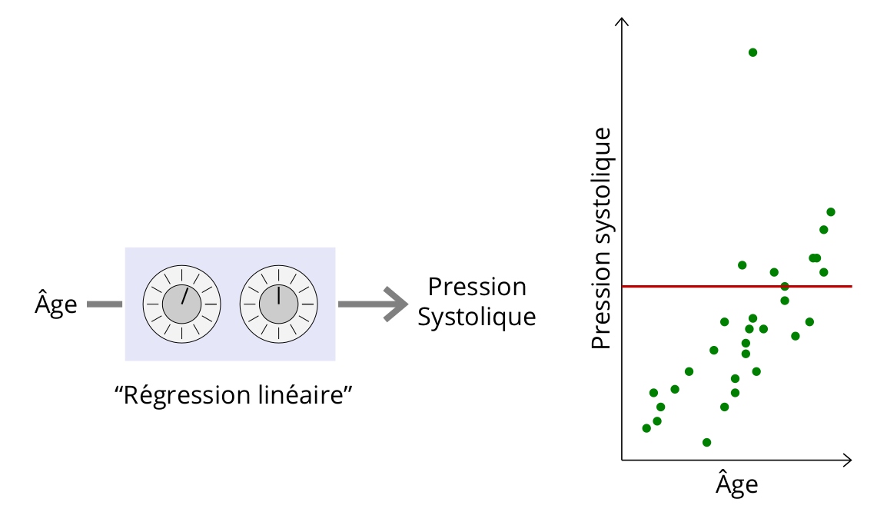]

.footnote[Credits: François Fleuret, 2023.]

---

class: middle
count: false

.width-100[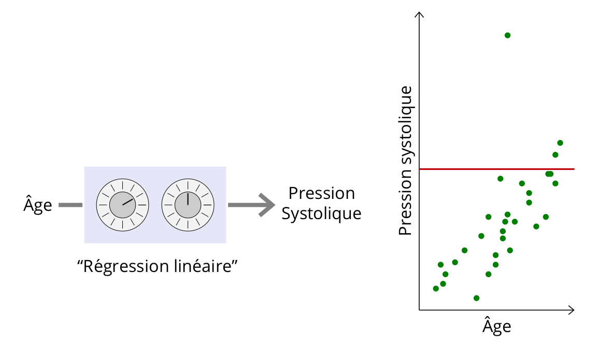]

.footnote[Credits: François Fleuret, 2023.]

---

class: middle
count: false

.width-100[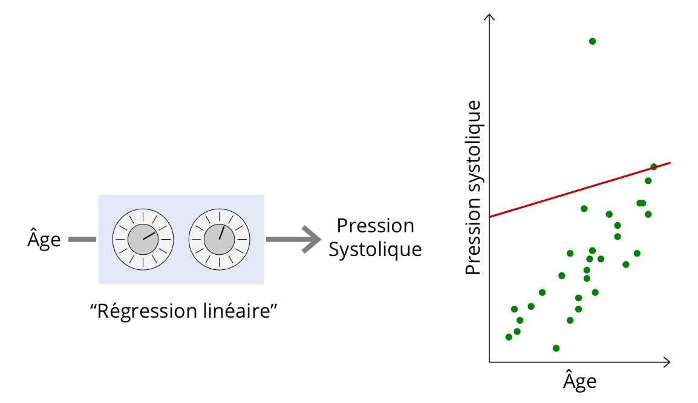]

.footnote[Credits: François Fleuret, 2023.]

---

class: middle
count: false

.width-100[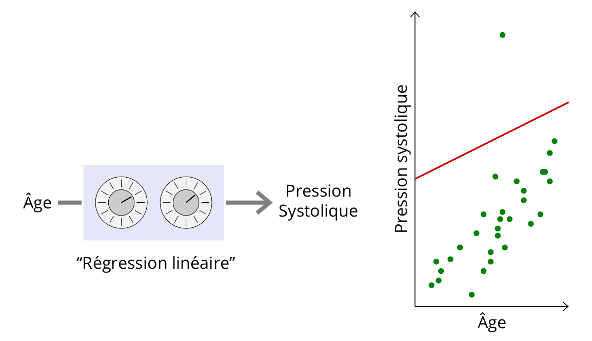]

.footnote[Credits: François Fleuret, 2023.]

---

class: middle
count: false

.width-100[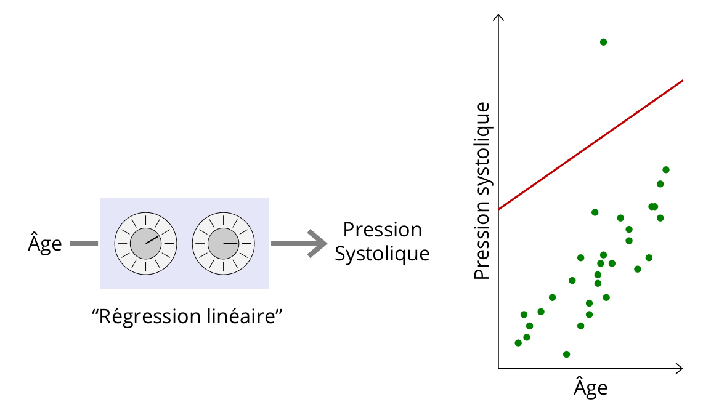]

.footnote[Credits: François Fleuret, 2023.]

---

class: middle
count: false

.width-100[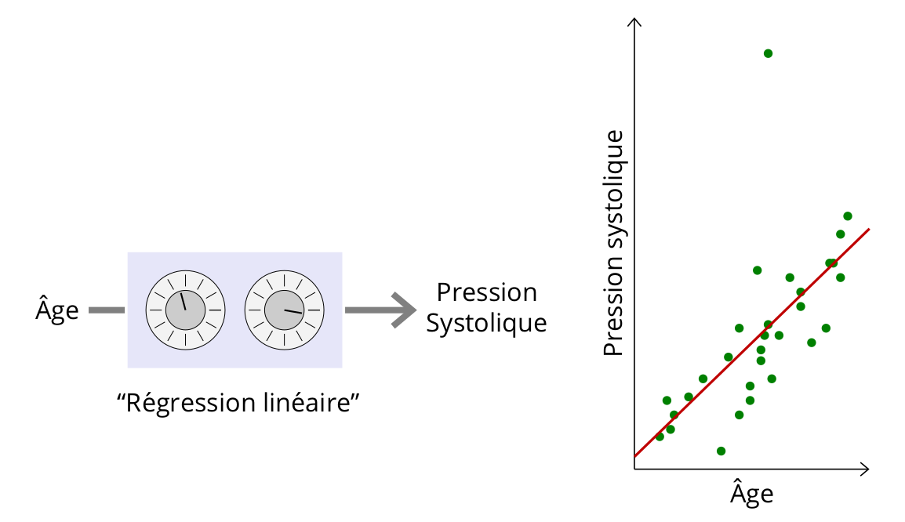]

.footnote[Credits: François Fleuret, 2023.]

---

class: middle

Deep learning .bold[scales up] the statistical and machine learning approaches by
- using larger models known as neural networks,
- training on larger datasets,
- using more compute resources.

.grid[
.kol-3-4.width-70.center[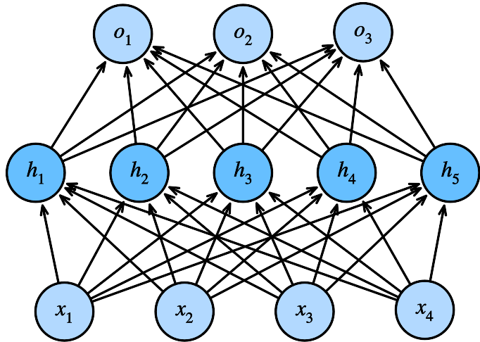]
.kol-1-4.width-90.center[<br>]
]

???

[Talk about the slide first.]

Scaling up the statistical and machine learning approaches by brute force in these three dimensions has been key to the success of deep learning.

---

class: middle

Specialized neural networks can be trained to achieve super-human performance on many complex tasks that were previously thought to be out of reach for machines.

.width-100[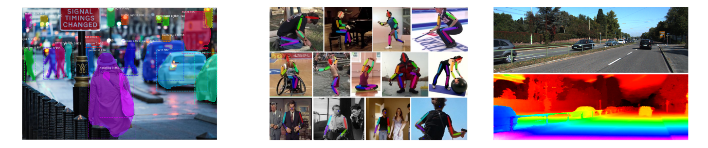]

.width-100[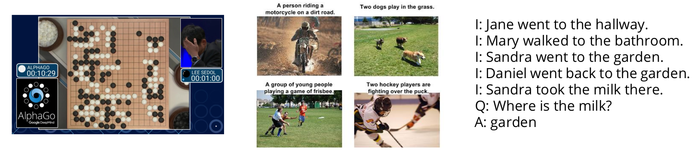]

.center[(Top) Scene understanding, pose estimation, geometric reasoning.<br>
(Bottom) Planning, Image captioning, Question answering.]

.footnote[Credits: François Fleuret, 2023.]

???

Following this approach, deep learning has been successful in tasks that were previously considered hard for computers, such as understanding images, speech, or text.

In particular, specialized neural networks can be trained to solve a large variety of problems, from scene understanding to geometric reasoning, from planning to question answering.

While these problems can be perceived as artificial and not really important in their own right, they actually form a set of primitive tasks that are found in many domains of application. 

---

class: middle

Neural networks form .bold[primitives] that can be transferred to many domains. 

.grid[
.kol-1-3.center.width-100[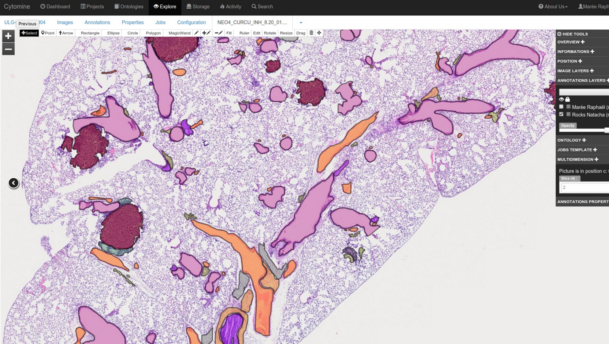]
.kol-1-3.center.width-80[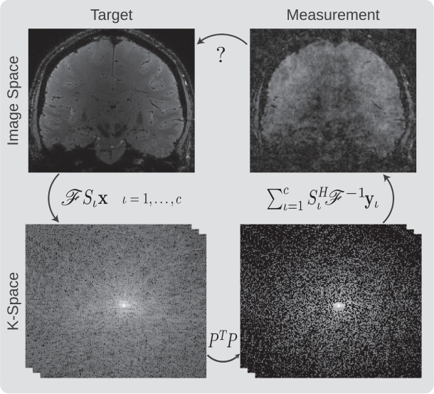]
.kol-1-3.center.width-80[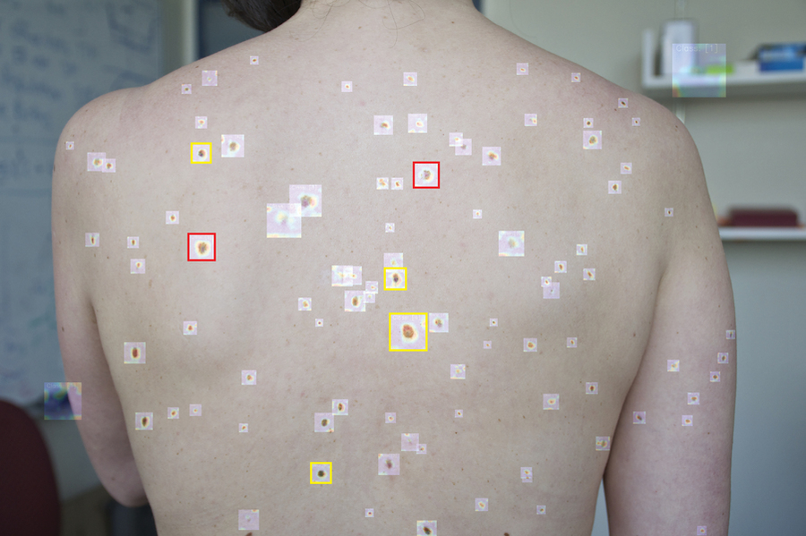]
]
.width-100[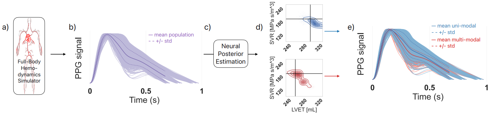]

.center[(Top) Analysis of histological slides, denoising of MRI images, nevus detection.<br>
(Bottom) Whole-body hemodynamics reconstruction from PPG signals.]

???

For example, in health and medicine, the same specialized neural networks that are used to annotate scenes can be used to analyze biomedical images, such as histological slides.

Specialized neural networks can also be used to denoise MRI images, to detect nevus, or to reconstruct whole-body hemodynamics from PPG signals, if some of you have an Apple Watch.

As a matter of fact, the adoption of AI and deep learning in health and medicine has been growing steadily over the past decade, with many applications in medical imaging, genomics, and many more. 

These applications however, are often deeply embedded in the tools used by healthcare professionals, and are not always visible to the public.

---

class: middle, center, black-slide

<iframe width="600" height="450" src="https://www.youtube.com/embed/hA_-MkU0Nfw" frameborder="0" allowfullscreen></iframe>

Autonomous cars (Waymo, 2022)

---

class: middle, black-slide, center

<iframe width="600" height="450" src="https://www.youtube.com/embed/zrcxLZmOyNA" frameborder="0" allowfullscreen></iframe>

Powering the future of clean energy (NVIDIA, 2023)

---

class: middle, black-slide, center

<iframe width="600" height="450" src="https://www.youtube.com/embed/AbdVsi1VjQY" frameborder="0" allowfullscreen></iframe>

How AI is advancing medicine (Google, 2018)

---


class: middle, center

Deep learning can also .bold[solve problems that no one could solve before].

???

Beyond the basic work that can be automated, the most exciting applications of AI, at least for the scientist in me, is the fact that deep learning can also be used to solve problems that no one could solve before. To make discoveries. 

I have many examples in mind, but I will only mention a few today, to give you a sense of what is possible.

---

class: middle

## AlphaFold: From a sequence of amino acids to a 3D structure

.grid[
.kol-2-3.center.width-100[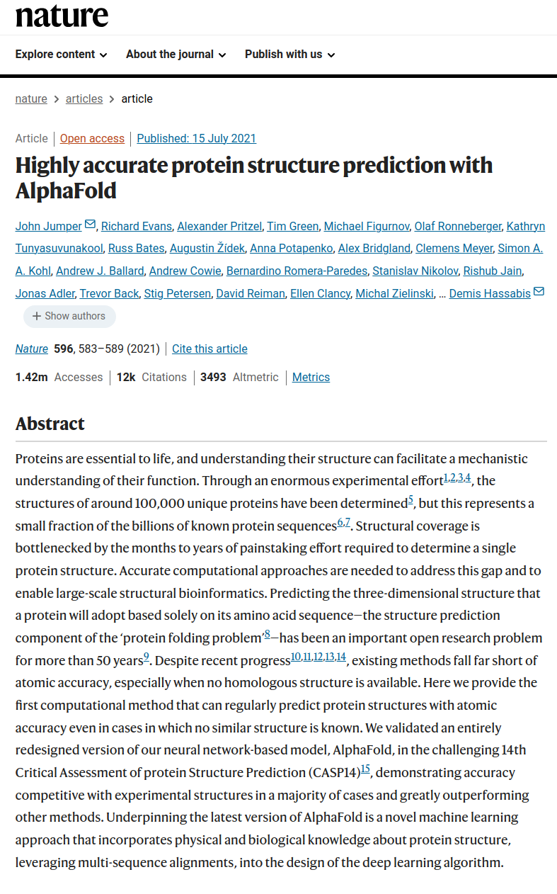]
.kol-1-3.center[.width-100[]
.width-80[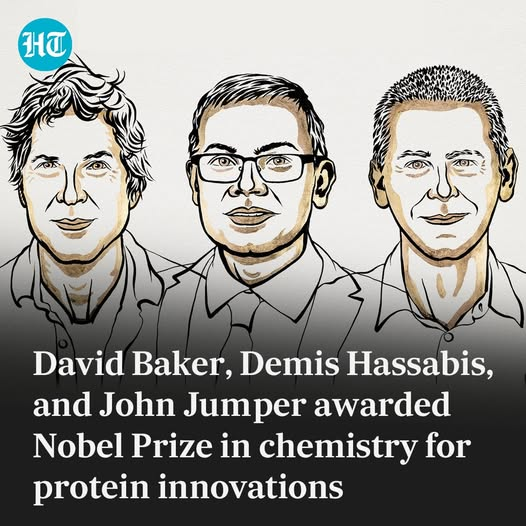]]
]

???

The first example is AlphaFold, a neural network based on the transformer architecture that can predict the 3D structure of a protein from its amino acid sequence.

This problem is important because the 3D structure of a protein determines its function, and understanding protein function is key to understanding biology and designing new drugs.

However, determining the 3D structure of a protein experimentally is difficult and expensive, taking up to months just to solve a single structure. 

AlphaFold has been a breakthrough in this area, and has been able to predict the 3D structure of proteins with high accuracy, in just a couple of minutes for the longest sequences.

---

class: middle, black-slide, center

<iframe width="600" height="450" src="https://www.youtube.com/embed/gg7WjuFs8F4" frameborder="0" allowfullscreen></iframe>

AI for Science (Deepmind, AlphaFold, 2020)

---


class: middle

## Drug discovery with graph neural networks

.center.width-80[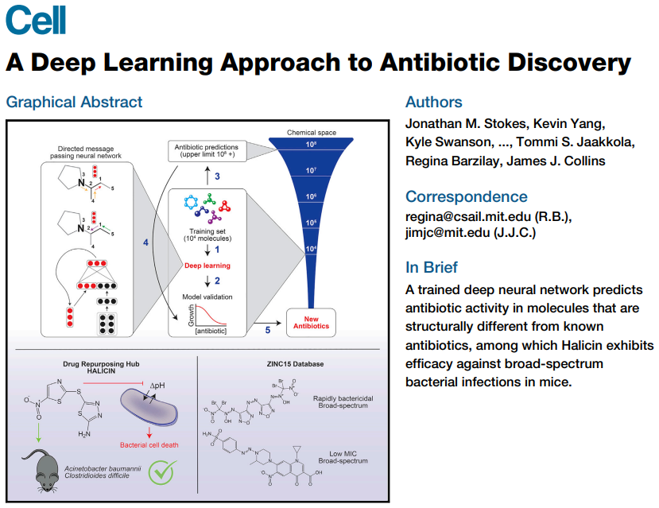]

???

A second example is the use of graph neural networks to discover new drugs.

Discovering new drugs is a complex and expensive search problem, where the goal is to find molecules that will bind to a target protein and modulate its function. Unfortunately, this problem is difficult for two reasons:
- first, the search space is huge -- the space of all possible pharmacologically active molecules is estimated to be in the order of 10^60 molecules.
- second, the binding of a molecule to a protein is a complex process that is difficult to model. Laboratory experiments are necessary to evaluate the binding of a molecule to a protein, and these experiments are expensive and time-consuming.

Graph neural networks have been a breakthrough in this area, and have been able to predict the properties of molecules with high accuracy. 

In a sense, they can serve as a virtual laboratory that can be used to pre-screen millions of molecules in a matter of hours, thereby reducing the laboratory work to only the most promising candidates.

---

class: middle

## Weather forecasting with neural networks

.center.width-75[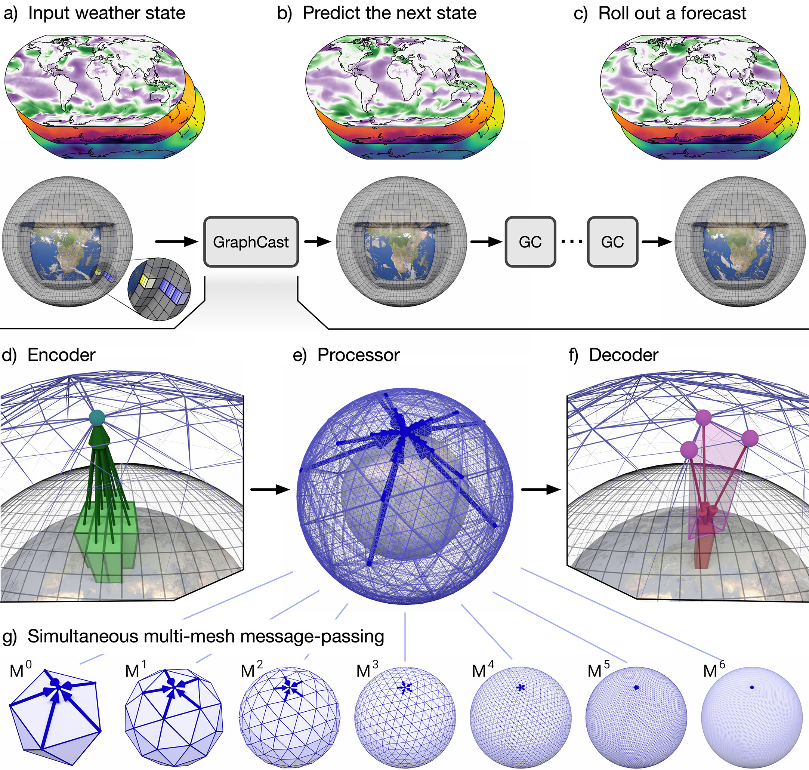]

???

GraphCast, 2023: a graph neural network on a multi-resolution mesh over the globe. Ten-day forecasts in under a minute on a single machine, more accurate than the operational physical model on most of the variables tested.

Panels d to g are the interesting part, and the reason this slide follows the previous one: the same message passing as for molecules, with the mesh wrapped around the planet instead.

This started a line that runs through GenCast and Google's WeatherNext models. The current one forecasts every hour, at 5 km resolution for temperature and humidity, drawn directly from raw satellite imagery. The architecture on this slide is what that line is built on.

---

class: middle

# From neural networks to agents

---

class: middle

## The breakthrough

.grid[
.kol-1-2.center[.width-100[<br>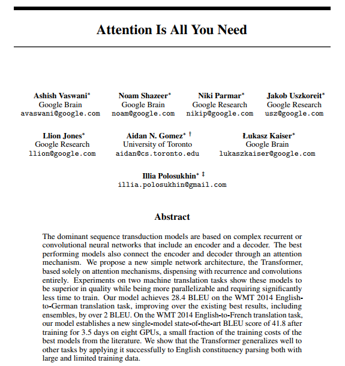 

Vaswani et al., 2017.]]
.kol-1-2[.width-100[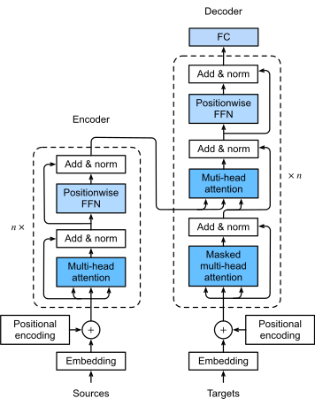]]
]

---

class: middle

.width-100[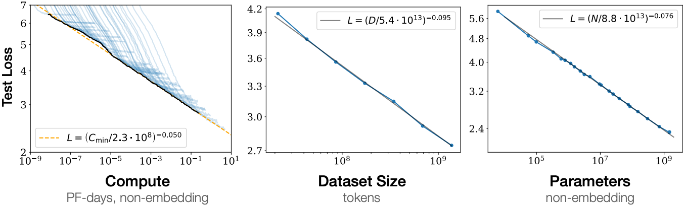]

A brutal simplicity: 
- The more data, the better the model.
- The more parameters, the better the model.
- The more compute, the better the model.

Scaling up further to gigantic models, datasets, and compute resources keeps pushing the boundaries of what is possible, .bold[with no sign of slowing down]$^\*$.

.footnote[*: At least up to 2025. Credits: [Kaplan et al.](https://arxiv.org/abs/2001.08361), 2020 (arXiv:2001.08361).]

???

The footnote: scaling pretraining alone is now bending. Since 2024, scaling also spends computation at inference time, which comes a few slides later with test-time scaling.

---

class: middle

.top-right[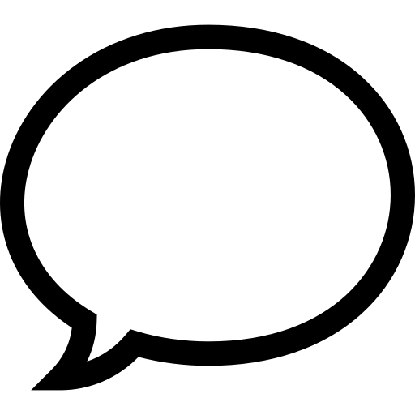]

## A role-playing transformer

The same next-word predictor, with a different prompt:

.prompt-box[
A helpful assistant is having a conversation with a user.

\[User\]: What should I visit in Liège?<br>
\[Assistant\]: \_\_\_
]

The model continues the document. Out comes the assistant.

???

The model is not an assistant. It writes one. It has read millions of dialogues, so it knows how a document of this shape continues.

ChatGPT, Claude and Gemini are transformers continuing a story about a helpful assistant. Replace the first line with "a sarcastic pirate" and the same model writes a sarcastic pirate.

---

class: middle

.top-right[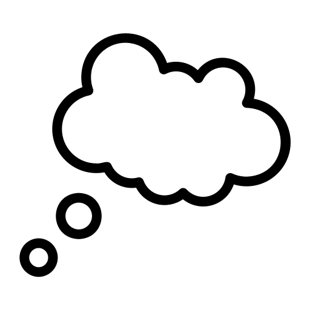]

## Reasoning by writing

As you would scribble on a whiteboard before answering a hard question, reasoning models .bold[write their thoughts down] before answering.

.prompt-box[
\[User\]: How many times does the letter r appear in "strawberry"?

.italic[\[Assistant, .red[thinking]\]: Let me spell it out: s, t, r, a, w, b, e, r, r, y.
The letter r is at positions 3, 8 and 9. [continues for as long as needed]]

\[Assistant\]: Three times.
]

???

Still next-word prediction. The draft is a scratchpad: each token of reasoning is computed from the previous ones, so a long draft buys computation that a one-shot answer cannot.

Reasoning models appeared in 2024 (OpenAI o1) and are now the default.

Counting letters was a textbook failure of models answering in one shot.

---

class: middle

.center.width-80[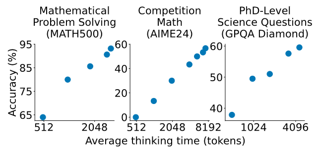]

.center[Test-time scaling: letting the model think longer improves its answers.]

.footnote[Credits: [Muennighoff et al.](https://arxiv.org/abs/2501.19393), 2025 (arXiv:2501.19393).]

???

A second scaling law. Until 2024, scaling meant bigger models trained on more data. Since 2024, it also means more computation at inference: the same weights, allowed to write more before answering, solve harder problems.

The x-axis is the number of thinking tokens, the y-axis the accuracy on hard math and science questions. Roughly log-linear, like the training scaling laws.

The price is paid at every query, in time and energy.

---

class: middle

## Learning to reason

.grid[
.kol-1-2[
Nobody writes the reasoning for the model. It is learned by .bold[reinforcement learning]: the model tries, a program checks the final answer, and successful attempts are reinforced.

Over training, the model learns by itself to think longer, to check its work and to change strategy.
]
.kol-1-2[.width-100[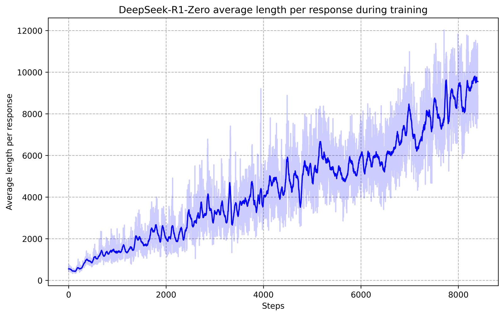]]
]

.footnote[Credits: [Guo et al.](https://doi.org/10.1038/s41586-025-09422-z), Nature, 2025 (DeepSeek-R1).]

???

DeepSeek-R1-Zero (January 2025), the variant trained by reinforcement learning alone, with no example of reasoning; DeepSeek-R1 itself was first fine-tuned on a few thousand curated chains of thought. The model is rewarded mainly for correct final answers on math and code problems. The plot shows the average length of its responses growing during training: nobody asked for longer thinking; it emerged because it pays off.

This is reinforcement learning, the topic of Lecture 9. Barto and Sutton received the Turing Award in 2025 for its foundations.

---

class: middle

## From assistant to agent

If a model can .bold[think] by writing, it can also .bold[act] by writing.

.prompt-box[
\[Assistant\]: Let me run the tests.

\[Tool call\]: bash("pytest tests/")

\[Tool result\]: 41 passed, 2 failed: test_search.py::test_astar ...

\[Assistant\]: The heuristic in astar() is not admissible. Let me fix it.
]

A transformer in a loop, whose .bold[tool calls] are intercepted, executed, and fed back into the conversation, is an .bold[agent]. The program that runs this loop is its .bold[harness].

???

The model writes text that looks like a command. A program around it watches for that pattern, runs the command, and pastes the result back. The model reads the result and continues.

Tools can be anything: a shell, a browser, a file system, a database, another model.

The harness is everything around the model: instructions and context, tools, memory across long tasks, permissions and sandboxing, sub-agents. Examples: Claude Code, Codex. The same model can do much better or much worse depending on its harness.

This is the agent of Lecture 1: tool results are its percepts, tool calls its actions.

---

class: middle, center, black-slide

<iframe width="600" height="450" src="https://www.youtube.com/embed/o5uvDZ8srHA" frameborder="0" allowfullscreen></iframe>

Code assistants (Cursor; Electroscope, 2024)

---

class: middle, black-slide, center

<iframe width="600" height="450" src="https://www.youtube.com/embed/fWWCdqyYRPI" frameborder="0" allowfullscreen></iframe>

Not just text, but also images and sounds (OpenAI, 2024)

---

class: middle, center, black-slide

<iframe width="600" height="450" src="https://www.youtube.com/embed/1QNsdr-Qx_I" frameborder="0" allowfullscreen></iframe>

Agents that use computers (OpenAI, GPT-6 Astra, 2026)

???

Released on September 3, 2026. OpenAI's claim: "anything you can do on a computer, Astra can do for you." State of the art on computer use, software engineering and science, according to OpenAI.

It is also the first OpenAI model to reach the "Critical" level of their internal cybersecurity scale, which is why some of its capabilities are restricted.

---

class: middle

## Swarms

One agent works in sequence. A .bold[swarm] runs many agents in parallel:
- an orchestrator splits the problem and assigns sub-tasks;
- groups of agents explore different approaches and share intermediate results;
- verifiers check what comes back;
- the best results are merged, and the loop continues.

Computation at inference now scales in two directions: .bold[longer] (thinking) and .bold[wider] (more agents).

???

Coding harnesses and research assistants now spawn sub-agents routinely.

Next: a swarm of about 10,000 agents.

---

class: middle

.center.width-50[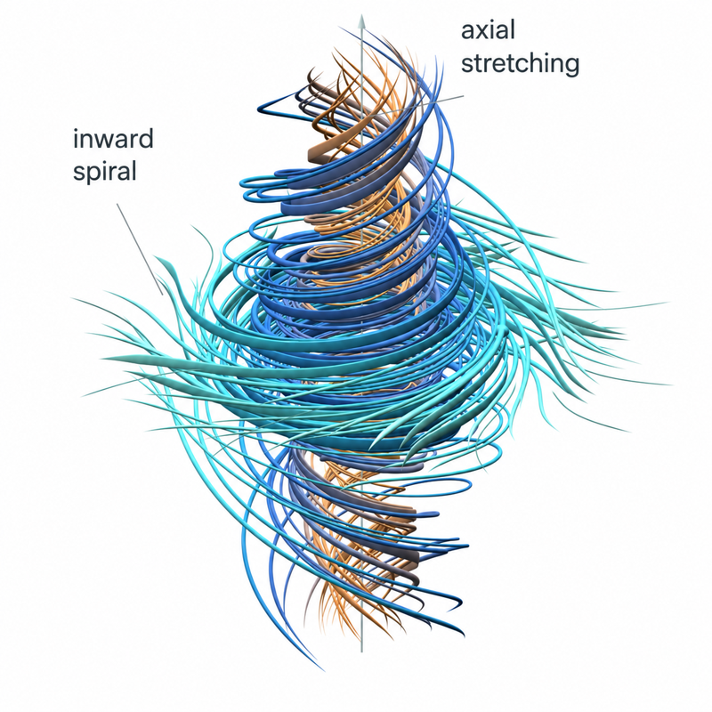]

.bold[The Navier–Stokes problem]. Can a fluid that starts smooth reach .bold[infinite speed] in finite time? A Millennium Prize Problem, open for about 90 years.

On September 8, 2026, OpenAI claimed a proof using a swarm of 10,000 agents running in parallel for 88 hours. It produced a formal proof checked by Lean.

.footnote[Credits: [OpenAI](https://openai.com/index/navier-stokes-solution/), 2026; [Nature](https://www.nature.com/articles/d41586-026-02842-5), 2026.]

???

The Navier–Stokes equations describe fluids as a continuum: weather, aircraft, blood flow. Leray (1934) showed that solutions exist in a generalized sense; whether they stay smooth was open. The claimed proof builds a vortex, pushed by a smooth force, that spirals inward and stretches, so that its speed blows up while its energy stays finite.

The agents ran an unreleased OpenAI model, had tools (a cached copy of the internet, code execution) and were organized in groups that shared results. They wrote about 130 billion tokens; the Lean check took 17 more hours. A simpler problem, the Euler equations without viscosity, fell first: nearly 100 agents, about 50 hours. OpenAI then moved its agents to Navier–Stokes.

Everything from the previous slides is in this run: reasoning, computation at inference, tools, a harness, a swarm and a verifier.

The result is one week old and has not been refereed. The Lean check is strong evidence.

Questions to mention:
- Credit. Alpöge and Buckmaster had released a result on the Euler equations the day before, obtained with Claude and Codex. OpenAI recognizes their priority on it; Buckmaster questioned how OpenAI's system arrived at the same approach, which OpenAI says it found independently (Nature, Fortune, September 2026).
- Insight. A proof found by 10,000 agents answers the question, but may teach mathematicians little. Terence Tao: "The indiscriminate strip-mining of open problems for solutions may destroy the ecosystem from which the next generation of mathematical techniques, problems, and practitioners would have developed."

---

class: middle

# Now what?

---


class: middle

.center.width-10[]

## The good

- AI is a tool capable of automating tedious tasks.
- AI can solve complex tasks that no one could solve before.
- The human-machine interface is changing radically, with conversational assistants making digital tools more accessible.
- Agents carry out long, multi-step tasks, from software engineering to mathematics.
- Progress continues at a breakneck pace.

---

class: middle

.center.width-10[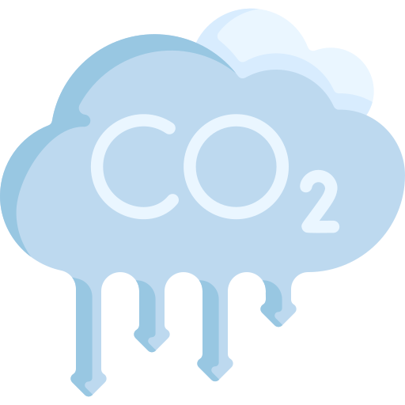]

## The bad

- Deep learning models are difficult to inspect, debug and explain.
- AI systems can fail in unexpected and catastrophic ways, despite apparent precision.
- Agents act on the world: their mistakes compound over long tasks, and their capabilities (e.g., in cybersecurity) can be misused.
- AI generates a lot of low-quality content ("AI slop") that pollutes information and devalues human creative work.
- Deep learning models have become very large and require significant computational resources, with significant environmental consequences.

---

class: middle

.grid[
.kol-1-3[<br>.center.width-100[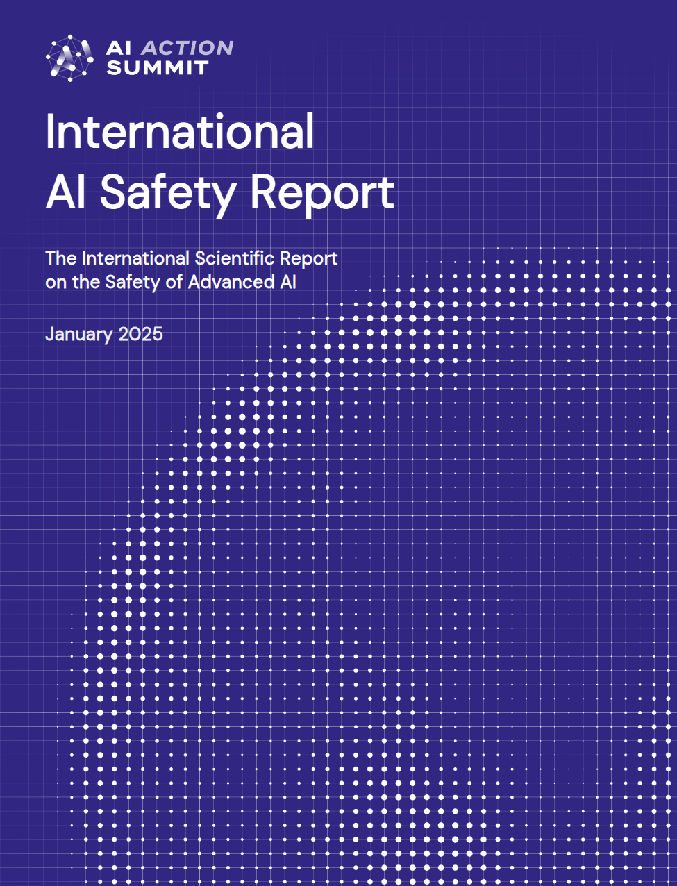]]
.kol-2-3[.center.width-100[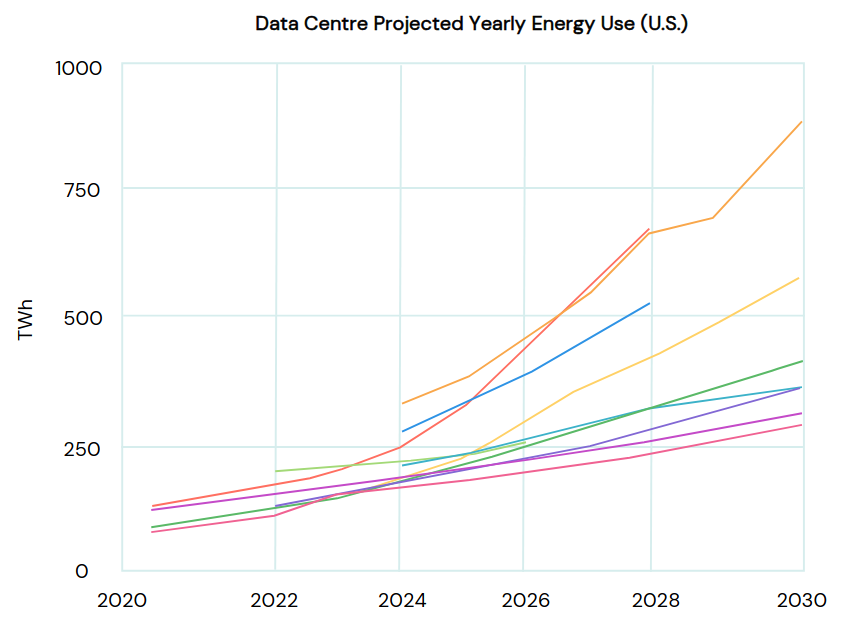]]
]

"General-purpose AI is a moderate but rapidly growing contributor to global environmental impacts through energy use and greenhouse gas (GHG) emissions. Current estimates indicate that .bold[data centres and data transmission account for an estimated 1% of global energy-related GHG emissions, with AI consuming 10–28% of data centre energy capacity]. AI energy demand is expected to grow substantially [...]"

.footnote[Credits: [Bengio et al.](https://arxiv.org/abs/2501.17805), 2025 (arXiv:2501.17805).]

---

class: middle

.center.width-10[]

## The ugly

- AI models are biased and can perpetuate discrimination.
- Malicious uses of AI are becoming more frequent (deep fakes, bots, manipulation, etc).
- In all areas of society, a dependence on AI is settling in, with risks of dehumanization, loss of control, and loss of cognitive skills.

---

class: middle

.center.width-100[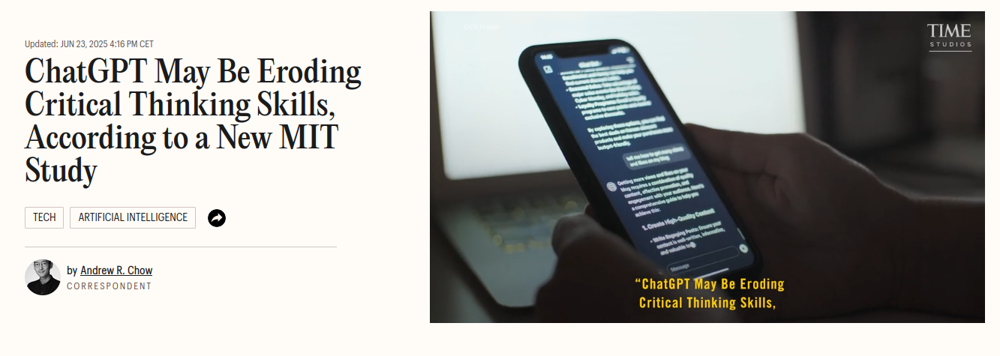]

"Students who used ChatGPT while completing SAT-style essays showed the lowest levels of brain activity. Furthermore, their writing became increasingly formulaic, forgettable, and lacking original thought. Over time, students became increasingly passive and disengaged. Many couldn’t recall what they’d written or revise their work without AI support, proof that .bold[they weren’t truly learning]."

.footnote[Credits: [TIME](https://time.com/7295195/ai-chatgpt-google-learning-school/), 2025 (image); [Oxford Learning](https://oxfordlearning.com/is-chatgpt-harming-students-thinking-skills-heres-what-parents-need-to-know/), 2025 (quote); study by [Kosmyna et al.](https://arxiv.org/abs/2506.08872), 2025 (arXiv:2506.08872).]

---

class: middle, black-slide

.grid[
.kol-1-2[.center.width-80[]]
.kol-1-2[
<br>

<p style="font-family: Georgia, 'Times New Roman', serif; font-size: 1.7em; line-height: 1.3; margin: 0 0 0.6em 0;">That’s the thing nobody warns you about.</p>

<p style="font-family: Georgia, 'Times New Roman', serif; font-size: 1.7em; line-height: 1.3; margin: 0 0 1.6em 0; color: #c79140;">Not that it will fail.<br>That it&nbsp;won’t.</p>

.italic[Atrophy], a novella<br>
[glouppe.github.io/atrophy](https://glouppe.github.io/atrophy/)
]
]

???

My novella (2026), about a student in your situation: first year of computer science, with an AI tab always open. Its page notes: "Every sentence by Claude."

---

exclude: true
class: middle

## What is missing?

Intelligence is not just about .bold[pattern recognition], which is something most of these works are based on.

It is about .bold[modeling the world]:
- explaining and understanding what we see;
- imagining things we could see but haven't yet;
- problem solving and planning actions to make these things real;
- building new models as we learn more about the world.

---

class: middle

# INFO8006 Introduction to AI

---

class: middle

## Why this course?

The systems of the previous slides are built on the ideas of this course:
- an agent in a loop with its environment (Lecture 1);
- reasoning as search, and planning against an adversary (Lectures 2 and 3);
- beliefs under uncertainty, and over time (Lectures 4 to 6);
- neural networks and learning from data (Lecture 7);
- decisions and reinforcement learning, which teaches models to reason (Lectures 8 and 9).

We build these ideas from first principles, on problems small enough to understand exactly why an agent behaves as it does.

---

# Course outline

- Lecture 0: Artificial intelligence
- Lecture 1: Intelligent agents
- Lecture 2: Solving problems by searching
- Lecture 3: Games and adversarial search
- Lecture 4: Quantifying uncertainty
- Lecture 5: Probabilistic reasoning
- Lecture 6: Reasoning over time
- Lecture 7: Machine learning and neural networks
- Lecture 8: Making decisions
- Lecture 9: Reinforcement learning

---

class: middle, center

.width-50[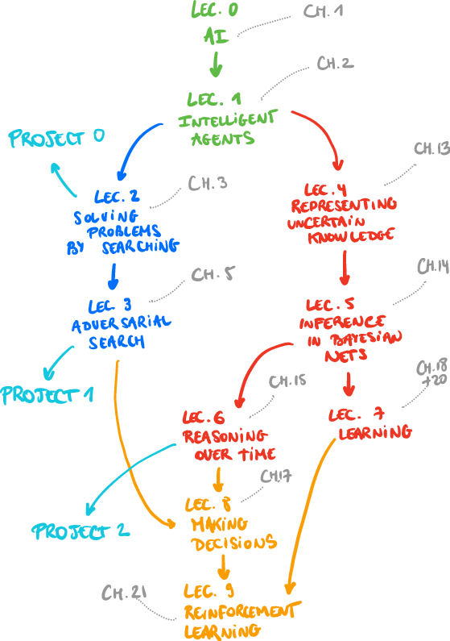]

---

class: middle

## My mission

By the end of this course, you will have built autonomous agents that efficiently make decisions in fully informed, partially observable and adversarial settings. Your agents will draw inferences in uncertain and unknown environments and optimize actions for arbitrary reward structures. 

The models and algorithms you will learn in this course apply to a wide variety of artificial intelligence problems and will serve as the foundation for further study in any application area (from engineering and science, to business and medicine) you choose to pursue.

---

class: middle

## Going further

This course is designed as an introduction to the many other courses available at ULiège and (broadly) related to AI, including:

- INFO8006: Introduction to Artificial Intelligence $\leftarrow$ .bold[you are there]
- DATS0001: Foundations of Data Science
- ELEN0062: Introduction to Machine Learning
- INFO8010: Deep Learning
- INFO8004: Advanced Machine Learning
- INFO9023: Machine Learning Systems Design
- INFO8003: Reinforcement learning
- INFO0948: Introduction to Intelligent Robotics
- INFO9014: Knowledge representation and reasoning
- ELEN0016: Computer vision

???

Mention pre-requisites:
- programming experience
- probability theory


---

class: end-slide, center
count: false

The end.
