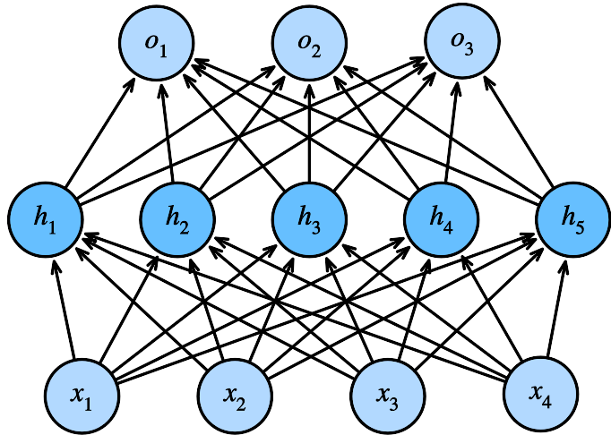

class: middle, center, title-slide

# Introduction to Artificial Intelligence

Lecture 0: Artificial Intelligence

<br><br>
Prof. Gilles Louppe<br>
[g.louppe@uliege.be](mailto:g.louppe@uliege.be)

---

class: middle, center
background-color: #343541

<video src="./figures/lec0/chatgpt.webm" autoplay loop muted width=640 height=640></video>

???

The elephant in the room. ChatGPT.

In november 2022, OpenAI released ChatGPT, a chatbot interface to GPT-3, a neural network trained on a very large corpus of text.

For the first time, the public got access through a simple web interface to a model that can generate text that is indistinguishable from human-written text. You can ask any question to the model, and it will answer, however complex or bizarre the question is.

For instance, in the video, I am asking ChatGPT to prepare a 1-day itinerary for a trip to Liège, Belgium, and it is answering me with a detailed itinerary, including the names of the places to visit, general information about the city, etc. I can also instruct ChatGPT to pretend that it knows all the hidden secrets of the city and revise its itinerary accordingly.

I am quite sure many of you have already used ChatGPT more or less seriously, so there is no need to introduce it further. However, I believe we can all agree that this is a very impressive technology and that it marks a milestone in the history of AI.

---

class: middle, center

.grid[
.kol-1-2[

<br><br><br><br><br><br>

One simple idea:

.bold[Guess the next word]

]
.kol-1-2[.center.width-70[]]
]

???

Despite its impressive performance and its apparent complexity, the underlying principle of ChatGPT is actually very simple.

The model is trained to guess the next word in a sentence. That's it.

It is the same principle that is used in your phone to autocomplete your messages, except that the model is much larger and has been trained on a much larger corpus of text.

What is interesting with the guess-the-next-word problem is that it is a very simple problem, but that it is also a very hard problem. It is simple because it is easy to understand, but it is hard because there are many possible next words. It is also hard because the context of a word is not always enough to predict the next word. Sometimes, we need to know more about the world to make a prediction.

---

class: middle
count: false

```
In the 1960s, Armstrong ____
```

???

Ambiguous! Louis Armstrong or Neil Armstrong?

Possible completions: played, sang, walked, flew

---

class: middle
count: false

```
In the 1960s, Armstrong performed ___
```

???

Now leaning towards Louis Armstrong.

Possible completions: jazz, music, trumpet solos, ...

---

class: middle
count: false

```
In the 1960s, Armstrong performed a moonwalk ___
```

???

Twist!

Possible completions: on stage, during a concert, in a jazz club, ...

---

class: middle
count: false

```
In the 1960s, Armstrong performed a moonwalk on the ___
```

???

Dramatic shift of context!

Most likely completion: moon

---

class: middle
count: false

```
In the 1960s, Armstrong performed a moonwalk on the lunar ___
```

???

Further narrowing down the context!

Possible completions: surface, landscape, terrain, ...

---

class: middle
count: false

```
In the 1960s, Armstrong performed a moonwalk on the lunar surface 
and said ___
```

???

Very specific context!

Possible completions: "That's one small step for man, one giant leap for mankind."

---

class: middle

This explains why large language models ...
- never produce the same answers;
- cannot count, compute, or reason*;
- invent things and cannot cite sources;
- can hardly correct their own mistakes once they have been made.

.footnote[*: At least not with a vanilla transformer and a greedy decoding strategy.]

---

class: middle

.center.circle.width-30[]

.italic[What does it mean to predict the next token well enough? It's actually [...] a deeper question than it seems. Predicting the next token well means that you understand the underlying reality that led to the creation of that token.]

.pull-right[Ilya Sutskever, 2023.]

---

class: middle

# Artificial Intelligence

---

class: middle, center

.width-70[]

"With artificial intelligence we are summoning the demon" -- Elon Musk, 2014.

???

Triggers a rich imagination fueled by science-fiction.

---

class: middle, center

.width-60[]

"We're really closer to a smart washing machine than Terminator" -- Fei-Fei Li, Director of Stanford AI Lab, 2017.

???

The reality is quite different...

---

class: middle, center, black-slide

<iframe frameborder="0" width="600" height="480" src="https://www.dailymotion.com/embed/video/x7kvtfn" allowfullscreen></iframe>

Yann LeCun, 2018.

---

class: middle, center, black-slide

<iframe width="600" height="450" src="https://www.youtube.com/embed/DsBGaHywRhs" frameborder="0" allowfullscreen></iframe>

Geoffrey Hinton, 2023.

---

class: middle, center, black-slide

<iframe width="600" height="450" src="https://www.youtube.com/embed/YdaRd_vitLw" frameborder="0" allowfullscreen></iframe>

Yann LeCun, 2023.

---

# A definition of AI?

<br>

.center.circle.width-40[]

.center["Artificial intelligence is the science of making machines do things that would require intelligence if done by men." -- Marvin Minsky, 1968.]

???

But what is intelligence anyway? 

---

class: middle

## The Turing test

A computer passes the **Turing test** (aka the Imitation Game) if a human operator, after posing some written
questions, cannot tell whether the written responses come from a person or from
a computer.

.grid[
.kol-2-3[
.width-80.center[<br>]
]
.kol-1-3.center[
.width-100.circle[]
.caption[Can machines think?<br> (Alan Turing, 1950)]
]
]

???

The Turing test is an *operational* definition of intelligence.

---

class: middle

An agent would not pass the Turing test without the following **requirements**:

- natural language processing
- knowledge representation
- automated reasoning
- machine learning
- computer vision (total Turing test)
- robotics (total Turing test)

Despite being proposed almost 70 years ago, the Turing test is *still relevant*
today.

---

class: middle

The Turing test tends to focus on *human-like errors*, *linguistic tricks*, etc.

However, it seems more important to study the **principles** underlying intelligence than to replicate an exemplar.

---

class: middle, center, black-slide

.center.width-80[]

Aeronautics is not defined as the field of making machines<br> that fly
so exactly like pigeons that they can fool even other pigeons.

---

class: middle

## A modern definition of AI

An ‘AI system’ is a machine-based system that is designed to operate with varying levels of autonomy and that may exhibit adaptiveness after deployment, and that, for explicit or implicit objectives, infers, from the input it receives, how to generate outputs such as predictions, content, recommendations, or decisions that can influence physical or virtual environments. -- European AI Act, Article 3, 2024.

.footnote[[Regulation (EU) 2024/1689](https://eur-lex.europa.eu/legal-content/EN/TXT/HTML/?uri=OJ%3AL_202401689#d1e2090-1-1).]

???

Very broad definition! 

Does encompass modern deep learning models, but also many other systems.

Is a thermostat an AI system?

---

# A short history of AI

## 1940-1950: Early days
- 1943: McCulloch and Pitts: Boolean circuit model of the brain.
- 1950: Turing's "Computing machinery and intelligence".

## 1950-1970: Excitement and expectations
- 1950s: Early AI programs, including Samuel's checkers program,
Newell and Simon's Logic Theorist and Gelernter's Geometry Engine.
- 1956: Dartmouth meeting: "Artificial Intelligence" adopted.
- 1958: Rosenblatt invents the perceptron.
- 1965: Robinson's complete algorithm for logical reasoning.
- 1966-1974: AI discovers computational complexity.

---

class: middle

.width-60.center[]

## The Darthmouth workshop (1956)

.italic[The study is to proceed on the basis of the conjecture that every aspect of learning or any other feature of intelligence can in principle be *so precisely described* that a machine can be made to simulate it.]

---

class: middle, center, black-slide

<iframe width="600" height="450" src="https://www.youtube.com/embed/aygSMgK3BEM" frameborder="0" allowfullscreen></iframe>

---

class: middle

## 1970-1990: Knowledge-based approaches
- 1969: Neural network research almost disappears after Minsky and Papert's book (1st AI winter).
- 1969-1979: Early development of knowledge-based systems.
- 1980-1988: Expert systems industrial boom.
- 1988-1993: Expert systems industry busts  (2nd AI winter).

---

class: middle

## 1990-Present: Statistical approaches
- 1985-1995: The return of neural networks.
- 1988-: Resurgence of probability, focus on uncertainty, general increase in technical depth.
- 1995-2010: New fade of neural networks.
- 2000-: Availability of very large datasets.
- 2010-: Availability of fast commodity hardware (GPUs).
- 2012-: Resurgence of neural networks with  deep learning approaches.
- 2017: Attention is all you need (transformers).
- 2022: ChatGPT released to the public.

---

class: middle

# The deep learning revolution

---

class: middle

.center.width-40[]

.footnote[Credits: François Fleuret, 2023.]

???

When you start a project in artificial intelligence or machine learning, one of the very first steps, and this is something I keep repeating to my students, is to look at the data. Take the raw data and visualize it.

The data I want to start with today is related to blood pressure. We have a dataset of 30 patients, with their age and their blood pressure shown as points on the plot. This is a very simple dataset, and the problem is not very interesting in itself, but it is a good example to illustrate how we can use machine learning to make predictions.

Let's start with a simple question: can we predict the blood pressure of a patient based on his or her age?

In other words, can we write a computer program that, given the age of a patient, will make a guess about his or her blood pressure?

---

class: middle
count: false

.width-100[]

.footnote[Credits: François Fleuret, 2023.]

???

The machine learning approach to this problem is not hardcode some made-up computer program that would take the age of a patient and return a blood pressure. Instead, the machine learning approach is to write a computer program that will learn to make predictions by itself, by looking at the data.

---

class: middle
count: false

.width-100[]

.footnote[Credits: François Fleuret, 2023.]

???

To do so, we need to define a model, a mathematical function that will take the age of a patient as input and return a prediction of his or her blood pressure. 

Often, this model is a function with parameters. The parameters are the knobs of the model, and we will tune them to make the best predictions.

The simplest example is the linear model, which is a function of the form `y = ax + b`, where `a` and `b` are the parameters to be learned, the two knobs that we can turn to change the behavior of the model.

To find the best parameter values, we will use the data to train the model. This means that we will show the model the data, make it make predictions, and then adjust its parameters to reduce the error between its predictions and the true blood pressure values.

This process can be described mathematically and implemented in a computer program. This is what we call the training of the model.

---

class: middle
count: false

.width-100[]

.footnote[Credits: François Fleuret, 2023.]

---

class: middle
count: false

.width-100[]

.footnote[Credits: François Fleuret, 2023.]

---

class: middle
count: false

.width-100[]

.footnote[Credits: François Fleuret, 2023.]

---

class: middle
count: false

.width-100[]

.footnote[Credits: François Fleuret, 2023.]

---

class: middle
count: false

.width-100[]

.footnote[Credits: François Fleuret, 2023.]

---

class: middle
count: false

.width-100[]

.footnote[Credits: François Fleuret, 2023.]

---

class: middle

Deep learning .bold[scales up] the statistical and machine learning approaches by
- using larger models known as neural networks,
- training on larger datasets,
- using more compute resources.

.grid[
.kol-3-4.width-70.center[]
.kol-1-4.width-90.center[<br>]
]

???

[Talk about the slide first.]

Scaling up the statistical and machine learning approaches by brute force in these three dimensions has been key to the success of deep learning.

---

class: middle

Specialized neural networks can be trained achieve super-human performance on many complex tasks that were previously thought to be out of reach for machines.

.width-100[]

.width-100[]

.center[(Top) Scene understanding, pose estimation, geometric reasoning.<br>
(Bottom) Planning, Image captioning, Question answering.]

.footnote[Credits: François Fleuret, 2023.]

???

Following this approach, deep learning has been successful in tasks that were previously considered hard for computers, such as understanding images, speech, or text.

In particular, specialized neural networks can be trained to solve a large variety of problems, from scene understanding to geometric reasoning, from planning to question answering.

While these problems can be perceived as artificial and not really important in their own right, they actually form a set of primitive tasks that are found in many domains of application. 

---

class: middle

Neural networks form .bold[primitives] that can be transferred to many domains. 

.grid[
.kol-1-3.center.width-100[]
.kol-1-3.center.width-80[]
.kol-1-3.center.width-80[]
]
.width-100[]

.center[(Top) Analysis of histological slides, denoising of MRI images, nevus detection.<br>
(Bottom) Whole-body hemodynamics reconstruction from PPG signals.]

???

For example, in health and medicine, the same specialized neural networks that are used to annotate scenes can be used to analyze biomedical images, such as histological slides.

Specialized neural networks can also be used to denoise MRI images, to detect nevus, or to reconstruct whole-body hemodynamics from PPG signals, if some of you have an Apple Watch.

As a matter of fact, the adoption of AI and deep learning in health and medicine has been growing steadily over the past decade, with many applications in medical imaging, genomics, and many more. 

These applications however, are often deeply embedded in the tools used by healthcare professionals, and are not always visible to the public.

---

class: middle, center, black-slide

<iframe width="600" height="450" src="https://www.youtube.com/embed/hA_-MkU0Nfw" frameborder="0" allowfullscreen></iframe>

Autonomous cars (Waymo, 2022)

---

class: middle, black-slide, center

<iframe width="600" height="450" src="https://www.youtube.com/embed/zrcxLZmOyNA" frameborder="0" allowfullscreen></iframe>

Powering the future of clean energy (NVIDIA, 2023)

---

class: middle, black-slide, center

<iframe width="600" height="450" src="https://www.youtube.com/embed/AbdVsi1VjQY" frameborder="0" allowfullscreen></iframe>

How AI is advancing medicine (Google, 2018)

---


class: middle, center

Deep learning can also .bold[solve problems that no one could solve before].

???

Beyond the basic work that can be automated, the most exciting applications of AI, at least for the scientist in me, is the fact that deep learning can also be used to solve problems that no one could solve before. To make discoveries. 

I have many examples in mind, but I will only mention a few today, to give you a sense of what is possible. I will focus on health and medicine, but the same is true in many other domains.

---

class: middle

## AlphaFold: From a sequence of amino acids to a 3D structure

.grid[
.kol-2-3.center.width-100[]
.kol-1-3.center[.width-100[]
.width-80[]]
]

???

The first example is AlphaFold, a neural network based on the trasnformer architecture that can predict the 3D structure of a protein from its amino acid sequence.

This problem is important because the 3D structure of a protein determines its function, and understanding protein function is key to understanding biology and designing new drugs.

However, determining the 3D structure of a protein experimentally is difficult and expensive, taking up to months just to solve a single structure. 

AlphaFold has been a breakthrough in this area, and has been able to predict the 3D structure of proteins with high accuracy, in just a couple of minutes for the longest sequences.

---

class: middle, black-slide, center

<iframe width="600" height="450" src="https://www.youtube.com/embed/gg7WjuFs8F4" frameborder="0" allowfullscreen></iframe>

AI for Science (Deepmind, AlphaFold, 2020)

---


class: middle

## Drug discovery with graph neural networks

.center.width-80[]

???

A second example is the use of graph neural networks to discover new drugs.

Discovering new drugs is a complex and expensive search problem, where the goal is to find molecules that will bind to a target protein and modulate its function. Unfortunately, this problem is difficult for two reasons:
- first, the search space is huge -- the space all possible pharmacologically active molecules is estimated to be in the order of 10^60 molecules.
- second, the binding of a molecule to a protein is a complex process that is difficult to model. Laboratory experiments are necessary to evaluate the binding of a molecule to a protein, and these experiments are expensive and time-consuming.

Graph neural networks have been a breakthrough in this area, and have been able to predict the properties of molecules with high accuracy. 

In a sense, they can serve as a virtual laboratory that can be used to pre-screen millions of molecules in a matter of hours, thereby reducing the laboratory work to only the most promising candidates.

---

class: middle

## GraphCast: fast and accurate weather forecasts

.center.width-75[]

---

class: middle

## The breakthrough

.grid[
.kol-1-2.center[.width-100[<br> 

Vaswani et al., 2017.]]
.kol-1-2[.width-100[]]
]

---

class: middle

.width-100[]

A brutal simplicity: 
- The more data, the better the model.
- The more parameters, the better the model.
- The more compute, the better the model.

Scaling up further to gigantic models, datasets, and compute resources keeps pushing the boundaries of what is possible, .bold[with no sign of slowing down].

---

class: middle, center, black-slide

<iframe width="600" height="450" src="https://www.youtube.com/embed/-dWfl7Dhb0o" frameborder="0" allowfullscreen></iframe>

Conversational AI assistants (Anthropic, 2024)

---

class: middle, center, black-slide

<iframe width="600" height="450" src="https://www.youtube.com/embed/o5uvDZ8srHA" frameborder="0" allowfullscreen></iframe>

Code assistants (Cursor, 2024)

---

class: middle, black-slide, center

<iframe width="600" height="450" src="https://www.youtube.com/embed/fWWCdqyYRPI" frameborder="0" allowfullscreen></iframe>

Not just text, but also images and sounds (OpenAI, 2024)

---

class: middle

# Now what?

---


class: middle

.center.width-10[]

## The good

- AI is a tool capable of automating tedious tasks.
- AI can solve complex tasks that no one could solve before.
- The human-machine interface is changing radically, with conversational assistants making digital tools more accessible.
- Progress continues at a breakneck pace.

---

class: middle

.center.width-10[]

## The bad

- Deep learning models are difficult to inspect, debug and explain.
- AI systems can fail in unexpected and catastrophic ways, despite apparent precision.
- AI generates a lot of low-quality content ("AI slop") that pollutes information and devalues human creative work.
- Deep learning models have become very large and require significant computational resources, with significant environmental consequences.

---

class: middle

.grid[
.kol-1-3[<br>.center.width-100[]]
.kol-2-3[.center.width-100[]]
]

"AI is a moderate but rapidly growing contributor to global environmental impacts through energy use and greenhouse gas (GHG) emissions. Current estimates indicate that .bold[data centres and data transmission account for an estimated 1% of global energy-related GHG emissions, with AI consuming 10–28% of data centre energy capacity]. AI energy demand is expected to grow substantially [...]"

.footnote[Credits: [Bengio et al.](https://arxiv.org/abs/2501.17805), 2025 (arXiv:2501.17805).]

---

class: middle

.center.width-10[]

## The ugly

- AI models are biased and can perpetuate discrimination.
- Malicious uses of AI are becoming more frequent (deep fakes, bots, manipulation, etc).
- In all areas of society, a dependence on AI is settling in, with risks of dehumanization, loss of control, and loss of cognitive skills.

---

class: middle

.center.width-100[]

"Students who used ChatGPT while completing SAT-style essays showed the lowest levels of brain activity. Furthermore, their writing became increasingly formulaic, forgettable, and lacking original thought. Over time, students became increasingly passive and disengaged. Many couldn’t recall what they’d written or revise their work without AI support, proof that .bold[they weren’t truly learning]."

---

exclude: true
class: middle

## What is missing?

Intelligence is not just about **pattern recognition**, which is something most of these works are based on.

It is about *modeling the world*:
- explaining and understanding what we see;
- imagining things we could see but haven't yet;
- problem solving and planning actions to make these things real;
- building new models as we learn more about the world.

---

class: middle

# INFO8006 Introduction to AI

---

# Course outline

- Lecture 0: Artificial intelligence
- Lecture 1: Intelligent agents
- Lecture 2: Solving problems by searching
- Lecture 3: Adversarial search
- Lecture 4: Quantifying uncertainty
- Lecture 5: Probabilistic reasoning
- Lecture 6: Reasoning over time
- Lecture 7: Machine learning and neural networks
- Lecture 8: Making decisions
- Lecture 9: Reinforcement learning

---

class: middle, center

.width-50[]

---

class: middle

## My mission

By the end of this course, you will have built autonomous agents that efficiently make decisions in fully informed, partially observable and adversarial settings. Your agents will draw inferences in uncertain and unknown environments and optimize actions for arbitrary reward structures. 

The models and algorithms you will learn in this course apply to a wide variety of artificial intelligence problems and will serve as the foundation for further study in any application area (from engineering and science, to business and medicine) you choose to pursue.

---

class: middle

## Goals and philosophy

.italic[General]
- Understand the landscape of artificial intelligence.
- Be able to write from scratch, debug and run (some) AI algorithms.

.italic[Well-established and state-of-the-art algorithms] 
- Good old-fashioned AI: well-established algorithms for intelligent agents and their mathematical foundations.
- Introduction to materials new from research ($\leq$ 5 years old).
- Understand some of the open questions and challenges in the field.

.italic[Practical]
- Fun and challenging course projects.

---

class: middle

## Going further

This course is designed as an introduction to the many other courses available at ULiège and (broadly) related to AI, including:

- INFO8006: Introduction to Artificial Intelligence $\leftarrow$ **you are there**
- DATS0001: Foundations of Data Science
- ELEN0062: Introduction to Machine Learning
- INFO8010: Deep Learning
- INFO8004: Advanced Machine Learning
- INFO9023: Machine Learning Systems Design
- INFO8003: Optimal decision making for complex problems
- INFO0948: Introduction to Intelligent Robotics
- INFO9014: Knowledge representation and reasoning
- ELEN0016: Computer vision

???

Mention pre-requisites:
- programming experience
- probability theory


---

class: end-slide, center
count: false

The end.
