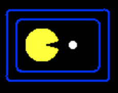

class: middle, center, title-slide

# Introduction to Artificial Intelligence

Lecture 1: Intelligent agents

  
Prof. Gilles Louppe 
[g.louppe@uliege.be](mailto:g.louppe@uliege.be)

???

R: go over the Intelligent agents part, formalize a bit more.
R: ^ really do this next year
R: draw the agent diagrams in draw.io

---

class: middle

# Intelligent agents

---

# Agents and environments

  
.width-80.center[]

---

class: middle

## Agents

- An **agent** is an entity that *perceives* its environment through sensors and
  take *actions* through actuators.

- The agent behavior is described by the **agent function**, or **policy**, that
  maps percept histories to actions:
  $$f : \mathcal{P}^* \to \mathcal{A}$$

- The **agent program** runs on the physical architecture to produce $f$.

---

class: middle

## Simplified Pacman world

.width-40.center[]

- Percepts: location and content, e.g. $(\text{left cell}, \text{no food})$
- Actions: $\text{go left}$, $\text{go right}$, $\text{eat}$, $\text{do nothing}$

???

Take the time to explain that the game is here different from the actual Pacman.

---

class: middle

## Pacman agent

Partial tabulation of a simple Pacman agent function:

| Percept sequence | Action |
| ---------------- | ------ |
| $(\text{left cell}, \text{no food})$     | $\text{go right}$ |
| $(\text{left cell}, \text{food})$     | $\text{eat}$ |
| $(\text{right cell}, \text{no food})$     | $\text{go left}$ |
| $(\text{left cell}, \text{food})$     | $\text{eat}$ |
| $(\text{left cell}, \text{no food}), (\text{left cell}, \text{no food})$     | $\text{go right}$ |
| $(\text{left cell}, \text{no food}), (\text{left cell}, \text{food})$     | $\text{eat}$ |
| (...) | (...) |

---

class: middle

## The optimal Pacman?

What is the **right** agent function?
How to formulate the *goal* of Pacman?
- 1 point per food collected up to time $t$?
- 1 point per food collected up to time $t$, minus one per move?
- penalize when too many foods are left not collected?

Can it be implemented in a *small* agent program?

---

# Rational agents

- Informally, a *rational agent* is an agent that does the "right thing".
- A **performance measure** evaluates a sequence of environment
  states caused by the agent's behavior.
- A rational agent is an agent that chooses whichever action that **maximizes** the
  *expected* value of the performance measure, given the percept sequence to date.

.center[]

.footnote[Image credits: [CS188](http://ai.berkeley.edu/lecture_slides.html), UC Berkeley.]

---

class: middle

- Rationality $\neq$ omniscience    
    - percepts may not supply all relevant information.
- Rationality $\neq$ clairvoyance
    - action outcomes may not be as expected.
- Hence, rational $\neq$ successful.
- However, rationality leads to *exploration*, *learning* and *autonomy*.

---

# Performance, environment, actuators, sensors

The characteristics of the performance measure, environment, action space and
percepts dictate techniques for selecting rational actions.

These characteristics are summarized as the **task environment**.

## Example 1: an autonomous car
- *performance measure*: safety, destination, legality, comfort, ...
- *environment*: streets, highways, traffic, pedestrians, weather, ...
- *actuators*: steering, accelerator, brake, horn, speaker, display, ...
- *sensors*: video, accelerometers, gauges, engine sensors, GPS, ...

---

class: middle

## Example 2: an Internet shopping agent
- *performance measure*: price, quality, appropriateness, efficiency
- *environment*: current and future WWW sites, vendors, shippers
- *actuators*: display to user, follow URL, fill in form, ...
- *sensors*: web pages (text, graphics, scripts)

---

# Environment types

- *Fully observable* vs. **partially observable**
    - Whether the agent sensors give access to the complete state of the environment, at each point in time.
- *Deterministic* vs. **stochastic**
    - Whether the next state of the environment is completely determined by the current state and the action executed by the agent.
- *Episodic* vs. **sequential**
    - Whether the agent's experience is divided into atomic independent episodes.
- *Static* vs. **dynamic**
    - Whether the environment can change, or the performance measure can change with time.
- *Discrete* vs. **continuous**
    - Whether the state of the environment, the time, the percepts or the actions are continuous.
- *Single agent* vs. **multi-agent**
    - Whether the environment include several agents that may interact which each other.
- *Known* vs **unknown**
    - Reflects the agent's state of knowledge of the "law of physics" of the environment.

---

class: middle

Are the following task environments fully observable? deterministic? episodic?
static? discrete? single agents? Known?

- Crossword puzzle
- Chess, with a clock
- Poker
- Backgammon
- Taxi driving
- Medical diagnosis
- Image analysis
- Part-picking robot
- Refinery controller
- The real world

---

# Agent programs

The job of AI is to design an **agent program** that implements the agent
function. This program will run on an *architecture*, that is a computing device
with physical sensors and actuators.

$$\text{agent} = \text{program} + \text{architecture}$$

## Implementation

Agent programs can be designed and implemented in many ways:

- with tables
- with rules
- with search algorithms
- with learning algorithms

---

# Table-driven agents

A *table-driven agent* determines its next action with a lookup table that contains the appropriate action for every possible percept sequence.

## Issues

- **Design issue:** one needs to anticipate all sequence of percepts and how the agent should respond.
- **Technical issue:** the lookup table will contain $\sum_{t=1}^T |\mathcal{P}|^t$ entries.
- Example (autonomous car): using a 30fps 640x480 RBG camera as sensor, this results in a table with over $10^{250000000000}$ entries for an hour of driving.

---

# Simple reflex agents

  
.center.width-80[]

???

Solution to huge tables: forget about the past!

Compress them using condition-action rules.

---

class: middle
- *Simple reflex agents* select actions on the basis of the current percept,
  ignoring the rest of the percept history.
- They implement **condition-action rules** that match the
  current percept to an action.
- Rules provide a way to *compress* the function table.
    - Example (autonomous car): If a car in front of you slow down, you should break.
      The color and model of the car, the music on the radio or the weather are all irrelevant.
- Simple reflex agents are simple but they turn out to have **limited intelligence**.
- They can only work in a *Markovian* environment, that is if the correct
  decision can be made on the basis of only the current percept.
  In other words, if the environment is fully observable.

---

# Model-based reflex agents

  
.center.width-80[]

???

Solution: do not actually forget about the past. Remember what you have seen so far by maintaining an internal representation of the world, a belief state.

Then map this state to an action.

---

class: middle

- *Model-based agents* handle partial observability of the environment by
  keeping track of the part of the world they cannot see now.

- The internal state of model-based agents is updated on the basis of a **model** which determines:
    - how the environment evolves independently of the agent;
    - how the agent actions affect the world.

---

# Goal-based agents

  
.center.width-80[]

???

It is not easy to map a state to an action because goals are not explicit in condition-action rules.

---

class: middle

- Principle:
    1. generate possible sequences of actions
    2. predict the resulting states
    3. assess **goals** in each.
- A *goal-based agent* chooses an action that will achieve the goal.
    - More general than rules. Goals are rarely explicit in condition-action rules.
    - Finding action sequences that achieve goals is difficult.
      *Search* and *planning* are two strategies.
- Example (autonomous car): Has the car arrived to destination?

---

# Utility-based agents

  
.center.width-80[]

???

Often there are several sequences of actions that achieve a goal. We should pick the best.

---

class: middle

- *Goals* are often not enough to generate high-quality behavior.
    - Example (autonomous car): There are many ways to arrive to destination, but some are quicker or more reliable.
    - Goals only provide binary assessment of performance.
- A **utility function** scores any given sequence of environment states.
    - The utility function is an internalization of the performance measure.
- A rational utility-based agent chooses an action that **maximizes the expected utility of its outcomes**.

---

# Learning agents

  
.center.width-80[]

---

class: middle

- *Learning agents* are capable of **self-improvement**. They can become more
  competent than their initial knowledge alone might allow.
- They can make changes to any of the knowledge components by:
    - learning how the *world* evolves;
    - learning what are the *consequences* of actions;
    - learning the utility of actions through *rewards*.

---

class: middle

## A learning autonomous car

- *Performance element*:
    - The current system for selecting actions and driving.
- The *critic* observes the world and passes information to the *learning element*.
    - E.g., the car makes a quick left turn across three lanes of traffic. The critic observes shocking language from the other drivers and informs bad action.
    - The learning element tries to modifies the performance element to avoid reproducing this situation in the future.
- The *problem generator* identifies certain areas of behavior in need of improvement and suggest experiments.
    - E.g., trying out the brakes on different surfaces in different weather conditions.

---

# Summary

- An **agent** is an entity that perceives and acts in an environment.
- The *performance measure* evaluates the agent's behavior. **Rational agents** act so as to maximize the expected value of the performance measure.
- *Task environments* includes performance measure, environment, actuators and sensors. They can vary along several significant dimensions.
- The **agent program** effectively implements the agent function. Their designs are dictated by the task environment.
- *Simple reflex agents* respond directly to percepts, whereas *model-based reflex agents* maintain internal state to track the world. *Goal-based agents* act to achieve goals while **utility-based agents** try to maximize their expected performance.
- All agents can improve their performance through **learning**.

???

Next week we will see how to implement our first agent, a goal-based agent based on search algorithms.

---

class: end-slide, center
count: false

The end.
