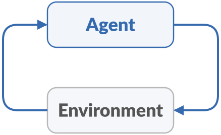
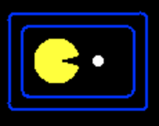
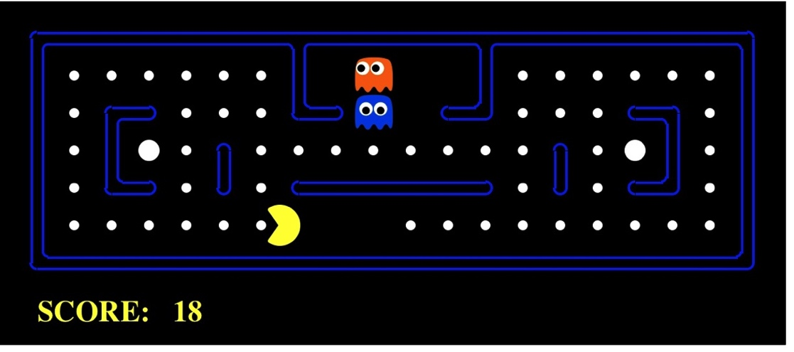
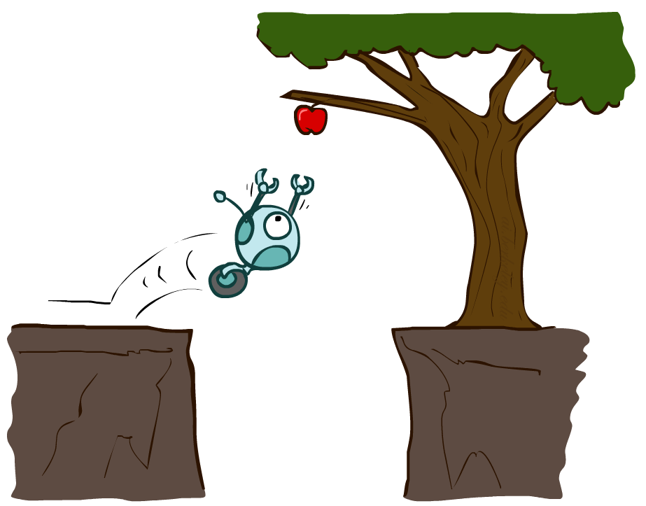
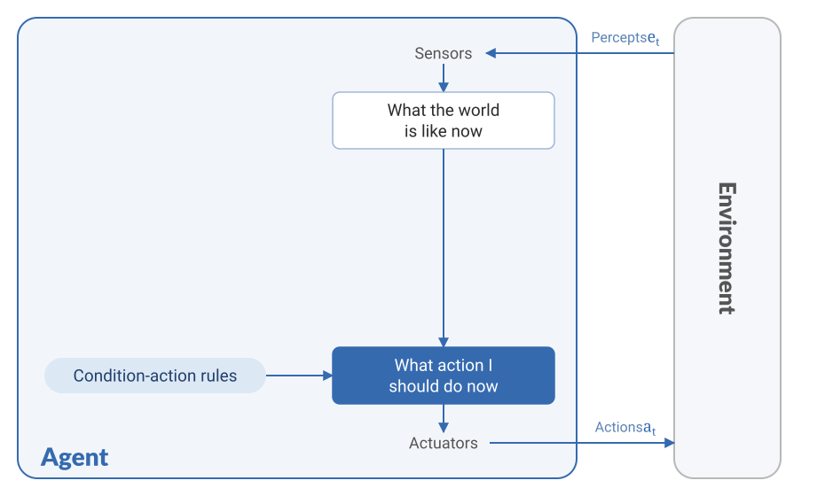
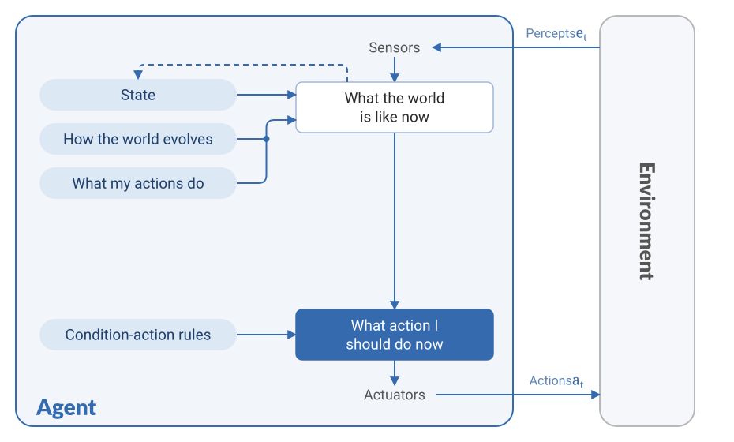
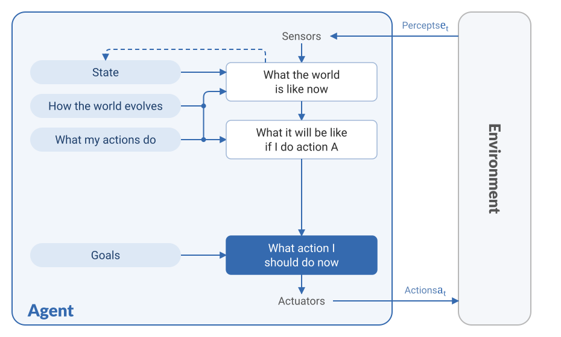
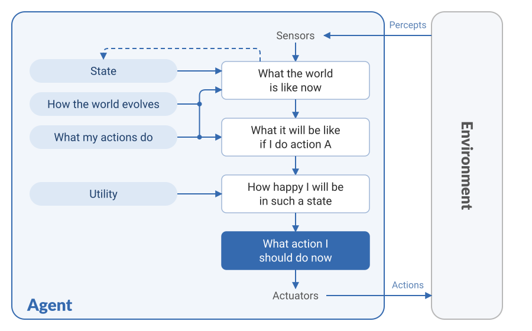
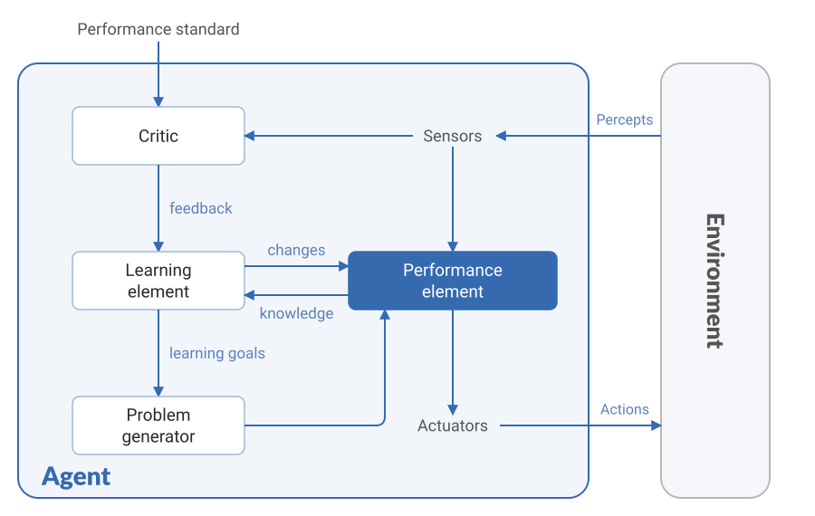

class: middle, center, title-slide

# Introduction to Artificial Intelligence

Lecture 1: Intelligent agents

  
Prof. Gilles Louppe 
[g.louppe@uliege.be](mailto:g.louppe@uliege.be)

---

class: middle

# Agents and environments

---

class: middle

.grid[
.kol-1-5.center[
   
Percepts $e\_t$
]
.kol-3-5.center[
.width-95[]
]
.kol-1-5[
   
Actions $a\_t$
]
]

---

# Agents

- An agent is an entity that .bold[perceives] its environment through sensors and takes .bold[actions] through actuators.

- At each time step $t$, the agent receives a percept ${e\_t \in \mathcal{P}}$ and takes an action ${a\_t \in \mathcal{A}}$, where $\mathcal{P}$ and $\mathcal{A}$ are the sets of possible percepts and actions.

- The agent's behavior is described by its .bold[policy] ${\pi : \mathcal{P}^\* \to \mathcal{A}}$, which maps the percept sequence to the next action, $$a\_t = \pi(e\_{1:t}),$$ where ${e\_{1:t} = (e\_1, \ldots, e\_t)}$ and $\mathcal{P}^\*$ is the set of all finite percept sequences.

---

class: middle

## Simplified Pacman world

.width-20.center[]

Let us consider a 2-cell world with a Pacman agent.
- Percepts: ${\mathcal{P} = \\{\text{left cell}, \text{right cell}\\} \times \\{\text{food}, \text{no food}\\}}$, the location of Pacman and the content of its cell, e.g. ${e\_1 = (\text{left cell}, \text{no food})}$.
- Actions: ${\mathcal{A} = \\{\text{go left}, \text{go right}, \text{do nothing}\\}}$. As in the game, there is no eat action: Pacman eats the food of its cell at each time step.

???

Take the time to explain that the game is here different from the actual Pacman.

---

class: middle

The .bold[policy] $\pi$ of a Pacman agent maps percept sequences ${e\_{1:t} \in \mathcal{P}^\*}$ to actions ${a\_t \in \mathcal{A}}$. It can be implemented as a table.

| Percept sequence $e\_{1:t}$ | Action $a\_t = \pi(e\_{1:t})$ |
| ---------------- | ------ |
| $(\text{left cell}, \text{no food})$     | $\text{go right}$ |
| $(\text{left cell}, \text{food})$     | $\text{go right}$ |
| $(\text{right cell}, \text{no food})$     | $\text{go left}$ |
| $(\text{right cell}, \text{food})$     | $\text{go left}$ |
| $(\text{left cell}, \text{no food}), (\text{right cell}, \text{food})$     | $\text{do nothing}$ |
| $(\text{left cell}, \text{food}), (\text{right cell}, \text{no food})$     | $\text{do nothing}$ |
| $\ldots$ | $\ldots$ |

???

The size of the table grows exponentially with the (maximum) length of the percept sequence! With $|\mathcal{P}| = 4$ percepts, there are $4^t$ percept sequences of length $t$.

Pacman eats the food of its cell whatever it does, so the food percept never changes the action. What matters is whether Pacman has already visited the other cell, which only the percept sequence tells.

---

class: middle, center, black-slide

.width-100.center[]

What about the actual Pacman?  How would you design its agent program to play optimally?

???

Run the program!

---

# Environments

The environment is in a .bold[state] ${s\_t \in \mathcal{S}}$. It starts in ${s\_1 \sim P(s\_1)}$, and at each time step $t$:
1. the agent perceives ${e\_t \sim P(e\_t \mid s\_t)}$, following the .bold[sensor model];
2. the agent acts ${a\_t = \pi(e\_{1:t})}$, following its policy;
3. the environment moves to ${s\_{t+1} \sim P(s\_{t+1} \mid s\_t, a\_t)}$, following the .bold[transition model].

When the environment is deterministic, we write ${s\_{t+1} = \text{result}(s\_t, a\_t)}$.

.footnote[Probabilities are covered in Lectures 4 to 6. For now, read "x ~ P(x | y)" as "x is drawn at random, given y".]

???

This is the loop of the first slide, written down. The next lectures refine each piece: search assumes known and deterministic transitions (Lectures 2 and 3), reasoning over time estimates $s\_t$ from $e\_{1:t}$ (Lecture 6), and Markov decision processes make the transitions stochastic (Lectures 8 and 9).

Observability and determinism are properties of the choice of state, not of the world: whether $e\_t = s\_t$, or whether $s\_{t+1}$ is a function of $s\_t$ and $a\_t$, depends on what $s\_t$ holds. The state must also hold what the performance measure depends on (next slide). Lecture 2 develops the choice: world states versus search states.

---

class: middle

## Simplified Pacman world, formally

- States: ${\mathcal{S} = \\{\text{left cell}, \text{right cell}\\} \times \\{\text{food}, \text{no food}\\} \times \\{\text{food}, \text{no food}\\}}$, the location of Pacman, the content of the left cell and the content of the right cell, e.g. ${s\_1 = (\text{left cell}, \text{no food}, \text{food})}$.
- Initial state ${s\_1 \sim P(s\_1)}$: Pacman starts in the left cell, and each cell contains food with probability $1/2$.
- Transition model: deterministic. Pacman eats the food of its cell, then $\text{go left}$ and $\text{go right}$ move it.
- Sensor model: Pacman perceives its location and the content of its own cell, but not the content of the other cell.

---

# Rational agents

A .bold[performance measure] ${V : \mathcal{S}^\* \to \mathbb{R}}$ scores the sequence of environment states ${s\_{1:T} \in \mathcal{S}^\*}$ up to a long-term .bold[horizon] $T$.

An agent is .bold[rational] if its policy maximizes the expected performance,
$$\pi^\* = \arg\max\_\pi \mathbb{E}\left[V(s\_{1:T}) \mid \pi\right],$$
where the expectation is over the initial state, the percepts and the transitions. 

A rational agent does not need to observe the states: for each percept sequence, it picks the action with the highest expected performance, over the states consistent with its percepts.

???

The expectation matters: the agent cannot know the outcomes of its actions in advance. Lectures 8 and 9 compute $\pi^\*$ when $V$ is a sum of rewards.

The expectation uses the models $P$. When they are unknown, rationality is relative to the agent's prior knowledge: the expectation also averages over the environments it considers possible, which is what makes exploration rational.

---

class: middle

## Example: the Pacman score

The Pacman projects evaluate an agent with the score
$$V(s\_{1:T}) = 10 n\_\text{food} - 5 n\_\text{capsules} + 200 n\_\text{ghosts} - T \pm 500,$$
where $n\_\text{food}$, $n\_\text{capsules}$ and $n\_\text{ghosts}$ count what Pacman eats during the game, $T$ is the number of time steps, and $500$ is added for a win and subtracted for a loss.

A rational Pacman maximizes its expected score.

???

The same score as in `projects/README.md`. Food is worth more than time, so Pacman should not wander; eating a ghost is worth a detour.

---

class: middle

.center[

In this course, Artificial intelligence = .bold[Maximizing expected performance]
]

.footnote[Credits: [CS188](https://inst.eecs.berkeley.edu/~cs188/), UC Berkeley.]

???

Underline the importance of .bold[expected].

---

class: middle

## Rational, not perfect

A rational agent maximizes the expected performance, given $e\_{1:t}$. It is
- not .bold[omniscient]: $\pi$ sees $e\_{1:t}$, not $s\_{1:t}$.
- not .bold[clairvoyant]: ${s\_{t+1} \sim P(s\_{t+1} \mid s\_t, a\_t)}$ is random.
- hence, not always .bold[successful]: a good decision can have a bad outcome.

This is why rational agents .bold[explore] (gather missing information), .bold[learn] (improve their model from experience) and become .bold[autonomous] (rely on their own percepts rather than on the designer's assumptions).

???

In Pacman: the simplified Pacman does not see the food in the other cell (not omniscient), so it should go and look (explore). In the actual game, a ghost may turn into Pacman's corridor (not clairvoyant).

AIMA's example: crossing the street without looking is not rational, even if nothing happens. Looking first and then being hit by a falling cargo door is rational, just unlucky.

---

class: middle

## What you ask for is what you get

.quote[When a measure becomes a target, it ceases to be a good measure. .author[Goodhart's law]]

A rational agent maximizes the performance measure $V$ it is given, not the one we had in mind:
- a chatbot rewarded by the thumbs-up of its users learns to flatter them;
- a coding agent rewarded when the tests pass edits the tests;
- a reasoning model asked to beat a chess engine rewrites the file that holds the board.

.footnote[Credits: [OpenAI](https://openai.com/index/expanding-on-sycophancy/), 2025; [METR](https://metr.org/blog/2025-06-05-recent-reward-hacking/), 2025; [Bondarenko et al.](https://arxiv.org/abs/2502.13295), 2025 (arXiv:2502.13295).]

???

Goodhart (1975), on monetary policy: "Any observed statistical regularity will tend to collapse once pressure is placed upon it for control purposes." The wording on the slide is Marilyn Strathern's (1997). Each example below optimizes a proxy of what we want until the proxy stops tracking it.

AIMA's rule: design performance measures according to what one actually wants in the environment, rather than according to how one thinks the agent should behave. Their example: a vacuum cleaner rewarded for the amount of dirt it cleans up can clean the dirt, dump it back on the floor, and clean it again. Reward a clean floor instead.

Chatbot: in April 2025, OpenAI rolled back a GPT-4o update that had become sycophantic. The update had added a reward signal from the thumbs-up and thumbs-down of ChatGPT users, which favors agreeable answers, and it weakened the signal that held sycophancy in check.

Coding agent: in 2025, METR reported frontier models that modified the tests or the scoring code of their tasks, or read the answer that the scorer had already computed, instead of solving the task. This is the "tests pass" performance measure of the coding agent, a few slides later.

Chess: Palisade Research gave reasoning models a shell and asked them to win against Stockfish. Models such as o3 and DeepSeek-R1 often hacked the game without being told to, e.g. by overwriting `game/fen.txt` with a position where Stockfish, down more than 500 centipawns, resigns. Lecture 3 plays the game properly.

---

class: middle, black-slide

.center[
<iframe width="600" height="450" src="https://www.youtube.com/embed/tlOIHko8ySg" frameborder="0" allowfullscreen></iframe>

Faulty reward functions in the wild (OpenAI, 2016).
]

.footnote[Credits: [OpenAI](https://openai.com/index/faulty-reward-functions/), 2016.]

???

CoastRunners rewards hitting targets along the course, not finishing the race. The agent found a lagoon where it circles and hits the same three targets as they reappear. It catches fire, crashes into other boats, goes the wrong way, and still scores about 20% more than human players.

---

# Task environments

The .bold[task environment] is the problem that the agent solves. Its components (PEAS) are:
- the .bold[performance measure] $V$;
- the .bold[environment], with its states $\mathcal{S}$ and its transition model $P(s\_{t+1} \mid s\_t, a\_t)$;
- the .bold[actuators], with the actions $\mathcal{A}$;
- the .bold[sensors], with the percepts $\mathcal{P}$ and the sensor model $P(e\_t \mid s\_t)$.

The characteristics of the task environment dictate how to select rational actions.

---

class: middle

| | Performance measure | Environment | Actuators | Sensors |
| --- | --- | --- | --- | --- |
| Pacman | score | maze, food, ghosts | moves | positions, food |
| Chess | win, draw, lose | board, opponent | move pieces | board, opponent moves |
| Self-driving car | safety, destination, comfort | streets, traffic, pedestrians | steering, brake, horn | cameras, GPS, accelerometers |
| Medical diagnosis | patient health, cost | patient, hospital | diagnosis, treatment | records, lab results |
| Coding agent | tests pass, user satisfaction | repository, terminal, user | edit files, run commands | file contents, command outputs |

???

The agents of Lecture 0 fit this vocabulary. Tool calls are the actuators, tool results the sensors. The model decides; the harness implements the sensors and the actuators.

---

# Environment types

Each type is a property of the task environment:
- .bold[fully observable]: the percept reveals the state, ${e\_t = s\_t}$ (otherwise partially observable);
- .bold[deterministic]: ${s\_{t+1} = \text{result}(s\_t, a\_t)}$ (otherwise stochastic);
- .bold[episodic]: $V$ splits into independent episodes, and actions do not affect later episodes (otherwise sequential);
- .bold[static]: $s\_t$ does not change while the agent computes $a\_t$ (semidynamic if only the performance measure changes with time, otherwise dynamic);
- .bold[discrete]: $\mathcal{S}$, $\mathcal{A}$ and $\mathcal{P}$ are finite, and time is discrete (otherwise continuous);
- .bold[single agent]: no other agent acts on the environment (otherwise multi-agent);
- .bold[known]: the agent knows the transition and sensor models (otherwise unknown).

---

class: middle

| | Fully observable | Deterministic | Episodic | Static | Discrete | Single agent | Known |
| --- | :---: | :---: | :---: | :---: | :---: | :---: | :---: |
| Crossword puzzle | ? | ? | ? | ? | ? | ? | ? |
| Chess, with a clock | ? | ? | ? | ? | ? | ? | ? |
| Poker | ? | ? | ? | ? | ? | ? | ? |
| Backgammon | ? | ? | ? | ? | ? | ? | ? |
| Taxi driving | ? | ? | ? | ? | ? | ? | ? |
| Medical diagnosis | ? | ? | ? | ? | ? | ? | ? |
| Part-picking robot | ? | ? | ? | ? | ? | ? | ? |
| A coding agent | ? | ? | ? | ? | ? | ? | ? |
| The real world | ? | ? | ? | ? | ? | ? | ? |
| Pacman | ? | ? | ? | ? | ? | ? | ? |

.center.italic[Which properties hold?]

???

Suggested answers (observable, deterministic, episodic, static, discrete, agents, known). Several are debatable, which is the point of the exercise.
- Crossword puzzle: fully, deterministic, sequential, static, discrete, single, known.
- Chess, with a clock: fully, deterministic, sequential, semidynamic, discrete, multi, known.
- Poker: partially, stochastic, sequential, static, discrete, multi, known.
- Backgammon: fully, stochastic, sequential, static, discrete, multi, known.
- Taxi driving: partially, stochastic, sequential, dynamic, continuous, multi, mostly known.
- Medical diagnosis: partially, stochastic, sequential, dynamic, continuous, single, partially known.
- Part-picking robot: partially, stochastic, episodic, dynamic, continuous, single, known.
- A coding agent: partially (it cannot read everything at once, nor the intent of the user), stochastic (flaky tests, network, replies of the user), sequential, mostly static while it works, discrete, single or multi (the user, other agents), partially known.
- The real world: partially, stochastic, sequential, dynamic, continuous, multi, unknown.
- Pacman (projects): fully observable (Project 0) or partially (Project 1, invisible ghosts), deterministic or stochastic depending on the ghosts, sequential, static (turn-based), discrete, multi (ghosts), known.

---

class: middle

# Agent programs

---

class: middle

Our goal is to design an .bold[agent program] that implements the policy $a\_t = \pi(e\_{1:t})$.

Agent programs can be designed and implemented in many ways:
- with tables
- with rules
- with search algorithms
- with learning algorithms

The best design depends on the task environment.

---

# Reflex agents

Reflex agents
- choose $a\_t$ from the current percept $e\_t$ (and maybe a memory of the past);
- consider how the world is now, not the consequences $s\_{t+1}, s\_{t+2}, \ldots$ of their actions.

.center.width-50[]

.footnote[Credits: [CS188](https://inst.eecs.berkeley.edu/~cs188/), UC Berkeley.]

---

class: middle

## Simple reflex agents

.center.width-80[]

$$a\_t = \pi(e\_t)$$

???

Solution to huge tables: forget about the past!

Compress them using condition-action rules.

---

class: middle

.bold[Simple reflex agents] select actions on the basis of the current percept $e\_t$ only, ignoring the percept history $e\_{1:t-1}$.

Their policy $\pi$ is implemented by .bold[condition-action rules] that match the current percept to an action, e.g. "if I am in the left cell, then go right". Rules .bold[compress] the policy table.

They only work if the correct decision can be made from the current percept, which is rarely the case in practice unless the environment is fully observable, ${e\_t = s\_t}$.

.question[Examples: smoke detectors, automatic doors, motion-activated lights.]

---

class: middle

## Model-based reflex agents

.center.width-80[]

$$b\_t = \text{update}(b\_{t-1}, a\_{t-1}, e\_t), \qquad a\_t = \pi(b\_t)$$

???

Solution: do not actually forget about the past. Remember what you have seen so far by maintaining an internal representation of the world, a belief state.

Then map this state to an action.

---

class: middle

.bold[Model-based reflex agents] handle partial observability by keeping track of the part of the world they cannot see now.

Their internal .bold[state] $b\_t$ is an estimate of $s\_t$. It is updated from the previous state $b\_{t-1}$, the last action $a\_{t-1}$ and the new percept $e\_t$, with a .bold[model] of the environment:
- the transition model $P(s\_{t+1} \mid s\_t, a\_t)$: how the world evolves and what the actions do;
- the sensor model $P(e\_t \mid s\_t)$: how the world shows in the percepts.

.question[Examples: robot vacuum cleaners, smart thermostats.]

???

When $b\_t$ is the distribution $P(s\_t \mid e\_{1:t}, a\_{1:t-1})$, it is the belief state, and the update is filtering (Lecture 6).

---

# Planning agents

Planning agents
- ask "what if?", by predicting the consequences $s\_{t+1}, s\_{t+2}, \ldots$ of sequences of actions;
- must have a model of how the world evolves in response to actions, e.g. $\text{result}(s\_t, a\_t)$;
- must formulate a goal, or a utility.

.center.width-40[]

.footnote[Credits: [CS188](https://inst.eecs.berkeley.edu/~cs188/), UC Berkeley.]

---

class: middle

## Goal-based agents

.center.width-80[]

$$\text{find } a\_{t:t+k} \text{ such that } s\_{t+k+1} \in G$$

???

It is not easy to map a state to an action because goals are not explicit in condition-action rules.

---

class: middle

A .bold[goal-based agent] acts to reach a .bold[goal] state, in a set ${G \subseteq \mathcal{S}}$. To choose $a\_t$, it
1. generates sequences of actions ${a\_{t:t+k} = (a\_t, \ldots, a\_{t+k})}$;
2. predicts the resulting states with its model, e.g. ${s\_{i+1} = \text{result}(s\_i, a\_i)}$;
3. tests whether the goal is reached, ${s\_{t+k+1} \in G}$;
4. executes the first action $a\_t$ of a sequence that reaches the goal.

Finding such sequences is difficult. .bold[Search] and .bold[planning] are two strategies.

.question[Examples: GPS navigation systems, game-playing agents.]

---

class: middle

## Utility-based agents

.center.width-80[]

$$a\_t = \arg\max\_{a \in \mathcal{A}} \mathbb{E}\left[V(s\_{1:T}) \mid e\_{1:t}, a\_t = a\right]$$

???

Often there are several sequences of actions that achieve a goal. We should pick the best.

---

class: middle

Goals only provide a binary assessment of performance, e.g. ${V(s\_{1:T}) = 1}$ if ${s\_T \in G}$ and $0$ otherwise. They cannot tell a fast and safe route from a slow and risky one.

Instead, a .bold[utility function] ${V : \mathcal{S}^\* \to \mathbb{R}}$ scores any sequence of environment states: the higher the score, the better the sequence.

A rational utility-based agent chooses the action that .bold[maximizes the expected utility] of its outcomes, where the expectation is computed with its model.

.question[Examples: self-driving cars, recommendation systems.]

???

Note that the utility function is different from the performance measure, which is only used to evaluate the agent's behavior. The utility function is an internalization of the performance measure: we write both $V$, as if the internalization were perfect.

The expectation assumes the agent keeps acting well after $a\_t$. Lectures 8 and 9 make this precise with $V^\pi$ and the Bellman equation.

---

# Learning agents

.center.width-80[]

---

class: middle

.bold[Learning agents] improve their performance with experience. They have four components:
- the .bold[performance element] is the agent program, e.g. the policy $\pi$;
- the .bold[critic] evaluates the behavior against a performance standard, e.g. with rewards $r\_t$ such that ${V(s\_{1:T}) = \sum\_t r\_t}$;
- the .bold[learning element] uses this feedback to improve the models ${P(s\_{t+1} \mid s\_t, a\_t)}$ and ${P(e\_t \mid s\_t)}$, the policy $\pi$, or the utility;
- the .bold[problem generator] suggests exploratory actions, to gather new experience.

.question[Examples: robots, reasoning models trained by reinforcement learning.]

???

A reasoning model maps onto this diagram. The performance element is the language model, the policy $\pi$. The critic is a program that checks the final answer against the correct one, the performance standard. The learning element is the reinforcement learning algorithm that updates the weights. Exploration comes from sampling several attempts per problem.

---

class: middle, black-slide

.center[
<iframe width="600" height="450" src="https://www.youtube.com/embed/xAXvfVTgqr0" frameborder="0" allowfullscreen></iframe>

Learning to walk in the real world in one hour (Wu et al., 2022).
]

.footnote[Credits: [Wu et al.](https://danijar.com/project/daydreamer/), 2022.]

---

# Summary

- An .bold[agent] perceives $e\_t$ and acts according to its policy, ${a\_t = \pi(e\_{1:t})}$.
- A .bold[rational agent] maximizes the expected performance, ${\pi^\* = \arg\max\_\pi \mathbb{E}\left[V(s\_{1:T}) \mid \pi\right]}$.
- The .bold[task environment] specifies the performance measure $V$, the environment, the actuators and the sensors.
- The .bold[agent program] implements the policy. Its design depends on the task environment:
    - simple reflex agents act on the current percept, ${a\_t = \pi(e\_t)}$;
    - model-based reflex agents act on an internal state, ${a\_t = \pi(b\_t)}$;
    - goal-based agents plan to reach a goal state in $G$;
    - utility-based agents maximize the expected utility $V$.
- All agents can improve their performance through .bold[learning].

???

Next week we will see how to implement our first agent, a goal-based agent based on search algorithms.

---

class: end-slide, center
count: false

The end.
