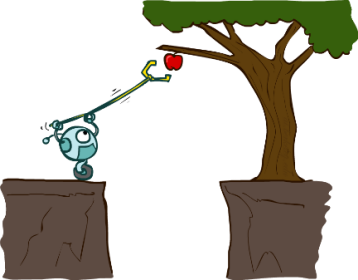
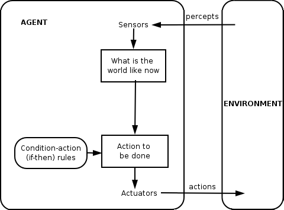
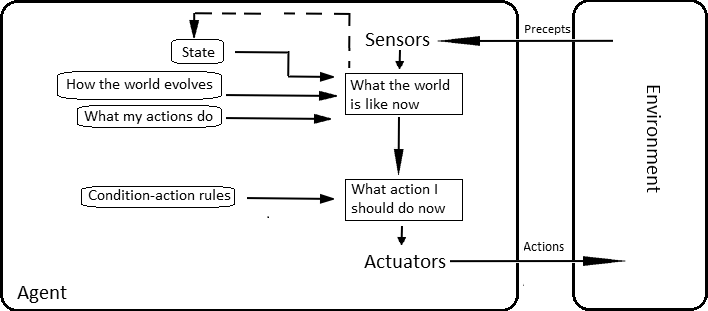
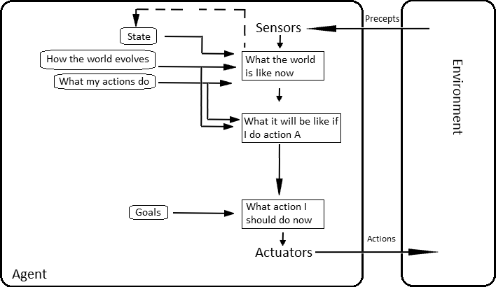
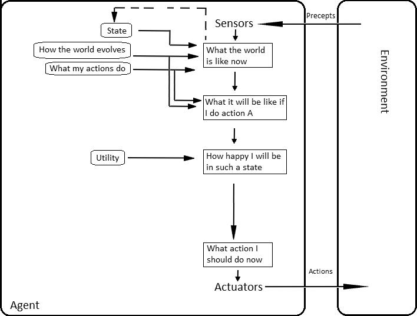
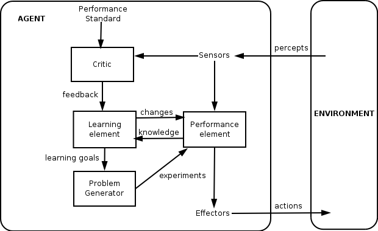

class: middle, center

# Introduction to Artificial Intelligence

Lecture 1: Foundations

---

class: middle, center

# Introduction

(Chapter 1)

---

# AI $\neq$ Science fiction

.gallery[


]

---

# What is AI?

Artificial intelligence is the science of making machines or programs that:

.grid.grid-half[
.col-1-2[
.center[Think like people]

]
.col-1-2[
.center[Think rationally]

]
]
.grid.grid-half[
.col-1-2[
.center[Act like people]

]
.col-1-2[
.center[Act rationally]

]
]

.footnote[Credits: UC Berkeley, [CS188](http://ai.berkeley.edu/lecture_slides.html)]

---

# Acting humanly

## The Turing test (the Imitation Game)

A computer passes the test if a human operator, after posing some written
questions, cannot tell whether the written responses come from a person or from
a computer.

.grid[
.col-2-3[

]
.col-1-3.center[

.caption[*Can machines think?* (Alan Turing, 1950).]
]
]

???

- The Turing test is an *aperational* definition of intelligence.

---

# Abilities for passing the test

An agent would not pass the Turing test without the following requirements:

- natural language processing
- knowledge representation
- automated reasoning
- machine learning
- computer vision (total Turing test)
- robotics (total Turing test)

Despite being proposed almost 70 years ago, the Turing test is *still relevant*
today.

---

# Limitations of the Turing test

- Tends to focus on human-like errors, linguistic tricks, etc.
- It seems more important to study the *principles* underlying intelligence
  than to replicate an exemplar.

.center[]
.caption[Aeronautics is not defined as the field of making machines that fly
so exactly like pigeons that they can fool even other pigeons.]

---

# Thinking humanly

.grid[
.col-1-2[
## Cognitive science

- *Study of the (human) mind* and its processes. Its goal is to form a theory
  about the structure of the mind, summarized *as a comprehensive computer
  model*.

- A cognitive architecture usually follows human-like reasoning and can be used to
produce testable predictions (time of delays during problem solving, kinds of
mistakes, learning rates, etc).
]
.col-1-2[

.caption[The modern SOAR cognitive architecture, as a descendant of the Logic Theorist (Alan Newell, Herbert Simon, 1956).]
]
]

---

# Limitations of cognition for AI

.grid[
.col-2-3[
- In linguistics, the argument of *poverty of the stimulus* states that children
do not receive sufficient input to generalize grammatical rules through
linguistic input alone.

- Nativists claim that humans are born with a specific representational adaptation
for language, i.e. biological prewiring.
]
.col-1-3.center[

.caption[*How do we know what we know?* (Noam Chomsky, 1980).]
]
]

Therefore, it may not be possible  (if true) to implement a fully functioning
computer model of the mind without the exact structure and content of this
innate knowledge.

---

# Thinking rationally

## The logical approach

- The rational thinking approach is concerned with the study of irrefutable
reasoning processes. It ensures that all actions performed by a computer are
formally *provable* from inputs and prior knowledge.

- The "laws of thought" were supposed to govern the operation of the mind.
Their study initiated the field of *logic* and the logicist tradition of AI
(1960-1990).

```prolog
/* Example of automated reasoning in Prolog */
mortal(X) :- human(X).
human(socrate).

?- mortal(socrate).
yes.
```

---

# Limitations of logical inference

- Representation of *informal* knowledge is difficult.
- Hard to define provable *plausible* reasoning.
- *Combinatorial explosion* (in time and space).
- Logical inference is part of intelligence. It does not cover everything:
    - e.g., might be no provably correct thing to do, but still something must be done;
    - e.g., reflex actions can be more successful than slower carefully deliberated ones.

.center[]
.caption[Pain withdrawal reflexes do not involve inference.]

---

# Acting rationally

- A *rational agent* acts so as to achieve the best (expected) outcome.
    - Correct logical inference is just one of several possible mechanisms for achieving this goal.
    - Perfect rationality cannot be achieved due to computational limitations!
      The amount of reasoning is adjusted according to available resources and importance of the result.
    - The brain is good at making rational decisions but not perfect either.
- Rationality only concerns *what* decisions are made (not the thought process behind them, human-like or not).
- Goals are expressed in terms of the *utility* of outcomes. Being rational means maximizing expected utility.
    - The standard of rationality is general and mathematically well defined.
- In this course, we will study general principles of rational agents and the components for constructing them.

---

class: middle

.center[

Artificial intelligence = Maximizing expected utility
]

.footnote[Credits: UC Berkeley, [CS188](http://ai.berkeley.edu/lecture_slides.html)]

---

# AI prehistory

- *Philosophy:* logic, methods of reasoning, mind as physical system, foundations of learning, language, rationality.
- *Mathematics:* formal representation and proof, algorithms, computation, (un)decidability, (in)tractability, probability.
- *Psychology:* adaptation, phenomena of perception and motor control, psychophysics.
- *Economics:* formal theory of rational decisions.
- *Linguistics:* knowledge representation, grammar.
- *Neuroscience:* plastic physical substrate for mental activity.
- *Control theory:* homeostatic systems, stability, simple optimal agent designs.

---

class: smaller

# A short history of AI

## 1940-1950: Early days
- 1943: McCulloch and Pitts: Boolean circuit model of the brain.
- 1950: Turing's "Computing machinery and intelligence:.

## 1950-1970: Excitement and expectations
- 1950s: Early AI programs, including Samuel's checkers program,
Newell and Simon's Logic Theorist and Gelernter's Geometry Engine.
- 1956: Dartmouth meeting: "Aritificial Intelligence" adopted.
- 1965: Robinson's complete algorithm for logical reasoning.
- 1966-1974: AI discovers computational complexity.

---

class: middle, center

<iframe width="560" height="315" src="https://www.youtube.com/embed/aygSMgK3BEM" frameborder="0" allowfullscreen></iframe>

---

class: smaller

# A short history of AI

## 1970-1990: Knowledge-based approaches
- 1966-1974: Neural network research almost disappears.
- 1969-1979: Early development of knowledge-based systems.
- 1980-1988: Expert systems industrial boom.
- 1988-1993: Expert systems industry busts  (AI winter).

## 1990-Present: Statistical approaches
- 1985-1995: The return of neural networks.
- 1988-: Resurgence of probability, focus on uncertainty, general increase in technical depth.
- 1995-2010: New fade of neural networks.
- 1995-: Complete intelligent agents and learning systems.
- 2000-: Availability of very large datasets.
- 2010-: Availability of fast commodity hardware (GPUs).
- 2012-: Resurgence of neural networks with of deep learning approaches.

---

# What can AI do at present?

- Translate spoken Chinese to spoken English, live?
- Answer multi choice questions, as good as an 8th grader?
- Converse with a person for an hour?
- Play decently at Chess? Go? Poker? Soccer?
- Buy groceries on the web? in a supermarket?
- Prove mathematical theorems?
- Drive a car safely on a parking lot? in New York?
- Perform a surgery?
- Identify skin cancer better than a dermatologist?
- Write a funny story?
- Paint like Vangogh? Compose music?
- Show common sense?

---

# Games

.grid[
.col-1-2.center[
<iframe width="280" height="200" src="https://www.youtube.com/embed/NJarxpYyoFI?&loop=1" frameborder="0" volume="0" allowfullscreen></iframe>
.caption[Deep Blue]
]
.col-1-2.center[
<iframe width="280" height="200" src="https://www.youtube.com/embed/V1eYniJ0Rnk?&loop=1&start=25" frameborder="0" volume="0" allowfullscreen></iframe>
.caption[Playing Atari games]
]
]
.grid[
.col-1-2.center[
<iframe width="280" height="200" src="https://www.youtube.com/embed/g-dKXOlsf98?&loop=1" frameborder="0" volume="0" allowfullscreen></iframe>
.caption[Alpha Go]
]
.col-1-2.center[
<iframe width="280" height="200" src="https://www.youtube.com/embed/naBLXWb60gQ?&loop=1" frameborder="0" volume="0" allowfullscreen></iframe>
.caption[Starcraft]
]
]

---

# Natural language

.grid[
.col-1-2.center[
<iframe width="280" height="200" src="https://www.youtube.com/embed/Nu-nlQqFCKg?&loop=1" frameborder="0" volume="0" allowfullscreen></iframe>
.caption[Speech translation and synthesis]
]
.col-1-2.center[
<iframe width="280" height="200" src="https://www.youtube.com/embed/heVE_me5VaQ?&loop=1" frameborder="0" volume="0" allowfullscreen></iframe>
.caption[Question answering systems]
]
]

---

# Vision

.grid[
.col-1-2.center[
<iframe width="280" height="200" src="https://www.youtube.com/embed/cm2VlEGNz5A?&loop=1" frameborder="0" volume="0" allowfullscreen></iframe>
.caption[Semantic segmentation]
]
.col-1-2.center[
<iframe width="280" height="200" src="https://www.youtube.com/embed/8BFzu9m52sc?&loop=1" frameborder="0" volume="0" allowfullscreen></iframe>
.caption[Generating image descriptions]
]
]
.grid[
.col-1-2.center[
<iframe width="280" height="200" src="https://www.youtube.com/embed/pW6nZXeWlGM?&loop=1" frameborder="0" volume="0" allowfullscreen></iframe>
.caption[Pose estimation]
]
.col-1-2.center[
<iframe width="280" height="200" src="https://www.youtube.com/embed/IvmLEq9piJ4?&loop=1" frameborder="0" volume="0" allowfullscreen></iframe>
.caption[Detecting skin cancer]
]
]

---

# Robotics

.grid[
.col-1-2.center[
<iframe width="280" height="200" src="https://www.youtube.com/embed/-96BEoXJMs0?&loop=1" frameborder="0" volume="0" allowfullscreen></iframe>
.caption[Automous cars]
]
.col-1-2.center[
<iframe width="280" height="200" src="https://www.youtube.com/embed/NFNEOooEQX4?&loop=1&start=80" frameborder="0" volume="0" allowfullscreen></iframe>
.caption[Playing soccer]
]
]
.grid[
.col-1-2.center[
<iframe width="280" height="200" src="https://www.youtube.com/embed/gn4nRCC9TwQ?&loop=1" frameborder="0" volume="0" allowfullscreen></iframe>
.caption[Learning to walk]
]
.col-1-2.center[
<iframe width="280" height="200" src="https://www.youtube.com/embed/gy5g33S0Gzo?&loop=1" frameborder="0" volume="0" allowfullscreen></iframe>
.caption[Folding laundry]
]
]

---

# Logic

.grid[
.col-1-2.center[

.caption[Automated Theorem Prover]
]
.col-1-2.center[

.caption[Formal software verification]
]
]

---

# Decision making

.grid[
.col-1-2.center[
<iframe width="280" height="200" src="https://www.youtube.com/embed/BNHR6IQJGZs?&loop=1" frameborder="0" volume="0" allowfullscreen></iframe>
.caption[Search engines]
]
.col-1-2.center[
<iframe width="280" height="200" src="https://www.youtube.com/embed/AuwayMjvuT0?&loop=1&start=35" frameborder="0" volume="0" allowfullscreen></iframe>
.caption[Fraud detection]
]
]
.grid[
.col-1-2.center[
<iframe width="280" height="200" src="https://www.youtube.com/embed/S4RL6prqtGQ?&loop=1" frameborder="0" volume="0" allowfullscreen></iframe>
.caption[Recommendation systems]
]
.col-1-2.center[
<iframe width="280" height="200" src="https://www.youtube.com/embed/_QndP_PCRSw?&loop=1" frameborder="0" volume="0" allowfullscreen></iframe>
.caption[Sorting packages (routing, planning)]
]
]

---

class: middle, center

# Intelligent agents

(Chapter 2)

---

# Agents and environments

.center[]

- An *agent* is an entity that *perceives* its environment through sensors and
  take *actions* through actuators.

- The agent behavior is described by the *agent function*, or *policy*, that
  maps percept histories to actions:
  $$f : \mathcal{P}^* \to \mathcal{A}$$

- The *agent program* runs on the physical architecture to produce $f$.

---

# Vacuum-cleaner world

.center[]

- *Percepts:* location and content, e.g. $[A, Dirty]$
- *Actions:* $Left, Right, Suck, NoOp$

---

# A vacuum-cleaner agent

Partial tabulation of a simple vacuum-cleaner agent function:

| Percept sequence | Action |
| ---------------- | ------ |
| $[A, Clean]$     | $Right$ |
| $[A, Dirty]$     | $Suck$ |
| $[B, Clean]$     | $Left$ |
| $[A, Dirty]$     | $Suck$ |
| $[A, Clean], [A, Clean]$     | $Right$ |
| $[A, Clean], [A, Dirty]$     | $Suck$ |
| (...) | (...) |

---

# A vacuum-cleaner agent

An implementation of the agent function:

```python
def program(location, status):
    if status == "dirty":
        return "suck"
    elif location == "A":
        return "right"
    elif location == "B":
        return "left"
```

---

# The optimal vacuum-cleaner?

- What is the *right* agent function?
  How to formulate the goal of the vacuum-cleaner agent?
    - 1 point per square cleaned up at time $t$?
    - 1 point per clean square per time step, minus one per move?
    - penalize for $>k$ dirty squares?
- Can it be implemented in a *small* agent program?

---

# Rational agents

- Informally, a *rational agent* is an agent that does the "right thing".
- A *performance measure*, or *utility*, evaluates a sequence of environment
  states caused by the agent's behavior.
- A rational agent is an agent that chooses whichever action that maximizes the
  *expected* value of the performance measure, given the percept sequence to date.

.center[]

.footnote[Credits: UC Berkeley, [CS188](http://ai.berkeley.edu/lecture_slides.html)]

---

# Rational agents

- Rationality $\neq$ omniscience    
    - percepts may not supply all relevant information.
- Rationality $\neq$ clairvoyance
    - action outcomes may not be as expected.
- Hence, rational $\neq$ successful.
- However, rationality leads to *exploration*, *learning* and *autonomy*.

---

# Performance, environment, actuators, sensors

The characteristics of the performance measure, environment, action space and
percepts dictate techniques for selecting rational actions.

These characteristics are summarized as the *task environment*.

## Example 1: an autonomous car
- *performance measure*: safety, destination, legality, comfort, ...
- *environment*: streets, highways, traffic, pedestrians, weather, ...
- *actuators*: steering, accelerator, brake, horn, speaker, display, ...
- *sensors*: video, accelerometers, gauges, engine sensors, GPS, ...

---

# Performance, environment, actuators, sensors

## Example 2: an Internet shopping agent
- *performance measure*: price, quality, appropriateness, efficiency
- *environment*: current and future WWW sites, vendors, shippers
- *actuators*: display to user, follow URL, fill in form, ...
- *sensors*: web pages (text, graphics, scripts)

---

class: smaller

# Environment types

- Fully observable vs. partially observable
    - Whether the agent sensors give access to the complete state of the environment, at each point in time.
- Deterministic vs. stochastic
    - Whether the next state of the environment is completely determined by the current state and the action executed by the agent.
- Episodic vs. sequential
    - Whether the agent's experience is divided into atomic independent episodes.
- Static vs. dynamic
    - Whether the environment can change, or the performance measure can change with time.
- Discrete vs. continuous
    - Whether the state of the environment, the time, the percepts or the actions are continuous.
- Single agent vs. multi-agent.
    - Whether the environment include several agents that may interact which each other.

---

# Examples of environments

Are the following task environments fully observable? deterministic? episodic?
static? discrete? single agents?

- Crossword puzzle
- Chess, with a clock
- Poker
- Backgammon
- Taxi driving
- Medical diagnosis
- Image analysis
- Part-picking robot
- Refinery controller
- The real world

---

# Agent programs

The job of AI is to design an *agent program* that implements the agent
function. This program will run on an *architecture*, that is a computing device
with physical sensors and actuators.

$$agent = program + architecture$$

## Implementation

Agent programs can be designed and implemented in many ways:

- with tables
- with rules
- with search algorithms
- with learning algorithms

---

# Table-driven agents

```python
def TableDrivenAgentProgram(table):
    percepts = []
    def program(percept):
        percepts.append(percept)
        action = table[percepts]
        return action
    return program
```

- A *table-driven agent* determines its next action with a table that contains the appropriate action for every possible percept sequence.
- **Design issue:** one needs to anticipate all sequence of percepts and how the agent should respond.
- **Technical issue:** the lookup table will contain $\sum_{t=1}^T |\mathcal{P}|^t$ entries.
    - Example (autonomous car): using a 30fps 640x480 RBG camera as sensor, this results in a table with over $10^{250000000000}$ entries for an hour of driving.

---

# Simple rule-based reflex agents

.center[]

- *Simple reflex agents* select actions on the basis of the current percept,
  ignoring the rest of the percept history.
- *Rule-based agents* implement *condition-action rules* that match the
  current percept to an action.

---

# Rule-based reflex agents

```python
def SimpleReflexAgentProgram(rules, interpret_input):
    def program(percept):
        state = interpret_input(percept)
        rule = rule_match(state, rules)
        action = rule.action
        return action
    return program
```

- Rules provide a way to *compress* the function table.
    - Example (autonomous car): If a car in front of you slow down, you should break.
      The color and model of the car, the music on the radio or the weather are all irrelevant.
- Simple reflex agents are simple but they turn out to have *limited intelligence*.
- They can only work in a *Markovian* environment, that is if the correct
  decision can be made on the basis of only the current percept.
  In other words, if the environment is fully observable.

---

# Model-based reflex agents

.center[]

- *Model-based agents* handle partial observability of the environment by
  keeping track of the part of the world they cannot see now.

- The internal state of model-based agents is updated on the basis of a *model* which determines:
    - how the environment evolves independently of the agent;
    - how the agent actions affect the world.

---

# Model-based reflex agents

```python
def ModelBasedReflexAgentProgram(rules, update_state, model):
    def program(percept):
        program.state = update_state(program.state,     
                                     program.action,
                                     percept,
                                     model)
        rule = rule_match(program.state, rules)
        action = rule.action
        return action
    program.state = program.action = None
    return program
```

---

# Goal-based agents

.center[]

- Principle: i) generate possible sequences of actions, ii) predict the
  resulting states and  iii) assess *goals* in each.
    - Example (autonomous car): Has the car arrived to destination?
- A *goal-based agent* chooses an action that will achieve the goal.
    - More general than rules. Goals are rarely explicit in condition-action rules.
    - Finding action sequences that achieve goals is difficult.
      *Search* and *planning* are two strategies.

---

# Utility-based agents

.center[]

- *Goals* are often not enough to generate high-quality behavior.
    - There are many ways to arrive to destination, but some are quicker or more reliable.
- Goals only provide binary assessment of performance. By contrast, a *utility function* assigns
  a score to any given sequence of environment states.
- A rational *utility-based* agent chooses an action that maximizes the *expected* utility
of its outcomes.

---

# Learning agents

.center[]

- *Learning agents* are capable of self-improvement. They can become more
  competent than their initial knowledge alone might allow.
- They can make changes to any of the knowledge components by:
    - learning how the world evolves;
    - learning what are the consequences of actions;
    - learning the utility of actions through *rewards*.

---

# Summary

- An *agent* is an entity that perceives and acts in an environment.
- The *performance measure* evaluates the agent's behavior. *Rational agents* act so as to maximize the expected value of the performance measure.
- *Task environments* includes performance measure, environment, actuators and sensors. They can vary along several significant dimensions.
- The *agent program* effectively implements the agent function. Their designs are dictated by the task environment.
- *Simple reflex agents* respond directly to percepts, whereas *model-based reflex agents* maintain internal state to track the world. *Goal-based agents* act to achieve goals while *utility-based agents* try to maximize their expected performance.
- All agents can improve their performance through *learning*.

---

# References

- Turing, Alan M. "Computing machinery and intelligence." Mind 59.236 (1950): 433-460.
- Newell, Allen, and Herbert Simon. "The logic theory machine--A complex information processing system." IRE Transactions on information theory 2.3 (1956): 61-79.
- Chomsky, Noam. "Rules and representations." Behavioral and brain sciences 3.1 (1980): 1-15.
