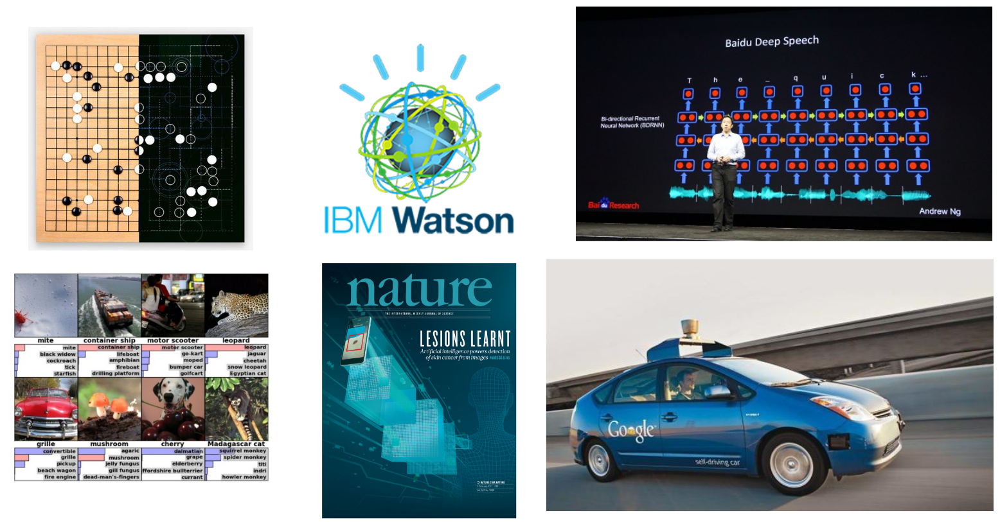
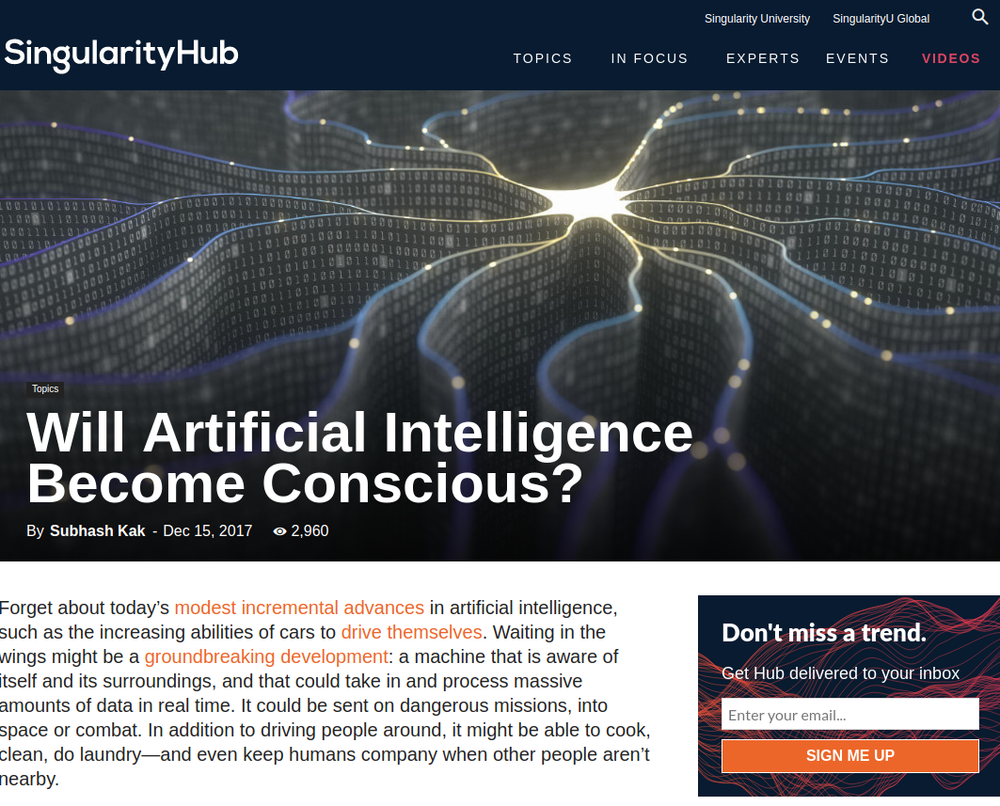
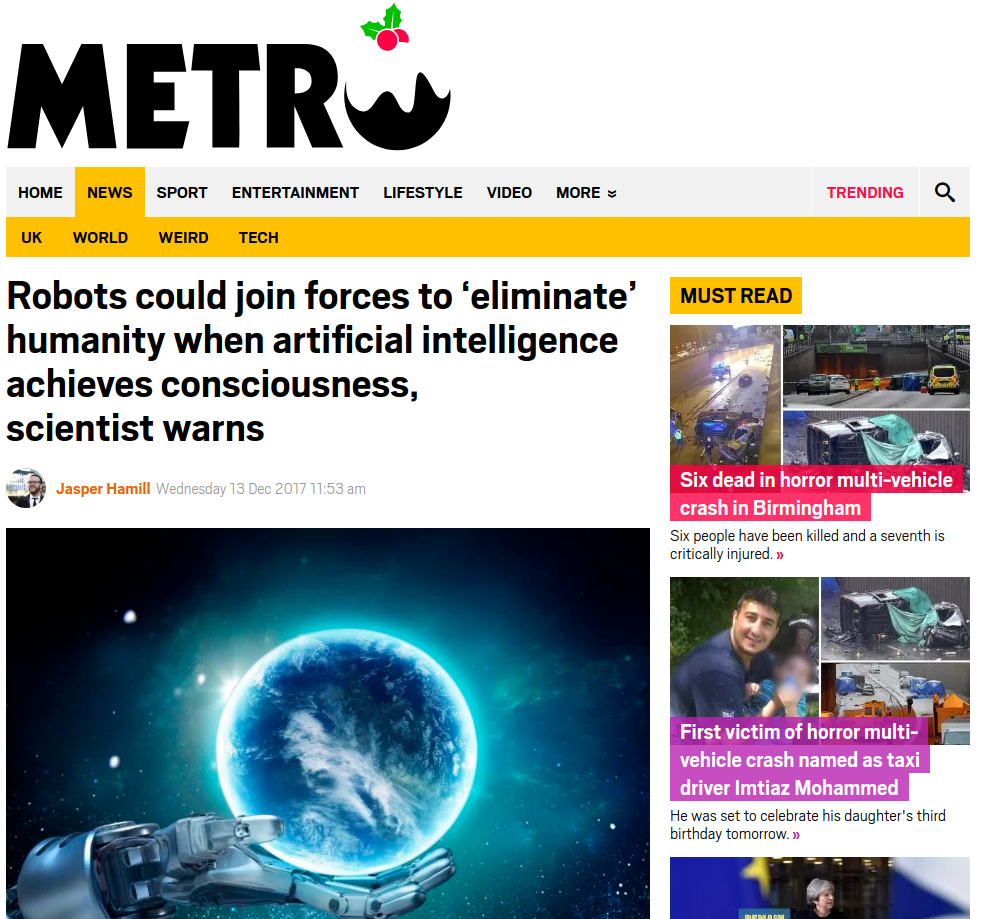
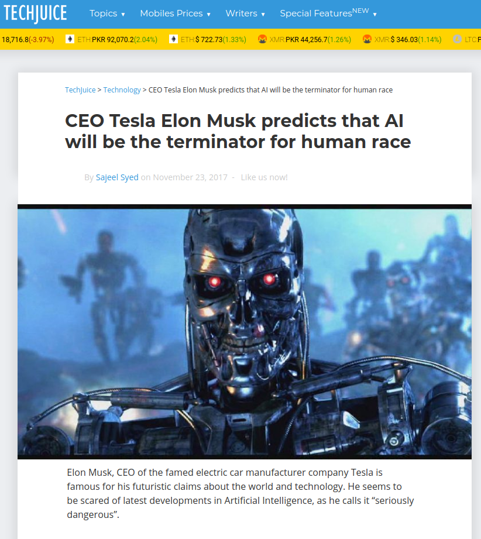
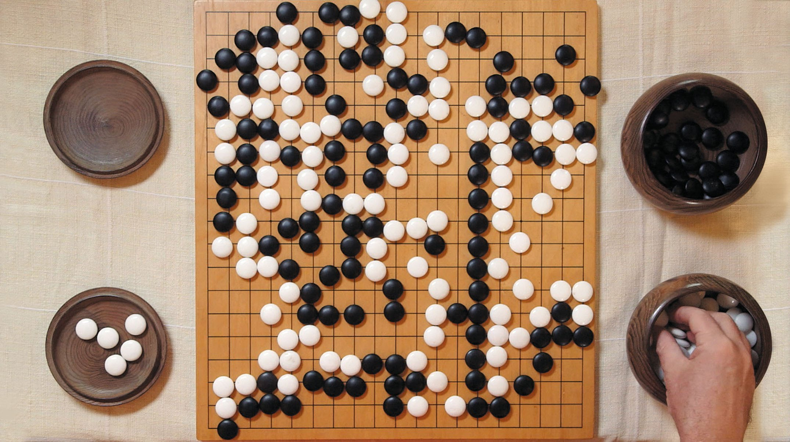
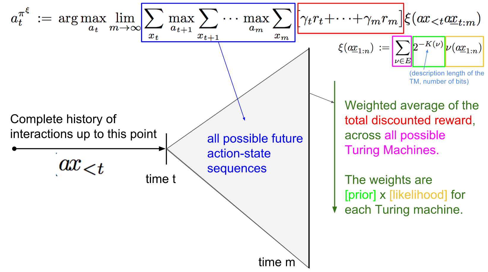
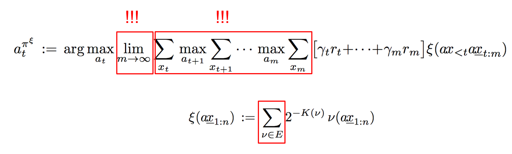
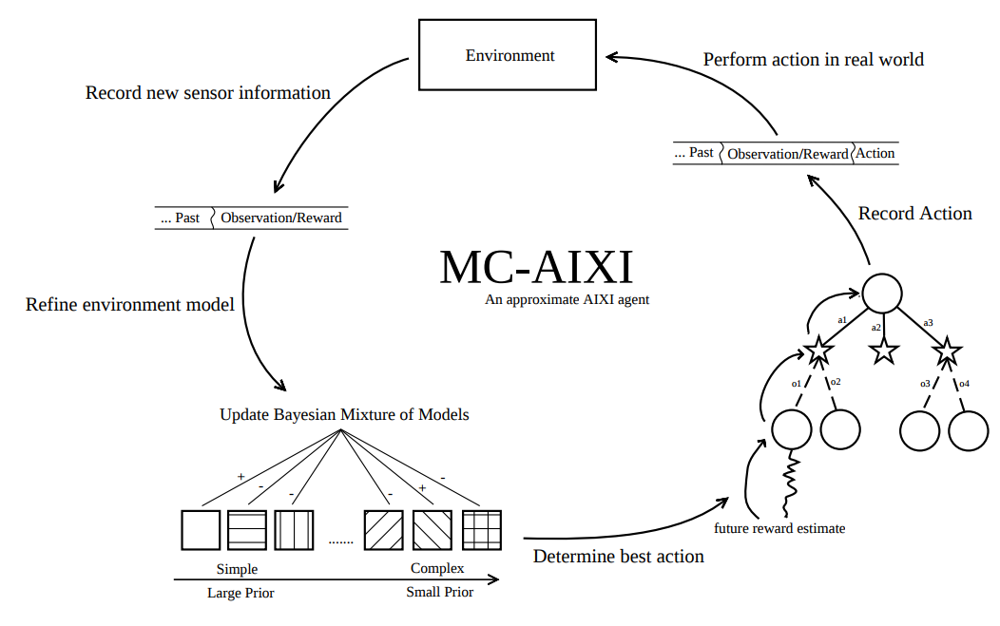
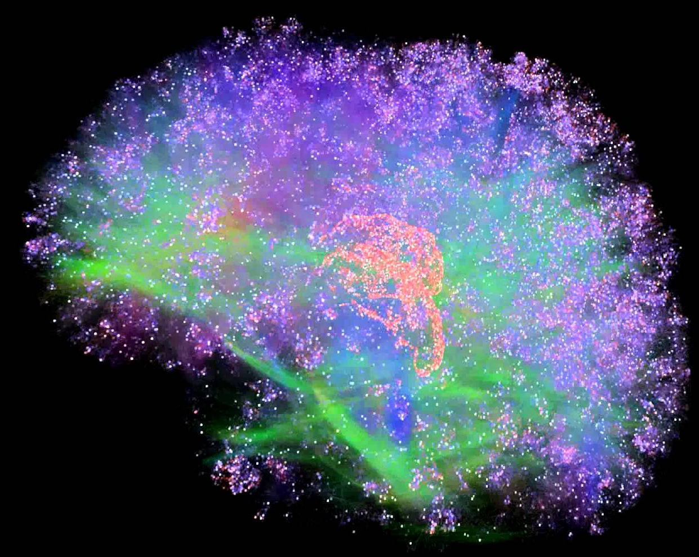

class: middle, center, title-slide

# Introduction to Artificial Intelligence

Lecture 10: Artificial General Intelligence

???

https://futureoflife.org/wp-content/uploads/2017/01/Jurgen-Schmidhuber.pdf?x56934
http://machineintelligence.org/universal-ai.pdf

---

# From technological breakthroughs...

.center.width-100[]

---

# ... to popular media

.grid[
.col-1-4[]
.col-1-4[]
.col-1-4[]
.col-1-4[]
]
.grid[
.col-1-4[]
.col-1-4[]
.col-1-4[]
.col-1-4[]
]
.grid[
.col-1-4[]
.col-1-4[]
.col-1-4[]
.col-1-4[]
]

---

# Artificial narrow intelligence

- Artificial intelligence today is still very **narrow**.
    - Modern AI systems often reach super-human level performance.
    - ... but only at *very specific problems*!
    - They **do not generalize** to the real world nor to arbitrary tasks.

---

# AlphaGo

**Convenient** properties of AlphaGo:
- *Deterministic* (no noise in the game).
- *Fully observed* (each player has complete information)
- *Discrete action space* (finite number of actions possible)
- *Perfect simulator* (the effect of any action is known exactly)
- *Short episodes* (200 actions per game)
- *Clear and fast evaluation* (as stated by Go rules)
- *Huge dataset available* (games)

.center.width-40[]

.footnote[Credits: [Andrej Karpathy, Where will AGI come from?](https://docs.google.com/presentation/d/119VW6ueBGLQXsw-jGMboGP2-WuOnyMAOYLgd44SL6xM)]

---

class: smaller

# Picking challenge

.center.width-100[]

.center[Can we run AlphaGo on a robot for the Amazon Picking Challenge?]

.footnote[Credits: [Andrej Karpathy, Where will AGI come from?](https://docs.google.com/presentation/d/119VW6ueBGLQXsw-jGMboGP2-WuOnyMAOYLgd44SL6xM)]

---

class: smaller

# Picking challenge

.center.width-100[]

- *Deterministic*: OK
- *Fully observed*: **OKish**
- *Discrete action space*: OK
- *Perfect simulator*: **TROUBLE**
- *Short episodes*: **challenge**
- *Clear and fast evaluation*: not good
- *Huge dataset available*: **challenge**

.footnote[Credits: [Andrej Karpathy, Where will AGI come from?](https://docs.google.com/presentation/d/119VW6ueBGLQXsw-jGMboGP2-WuOnyMAOYLgd44SL6xM)]

---

# Artificial general intelligence

- **Artificial general intelligence** (AGI) is the intelligence of a machine that could successfully perform any intellectual task that a human being can.
- No clear definition, but there is an agreement that AGI is required to do the following:
    - *reason*, use strategy, solve puzzle and make judgments under uncertainty;
    - *represent knowledge*, including commonsense knowledge;
    - *plan*;
    - *learn*;
    - *communicate* in natural language;
    - integrate all these skills towards *common goals*.

---

# Singularity

Irving John Good (1965):

- Let an **ultraintelligent** machine be defined as a machine that can far surpass all the intellectual activities of any man however clever.
- Since the design of machines is one of these intellectual activities, an ultraintelligent machine could *design even better machines*.
- There would then unquestionably be an **'intelligence explosion'**, and the intelligence of man would be left far behind.
- Thus the first ultraintelligent machine is the *last invention* that man need ever make, provided that the machine is docile enough to tell us how to keep it under control.

---

# Superintelligence

.center[
<iframe width="640" height="420" src="https://www.youtube.com/embed/MnT1xgZgkpk?&loop=1&start=0" frameborder="0" volume="0" allowfullscreen></iframe>

What happens when our computers get smarter than we are? Nick Bostrom
]

---

# How to build AGI?

Several working **hypothesis**:
- *Supervised learning*: "It works, just scale up!"
- *Unsupervised learning*: "It will work, if we only scale up!"
- *AIXI*: "Guys, I can write down an equation for optimal AI."
- *Brain simulation*: "This will work one day, right?"
- *Artificial life*: "Let just do what Nature did."

Or maybe something else?

.footnote[Credits: [Andrej Karpathy, Where will AGI come from?](https://docs.google.com/presentation/d/119VW6ueBGLQXsw-jGMboGP2-WuOnyMAOYLgd44SL6xM)]

---

class: middle, center

# AIXI

---

# Start with an equation

$$\Upsilon(\pi) := \sum\_{\mu \in E} 2^{-K(\mu)} V^{\pi}\_\mu$$

- $\Upsilon(\pi)$ *formally* defines the **universal intelligence** of an agent $\pi$.
- $\mu$ is the environment of the agent and $E$ is the set of all computable reward bounded environments.
- $V^{\pi}\_\mu = \mathbb{E}\[ \sum\_{i=1}^\infty R\_i \]$ is the expected sum of future rewards when the agent $\pi$ interacts with environment $\mu$.
- $K(.)$ is the Kolmogorov complexity, such that $2^{-K(\mu)}$ weights the agent's performance in each environment, inversely proportional to its complexity.
    - Intuitively, $K(\mu)$ measures the complexity of the shortest Universal Turing Machine program that describes the environment $\mu$.

---

# AIXI

$$\bar{\Upsilon} = \max\_\pi \Upsilon(\pi) = \Upsilon(\pi^{AIXI})$$

- $\pi^{AIXI}$ is a **perfect** theoretical agent.
- It always picks the action which has the greatest expected reward.
- For every environment $\mu \in E$, the agent must:
    - Take into account how likely it is that it is facing $\mu$ given the interaction history so far, and the prior probability of $\mu$.
    - Consider all possible future interactions that might occur.
    - Evaluate how likely they are.
    - Then select the action that maximizes the expected future reward.

---

# System identification

- Which Turing machine is the agent in? If it knew, it could plan perfectly.
- Let's use the *Bayes rule* to update the agent beliefs given its experience so far.

.center.width-100[]

.footnote[Credits: [Andrej Karpathy, Where will AGI come from?](https://docs.google.com/presentation/d/119VW6ueBGLQXsw-jGMboGP2-WuOnyMAOYLgd44SL6xM)]

---

# Optimal action

.center.width-100[]

.footnote[Credits: [Andrej Karpathy, Where will AGI come from?](https://docs.google.com/presentation/d/119VW6ueBGLQXsw-jGMboGP2-WuOnyMAOYLgd44SL6xM)]

???

The equation embodies in one line the major ideas of Bayes, Ockham, Epicurus,
Turing, von Neumann, Bellman, Kolmogorov, and Solomonoff. The AIXI agent is
rigorously shown by [Hut05] to be optimal in many different senses of the word.

---

# Intractability

.center.width-100[]

.footnote[Credits: [Andrej Karpathy, Where will AGI come from?](https://docs.google.com/presentation/d/119VW6ueBGLQXsw-jGMboGP2-WuOnyMAOYLgd44SL6xM)]

---

# Monte Carlo approximation

.center.width-100[]

---

class: middle, center

# Brain simulation

---

# Whole brain emulation

.center.width-50[]

- A hypothesis for AGI is **whole brain simulation**.
    - A low-level brain model is built by scanning and mapping a biological brain in detail and copying its state into a computer system.
    - The simulation is *so faithful* that it will behave in essentially the same way as the original.
- Ongoing initiatives: BRAIN, Blue Brain Project, Human Brain Project, NeuraLink, etc.

---

# Obstacles

- How to *measure* a complete brain state?
- At what level of abstraction?
- How to model the dynamics?
- How do you simulate the environment to feed into senses?
- Various **ethical dilemmas**.

---

# Mind upload

- **Hypothetically**, whole brain emulation would enable *mind upload*.
    - The mental state of a particular brain substrate could be scanned and copied into a computer.
    - The computer could then run a simulation of the brain's information processing, such that it responds in the same way as the original brain.
- That is, simulation would be indistinguishable from reality.

.center.width-70[]

---

class: middle, center

# Artificial life

---

???

https://en.wikipedia.org/wiki/Artificial_life

---

class: middle, center

# Conclusions

---

# A note of optimism

.center[
<iframe width="640" height="420" src="https://www.youtube.com/embed/NP8xt8o4_5Q?&loop=1&start=0" frameborder="0" volume="0" allowfullscreen></iframe>

Don't fear intelligent machines, work with them. Garry Kasparov
]

---

# Going further
