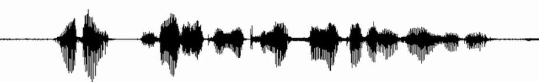
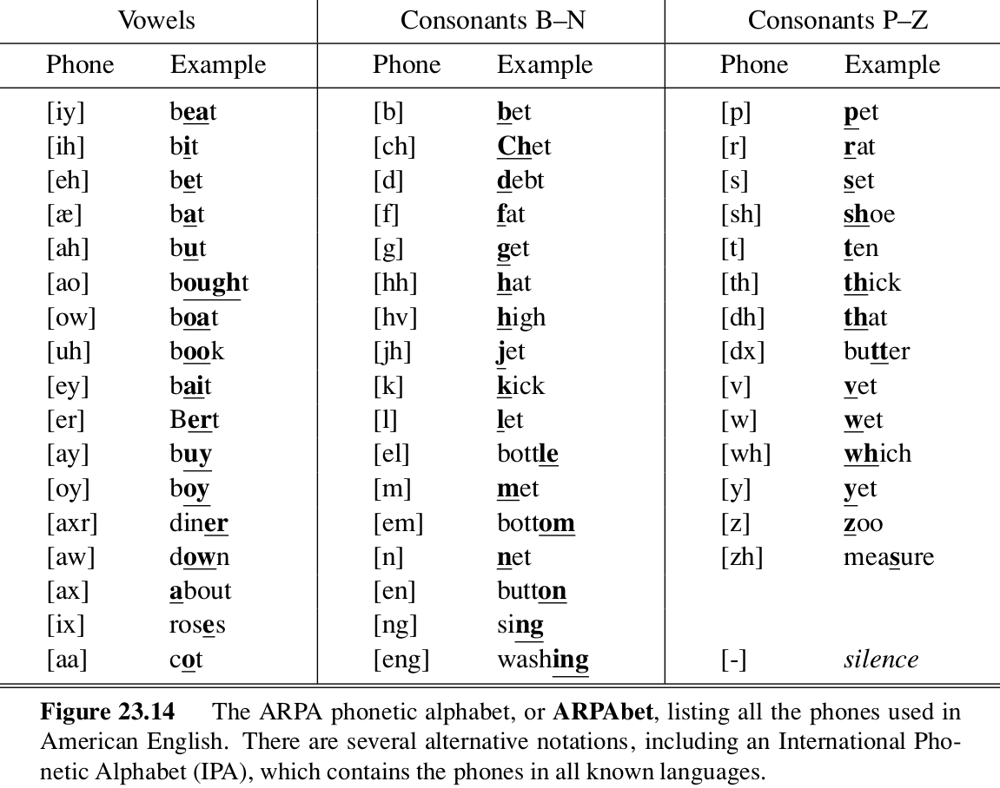
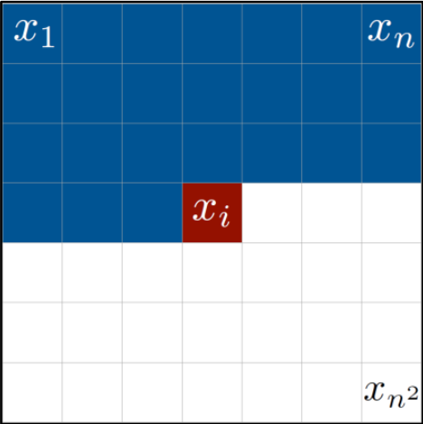
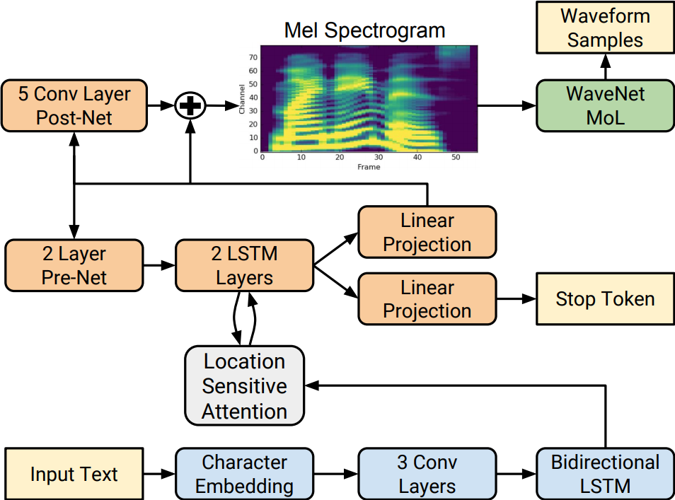
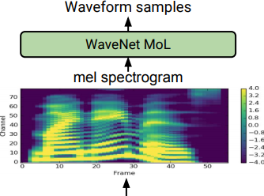
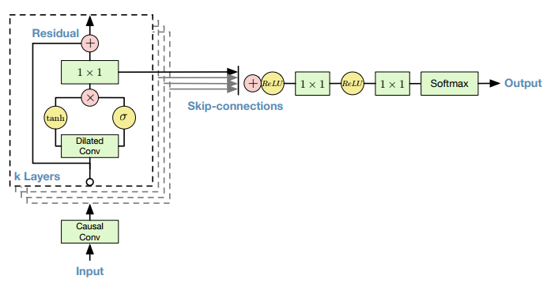

class: middle, center, title-slide

# Introduction to Artificial Intelligence

Lecture 10: Communication

  
Prof. Gilles Louppe 
[g.louppe@uliege.be](mailto:g.louppe@uliege.be)

???

R: check https://static.googleusercontent.com/media/research.google.com/fr//pubs/archive/45882.pdf

---

# Today

.center.width-30[]

Can you **talk** to an artificial agent? Can it understand what you say?

- Machine translation
- Speech recognition
- Text-to-speech synthesis

.footnote[Image credits: [CS188](https://inst.eecs.berkeley.edu/~cs188/), UC Berkeley.]

---

class: middle

## Sequence-to-sequence mapping

.grid[
.kol-1-3[Machine translation:]
.kol-1-4.center[Hello, my name is HAL.]
.kol-2-12.center[$\rightarrow$]
.kol-1-4.center[Bonjour, mon nom est HAL.]
]
.grid[
.kol-1-3[Speech recognition:]
.kol-1-4.center[.width-100[]]
.kol-2-12.center[$\rightarrow$]
.kol-1-4.center[Hello, my name is HAL.]
]
.grid[
.kol-1-3[Text-to-speech synthesis:]
.kol-1-4.center[Hello, my name is HAL.]
.kol-2-12.center[$\rightarrow$]
.kol-1-4.center[.width-100[]]
]

---

class: middle

# Machine translation

---

class: middle

.center.width-100[]

## Machine translation

Automatic translation of text from one natural language (the source) to another (the target), while preserving the intended meaning.

.exercise[How would you engineer a machine translation system?]

???

Expect the students to come up with a dictionary-based solution.

---

class: middle

## Issue of dictionary lookups

.center.width-80[]

.center[Natural languages are not 1:1 mappings of each other!]

.footnote[Image credits: [CS188](https://inst.eecs.berkeley.edu/~cs188/), UC Berkeley.]

---

class: middle

.center.width-100[]

.center[To obtain a correct translation, one must decide  whether "it" refers to the soccer ball or to the window.

Therefore, one must understand physics as well as language.]

---

# History

.center.width-100[]

.footnote[Image credits: [CS188](https://inst.eecs.berkeley.edu/~cs188/), UC Berkeley.]

---

# Data-driven machine translation

 
.center.width-100[]

.footnote[Image credits: [CS188](https://inst.eecs.berkeley.edu/~cs188/), UC Berkeley.]

---

class: middle

## Machine translation systems

Translation systems must model the source and target languages, but systems vary in the type of models they use.
- Some systems analyze the source language text all the way into an *interlingua knowledge representation* and then generate sentences in the target language from that representation.
- Other systems are based on a **transfer model**. They keep a database of translation rules and whenever the rule matches, they translate directly. Transfer can occur at the lexical, syntactic or semantic level.

---

class: middle

.center.width-100[]

---

# Statistical machine translation

To translate an English sentence $e$ into a French sentence $f$, we seek the strings of words $f^\*$ such that
$$f^\* = \arg\max\_f P(f|e).$$

- The language model $P(f|e)$ is learned from a **bilingual corpus**, i.e. a collection of parallel texts, each an English/French pair.
- Most of the English sentences to be translated will be novel, but will be composed of phrases that that have been seen before.
- The corresponding French phrases will be reassembled to form a French sentence that makes sense.

---

class: middle

Given an English source sentence $e$, finding a French translation $f$ is a matter of three steps:
- Break $e$ into phrases $e\_1, ..., e\_n$.
- For each phrase $e\_i$, choose a corresponding French phrase $f\_i$. We use the notation $P(f\_i|e\_i)$ for the phrasal probability that $f\_i$ is a translation of $e\_i$.
- Choose a permutation of the phrases $f\_1, ..., f\_n$. For each $f\_i$, we choose a distortion $$d\_i = \text{start}(f\_i) - \text{end}(f\_{i-1}) - 1,$$ which is the number of words that phrase $f\_i$ has moved with respect to $f\_{i-1}$; positive for moving to the right, negative for moving the left.

---

class: middle

.center.width-100[]

---

class: middle

We define the probability $P(f,d|e)$ that the sequence of phrases $f$ with distortions $d$ is a translation of the sequence of phrases $e$.

Assuming that each phrase translation and each distortion is independent of the others, we have
$$P(f,d|e) = \prod\_i P(f\_i | e\_i) P(d\_i).$$

- The best $f$ and $e$ cannot be found through enumeration because of the combinatorial explosion.
- Instead, local beam search with a heuristic that estimates probability has proven effective at finding a nearly-most-probable translation.

???

With maybe
100 French phrases for each English phrase in the corpus, there are $100^5$ different 5-phrase
translations, and $5!$ reorderings for each of those.

---

class: middle

All that remains is to learn the phrasal and distortion probabilities:
1. Find parallel texts.
2. Segment into sentences.
3. Align sentences.
4. Align phrases.
5. Extract distortions.
6. Improve estimates with expectation-maximization.

---

# Neural machine translation

Modern machine translation systems are all based on **neural networks** of various types, often architectured as compositions of
- recurrent networks for sequence-to-sequence learning,
- convolutional networks for modeling spatial dependencies.

 

.center.width-70[]

---

class: middle

## Attention-based recurrent neural network

.grid[
.kol-1-2[
- Encoder: bidirectional RNN, producing a set of annotation vectors $h\_i$.
- Decoder: attention-based.
    - Compute attention weights $\alpha\_{ij}$.
    - Compute the weighted sum of the annotation vectors, as a way to align the input words to the output words.
    - Decode using the context vector, the embedding of the previous output word and the hidden state.
]
.kol-1-2[
.center.width-100[]
]
]

---

class: middle

# Speech recognition

---

class: middle, center, black-slide

.center.width-100[]

---

# Recognition as inference

.grid[
.kol-5-12.center[
$\mathbf{y}\_{1:T}$
.width-100[]]
.kol-2-12.center[
 $\rightarrow$]
.kol-5-12.center[
$\mathbf{w}\_{1:L}$
 My name is HAL.]
]

Speech recognition can be viewed as an instance of the problem of **finding the most likely sequence** of state variables $\mathbf{w}\_{1:L}$, given a sequence of observations $\mathbf{y}\_{1:T}$.

- In this case, (hidden) state variables are the words and the observations are sounds.

- The input audio waveform from a microphone is converted into a sequence of fixed size acoustic vectors $\mathbf{y}\_{1:T}$ in a process called *feature extraction*.

- The decoder attempts to find the sequence of words $\mathbf{w}\_{1:L} = w\_1, ..., w\_L$ which is the most likely to have generated $\mathbf{y}\_{1:T}$:
$$\hat{\mathbf{w}}\_{1:L} = \arg \max\_{\mathbf{w}\_{1:L}} P(\mathbf{w}\_{1:L}|\mathbf{y}\_{1:T})$$

---

class: middle

Since $P(\mathbf{w}\_{1:L}|\mathbf{y}\_{1:T})$ is difficult to model directly, Bayes' rule is the used to solve the equivalent problem
$$\hat{\mathbf{w}}\_{1:L} = \arg \max\_{\mathbf{w}\_{1:L}} p(\mathbf{y}\_{1:T}|\mathbf{w}\_{1:L}) P(\mathbf{w}\_{1:L}),$$
where
- the likelihood $p(\mathbf{y}\_{1:T}|\mathbf{w}\_{1:L})$ is the **acoustic model**;
- the prior $P(\mathbf{w}\_{1:L})$ is the *language model*.

---

class: middle

.center.width-90[]

---

class: middle

## Feature extraction

- The feature extraction seeks to provide a compact representation $\mathbf{y}\_{1:T}$ of the speech waveform.
- This form should minimize the loss of information that discriminates between words.
- One of the most widely used encoding schemes is based on **mel-frequency cepstral coefficients** (MFCCs).

---

class: middle

.center.width-100[

MFCCs calculation.]

.footnote[Image credits: [Giampiero Salvi, 2016. DT2118](https://www.kth.se/social/files/56fd38eaf276547ad14588ec/lecture.pdf).]

???

- Pre-emphasis: amplify the high frequencies.
- Windowing: split the signal into short-time frames.
- FFT: calculate the frequency spectrum and compute the power spectrum (periodogram).
- Filter banks: apply triangular filter (around 40) on a Mel-scale to the power spectrum to extract frequency bands.
    - The Mel-scale aims to mimic the non-linear human ear perception of sound, by being more discriminate at lower frequencies and less discriminative at higher frequencies.
- Decorrelate the bank coefficients through a Discrete Cosine Transform.

---

class: middle

.center.width-90[]

$$\downarrow$$

.center.width-90[]

.center[Feature extraction from the signal in the time domain to MFCCs.]

.footnote[Image credits: [Haytham Fayek, 2016](https://haythamfayek.com/2016/04/21/speech-processing-for-machine-learning.html).]

---

class: middle

## Acoustic model

A spoken word $w$ is decomposed into a sequence of $K\_w$ basic sounds called *base phones* (such as vowels or consonants).
- This sequence is called its pronunciation $\mathbf{q}^{w}\_{1:K\_w} = q\_1, ..., q\_{K\_w}$.
- Pronunciations are related to words through **pronunciations models** defined for each word.
- e.g. "Artificial intelligence" is pronounced `/ɑːtɪˈfɪʃ(ə)l ɪnˈtɛlɪdʒ(ə)ns/`.

---

class: middle

.center.width-100[]

---

class: middle

.center.width-100[]

---

class: middle

.center.width-60[]

Each base phone $q$ is represented by **phone model** defined as a three-state continuous density HMM, where
- the transition probability parameter $a\_{ij}$ corresponds to the probability of making the particular transition from state $s\_i$ to $s\_j$;
- the output sensor models are Gaussians $b\_j(\mathbf{y}) = \mathcal{N}(\mathbf{y}; \mu^{(j)}, \Sigma^{(j)})$ and relate state variables $s\_j$ to MFCCs $\mathbf{y}$.

---

class: middle

The full acoustic model can now be defined as a composition of pronunciation models with individual phone models:
$$
\begin{aligned}
p(\mathbf{y}\_{1:T}|\mathbf{w}\_{1:L}) &= \sum\_{\mathbf{Q}} P(\mathbf{y}\_{1:T} | \mathbf{Q}) P(\mathbf{Q} | \mathbf{w}\_{1:L})
\end{aligned}
$$
where the summation is over all valid pronunciation sequences for $\mathbf{w}\_{1:L}$, $\mathbf{Q}$ is a particular sequence $\mathbf{q}^{w\_1}, ..., \mathbf{q}^{w\_L}$ of pronunciations,
$$
\begin{aligned}
P(\mathbf{Q}|\mathbf{w}\_{1:L}) &= \prod\_{l=1}^L P(\mathbf{q}^{w\_l}|w\_l)
\end{aligned}$$
as given by the pronunciation model,
and where $\mathbf{q}^{w\_l}$ is a valid pronunciation for word $w\_l$.

---

class: middle

Given the composite HMM formed by concatenating all the constituent pronunciations $\mathbf{q}^{w\_1}, ..., \mathbf{q}^{w\_L}$ and their corresponding base phones, the acoustic likelihood is given by
$$
p(\mathbf{y}\_{1:T}|\mathbf{Q}) = \sum\_\mathbf{s} p(\mathbf{s},\mathbf{y}\_{1:T}|\mathbf{Q})
$$
where $\mathbf{s} = s\_0, ..., s\_{T+1}$ is a state sequence through the composite model
and
$$p(\mathbf{s},\mathbf{y}\_{1:T}|\mathbf{Q}) = a\_{s\_0, s\_1} \prod\_{t=1}^T b\_{s\_t}(\mathbf{y}\_t) a\_{s\_t s\_{t+1}}.$$

From this formulation, all model parameters can be efficiently estimated from a corpus of training utterances with expectation-maximization.

---

class: middle

## N-gram language model

The prior probability of a word sequence $\mathbf{w} = w\_1, ..., w\_L$ is given by
$$P(\mathbf{w}) = \prod\_{l=1}^L P(w\_l | w\_{l-1}, ..., w\_{l-N+1}).$$

The N-gram probabilities are estimated from training texts by counting N-gram occurrences to form maximum likelihood estimates.

---

class: middle

## Decoding

The composite model corresponds to a HMM, from which the most-likely state sequence $\mathbf{s}$ can be inferred using (a variant of) **Viterbi**.

By construction, states $\mathbf{s}$ relate to phones, phones to pronunciations, and pronunciations to words.

---

# Neural speech recognition

Modern speech recognition systems are now based on *end-to-end* deep neural network architectures trained on large corpus of data.

.grid[
.kol-2-3[
## Deep Speech 2

- Recurrent neural network with
    - one or more convolutional input layers,
    - followed by multiple recurrent layers,
    - and one fully connected layer before a softmax layer.
- Total of 35M parameters.
- Same architecture for both English and Mandarin.
]
.kol-1-3[.width-100[]]
]

.footnote[Image credits: [Amodei et al, 2015. arXiv:1512.02595](https://arxiv.org/abs/1512.02595).]

---

class: middle, black-slide

.center[
<iframe width="640" height="400" src="https://www.youtube.com/embed/IFPwMKbdQnI?&loop=1&start=0" frameborder="0" volume="0" allowfullscreen></iframe>

Deep Speech 2
]

---

class: middle

# Text-to-speech synthesis

---

class: middle

.grid[
.kol-5-12.center[
$\mathbf{w}\_{1:L}$
 My name is HAL.]
.kol-2-12.center[
 $\rightarrow$]
.kol-5-12.center[
$\mathbf{y}\_{1:T}$
.width-100[]]
]

---

# Autoregressive models

.grid[
.kol-3-4[
By the chain rule, any joint distribution can always be written as an incremental product of conditional distributions:
$$
\begin{aligned}
p(x\_1,...,x\_n) &= \prod\_{k=1}^n p(x\_k | x\_1, ..., x\_{k-1}).
\end{aligned}
$$
If $h\_{k-1}$ is a lossless statistic of the previous observations in the sequence, then we can express
$$p(x\_k | x\_1, ..., x\_{k-1}) = g\_\theta(x\_k | h\_{k-1}).$$
]
.kol-1-4.center[
.width-100[]
.caption[Autoregressive model  for images.]
]
]

---

class: middle

An autoregressive model can be formulated as a recurrent neural network such that

$$
\begin{aligned}
p(x\_k | x\_1, ..., x\_{k-1}) &= g\_\theta(x\_k | h\_{k-1}) \\\\
h\_k &= f\_\theta(x\_k, h\_{k-1})
\end{aligned}
$$
where
- $g$ specifies a probability density function for the next $x$ given $h$.
- $f$ specifies (in a deterministic way) the next state $h$ given $x$.

If $g$ and $f$ have enough capacity (e.g., $f$ and $g$ are large neural networks), then the resulting autoregressive model is often capable of modeling complex distributions, such as text, images or speech.

The same architecture can be used for modeling *conditional* distributions over inputs.

---

# Tacotron 2

The Tacotron 2 system is a **sequence-to-sequence neural network** architecture for text-to-speech. It consists of two components:
- a recurrent sequence-to-sequence feature prediction network with attention which predicts a sequence of mel spectrogram frames from an input character sequence;
- a *Wavenet vocoder* which generates time-domain waveform samples conditioned on the predicted mel spectrogram frames.

---

class: middle

.width-80.center[]

.footnote[Image credits: [Shen et al, 2017. arXiv:1712.05884](https://arxiv.org/abs/1712.05884).]

---

class: middle

## Wavenet

- The Tacotron 2 architecture produces mel spectrograms as outputs, which remain to be synthesized as waveforms.
- This last step can be performed through another autoregressive neural model, such as **Wavenet**, to transform mel-scale spectrograms into high-fidelity waveforms.

 
.center.width-40[]

---

class: middle

.center.width-90[]

.center[The Wavenet architecture.]

.footnote[Image credits: [Van den Oord et al, 2016.](https://deepmind.com/blog/wavenet-generative-model-raw-audio/).]

---

class: middle

.center.width-90[]

.center[Dilated convolutions.]

.footnote[Image credits: [Van den Oord et al, 2016.](https://deepmind.com/blog/wavenet-generative-model-raw-audio/).]

---

class: middle

Audio samples at
- [deepmind.com/blog/wavenet-generative-model-raw-audio](https://deepmind.com/blog/wavenet-generative-model-raw-audio/)
- [google.github.io/tacotron](https://google.github.io/tacotron/)

---

class: middle, black-slide

.center[
<iframe width="640" height="400" src="https://www.youtube.com/embed/7gh6_U7Nfjs?&loop=1&start=0" frameborder="0" volume="0" allowfullscreen></iframe>

Google Assistant: Soon in your smartphone.
]

---

# Summary

- Natural language understanding is one of the most important subfields of AI.
- Machine translation, speech recognition and text-to-speech synthesis are instances of sequence-to-sequence problems.
- All problems can be tackled with traditional statistical inference methods but require sophisticated engineering.
- State-of-the-art methods are now based on neural networks.

---

class: end-slide, center
count: false

The end.

---

# References

- Gales, M., & Young, S. (2008). The application of hidden Markov models in speech recognition. Foundations and Trends® in Signal Processing, 1(3), 195-304.
