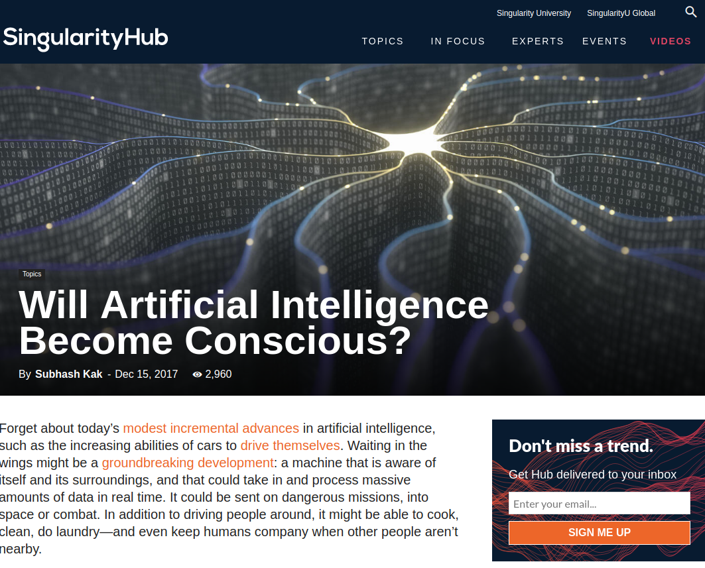
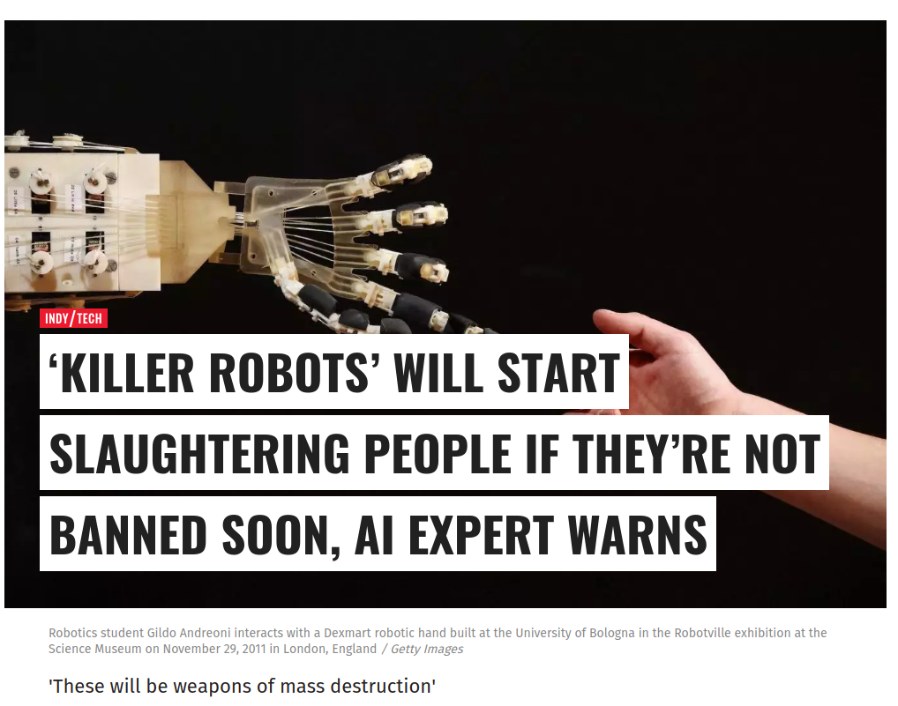
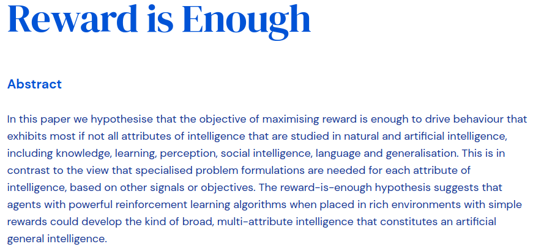
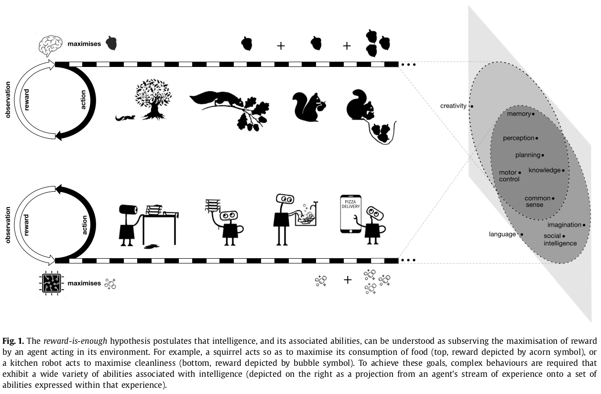
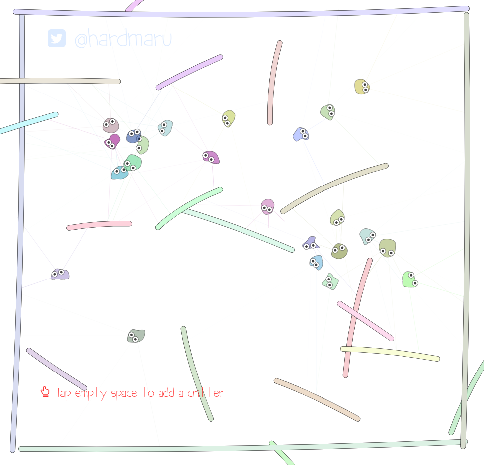
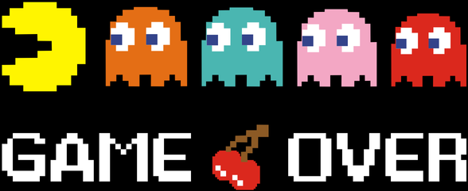

class: middle, center, title-slide

# Introduction to Artificial Intelligence

Lecture 11: Artificial General Intelligence

  
Prof. Gilles Louppe 
[g.louppe@uliege.be](mailto:g.louppe@uliege.be)

---

# Today$^\*$

.center.width-30[]

Towards generally intelligent agents?
- Artificial general intelligence
- AIXI
- Artifical life

.footnote[$^\*$: Take today's lecture with a grain of salt. Image credits: [CS188](https://inst.eecs.berkeley.edu/~cs188/), UC Berkeley.]

---

class: middle

.grid[.kol-1-6[].kol-2-3[.width-100[]]]
.grid[.kol-1-6[].kol-2-3[.width-100[]]]

.caption[From technological breakthroughs...]

---

class: middle

.grid[
.kol-3-4[

   
.center.width-80[]

.caption[... to press coverage.]
]
.kol-1-4[
.center.width-80[]
.center.width-80[]
.center.width-80[]
.center.width-80[]
]
]

---

class: middle

.center.width-40[]

## Artificial narrow intelligence

Today's artificial intelligence remains **narrow**:
- AI systems often reach super-human level performance, ... but only at *very specific problems*!
- They **do not generalize** to the real world nor to arbitrary tasks.

---

class: middle

## The case of AlphaGo

Convenient properties of the game of Go:
- Deterministic (no noise in the game).
- Fully observed (each player has complete information)
- Discrete action space (finite number of actions possible)
- Perfect simulator (the effect of any action is known exactly)
- Short episodes (200 actions per game)
- Clear and fast evaluation (as stated by Go rules)
- Huge dataset available (games)

.center.width-30[]

---

class: middle

.center.width-100[]

.center[Can we run AlphaGo on a robot?]

???

- Deterministic: Yes.
- Fully observed: **Almost.**
- Discrete action space: Yes
- Perfect simulator: **Nope! Not at all.**
- Short episodes: **Not really...**
- Clear and fast evaluation: Not good.
- Huge dataset available: **Nope.**

---

# AGI

Artificial general intelligence, or **AGI**, is the intelligence of a machine that could successfully perform any intellectual task that a human being can perform.

The scientific community agrees that AGI would be required to do the following:
- reason, use strategy, solve puzzle, plan,
- make judgments under uncertainty,
- represent knowledge, including commonsense knowledge,
- improve and learn new skills,
- communicate in natural language,
- be creative,
- integrate all these skills towards common goals.

This is similar to our definition of *thinking rationally*, but applied broadly to any set of tasks.

---

class: middle

## Roads towards AGI

Several working hypothesis:
1. Learning (supervised, unsupervised, reinforcement)
2. AIXI
3. Artificial life

... or probably something else?

---

class: middle

# Learning

---

class: middle, center

.width-90[]

.pull-right[David Silver et al, 2021.]

---

class: middle

.center.width-100[]

.footnote[Image credits: David Silver et al, "Reward is enough", 2021.]

---

class: middle, black-slide

.center[
<iframe width="640" height="420" src="https://www.youtube.com/embed/_wUzaRma0pU?loop=1" frameborder="0" volume="0" allowfullscreen></iframe>

Could AI be perceived as creative? (Jürgen Schmidhuber)

]

---

class: middle

# AIXI

AIXI (Hutter, 2005) is a theoretical mathematical formalism of artificial general intelligence.

---

class: center

.grid[
.kol-1-6[.width-90.circle[]]
.kol-3-4[ Occam: Prefer the simplest consistent hypothesis.]
]
.grid[
.kol-1-6[.width-90.circle[]]
.kol-3-4[ Epicurus: Keep all consistent hypotheses.]
]
.grid[
.kol-1-6[.width-90.circle[]]
.kol-3-4[ Bayes: $P(h|d) = \frac{P(d|h)P(h)}{P(d)}$]
]
.grid[
.kol-1-6[.width-90.circle[]]
.kol-3-4[ Turing: It is possible to invent a single machine which can be used to compute any computable sequence.]
]
.grid[
.kol-1-6[.width-90.circle[]]
.kol-3-4[ Solomonoff: Use computer programs $\mu$ as hypotheses/environments.]
]

---

class: middle

AIXI defines a measure of universal intelligence as 
$$\Upsilon(\pi) := \sum\_{\mu \in E} 2^{-K(\mu)} V^{\pi}\_\mu$$

where
- $\Upsilon(\pi)$ formally defines the **universal intelligence** of an agent $\pi$.
- $\mu$ is the environment of the agent and $E$ is the set of all computable reward bounded environments.
- $V^{\pi}\_\mu = \mathbb{E}\[ \sum\_{i=1}^\infty R\_i \]$ is the expected sum of future rewards when the agent $\pi$ interacts with environment $\mu$.
- $K(.)$ is the Kolmogorov complexity, such that $2^{-K(\mu)}$ weights the agent's performance in each environment, inversely proportional to its complexity.

???

Mix all items together (Solomonoff induction with decision theory) and you get AIXI.

Intuitively, $K(\mu)$ measures the complexity of the shortest Universal Turing Machine program that describes the environment $\mu$.

---

class: middle

## AIXI

$$\bar{\Upsilon} = \max\_\pi \Upsilon(\pi) = \Upsilon(\pi^\text{AIXI})$$

.center[
$\pi^\text{AIXI}$ is a **perfect** theoretical agent.
]

---

class: middle

## System identification

- Which Turing machine is the agent in? If it knew, it could plan perfectly.
- Use the *Bayes rule* to update the agent beliefs given its experience so far.

.center.width-100[]

---

class: middle

## Acting optimally

- The agent always picks the action which has the greatest expected reward.
- For every environment $\mu \in E$, the agent must:
    - Take into account how likely it is that it is facing $\mu$ given the interaction history so far, and the prior probability of $\mu$.
    - Consider all possible future interactions that might occur, assuming optimal future actions.
    - Evaluate how likely they are.
    - Then select the action that maximizes the expected future reward.

---

class: middle

.center.width-100[]

.footnote[Credits: [Andrej Karpathy, Where will AGI come from?](https://ivenzor.com/wp-content/uploads/2018/07/yconftalk-170902200916.pdf)]

???

- The best action a_t is the best action to some x_t, plus one more step.
- Note that we also simulate updates of the posterior.
- The equation embodies in one line the major ideas of Bayes, Ockham, Epicurus,
Turing, von Neumann, Bellman, Kolmogorov, and Solomonoff. The AIXI agent is
rigorously shown by [Hut05] to be optimal in many different senses of the word.

---

class: middle

## AIXI is incomputable

.center.width-100[]

.footnote[Credits: [Andrej Karpathy, Where will AGI come from?](https://ivenzor.com/wp-content/uploads/2018/07/yconftalk-170902200916.pdf)]

---

class: middle

## Benefits of AIXI

The AIXI theoretical formalism of AGI provides
- a high-level *blue-print* or inspiration for design;
- common terminology and goal formulation;
- understand and predict behavior of yet-to-be-built agents;
- appreciation of **fundamental challenges** (e.g., exploration-exploitation);
- *definition*/*measure* of intelligence.

---

class: middle

# Artificial life

---

# Artificial life

Study of systems related to natural life, its processes and its evolution, through the use of *simulations* with computer models, robotics or biochemistry.

One of its goals is to **synthesize** life in order to understand its origins, development and organization.

  
.center.width-80[]

.caption[How did intelligence arise in Nature?]

---

class: middle

## Approaches

There are three main kinds of artificial life, named after their approaches:
- Software approaches (soft)
- Hardware approaches (hard)
- Biochemistry approaches (wet)

The field of AI has traditionally used a top down approach. Artificial life generally works from the *bottom up*.
  
???

Artificial life is related to AI since synthesizing complex life forms would, **hypothetically**, induce intelligence.

---

class: middle, black-slide

.center[
<iframe width="640" height="420" src="https://www.youtube.com/embed/dySwrhMQdX4?&loop=1&start=353" frameborder="0" volume="0" allowfullscreen></iframe>

Wet artificial life: The line between life and not-life (Martin Hanczyc).
]

---

# Evolutionary algorithms

Evolution may **hypothetically** be interpreted as an (unknown) algorithm.
- This algorithm gave rise to AGI (e.g., it induced humans).
- **Simulation** of the evolutionary process should/could eventually reproduce life and, maybe, intelligence?

 

.center.width-60[]
.caption[Conway's game of life]

???

Using software simulation, we can work at a high level of abstraction.
- We don't have to simulate physics or chemistry to simulate evolution.
- We can also bootstrap the system with agents that are better than random.

---

class: middle, black-slide

.center[
<iframe width="640" height="420" src="https://www.youtube.com/embed/Kk2MH9O4pXY?&loop=1" frameborder="0" volume="0" allowfullscreen></iframe>

Conway's game of life
]

---

class: middle

## Evolutionary algorithms as metaheuristic optimization algorithms

1. Start with a random population of creatures.
2. Repeat until termination:
   1. Each creature is tested for their ability to perform a given task.
   2. Select the fittest creatures for reproduction.
   3. Breed new creatures by combining and mutating the virtual genes of their selected parents. 
   4. Replace the least-fit creatures of the population with new creatures.

As this cycle of variation and selection continues, creatures with more and more successful behaviors may **emerge**.

???

Virtual genes could be artificial neural networks.

---

class: black-slide, middle

.center[
<iframe width="640" height="420" src="https://www.youtube.com/embed/bBt0imn77Zg?&loop=1&start=0" frameborder="0" volume="0" allowfullscreen></iframe>

Karl Sims, 1994.
]

???

Bootstrapped the field.

---

class: black-slide, middle

.center[
<iframe width="640" height="420" src="https://www.youtube.com/embed/ngCIB-IWD8E?&loop=1&start=0" frameborder="0" volume="0" allowfullscreen></iframe>

Self-assembling morphologies (Pathak et al, 2019)
]

---

class: black-slide, middle

.center[
<iframe width="640" height="420" src="https://www.youtube.com/embed/wQQ2NHECcvQ?&loop=1&start=0" frameborder="0" volume="0" allowfullscreen></iframe>

Mini-documentary: Artifical life
]

???

Jump to 6:40.

---

class: middle, center

.width-70[]

Creatures avoiding planks [[demo](http://otoro.net/planks/)].

---

class: middle

## Environments for AGI?

For the emergence of generally intelligent creatures, environments should **incentivize** the emergence of a *cognitive toolkit* (attention, memory, knowledge representation, reasoning, emotions, forward simulation, skill acquisition, ...).

.center.width-80[]

.footnote[Credits: [Andrej Karpathy, Where will AGI come from?](https://ivenzor.com/wp-content/uploads/2018/07/yconftalk-170902200916.pdf)]

---

class: middle

Multi-agent environments are certainly better because of:
- Variety: the environment is parameterized by its agent  population. The optimal strategy must be derived dynamically.
- Natural curriculum: the difficulty of the environment is determined by the skill of the other agents.

---

class: middle

# Conclusions

---

class: middle, black-slide

.center[
<iframe width="640" height="420" src="https://www.youtube.com/embed/NP8xt8o4_5Q?&loop=1&start=0" frameborder="0" volume="0" allowfullscreen></iframe>

A note of optimism: Don't fear intelligent machines, 
work with them (Garry Kasparov).
]

---

class: middle

## Beyond Pacman

Artificial intelligence algorithms are transforming science, engineering and society.

As future engineers or scientists, AI offers you opportunities to address some of the world's biggest challenges. Seize them!

.footnote[E.g.: [Climate Change AI](https://www.climatechange.ai/).]

---

# Recap

- Lecture 0: Artificial intelligence
- Lecture 1: Intelligent agents
- Lecture 2: Solving problems by searching
- .inactive[Lecture 2b: Constraint satisfaction problems (optional)]
- Lecture 3: Adversarial search
- Lecture 4: Representing uncertain knowledge
- Lecture 5: Inference in Bayesian networks
- Lecture 6: Reasoning over time
- Lecture 7: Learning
- Lecture 8: Making decisions
- Lecture 9: Reinforcement learning
- .inactive[Lecture 10: Communication (optional)]
- Lecture 11: Artificial General Intelligence and beyond 

---

class: middle, center

.width-50[]

---

# Going further

This course is designed as an introduction to the many other courses available at ULiège and related to AI, including:

- ELEN0062: Introduction to Machine Learning
- INFO8004: Advanced Machine Learning
- INFO8010: Deep Learning
- INFO8003: Optimal decision making for complex problems
- INFO0948: Introduction to Intelligent Robotics
- INFO0049: Knowledge representation
- ELEN0016: Computer vision
- ELEN0060: Information and coding theory
- MATH2022: Large-sample analysis: theory and practice
- DROI8031: Introduction to the law of robots

---

# Research opportunities

Feel free to contact us
- for research Summer internship opportunities
- MSc thesis opportunities
- PhD thesis opportunities

---

class: center, middle, black-slide
count: false

.center.width-70[]

  

Thanks for following Introduction to Artificial Intelligence!