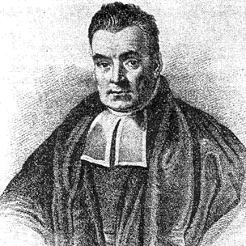
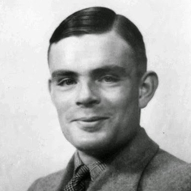
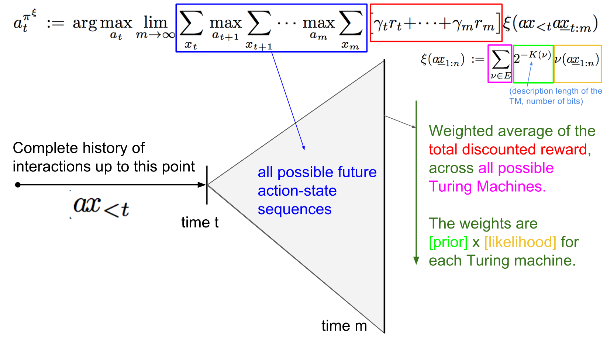
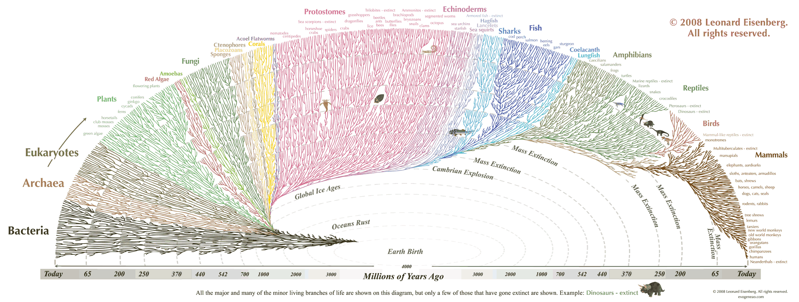

class: middle, center, title-slide

# Introduction to Artificial Intelligence

Lecture 11: Artificial General Intelligence

  
Prof. Gilles Louppe 
[g.louppe@uliege.be](mailto:g.louppe@uliege.be)

???

human centered ai, ai concerns more than engineers
ai for what? climate, energy, science, etc

http://www.machineintelligence.org/universal-ai.pdf
R: https://virtualcreatures.github.io/

R: consciousness, self-awareness

R: chinese room argument https://plato.stanford.edu/entries/chinese-room/

---

# Today$^\*$

.center.width-30[]

Towards *generally intelligent* agents?
- Artificial general intelligence
- AIXI
- Artifical life

.footnote[$^\*$: Take today's lecture with a grain of salt.
Image credits: [CS188](http://ai.berkeley.edu/lecture_slides.html), UC Berkeley.]

---

class: middle

.grid[.kol-1-6[].kol-2-3[.width-100[]]]
.grid[.kol-1-6[].kol-2-3[.width-100[]]]

.caption[From technological breakthroughs...]

---

class: middle

.grid[
.kol-3-4[

   
.center.width-80[]

.caption[... to press coverage.]
]
.kol-1-4[
.center.width-80[]
.center.width-80[]
.center.width-80[]
.center.width-80[]
]
]

---

class: middle

.center.width-40[]

## Artificial narrow intelligence

Artificial intelligence today remains **narrow**:
- Modern AI systems often reach super-human level performance.
- ... but only at *very specific problems*!
- They **do not generalize** to the real world nor to arbitrary tasks.

---

# The case of AlphaGo

Convenient properties of the game of Go:
- Deterministic (no noise in the game).
- Fully observed (each player has complete information)
- Discrete action space (finite number of actions possible)
- Perfect simulator (the effect of any action is known exactly)
- Short episodes (200 actions per game)
- Clear and fast evaluation (as stated by Go rules)
- Huge dataset available (games)

.center.width-30[]

---

class: middle

.center.width-100[]

.center[Can we run AlphaGo on a robot for the Amazon Picking Challenge?]

---

class: middle

- Deterministic: Yes.
- Fully observed: **Almost.**
- Discrete action space: Yes
- Perfect simulator: **Nope! Not at all.**
- Short episodes: **Not really...**
- Clear and fast evaluation: Not good.
- Huge dataset available: **Nope.**

---

# Artificial general intelligence

**Artificial general intelligence** (AGI) is the intelligence of a machine that could successfully perform any intellectual task that a human being can.

- No clear and definitive definition.
- Agreement that AGI is required to do the following:
    - reason, use strategy, solve puzzle, plan,
    - make judgments under uncertainty,
    - represent knowledge, including commonsense knowledge,
    - improve and learn new skills,
    - communicate in natural language,
    - integrate all these skills towards common goals.
- This is similar to our definition of *thinking rationally*, but applied broadly to any set of tasks.

---

class: middle

.center.circle.width-20[]
.caption[Irving John Good (1965)]

## Singularity

- Let an **ultraintelligent** machine be defined as a machine that can far surpass all the intellectual activities of any man however clever.
- Since the design of machines is one of these intellectual activities, an ultraintelligent machine could *design even better machines*.
- There would then unquestionably be an **intelligence explosion**, and the intelligence of man would be left far behind.
- Thus the first ultraintelligent machine is the *last invention* that man need ever make, provided that the machine is docile enough to tell us how to keep it under control.

???

- Good worked as a cryptologist with Alan Turing.
- Note that human is also capable of self-improvement, with medicine (from macro to gene).

---

class: middle, black-slide

.center[
<iframe width="640" height="420" src="https://www.youtube.com/embed/MnT1xgZgkpk?&loop=1&start=0" frameborder="0" volume="0" allowfullscreen></iframe>

What happens when our computers get smarter than we are? (Nick Bostrom)
]

---

class: middle

## Roads towards Artificial General Intelligence

Several working **hypothesis**:
- Supervised learning
- Unsupervised learning
- *AIXI*
- *Artificial life*
- Brain simulation

Or maybe (certainly) something else?

---

class: middle

# AIXI

???

Mathematical formalism for AGI.

---

class: middle

In which environment is the agent?
- In general, we do not know!
- Solution:
    - maintain a prior over environments,
    - update it as evidence is collected,
    - follow the Bayes-optimal  solution.

---

class: middle, center

.grid[
.kol-1-6[.width-100.circle[]]
.kol-3-4[ Occam: Prefer the simplest consistent hypothesis.]
]
.grid[
.kol-1-6[.width-100.circle[]]
.kol-3-4[ Epicurus: Keep all consitent hypotheses.]
]
.grid[
.kol-1-6[.width-100.circle[]]
.kol-3-4[ Bayes: $P(h|d) = \frac{P(d|h)P(h)}{P(d)}$]
]
.grid[
.kol-1-6[.width-100.circle[]]
.kol-3-4[ Turing: It is possible to invent a single machine which can be used to compute any computable sequence.]
]

---

class: middle

.grid[
.kol-3-4[
## Solomonoff induction

- Use computer programs $\mu$ as hypotheses/environments.
- Make a weighted prediction based on all consistent programs, with short programs weighted higher.
]
.kol-1-4[.width-100.circle[]]
]

---

class: middle

$$\Upsilon(\pi) := \sum\_{\mu \in E} 2^{-K(\mu)} V^{\pi}\_\mu$$

???

Mix all items together (Solomonoff induction with decision theory) and you get AIXI.

---

class: middle

- $\Upsilon(\pi)$ formally defines the **universal intelligence** of an agent $\pi$.
- $\mu$ is the environment of the agent and $E$ is the set of all computable reward bounded environments.
- $V^{\pi}\_\mu = \mathbb{E}\[ \sum\_{i=1}^\infty R\_i \]$ is the expected sum of future rewards when the agent $\pi$ interacts with environment $\mu$.
- $K(.)$ is the Kolmogorov complexity, such that $2^{-K(\mu)}$ weights the agent's performance in each environment, inversely proportional to its complexity.
    - Intuitively, $K(\mu)$ measures the complexity of the shortest Universal Turing Machine program that describes the environment $\mu$.

---

class: middle

## AIXI

$$\bar{\Upsilon} = \max\_\pi \Upsilon(\pi) = \Upsilon(\pi^\text{AIXI})$$

.center[
$\pi^\text{AIXI}$ is a **perfect** theoretical agent.
]

---

class: middle

## System identification

- Which Turing machine is the agent in? If it knew, it could plan perfectly.
- Use the *Bayes rule* to update the agent beliefs given its experience so far.

.center.width-100[]

---

class: middle

## Acting optimally

- The agent always picks the action which has the greatest expected reward.
- For every environment $\mu \in E$, the agent must:
    - Take into account how likely it is that it is facing $\mu$ given the interaction history so far, and the prior probability of $\mu$.
    - Consider all possible future interactions that might occur, assuming optimal future actions.
    - Evaluate how likely they are.
    - Then select the action that maximizes the expected future reward.

---

class: middle

.center.width-100[]

.footnote[Credits: [Andrej Karpathy, Where will AGI come from?](https://ivenzor.com/wp-content/uploads/2018/07/yconftalk-170902200916.pdf)]

???

- The best action a_t is the best action to some x_t, plus one more step.
- Note that we also simulate updates of the posterior.
- The equation embodies in one line the major ideas of Bayes, Ockham, Epicurus,
Turing, von Neumann, Bellman, Kolmogorov, and Solomonoff. The AIXI agent is
rigorously shown by [Hut05] to be optimal in many different senses of the word.

---

class: middle

## AIXI is incomputable

.center.width-100[]

.footnote[Credits: [Andrej Karpathy, Where will AGI come from?](https://ivenzor.com/wp-content/uploads/2018/07/yconftalk-170902200916.pdf)]

---

class: middle

## Monte Carlo approximation

.center.width-100[]

---

class: middle

## Benefits of a foundational theory of AI

AIXI provides
- a high-level *blue-print* or inspiration for design;
- common terminology and goal formulation;
- understand and predict behavior of yet-to-be-built agents;
- appreciation of **fundamental challenges** (e.g., exploration-exploitation);
- *definition*/*measure* of intelligence.

---

class: middle

# Artificial life

---

class: middle

.center.width-100[]

.caption[How did intelligence arise in Nature?]

---

# Artificial life

- **Artificial life** is the study of systems related to natural life, its processes and its evolution, through the use of *simulations* with computer models, robotics or biochemistry.
- One of its goals is to *synthesize* life in order to understand its origins, development and organization.
- There are three main kinds of artificial life, named after their approaches:
    - Software approaches (soft)
    - Hardware approaches (hard)
    - Biochemistry approaches (wet)
- Artificial life is related to AI since synthesizing complex life forms would, **hypothetically**, induce intelligence.
- The field of AI has traditionally used a top down approach. Artificial life generally works from the bottom up.

---

class: middle, black-slide

.center[
<iframe width="640" height="420" src="https://www.youtube.com/embed/dySwrhMQdX4?&loop=1&start=0" frameborder="0" volume="0" allowfullscreen></iframe>

Wet artificial life: The line between life and not-life (Martin Hanczyc).
]

---

# Evolution

Evolution may **hypothetically** be interpreted as an (unknown) algorithm.
- This algorithm gave rise to AGI (e.g., it induced humans).
- Can we **simulate** the *evolutionary process* to reproduce life and intelligence?
- Using software simulation, we can work at a high level of abstraction.
    - We don't have to simulate physics or chemistry to simulate evolution.
    - We can also bootstrap the system with agents that are better than random.

---

class: middle

## Evolutionary algorithms

- Start with a *random population* of **creatures**.
- Each creature is *tested for their ability* to perform a given task.
    - e.g., swim in a simulated environment.
    - e.g., stay alive as long as possible (without starving or being killed).
- The **most successful survive**.
- Their virtual genes containing coded instructions for their growth are copied, combined and mutated to *make offspring* for a new population.
- The new creatures are tested again, some of which may be improvements on their parents.
- As this cycle of variation and selection continues, creatures with more and more successful behaviors may **emerge**.

???

Virtual genes could be artificial neural networks.

---

class: black-slide, middle

.center[
<iframe width="640" height="420" src="https://www.youtube.com/embed/CQVjS-PT_c4?&loop=1&start=0" frameborder="0" volume="0" allowfullscreen></iframe>
]

---

class: black-slide, middle

.center[
<iframe width="640" height="420" src="https://www.youtube.com/embed/bBt0imn77Zg?&loop=1&start=0" frameborder="0" volume="0" allowfullscreen></iframe>
]

---

class: middle

.center[
.width-100[]

Evolution strategies for locomotion.
]

.footnote[Image credits: [OpenAI](https://blog.openai.com/evolution-strategies/).]

???

See also http://blog.otoro.net/2017/11/12/evolving-stable-strategies/.

---

class: middle, center

Neurevolution [demo](http://otoro.net/planks/).

---

class: middle

## Environments for AGI?

For the emergence of generally intelligent creatures, we presumably need environments that **incentivize** the emergence of a *cognitive toolkit* (attention, memory, knowledge representation, reasoning, emotions, forward simulation, skill acquisition, ...).

.center.width-80[]

.footnote[Credits: [Andrej Karpathy, Where will AGI come from?](https://ivenzor.com/wp-content/uploads/2018/07/yconftalk-170902200916.pdf)]

---

class: middle

**Multi-agent** environments are certainly better because of:
- Variety: the environment is parameterized by its agent  population. The optimal strategy must be derived dynamically.
- Natural curriculum: the difficulty of the environment is determined by the skill of the other agents.

---

class: middle

# Conclusions

---

# Roads towards AGI

In order of (subjective) promisingness
- Artificial life
- Something not on our radar
- Supervised learning
- Unsupervised learning
- AIXI
- Brain simulation

What do you think?

---

class: middle, black-slide

.center[
<iframe width="640" height="420" src="https://www.youtube.com/embed/NP8xt8o4_5Q?&loop=1&start=0" frameborder="0" volume="0" allowfullscreen></iframe>

A note of optimism: Don't fear intelligent machines, 
work with them (Garry Kasparov).
]

---

# Outline

- Lecture 1: Foundations
- Lecture 2: Solving problems by searching
- Lecture 3: Constraint satisfaction problems
- Lecture 4: Adversarial search
- Lecture 5: Representing uncertain knowledge
- Lecture 6: Inference in Bayesian networks
- Lecture 7: Reasoning over time
- Lecture 8: Making decisions
- Lecture 9: Learning
- Lecture 10: Communication
- Lecture 11: Artificial General Intelligence and beyond

---

# Going further

This course is designed as an introduction to the many other courses available at ULiège and related to AI, including:

- ELEN0062: Introduction to Machine Learning
- INFO8004: Advanced Machine Learning
- INFO8010: Deep Learning
- INFO8003: Optimal decision making for complex problems
- INFO0948: Introduction to Intelligent Robotics
- INFO0049: Knowledge representation
- ELEN0016: Computer vision
- DROI8031: Introduction to the law of robots

---

# Research opportunities

Feel free to contact us
- for research Summer internship opportunities (locally or abroad),
- MSc thesis opportunities,
- PhD thesis opportunities.

---

class: center, middle, black-slide
count: false

.center.width-70[]

  

Thanks for following Introduction to Artificial Intelligence!

---

# References

- Bostrom, Nick. Superintelligence. Dunod, 2017.
- Legg, Shane, and Marcus Hutter. "Universal intelligence: A definition of machine intelligence." Minds and Machines 17.4 (2007): 391-444.
- Hutter, Marcus. "One decade of universal artificial intelligence." Theoretical foundations of artificial general intelligence (2012): 67-88.
- Sims, Karl. "Evolving 3D morphology and behavior by competition." Artificial life 1.4 (1994): 353-372.
- Kasparov, Garry. Deep Thinking: Where Machine Intelligence Ends and Human Creativity Begins, 2017.
