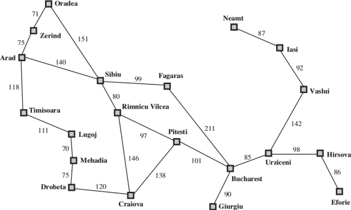

class: middle, center, title-slide

# Introduction to Artificial Intelligence

Lecture 2: Solving problems by searching

---

# Today

- Agents that plan ahead
- Search problems
- Informed search methods
- Uninformed search methods
    - Depth-first search
    - Breadth-first search
    - Uniform-cost search
- Informed search methods
    - A*
    - Heuristics

---

# Reflex agents

Reflex agents:
- Select actions on the basis of the current percept.
- May have a model of the world current state.
- Do not consider the future consequences of their actions.
- Consider only **how the world is now**.

[Q] Can a reflex agent be rational?

.grid[
.col-1-2[

]
.col-1-2[

]
]

---

# Problem-solving agents

Assumptions:
- *Observable* and *known* environment.
- *Deterministic* environment

Problem-solving agents:
- Take decisions based on (hypothesized) consequences of actions.
- Must have a model of how the world evolves in response to actions.
- Formulate a goal.
- Consider **how to world would be**.

.grid[
.col-1-2[

]
.col-1-2[

]
]

---

.stretch[]

Notes:
- This is *offline* problem solving. The solution is executed "eyes closed", ignoring the percepts.
- *Online* problem solving involves acting without complete knowledge.

---

# Search problems

A **search problem** consists of the following components:
- The *initial state* of the agent.
- A description of the *actions* available to the agent given a state $s$, denoted $\text{actions}(s)$.
- A *transition model* that returns the state $s' = \text{result}(s, a)$ that results from doing action $a$ in state $s$.
    - We say that $s'$ is a *successor* of $s$ if there is an acceptable action from $s$ to $s'$.

.center[]

---

- Together, the initial state, the actions and the transition model define the *state space* of the problem, i.e. the set of all states reachable from the initial state by any sequence of action.
    - The state space forms a directed graph in which the nodes are states and links between nodes are actions.
    - A path is a sequence of states connected by actions.

.center[]

- A *goal test* which determines whether the solution of the problem is achieved in state $s$.
- A *path cost* that assigns a numeric value to each path.
  - We may also assume that the path cost corresponds to a sum of positive *step costs* $c(s,a,s')$  associated to the action $a$ in $s$ leading to $s'$.

A **solution** to a problem is an action sequence that leads from the initial state to a goal state.
A solution quality is measured by the path cost function and an *optimal solution* has the lowest path cost
among all solutions.

[Q] What if the environment is partially observable? non-deterministic?

---

# Search problems are models

.stretch[]

.footnote[Credits: UC Berkeley, [CS188](http://ai.berkeley.edu/lecture_slides.html)]

---

# Example: Traveling in Romania

.center[]

- Initial state = the city we start in.
    - $s_0 = \text{in}(\text{Arad})$
- Actions = Going from the current city to the cities that are directly connected to it.
    - $\text{actions}(s_0) = \\{ \text{go}(\text{Sibiu}), \text{go}(\text{Timisoara}), \text{go}(\text{Zerind}) \\}$

---

- Transition model = The city we arrive in after driving to it.
    - $\text{result}(\text{in}(Arad), \text{go}(Zerind)) = \text{in}(Zerind)$
- Goal test: whether we are in Bucharest.
    - $s \in \\{ \text{in}(\text{Bucharest}) \\}$
- Step cost: distances between cities.

---

# Selecting a state space

- Real world is absurdly complex.
    - The *world state* includes every last detail of the environment.
    - State space must be abstracted for problem solving.

.stretch[]

- A *search state* keeps only the details needed for planning.
    - Problem: eat-all-dots
        - States: $\\{ (x, y), \text{dot booleans}\\}$
        - Actions: NSEW
        - Transition: update location and possibly a dot boolean
        - Goal test: dots all false

---

# State space size

.grid[
.col-1-2[
- *World state*:
    - Agent positions: 120
    - Found count: 30
    - Ghost positions: 12
    - Agent facing: NSEW
- *How many?*
    - World states?
        - $120 \times 2^{30} \times 12^2 \times 4$
    - States for eat-all-dots?
        - $120 \times 2^{30}$
]
.col-1-2[

]
]

---

# Search tree

---

# Searching for solutions

- tree search
- guided example
- problem-solving performance

---

# Uninformed search strategies

---

# Informed search strategies

- A*

---

# Heuristic functions

- learning heuristic from experience

---

# Summary

---

# References
