class: middle, center, title-slide

# Introduction to Artificial Intelligence

Lecture 2: Solving problems by searching

<br><br>
Prof. Gilles Louppe<br>
[g.louppe@uliege.be](mailto:g.louppe@uliege.be)

---

class: middle, center

.width-50[]

---

# Today

.grid[
.kol-1-2[
- Planning agents
- Search problems
- Uninformed search methods
    - Depth-first search
    - Breadth-first search
    - Uniform-cost search
- Informed search methods
    - A*
    - Heuristics
]
.kol-1-2[
.center.width-100[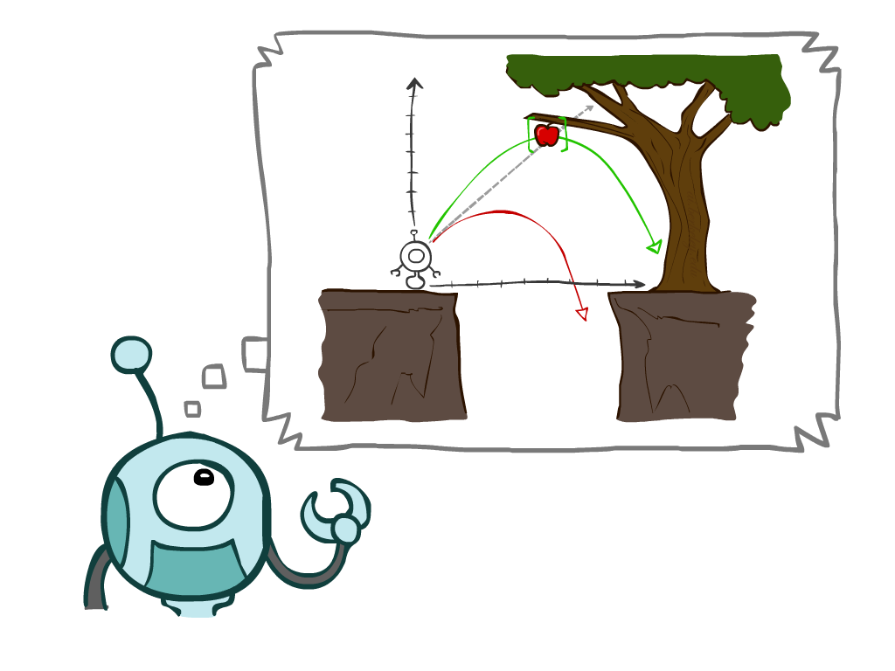]

]
]

.footnote[Credits: [CS188](https://inst.eecs.berkeley.edu/~cs188/), UC Berkeley.]

---

class: middle

# Planning agents

???

Start with a human agent for Pacman and discuss.

```
cd demo/lec2
uv run python run.py --agentfile humanagent.py --layout ex
```
---

# Reflex agents

A .bold[reflex agent] acts on the current percept alone, ${a\_t = \pi(e\_t)}$. It may keep a model of the world, but it ignores the percept history and the future consequences of its actions.

Reflexes are enough to act rationally when the environment is .bold[fully observable], .bold[deterministic] and .bold[known].

.alert[For complex tasks, they are difficult to implement: the action with the best long-term outcome is more naturally expressed as planning.]

???

Can a reflex agent be rational?

Yes, provided the correct decision can be made from the current percept, i.e. if the environment is fully observable, deterministic and known.

---

# Problem-solving agents

A .bold[problem-solving agent] is a .bold[goal-based agent] (Lecture 1): given goal states ${G \subseteq \mathcal{S}}$, it .bold[searches] its transition model for an action sequence that reaches one of them, instead of reacting to the current percept.

Assumptions on the environment:
- .bold[single agent]: no other agent acts on the environment;
- .bold[fully observable]: the percept reveals the state, ${e\_t = s\_t}$;
- .bold[deterministic]: ${s\_{t+1} = \text{result}(s\_t, a\_t)}$;
- .bold[known]: the agent knows $\text{result}$.

The agent can therefore plan the whole sequence before acting.

---

class: middle

.width-100[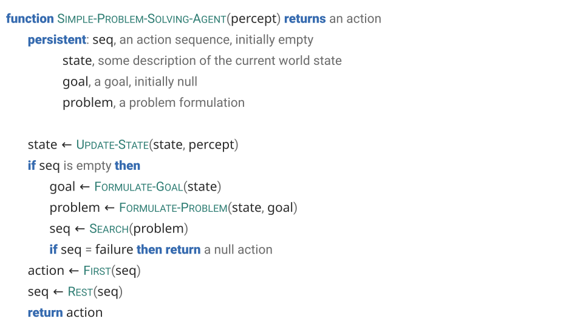]

???

Point out this is offline. The execution is executed eyes closed.

---

class: middle

## Offline vs. Online solving

- .bold[Offline]: the agent computes the whole sequence ${a\_{1:T}}$ from $s\_1$, then executes it "eyes closed", ignoring its percepts ${e\_{1:t}}$.
- .bold[Online]: the agent recomputes what to do at each step from what it has perceived, ${a\_t = \pi(e\_{1:t})}$. That is a policy, not a plan.

---

class: middle

# Search problems

---

# Search problems

A .bold[search problem] is defined by
- the .bold[states] ${s \in \mathcal{S}}$ of the agent and its environment, and the .bold[initial state] ${s\_1 \in \mathcal{S}}$;
- the .bold[actions] ${\text{actions}(s) \subseteq \mathcal{A}}$ available in a state $s$;
- a .bold[transition model] ${s' = \text{result}(s, a)}$, the state that results from taking $a$ in $s$.
    - We say that $s'$ is a .bold[successor] of $s$ if some applicable action leads from $s$ to $s'$.

.center[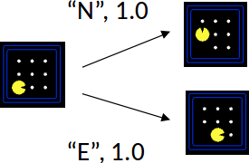]

???

List on the blackboard.

---

class: middle

.center[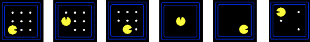]

- Together, $s\_1$, $\text{actions}$ and $\text{result}$ define the .bold[state space], the set of states reachable from $s\_1$ by any sequence of actions.
    - It forms a directed graph: nodes are states, edges are actions.
    - A path is a sequence of states connected by actions.
- The .bold[goal states] ${G \subseteq \mathcal{S}}$ are those in which the problem is solved. The .bold[goal test] checks whether ${s \in G}$.
- The .bold[step costs] ${c(s, a, s') > 0}$ give the cost of taking $a$ in $s$ to reach $s'$. The .bold[path cost] is their sum along a path.

---

class: middle

A .bold[solution] is an action sequence ${a\_{1:T}}$ such that ${s\_{t+1} = \text{result}(s\_t, a\_t)}$ for ${t = 1, \ldots, T}$ and ${s\_{T+1} \in G}$. Its path cost is
$$\sum\_{t=1}^{T} c(s\_t, a\_t, s\_{t+1}).$$

An .bold[optimal solution] is a solution of minimal path cost.

---

class: middle

## Example: Traveling in Romania

.center.width-100[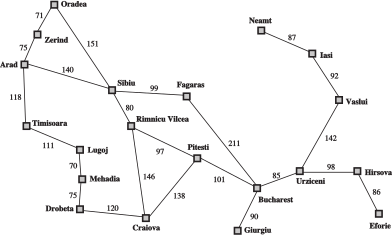]

.caption[How to go from Arad to Bucharest?]

---

class: middle

- Representation of states: the city we are in.
    - $s \in \\{ \text{in}(\text{Arad}), \text{in}(\text{Bucharest}), \ldots \\}$
- Initial state = the city we start in.
    - $s\_1 = \text{in}(\text{Arad})$
- Actions = Going from the current city to the cities that are directly connected to it.
    - $\text{actions}(s\_1) = \\{ \text{go}(\text{Sibiu}), \text{go}(\text{Timisoara}), \text{go}(\text{Zerind}) \\}$
- Transition model = The city we arrive in after driving to it.
    - $\text{result}(\text{in}(\text{Arad}), \text{go}(\text{Zerind})) = \text{in}(\text{Zerind})$
- Goal states: being in Bucharest.
    - $G = \\{ \text{in}(\text{Bucharest}) \\}$
- Step cost: distances between cities.

---

# Selecting a state space

The real world is absurdly .bold[complex].
- The .bold[world state] includes every last detail of the environment.
- A .bold[search state] ${s \in \mathcal{S}}$ keeps only the details needed for planning.

.width-75.center[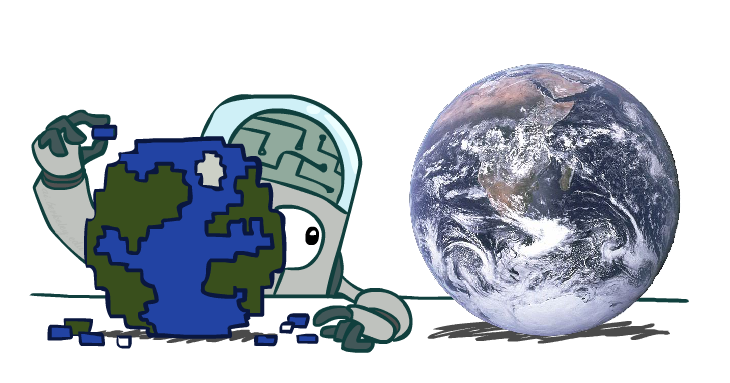]
.center[Search problems are .bold[models].]

.footnote[Credits: [CS188](https://inst.eecs.berkeley.edu/~cs188/), UC Berkeley.]

???

Search problems are models, i.e. mathematical abstractions. These models omit the details that are not relevant for solving the problem.

The process of removing details from a representation is called abstraction.

---

class: middle

## Example: eat-all-dots

In a maze with $k$ dots,
- states: a position and the dots left, ${s = ((x,y), d)}$ with ${d \in \\{0,1\\}^k}$;
- actions: ${\mathcal{A} = \\{ \text{N}, \text{S}, \text{E}, \text{W} \\}}$;
- transition model: ${\text{result}(s, a)}$ moves Pacman one cell, and clears the dot it finds there;
- goal states: ${G = \\{ ((x,y), d) : d = \mathbf{0} \\}}$;
- step cost: $1$ per move.

.width-100.center[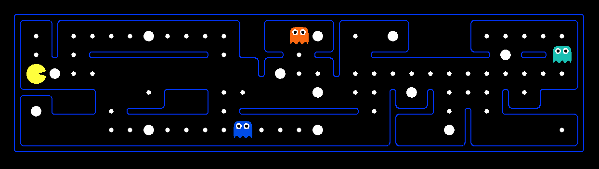]

---

class: middle

## State space size

.grid[
.kol-3-5[
The maze on the right has 120 cells, 30 dots and 2 ghosts. A .bold[world state] holds
- the position of Pacman, 120 values;
- the dots left, $2^{30}$;
- the positions of the ghosts, $12^2$;
- the direction Pacman faces, 4;

hence ${120 \times 2^{30} \times 12^2 \times 4 \approx 7 \times 10^{13}}$ world states, against ${|\mathcal{S}| = 120 \times 2^{30} \approx 1.3 \times 10^{11}}$ for eat-all-dots.
]
.kol-2-5[
.width-100[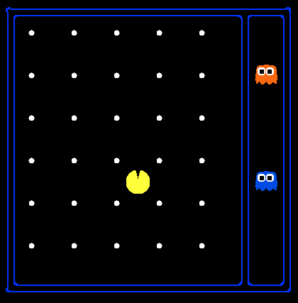]
]
]

---

# Tree search algorithms

We look for a path from $s\_1$ to $G$ in the state space.

To find one, search .bold[grows candidate paths] from $s\_1$, one action at a time, until one of them reaches $G$.

The candidates form the .bold[search tree]: its root is $s\_1$, its branches are actions, and a .bold[node] $n$ is a path, of last state $s(n)$ and cost $g(n)$. A state reached by several paths sits in several nodes. Step costs are written $c(s, a, s')$ or $c(n, a, n')$, indifferently.

We can rarely build the whole tree, yet we want an optimal branch.

.center.width-45[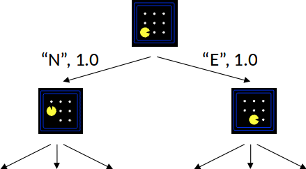]

---

class: middle

.width-100[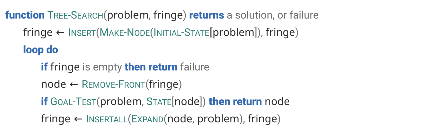]

## Important ideas
- .bold[Fringe] (or frontier): the leaves of the tree, generated but not expanded.
- .bold[Expansion]: replacing a leaf by its children.
- .bold[Strategy]: which leaf to expand next.

---

class: middle

.question[Which fringe nodes to explore? How to expand as few nodes as possible, while achieving the goal?]

---

class: middle

.center.width-90[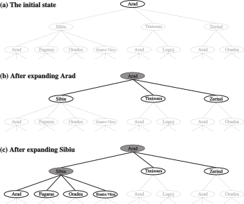]

---

class: middle

# Uninformed search strategies

---

# Uninformed search strategies

.bold[Uninformed] search strategies use only the information available in the problem definition.
They do not know whether a state looks more promising than some other.

## Strategies
- Depth-first search
- Breadth-first search
- Uniform-cost search
- Iterative deepening

---

# Properties of search strategies

- A strategy is defined by picking the .bold[order of expansion].
- Strategies are evaluated along the following dimensions:
    - .bold[Completeness]: does it always find a solution if one exists?
    - .bold[Optimality]: does it always find the least-cost solution?
    - .bold[Time complexity]: how long does it take to find a solution?
    - .bold[Space complexity]: how much memory is needed to perform the search?
- Time and space complexity are measured in terms of
    - $b$: maximum branching factor of the search tree
    - $d$: depth of the least-cost solution
        * the depth of $s$ is defined as the number of actions from the initial state to $s$.
    - $m$: maximum length of any path in the state space (may be $\infty$)

---

class: middle

.center.width-80[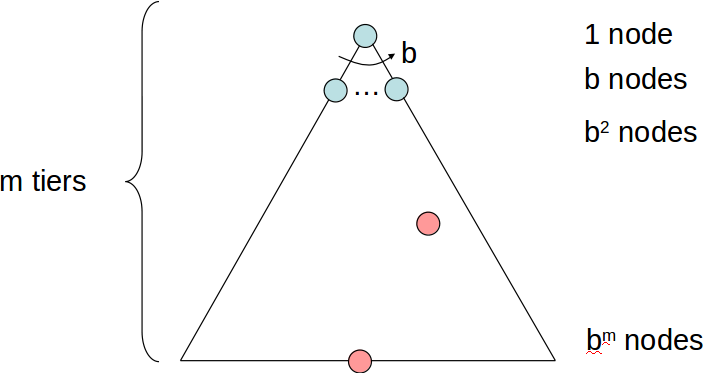]

???

Number of nodes in a tree = $\frac{b^{m+1}-1}{b-1}$

---

# Depth-first search

<br><br>
.width-100[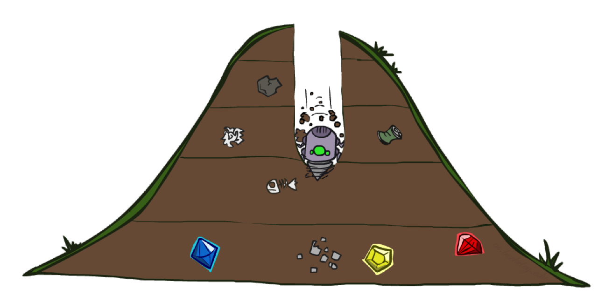]

.footnote[Credits: [CS188](https://inst.eecs.berkeley.edu/~cs188/), UC Berkeley.]

---

class: middle

- .bold[Strategy]: expand the deepest node in the fringe.
- .bold[Implementation]: fringe is a .bold[LIFO stack].

.width-80.center[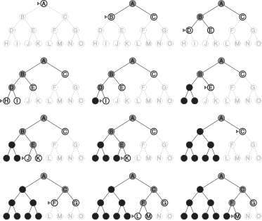]

---

class: middle

.center.width-80[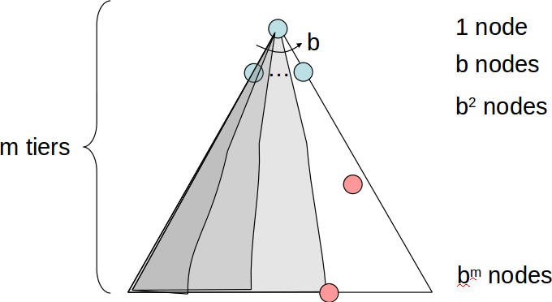]

---

class: middle

## Properties of DFS

- .bold[Completeness]:
    - $m$ could be infinite, so only if we prevent cycles (more on this later).
- .bold[Optimality]:
    - No, DFS finds the leftmost solution, regardless of depth or cost.
- .bold[Time complexity]:
    - May generate the whole tree (or a good part of it, regardless of $d$).
      Therefore $O(b^m)$, which might be much greater than the size of the state space!
- .bold[Space complexity]:
    - Only store siblings on path to root, therefore $O(bm)$.
    - When all the descendants of a node have been visited, the node can be removed from memory.

---

# Breadth-first search

<br><br>
.width-100[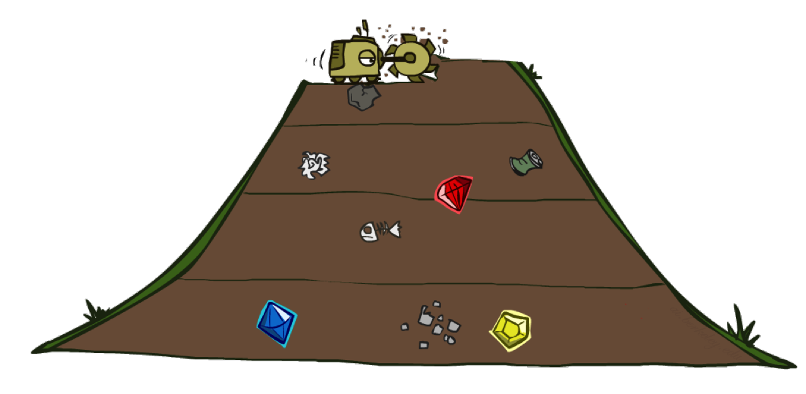]

.footnote[Credits: [CS188](https://inst.eecs.berkeley.edu/~cs188/), UC Berkeley.]

---

class: middle

- .bold[Strategy]: expand the shallowest node in the fringe.
- .bold[Implementation]: fringe is a .bold[FIFO queue].

.width-80.center[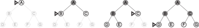]

---

class: middle

.center.width-80[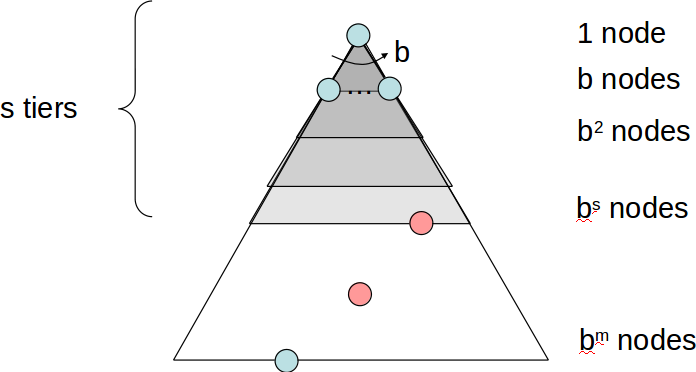]

---

class: middle

## Properties of BFS

- .bold[Completeness]:
    - If the shallowest goal node is at some finite depth $d$, BFS will eventually find it after generating all shallower nodes (provided $b$ is finite).
- .bold[Optimality]:
    - The shallowest goal is not necessarily the optimal one.
    - BFS is optimal only if the path cost is a non-decreasing function of the depth of the node.
- .bold[Time complexity]:
    - If the solution is at depth $d$, then the total number of nodes generated before finding this node is $b+b^2+b^3+...+b^d = O(b^d)$
- .bold[Space complexity]:
    - The number of nodes to maintain in memory is the size of the fringe, which will be the largest at the last tier. That is $O(b^d)$

---

class: middle, center

(demo)

???

```
cd demo/lec2
uv run python run.py --agentfile dfs.py --show 1 --layout small
uv run python run.py --agentfile bfs.py --show 1 --layout small

uv run python run.py --agentfile dfs.py --show 1 --layout medium
uv run python run.py --agentfile bfs.py --show 1 --layout medium

uv run python run.py --agentfile dfs.py --show 1 --layout large
uv run python run.py --agentfile bfs.py --show 1 --layout large
```

---

# Iterative deepening

Idea: get DFS's memory with BFS's guarantees, by running DFS with depth limit 1, then 2, then 3, and so on.

It is .bold[complete], .bold[optimal] when the path cost is non-decreasing with the depth, in ${O(b^d)}$ time and ${O(bd)}$ memory.

.grid[
.kol-1-2[
.question[Isn't this process wastefully redundant?]
]
.kol-1-2[
.center.width-80[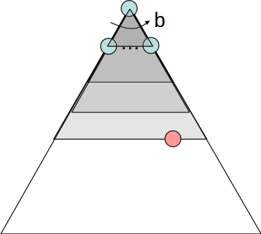]
]
]

???

No: the last level dominates, $b^d$ nodes against the ${b + 2b^2 + \ldots + db^{d-1}}$ regenerated ones, so the overhead is a constant factor.

---

# Uniform-cost search

<br><br>
.width-100[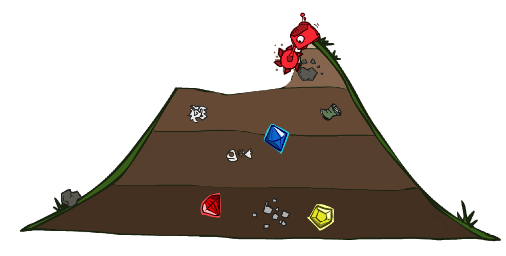]

.footnote[Credits: [CS188](https://inst.eecs.berkeley.edu/~cs188/), UC Berkeley.]

---

class: middle

- .bold[Strategy]: expand the cheapest node in the fringe.
- .bold[Implementation]: fringe is a .bold[priority queue], using the cumulative cost $g(n)$ from the initial state to node $n$ as priority.

---

class: middle

.center.width-70[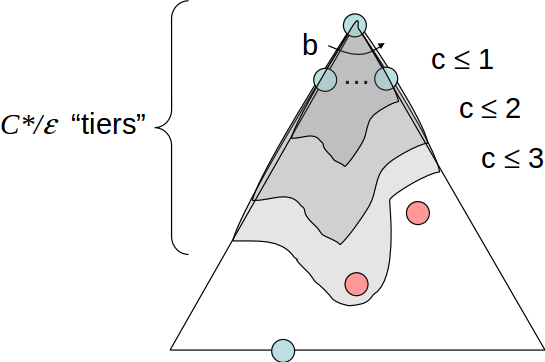]

---

class: middle

## Properties of UCS

- .bold[Completeness]:
    - Yes, if the step costs are all such that $c(s,a,s') \geq \epsilon > 0$. (Why?)
- .bold[Optimality]:
    - Yes, since UCS expands nodes in order of their optimal path cost.
- .bold[Time complexity]:
     - Assume $C^\*$ is the cost of the optimal solution and that step costs are all $\geq \epsilon$.
     - The "effective depth" is then roughly $C^\*/\epsilon$.
     - The worst-case time complexity is $O(b^{C^\*/\epsilon})$.
- .bold[Space complexity]:
     - The number of nodes to maintain is the size of the fringe, so as many as in the last tier $O(b^{C^\*/\epsilon})$.

---

class: middle, center

(demo)

???

```
cd demo/lec2
uv run python run.py --agentfile bfs.py --show 1 --layout medium
uv run python run.py --agentfile ucs.py --show 1 --layout medium
```

---

class: middle

# Informed search strategies

---

# Informed search strategies

.center.width-70[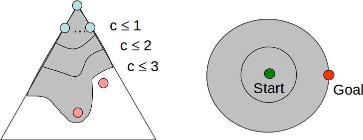]


One of the .bold[issues of UCS] is that it explores the state space in .bold[every direction],
without exploiting information about the (plausible) location of the goal node.

.bold[Informed] search strategies aim to solve this problem by expanding nodes in
the fringe in decreasing order of .bold[desirability].
- Greedy search
- A*

---

# Greedy search

<br>
.width-100[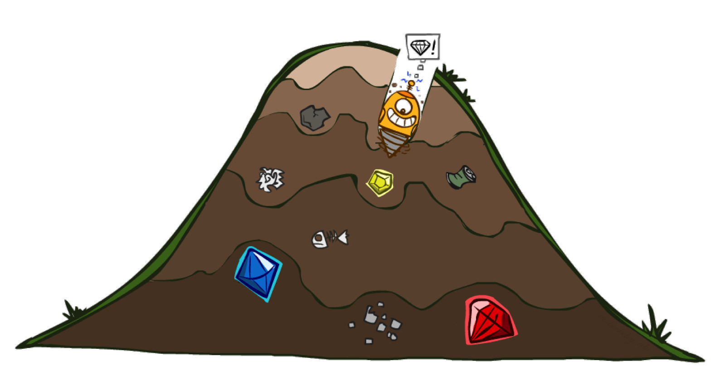]

.footnote[Credits: [CS188](https://inst.eecs.berkeley.edu/~cs188/), UC Berkeley.]

---

class: middle

## Heuristics

A .bold[heuristic] (or evaluation) function $h(n)$ is:
- a function that .bold[estimates] the cost of the cheapest path from node $n$ to a goal state;
    - $h(n) \geq 0$ for all nodes $n$
    - $h(n) = 0$ for a goal state.
- is designed for a .bold[particular] search problem.

<br>
.center.width-70[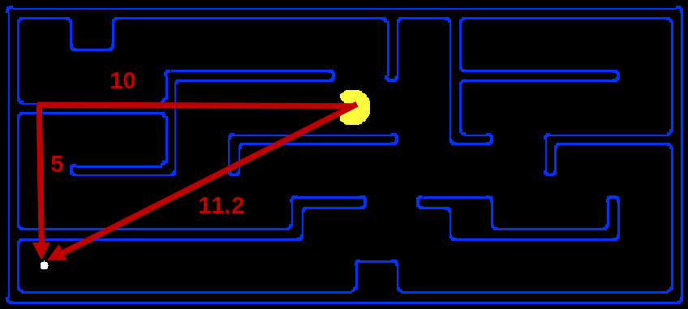]

---

class: middle

## Greedy search

- .bold[Strategy]: expand the node $n$ in the fringe for which $h(n)$ is the lowest.
- .bold[Implementation]: fringe is a .bold[priority queue], using $h(n)$ as priority.

---

class: middle, center

.width-80[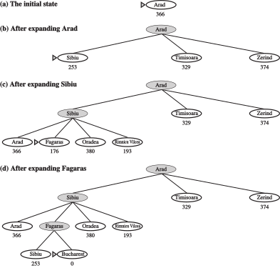]

$h(n)$ = straight line distance to Bucharest.

---

class: middle

.center.width-90[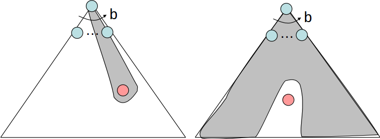]

.center[At best, greedy search takes you straight to the goal.<br>
At worst, it is like a badly-guided BFS.]

---

class: middle

## Properties of greedy search

- .bold[Completeness]:
    - No, unless we prevent cycles (more on this later).
- .bold[Optimality]:
    - No, e.g. the path via Sibiu and Fagaras is 32km longer than the path through Rimnicu Vilcea and Pitesti.
- .bold[Time complexity]:
    - $O(b^m)$, unless we have a good heuristic function.
- .bold[Space complexity]:
    - $O(b^m)$, unless we have a good heuristic function.

---

# A*

<br><br>
.width-100[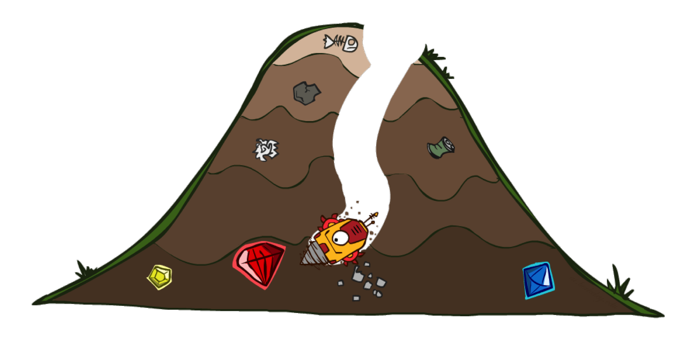]

.footnote[Credits: [CS188](https://inst.eecs.berkeley.edu/~cs188/), UC Berkeley.]

---

class: middle

.grid[
.kol-1-2[<br><br><br><br>
## Shakey the Robot

- A\* was first proposed in .bold[1968] to improve robot planning.
- Goal was to navigate through a room with obstacles.
]
.kol-1-2[
.center.width-80[]
]
]

---

class: center, middle, black-slide

<iframe width="600" height="400" src="https://www.youtube.com/embed/7bsEN8mwUB8" frameborder="0" allowfullscreen></iframe>

---

class: middle

## A*

- Uniform-cost orders by path cost, or .bold[backward cost] $g(n)$
- Greedy orders by goal proximity, or .bold[forward cost] $h(n)$
- .bold[A*] combines the two algorithms and orders by the sum $$f(n) = g(n) + h(n)$$
- $f(n)$ is the estimated cost of cheapest solution through $n$.

---

class: middle

.center.width-80[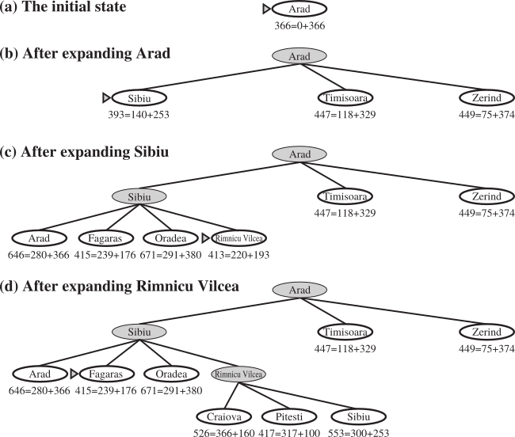]

---

class: middle

.center.width-80[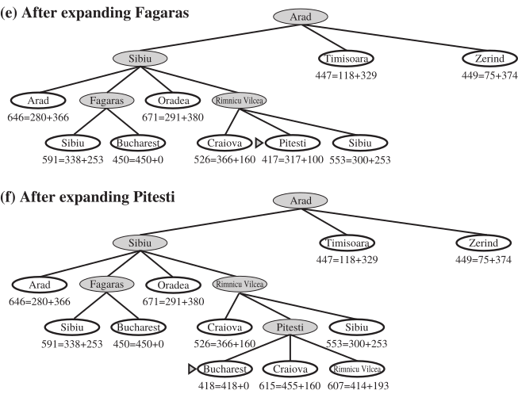]

.question[Why doesn't A* stop at step (e), since Bucharest is in the fringe?]

---

class: middle

## Admissible heuristics

A heuristic $h$ is .bold[admissible] if $$0 \leq h(n) \leq h^\*(n)$$ where $h^\*(n)$ is the true cost to a nearest goal.

.center.width-80[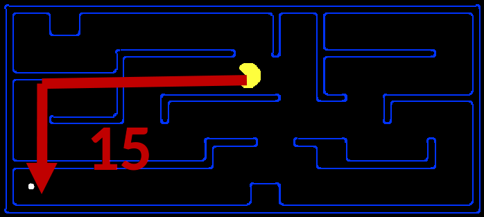]
.caption[The Manhattan distance is admissible]

???

$h$ is admissible if it underestimates the true cost towards the goal.

---

class: middle

## Optimality of A*

.grid[
.kol-2-3[
Assumptions:
- $A$ is an optimal goal node
- $B$ is a suboptimal goal node
- $h$ is admissible

Claim:
$A$ will exit the fringe before $B$.
]
.kol-1-3[
.width-100[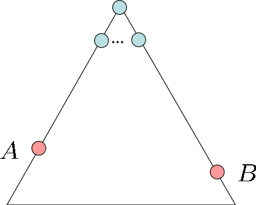]
]
]

---

class: middle

## Proof

Assume $B$ is on the fringe, and let $n$ be an ancestor of $A$ on the fringe. Then

$$f(n) = g(n) + h(n) \leq g(n) + h^\*(n) = g(A) = f(A) < f(B)$$

.grid[
.kol-2-3[
- ${h(n) \leq h^\*(n)}$, since $h$ is admissible;
- ${g(n) + h^\*(n) = g(A)}$, since $n$ is on an optimal path to $A$;
- ${f(A) = g(A)}$ and ${f(B) = g(B)}$, since ${h = 0}$ at a goal;
- ${g(A) < g(B)}$, since $B$ is suboptimal.

Therefore $n$ expands before $B$. The same holds for every ancestor of $A$, hence $A$ expands before $B$ and .bold[A* is optimal].
]
.kol-1-3[
.width-100[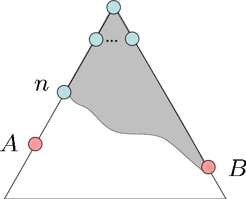]
]
]

---

class: middle

## A* contours

- Assume $f$-costs are non-decreasing along any path.
- We can define .bold[contour levels] $t$ in the state space, that include all nodes $n$ for which $f(n) \leq t$.
- A\* expands every node with ${f(n) < C^\*}$ and none with ${f(n) > C^\*}$: it sweeps the contours outwards until it reaches the goal.

.grid[
.kol-1-2[
.center.width-85[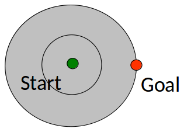]
.center[For UCS (${h(n) = 0}$ for all $n$), bands are circular around the start.]
]
.kol-1-2[
.center.width-80[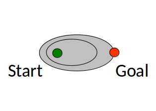]
.center[For A\* with accurate heuristics, bands stretch towards the goal.]
]
]

---

class: middle

.grid[
.kol-1-3[
.width-100[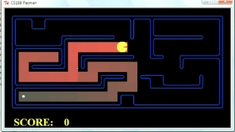]
]
.kol-1-3[
.width-100[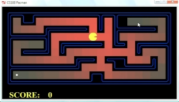]
]
.kol-1-3[
.width-100[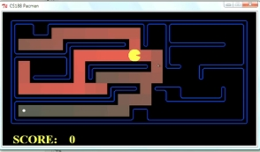]
]
]
.center.grid[
.kol-1-3[
Greedy search
]
.kol-1-3[
UCS
]
.kol-1-3[
A*
]
]

.footnote[Credits: [CS188](https://inst.eecs.berkeley.edu/~cs188/), UC Berkeley.]

???

A\* finds the shortest path.

---

class: middle, center

(demo)

???

```
cd demo/lec2
uv run python run.py --agentfile astar0.py --layout large --show 1
uv run python run.py --agentfile astar1.py --layout large --show 1
uv run python run.py --agentfile astar2.py --layout large --show 1
```

---

class: middle

## Comparison of the strategies

With $b$ the branching factor, $d$ the depth of the least-cost solution, $m$ the maximum path length, $C^\*$ the optimal cost and $\epsilon$ a lower bound on the step costs:

| Strategy | Fringe | Complete | Optimal | Time | Space |
| --- | --- | --- | --- | --- | --- |
| Depth-first | LIFO stack | if no cycles | no | $O(b^m)$ | $O(bm)$ |
| Breadth-first | FIFO queue | yes | if $c$ uniform | $O(b^d)$ | $O(b^d)$ |
| Iterative deepening | DFS, depth $1, 2, \ldots$ | yes | if $c$ uniform | $O(b^d)$ | $O(bd)$ |
| Uniform-cost | priority $g(n)$ | if $c \geq \epsilon$ | yes | $O(b^{C^\*/\epsilon})$ | $O(b^{C^\*/\epsilon})$ |
| Greedy | priority $h(n)$ | if no cycles | no | $O(b^m)$ | $O(b^m)$ |
| A* | priority $f(n)$ | yes | if $h$ admissible (tree) | $O(b^m)$ | $O(b^m)$ |

---

# Creating admissible heuristics

Most of the work in solving hard search problems optimally is in finding admissible heuristics.

Admissible heuristics can be derived from the exact solutions to .bold[relaxed problems], where new actions are available.

<br><br>
.center.width-80[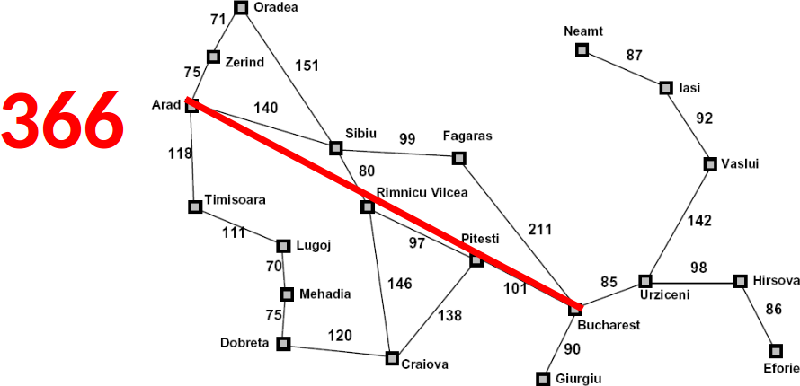]

---

class: middle

## Dominance

- If $h_1$ and $h_2$ are both admissible and if $h_2(n) \geq h_1(n)$ for all $n$, then $h_2$ .bold[dominates] $h_1$ and is .bold[better] for search.
- Given any admissible heuristics $h_a$ and $h_b$, $$h(n) = \max(h_a(n), h_b(n))$$ is also admissible and dominates $h_a$ and $h_b$.

---

class: middle

## Example: the 8-puzzle

.center.width-55[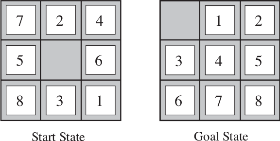]

- ${h\_1(n)}$, the number of misplaced tiles: ${h\_1 = 8}$ above.
- ${h\_2(n)}$, the sum of the Manhattan distances of the tiles to their goal positions: ${h\_2 = 3 + 1 + 2 + 2 + 2 + 3 + 3 + 2 = 18}$.

Both are admissible, and ${h\_2}$ .bold[dominates] ${h\_1}$: a misplaced tile is at least one move away from its goal position, so ${h\_1(n) \leq h\_2(n)}$ everywhere. A* expands fewer nodes with ${h\_2}$.

---

class: middle

## Learning heuristics from experience

- In an .bold[episodic] environment, an agent can .bold[learn] a heuristic by solving the problem many times.
- Each optimal solution provides training pairs ${(n, h^\*(n))}$: a node on the optimal path, and the cost of the path remaining from it.
- Learning $h$ from these pairs is a .bold[supervised regression] problem (lecture 7), solved with linear models, neural networks, etc.
- The learned $h$ is cheap to evaluate, but it is not admissible in general, so A* loses its optimality.

---

class: middle

# Graph search

---

# Graph search

<br>
.center.width-90[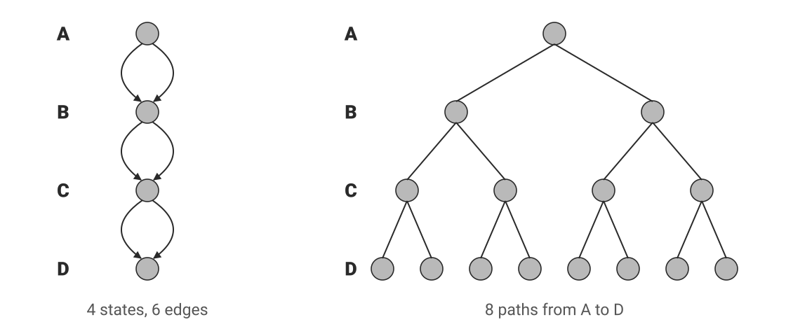]
<br>

The failure to detect .bold[repeated states] can turn a linear problem into an exponential one. It can also lead to non-terminating searches.

Redundant paths and cycles can be avoided by .bold[keeping track] of the states that have been .bold[explored].
This amounts to grow a tree directly on the state-space graph.

???

Insist on the importance of defining a state representation which does not collapse distinct (world) states onto the same representation.

---

class: middle

.width-100[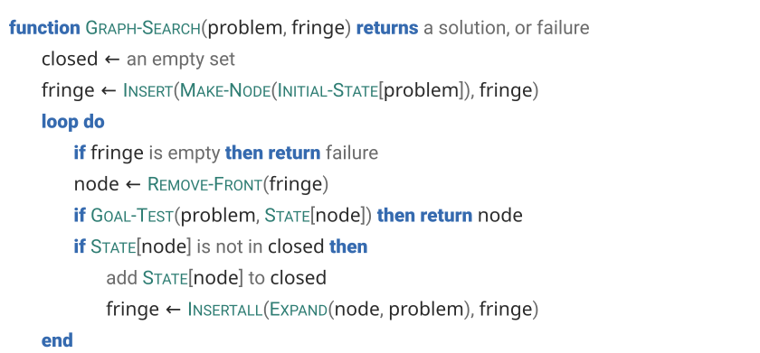]

???

- Completeness is fine.
- Optimality is tricky. Maybe we found the wrong one!

---

class: middle


.grid[
.kol-1-2[<br><br>
## A* graph-search gone wrong?
- We start at $S$ and $G$ is a goal state.
- Which path does graph search find?
]
.kol-1-2[.width-100[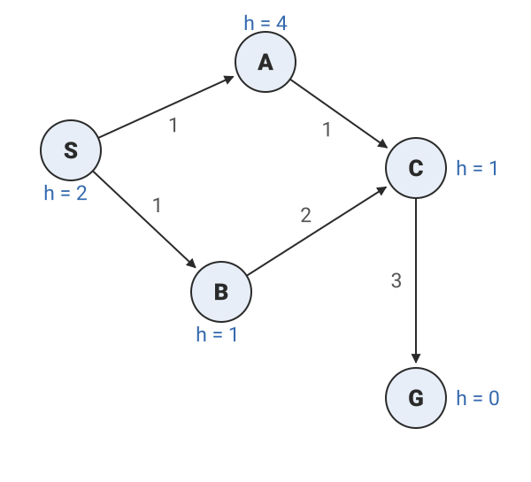]]
]

???

First, is h admissible?

Simulate the execution of graph-search using this h.

Node $C$ is expanded too early!

---

class: middle

## Answer

$h$ is admissible, but it is .bold[not consistent]: ${h(A) = 4 > c(A, a, C) + h(C) = 2}$.

Graph search expands $S$, then $B$ (${f = 1 + 1}$), then $C$ through $B$ (${f = 3 + 1}$), which .bold[closes] $C$ with ${g(C) = 3}$. When $A$ is expanded (${f = 1 + 4}$), the cheaper path to $C$ (${g(C) = 2}$) is discarded, since $C$ is already closed.

A* returns ${S, B, C, G}$, of cost 6, instead of ${S, A, C, G}$, of cost 5.

---

class: middle

.grid[
.kol-2-3[## Consistent heuristics
A heuristic $h$ is consistent if for every $n$ and every successor $n'$ generated by any action $a$,
$$h(n) \leq c(n,a,n') + h(n').$$
]
.kol-1-3[.width-100[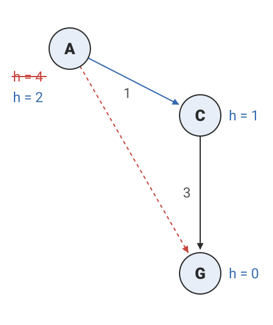]]
]

Consequences of consistent heuristics:
- $f(n)$ is non-decreasing along any path.
- $h(n)$ is admissible.
- With a consistent heuristic, graph-search A* is optimal.

???

Alternative graph-search algorithm: See slide 22 of https://www.ics.uci.edu/~kkask/Fall-2016%20CS271/slides/03-InformedHeuristicSearch.pdf
=> without reopening requires consistency
=> if re-opening, admissibility is enough

---

class: middle

## When $h$ is not consistent

Graph search closes a state the first time it is expanded, possibly through a suboptimal path. Two ways out:
- use a .bold[consistent] heuristic, so that a state is first expanded along its cheapest path;
- .bold[re-expand] a closed state when it is reached with a lower $f$, which restores optimality for any admissible $h$, at the price of re-expansions.

???

The second option is the variant applied in the exercise session.

---

# Recap example: Super Mario

.center.width-40[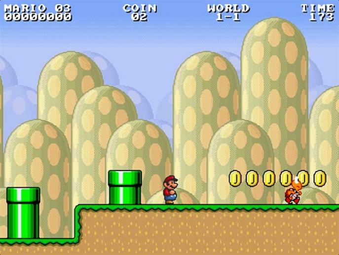]

- .bold[Task environment]?
    - the performance measure $V$, the environment, the actuators $\mathcal{A}$, the sensors $\mathcal{P}$?
- .bold[Type] of environment?
    - observable, deterministic, episodic, static, discrete, single-agent, known?
- .bold[Search problem]?
    - ${s\_1}$, ${\text{actions}(s)}$, ${\text{result}(s, a)}$, ${G}$, ${c(s, a, s')}$?
- .bold[Good heuristic] ${h(n)}$?

???

- performance measure = score, the further right, the better; coins; killed enemies, ...
- environment: the Mario world
- actuators: left, right, up, down, jump, speed
- sensors: the screen

- type of environment: partially observable, deterministic, episodic, dynamic, discrete/continuous, multi-agent, known

- search problem:
    * state = Mario's position (x, y), map, score, time
    * initial state = start of the game
    * transition model = given by the game engine (assume we know that!)
    * goal states = Mario on the flag
    * path cost = shortest path, the better; malus if killed, bonus if coin and killed enemies

---

class: center, middle, black-slide

<iframe width="600" height="400" src="https://www.youtube.com/embed/DlkMs4ZHHr8" frameborder="0" allowfullscreen></iframe>

A* in action

???

Comment on the actions taken at any frame (right, jump, speed) shown in red.

---

# Summary

- A .bold[search problem] is a state space ${\mathcal{S}}$, an initial state ${s\_1}$, actions ${\text{actions}(s)}$, a transition model ${\text{result}(s, a)}$, goal states ${G}$ and step costs ${c}$. A solution is a sequence ${a\_{1:T}}$ reaching ${G}$, optimal when its path cost is minimal. Choosing what to keep in a state is what makes the search feasible.
- A .bold[strategy] is the order in which the fringe is expanded: LIFO for depth-first, FIFO for breadth-first, ${g(n)}$ for uniform-cost, ${h(n)}$ for greedy, ${f(n) = g(n) + h(n)}$ for A*.
- Only .bold[uniform-cost] and .bold[A*] order by cost, and only they are optimal in general. Breadth-first and iterative deepening return the .bold[shallowest] goal, which is the cheapest one only under uniform step costs.
- ${h}$ is .bold[admissible] if ${h(n) \leq h^\*(n)}$, which makes tree-search A\* optimal, and .bold[consistent] if ${h(n) \leq c(n, a, n') + h(n')}$, which makes graph-search A\* optimal. A .bold[dominating] heuristic expands fewer nodes.
- .bold[Graph search] keeps a closed set, so a state is expanded once, along the first path that reaches it. The price is that optimality then needs consistency, or re-expanding closed states reached with a lower ${f}$.

---

class: end-slide, center
count: false

The end.