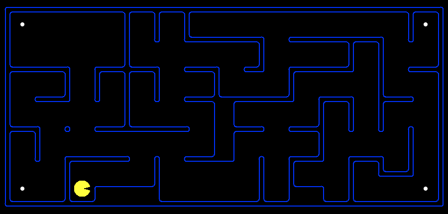
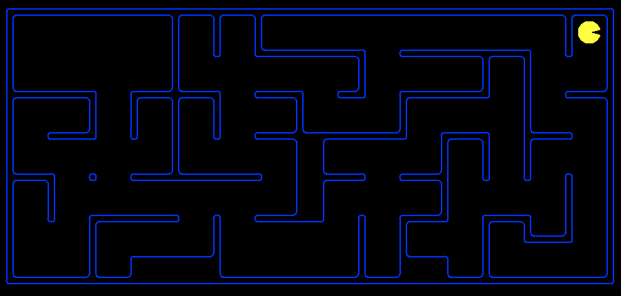
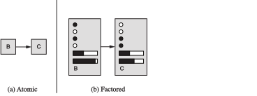
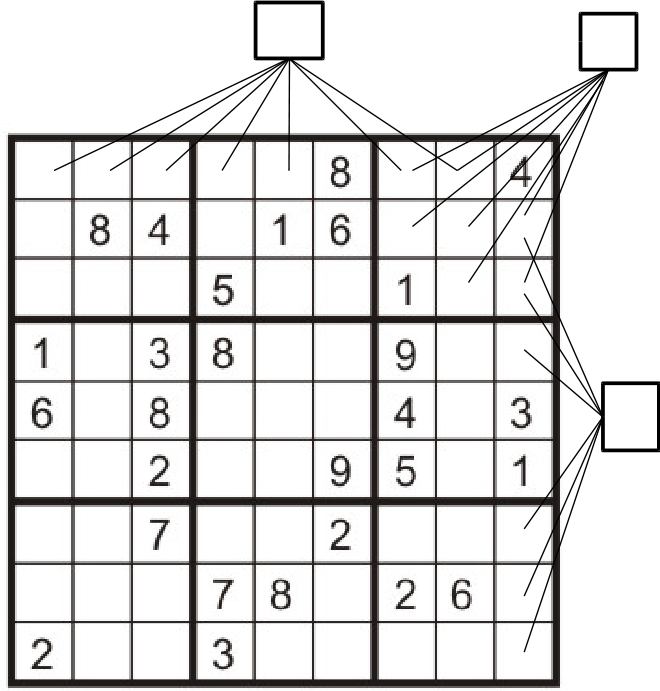
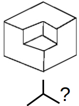
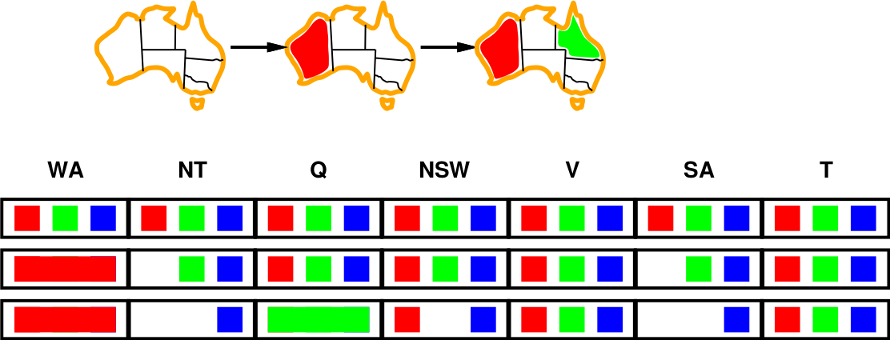
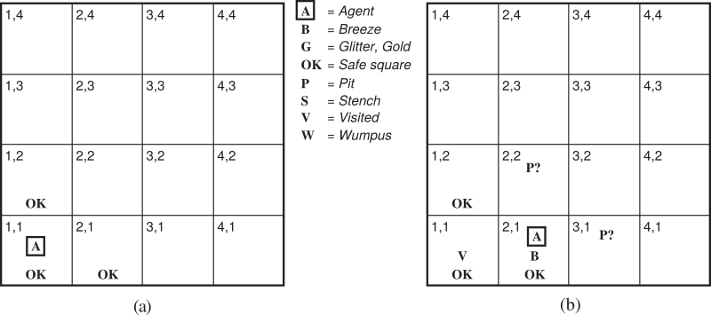

class: middle, center, title-slide

# Introduction to Artificial Intelligence

Lecture 3: Constraint satisfaction problems

---

class: black-slide, center, middle

.center.width-100[]

.caption[Hmmm, let me think...]

---

count: false
class: black-slide, center, middle

.center.width-100[]

.caption[(...)]

---

count: false
class: black-slide, center, middle

.center.width-100[]

.caption[(5 minutes later)]

---

count: false
class: black-slide, center, middle

.center.width-100[]

.caption[Solution found! [Can we do better?]]

---

# Today

- *Constraint satisfaction problems*:
    - Exploiting the representation of a state to accelerate search.
    - Backtracking.
    - Generic heuristics.
- *Logical agents*
    - Propositional logic for reasoning about the world.
    - ... and its connection with CSPs.

.center.width-50[]

.footnote[Credits: UC Berkeley, [CS188](http://ai.berkeley.edu/lecture_slides.html)]

---

class: middle

# Constraint satisfaction problems

---

# Motivation

In standard search problems:
- States are evaluated by domain-specific heuristics.
- States are tested by a domain-specific function to determine if the goal is achieved.
- From the point of view of the search algorithms however, **states are atomic**.

Instead, if states have *a factored representation*, then the structure of states can be exploited to improve the **efficiency of the search**.

.center.width-80[]

---

# Constraint satisfaction problems

- **Constraint satisfaction problem**  algorithms take advantage of factored state representations and use *general-purpose* heuristics to solve complex problems.
- CSPs are specialized to a family of search sub-problems.
- Main idea: eliminate large portions of the search space all at once, by identifying combinations of variable/value that violate constraints.

---

class: middle

Formally, a **constraint satisfaction problem** (CSP) consists of three components $X$, $D$ and $C$:

- $X$ is a set of *variables*, $\\{X_1, ..., X_n\\}$,
- $D$ is a set of *domains*, $\\{D_1, ..., D_n\\}$, one for each variable,
- $C$ is a set of *constraints* that specify  allowable combinations of values.

---

class: middle

## Example: Map coloring

.center.width-70[]

---

class: middle

.center.width-30[]

- Variables: $X = \\{ \text{WA}, \text{NT}, \text{Q}, \text{NSW}, \text{V}, \text{SA}, \text{T} \\}$
- Domains: $D_i = \\{ \text{red}, \text{green}, \text{blue} \\}$ for each variable.
- Constraints: $C = \\{ \text{SA} \neq \text{WA}, \text{SA} \neq \text{NT}, \text{SA} \neq \text{Q}, ... \\}$
    - Implicit: $\text{WA} \neq \text{NT}$
    - Explicit: $(\text{WA}, \text{NT}) \in \\{ \\{\text{red}, \text{green}\\}, \\{\text{red}, \text{blue}\\}, ... \\}$
- Solutions are **assignments** of values to the variables such that constraints are all satisfied.
    - e.g., $\\{ \text{WA}=\text{red}, \text{NT}=\text{green}, \text{Q}=\text{red}, \text{SA}=\text{blue},$ $\quad\quad \text{NSW}=\text{green}, \text{V}=\text{red}, \text{T}=\text{green} \\}$

---

# Constraint (hyper)graph

.center.width-50[]

- *Nodes* = variables of the problems
- *Edges* = constraints in the problem involving the variables associated to the end nodes.
- General purpose CSP algorithms **use the graph structure** to speedup search.
    - e.g., Tasmania is an independent subproblem.

---

class: middle

## Example: Cryptarithmetic

.center.width-60[]

- Variables: $\\{ T, W, O, F, U, R, C_1, C_2, C_3\\}$
- Domains: $D_i = \\{ 0, 1, 2, 3, 4, 5, 6, 7, 8, 9 \\}$
- Constraints:
    - $\text{alldiff}(T, W, O, F, U, R)$
    - $O+O=R+10\times C_1$
    - $C_1 + W + W = U + 10\times C_2$
    - ...

---

class: middle

## Example: Sudoku

.center.width-30[]

- Variables: each (open) square
- Domains: $D_i = \\{ 1, 2, 3, 4, 5, 6, 7, 8, 9 \\}$
- Constraints:
    - 9-way $\text{alldiff}$ for each column
    - 9-way $\text{alldiff}$ for each row
    - 9-way $\text{alldiff}$ for each region
---

class: middle

## Example: The Waltz algorithm

.center.width-40[]

The Waltz algorithm is a procedure for interpreting 2D line drawings of solid polyhedra as 3D objects. Early example of an AI computation posed as a CSP.

.pull-right.width-70[]
CSP formulation:
- Each intersection is a variable.
- Adjacent intersections impose constraints on each other.
- Solutions are physically realizable 3D objects.

.footnote[Credits: UC Berkeley, [CS188](http://ai.berkeley.edu/lecture_slides.html)]

---

# Variations on the CSP formalism

- *Discrete variables*
    - Finite domains
        - Size $d$ means $O(d^n)$ complete assignments.
        - e.g., boolean CSPs, including the SAT boolean satisfiability problem (NP-complete).
    - Infinite domains
        - e.g., job scheduling, variables are start/end days for for each job.
        - need a constraint language, e.g. $start_1 + 5 \leq start_2$.
        - Solvable for linear constraints, undecidable otherwise.
- *Continuous variables*
    - e.g., precise start/end times of experiments.
    - Linear constraints solvable in polynomial time by LP methods.

---

class: middle

- *Varieties of constraints*:
    - Unary constraint involve a single variable.
        - Equivalent to reducing the domain, e.g. $\text{SA} \neq \text{green}$.
    - Binary constraints involve pairs of variables, e.g. $\text{SA} \neq \text{WA}$.
    - Higher-order constraints involve 3 or more variables.
- *Preferences* (*soft constraints*)
    - e.g., red is better than green.
    - Often representable by a cost for each variable assignment.
    - Results in constraint optimization problems.
    - (We will ignore those for now.)

---

# Real-world examples

.grid[
.kol-1-2[
- Assignment problems
    - e.g., who teaches what class
- Timetabling problems
    - e.g., which class is offered when and where?
- Hardware configuration
- Spreadsheets
- Transportation scheduling
- Factory scheduling
- Circuit layout
- ... and many more
]
.kol-1-2[
.width-100[]
]
]

Notice that many real-world problems involve real-valued variables.

.footnote[Credits: UC Berkeley, [CS188](http://ai.berkeley.edu/lecture_slides.html)]

---

# Constraint programming

.grid[
.kol-2-3[
 
.caption[Constraint Programming represents one of the closest approaches computer science has yet made to the Holy Grail of programming: the user states the problem, the computer solves it.
 (Eugene Freuder)]
]
.kol-1-3[.center.circle.width-100[]]
]

Constraint programming is a programming paradigm in which the user specifies the program as a CSP. The resolution of the problem is left to the computer.

Examples:
- Prolog
- ECLiPSe

---

class: middle

# Solving CSPs

---

# Standard search formulation

- CSPs can be cast as standard search problems.
    - For which we have solvers, including DFS, BFS or A*.
- States are *partial assignments*:
    - The initial state is the empty assignment $\\{ \\}$.
    - Actions: assign a value to an unassigned variable.
    - Goal test: the current assignment is complete and satisfies all constraints.
- This algorithm is **the same** for all CSPs!

---

class: middle

.center.width-50[]

What would BFS or DFS do? What problems does naive search have?

For $n$ variables of domain size $d$:
- $b=(n-l)d$ at depth $l$;
- we generate a tree with $n!d^n$ leaves even if there are only $d^n$ possible assignments!

???

Simulate the execution on blackboard. Highlight two issues:
- commutativity
- constraints are checked only at the end, by the goal function

---

# Backtracking search

- Backtracking search is the basic uninformed algorithm for solving CSPs.
- Idea 1: **One variable at a time**:
    - The naive application of search algorithms ignore a crucial property: variable assignments are *commutative*. Therefore, fix the ordering.
        - $\text{WA}=\text{red}$ then $\text{NT}=\text{green}$ is the same as $\text{NT}=\text{green}$ then $\text{WA}=\text{red}$.
    - One only needs to consider assignments to a single variable at each step.
        - $b=d$ and there are $d^n$ leaves.
- Idea 2: **Check constraints as you go**:
    - Consider only values which do not conflict with current partial assignment.
    - Incremental goal test.

---

class: middle

.center.width-80[]

---

class: middle

.center.width-100[]

???

- Backtracking = DFS + variable-ordering + fail-on-violation
- What are the choice points?

Choice points:
- Ordering the variables
- Ordering the values
- Filtering
- Structure

---

# Improving backtracking

- Can we improve backtracking using **general-purpose** ideas, without domain-specific knowledge?
- *Ordering*:
    - Which variable should be assigned next?
    - In what order should its values be tried?
- *Filtering*: can we detect inevitable failure early?
- *Structure*: can we exploit the problem structure?

---

class: middle

## Variable ordering

- **Minimum remaining values**:
Choose the variable *with the fewest legal values left* in its domain.
- Also known as the *fail-first* heuristic.
    - Detecting failures quickly is equivalent to pruning large parts of the search tree.

.center.width-100[]

---

class: middle

## Value ordering

- **Least constraining value**: Given a choice of variable, choose the *least constraining value*.
- i.e., the value that rules out the fewest values in the remaining variables.

.center.width-100[]

[Q] Why should variable selection be fail-first but value selection be fail-last?

???

We are seeking only one solution. Therefore:
- fail-first variable selection to prune large portions of the tree
- fail-last value selection to look for the most likely value

---

class: middle

## Filtering: Forward checking

- Keep *track of remaining legal values* for unassigned variables.
    - Whenever a variable $X$ is assigned, and for each unassigned variable $Y$ that is connected to $X$ by a constraint, delete from $Y$'s domain any value that is inconsistent.
- *Terminate search* when any variable has no legal value left.

.center.width-100[]

---

class: middle

## Filtering: Constraint propagation

Forward checking propagates information assigned to unassigned variables, but does not provide early detection for all failures:

.center.width-100[]

- $NT$ and $SA$ cannot both be blue!
- **Constraint propagation** repeatedly enforces constraints locally.

---

class: middle

## Arc consistency

- An arc $X \to Y$ is **consistent** if and only if for every value $x$ in the domain of $X$ there is some value $y$ in the domain of $Y$ that satisfies the associated binary constraint.
- Forward checking $\Leftrightarrow$ enforcing consistency of arcs pointing to each new assignment.
- This principle can be generalized to enforce consistency for **all** arcs.

.center.width-100[]

---

class: middle

.center.width-100[]

[Q] When in backtracking shall this procedure be called?

???

- After applying AC3, either every arc is arc-consistent, or some variable has an empty domain, indicating that the CSP cannot be solved.
- This check should be inserted after a new assignment, before the recursive call. If an inconsistency is detected

---

# Structure

.center.width-50[]

- Tasmania and mainland are **independent subproblems**.
    - Any solution for the mainland combined with any solution for Tasmania yields a solution for the whole map.
- Independence can be ascertained by finding *connected components* of the constraint graph.

---

class: middle

- Time complexity: Assume each subproblem has $c$ variables out of $n$ in total. Then $O(\frac{n}{c} d^c)$.
    - E.g., $n=80$, $d=2$, $c=20$.
    - $2^{80} =$  4 billion years at 10 million nodes/sec.
    - $4 \times 2^{20} =$ 0.4 seconds at 10 million nodes/sec.

---

class: middle

## Tree-structured CSPs

.center.width-90[]

- Algorithm for tree-structured CSPs:
    - Order: choose a root variable, order variables so that parents precede children (topological sort).
    - Remove backward:
        - for $i=n$ down to $2$, enforce arc consistency of $parent(X_i) \to X_i$.
    - Assign forward:
        - for $i=1$ to $n$, assign $X_i$ consistently with its $parent(X_i)$.
- Time complexity: $O(n d^2)$
    - Compare to general CSPs, where worst-case time is $O(d^n)$.

???

Run the algorithm on the blackboard.

---

class: middle

## Nearly tree-structured CSPs

- *Conditioning*:  instantiate a variable, prune its neighbors' domains.
- *Cutset conditioning*:
    - Assign (in all ways) a set $S$ of variables such that the remaining constraint graph is a tree.
    - Solve the residual CSPs (tree-structured).
    - If the residual CSP has a solution, return it together with the assignment for $S$.

.center.width-70[]

---

class: middle

# Logical agents

---

# The logicist tradition

.grid[
.kol-2-3[
- The rational thinking approach to artificial intelligence is concerned with the study of *irrefutable
reasoning processes*. It ensures that all actions performed by an agent are
formally **provable** from inputs and prior knowledge.

- The Greek philosopher Aristotle was one of the first to attempt to formalize rational thinking.
His *syllogisms* provided a pattern for argument structures that always yield correct conclusion when given correct premises.
.italic[
All men are mortal.  
Socrates is a man. 
Therefore, Socrates is mortal.
]
]
.kol-1-3[
.width-100.circle[]
.caption[(Aristotle, 384-322 BC)]
]
]

---

class: middle

- Logicians of the 19th century developed a precise notation for statements about all kinds of objects in the world and relationships among them.

- By 1965, programs existed that could, in principle, solve any solvable problem described in logical notation.

- The logicist tradition within AI hopes to build on such programs to create intelligent systems.

---

# The Wumpus world

.center.width-70[]

---

class: smaller, middle

## PEAS description

- *Performance measure*:
    - +1000 for climbing out of the cave with gold;
    - -1000 for falling into a pit or being eaten by the wumpus;
    - -1 per step.
- *Environment*:
    - $4 \times 4$ grid of rooms;
    - The agent starts in the lower left square labeled $[1,1]$, facing right;
    - Locations for gold, the wumpus and pits are chosen randomly from squares other than the start square.
- *Actuators*:
    - Forward, Turn left by $90$° or Turn right by $90$°.
- *Sensors*:
    - Squares adjacent to wumpus are *smelly*;
    - Squares adjacent to pit are *breezy*;
    - *Glitter* if gold is in the same square;
        - Gold is picked up by reflex, and cannot be dropped.
    - You *bump* if you walk into a wall.
    - The agent program receives the percept $[\text{Stench}, \text{Breeze}, \text{Glitter}, \text{Bump}]$.

---

class: middle

## Wumpus world characterization

- *Deterministic*: Yes, outcomes are exactly specified.
- *Static*: Yes, Wumpus and pits dot not move.
- *Discrete*: Yes.
- *Single-agent*: Yes, Wumpus is essentially a part of the environment.
- **Fully observable**: No, only *local* perception.
    - This is our first example of partial observability.
- **Episodic**: No, what was observed before is very useful.

The agent need to maintain a model of the world and to update this model upon percepts.

We will use **logical reasoning** to overcome the initial ignorance of the agent.

---

class: middle

## Exploring the Wumpus world (1)

.center.width-100[]

(a) Percept = $[\text{None}, \text{None}, \text{None}, \text{None}]$

(b) Percept = $[\text{None}, \text{Breeze}, \text{None}, \text{None}]$

---

class: middle

## Exploring the Wumpus world (2)

.center.width-100[]

(a) Percept = $[\text{Stench}, \text{None}, \text{None}, \text{None}]$

(b) Percept = $[\text{Stench}, \text{Breeze}, \text{Glitter}, \text{None}]$

---

# Logical agents

- Most useful in non-episodic, partially observable environments.
- **Logic (knowledge-based) agents** combine:
    - A *knowledge base* ($\text{KB}$): a list of facts that are known to the agent.
    - Current *percepts*.
- Hidden aspects of the current state are **inferred** using rules of inference.
- **Logic** provides a good formal language for both   
    - Facts encoded as *axioms*.
    - Rules of *inference*.

.center.width-80[]

---

# Propositional logic

## Syntax

The **syntax** of propositional logic defines allowable *sentences*.
The syntax of propositional logic is formally defined by the following *grammar*:

.center.width-80[]

???

Show an example, e.g. $(P \& Q) \Rightarrow R$

---

class: middle

## Semantics

- In propositional logic, a *model* is an assignment of  truth values for every proposition symbol.
    - E.g., if the sentences of the knowledge base make use of the symbols $P_1$, $P_2$ and $P_3$, then one possible model is $m=\\{ P_1=False, P_2=True, P_3=True\\}$.
- The **semantics** for propositional logic specifies how to (recursively) evaluate the *truth value* of any complex sentence, with respect to a model $m$, as follows:
    - The truth value of a proposition symbol is specified in $m$.
    - $\lnot P$ is true iff $P$ is false;
    - $P \wedge Q$ is true iff $P$ and $Q$ are true;
    - $P \lor Q$ is true iff either $P$ or $Q$ is true;
    - $P \Rightarrow Q$ is true unless $P$ is true and $Q$ is false;
    - $P \Leftrightarrow Q$ is true iff $P$ and $Q$ are both true of both false.

---

# Wumpus world sentences

.grid[
.kol-2-3[
- Let $P_{i,j}$ be true if there is a pit in $[i,j]$.
- Let $B_{i,j}$ be true if there is a breeze in $[i,j]$.

Examples:
- There is no pit in $[1,1]$:
    - $R\\\_1: \lnot P\\\_{1,1}.$
- Pits cause breezes in adjacent squares:
    - $R\\\_2: B\\\_{1,1} \Leftrightarrow (P\\\_{1,2} \lor P\\\_{2,1}).$
    - $R\\\_3: B\\\_{2,1} \Leftrightarrow (P\\\_{1,1} \lor P\\\_{2,2} \lor P\\\_{3,1}).$
    - These are true in all wumpus worlds.
- Breeze percept for the first two squares, for the specific world we consider:
    - $R\\\_4: \lnot B\\\_{1,1}.$
    - $R\\\_5: B\\\_{2,1}.$

]
.kol-1-3[.width-100[]]
]

---

# Entailment

- We say a model $m$ *satisfies* a sentence $\alpha$ if $\alpha$ is true in $m$.
    - $M(\alpha)$ is the set of all models that satisfy $\alpha$.
- $\alpha \vDash \beta$ iff $M(\alpha) \subseteq M(\beta)$.
    - We say that the sentence $\alpha$ **entails** the sentence $\beta$.
    - $\beta$ is true in all models where $\alpha$ is true.
    - That is, $\beta$ *follows logically* from $\alpha$.

---

# Wumpus models

.center.width-30[]

- Let consider possible models for $\text{KB}$ assuming only pits and a reduced Wumpus world with only 5 squares and pits.
- We consider the situation after:
    - detecting nothing in $[1,1]$,
    - moving right, sensing breeze in $[2,1]$.

[Q] How many models are there?

???

3 binary variables $P\_{1,2}$, $P\_{2,2}$, $P\_{3,1}$, hence $2^3=8$ models.

---

class: middle

.center.width-60[]

- All 8 possible models in the reduced Wumpus world.
- The knowledge base $\text{KB}$ contains all possible Wumpus worlds consistent with the observations and the physics of the  world.

---

# Entailments

.center.width-60[]

- $\alpha_1$ = "$[1,2]$ is safe". Does $\text{KB}$ entails $\alpha_1$?
- $\text{KB} \vDash \alpha_1$ since $M(\text{KB})  \subseteq M(\alpha_1)$.
    - This proof is called *model checking* because it *enumerates* all possible models to check whether $\alpha_1$ is true in all models where $\text{KB}$ is true.
- Entailment can be used to carry out **logical inference**.

---

class: middle

.center.width-60[]

- $\alpha_2$ = "$[2,2]$ is safe". Does $\text{KB}$ entails $\alpha_2$?
- $\text{KB} \nvDash \alpha_2$ since $M(\text{KB})  \nsubseteq M(\alpha_2)$.
- We **cannot** conclude whether $[2,2]$ is safe (it may or may not).

---

# Unsatisfiability theorem

$$\alpha \vDash \beta \text{ iff } (\alpha \wedge \lnot \beta) \text{ is unsatisfiable}$$

- A sentence $\gamma$ is unsatisfiable iff $M(\gamma) = \\{ \\}$.
    - i.e., there is no assignment of truth values such that $\gamma$ is true.
- Proving $\alpha \vDash \beta$ by checking the unsatisfiability of $\alpha \wedge \lnot \beta$ corresponds to the proof technique of reductio ad absurdum.
- Checking the satisfiability of a sentence $\gamma$ can be cast as CSP!
    - More efficient than enumerating all models, but remains NP-complete.
    - Alternatively, propositional satisfiability (SAT) solvers can be used instead of CSPs. These are tailored for this specific problem. Many of them are variants of backtracking.

???

SAT into CSPs: http://www.cs.toronto.edu/~fbacchus/csc2512/Lectures/2012Readings/Walsh_SATvCSP.pdf

---

# Limitations

- Representation of *informal* knowledge is difficult.
- Hard to define provable *plausible* reasoning.
- **Combinatorial explosion** (in time and space).
- Logical inference is only a part of intelligence.

---

# Summary

- Constraint satisfaction problems:
    - States are represented by a set of variable/value pairs.
    - Backtracking, a form of depth-first search, is commonly used for solving CSPs.
    - The complexity of solving a CSP is strongly related to the structure of its constraint graph.
- Logical agents:
    - Intelligent agents need knowledge about the world in order to reach good decisions.
    - Logical inference can be used as tool to reason about the world.
        - The inference problem can be cast as the problem of determining the unsatisfiability of a formula.
        - This in turn can be cast as a CSP.

---

class: end-slide, center
count: false

The end.

---

# References

- Newell, A., & Simon, H. (1956). The logic theory machine--A complex information processing system. IRE Transactions on information theory, 2(3), 61-79.
- McCarthy, J. (1960). Programs with common sense (pp. 300-307). RLE and MIT computation center.
