class: middle, center, title-slide

# Introduction to Artificial Intelligence

Lecture 3: Games and Adversarial search

<br><br>
Prof. Gilles Louppe<br>
[g.louppe@uliege.be](mailto:g.louppe@uliege.be)

---

class: center, black-slide, middle

<iframe width="600" height="450" src="https://www.youtube.com/embed/LJS7Igvk6ZM" frameborder="0" allowfullscreen></iframe>

---

# Today

- How to act rationally in a .bold[multi-agent] environment?
- How to anticipate and respond to the .bold[arbitrary behavior] of other agents?
- Adversarial search
    - Minimax
    - $\alpha-\beta$ pruning
    - H-Minimax
    - Expectiminimax
    - Monte Carlo Tree Search
- Modeling assumptions
- State-of-the-art agents.

---

class: middle

# Games

---

# Games

- A .bold[game] is a multi-agent environment where agents may have either .bold[conflicting] or .bold[common] interests.
- Opponents may act .bold[arbitrarily], even if we assume a deterministic fully observable environment.
    - The solution is a .bold[strategy] ${\pi\_p : \mathcal{S} \to \mathcal{A}}$, the .bold[policy] of lecture 1: a move for every state the opponent can lead to.
    - This is different from search, where a solution is a .bold[fixed sequence] ${a\_{1:T}}$.
- Time is often .bold[limited].

???

A game is a mathematical model of strategic interaction between rational decision makers.

---

class: middle

## Formal definition

A .bold[game] is the search problem of lecture 2, with two components added and one replaced:
- the .bold[states] ${s \in \mathcal{S}}$ and the .bold[initial state] ${s\_1 \in \mathcal{S}}$, as before;
- the .bold[actions] ${\text{actions}(s) \subseteq \mathcal{A}}$ and the .bold[transition model] ${s' = \text{result}(s, a)}$, as before;
- .bold[new]: a function ${\text{player}(s) \in \\{1, \ldots, N\\}}$ that says whose turn it is in state $s$;
- .bold[replaced]: the goal states ${G}$ become the .bold[terminal states] ${T \subseteq \mathcal{S}}$, tested by ${\text{terminal-test}(s)}$, i.e. ${s \in T}$;
- .bold[new]: the path cost becomes a .bold[utility] ${\text{utility}(s, p)}$, the payoff of player $p$ when the game ends in ${s \in T}$, e.g. ${1}$, ${0}$ or ${\frac{1}{2}}$ for a win, a loss or a draw.

Together, ${s\_1}$, ${\text{actions}}$ and ${\text{result}}$ define the .bold[game tree], whose nodes are states and whose edges are actions.

???

Outline on the blackboard.

---

class: middle

## The bar scene, formally

.grid[
.kol-3-5[
.quote[If we all go for the blonde, we block each other. Not a single one of us is going to get her. So then we go for her friends, but they will all give us the cold shoulder, because nobody likes to be second choice. .author[John Nash, .italic[A Beautiful Mind]]]
]
.kol-2-5[
- The .bold[players] are the ${N}$ friends.
- ${\text{actions}(s)}$: approach the blonde, or approach a brunette.
- A .bold[terminal state] ${s \in T}$ is how the evening ends.
]
]

Every element of the definition is there. Nash evaluates .bold[outcomes], not moves: everyone for the blonde ends in a terminal state where ${\text{utility}(s, p) = 0}$ for every player ${p}$, nobody for the blonde in one where ${\text{utility}(s, p) = 1}$. What each player should do depends on what the others do, so the answer is a .bold[strategy] rather than a sequence of moves.

???

The scene is a game tree: the friends move, the outcome is scored at the leaves, and the reasoning backs those scores up to the decision at the root.

Strictly, the conclusion is not a Nash equilibrium: if nobody goes for the blonde, any single friend does better by deviating. What the scene gets right, and what this lecture is about, is the reasoning itself, over outcomes and over the choices of the others.

---

class: middle

## Zero-sum games

- In a .bold[zero-sum] game, the total payoff to all players is .bold[constant] for all games.
    - e.g., in chess: $0+1$, $1+0$ or $\frac{1}{2} + \frac{1}{2}$.
- For two-player games, agents share the .bold[same utility] function, but one wants to .bold[maximize] it while the other wants to .bold[minimize] it.
    - MAX maximizes the game's $\text{utility}$ function.
    - MIN minimizes the game's $\text{utility}$ function.
- .bold[Strict competition].
    - If one wins, the other loses, and vice-versa.

<br>
.center.width-40[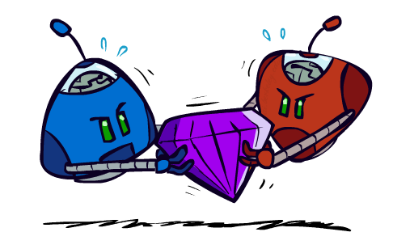]

.footnote[Credits: [CS188](https://inst.eecs.berkeley.edu/~cs188/), UC Berkeley.]

???

The term 'zero-sum' is confusing but makes sense if you imagine each player is charged an entry of 1/2 (for chess). Constant-sum game would have been better.

---

class: middle

## Tic-Tac-Toe game tree

.width-80[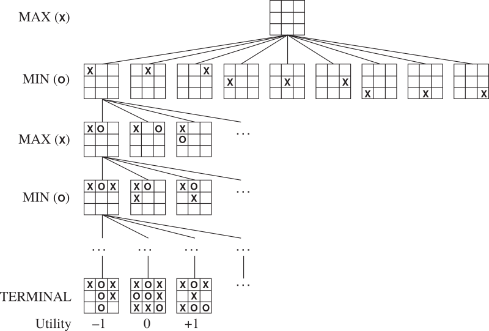]

.question[What is an optimal strategy (or perfect play)? How do we find it?]

---

# Assumptions

Games vary along three axes: .bold[chance], .bold[information] and the .bold[number of players]. We start with the simplest case of each.

- We assume a .bold[deterministic], .bold[turn-taking], .bold[two-player] .bold[zero-sum game] with .bold[perfect information].
    - e.g., Tic-Tac-Toe, Chess, Checkers, Go, etc.
- We will call our two players .bold[MAX] and .bold[MIN]. .bold[MAX] moves first.

Each assumption is relaxed later: .bold[stochastic games] bring in chance, .bold[multi-agent games] more players, and the last section games of .bold[imperfect information].

.center.width-35[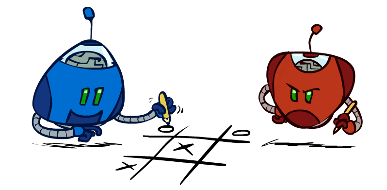]

.footnote[Credits: [CS188](https://inst.eecs.berkeley.edu/~cs188/), UC Berkeley.]

---

class: middle

# Minimax

---

# Adversarial search

.grid[.kol-2-3[
- In a search problem, the optimal solution is a sequence of actions leading to a goal state.
    - i.e., a terminal state where MAX wins.
- In a game, the opponent (MIN) may react .bold[arbitrarily] to a move.
- Therefore, a player (MAX) must define a contingent .bold[strategy] ${\pi\_\text{MAX}}$ which specifies
    - its moves in the initial state,
    - its moves in the states resulting from every possible response by MIN,
    - its moves in the states resulting from every possible response by MIN in those states, ...
]
.kol-1-3.width-100[
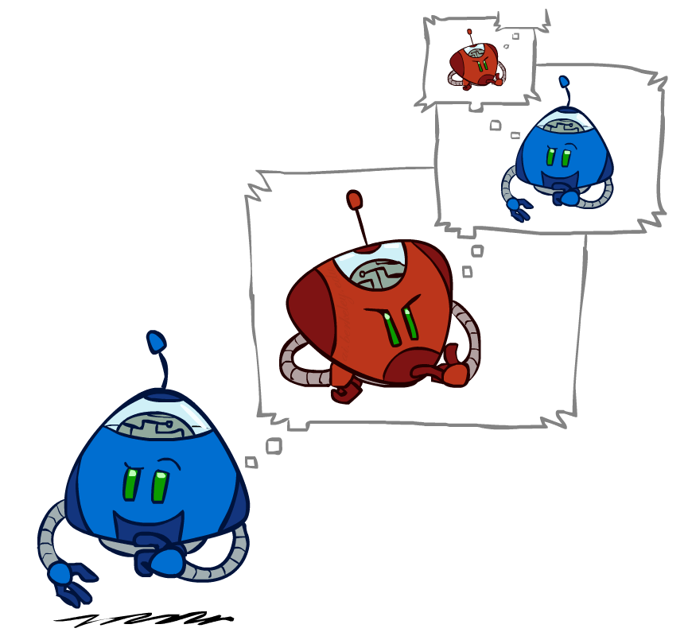
]
]

.footnote[Credits: [CS188](https://inst.eecs.berkeley.edu/~cs188/), UC Berkeley.]

???

Analogy with chess, checkers or belotte.

---

# Minimax

The .bold[minimax value] $\text{minimax}(s)$ is the largest achievable payoff (for MAX) from state $s$, assuming an .bold[optimal adversary] (MIN),
$$\text{minimax}(s) = \begin{cases}
\text{utility}(s) & \text{if } s \in T \\\\
\max\limits\_{a} \text{minimax}(\text{result}(s, a)) & \text{if MAX plays} \\\\
\min\limits\_{a} \text{minimax}(\text{result}(s, a)) & \text{if MIN plays,}
\end{cases}$$
where the $\max$ and $\min$ are over ${a \in \text{actions}(s)}$.

The .bold[optimal] next move (for MAX) maximizes the minimax value of the resulting state, ${\pi^\*(s) = \arg\max\limits\_{a} \text{minimax}(\text{result}(s, a))}$.
- Assuming that MIN is an optimal adversary that maximizes the .bold[worst-case outcome] for MAX.
- This is equivalent to not making an assumption about the strength of the opponent.

???

Blackboard.

---

class: middle

.width-100[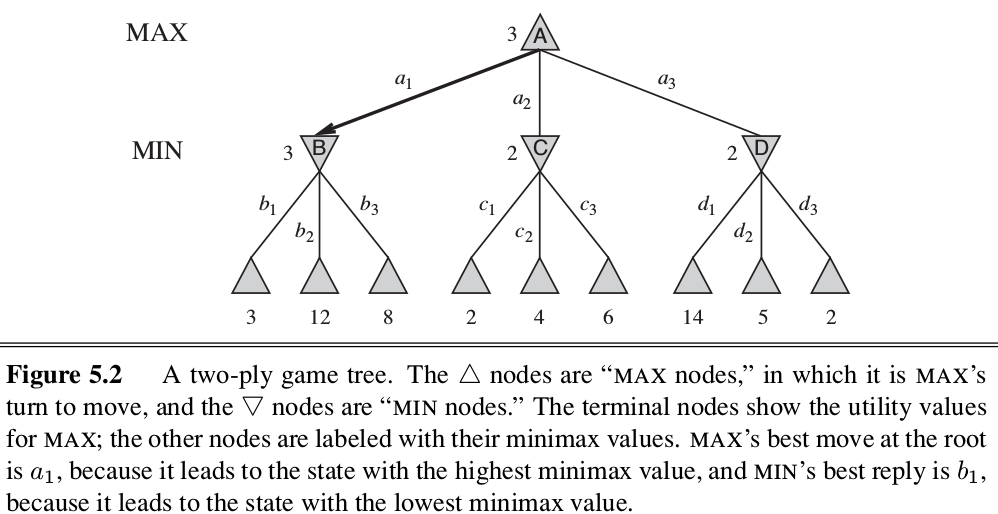]

---

class: middle

## Properties of Minimax

- .bold[Completeness]:
    - Yes, if tree is finite.
- .bold[Optimality]:
    - Yes, if MIN is an optimal opponent.
    - What if MIN is suboptimal?
        - Show that MAX will do even better.
    - What if MIN is suboptimal and predictable?
        - Other strategies might do better than Minimax. However they may do worse on an optimal opponent.

---

class: middle

## Minimax efficiency

- Assume $\text{minimax}(s)$ is implemented using its recursive definition.
- How efficient is minimax?
    - Time complexity: same as DFS, i.e., $O(b^m)$.
    - Space complexity:
        - $O(bm)$, if all actions are generated at once, or
        - $O(m)$, if actions are generated one at a time.

.question[Do we need to explore the whole game tree?]

---

# Pruning

.center.width-70[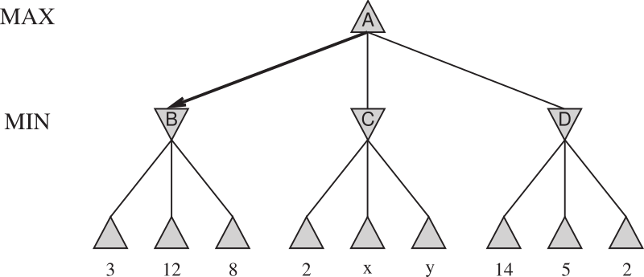]

.width-100[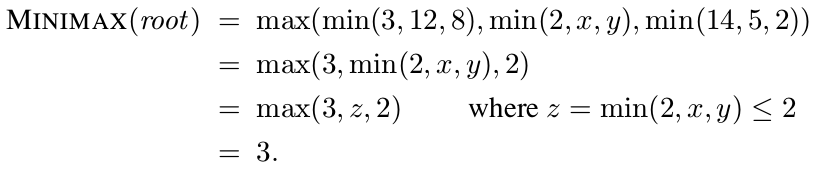]

Therefore, it is possible to compute the .bold[correct] minimax decision .bold[without looking at every node] in the tree.

---

class: middle

.center.width-80[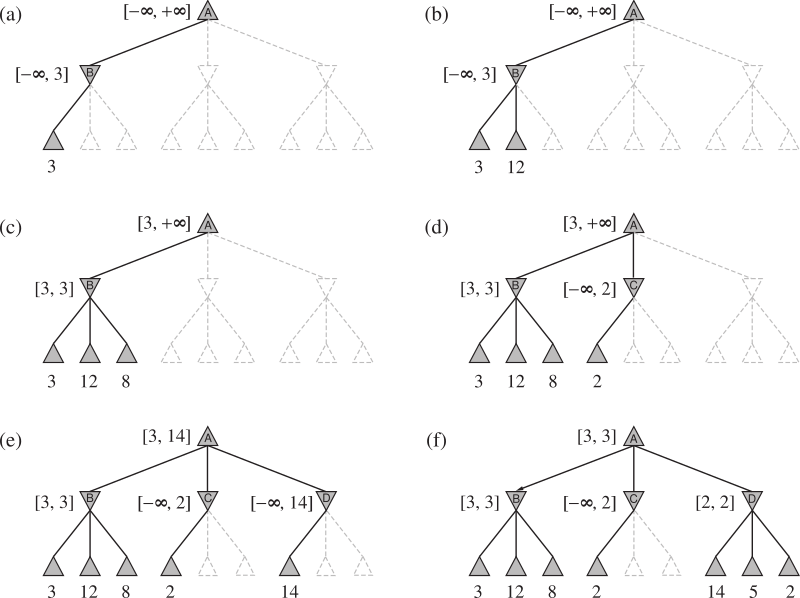]

---

class: middle

.grid[
.kol-2-3[
We want to compute $v = \text{minimax}(n)$, for $\text{player(n)}$=MIN.
- We loop over $n$'s children.
- The minimax values are being computed one at a time and $v$ is updated iteratively.
- Let $\alpha$ be the best value (i.e., the highest) at any choice point along the path for MAX.
- If $v$ becomes lower than $\alpha$, then .bold[$n$ will never be reached] in actual play.
- Therefore, we can .bold[stop iterating] over the remaining $n$'s other children.
]
.kol-1-3[<br><br>.center.width-100[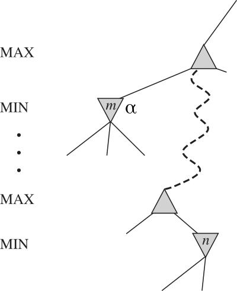]]
]

???

Go back to the previous slide and the transition from (d) to (e).

If the minimax value $v$ for MIN becomes lower than the best value $\alpha$ for MAX, then $n$ will never be reached.

---

class: middle

Similarly, $\beta$ is defined as the best value (i.e., lowest) at any choice point along the path for MIN. We can halt the expansion of a MAX node as soon as $v$ becomes larger than $\beta$.

## $\alpha$-$\beta$ pruning
- Updates the values of $\alpha$ and $\beta$ as the path is expanded.
- Prune the remaining branches (i.e., terminate the recursive calls) as soon as the value of the current node is known to be worse than the current $\alpha$ or $\beta$ value for MAX or MIN, respectively.

???

If the minimax value $v$ for MAX becomes larger the best value $\beta$ for MIN, then $n$ will never be reached.

---

# $\alpha$-$\beta$ search

.center.width-90[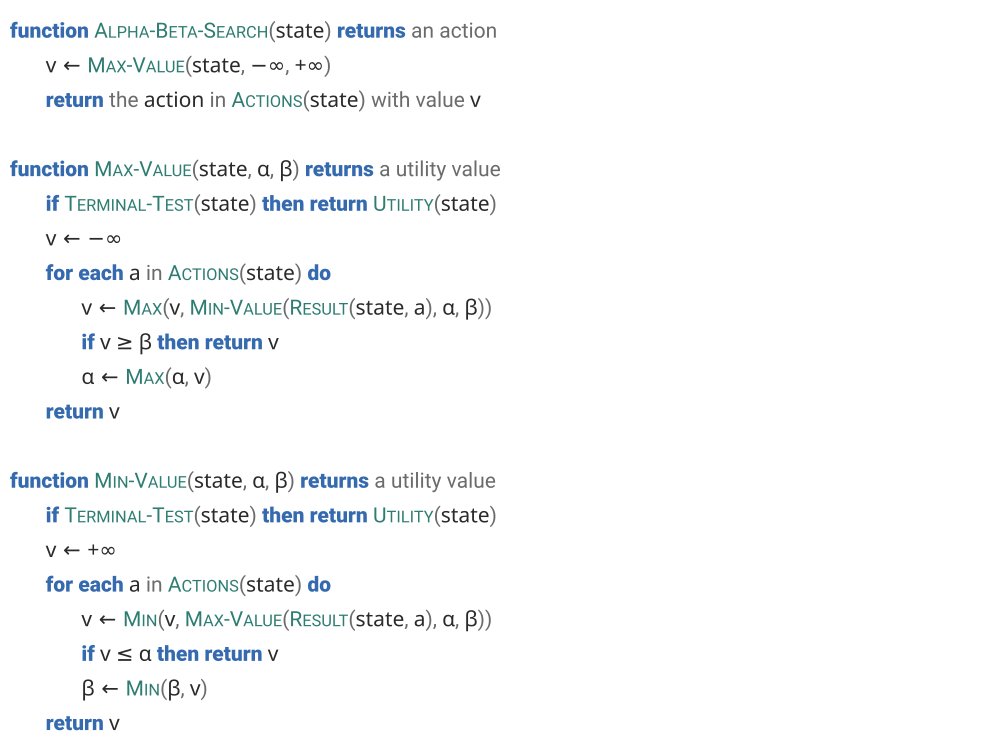]

???

Note that MAX plays first, hence the first call to MAX-VALUE in the main function.

---

class: middle

## Properties of $\alpha$-$\beta$ search

- Pruning has .bold[no effect] on the minimax values. Therefore, .bold[completeness] and .bold[optimality] are preserved from Minimax.
- Time complexity:
    - The effectiveness depends on the order in which the states are examined.
    - If states could be examined in .bold[perfect order], then $\alpha-\beta$ search examines only $O(b^{m/2})$ nodes to pick the best move, vs. $O(b^m)$ for minimax.
        - $\alpha-\beta$ can solve a tree twice as deep as minimax can in the same amount of time.
        - Equivalent to an effective branching factor $\sqrt{b}$.
- Space complexity: $O(m)$, as for Minimax.

---

# Game tree size

.center.width-30[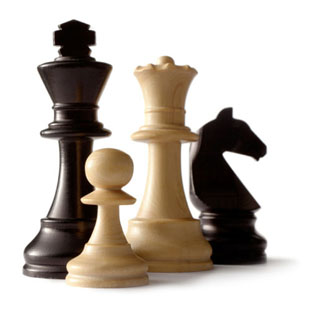]

Chess:
- $b \approx 35$ (approximate average branching factor)
- $d \approx 100$ (depth of a game tree for typical games)
- $b^d \approx 35^{100} \approx 10^{154}$.
- For $\alpha-\beta$ search and perfect ordering, we get $b^{d/2} \approx 35^{50} = 10^{77}$.

Finding the exact solution with Minimax remains .bold[intractable].

---

# Transposition table

- Repeated states occur frequently because of .bold[transpositions]: distinct permutations of the move sequence end in a same position.
- Similarly to the `closed` set in graph search (Lecture 2), it is worth storing the evaluation of a state such that further occurrences of the state do not have to be recomputed.

.question[What data structure should be used to efficiently store and look-up values of positions?]

---

# Imperfect real-time decisions

- Under .bold[time constraints], searching for the exact solution is not feasible in most realistic games.
- Solution: cut the search earlier.
    - Replace the $\text{utility}(s)$ function with a heuristic .bold[evaluation function] $\text{eval}(s)$ that estimates the state utility.
    - Replace the terminal test by a .bold[cutoff test] ${\text{cutoff-test}(s, d)}$ that decides when to stop expanding a state $s$ at depth $d$.

$$\text{h-minimax}(s, d) = \begin{cases}
\text{eval}(s) & \text{if cutoff} \\\\
\max\limits\_{a} \text{h-minimax}(\text{result}(s, a), d + 1) & \text{if MAX plays} \\\\
\min\limits\_{a} \text{h-minimax}(\text{result}(s, a), d + 1) & \text{if MIN plays.}
\end{cases}$$

.question[Can $\alpha-\beta$ search  be adapted to implement H-Minimax?]

???

Yes.

Replace the if-statements with the terminal test with if-statements with the cutoff test.

---

class: middle

## Evaluation functions

- An evaluation function $\text{eval}(s)$ returns an .bold[estimate] of the expected utility of the game from a given position $s$.
- The computation .bold[must be short] (that is the whole point to search faster).
- Ideally, the evaluation should .bold[order] states in the same way as in Minimax.
    - The evaluation values may be different from the true minimax values, as long as order is preserved.
- In non-terminal states, the evaluation function should be strongly .bold[correlated] with the actual chances of winning.

???

- Like for heuristics in search, evaluation functions can be learned using machine learning algorithms.

---

class: middle

## Quiescence

.center.width-70[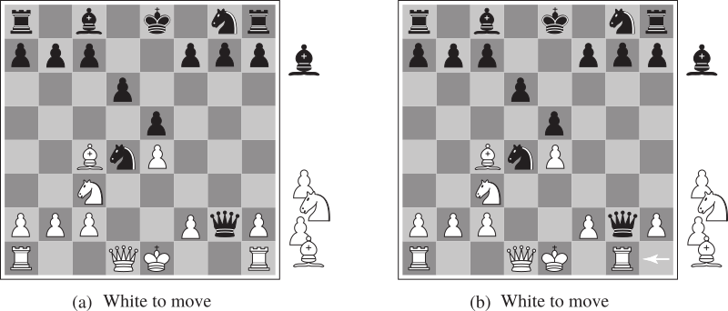]

- These states only differ in the position of the rook at lower right.
- However, Black has advantage in (a), but not in (b).
- If the search stops in (b), Black will not see that White's next move is to capture its Queen, gaining advantage.
- Cutoff should only be applied to positions that are .bold[quiescent].
    - i.e., states that are unlikely to exhibit wild swings in value in the near future.

---

# The horizon effect

Evaluations functions are .bold[always imperfect].
- If not looked deep enough, .bold[bad moves] may appear as .bold[good moves] (as estimated by the evaluation function) because their consequences are hidden beyond the search horizon.
    - and vice-versa!
- Often, the deeper in the tree the evaluation function is buried, the less the quality of the evaluation function matters.

---

class: middle, black-slide

.center[<video controls preload="auto" height="480" width="640">
  <source src="figures/lec3/depth2.mp4" type="video/mp4">
</video>]

.caption[Cutoff at depth 2, evaluation = the closer to the dot, the better.]

.footnote[Credits: [CS188](https://inst.eecs.berkeley.edu/~cs188/), UC Berkeley.]

???

```
cd demo/lec3
uv run python run.py --agentfile hminimax.py --pdepth 2 --nghosts 2 --slowmo on
uv run python run.py --agentfile hminimax.py --pdepth 10 --nghosts 2 --slowmo on
```

---

class: middle, black-slide

.center[<video controls preload="auto" height="480" width="640">
  <source src="figures/lec3/depth10.mp4" type="video/mp4">
</video>]

.caption[Cutoff at depth 10, evaluation = the closer to the dot, the better.]

.footnote[Credits: [CS188](https://inst.eecs.berkeley.edu/~cs188/), UC Berkeley.]

---

# Multi-agent games

- What if the game is not zero-sum, or has .bold[multiple players]?
- Generalization of Minimax:
    - Terminal states are labeled with utility .bold[tuples] (1 value per player).
    - Intermediate states are also labeled with utility tuples.
    - Each player maximizes its own component.
    - May give rise to cooperation and competition dynamically.

.center.width-70[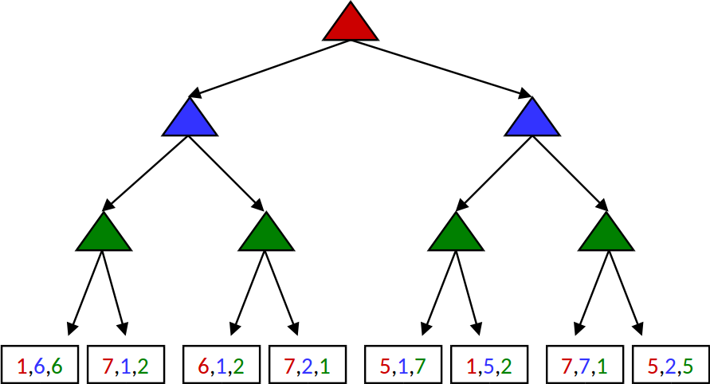]

.footnote[Credits: [CS188](https://inst.eecs.berkeley.edu/~cs188/), UC Berkeley.]

---

class: middle

# Stochastic games

---

# Stochastic games

- In real life, many unpredictable external events can put us into unforeseen situations.
- Games that mirror this unpredictability are called .bold[stochastic games]. They include a random element, such as:
    - explicit randomness: rolling a dice;
    - actions may fail: when moving a robot, wheels might slip.

<br>
.center.width-40[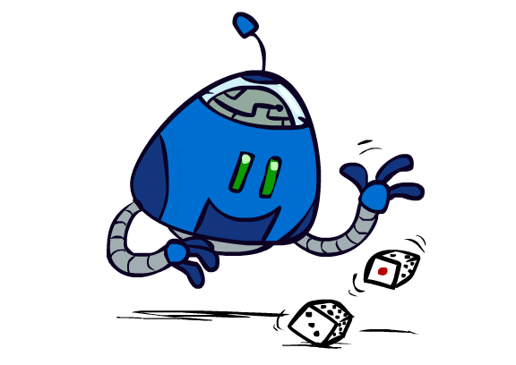]

.footnote[Credits: [CS188](https://inst.eecs.berkeley.edu/~cs188/), UC Berkeley.]

---

class: middle

- In a game tree, this random element can be .bold[modeled] with .bold[chance nodes] that map a state-action pair to the set of possible outcomes, along with their respective .bold[probability].
- This is equivalent to considering the environment as an extra  .bold[random agent] player that moves after each of the other players.

.center.width-30[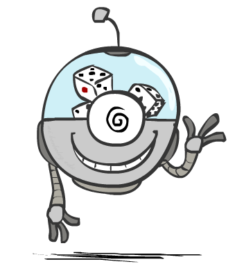]

.footnote[Credits: [CS188](https://inst.eecs.berkeley.edu/~cs188/), UC Berkeley.]

---

class: middle

## Stochastic game tree

.center.width-80[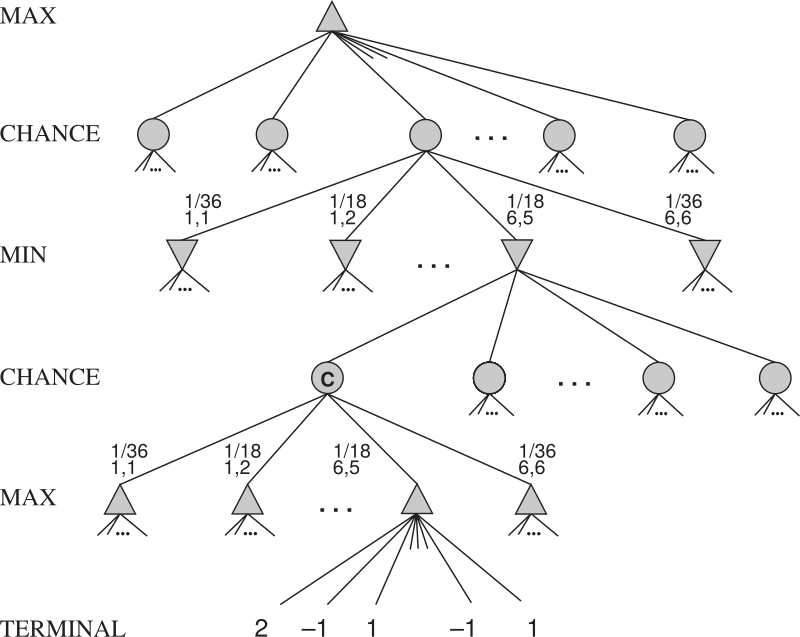]

???

- This tree corresponds to a game with two dices
- What is the best move? The best move cannot be determined anymore, because it depends on chance.

=> Assume the 2nd player is rational and plays optimally and that the 3rd player (corresponding to chance nodes) is random.

---

# Expectiminimax

- Because of the uncertainty in the action outcomes, states no longer have a .bold[definite] $\text{minimax}$ value.
- However, we can calculate the .bold[expected] value of a state under optimal play by the opponent.
    - i.e., the average over all possible outcomes of the chance nodes.
    - $\text{minimax}$ values correspond instead to the worst-case outcome.

Writing ${v(s) = \text{expectiminimax}(s)}$ for short,
$$v(s) = \begin{cases}
\text{utility}(s) & \text{if } s \in T \\\\
\max\limits\_a v(\text{result}(s, a)) & \text{if MAX plays} \\\\
\min\limits\_a v(\text{result}(s, a)) & \text{if MIN plays} \\\\
\sum\limits\_r P(r) \, v(\text{result}(s, r)) & \text{if CHANCE plays.}
\end{cases}$$

.question[Does taking the rational move mean the agent will be successful?]

---

class: middle

## Evaluation functions

- As for $\text{minimax}(n)$, the value of $\text{expectiminimax}(n)$ may
be approximated by stopping the recursion early and using an evaluation function.
- However, to obtain correct move, the evaluation function should be a .bold[positive linear transformation] of the expected utility of the state.
    - It is not enough for the evaluation function to just be order-preserving.
- If we assume bounds on the utility function, $\alpha-\beta$ search can be adapted to stochastic games.

<br>
.center.width-70[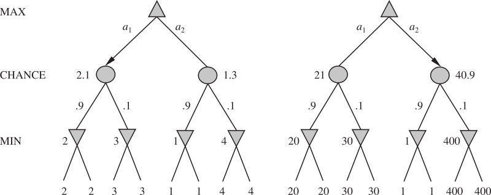]
.caption[An order-preserving transformation on leaf values changes the best move.]

---

class: middle

# Monte Carlo tree search

---

# Monte Carlo Tree Search

## Random playout evaluation

- To evaluate a state, have the algorithm play .bold[against itself] using .bold[random moves], thousands of times.
- The sequence of random moves is called a .bold[random playout].
- Use the proportion of wins as the state evaluation.
- This strategy does .bold[not require domain knowledge]!
    - The game engine is all that is needed.

???

Explain MCTS on the blackboard.

---

class: middle

## Monte Carlo Tree Search

The focus of MCTS is the analysis of the most promising moves, as incrementally evaluated with random playouts.

Each node $n$ in the current search tree maintains  two values:
- the number of wins $Q(n,p)$ of player $p$ for all playouts that passed through $n$;
- the number $N(n)$ of times $n$ has been visited.

---

class: middle

Each round of the search does four things: .bold[selection] down to a node that is not fully expanded, .bold[expansion] of one child, .bold[simulation] of a random playout from it, and .bold[backpropagation] of the result along the path back to the root.

.width-100[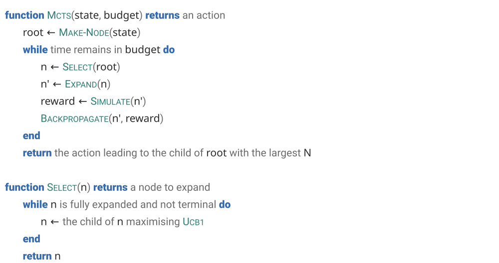]

Rounds are repeated for as long as the time budget allows. The move played is the one leading to the most visited child of the root.

---

class: middle

.center.width-100[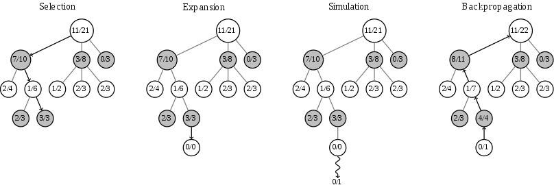]

???

This graph shows the steps involved in one decision, with each node showing the ratio of wins to total playouts from that point in the game tree for the player that node represents. In the Selection diagram, black is about to move. The root node shows there are 11 wins out of 21 playouts for white from this position so far. It complements the total of 10/21 black wins shown along the three black nodes under it, each of which represents a possible black move.

If white loses the simulation, all nodes along the selection incremented their simulation count (the denominator), but among them only the black nodes were credited with wins (the numerator). If instead white wins, all nodes along the selection would still increment their simulation count, but among them only the white nodes would be credited with wins. In games where draws are possible, a draw causes the numerator for both black and white to be incremented by 0.5 and the denominator by 1. This ensures that during selection, each player's choices expand towards the most promising moves for that player, which mirrors the goal of each player to maximize the value of their move.

Rounds of search are repeated as long as the time allotted to a move remains. Then the move with the most simulations made (i.e. the highest denominator) is chosen as the final answer.

---

class: middle

## Exploration and exploitation

Given a limited budget of random playouts, the efficiency of MCTS critically depends on the choice of the nodes made during the .bold[selection] step.

During the traversal of the branch in the selection step, the UCB1 policy picks the child node $n'$ of $n$ that maximizes
$$\frac{Q(n',p)}{N(n')} + c \sqrt{\frac{\log N(n)}{N(n')}}.$$
- The first term  encourages the .bold[exploitation] of higher-reward nodes.
- The second term encourages the .bold[exploration] of less-visited nodes.
- The constant $c>0$ controls the trade-off between exploitation and exploration.

---

class: middle

# Modeling assumptions

---

class: middle

.center[


What if our assumptions are incorrect?]

.footnote[Credits: [CS188](https://inst.eecs.berkeley.edu/~cs188/), UC Berkeley.]

---

class: middle, black-slide

.grid[
.kol-2-3[

## Setup

- $P_1$: Pacman uses depth 4 search with an evaluation function that avoids trouble, while assuming that the ghost follows $P_2$.
- $P_2$: Ghost uses depth 2 search with an evaluation function that seeks Pacman, while assuming that Pacman follows $P_1$.
- $P_3$: Pacman uses depth 4 search with an evaluation function that avoids trouble, while assuming that the ghost follows $P_4$.
- $P_4$: Ghost makes random moves.
]
.kol-1-3[.width-100[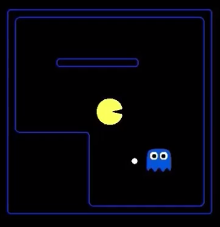]]
]

???

The first two videos can be replayed live, from `demo/lec3`:

```
uv run python run.py --agentfile hminimax_ADV.py --pdepth 4 \
    --ghostagent cheeky --gdepth 2 --layout medium_adv
uv run python run.py --agentfile hminimax_ADV.py --pdepth 4 \
    --ghostagent rightrandy --p 0 --layout medium_adv
```

The cheeky ghost searches the tree itself, to the depth given by `--gdepth`,
which is P2; rightrandy with `--p 0` moves uniformly at random, which is P4.

There is no expectimax agent in `SearchMethods/`, so P3 is shown by the
recorded videos only.

---

class: middle, black-slide

.center[
<video controls preload="auto" height="400" width="300">
  <source src="figures/lec3/minimax-vs-adversarial.mp4" type="video/mp4">
</video>

Minimax Pacman ($P_1$) vs. Adversarial ghost ($P_2$)
]

.footnote[Credits: [CS188](https://inst.eecs.berkeley.edu/~cs188/), UC Berkeley.]

???

Assumptions are correct.

Pacman wins partly because of the larger depth it uses.

---

class: middle, black-slide

.center[
<video controls preload="auto" height="400" width="300">
  <source src="figures/lec3/minimax-vs-random.mp4" type="video/mp4">
</video>

Minimax Pacman ($P_1$) vs. Random ghost ($P_4$)
]

.footnote[Credits: [CS188](https://inst.eecs.berkeley.edu/~cs188/), UC Berkeley.]

???

Assumptions are incorrect. Has the ghost some masterplan?

---

class: middle, black-slide

.center[
<video controls preload="auto" height="400" width="300">
  <source src="figures/lec3/expectimax-vs-random.mp4" type="video/mp4">
</video>

Expectiminimax Pacman ($P_3$) vs. Random ghost ($P_4$)
]

.footnote[Credits: [CS188](https://inst.eecs.berkeley.edu/~cs188/), UC Berkeley.]

???

Assumptions are correct.

---

class: middle, black-slide

.center[
<video controls preload="auto" height="400" width="300">
  <source src="figures/lec3/expectimax-vs-adversarial.mp4" type="video/mp4">
</video>

Expectiminimax Pacman ($P_3$) vs. Adversarial ghost ($P_2$)
]

.footnote[Credits: [CS188](https://inst.eecs.berkeley.edu/~cs188/), UC Berkeley.]

???

Pacman is lucky!

---

class: middle

# State-of-the-art game programs

---

class: middle

## Perfect information

.grid[
.kol-2-3[
- .bold[1997], .bold[Deep Blue] defeats Garry Kasparov at chess: $2 \times 10^8$ positions per second, a sophisticated evaluation function, and search extended up to 40 plies on some lines.
- .bold[2007], .bold[checkers is solved]: $10^{14}$ calculations over 18 years prove that perfect play by both sides is a draw.
- .bold[2016], .bold[AlphaGo] beats Lee Sedol 4-1, then Ke Jie in 2017, by combining Monte Carlo tree search with deep learning trained on human and self-play games.

Chess and Go remain .bold[unsolved]: only their best play is now superhuman.
]
.kol-1-3[.center.width-100[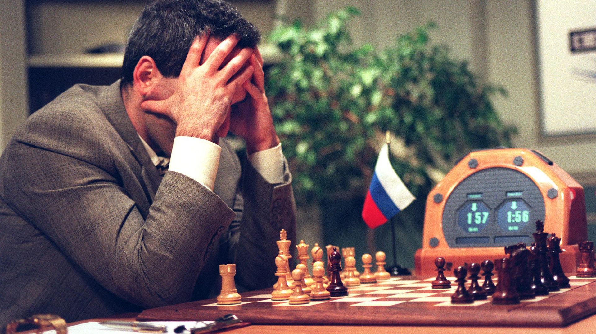]]
]

.footnote[Schaeffer et al., "Checkers is solved", Science, 2007; Silver et al., "Mastering the game of Go", Nature, 2016.]

???

A solved game is one whose outcome can be predicted from any position, assuming perfect play on both sides.

---

class: middle, black-slide, center

<iframe width="640" height="400" src="https://www.youtube.com/embed/m2QFSocFeOQ" frameborder="0" allowfullscreen></iframe>

.caption[Press coverage for the victory of AlphaGo against Lee Sedol.]

---

class: middle

## Learning to play, from less and less

- .bold[2017], .bold[AlphaGo Zero] reaches the same level from .bold[self-play only], with no human games.
- .bold[2018], .bold[AlphaZero] applies the same recipe to chess, shogi and Go, given only the rules.
- .bold[2020], .bold[MuZero] drops the rules too: it .bold[learns a model] of the game and plans with it, mastering Go, chess, shogi and Atari.

.center.width-55[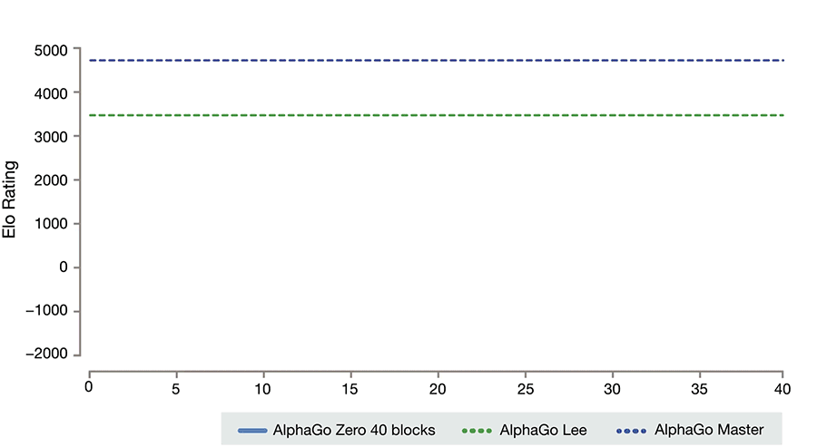]

.footnote[Credits: [AlphaGo Zero: Learning from scratch](https://deepmind.com/blog/alphago-zero-learning-scratch/); Schrittwieser et al., "Mastering Atari, Go, chess and shogi by planning with a learned model", Nature, 2020.]

---

class: middle

## Imperfect information

The assumption of .bold[perfect information] we made at the start is what these games drop:

- .bold[2017-2019], .bold[Libratus] then .bold[Pluribus] beat professionals at no-limit poker, the latter with .bold[six players] at the table, where no notion of optimal play against all opponents exists.
- .bold[2022], .bold[DeepNash] reaches expert level at .bold[Stratego], where each side hides its pieces.
- .bold[2022], .bold[Cicero] plays .bold[Diplomacy] at human level, combining planning with .bold[negotiation in natural language].

.question[What does an optimal strategy even mean when the opponents may cooperate, and lie?]

.footnote[Brown and Sandholm, Science, 2017 and 2019; Perolat et al., Science, 2022; Meta FAIR, Science, 2022.]

---

# Summary

- A .bold[game] adds ${\text{player}(s)}$, .bold[terminal states] ${T \subseteq \mathcal{S}}$ and a .bold[utility] ${\text{utility}(s, p)}$ to the search problem of lecture 2. Its solution is a .bold[strategy] ${\pi\_p : \mathcal{S} \to \mathcal{A}}$, not a sequence ${a\_{1:T}}$.

- .bold[Minimax] backs the utilities up the tree, ${\max\limits\_a}$ for MAX and ${\min\limits\_a}$ for MIN, in ${O(b^m)}$ time and ${O(bm)}$ space.

- ${\alpha}$-${\beta}$ .bold[pruning] returns the .bold[same move] while examining ${O(b^{m/2})}$ nodes at best: twice the depth in the same time.

- .bold[H-minimax] cuts the search at depth ${d}$ and replaces the utility by an .bold[evaluation function], at the price of the .bold[horizon effect].

- .bold[Expectiminimax] adds .bold[chance nodes], worth ${\sum\limits\_r P(r) \, v(\text{result}(s, r))}$, and .bold[Monte Carlo tree search] samples .bold[random playouts] instead of evaluating.

- Each is optimal only .bold[relative to a model] of the opponent. Assuming the .bold[wrong] one is not playing well.

---

class: end-slide, center
count: false

The end.