class: middle, center, title-slide

# Introduction to Artificial Intelligence

Lecture 3: Games and Adversarial search

<br><br>
Prof. Gilles Louppe<br>
[g.louppe@uliege.be](mailto:g.louppe@uliege.be)

---

class: center, black-slide, middle

<iframe width="600" height="450" src="https://www.youtube.com/embed/LJS7Igvk6ZM" frameborder="0" allowfullscreen></iframe>

???

Questions to ask after the video, each a preview of the lecture:
- Who are the players, and what can each of them do? (the formal definition of a game)
- What does Nash reason about, moves or outcomes? (utilities of terminal states)
- Why can't a friend decide on his own, once and for all? (a strategy, not a fixed plan)
- Are the interests of the friends opposed or shared? (zero-sum games, and beyond)
- What does Nash assume the others will do? (an optimal opponent, as in minimax)
- Would his plan hold if one friend changed his mind? (it would not: not an equilibrium, see the bar scene slide)

---

# Today

.question[How to act rationally in a .bold[multi-agent] environment? How to anticipate and respond to the .bold[arbitrary behavior] of other agents?]

- Adversarial search
    - Minimax
    - $\alpha$-$\beta$ pruning
    - H-Minimax
    - Expectiminimax
    - Monte Carlo Tree Search
- Modeling assumptions
- State-of-the-art agents.

---

class: middle

# Games

---

class: middle

## Formal definition

A .bold[game] is defined by
- the .bold[states] ${s \in \mathcal{S}}$ and the .bold[initial state] ${s\_1 \in \mathcal{S}}$;
- the .bold[actions] ${\text{actions}(s) \subseteq \mathcal{A}}$ available in state ${s}$;
- the .bold[transition model] ${s' = \text{result}(s, a)}$, the state reached by taking ${a}$ in ${s}$;
- a function ${\text{player}(s) \in \\{1, \ldots, N\\}}$ that says whose turn it is in state ${s}$;
- the .bold[terminal states] ${T \subseteq \mathcal{S}}$, tested by ${\text{terminal-test}(s)}$, i.e. ${s \in T}$;
- a .bold[utility] ${\text{utility}(s, p)}$, the payoff of player ${p}$ when the game ends in ${s \in T}$, e.g. ${1}$, ${0}$ or ${\frac{1}{2}}$ for a win, a loss or a draw.

Together, ${s\_1}$, ${\text{actions}}$ and ${\text{result}}$ define the .bold[game tree], whose nodes are states and whose edges are actions.

???

A game is a mathematical model of strategic interaction between rational decision makers.

Outline on the blackboard.

---

class: middle

## Strategies

Even in a deterministic and fully observable environment, the opponents may act .bold[arbitrarily]: the next state depends on their choices, which we cannot predict.

A fixed sequence of actions ${a\_{1:T}}$, the solution of a search problem, is then of no use, since the opponent may lead the game anywhere. A .bold[solution] is instead a .bold[strategy], or .bold[policy], ${\pi\_p : \mathcal{S} \to \mathcal{A}}$ for player ${p}$: a move for every state the opponent can lead to.

---

class: middle

## The bar scene, formally

Let the ${N}$ friends choose in turn whom to approach, B (the blonde) or F (one of her friends):
- a state ${s}$ is the sequence of choices made so far, and ${s\_1 = ()}$;
- ${\text{actions}(s) = \\{\text{B}, \text{F}\\}}$ and ${\text{result}(s, a)}$ appends ${a}$ to ${s}$;
- ${\text{player}(s) = |s| + 1}$, the friend whose turn it is;
- the terminal states ${T}$ are the sequences of length ${N}$, when everyone has chosen;
- ${\text{utility}(s, p)}$ is ${2}$ if ${p}$ is alone to choose B, ${0}$ if others chose B too, and ${1}$ if ${p}$ chose F.

Nash evaluates .bold[outcomes], not moves: everyone for the blonde gives ${0}$ to every player, nobody for the blonde gives ${1}$. What each friend should do depends on what the others do, so the answer is a .bold[strategy] rather than a sequence of moves.

???

The scene is a game tree: the friends move, the outcome is scored at the leaves, and the reasoning backs those scores up to the decision at the root.

The utilities are one reading of the scene: the blonde is worth more than her friends, but only to the one who approaches her alone. The film has the friends choose at once; letting them choose in turn makes it a turn-taking game.

Strictly, the conclusion is not a Nash equilibrium: if nobody goes for the blonde, any single friend does better by deviating. What the scene gets right, and what this lecture is about, is the reasoning itself, over outcomes and over the choices of the others.

---

class: middle

## Zero-sum games

A game is .bold[zero-sum] if the utilities of the players sum to the same constant ${c}$ in every terminal state:
$$\sum\_{p=1}^N \text{utility}(s, p) = c \quad \text{for all } s \in T.$$
- e.g., in chess, ${c = 1}$: ${1 + 0}$, ${0 + 1}$ or ${\frac{1}{2} + \frac{1}{2}}$.
- With two players, ${\text{utility}(s, 2) = c - \text{utility}(s, 1)}$: a .bold[single utility] describes the game, which player 1 .bold[maximizes] and player 2 .bold[minimizes].
- This is .bold[strict competition]: what one player gains, the other loses.

<br>
.center.width-40[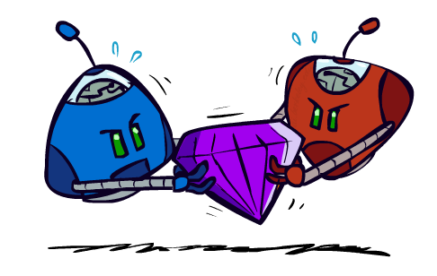]

.footnote[Credits: [CS188](https://inst.eecs.berkeley.edu/~cs188/), UC Berkeley.]

???

The term 'zero-sum' is confusing but makes sense if you imagine each player is charged an entry of 1/2 (for chess). Constant-sum game would have been better.

The bar scene is not zero-sum: everyone for the blonde sums to 0, nobody for the blonde to N.

---

class: middle

## Tic-Tac-Toe game tree

.width-80[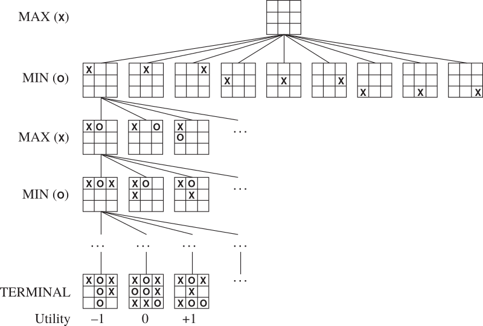]

.question[What is an optimal strategy (or perfect play)? How do we find it?]

---

class: middle

# Minimax

---

class: middle

## Assumptions

Games vary along three axes: .bold[chance], .bold[information] and the .bold[number of players]. We start with the simplest case of each.

- We assume a .bold[deterministic], .bold[turn-taking], .bold[two-player] .bold[zero-sum game] with .bold[perfect information].
    - e.g., Tic-Tac-Toe, Chess, Checkers, Go, etc.
- We will call our two players MAX and MIN. MAX moves first.

.center.width-55[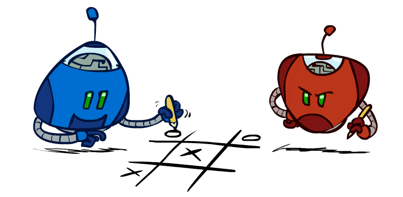]

.footnote[Credits: [CS188](https://inst.eecs.berkeley.edu/~cs188/), UC Berkeley.]

---

class: middle

.center.width-25[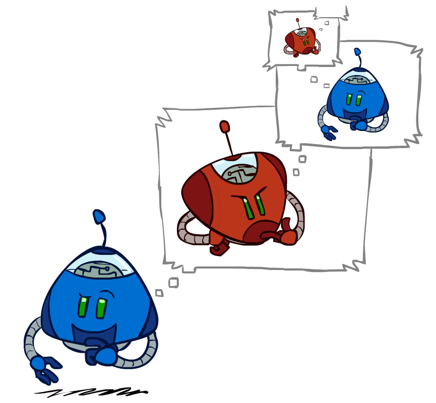]

## Adversarial search

- In a search problem, the solution ${a\_{1:T}}$ is a fixed plan.
- In a game, MAX cannot know which move MIN will play, .bold[now or later]. It must anticipate .bold[every] reply of MIN, every reply to its own answers, and so on until the game ends.
- A .bold[strategy] ${\pi\_\text{MAX}}$ therefore fixes, in advance,
    - its move in the initial state,
    - its move after each possible reply of MIN,
    - its move after each possible reply of MIN to those moves, ...

.footnote[Credits: [CS188](https://inst.eecs.berkeley.edu/~cs188/), UC Berkeley.]

???

Analogy with chess, checkers or belotte.

---

# Perfect play

What does MAX obtain from a state if .bold[both players play perfectly] from there on? Reason .bold[backwards], from the end of the game.

.center.width-70[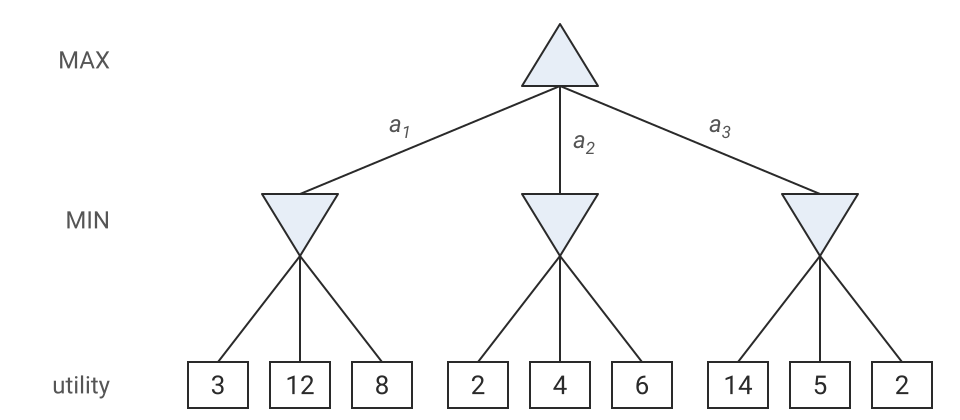]

- At the .bold[leaves], the game is over: the payoff is the utility.

---

count: false

# Perfect play

What does MAX obtain from a state if .bold[both players play perfectly] from there on? Reason .bold[backwards], from the end of the game.

.center.width-70[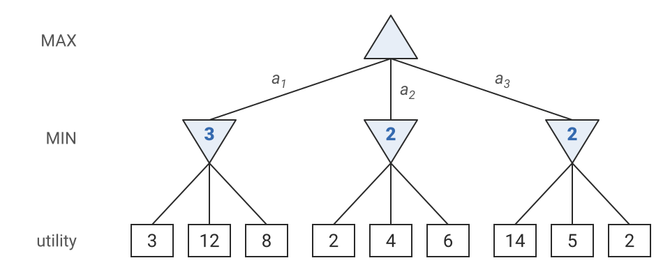]

- At the .bold[leaves], the game is over: the payoff is the utility.
- At a .bold[MIN node], MIN plays the move that is worst for MAX: the left node is worth ${\min(3, 12, 8) = 3}$, the other two ${2}$.

---

count: false

# Perfect play

What does MAX obtain from a state if .bold[both players play perfectly] from there on? Reason .bold[backwards], from the end of the game.

.center.width-70[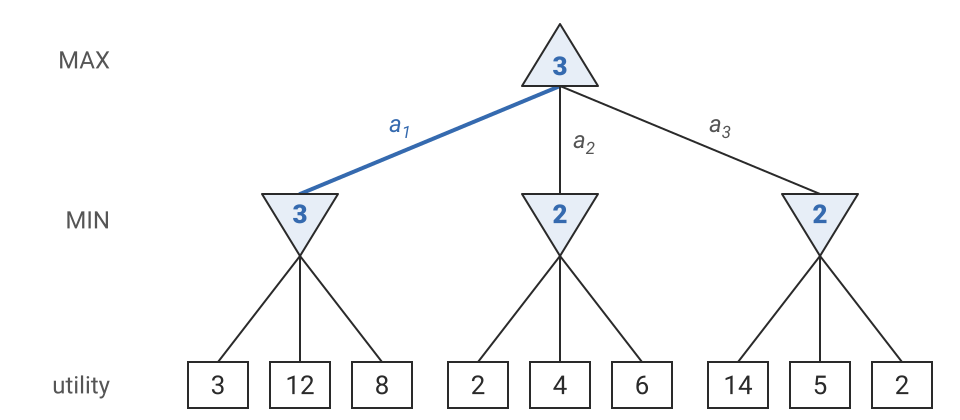]

- At the .bold[leaves], the game is over: the payoff is the utility.
- At a .bold[MIN node], MIN plays the move that is worst for MAX: the left node is worth ${\min(3, 12, 8) = 3}$, the other two ${2}$.
- At the .bold[root], MAX plays the move that is best for it, knowing how MIN will answer: ${\max(3, 2, 2) = 3}$, reached by ${a\_1}$.

???

This is backward induction, the reasoning of the bar scene made exact: the scores of the outcomes are backed up, one level at a time, to the decision at the root.

---

# Minimax

The .bold[minimax value] $\text{minimax}(s)$ is the utility that MAX obtains from $s$ when both players play perfectly. Backing up values from the terminal states gives
$$\text{minimax}(s) = \begin{cases}
\text{utility}(s) & \text{if } s \in T \\\\
\max\limits\_{a} \text{minimax}(\text{result}(s, a)) & \text{if MAX plays} \\\\
\min\limits\_{a} \text{minimax}(\text{result}(s, a)) & \text{if MIN plays,}
\end{cases}$$
where the $\max$ and $\min$ are over ${a \in \text{actions}(s)}$.

The .bold[optimal] next move (for MAX) maximizes the minimax value of the resulting state, ${\pi^\*(s) = \arg\max\limits\_{a} \text{minimax}(\text{result}(s, a))}$.
- ${\text{minimax}(s)}$ is a .bold[guarantee]: whatever MIN plays, MAX obtains at least ${\text{minimax}(s)}$, and an optimal MIN holds it to exactly that.
- MAX thus plans for the .bold[worst case], without any assumption on the strength of the opponent.

???

Blackboard.

---

class: middle

## Properties of Minimax

- .bold[Completeness]:
    - Yes, if tree is finite.
- .bold[Optimality]:
    - Yes, if MIN is an optimal opponent.
    - What if MIN is suboptimal?
        - Show that MAX does at least as well.
    - What if MIN is suboptimal and predictable?
        - Other strategies might do better than Minimax. However they may do worse on an optimal opponent.

???

On the perfect play tree: MAX plays ${a\_1}$, of value ${3}$. An optimal MIN answers with the leaf ${3}$; a suboptimal MIN picks ${12}$ or ${8}$, and MAX gets more. MAX never gets less than ${3}$, whatever MIN does.

At least as well, not strictly better: if MIN errs where it does not matter (the other replies may be worth as much), or never errs, MAX gets exactly ${3}$.

In general, MAX playing ${\pi^\*}$ from ${s}$ obtains at least ${\text{minimax}(s)}$, by induction from the leaves:
- at a terminal state, it obtains ${\text{utility}(s) = \text{minimax}(s)}$;
- at a MAX node, it plays the child of value ${\text{minimax}(s)}$;
- at a MIN node, every child is worth at least ${\min = \text{minimax}(s)}$, whichever MIN picks.

---

class: middle

## Minimax efficiency

- Assume $\text{minimax}(s)$ is implemented using its recursive definition.
- How efficient is minimax?
    - Time complexity: same as DFS, i.e., $O(b^m)$.
    - Space complexity:
        - $O(bm)$, if all actions are generated at once, or
        - $O(m)$, if actions are generated one at a time.

.question[Do we need to explore the whole game tree?]

---

# Pruning

.center.width-80[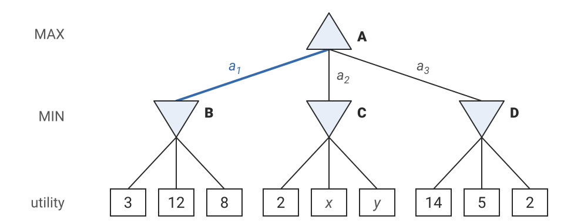]

$$\begin{aligned}
\text{minimax}(\text{root}) &= \max(\min(3, 12, 8), \min(2, x, y), \min(14, 5, 2)) \\\\
&= \max(3, z, 2) \quad \text{where } z = \min(2, x, y) \leq 2 \\\\
&= 3.
\end{aligned}$$

Therefore, it is possible to compute the .bold[correct] minimax decision .bold[without looking at every node] in the tree.

---

# Pruning, step by step

.center.width-80[]

The first leaf of B is ${3}$: B, a MIN node, is worth .bold[at most] ${3}$.

---

count: false

# Pruning, step by step

.center.width-80[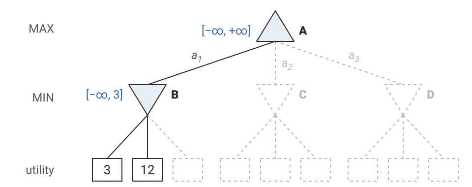]

The leaf ${12}$ does not change the bound of B: MIN would not choose it.

---

count: false

# Pruning, step by step

.center.width-80[]

B is worth exactly ${3}$: MAX is guaranteed .bold[at least] ${3}$ at the root.

---

count: false

# Pruning, step by step

.center.width-80[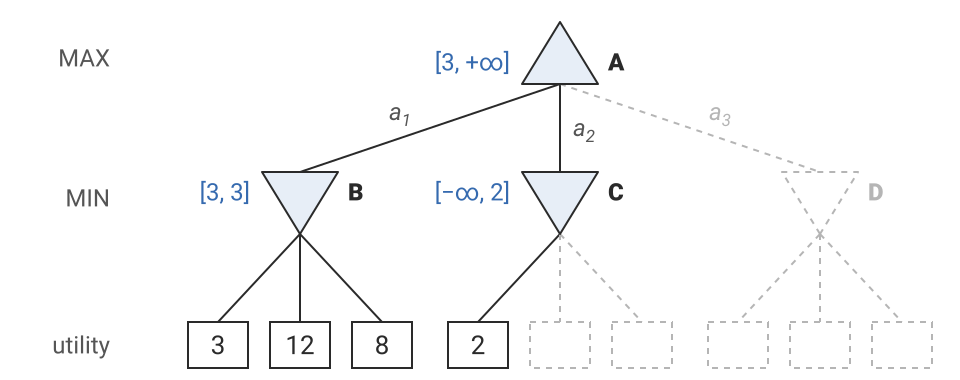]

The first leaf of C is ${2}$: C is worth at most ${2 < 3}$. MAX will never choose C, so its other leaves are .bold[pruned].

---

count: false

# Pruning, step by step

.center.width-80[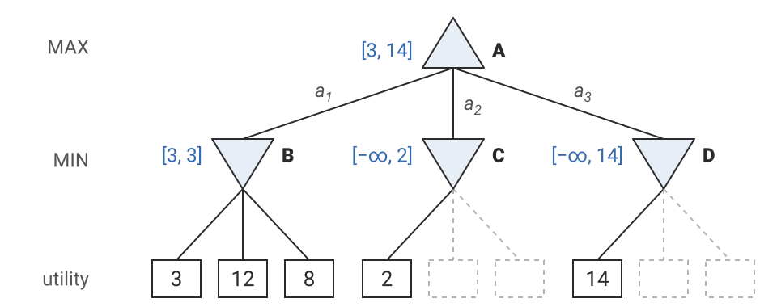]

The first leaf of D is ${14}$: D is worth at most ${14}$, and so is the root.

---

count: false

# Pruning, step by step

.center.width-80[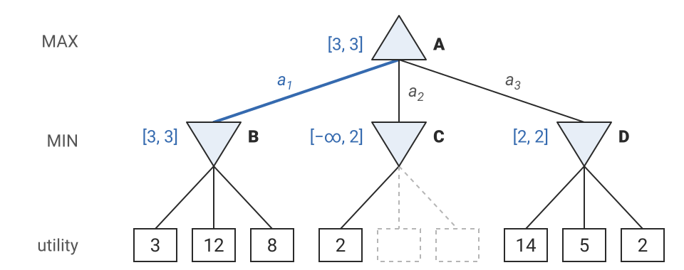]

The other leaves bring D down to ${2}$. The root is worth exactly ${3}$, reached by ${a\_1}$.

---

class: middle

.grid[
.kol-3-5[
We want to compute $v = \text{minimax}(n)$, for $\text{player(n)}$=MIN.
- We loop over $n$'s children.
- The minimax values are being computed one at a time and $v$ is updated iteratively.
- Let $\alpha$ be the best value (i.e., the highest) at any choice point along the path for MAX.
- If $v$ becomes lower than $\alpha$, then .bold[$n$ will never be reached] in actual play.
- Therefore, we can .bold[stop iterating] over the remaining $n$'s other children.
]
.kol-2-5[.center.width-100[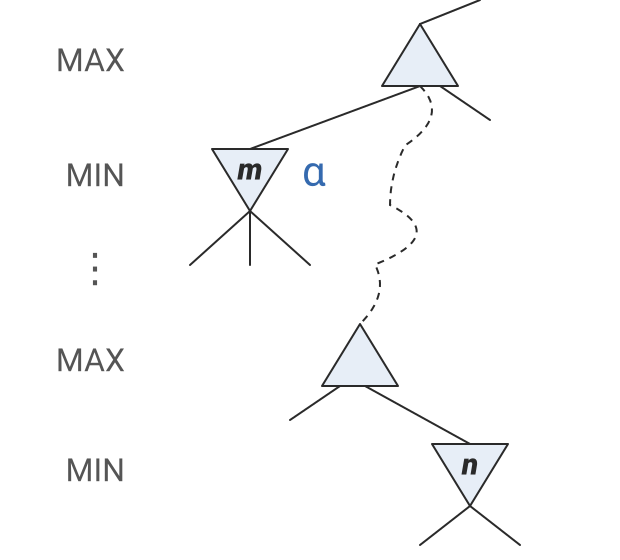]]
]

???

Go back to step 4 of the previous sequence: C is pruned because its value, at most 2, is below α = 3.

If the minimax value $v$ for MIN becomes lower than the best value $\alpha$ for MAX, then $n$ will never be reached.

---

class: middle

Similarly, $\beta$ is defined as the best value (i.e., lowest) at any choice point along the path for MIN. We can halt the expansion of a MAX node as soon as $v$ becomes larger than $\beta$.

## $\alpha$-$\beta$ pruning
- Updates the values of $\alpha$ and $\beta$ as the path is expanded.
- Prune the remaining branches (i.e., terminate the recursive calls) as soon as the value of the current node is known to be worse than the current $\alpha$ or $\beta$ value for MAX or MIN, respectively.

???

If the minimax value $v$ for MAX becomes larger the best value $\beta$ for MIN, then $n$ will never be reached.

---

# $\alpha$-$\beta$ search

.center.width-90[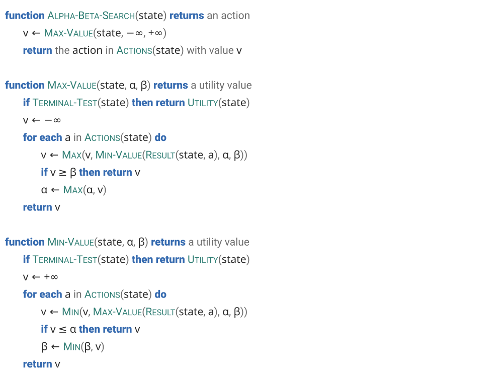]

???

Note that MAX plays first, hence the first call to MAX-VALUE in the main function.

---

class: middle

## Properties of $\alpha$-$\beta$ search

- Pruning has .bold[no effect] on the minimax values. Therefore, .bold[completeness] and .bold[optimality] are preserved from Minimax.
- Time complexity:
    - The effectiveness depends on the order in which the states are examined.
    - If states could be examined in .bold[perfect order], then $\alpha$-$\beta$ search examines only $O(b^{m/2})$ nodes to pick the best move, vs. $O(b^m)$ for minimax.
        - $\alpha$-$\beta$ can solve a tree twice as deep as minimax can in the same amount of time.
        - Equivalent to an effective branching factor $\sqrt{b}$.
- Space complexity: $O(m)$, as for Minimax.

---

# Game tree size

.center.width-30[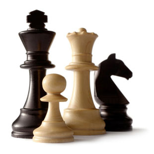]

Chess:
- $b \approx 35$ (approximate average branching factor)
- $d \approx 100$ (depth of a game tree for typical games)
- $b^d \approx 35^{100} \approx 10^{154}$.
- For $\alpha$-$\beta$ search and perfect ordering, we get $b^{d/2} \approx 35^{50} = 10^{77}$.

Finding the exact solution with Minimax remains .bold[intractable].

---

# Transposition table

- Repeated states occur frequently because of .bold[transpositions]: distinct permutations of the move sequence end in the same state.
- Like the closed set of graph search, a .bold[transposition table] stores ${\text{minimax}(s)}$ for every state ${s}$ already evaluated, so that a repeated state is looked up rather than searched again.

.question[What data structure should be used to efficiently store and look up the values of states?]

???

A .bold[hash table], keyed by the state, with expected ${O(1)}$ insertion and look-up.

In chess programs, the key is a 64-bit Zobrist hash: a random number is drawn once for every (piece, square) pair, and the key of a position is the XOR of the numbers of its pieces, updated in ${O(1)}$ after each move. The table has a fixed size and replaces old entries, keeping those searched deepest. With α-β pruning, an entry also stores the depth of the search and whether the value is exact or only a bound.

---

# Imperfect real-time decisions

Under .bold[time constraints], searching down to the terminal states is not feasible in most realistic games. The solution is to cut the search earlier:
- replace the $\text{utility}(s)$ function with a heuristic .bold[evaluation function] $\text{eval}(s)$ that estimates the state utility;
- replace the terminal test by a .bold[cutoff test] ${\text{cutoff-test}(s, d)}$ that decides when to stop expanding a state $s$ at depth $d$.

$$\text{h-minimax}(s, d) = \begin{cases}
\text{eval}(s) & \text{if cutoff} \\\\
\max\limits\_{a} \text{h-minimax}(\text{result}(s, a), d + 1) & \text{if MAX plays} \\\\
\min\limits\_{a} \text{h-minimax}(\text{result}(s, a), d + 1) & \text{if MIN plays.}
\end{cases}$$

.question[Can $\alpha$-$\beta$ search be adapted to implement H-Minimax?]

???

Yes.

Replace the if-statements with the terminal test with if-statements with the cutoff test.

---

class: middle

## Evaluation functions

An evaluation function $\text{eval}(s)$ returns an .bold[estimate] of the expected utility of the game from a state $s$. Its computation .bold[must be short]: that is the whole point of cutting the search.

Ideally, $\text{eval}(s)$ .bold[orders] states as their minimax values do. Its values may differ from the minimax values, as long as the order is preserved. In non-terminal states, it should be strongly .bold[correlated] with the actual chances of winning.

???

- Like for heuristics in search, evaluation functions can be learned using machine learning algorithms.

---

class: middle

## Quiescence

.center.width-70[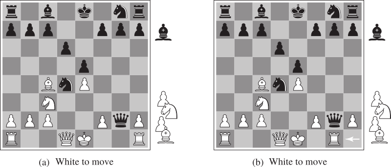]

These two states differ only in the position of the rook at the lower right, yet Black has the advantage in (a) but not in (b). If the search stops in (b), Black does not see that White's next move captures its queen.

The cutoff should only be applied to .bold[quiescent] states, whose value is unlikely to exhibit wild swings in the near future.

---

# The horizon effect

H-Minimax sees the game only down to its cutoff depth, its .bold[horizon]. Below it, $\text{eval}(s)$ stands in for everything that may happen next, and evaluation functions are .bold[always imperfect].

.center.width-70[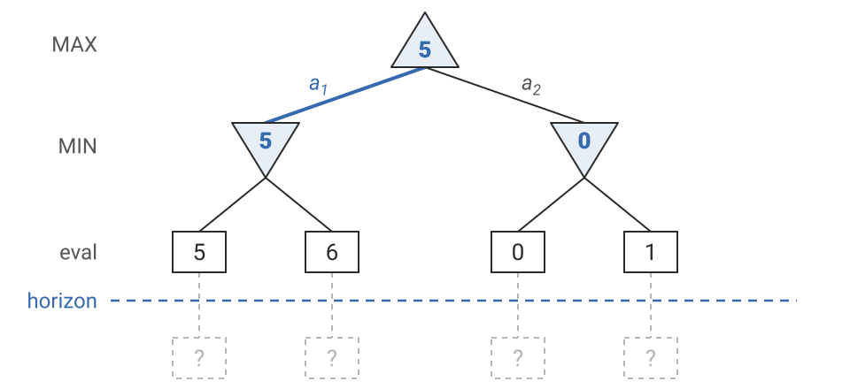]

Searching to depth 2, ${a\_1}$ looks best: $\text{eval}$ rates it ${5}$, against ${0}$ for ${a\_2}$.

---

count: false

# The horizon effect

H-Minimax sees the game only down to its cutoff depth, its .bold[horizon]. Below it, $\text{eval}(s)$ stands in for everything that may happen next, and evaluation functions are .bold[always imperfect].

.center.width-70[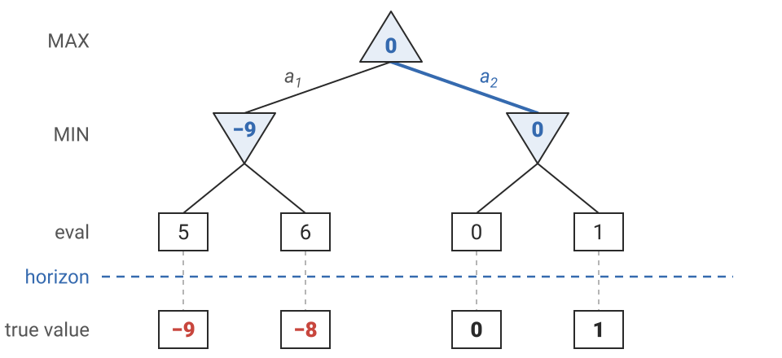]

Beyond the horizon, ${a\_1}$ loses: what it seemed to gain is paid back later (${-9}$). The search took a .bold[bad move] for a .bold[good move], because its consequences were hidden beyond the horizon.

---

class: middle

## Depth versus evaluation

An inaccurate $\text{eval}$ can be compensated by a .bold[deeper search]. The deeper the cutoff, the closer the evaluated states are to the end of the game: the search sees more consequences for itself, and the errors of $\text{eval}$ matter less. At the limit, the search reaches the terminal states and needs no evaluation at all.

The converse does not hold: a better $\text{eval}$ cannot compensate a .bold[shallow search]. What lies beyond the horizon can only be estimated, and a perfect evaluation, ${\text{eval}(s) = \text{minimax}(s)}$ everywhere, would require solving the game.

???

The horizon effect goes both ways: a good move, such as a sacrifice that pays off only later, may look bad.

It also delays losses: when a loss cannot be avoided, the search prefers moves that push it past the horizon, e.g. giving away pawns to postpone the loss of the queen.

Programs move the horizon where it matters: they search deeper on states that are not quiescent (quiescence search) and on forced moves (singular extensions).

---

class: middle, black-slide

.center[<video controls preload="auto" height="480" width="640">
  <source src="figures/lec3/depth2.mp4" type="video/mp4">
</video>]

.caption[Cutoff at depth 2, evaluation = the closer to the dot, the better.]

.footnote[Credits: [CS188](https://inst.eecs.berkeley.edu/~cs188/), UC Berkeley.]

???

```
cd demo/lec3
uv run python run.py --agentfile hminimax.py --pdepth 2 --nghosts 2 --slowmo on
uv run python run.py --agentfile hminimax.py --pdepth 10 --nghosts 2 --slowmo on
```

---

class: middle, black-slide

.center[<video controls preload="auto" height="480" width="640">
  <source src="figures/lec3/depth10.mp4" type="video/mp4">
</video>]

.caption[Cutoff at depth 10, evaluation = the closer to the dot, the better.]

.footnote[Credits: [CS188](https://inst.eecs.berkeley.edu/~cs188/), UC Berkeley.]

---

# Multi-agent games

For games that are not zero-sum, or have .bold[more than two players], minimax generalizes by backing up a .bold[vector] of utilities ${v(s) \in \mathbb{R}^N}$, one per player, where the player to move maximizes its own component:
$$v(s) = \begin{cases}
\left(\text{utility}(s, 1), \ldots, \text{utility}(s, N)\right) & \text{if } s \in T \\\\
v(\text{result}(s, a^\*)) & \text{otherwise,}
\end{cases}$$
where ${a^\* = \arg\max\_{a} v\_{\text{player}(s)}(\text{result}(s, a))}$.

In a two-player zero-sum game, ${v\_2(s) = c - v\_1(s)}$, and maximizing ${v\_2}$ is minimizing ${v\_1}$: this is minimax.

---

class: middle

## Cooperation and competition

.center.width-70[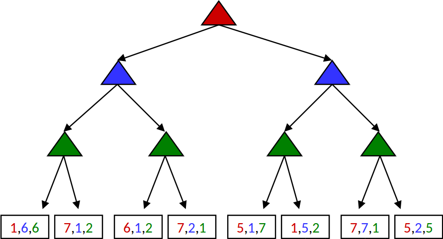]

Without a zero-sum constraint, the interests of the players are no longer opposed: they may .bold[cooperate] or .bold[compete], depending on the state.

.footnote[Credits: [CS188](https://inst.eecs.berkeley.edu/~cs188/), UC Berkeley.]

---

class: middle

# Stochastic games

---

# Stochastic games

In real life, unpredictable external events can put an agent into unforeseen situations. Games that mirror this unpredictability are called .bold[stochastic games]: they include a random element, such as explicit randomness (rolling dice) or actions that may fail (the wheels of a robot might slip).

<br>
.center.width-40[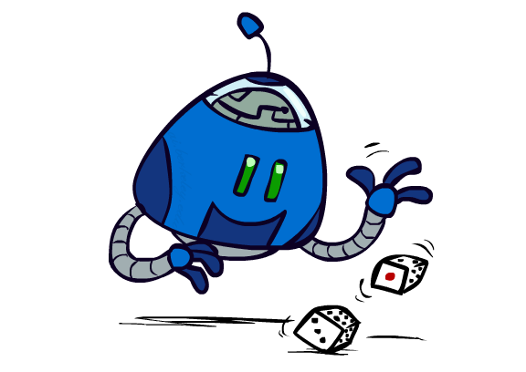]

.footnote[Credits: [CS188](https://inst.eecs.berkeley.edu/~cs188/), UC Berkeley.]

---

class: middle

In a game tree, the random element is .bold[modeled] with .bold[chance nodes]. A chance node stands for a state-action pair ${(s, a)}$, from which the next state ${s'}$ follows with .bold[probability] ${P(s' \mid s, a)}$.

This amounts to treating the environment as an extra .bold[random player], CHANCE, that moves after each of the other players.

.center.width-30[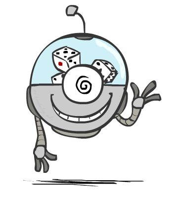]

.footnote[Credits: [CS188](https://inst.eecs.berkeley.edu/~cs188/), UC Berkeley.]

---

class: middle

## Stochastic game tree

.center.width-80[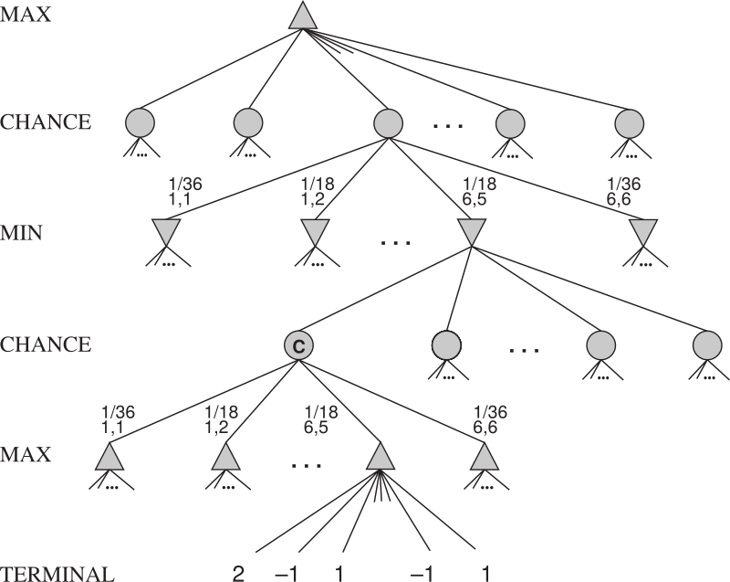]

???

- This tree corresponds to a game with two dices
- What is the best move? The best move cannot be determined anymore, because it depends on chance.

=> Assume the 2nd player is rational and plays optimally and that the 3rd player (corresponding to chance nodes) is random.

---

# Expectiminimax

Because of the uncertainty in the outcomes of actions, states no longer have a .bold[definite] $\text{minimax}$ value. We can however compute their .bold[expected] value under optimal play: the average over the outcomes of the chance nodes, where $\text{minimax}$ would instead assume the worst outcome.

Writing ${v(s) = \text{expectiminimax}(s)}$ for short,
$$v(s) = \begin{cases}
\text{utility}(s) & \text{if } s \in T \\\\
\max\limits\_a q(s, a) & \text{if MAX plays} \\\\
\min\limits\_a q(s, a) & \text{if MIN plays,}
\end{cases} \qquad q(s, a) = \sum\_{s'} P(s' \mid s, a) \, v(s'),$$
where ${q(s, a)}$ is the value of the chance node ${(s, a)}$. A deterministic action has ${P(\text{result}(s, a) \mid s, a) = 1}$.

.question[Does taking the rational move mean the agent will be successful?]

---

class: middle

## Evaluation functions

- As for $\text{minimax}(n)$, the value of $\text{expectiminimax}(n)$ may
be approximated by stopping the recursion early and using an evaluation function.
- However, to obtain correct move, the evaluation function should be a .bold[positive linear transformation] of the expected utility of the state.
    - It is not enough for the evaluation function to just be order-preserving.
- If we assume bounds on the utility function, $\alpha$-$\beta$ search can be adapted to stochastic games.

<br>
.center.width-70[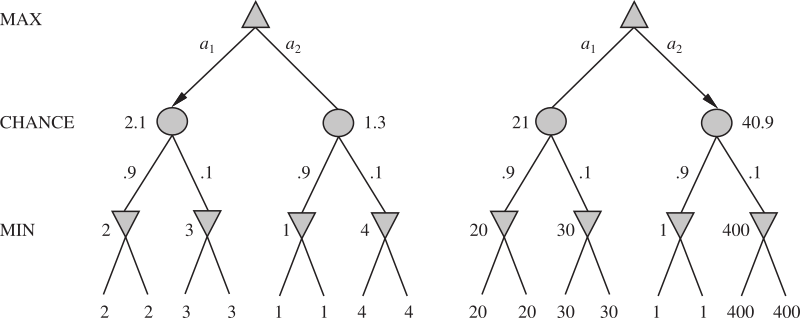]
.caption[An order-preserving transformation on leaf values changes the best move.]

---

class: middle

# Monte Carlo tree search

---

# Monte Carlo Tree Search

## Random playout evaluation

- To evaluate a state, have the algorithm play .bold[against itself] using .bold[random moves], thousands of times.
- The sequence of random moves is called a .bold[random playout].
- Use the proportion of wins as the state evaluation.
- This strategy does .bold[not require domain knowledge]!
    - The game engine is all that is needed.

???

Explain MCTS on the blackboard.

---

class: middle

## Monte Carlo Tree Search

The focus of MCTS is the analysis of the most promising moves, as incrementally evaluated with random playouts.

Each node $n$ in the current search tree maintains  two values:
- the number of wins $Q(n,p)$ of player $p$ for all playouts that passed through $n$;
- the number $N(n)$ of times $n$ has been visited.

---

class: middle

Each round of the search does four things: .bold[selection] down to a node that is not fully expanded, .bold[expansion] of one child, .bold[simulation] of a random playout from it, and .bold[backpropagation] of the result along the path back to the root.

.width-100[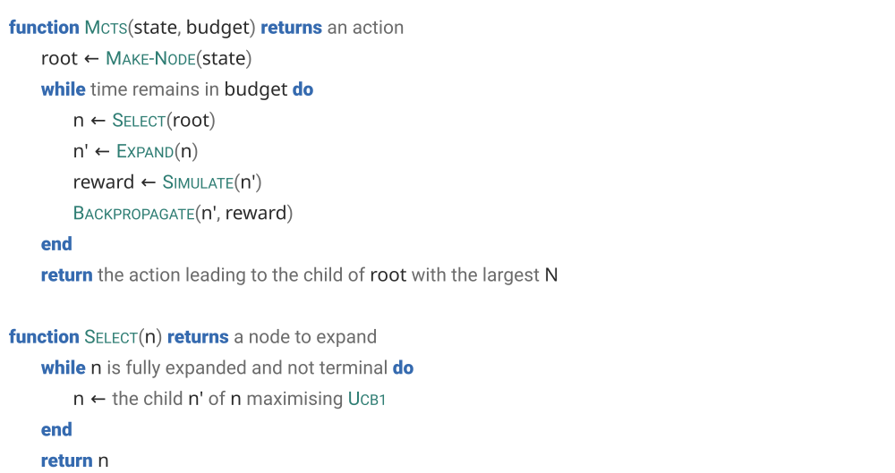]

Rounds are repeated for as long as the time budget allows. The move played is the one leading to the most visited child of the root.

---

class: middle

.center.width-100[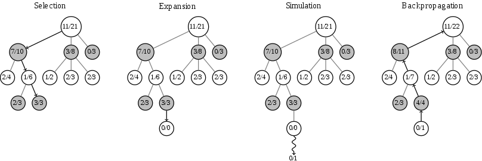]

???

This graph shows the steps involved in one decision, with each node showing the ratio of wins to total playouts from that point in the game tree for the player that node represents. In the Selection diagram, black is about to move. The root node shows there are 11 wins out of 21 playouts for white from this position so far. It complements the total of 10/21 black wins shown along the three black nodes under it, each of which represents a possible black move.

If white loses the simulation, all nodes along the selection incremented their simulation count (the denominator), but among them only the black nodes were credited with wins (the numerator). If instead white wins, all nodes along the selection would still increment their simulation count, but among them only the white nodes would be credited with wins. In games where draws are possible, a draw causes the numerator for both black and white to be incremented by 0.5 and the denominator by 1. This ensures that during selection, each player's choices expand towards the most promising moves for that player, which mirrors the goal of each player to maximize the value of their move.

Rounds of search are repeated as long as the time allotted to a move remains. Then the move with the most simulations made (i.e. the highest denominator) is chosen as the final answer.

---

class: middle

## Exploration and exploitation

Given a limited budget of random playouts, the efficiency of MCTS critically depends on the choice of the nodes made during the .bold[selection] step.

During the traversal of the branch in the selection step, the UCB1 policy picks the child node $n'$ of $n$ that maximizes
$$\frac{Q(n',p)}{N(n')} + c \sqrt{\frac{\log N(n)}{N(n')}}.$$
- The first term  encourages the .bold[exploitation] of higher-reward nodes.
- The second term encourages the .bold[exploration] of less-visited nodes.
- The constant $c>0$ controls the trade-off between exploitation and exploration.

---

class: middle

# Modeling assumptions

---

class: middle

.center[
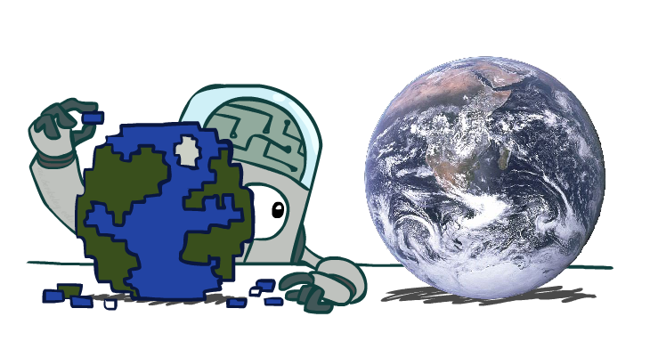

What if our assumptions are incorrect?]

.footnote[Credits: [CS188](https://inst.eecs.berkeley.edu/~cs188/), UC Berkeley.]

---

class: middle, black-slide

.grid[
.kol-2-3[

## Setup

- $P_1$: Pacman uses depth 4 search with an evaluation function that avoids trouble, while assuming that the ghost follows $P_2$.
- $P_2$: Ghost uses depth 2 search with an evaluation function that seeks Pacman, while assuming that Pacman follows $P_1$.
- $P_3$: Pacman uses depth 4 search with an evaluation function that avoids trouble, while assuming that the ghost follows $P_4$.
- $P_4$: Ghost makes random moves.
]
.kol-1-3[.width-100[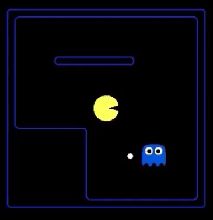]]
]

???

All four videos can be replayed live, from `demo/lec3`: P1 is
`--agentfile hminimax_ADV.py`, P3 is `--agentfile expectimax.py`, P2 is
`--ghostagent cheeky --gdepth 2` (a ghost that searches the tree itself) and
P4 is `--ghostagent rightrandy --p 0` (a ghost that moves uniformly at
random). The command of each is in the notes of its slide.

Beware: at `--pdepth 4` Pacman wins all four games, so the live runs show the
behaviour, not the outcome. To show mismodelling actually costing the game,
use `--pdepth 6 --layout small_adv`: P1 wins (505) and P3, facing the same
adversarial ghost, is eaten (-501).

---

class: middle, black-slide

.center[
<video controls preload="auto" height="400" width="300">
  <source src="figures/lec3/minimax-vs-adversarial.mp4" type="video/mp4">
</video>

Minimax Pacman ($P_1$) vs. Adversarial ghost ($P_2$)
]

.footnote[Credits: [CS188](https://inst.eecs.berkeley.edu/~cs188/), UC Berkeley.]

???

Assumptions are correct.

Pacman wins partly because of the larger depth it uses.

```
uv run python run.py --agentfile hminimax_ADV.py --pdepth 4 \
    --ghostagent cheeky --gdepth 2 --layout medium_adv
```

---

class: middle, black-slide

.center[
<video controls preload="auto" height="400" width="300">
  <source src="figures/lec3/minimax-vs-random.mp4" type="video/mp4">
</video>

Minimax Pacman ($P_1$) vs. Random ghost ($P_4$)
]

.footnote[Credits: [CS188](https://inst.eecs.berkeley.edu/~cs188/), UC Berkeley.]

???

Assumptions are incorrect. Has the ghost some masterplan?

```
uv run python run.py --agentfile hminimax_ADV.py --pdepth 4 \
    --ghostagent rightrandy --p 0 --layout medium_adv
```

---

class: middle, black-slide

.center[
<video controls preload="auto" height="400" width="300">
  <source src="figures/lec3/expectimax-vs-random.mp4" type="video/mp4">
</video>

Expectiminimax Pacman ($P_3$) vs. Random ghost ($P_4$)
]

.footnote[Credits: [CS188](https://inst.eecs.berkeley.edu/~cs188/), UC Berkeley.]

???

Assumptions are correct.

```
uv run python run.py --agentfile expectimax.py --pdepth 4 \
    --ghostagent rightrandy --p 0 --layout medium_adv
```

---

class: middle, black-slide

.center[
<video controls preload="auto" height="400" width="300">
  <source src="figures/lec3/expectimax-vs-adversarial.mp4" type="video/mp4">
</video>

Expectiminimax Pacman ($P_3$) vs. Adversarial ghost ($P_2$)
]

.footnote[Credits: [CS188](https://inst.eecs.berkeley.edu/~cs188/), UC Berkeley.]

???

Pacman is lucky!

```
uv run python run.py --agentfile expectimax.py --pdepth 4 \
    --ghostagent cheeky --gdepth 2 --layout medium_adv
```

---

class: middle

# State-of-the-art game programs

---

class: middle

## Perfect information

.grid[
.kol-2-3[
- .bold[1997], .bold[Deep Blue] defeats Garry Kasparov at chess: $2 \times 10^8$ positions per second, a sophisticated evaluation function, and search extended up to 40 plies on some lines.
- .bold[2007], .bold[checkers is solved]: $10^{14}$ calculations over 18 years prove that perfect play by both sides is a draw.
- .bold[2016], .bold[AlphaGo] beats Lee Sedol 4-1, then Ke Jie in 2017, by combining Monte Carlo tree search with deep learning trained on human and self-play games.

Chess and Go remain .bold[unsolved]: only their best play is now superhuman.
]
.kol-1-3[.center.width-100[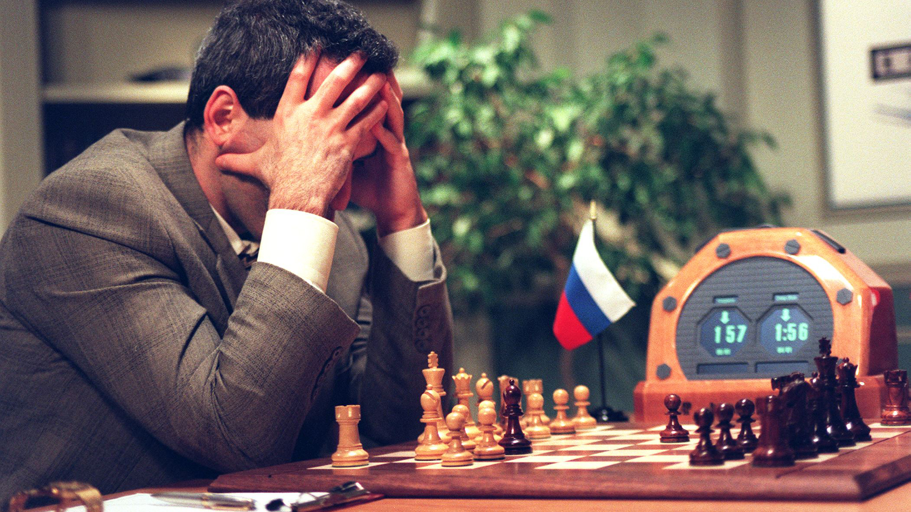]]
]

.footnote[Schaeffer et al., "Checkers is solved", Science, 2007; Silver et al., "Mastering the game of Go", Nature, 2016.]

???

A solved game is one whose outcome can be predicted from any position, assuming perfect play on both sides.

---

class: middle, black-slide, center

<iframe width="640" height="400" src="https://www.youtube.com/embed/m2QFSocFeOQ" frameborder="0" allowfullscreen></iframe>

.caption[Press coverage for the victory of AlphaGo against Lee Sedol.]

---

class: middle

## Learning to play, from less and less

- .bold[2017], .bold[AlphaGo Zero] reaches the same level from .bold[self-play only], with no human games.
- .bold[2018], .bold[AlphaZero] applies the same recipe to chess, shogi and Go, given only the rules.
- .bold[2020], .bold[MuZero] drops the rules too: it .bold[learns a model] of the game and plans with it, mastering Go, chess, shogi and Atari.

.center.width-55[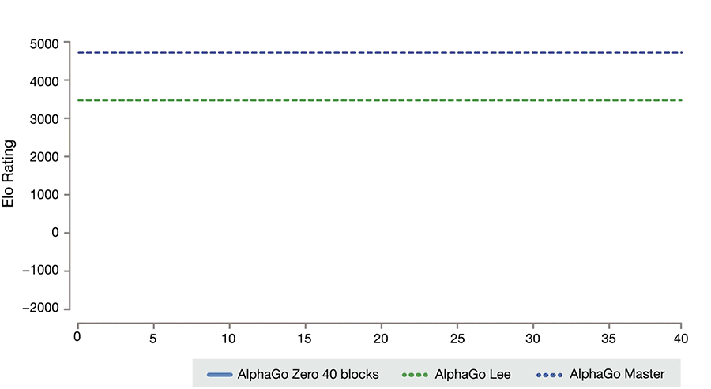]

.footnote[Credits: [AlphaGo Zero: Learning from scratch](https://deepmind.com/blog/alphago-zero-learning-scratch/); Schrittwieser et al., "Mastering Atari, Go, chess and shogi by planning with a learned model", Nature, 2020.]

---

class: middle

## Imperfect information

The assumption of .bold[perfect information] we made at the start is what these games drop:

- .bold[2017-2019], .bold[Libratus] then .bold[Pluribus] beat professionals at no-limit poker, the latter with .bold[six players] at the table, where no notion of optimal play against all opponents exists.
- .bold[2022], .bold[DeepNash] reaches expert level at .bold[Stratego], where each side hides its pieces.
- .bold[2022], .bold[Cicero] plays .bold[Diplomacy] at human level, combining planning with .bold[negotiation in natural language].

.question[What does an optimal strategy even mean when the opponents may cooperate, and lie?]

.footnote[Brown and Sandholm, Science, 2017 and 2019; Perolat et al., Science, 2022; Meta FAIR, Science, 2022.]

---

# Summary

- A .bold[game] adds ${\text{player}(s)}$, .bold[terminal states] ${T \subseteq \mathcal{S}}$ and a .bold[utility] ${\text{utility}(s, p)}$ to the search problem of lecture 2. Its solution is a .bold[strategy] ${\pi\_p : \mathcal{S} \to \mathcal{A}}$, not a sequence ${a\_{1:T}}$.

- .bold[Minimax] backs the utilities up the tree, ${\max\limits\_a}$ for MAX and ${\min\limits\_a}$ for MIN, in ${O(b^m)}$ time and ${O(bm)}$ space.

- ${\alpha}$-${\beta}$ .bold[pruning] returns the .bold[same move] while examining ${O(b^{m/2})}$ nodes at best: twice the depth in the same time.

- .bold[H-minimax] cuts the search at depth ${d}$ and replaces the utility by an .bold[evaluation function], at the price of the .bold[horizon effect].

- .bold[Expectiminimax] adds .bold[chance nodes], worth ${\sum\limits\_r P(r) \, v(\text{result}(s, r))}$, and .bold[Monte Carlo tree search] samples .bold[random playouts] instead of evaluating.

- Each is optimal only .bold[relative to a model] of the opponent. Assuming the .bold[wrong] one is not playing well.

---

class: end-slide, center
count: false

The end.