class: middle, center, title-slide

# Introduction to Artificial Intelligence

Lecture 4: Quantifying uncertainty

<br><br>
Prof. Gilles Louppe<br>
[g.louppe@uliege.be](mailto:g.louppe@uliege.be)

---

class: middle, center

.width-50[]

???

Motivate why this is important in AI (and this is not just one more probability theory class).

---

# Today

.grid[
.kol-1-2[

- Random variables
- Probability distributions
- Inference
- Independence
- The Bayes' rule

    
]
.kol-1-2[
.width-90[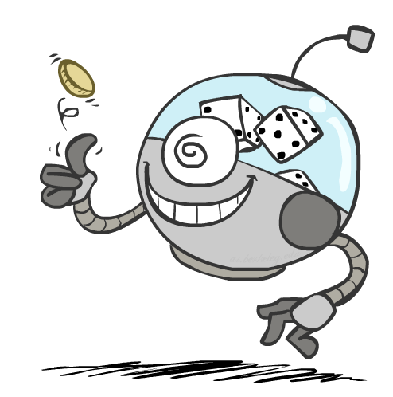]
]
]

.alert[Do not overlook this lecture!]

.footnote[Credits: [CS188](https://inst.eecs.berkeley.edu/~cs188/), UC Berkeley.]

---

class: middle

.center.width-30[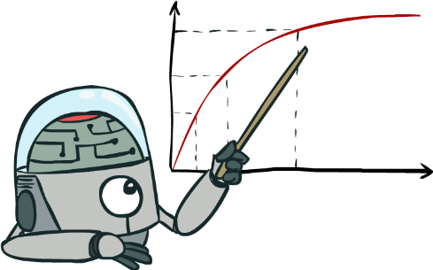]

## Principle of maximum expected utility

From Lecture 1, a rational agent chooses the action of .bold[highest expected utility], given what it has perceived,
$$a\_t = \arg\max\_{a \in \mathcal{A}} \mathbb{E}\left[V(s\_{1:T}) \mid e\_{1:t}, a\_t = a\right],$$
where ${V : \mathcal{S}^\* \to \mathbb{R}}$ scores the states $s\_{1:T}$, and the average is over the states the agent may reach, following ${P(s\_{t+1} \mid s\_t, a\_t)}$ and ${P(e\_t \mid s\_t)}$.

.question[What are these probabilities, and how do we reason with them?]

---

class: middle

# Quantifying uncertainty

---

class: middle

.grid[
.kol-1-2[
A ghost is .bold[hidden] in the grid somewhere.

Sensor readings tell how close a square is to the ghost:
- On the ghost: red
- 1 or 2 away: orange
- 3 away: yellow
- 4+ away green
]
.kol-1-2[.width-100[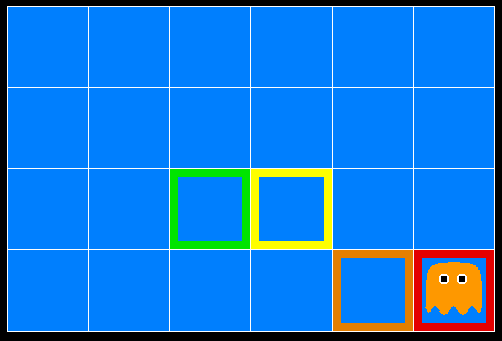]]
]
Sensors are .bold[noisy], but we know the probability values $P(\text{color} \mid \text{distance})$, for all colors and all distances.

.footnote[Credits: [CS188](https://inst.eecs.berkeley.edu/~cs188/), UC Berkeley.]

---

class: middle, black-slide

.center[
<video controls preload="auto" height="400" width="640">
  <source src="./figures/lec4/gb-noprob.mp4" type="video/mp4">
</video>]

.footnote[Credits: [CS188](https://inst.eecs.berkeley.edu/~cs188/), UC Berkeley.]

???

To play it live instead of showing the video:

```
cd demo/lec4
uv run python ghostbusters.py --cell 90
```

Click cells to read their sensors, ask the room where the ghost is, then press
`b` and click that cell. Keep the beliefs hidden here; `p` shows them, for the
second video.

---

# Uncertainty

General setup:
- .bold[Observed] variables or evidence: agent knows certain things about the state of the world (e.g., sensor readings).
- .bold[Unobserved] variables: agent needs to reason about other aspects that are uncertain (e.g., where the ghost is).
- (Probabilistic) .bold[model]: agent knows or believes something about how the observed variables relate to the unobserved variables.

.success[.bold[Probabilistic reasoning] provides a framework for managing our knowledge and beliefs.]

---

# Probabilistic assertions

A .bold[probabilistic assertion] attaches a number to a proposition,
$$P(\text{ghost in cell } [3,2]) = 0.02,$$
as a degree of belief, not as a claim about the truth of the proposition.

The agent holds beliefs rather than certainties for two reasons:
- .bold[ignorance]: it does not observe the state, and its models of the world are approximate;
- .bold[laziness]: listing every case and every exception would cost more than it is worth.

---

class: middle

## Frequentism vs. Bayesianism

What does a probability value represent? Take $P(\text{ghost in cell } [3,2]) = 0.02$.
- The objectivist, .bold[frequentist] view: a property of the world, the fraction of games in which the ghost sits in that cell.
- The subjectivist, .bold[Bayesian] view: the degree of belief of the agent that the ghost is in that cell, given the readings it has taken.

The agent plays a single game, with no long run to count, so we read probabilities as beliefs in this course: a new reading changes the number, not the ghost.

---

# Kolmogorov's axioms

Begin with a set $\Omega$, the .bold[sample space]. Its elements $\omega \in \Omega$ are the .bold[sample points], or possible worlds.

A .bold[probability space] is a sample space equipped with a probability function $P$ that assigns a number $P(\omega)$ to each sample point, such that
- $0 \leq P(\omega) \leq 1$ for all $\omega \in \Omega$;
- $\sum\_{\omega \in \Omega} P(\omega) = 1$.

???

We take $\Omega$ finite or countable, which is all we need here. Continuous sample spaces need $P$ to be defined on a family of events rather than on every subset, and densities instead of probabilities of points.


The axioms really do constrain the degrees of belief an agent can have concerning logically related propositions.

De Finetti's theorem implies that no rational agent can have beliefs that violate the axioms of probability. Put otherwise, rational beliefs must obey the axioms of probability.

$P$ can be universal (Frequentist), subjective (Bayesian). It is a choice we make. It can even be parameterized and then learned from data (Lecture 5 and 7).

---

class: middle

## Events

An .bold[event] is a set of sample points ${A \subseteq \Omega}$, and its probability is the mass it collects,
$$P(A) = \sum\_{\omega \in A} P(\omega).$$

Equivalently, in Kolmogorov's terms,
- ${P(A) \geq 0}$ for all events;
- ${P(\Omega) = 1}$;
- ${P(A \cup B) = P(A) + P(B)}$ for disjoint events.

It follows that
$$P(\neg a) = 1 - P(a), \qquad P(a \lor b) = P(a) + P(b) - P(a \land b).$$

???

Propositions are events: "the ghost is in cell [3,2]" is the set of the possible worlds in which it is there.

---

class: middle

## Example

- $\Omega$ = the 6 possible rolls of a die.
- $\omega\_i$ (for $i=1, ..., 6$) are the sample points, each corresponding to an outcome of the die.
- Assignment $P$ for a fair die:
$$P(1) = P(2) = P(3) = P(4) = P(5) = P(6) = \frac{1}{6}$$
- "3 or more" is the event ${A = \\{3, 4, 5, 6\\}}$, of probability
$$P(A) = P(3) + P(4) + P(5) + P(6) = \frac{2}{3},$$
hence $P(\neg A) = 1 - P(A) = \frac{1}{3}$ for "2 or less".

---

# Random variables

- A .bold[random variable] is a function ${X: \Omega \to D\_X}$ from the sample space to a domain $D\_X$ of outcomes.
- "$X=x$" is the event $\\{\omega \in \Omega : X(\omega) = x\\}$, so $P$ induces a .bold[probability distribution] over $X$, $$P(X=x) = \sum\_{\\{\omega: X(\omega)=x\\}} P(\omega).$$
- The events we care about are the .bold[assignments] of random variables, such as ${X\_1 = x\_1, \ldots, X\_n = x\_n}$.

???

In practice, we will use random variables to represent aspects of the world about which we (may) have uncertainty.
- $R$: Is it raining?
- $T$: Is it hot or cold?
- $L$: Where is the ghost?

---

class: middle

## Example

On the die, "odd" is the random variable
$$\text{Odd}: \Omega \to \\{ \text{true}, \text{false} \\}, \qquad \text{Odd}(\omega) = (\omega \bmod 2 = 1),$$
whose distribution is
$$P(\text{Odd}=\text{true}) = P(1)+P(3)+P(5) = \frac{1}{2}, \qquad P(\text{Odd}=\text{false}) = \frac{1}{2}.$$

---

class: middle

## Notations

- Random variables are named in upper case, $X$, $Y$, $\text{Weather}$; their values in lower case, $x$, $y$, $\text{sun}$.
- $D\_X$ is the domain of $X$, so that $x \in D\_X$ is one of its values.
- $P(X=x)$ is a .bold[number], abbreviated $P(x)$ when clear from context.
- $\mathbf{P}(X)$ is the .bold[distribution] of $X$, i.e. the table of the numbers $P(X=x)$ for all ${x \in D\_X}$, and not a single value.

---

class: middle

# Probability distributions

---

class: middle

## Probability mass function

For a discrete variable $X$, the probability distribution $\mathbf{P}(X)$ is the list of the values $P(X=x)$ for all ${x \in D\_X}$, known as the .bold[probability mass function].

<br>

.grid[
.center.kol-1-2[
$\mathbf{P}(W)$

| $W$ | $P$ |
| --- | --- |
| $\text{sun}$ | $0.6$ |
| $\text{rain}$ | $0.1$ |
| $\text{fog}$ | $0.3$ |
| $\text{meteor}$ | $0.0$ |

]
.kol-1-2[.width-100[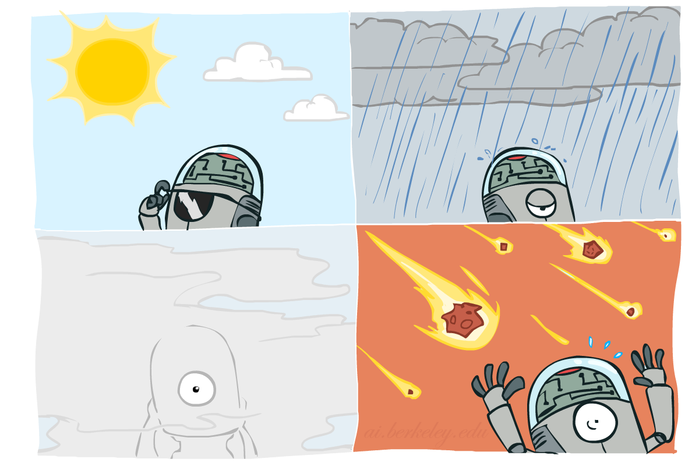]]
]

.footnote[Credits: [CS188](https://inst.eecs.berkeley.edu/~cs188/), UC Berkeley.]

???

- This table can be infinite!
- By construction, probability values are .bold[normalized] (i.e., sum to $1$).

---

class: middle

## Joint distributions

 A .bold[joint] probability distribution over a set of random variables $X_1, ..., X_n$ specifies
the probability of each (combined) outcome:

$$P(X\_1=x\_1, ..., X\_n=x\_n) = \sum\_{\\{\omega: X\_1(\omega)=x\_1, ..., X\_n(\omega)=x\_n\\}} P(\omega)$$

<br>

.center[$\mathbf{P}(T,W)$]

| $T$ | $W$ | $P$ |
| --- | --- | --- |
| $\text{hot}$ | $\text{sun}$ | $0.4$ |
| $\text{hot}$ | $\text{rain}$ | $0.1$ |
| $\text{cold}$ | $\text{sun}$ | $0.2$ |
| $\text{cold}$ | $\text{rain}$ | $0.3$ |

Over $n$ boolean variables, the table has $2^n$ entries, hence $2^n - 1$ free numbers.

???

From a joint distribution, the probability of any event can be calculated.
- Probability that it is hot and sunny?
- Probability that it is hot?
- Probability that it is hot or sunny?

Interesting events often correspond to .bold[partial assignments], e.g. $P(\text{hot})$.

---

class: middle

## Marginal distributions

The .bold[marginal distribution] of a subset of random variables is obtained by summing the joint distribution over the values of the other variables (the .bold[sum rule]),
$$P(x) = \sum\_y P(x, y), \qquad \mathbf{P}(X) = \sum\_y \mathbf{P}(X, Y=y).$$

.center.grid[
.kol-1-3[
$\mathbf{P}(T,W)$

| $T$ | $W$ | $P$ |
| --- | --- | --- |
| $\text{hot}$ | $\text{sun}$ | $0.4$ |
| $\text{hot}$ | $\text{rain}$ | $0.1$ |
| $\text{cold}$ | $\text{sun}$ | $0.2$ |
| $\text{cold}$ | $\text{rain}$ | $0.3$ |
]
.kol-1-3[
$\mathbf{P}(T)$

| $T$ | $P$ |
| --- | --- |
| $\text{hot}$ | $0.5$ |
| $\text{cold}$ | $0.5$ |

$P(t) = \sum_w P(t, w)$
]
.kol-1-3[
$\mathbf{P}(W)$

| $W$ | $P$ |
| --- | --- |
| $\text{sun}$ | $0.6$ |
| $\text{rain}$ | $0.4$ |

$P(w) = \sum_t P(t, w)$
]
]

Intuitively, marginal distributions are sub-tables which eliminate variables.

---

class: middle

## Conditional distributions

The .bold[conditional probability] of $a$ given $b$, for $P(b) > 0$, is the ratio of the probability of $a$ and $b$ to the probability of $b$,
$$P(a \mid b) = \frac{P(a,b)}{P(b)}.$$

Indeed, observing $B=b$ rules out all those possible
worlds where $B \neq b$, leaving a set whose total probability is just $P(b)$. Within that set, the worlds for which $A=a$ satisfy $A=a \wedge B=b$ and constitute a fraction $P(a,b)/ P(b)$.

.center.width-35[]

---

class: middle

Conditional distributions are probability distributions over some variables, given .bold[fixed] values for others. Writing $\mathbf{P}(X \mid Y)$ denotes them all at once: one distribution ${\mathbf{P}(X \mid Y=y)}$ for each value $y$ of $Y$.
.center.grid[
.kol-1-3[
$\mathbf{P}(T,W)$

| $T$ | $W$ | $P$ |
| --- | --- | --- |
| $\text{hot}$ | $\text{sun}$ | $0.4$ |
| $\text{hot}$ | $\text{rain}$ | $0.1$ |
| $\text{cold}$ | $\text{sun}$ | $0.2$ |
| $\text{cold}$ | $\text{rain}$ | $0.3$ |
]
.kol-1-3[
$\mathbf{P}(W \mid T=\text{hot})$

| $W$ | $P$ |
| --- | --- |
| $\text{sun}$ | $0.8$ |
| $\text{rain}$ | $0.2$ |
]
.kol-1-3[
$\mathbf{P}(W \mid T=\text{cold})$

| $W$ | $P$ |
| --- | --- |
| $\text{sun}$ | $0.4$ |
| $\text{rain}$ | $0.6$ |
]
]

---

class: middle

## Product rule

Rearranging the definition of the conditional probability,
$$P(a, b) = P(a \mid b)P(b), \qquad \mathbf{P}(A, B) = \mathbf{P}(A \mid B)\mathbf{P}(B),$$
the second form standing for one equation per value of $A$ and $B$.

Summing it over the values of $B$ gives the .bold[law of total probability],
$$P(a) = \sum\_b P(a \mid b) P(b).$$

???

The law of total probability is how the normalization constant $Z$ of the previous slides is computed: the probability of the evidence is the sum of the ways it can happen.

---

class: middle

## Example

.center.grid[
.kol-1-3[
$\mathbf{P}(W)$

| $W$ | $P$ |
| --- | --- |
| $\text{sun}$ | $0.8$ |
| $\text{rain}$ | $0.2$ |
]
.kol-1-3[
$\mathbf{P}(D \mid W)$

| $D$ | $W$ | $P$ |
| --- | --- | --- |
| $\text{wet}$ | $\text{sun}$ | $0.1$ |
| $\text{dry}$ | $\text{sun}$ | $0.9$ |
| $\text{wet}$ | $\text{rain}$ | $0.7$ |
| $\text{dry}$ | $\text{rain}$ | $0.3$ |

]
.kol-1-3[
$\mathbf{P}(D,W)$

| $D$ | $W$ | $P$ |
| --- | --- | --- |
| $\text{wet}$ | $\text{sun}$ | ? |
| $\text{dry}$ | $\text{sun}$ | ? |
| $\text{wet}$ | $\text{rain}$ | ? |
| $\text{dry}$ | $\text{rain}$ | ? |

]
]

---

class: middle

## Chain rule

More generally, any joint distribution can always be written as an incremental product of conditional distributions:

$$
\begin{aligned}
P(x\_1,x\_2,x\_3) &= P(x\_1)P(x\_2 \mid x\_1)P(x\_3 \mid x\_1,x\_2) \\\\
P(x\_1,...,x\_n) &= \prod\_{i=1}^n P(x\_i \mid x\_1, ..., x\_{i-1})
\end{aligned}
$$

In the same way, $\mathbf{P}(X\_1, ..., X\_n) = \prod\_{i=1}^n \mathbf{P}(X\_i \mid X\_1, ..., X\_{i-1})$.

---

class: middle

## Normalization trick

.center.grid[
.kol-1-3[
$\mathbf{P}(T,W)$

| $T$ | $W$ | $P$ |
| --- | --- | --- |
| $\text{hot}$ | $\text{sun}$ | $0.4$ |
| $\text{hot}$ | $\text{rain}$ | $0.1$ |
| $\text{cold}$ | $\text{sun}$ | $0.2$ |
| $\text{cold}$ | $\text{rain}$ | $0.3$ |
]
.kol-1-3[
$\rightarrow \mathbf{P}(T=\text{cold},W)$

| $T$ | $W$ | $P$ |
| --- | --- | --- |
| $\text{cold}$ | $\text{sun}$ | $0.2$ |
| $\text{cold}$ | $\text{rain}$ | $0.3$ |

.bold[Select] the joint probabilities matching the evidence $T=\text{cold}$.

]
.kol-1-3[
$\rightarrow \mathbf{P}(W \mid T=\text{cold})$

| $W$ | $P$ |
| --- | --- |
| $\text{sun}$ | $0.4$ |
| $\text{rain}$ | $0.6$ |

.bold[Normalize] the selection (make it sum to $1$).

]
]

---

class: middle

# Inference

---

class: middle

What an agent asks, given what it has observed:
$$\begin{aligned}
P(\text{on time} \mid \text{no reported accidents}) &= 0.9 \\\\
P(\text{on time} \mid \text{no reported accidents}, \text{5AM}) &= 0.95 \\\\
P(\text{on time} \mid \text{no reported accidents}, \text{rain}) &= 0.8 \\\\
P(\text{ghost in } [3,2] \mid \text{red in } [3,2]) &= 0.99
\end{aligned}$$

???

The same query with different evidence gives different answers: the evidence moves the belief, and the last line is the Ghostbusters demo.

The next slide states the problem in general.

---

class: middle

## Probabilistic inference

- .bold[Evidence] variables ${\mathbf{E} = \\{E\_1, ..., E\_k\\}}$, observed as ${\mathbf{e} = (e\_1, ..., e\_k)}$.
- .bold[Query] variable $Q$.
- .bold[Hidden] variables ${\mathbf{H} = \\{H\_1, ..., H\_r\\}}$.
- Together, they are all the variables of the model, ${\\{Q\\} \cup \mathbf{E} \cup \mathbf{H} = \\{X\_1, ..., X\_n\\}}$.

Inference is the problem of computing the posterior distribution $\mathbf{P}(Q \mid \mathbf{e})$.

---

# Inference by enumeration

Starting from the joint distribution $\mathbf{P}(Q, \mathbf{E}, \mathbf{H})$, select the entries consistent with the evidence, sum the hidden variables out, and normalize:
$$\mathbf{P}(Q \mid \mathbf{e}) = \frac{1}{Z} \sum\_{\mathbf{h}} \mathbf{P}(Q, \mathbf{h}, \mathbf{e}), \qquad Z = \sum\_q \sum\_{\mathbf{h}} P(q, \mathbf{h}, \mathbf{e}).$$

.center.width-100[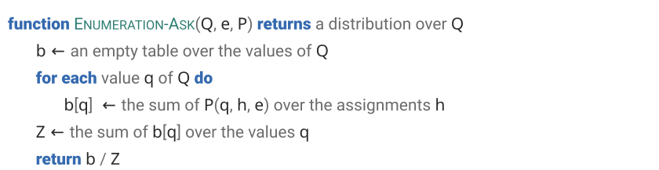]

---

class: middle

## Example

.grid[
.kol-1-2[

- $\mathbf{P}(W)$?
- $\mathbf{P}(W \mid \text{winter})$?
- $\mathbf{P}(W \mid \text{winter},\text{hot})$?

]
.center.kol-1-2[

| $S$ | $T$ | $W$ | $P$ |
| --- | --- | --- | --- |
| $\text{summer}$ | $\text{hot}$ | $\text{sun}$ | $0.3$ |
| $\text{summer}$ | $\text{hot}$ | $\text{rain}$ | $0.05$ |
| $\text{summer}$ | $\text{cold}$ | $\text{sun}$ | $0.1$ |
| $\text{summer}$ | $\text{cold}$ | $\text{rain}$ | $0.05$ |
| $\text{winter}$ | $\text{hot}$ | $\text{sun}$ | $0.1$ |
| $\text{winter}$ | $\text{hot}$ | $\text{rain}$ | $0.05$ |
| $\text{winter}$ | $\text{cold}$ | $\text{sun}$ | $0.15$ |
| $\text{winter}$ | $\text{cold}$ | $\text{rain}$ | $0.2$ |

]
]

---

class: middle

## Complexity

- Inference by enumeration can be used to answer probabilistic queries for .bold[discrete variables] (i.e., with a finite number of values).
- However, enumeration .bold[does not scale]!
    - Assume a domain described by $n$ variables taking at most $d$ values.
    - Space complexity: $O(d^n)$
    - Time complexity: $O(d^n)$

.question[Can we reduce the size of the representation of the joint distribution?]

---

class: middle

# Independence

---

# Independence

$A$ and $B$ are .bold[independent], denoted ${A \perp B}$, iff
$$P(a,b) = P(a)P(b) \quad \text{for all } a \in D\_A, b \in D\_B.$$

Equivalently, knowing one says nothing about the other: $P(a \mid b) = P(a)$ whenever ${P(b) > 0}$, and $P(b \mid a) = P(b)$ whenever ${P(a) > 0}$.

???

... from the third expression, one can already notice that assuming independences leads to a factorization in which the factors are smaller.

---

class: middle

## Example 1

.center[
.width-40[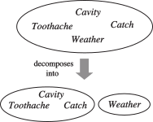]
.width-45[]
]

$$
\begin{aligned}
&P(\text{toothache}, \text{catch}, \text{cavity}, \text{weather}) \\\\
&= P(\text{toothache}, \text{catch}, \text{cavity}) P(\text{weather})
\end{aligned}$$

The original 32-entry table reduces to one 8-entry and one 4-entry table (assuming 4 values for $\text{Weather}$ and boolean values otherwise).

.footnote[Credits: [CS188](https://inst.eecs.berkeley.edu/~cs188/), UC Berkeley.]

---

class: middle

## Example 2

For $n$ independent coin flips, the joint distribution can be fully .bold[factored] and represented as the product of $n$ 1-entry tables.
- .bold[$2^n \to n$]

---

# Conditional independence

$A$ and $B$ are .bold[conditionally independent] given $C$, denoted ${A \perp B \mid C}$, iff
$$P(a,b \mid c) = P(a \mid c)P(b \mid c) \quad \text{for all } a \in D\_A, b \in D\_B, c \in D\_C \text{ with } P(c) > 0.$$

Equivalently, once $c$ is known, one says nothing more about the other: ${P(a \mid b,c) = P(a \mid c)}$ and ${P(b \mid a,c) = P(b \mid c)}$, whenever these are defined.

---

class: middle

- Using the chain rule, the join distribution can be factored as a product of conditional distributions.
- Each conditional distribution may potentially be .bold[simplified by conditional independence].
- Conditional independence assertions allow probabilistic models to .bold[scale up].

---

class: middle

.center.width-35[]

## Example 1

Assume three random variables $\text{Toothache}$, $\text{Catch}$ and $\text{Cavity}$.

$\text{Catch}$ is conditionally independent of $\text{Toothache}$, given $\text{Cavity}$.
Therefore, we can write:

$$
\begin{aligned}
&P(\text{toothache}, \text{catch}, \text{cavity}) \\\\
&= P(\text{toothache} \mid \text{catch}, \text{cavity}) P(\text{catch} \mid \text{cavity}) P(\text{cavity}) \\\\
&= P(\text{toothache} \mid \text{cavity}) P(\text{catch} \mid \text{cavity}) P(\text{cavity})
\end{aligned}
$$

In this case, the representation of the joint distribution reduces to $2+2+1$ independent numbers (instead of $2^n-1$).

.footnote[Credits: [CS188](https://inst.eecs.berkeley.edu/~cs188/), UC Berkeley.]

---

class: middle

## Example 2 (Naive Bayes)

More generally, from the product rule, we have
$$P(\text{cause},\text{effect}_1, ..., \text{effect}_n) = P(\text{effect}_1, ..., \text{effect}_n \mid \text{cause}) P(\text{cause})$$

Assuming the effects are .bold[conditionally independent given the cause], it comes:
$$P(\text{cause},\text{effect}_1, ..., \text{effect}_n) = P(\text{cause}) \prod_i P(\text{effect}_i \mid \text{cause}) $$

This probabilistic model is called a .bold[naive Bayes] model.
- The complexity of this model is $O(n)$ instead of $O(2^n)$ without the conditional independence assumptions.
- Naive Bayes can work surprisingly well in practice, even when the assumptions are wrong.

???

This is an important model you should know about!

---

class: middle

# The Bayes' rule

---

class: middle, center, red-slide
count: false

Study the next slide. .bold[Twice].

---

# The Bayes' rule

.grid[
.kol-2-3[

The product rule defines two ways to factor the joint distribution of two random variables.
    $$P(a,b) = P(a \mid b)P(b) = P(b \mid a)P(a)$$
Therefore,
$$P(a \mid b) = \frac{P(b \mid a)P(a)}{P(b)}.$$
]
.kol-1-3[
.circle.width-100[]
]
]

- $P(a)$ is the prior belief on $a$.
- $P(b)$ is the probability of the evidence $b$.
- $P(a \mid b)$ is the posterior belief on $a$, given the evidence $b$.
- $P(b \mid a)$ is the conditional probability of $b$ given $a$. Depending on the context, this term is called the likelihood.

???

Do it on the blackboard.

---

class: middle, center

.grid[
.kol-1-2[

<br><br><br>

$$P(a \mid b) = \frac{P(b \mid a)P(a)}{P(b)}$$

]
.kol-1-2[.center.width-80[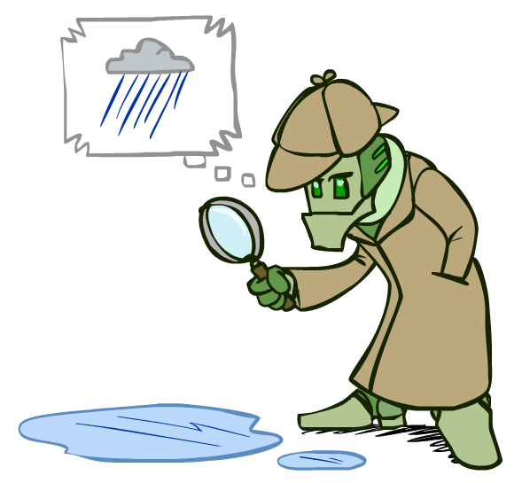]]
]

<br>

The Bayes' rule is the .bold[foundation] of many AI systems. 

???

Bayes rule/inference: emphasize that is like Sherlock Holmes:
- Start from a set of possibilities (prior)
- Discard/weigh down those not compatible with the observations/evidence.

The Bayes' rule gives us a way to operationalize the update of our beliefs.

---

class: middle

## Example 1: diagnostic probability from causal probability.

$$P(\text{cause} \mid \text{effect}) = \frac{P(\text{effect} \mid \text{cause})P(\text{cause})}{P(\text{effect})}$$
where
- $P(\text{effect} \mid \text{cause})$ quantifies the relationship in the .bold[causal] direction.
- $P(\text{cause} \mid \text{effect})$ describes the .bold[diagnostic] direction.

Let $S$=stiff neck and $M$=meningitis.
Given $P(s \mid m) = 0.7$, $P(m) = 1/50000$, $P(s) = 0.01,$
it comes
$$P(m \mid s) = \frac{P(s \mid m)P(m)}{P(s)} = \frac{0.7 \times 1/50000}{0.01} = 0.0014.$$

???

... or $M$=covid-19!

---

class: middle

## Example 2: Ghostbusters, revisited

- A random variable $G$ gives the ghost location, and a random variable $R\_{i,j}$ the color read at the cell $[i,j]$.
- We start from a uniform .bold[prior] $\mathbf{P}(G)$ over the locations.
- We know the sensors, i.e. the .bold[sensor model] $\mathbf{P}(R\_{i,j} \mid G)$.
    - e.g., $P(R\_{1,1}=\text{yellow} \mid G=[1,1])=0.1$.
- Readings are conditionally independent given the ghost location, ${R\_{i,j} \perp R\_{i',j'} \mid G}$.

???

This is a Naive Bayes model!

---

class: middle

Once the reading $r\_1$ is observed, Bayes' rule gives the .bold[posterior] over the locations,
$$\mathbf{P}(G \mid r\_1) = \frac{\mathbf{P}(r\_1 \mid G)\mathbf{P}(G)}{P(r\_1)} = \frac{1}{Z} \mathbf{P}(r\_1 \mid G)\mathbf{P}(G).$$

Each new reading updates the posterior of the previous ones, which acts as its prior,
$$\mathbf{P}(G \mid r\_{1:k+1}) = \frac{1}{Z} \mathbf{P}(r\_{k+1} \mid G) \mathbf{P}(G \mid r\_{1:k}),$$
since the readings are conditionally independent given $G$.

???

This is the shape of .bold[filtering] in Lecture 6, and of the Bayes filter of Project 1: a prior on the hidden state, a sensor model, and one multiplication and one normalization per observation.

Here the ghost does not move. When it does, a transition model is applied between two readings.

---

class: middle, black-slide

.center[
<video controls preload="auto" height="400" width="640">
  <source src="./figures/lec4/gb-prob.mp4" type="video/mp4">
</video>]

.footnote[Credits: [CS188](https://inst.eecs.berkeley.edu/~cs188/), UC Berkeley.]

???

Same game, live: press `p` in `demo/lec4/ghostbusters.py` to show the beliefs,
or start it with `--beliefs`. Two or three readings are now enough.

What if we had chosen a different prior?

---

exclude: true
class: middle

## Example 3: AI for Science

.center.width-100[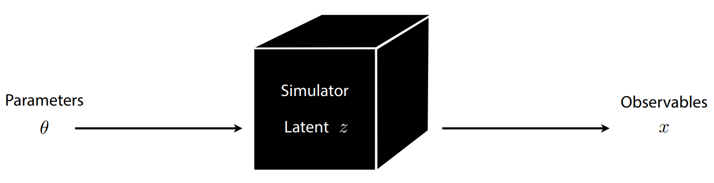]


Given some observation $x$ and prior beliefs $p(\theta)$, science is about updating one's knowledge, which may be framed as computing
$$p(\theta \mid x) = \frac{p(x \mid \theta)p(\theta)}{p(x)}.$$


---

exclude: true
class: middle, black-slide

## Exoplanet atmosphere characterization

.center.width-95[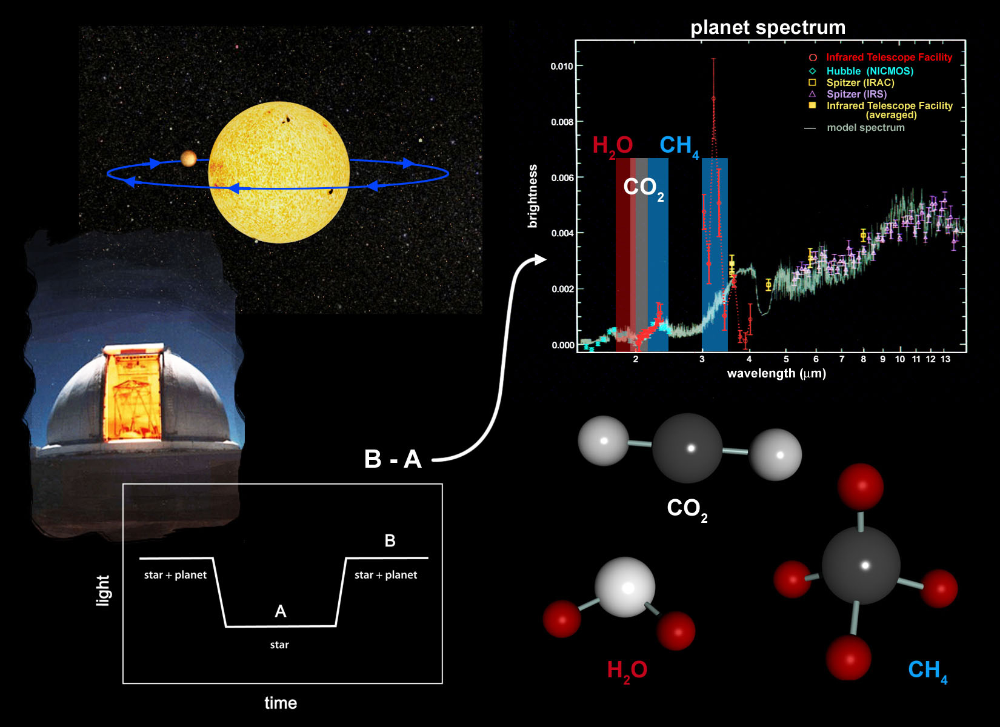]

.footnote[Credits: [NSA/JPL-Caltech](https://www.nasa.gov/topics/universe/features/exoplanet20100203-b.html), 2010.]

---

exclude: true
class: middle

.avatars[]

.center[
.width-25[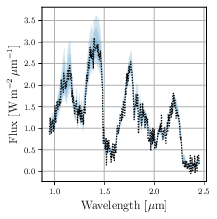]
.width-70[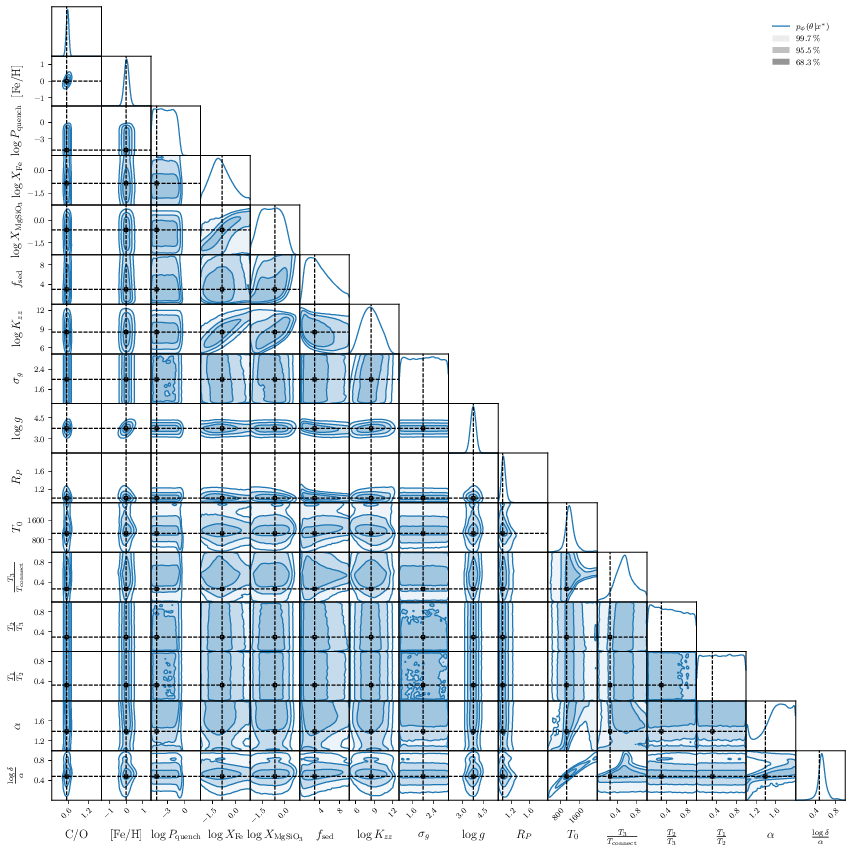]
]

.footnote[Credits: [Vasist et al](https://arxiv.org/abs/2301.06575), 2023.]

---

class: middle

## All the rules

.grid[
.kol-1-2[
.bold[Sum rule]
$$P(x) = \sum\_y P(x, y)$$

.bold[Product rule]
$$P(x, y) = P(x \mid y) P(y)$$

.bold[Chain rule]
$$P(x\_1, ..., x\_n) = \prod\_{i=1}^n P(x\_i \mid x\_{1:i-1})$$

.bold[Total probability]
$$P(x) = \sum\_y P(x \mid y) P(y)$$
]
.kol-1-2[
.bold[Bayes' rule]
$$P(x \mid y) = \frac{P(y \mid x)P(x)}{P(y)}$$

.bold[Normalization]
$$\mathbf{P}(Q \mid \mathbf{e}) = \frac{1}{Z} \mathbf{P}(Q, \mathbf{e})$$

.bold[Independence]
$$X \perp Y \Leftrightarrow P(x, y) = P(x)P(y)$$
]
]

???

Each holds for all the values of the variables involved, and each has a bold counterpart over whole distributions.

Conditional independence, ${X \perp Y \mid Z}$, is the same as independence with everything conditioned on $z$.

---

# Summary

- Uncertainty is .bold[inescapable] in complex, non-deterministic or partially observable environments. Probabilities summarize what ignorance and laziness leave undecided, and measure the agent's .bold[beliefs] rather than the world.
- A joint distribution $\mathbf{P}(X\_1, ..., X\_n)$ answers .bold[every] query: select the entries consistent with the evidence $\mathbf{e}$, marginalize the hidden variables out, normalize. This is .bold[inference by enumeration], and it costs $O(d^n)$.
- .bold[Independence] and .bold[conditional independence] factor the joint into smaller tables, which is what makes probabilistic models scale. Naive Bayes is the extreme case, $O(2^n)$ down to $O(n)$.
- .bold[Bayes' rule] ${P(a \mid b) = P(b \mid a)P(a) / P(b)}$ turns a model of the effects given the cause into a belief about the cause given the effects, and the posterior of one observation is the prior of the next.
- These beliefs are what a rational agent acts on: lecture 5 makes the computation scale, lecture 6 lets the world change with time, and lectures 8 and 9 turn posteriors into decisions.

???

Lecture 5 builds the factorization into a data structure, the Bayesian network. The expectation of the maximum expected utility principle waits for lecture 8, where it is actually computed.

---

class: end-slide, center
count: false

The end.
