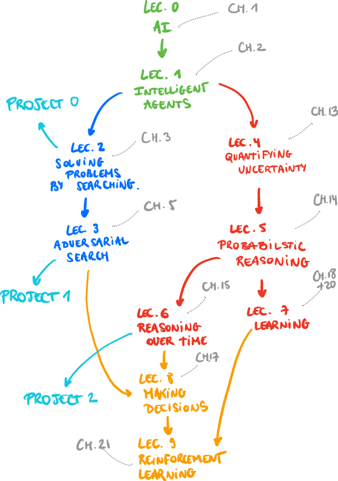

class: middle, center, title-slide

# Introduction to Artificial Intelligence

Lecture 4: Quantifying uncertainty

  
Prof. Gilles Louppe 
[g.louppe@uliege.be](mailto:g.louppe@uliege.be)

---

class: middle, center

.width-50[]

???

Motivate why this is important in AI (and this is not just one more probability theory class).

---

# Today

.grid[
.kol-1-2[

- Random variables
- Probability distributions
- Inference
- Independence
- The Bayes' rule

    
]
.kol-1-2[
.width-90[]
]
]

.alert[Do not overlook this lecture!]

.footnote[Image credits: [CS188](https://inst.eecs.berkeley.edu/~cs188/), UC Berkeley.]

---

class: middle

# Quantifying uncertainty

---

class: middle

.grid[
.kol-1-2[
A ghost is *hidden* in the grid somewhere.

Sensor readings tell how close a square is to the ghost:
- On the ghost: red
- 1 or 2 away: orange
- 3 away: yellow
- 4+ away green
]
.kol-1-2[.width-100[]]
]
Sensors are **noisy**, but we know the probability values $P(\text{color}|\text{distance})$, for all colors and all distances.

.footnote[Image credits: [CS188](https://inst.eecs.berkeley.edu/~cs188/), UC Berkeley.]

---

class: middle, black-slide

.center[
<video controls preload="auto" height="400" width="640">
  <source src="./figures/lec4/gb-noprob.mp4" type="video/mp4">
</video>]

.footnote[Image credits: [CS188](https://inst.eecs.berkeley.edu/~cs188/), UC Berkeley.]

---

class: middle

.center.width-50[]

## Principle of maximum expected utility

An agent is rational if it chooses the action that yields the **highest expected utility**, averaged over all the possible outcomes of the action.

.question[What does "expected" mean exactly?]

---

# Uncertainty

General setup:
- *Observed* variables or evidence: agent knows certain things about the state of the world (e.g., sensor readings).
- **Unobserved** variables: agent needs to reason about other aspects that are uncertain (e.g., where the ghost is).
- (Probabilistic) *model*: agent knows or believes something about how the observed variables relate to the unobserved variables.

**Probabilistic reasoning** provides a framework for managing our knowledge and beliefs.

---

# Probabilistic assertions

Probabilistic assertions express the agent's inability to reach a definite decision regarding the truth of a proposition.
- Probability values **summarize** effects of
    - *ignorance* (theoretical, practical)
    - *laziness* (lack of time, resources)
- Probabilities relate propositions to one's own state of knowledge (or lack thereof).
    - e.g., $P(\text{ghost in cell } [3,2]) = 0.02$

---

class: middle

## Frequentism vs. Bayesianism

What do probability values represent?
- The objectivist *frequentist* view is that probabilities are real aspects of the universe.
    - i.e., propensities of objects to behave in certain ways.
    - e.g., the fact that a fair coin comes up heads with probability $0.5$ is a propensity of the coin itself.
- The subjectivist **Bayesian** view is that probabilities are a way of characterizing an agent's beliefs or uncertainty.
    - i.e., probabilities do not have external physical significance.
    - This is the interpretation of probabilities that we will use!

.question[How shall we assign numerical values to beliefs?]

---

# Kolmogorov's axioms

Begin with a set $\Omega$, the **sample space**.

$\omega \in \Omega$ is a *sample point* or possible world.

A **probability space** is a sample space equipped with a probability function, i.e. an assignment $P : \mathcal{P}(\Omega) \to \mathbb{R}$ such that:
- 1st axiom: $P(\omega) \in \mathbb{R}$, $0 \leq P(\omega)$ for all $\omega \in \Omega$
- 2nd axiom: $P(\Omega) = 1$
- 3rd axiom: $P(\\{ \omega\_1, ..., \omega\_n \\}) = \sum\_{i=1}^n P(\omega\_i)$ for any set of samples

where $\mathcal{P}(\Omega)$ the power set of $\Omega$.

???

The axioms really do constrain the degrees of belief an agent can have concerning logically related propositions.

De Finetti's theorem implies that no rational agent can have beliefs that violate the axioms of probability. Put otherwise, rational beliefs must obey the axioms of probability.

$P$ can be universal (Frequentist), subjective (Bayesian). It is a choice we make. It can even be parameterized and then learned from data (Lecture 5 and 7).

---

class: middle

## Example

- $\Omega$ = the 6 possible rolls of a die.
- $\omega\_i$ (for $i=1, ..., 6$) are the sample points, each corresponding to an outcome of the die.
- Assignment $P$ for a fair die:
$$P(1) = P(2) = P(3) = P(4) = P(5) = P(6) = \frac{1}{6}$$

---

# Random variables

- A **random variable** is a function $X: \Omega \to D\_X$ from the sample space to some domain defining its outcomes.
    - e.g., $\text{Odd}: \Omega \to \\{ \text{true}, \text{false} \\}$ such that $\text{Odd}(\omega) = (\omega\,\text{mod}\,2 = 1)$.
- $P$ induces a *probability distribution* for any random variable $X$.
    - $P(X=x\_i) = \sum\_{\\{\omega: X(\omega)=x\_i\\}} P(\omega)$
    - e.g., $P(\text{Odd}=\text{true}) = P(1)+P(3)+P(5) = \frac{1}{2}$.
- An *event* $E$ is a set of outcomes $\\{(x\_1, ..., x\_n), ...\\}$ of the variables $X\_1, ..., X\_n$, such that $$P(E) = \sum_{(x_1, ..., x_n) \in E} P(X\_1=x_1, ..., X\_n=x_n).$$

???

In practice, we will use random variables to represent aspects of the world about which we (may) have uncertainty.
- $R$: Is it raining?
- $T$: Is it hot or cold?
- $L$: Where is the ghost?

---

class: middle

## Notations

- Random variables are written in upper roman letters: $X$, $Y$, etc.
- Realizations of a random variable are written in corresponding lower case letters.
   E.g., $x\_1$, $x\_2$, ..., $x\_n$ could be of outcomes of the random variable $X$.
- The probability value of the realization $x$ is written as $P(X=x)$.
- When clear from context, this will be abbreviated as $P(x)$.
- The probability distribution of the (discrete) random variable $X$ is denoted as ${\bf{P}}(X)$. This corresponds e.g. to a vector of numbers, one for each of the probability values $P(X=x\_i)$ (and not to a single scalar value!).

---

# Probability distributions

For discrete variables, the **probability distribution** can be encoded by a discrete list of the probabilities of the outcomes, known as the *probability mass function*.

One can think of the probability distribution as a **table** that associates a probability value to each *outcome* of the variable.

 

.grid[
.center.kol-1-2[
${\bf P}(W)$

| $W$ | $P$ |
| --- | --- |
| $\text{sun}$ | $0.6$ |
| $\text{rain}$ | $0.1$ |
| $\text{fog}$ | $0.3$ |
| $\text{meteor}$ | $0.0$ |

]
.kol-1-2[.width-100[]]
]

.footnote[Image credits: [CS188](https://inst.eecs.berkeley.edu/~cs188/), UC Berkeley.]

???

- This table can be infinite!
- By construction, probability values are *normalized* (i.e., sum to $1$).

---

class: middle

## Joint distributions

 A **joint** probability distribution over a set of random variables $X_1, ..., X_n$ specifies
the probability of each (combined) outcome:

$$P(X\_1=x\_1, ..., X\_n=x\_n) = \sum\_{\\{\omega: X\_1(\omega)=x\_1, ..., X\_n(\omega)=x\_n\\}} P(\omega)$$

 

.center[${\bf P}(T,W)$]

| $T$ | $W$ | $P$ |
| --- | --- | --- |
| $\text{hot}$ | $\text{sun}$ | $0.4$ |
| $\text{hot}$ | $\text{rain}$ | $0.1$ |
| $\text{cold}$ | $\text{sun}$ | $0.2$ |
| $\text{cold}$ | $\text{rain}$ | $0.3$ |

???

From a joint distribution, the probability of any event can be calculated.
- Probability that it is hot and sunny?
- Probability that it is hot?
- Probability that it is hot or sunny?

Interesting events often correspond to **partial assignments**, e.g. $P(\text{hot})$.

---

class: middle

## Marginal distributions

The **marginal distribution** of a subset of a collection of random variables is the joint probability distribution of the variables contained in the subset.

.center.grid[
.kol-1-3[
${\bf P}(T,W)$

| $T$ | $W$ | $P$ |
| --- | --- | --- |
| $\text{hot}$ | $\text{sun}$ | $0.4$ |
| $\text{hot}$ | $\text{rain}$ | $0.1$ |
| $\text{cold}$ | $\text{sun}$ | $0.2$ |
| $\text{cold}$ | $\text{rain}$ | $0.3$ |
]
.kol-1-3[
${\bf P}(T)$

| $T$ | $P$ |
| --- | --- |
| $\text{hot}$ | $0.5$ |
| $\text{cold}$ | $0.5$ |

$P(t) = \sum_w P(t, w)$
]
.kol-1-3[
${\bf P}(W)$

| $W$ | $P$ |
| --- | --- |
| $\text{sun}$ | $0.6$ |
| $\text{rain}$ | $0.4$ |

$P(w) = \sum_t P(t, w)$
]
]

Intuitively, marginal distributions are sub-tables which eliminate variables.

---

class: middle

## Conditional distributions

The **conditional probability** of a realization $a$ given the realization $b$ is defined as the ratio of the probability of the joint realization $a$ and $b$, and the probability of $b$:
$$P(a|b) = \frac{P(a,b)}{P(b)}.$$

Indeed, observing $B=b$ rules out all those possible
worlds where $B \neq b$, leaving a set whose total probability is just $P(b)$. Within that set, the worlds for which $A=a$ satisfy $A=a \wedge B=b$ and constitute a fraction $P(a,b)/ P(b)$.

.center.width-35[]

---

class: middle

Conditional distributions are probability distributions over some variables, given *fixed* values for others.
.center.grid[
.kol-1-3[
${\bf P}(T,W)$

| $T$ | $W$ | $P$ |
| --- | --- | --- |
| $\text{hot}$ | $\text{sun}$ | $0.4$ |
| $\text{hot}$ | $\text{rain}$ | $0.1$ |
| $\text{cold}$ | $\text{sun}$ | $0.2$ |
| $\text{cold}$ | $\text{rain}$ | $0.3$ |
]
.kol-1-3[
${\bf P}(W|T=\text{hot})$

| $W$ | $P$ |
| --- | --- |
| $\text{sun}$ | $0.8$ |
| $\text{rain}$ | $0.2$ |
]
.kol-1-3[
${\bf P}(W|T=\text{cold})$

| $W$ | $P$ |
| --- | --- |
| $\text{sun}$ | $0.4$ |
| $\text{rain}$ | $0.6$ |
]
]

---

exclude: true
class: middle

## Normalization trick

.center.grid[
.kol-1-3[
${\bf P}(T,W)$

| $T$ | $W$ | $P$ |
| --- | --- | --- |
| $\text{hot}$ | $\text{sun}$ | $0.4$ |
| $\text{hot}$ | $\text{rain}$ | $0.1$ |
| $\text{cold}$ | $\text{sun}$ | $0.2$ |
| $\text{cold}$ | $\text{rain}$ | $0.3$ |
]
.kol-1-3[
$\rightarrow {\bf P}(T=\text{cold},W)$

| $T$ | $W$ | $P$ |
| --- | --- | --- |
| $\text{cold}$ | $\text{sun}$ | $0.2$ |
| $\text{cold}$ | $\text{rain}$ | $0.3$ |

*Select* the joint probabilities matching the evidence $T=\text{cold}$.

]
.kol-1-3[
$\rightarrow {\bf P}(W|T=\text{cold})$

| $W$ | $P$ |
| --- | --- |
| $\text{sun}$ | $0.4$ |
| $\text{rain}$ | $0.6$ |

*Normalize* the selection (make it sum to $1$).

]
]

---

# Probabilistic inference

Probabilistic **inference** is the problem of computing a desired probability from other known probabilities (e.g., conditional from joint).

- We generally compute conditional probabilities.
    - e.g., $P(\text{on time} | \text{no reported accidents}) = 0.9$
    - These represent the agent's *beliefs* given the evidence.
- Probabilities change with new evidence:
    - e.g., $P(\text{on time} | \text{no reported accidents}, \text{5AM}) = 0.95$
    - e.g., $P(\text{on time} | \text{no reported accidents}, \text{rain}) = 0.8$
    - e.g., $P(\text{ghost in } [3,2] | \text{red in } [3,2]) = 0.99$
    - Observing new evidence causes *beliefs to be updated*.

---

class: middle

## General case
- *Evidence* variables: $E_1, ..., E_k = e_1, ..., e_k$
- *Query* variables: $Q$
- *Hidden* variables: $H_1, ..., H_r$
- $(Q \cup E_1, ..., E_k \cup H_1, ..., H_r)$ = all variables $X_1, ..., X_n$

**Inference** is the problem of computing **${\bf P}(Q|e_1, ..., e_k)$**.

---

# Inference by enumeration

Start from the joint distribution ${\bf P}(Q, E\_1, ..., E\_k, H\_1, ..., H\_r)$.

1. Select the entries consistent with the evidence  $E_1, ..., E_k = e_1, ..., e_k$.
2. Marginalize out the hidden variables to obtain the joint of the query and the evidence variables:
$${\bf P}(Q,e\_1,...,e\_k) = \sum\_{h\_1, ..., h\_r} {\bf P}(Q, h\_1, ..., h\_r, e\_1, ..., e\_k).$$
3. Normalize:
 
$$\begin{aligned}
Z &= \sum_q P(q,e_1,...,e_k) \\\\
{\bf P}(Q|e_1, ..., e_k) &= \frac{1}{Z} {\bf P}(Q,e_1,...,e_k)
\end{aligned}$$

---

class: middle

## Example

.grid[
.kol-1-2[

- ${\bf P}(W)$?
- ${\bf P}(W|\text{winter})$?
- ${\bf P}(W|\text{winter},\text{hot})$?

]
.center.kol-1-2[

| $S$ | $T$ | $W$ | $P$ |
| --- | --- | --- | --- |
| $\text{summer}$ | $\text{hot}$ | $\text{sun}$ | $0.3$ |
| $\text{summer}$ | $\text{hot}$ | $\text{rain}$ | $0.05$ |
| $\text{summer}$ | $\text{cold}$ | $\text{sun}$ | $0.1$ |
| $\text{summer}$ | $\text{cold}$ | $\text{rain}$ | $0.05$ |
| $\text{winter}$ | $\text{hot}$ | $\text{sun}$ | $0.1$ |
| $\text{winter}$ | $\text{hot}$ | $\text{rain}$ | $0.05$ |
| $\text{winter}$ | $\text{cold}$ | $\text{sun}$ | $0.15$ |
| $\text{winter}$ | $\text{cold}$ | $\text{rain}$ | $0.2$ |

]
]

---

class: middle

## Complexity

- Inference by enumeration can be used to answer probabilistic queries for *discrete variables* (i.e., with a finite number of values).
- However, enumeration **does not scale**!
    - Assume a domain described by $n$ variables taking at most $d$ values.
    - Space complexity: $O(d^n)$
    - Time complexity: $O(d^n)$

.question[Can we reduce the size of the representation of the joint distribution?]

---

# Product rule

$$P(a, b) = P(b)P(a|b)$$

## Example

.center.grid[
.kol-1-3[
${\bf P}(W)$

| $W$ | $P$ |
| --- | --- |
| $\text{sun}$ | $0.8$ |
| $\text{rain}$ | $0.2$ |
]
.kol-1-3[
${\bf P}(D|W)$

| $D$ | $W$ | $P$ |
| --- | --- | --- |
| $\text{wet}$ | $\text{sun}$ | $0.1$ |
| $\text{dry}$ | $\text{sun}$ | $0.9$ |
| $\text{wet}$ | $\text{rain}$ | $0.7$ |
| $\text{dry}$ | $\text{rain}$ | $0.3$ |

]
.kol-1-3[
${\bf P}(D,W)$

| $D$ | $W$ | $P$ |
| --- | --- | --- |
| $\text{wet}$ | $\text{sun}$ | ? |
| $\text{dry}$ | $\text{sun}$ | ? |
| $\text{wet}$ | $\text{rain}$ | ? |
| $\text{dry}$ | $\text{rain}$ | ? |

]
]

---

# Chain rule

More generally, any joint distribution can always be written as an incremental product of conditional distributions:

$$
\begin{aligned}
P(x\_1,x\_2,x\_3) &= P(x\_1)P(x\_2|x\_1)P(x\_3|x\_1,x\_2) \\\\
P(x\_1,...,x\_n) &= \prod\_{i=1}^n P(x\_i | x\_1, ..., x\_{i-1})
\end{aligned}
$$

---

# Independence

$A$ and $B$ are **independent** iff, for all $a \in D_A$ and $b \in D_B$,
- $P(a|b) = P(a)$, or
- $P(b|a) = P(b)$, or
- $P(a,b) = P(a)P(b)$

Independence is denoted as $A \perp B$.

???

... from the third expression, one can already notice that assuming independences leads to a factorization in which the factors are smaller.

---

class: middle

## Example 1

.center[
.width-40[]
.width-45[]
]

$$
\begin{aligned}
&P(\text{toothache}, \text{catch}, \text{cavity}, \text{weather}) \\\\
&= P(\text{toothache}, \text{catch}, \text{cavity}) P(\text{weather})
\end{aligned}$$

The original 32-entry table reduces to one 8-entry and one 4-entry table (assuming 4 values for $\text{Weather}$ and boolean values otherwise).

.footnote[Image credits: [CS188](https://inst.eecs.berkeley.edu/~cs188/), UC Berkeley.]

---

class: middle

## Example 2

For $n$ independent coin flips, the joint distribution can be fully **factored** and represented as the product of $n$ 1-entry tables.
- **$2^n \to n$**

---

# Conditional independence

$A$ and $B$ are **conditionally independent** given $C$ iff, for all $a \in D_A$, $b \in D_B$ and $c \in D_C$,
- $P(a|b,c) = P(a|c)$, or
- $P(b|a,c) = P(b|c)$, or
- $P(a,b|c) = P(a|c)P(b|c)$

Conditional independence is denoted as $A \perp B | C$.

---

class: middle

- Using the chain rule, the join distribution can be factored as a product of conditional distributions.
- Each conditional distribution may potentially be *simplified by conditional independence*.
- Conditional independence assertions allow probabilistic models to **scale up**.

---

class: middle

.center.width-35[]

## Example 1

Assume three random variables $\text{Toothache}$, $\text{Catch}$ and $\text{Cavity}$.

$\text{Catch}$ is conditionally independent of $\text{Toothache}$, given $\text{Cavity}$.
Therefore, we can write:

$$
\begin{aligned}
&P(\text{toothache}, \text{catch}, \text{cavity}) \\\\
&= P(\text{toothache}|\text{catch}, \text{cavity}) P(\text{catch}|\text{cavity}) P(\text{cavity}) \\\\
&= P(\text{toothache}|\text{cavity}) P(\text{catch}|\text{cavity}) P(\text{cavity})
\end{aligned}
$$

In this case, the representation of the joint distribution reduces to $2+2+1$ independent numbers (instead of $2^n-1$).

.footnote[Image credits: [CS188](https://inst.eecs.berkeley.edu/~cs188/), UC Berkeley.]

---

class: middle

## Example 2 (Naive Bayes)

More generally, from the product rule, we have
$$P(\text{cause},\text{effect}_1, ..., \text{effect}_n) = P(\text{effect}_1, ..., \text{effect}_n|\text{cause}) P(\text{cause})$$

Assuming *pairwise conditional independence* between the effects given the cause, it comes:
$$P(\text{cause},\text{effect}_1, ..., \text{effect}_n) = P(\text{cause}) \prod_i P(\text{effect}_i|\text{cause}) $$

This probabilistic model is called a **naive Bayes** model.
- The complexity of this model is $O(n)$ instead of $O(2^n)$ without the conditional independence assumptions.
- Naive Bayes can work surprisingly well in practice, even when the assumptions are wrong.

???

This is an important model you should know about!

---

class: middle, center, red-slide
count: false

Study the next slide. .bold[Twice].

---

# The Bayes' rule

.grid[
.kol-2-3[

The product rule defines two ways to factor the joint distribution of two random variables.
    $$P(a,b) = P(a|b)P(b) = P(b|a)P(a)$$
Therefore,
**$$P(a|b) = \frac{P(b|a)P(a)}{P(b)}.$$**
]
.kol-1-3[
.circle.width-100[]
]
]

- $P(a)$ is the prior belief on $a$.
- $P(b)$ is the probability of the evidence $b$.
- $P(a|b)$ is the posterior belief on $a$, given the evidence $b$.
- $P(b|a)$ is the conditional probability of $b$ given $a$. Depending on the context, this term is called the likelihood.

???

Do it on the blackboard.

---

class: middle, center

.grid[
.kol-1-2[

   

**$$P(a|b) = \frac{P(b|a)P(a)}{P(b)}$$**

]
.kol-1-2[.center.width-80[]]
]

 

The Bayes' rule is the **foundation** of many AI systems. 

???

Bayes rule/inference: emphasize that is like Sherlock Holmes:
- Start from a set of possibilities (prior)
- Discard/weigh down those not compatible with the observations/evidence.

The Bayes' rule gives us a way to operationalize the update of our beliefs.

---

class: middle

## Example 1: diagnostic probability from causal probability.

$$P(\text{cause}|\text{effect}) = \frac{P(\text{effect}|\text{cause})P(\text{cause})}{P(\text{effect})}$$
where
- $P(\text{effect}|\text{cause})$ quantifies the relationship in the *causal* direction.
- $P(\text{cause}|\text{effect})$ describes the **diagnostic** direction.

Let $S$=stiff neck and $M$=meningitis.
Given $P(s|m) = 0.7$, $P(m) = 1/50000$, $P(s) = 0.01,$
it comes
$$P(m|s) = \frac{P(s|m)P(m)}{P(s)} = \frac{0.7 \times 1/50000}{0.01} = 0.0014.$$

???

... or $M$=covid-19!

---

class: middle

## Example 2: Ghostbusters, revisited

- Let us assume a random variable $G$ for the ghost location and a set of random variables $R_{i,j}$ for the individual readings.
- We start with a uniform **prior distribution** ${\bf P}(G)$ over ghost locations.
- We assume a sensor *reading model* ${\bf P}(R\_{i,j}|G)$.
    - That is, we know what the sensors do.
    - $R_{i,j}$ = reading color measured at $[i,j]$
        - e.g., $P(R_{1,1}=\text{yellow}|G=[1,1])=0.1$
    - Two readings are conditionally independent, given the ghost position.

???

This is a Naive Bayes model!

---

class: middle

- We can calculate the **posterior distribution** ${\bf P}(G|R\_{i,j})$ using Bayes' rule:
$${\bf P}(G|R\_{i,j}) = \frac{ {\bf P}(R\_{i,j}|G){\bf P}(G)}{ {\bf P}(R\_{i,j})}.$$
- For the next reading $R\_{i',j'}$, this posterior distribution becomes the prior distribution over ghost locations, which we update similarly.

---

class: middle, black-slide

.center[
<video controls preload="auto" height="400" width="640">
  <source src="./figures/lec4/gb-prob.mp4" type="video/mp4">
</video>]

.footnote[Image credits: [CS188](https://inst.eecs.berkeley.edu/~cs188/), UC Berkeley.]

???

What if we had chosen a different prior?

---

class: middle

## Example 3: AI for Science

.center.width-100[]

Given some observation $x$ and prior beliefs $p(\theta)$, science is about updating one's knowledge, which may be framed as computing
$$p(\theta|x) = \frac{p(x|\theta)p(\theta)}{p(x)}.$$

---

class: middle, black-slide

## Exoplanet atmosphere characterization

.center.width-95[]

.footnote[Credits: [NSA/JPL-Caltech](https://www.nasa.gov/topics/universe/features/exoplanet20100203-b.html), 2010.]

---

class: middle

.avatars[]

.center[
.width-25[]
.width-70[]
]

.footnote[Credits: [Vasist et al](https://arxiv.org/abs/2301.06575), 2023.]

---

# Summary

- Uncertainty arises because of laziness and ignorance. It is **inescapable** in complex non-deterministic or partially observable environments.
- Probabilistic reasoning provides a framework for managing our knowledge and *beliefs*, with the Bayes' rule acting as the workhorse for inference.

---

class: end-slide, center
count: false

The end.
