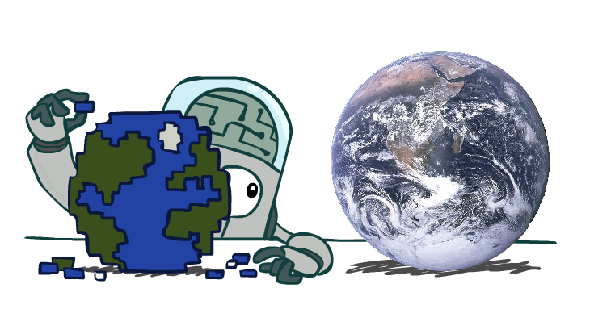

class: middle, center, title-slide

# Introduction to Artificial Intelligence

Lecture 4: Games and Adversarial search

  
Prof. Gilles Louppe 
[g.louppe@uliege.be](mailto:g.louppe@uliege.be)

---

class: center, black-slide, middle

<iframe width="640" height="400" src="https://www.youtube.com/embed/LJS7Igvk6ZM?cc_load_policy=1&hl=en&version=3" frameborder="0" allowfullscreen></iframe>

---

# Today

- How to act rationally in a *multi-agent* environment?
- How to anticipate and respond to the **arbitrary behavior** of other agents?
- Adversarial search
    - Minimax
    - $\alpha-\beta$ pruning
    - H-Minimax
    - Expectiminimax
    - Monte Carlo Tree Search
- Modeling assumptions
- State-of-the-art agents.

---

class: middle

# Minimax

---

# Games

- A **game** is a multi-agent environment where agents may have either *conflicting* or *common* interests.
- Opponents may act **arbitrarily**, even if we assume a deterministic fully observable environment.
    - The solution to a game is a *strategy* specifying a move for every possible opponent reply.
    - This is different from search where a solution is a *fixed sequence*.
- Time **limits**.
    - Branching factor is often very large.
    - Unlikely to find goal with standard search algorithms, we need to *approximate*.

???

A game is a mathematical model of strategic interaction between rational decision makers.

---

class: middle

## Types of games

- **Deterministic** or *stochastic*?
- **Perfect** or *imperfect* information?
- **Two** or *more* players?

---

class: middle

## Formal definition

A **game** is formally defined as a kind of search problem with the following components:
- The *initial state* $s_0$ of the game.
- A function $\text{player}(s)$ that defines which *player* $p \in \\{1, ..., N \\}$ has the move in state $s$.
- A description of the legal *actions* (or *moves*) available to a state $s$, denoted $\text{actions}(s)$.
- A *transition model* that returns the state $s' = \text{result}(s, a)$ that results from doing action $a$ in state $s$.
- A *terminal test* which determines whether the game is over.

---

class: middle

- A *utility function* $\text{utility}(s, p)$ (or payoff) that defines the final numeric value for a game that ends in $s$ for a player $p$.
    - E.g., $1$, $0$ or $\frac{1}{2}$ if the outcome is win, loss or draw.
- Together, the initial state, the $\text{actions}(s)$ function and the $\text{result}(s, a)$ function define the **game tree**.
    - Nodes are game states.
    - Edges are actions.

---

class: middle

## Tic-Tac-Toe game tree

.width-100[]

---

class: middle

## Zero-sum games

- In a **zero-sum** game, the total payoff to all players is *constant* for all games.
    - e.g., in chess: $0+1$, $1+0$ or $\frac{1}{2} + \frac{1}{2}$.
- For two-player games, agents share the **same utility** function, but one wants to *maximize* it while the other wants to *minimize* it.
    - MAX maximizes the game's $\text{utility}$ function.
    - MIN minimizes the game's $\text{utility}$ function.
- *Strict competition*.
    - If one wins, the other loses, and vice-versa.

 
.center.width-40[]

.footnote[Image credits: [CS188](http://ai.berkeley.edu/lecture_slides.html), UC Berkeley.]

???

The term 'zero-sum' is confusing but makes sense if you imagine each player is charged an entry of 1/2 (for chess). Constant-sum game would have been better.

---

class: middle

.exercise[What is an optimal strategy (or perfect play)? How do we find it?]

---

# Assumptions

- We assume a *deterministic*, *turn-taking*, *two-player* **zero-sum game** with *perfect information*.
    - e.g., Tic-Tac-Toe, Chess, Checkers, Go, etc.
- We will call our two players **MAX** and *MIN*. **MAX** moves first.

   
.center.width-50[]

.footnote[Image credits: [CS188](http://ai.berkeley.edu/lecture_slides.html), UC Berkeley.]

---

# Adversarial search

.grid[.kol-2-3[
- In a search problem, the optimal solution is a sequence of actions leading to a goal state.
    - i.e., a terminal state where MAX wins.
- In a game, the opponent (MIN) may react *arbitrarily* to a move.
- Therefore, a player (MAX) must define a contingent **strategy** which specifies
    - its moves in the initial state,
    - its moves in the states resulting from every possible response by MIN,
    - its moves in the states resulting from every possible response by MIN in those states, ...
]
.kol-1-3.width-100[

]
]

.footnote[Image credits: [CS188](http://ai.berkeley.edu/lecture_slides.html), UC Berkeley.]

???

Analogy with chess, checkers or belotte.

---

# Minimax

The **minimax value** $\text{minimax}(s)$ is the largest achievable payoff (for MAX) from state $s$, assuming an *optimal adversary* (MIN).

.center.width-100[]

The **optimal** next move (for MAX) is to take the action that maximizes the minimax value in the resulting state.
- Assuming that MIN is an optimal adversary that maximizes the *worst-case outcome* for MAX.
- This is equivalent to not making an assumption about the strength of the opponent.

---

class: middle

.width-100[]

---

class: middle

## Properties of Minimax

- *Completeness*:
    - Yes, if tree is finite.
- *Optimality*:
    - Yes, if MIN is an optimal opponent.
    - What if MIN is suboptimal?
        - Show that MAX will do even better.
    - What if MIN is suboptimal and predictable?
        - Other strategies might do better than Minimax. However they will do worse on an optimal opponent.

---

class: middle

## Minimax efficiency

- Assume $\text{minimax}(s)$ is implemented using its recursive definition.
- How *efficient* is minimax?
    - Time complexity: same as DFS, i.e., $O(b^m)$.
    - Space complexity:
        - $O(bm)$, if all actions are generated at once, or
        - $O(m)$, if actions are generated one at a time.

.exercise[Do we need to explore the whole game tree?]

---

# Pruning

.center.width-70[]

.width-100[]

Therefore, it is possible to compute the **correct** minimax decision *without looking at every node* in the tree.

---

class: middle

.center.width-80[]

---

class: middle

.grid[
.kol-2-3[
We want to compute $v = \text{minimax}(n)$, for $\text{player(n)}$=MIN.
- We loop over $n$'s children.
- The minimax values are being computed one at a time and $v$ is updated iteratively.
- Let $\alpha$ be the best value (i.e., the highest) at any choice point along the path for MAX.
- If $v$ becomes lower than $\alpha$, then **$n$ will never be reached** in actual play.
- Therefore, we can *stop iterating* over the remaining $n$'s other children.
]
.kol-1-3[  .center.width-100[]]
]

???

Go back to the previous slide and the transition from (d) to (e).

If the minimax value $v$ for MIN becomes lower than the best value $\alpha$ for MAX, then $n$ will never be reached.

---

class: middle

Similarly, $\beta$ is defined as the best value (i.e., lowest) at any choice point along the path for MIN. We can halt the expansion of a MAX node as soon as $v$ becomes larger than $\beta$.

## $\alpha$-$\beta$ pruning
- Updates the values of $\alpha$ and $\beta$ as the path is expanded.
- Prune the remaining branches (i.e., terminate the recursive calls) as soon as the value of the current node is known to be worse than the current $\alpha$ or $\beta$ value for MAX or MIN, respectively.

???

If the minimax value $v$ for MAX becomes larger the best value $\beta$ for MIN, then $n$ will never be reached.

---

# $\alpha$-$\beta$  search

.width-90[]

???

Note that MAX plays first, hence the first call to MAX-VALUE in the main function.

---

class: middle

## Properties of $\alpha$-$\beta$ search

- Pruning has **no effect** on the minimax values. Therefore, *completeness* and *optimality* are preserved from Minimax.
- *Time complexity*:
    - The effectiveness depends on the order in which the states are examined.
    - If states could be examined in *perfect order*, then $\alpha-\beta$ search examines only $O(b^{m/2})$ nodes to pick the best move, vs. $O(b^m)$ for minimax.
        - $\alpha-\beta$ can solve a tree twice as deep as minimax can in the same amount of time.
        - Equivalent to an effective branching factor $\sqrt{b}$.
- *Space complexity*: $O(m)$, as for Minimax.

---

# Game tree size

.center.width-30[]

Chess:
- $b \approx 35$ (approximate average branching factor)
- $d \approx 100$ (depth of a game tree for typical games)
- $b^d \approx 35^{100} \approx 10^{154}$.
- For $\alpha-\beta$ search and perfect ordering, we get $b^{d/2} \approx 35^{50} = 10^{77}$.

Finding the exact solution is completely **infeasible**.

---

# Transposition table

- Repeated states occur frequently because of **transpositions**: different permutations of the move sequence end in a same position.
- Similar to the `closed` set in Graph-Search, it is worthwhile to store the evaluation of a state such that further occurrences of the state do not have to be recomputed.

.exercise[What data structure should be used to efficiently store and look-up values of positions?]

---

# Imperfect real-time decisions

- Under *time constraints*, searching for the exact solution is not feasible in most realistic games.
- Solution: cut the search earlier.
    - Replace the $\text{utility}(s)$ function with a heuristic **evaluation function** $\text{eval}(s)$ that estimates the state utility.
    - Replace the terminal test by a **cutoff test** that decides when to stop expanding a state.

.center.width-100[]

.exercise[Can $\alpha-\beta$ search  be adapted to implement H-Minimax?]

???

Yes.

Replace the if-statements with the terminal test with if-statements with the cutoff test.

---

class: middle

## Evaluation functions

- An evaluation function $\text{eval}(s)$ returns an **estimate** of the expected utility of the game from a given position $s$.
- The computation *must be short* (that is the whole point to search faster).
- Ideally, the evaluation should *order* terminal states in the same way as in Minimax.
    - The evaluation values may be different from the true minimax values, as long as order is preserved.
- In non-terminal states, the evaluation function should be strongly *correlated* with the actual chances of winning.

???

- Like for heuristics in search, evaluation functions can be learned using machine learning algorithms.

---

class: middle

## Quiescence

.center.width-70[]

- These states only differ in the position of the rook at lower right.
- However, Black has advantage in (a), but not in (b).
- If the search stops in (b), Black will not see that White's next move is to capture its Queen, gaining advantage.
- Cutoff should only be applied to positions that are **quiescent**.
    - i.e., states that are unlikely to exhibit wild swings in value in the near future.

---

# The horizon effect

Evaluations functions are **always imperfect**.
- If not looked deep enough, *bad moves* may appear as *good moves* (as estimated by the evaluation function) because their consequences are hidden beyond the search horizon.
    - and vice-versa!
- Often, the deeper in the tree the evaluation function is buried, the less the quality of the evaluation function matters.

---

class: middle, black-slide

.center[<video controls preload="auto" height="480" width="640">
  <source src="./figures/lec4/depth2.mp4" type="video/mp4">
</video>]

.caption[Cutoff at depth 2, evaluation = the closer to the dot, the better.]

.footnote[Image credits: [CS188](http://ai.berkeley.edu/lecture_slides.html), UC Berkeley.]

---

class: middle, black-slide

.center[<video controls preload="auto" height="480" width="640">
  <source src="figures/lec4/depth10.mp4" type="video/mp4">
</video>]

.caption[Cutoff at depth 10, evaluation = the closer to the dot, the better.]

.footnote[Image credits: [CS188](http://ai.berkeley.edu/lecture_slides.html), UC Berkeley.]

---

# Multi-agent games

- What if the game is not zero-sum, or has *multiple players*?
- Generalization of Minimax:
    - Terminal states are labeled with utility **tuples** (1 value per player).
    - Intermediate states are also labeled with utility tuples.
    - Each player maximizes its own component.
    - May give rise to cooperation and competition dynamically.

.center.width-70[]

.footnote[Image credits: [CS188](http://ai.berkeley.edu/lecture_slides.html), UC Berkeley.]

---

class: middle

# Stochastic games

---

# Stochastic games

- In real life, many unpredictable external events can put us into unforeseen situations.
- Games that mirror this unpredictability are called **stochastic games**. They include a random element, such as:
    - explicit randomness: rolling a dice;
    - unpredictable opponents: ghosts respond randomly;
    - actions may fail: when moving a robot, wheels might slip.

 
.center.width-40[]

.footnote[Image credits: [CS188](http://ai.berkeley.edu/lecture_slides.html), UC Berkeley.]

---

class: middle

- In a game tree, this random element can be **modeled** with *chance nodes* that map a state-action pair to the set of possible outcomes, along with their respective *probability*.
- This is equivalent to considering the environment as an extra  *random agent* player that moves after each of the other players.

.center.width-30[]

.footnote[Image credits: [CS188](http://ai.berkeley.edu/lecture_slides.html), UC Berkeley.]

---

class: middle

## Stochastic game tree

.center.width-80[]

???

- This tree corresponds to a game with two dices
- What is the best move? The best move cannot be determined anymore, because it depends on chance.

---

# Expectiminimax

- Because of the uncertainty in the action outcomes, states no longer have a *definite* $\text{minimax}$ value.
- We can only calculate the **expected** value of a state under optimal play by the opponent.
    - i.e., the average over all possible outcomes of the chance nodes.
    - $\text{minimax}$ values correspond instead to the worst-case outcome.

.center.width-100[]

.exercise[Does taking the rational move mean the agent will be successful?]

---

class: middle

## Evaluation functions

- As for $\text{minimax}(n)$, the value of $\text{expectiminimax}(n)$ may
be approximated by stopping the recursion early and using an evaluation function.
- However, to obtain correct move, the evaluation function should be a **positive linear transformation** of the expected utility of the state.
    - It is not enough for the evaluation function to just be order-preserving.
- If we assume bounds on the utility function, $\alpha-\beta$ search can be adapted to stochastic games.

 
.center.width-70[]
.caption[An order-preserving transformation on leaf values changes the best move.]

---

# Monte Carlo Tree Search

## Random playout evaluation

- To evaluate a state, have the algorithm play **against itself** using *random moves*, thousands of times.
- The sequence of random moves is called a *random playout*.
- Use the proportion of wins as the state evaluation.
- This strategy does **not require domain knowledge**!
    - The game engine is all that is needed.

---

class: middle

## Monte Carlo Tree Search

The focus of MCTS is the analysis of the most promising moves, as incrementally evaluated with random playouts.

Each node $n$ in the current search tree maintains  two values:
- the number of wins $Q(n,p)$ of player $p$ for all playouts that passed through $n$;
- the number $N(n)$ of times $n$ has been visited.

---

class: middle

The algorithm searches the game tree as follows:
1. *Selection*: start from root, select successive child nodes down to a node $n$ that is not fully expanded.
2. *Expansion*: unless $n$ is a terminal state, create a new child node $n'$.
3. *Simulation*: play a random playout from $n'$.
4. *Backpropagation*: use the result of the playout to update information in the nodes on the path from $n'$ to the root.

Repeat 1-4 for as long the time budget allows. Pick the best next direct move.

---

class: middle

.center.width-100[]

???

This graph shows the steps involved in one decision, with each node showing the ratio of wins to total playouts from that point in the game tree for the player that node represents. In the Selection diagram, black is about to move. The root node shows there are 11 wins out of 21 playouts for white from this position so far. It complements the total of 10/21 black wins shown along the three black nodes under it, each of which represents a possible black move.

If white loses the simulation, all nodes along the selection incremented their simulation count (the denominator), but among them only the black nodes were credited with wins (the numerator). If instead white wins, all nodes along the selection would still increment their simulation count, but among them only the white nodes would be credited with wins. In games where draws are possible, a draw causes the numerator for both black and white to be incremented by 0.5 and the denominator by 1. This ensures that during selection, each player's choices expand towards the most promising moves for that player, which mirrors the goal of each player to maximize the value of their move.

Rounds of search are repeated as long as the time allotted to a move remains. Then the move with the most simulations made (i.e. the highest denominator) is chosen as the final answer.

---

class: middle

## Exploration and exploitation

Given a limited budget of random playouts, the efficiency of MCTS critically depends on the choice of the nodes that are selected at step 1.

At a node $n$ during the selection step, the UCB1 policy picks the child node $n'$ of $n$ that maximizes
$$\frac{Q(n',p)}{N(n')} + c \sqrt{\frac{2 \log N(n)}{N(n')}}.$$
- The first term  encourages the *exploitation* of higher-reward nodes.
- The second term encourages the **exploration** of less-visited nodes.
- The constant $c>0$ controls the trade-off between exploitation and exploration.

---

class: middle

# Modeling assumptions

---

class: middle

.center[

What if our assumptions are incorrect?]

.footnote[Image credits: [CS188](http://ai.berkeley.edu/lecture_slides.html), UC Berkeley.]

---

class: middle, black-slide

.grid[
.kol-2-3[

## Setup

- $P_1$: Pacman uses depth 4 search with an evaluation function that avoids trouble, while assuming that the ghost follows $P_2$.
- $P_2$: Ghost uses depth 2 search with an evaluation function that seeks Pacman, while assuming that Pacman follows $P_1$.
- $P_3$: Pacman  uses depth 4 search with an evaluation function that avoids trouble, while assuming that the ghost follows $P_4$
- $P_4$: Ghost makes random moves.
]
.kol-1-3[.width-100[]]
]

---

class: middle, black-slide, center

.center[
<video controls preload="auto" height="400" width="300">
  <source src="figures/lec4/minimax-vs-adversarial.mp4" type="video/mp4">
</video>]

Minimax Pacman ($P_1$) vs. Adversarial ghost ($P_2$)

.footnote[Image credits: [CS188](http://ai.berkeley.edu/lecture_slides.html), UC Berkeley.]

???

Assumptions are correct.

---

class: middle, black-slide, center

.center[
<video controls preload="auto" height="400" width="300">
  <source src="figures/lec4/minimax-vs-random.mp4" type="video/mp4">
</video>]

Minimax Pacman ($P_1$) vs. Random ghost ($P_3$)

.footnote[Image credits: [CS188](http://ai.berkeley.edu/lecture_slides.html), UC Berkeley.]

???

Assumptions are incorrect. Has the ghost some masterplan?

---

class: middle, black-slide, center

.center[
<video controls preload="auto" height="400" width="300">
  <source src="figures/lec4/expectimax-vs-random.mp4" type="video/mp4">
</video>]

Expectiminimax Pacman ($P_3$) vs. Random ghost ($P_4$)

.footnote[Image credits: [CS188](http://ai.berkeley.edu/lecture_slides.html), UC Berkeley.]

???

Assumptions are correct.

---

class: middle, black-slide, center

.center[
<video controls preload="auto" height="400" width="300">
  <source src="figures/lec4/expectimax-vs-adversarial.mp4" type="video/mp4">
</video>]

Expectiminimax Pacman ($P_3$) vs. Adversarial ghost ($P_2$)

.footnote[Image credits: [CS188](http://ai.berkeley.edu/lecture_slides.html), UC Berkeley.]

???

Pacman is lucky!

---

class: middle

# State-of-the-art game programs

---

# Checkers

## 1951

First computer player by Christopher Strachey.

## 1994

The computer program *Chinook* ends the 40-year-reign of human champion Marion Tinsley.
- Library of opening moves from grandmasters;
- A deep search algorithm;
- A good move evaluation function (based on a linear model);
- A database for all positions with eight pieces or fewer.

---

class: middle

## 2007
Checkers is **solved**. A weak solution is computationally proven.
- The number of involved calculations was $10^{14}$, over a period of 18 years.
- A draw is always guaranteed provided neither player makes a mistake.

.center.width-50[]

.footnote[Schaeffer, Jonathan, et al. "Checkers is solved." science 317.5844 (2007): 1518-1522.]

---

# Chess

## 1997

- *Deep Blue* defeats human champion Gary Kasparov.
    - $200000000$ position evaluations per second.
    - Very sophisticated evaluation function.
    - Undisclosed methods for extending some lines of search up to 40 plies.
- Modern programs (e.g., Stockfish or AlphaZero) are better, if less historic.
- Chess remains *unsolved* due to the complexity of the game.

 
.center.width-50[]

---

# Go

For long, Go was considered as the Holy Grail of AI due to the size of its game tree.
- On a 19x19, the number of legal positions is $\pm 2 \times 10^{170}$.
- This results in **$\pm 10^{800}$ games**, considering a length of $400$ or less.

 
.center.width-50[]

---

class: middle

## 2010-2014
Using *Monte Carlo tree search* and **machine learning**, computer players reach low dan levels.

## 2015-2017
Google Deepmind invents AlphaGo.

- 2015: AlphaGo beat Fan Hui, the European Go Champion.
- 2016: AlphaGo beat Lee Sedol (4-1), a 9-dan grandmaster.
- 2017: AlphaGo beat Ke Jie, 1st world human player.

AlphaGo combines Monte Carlo tree search and **deep learning** with extensive training, both from human and computer play.

---

class: middle, black-slide, center

<iframe width="640" height="400" src="https://www.youtube.com/embed/m2QFSocFeOQ" frameborder="0" allowfullscreen></iframe>

.caption[Press coverage for the victory of AlphaGo against Lee Sedol.]

---

class: middle

## 2017

AlphaGo Zero combines *Monte Carlo tree search* and **deep learning** with extensive training, with self-play only

.center.width-70[]

.footnote[Credits: [AlphaGo Zero: Learning from scratch](https://deepmind.com/blog/alphago-zero-learning-scratch/)]

---

# Summary

- Multi-player games are variants of search problems.
- The difficulty rise in the fact that opponents may respond arbitrarily.
    - The optimal solution is a **strategy**, and not a fixed sequence of actions.
- *Minimax* is an optimal algorithm for deterministic, turn-taking, two-player zero-sum game with perfect information.
    - Due to practical time constraints, exploring the whole game tree is often **infeasible**.
    - Approximations can be achieved with heuristics, reducing computing times.
    - Minimax can be adapted to stochastic games.
    - Minimax can be adapted to games with more than 2 players.
- Optimal behavior is **relative** and depends on the assumptions we make about the world.

---

class: end-slide, center
count: false

The end.

---

# References

- Browne, Cameron B., et al. "A survey of monte carlo tree search methods." IEEE Transactions on Computational Intelligence and AI in games 4.1 (2012): 1-43.
- Schaeffer, Jonathan, et al. "Checkers is solved." science 317.5844 (2007): 1518-1522.
- Silver, David, et al. "Mastering the game of Go with deep neural networks and tree search." Nature 529.7587 (2016): 484-489.
