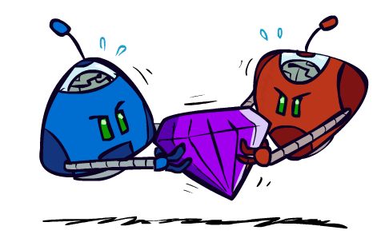
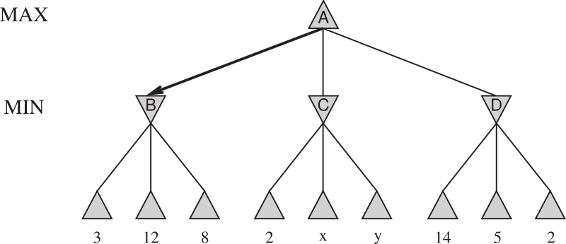
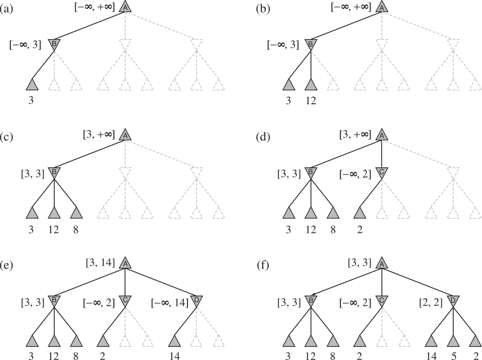
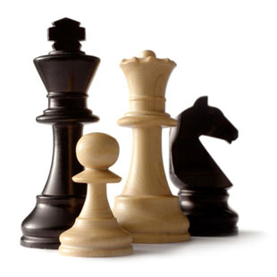
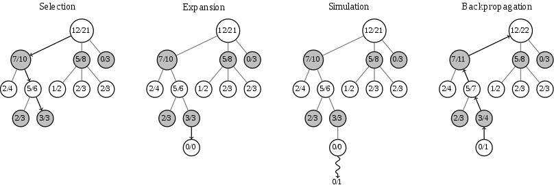

class: middle, center, title-slide

# Introduction to Artificial Intelligence

Lecture 4: Adversarial search

---

# Today

- How to act rationally in a *multi-agent environment*?
    - How to anticipate and respond to the arbitrary behavior of other agents?
- **Games** as a case study.
- *Adversarial search* (Minimax, $\alpha-\beta$ pruning, H-Minimax, Expectiminimax).
- State-of-the-art agents.

---

class: center

# Ignore the Blonde

<iframe width="560" height="315" src="https://www.youtube.com/embed/LJS7Igvk6ZM?cc_load_policy=1&hl=en&version=3" frameborder="0" allowfullscreen></iframe>

???

R: add subtitles

---

# Games

- A **game** is a multi-agent environment where agents may have either *conflicting* or *common* interests.
- Opponents may act **arbitrarily**, even if we assume a deterministic fully observable environment.
    - Therefore the solution to a game is a *strategy* specifying a move for every possible opponent reply.
    - This is different from search where a solution is a *fixed* sequence.
- Time **limits**.
    - Branching factor is often very large.
    - Unlikely to find goal with standard search algorithms, we need to *approximate*.

---

# Types of games

- **Deterministic** or *stochastic*?
- **Perfect** or *imperfect* information?
- **One**, *two or more* players?

---

# Formal definition

A **game** is formally defined as a kind of search problem with the following components:
- The *initial state* $s_0$ of the game.
- A function $\text{player}(s)$ that defines which *player* $p \in \\{1, ..., N \\}$ has the move in state $s$.
- A description of the legal *actions* (or *moves*) available to a state $s$, denoted $\text{actions}(s)$.
- A *transition model* that returns the state $s' = \text{result}(s, a)$ that results from doing action $a$ in state $s$.
- A *terminal test* which determines whether the game is over.

---

- A *utility function* $\text{utility}(s, p)$ (or payoff) that defines the final numeric value for a game that ends in $s$ for a player $p$.
    - E.g., $1$, $0$ or $\frac{1}{2}$ if the outcome is win, loss or draw.
- Together, the initial state, the $\text{actions}(s)$ function and the $\text{result}(s, a)$ function define the **game tree**.
    - *Nodes* are game states.
    - *Edges* are actions.

---

# Assumptions

- We assume a *deterministic*, *turn-taking*, *two-player* **zero-sum game** with *perfect information*.
    - e.g., Tic-Tac-Toe, Chess, Checkers, Go, etc.
- We will call our two players **MAX** and *MIN*. **MAX** moves first.

.center.width-50[]

.footnote[Credits: UC Berkeley, [CS188](http://ai.berkeley.edu/lecture_slides.html)]

---

# Game tree

.width-100[]

---

# Zero-sum games

- In a **zero-sum** game, the total payoff to all players is *constant* for all games.
    - e.g., in chess: $0+1$, $1+0$ or $\frac{1}{2} + \frac{1}{2}$.
- For two-player games, agents share the **same utility** function, but one wants to *maximize* it while the other wants to *minimize* it.
    - MAX maximizes the game's $\text{utility}$ function.
    - MIN minimizes the game's $\text{utility}$ function.
- *Strict competition*.
    - If one wins, the other loses, and vice-versa.

.center.width-40[]

.footnote[Credits: UC Berkeley, [CS188](http://ai.berkeley.edu/lecture_slides.html)]

---

# Adversarial search

.grid[
.col-2-3[
- In a search problem, the optimal solution is a sequence of actions leading to a goal state.
    - i.e., a terminal state where MAX wins.
- In a game, the opponent (MIN) may react *arbitrarily* to a move.
- Therefore, a player (MAX) must define a contingent **strategy** which specifies
    - its moves in the initial state,
    - its moves in the states resulting from every possible response by MIN,
    - its moves in the states resulting from every possible response by MIN in those states,
    - ...
]
.col-1-3[

]
]

[Q] What is an optimal strategy (or perfect play)? How do we find it?

.footnote[Credits: UC Berkeley, [CS188](http://ai.berkeley.edu/lecture_slides.html)]

---

# Minimax

The **minimax value** $\text{minimax}(s)$ is the largest achievable payoff (for MAX) from state $s$, assuming an optimal adversary (MIN).

.center.width-100[]

The **optimal** next move (for MAX) is to take the action that maximizes the minimax value in the resulting state.
- Assuming that MIN is an optimal adversary maximizes the *worst-case outcome* for MAX.
- This is equivalent to not making an assumption about the strength of the opponent.

---

# Minimax example

.width-100[]

---

# Properties of Minimax

- *Completeness*:
    - Yes, if tree is finite.
- *Optimality*:
    - Yes, if MIN is an optimal opponent.
    - What if MIN is suboptimal?
        - Show that MAX will do even better.
    - What if MIN is suboptimal and predictable?
        - Other strategies might do better than Minimax. However they will do worse on an optimal opponent.

---

# Minimax efficiency

- Assume $\text{minimax}(s)$ is implemented using its recursive definition.
- How *efficient* is minimax?
    - Time complexity: same as DFS, i.e., $O(b^m)$.
    - Space complexity:
        - $O(bm)$, if all actions are generated at once, or
        - $O(m)$, if actions are generated one at a time.

[Q] Do we need to explore the whole game tree?

---

# Pruning

.center.width-80[]

.width-100[]

Therefore, it is possible to compute the **correct** minimax decision *without looking at every node* in the tree.

---

# Pruning

.center.width-80[]

---

class: smaller

# $\alpha$-$\beta$  pruning

We want to compute $v = \text{minimax}(n)$.
- We loop over $n$'s children.
- The minimax values are being computed one at a time and $v$ is updated iteratively.
- Let $\alpha$ be the best value that MAX can get, at any choice point along the current path from root.
- If $v$ becomes lower than $\alpha$, then **MAX will avoid it**.
- Therefore, we can *stop iterating* over the remaining $n$'s other children.

.center.width-30[]

---

# $\alpha$-$\beta$  search

.width-90[]

???

R: be explicit about what alpha and beta correspond to

---

# Properties of $\alpha$-$\beta$ search

- Pruning has **no effect** on the minimax values. Therefore, *completeness* and *optimality* are preserved from Minimax.
- *Time complexity*:
    - The effectiveness depends on the order in which the states are examined.
    - If states could be examined in *perfect order*, then $\alpha-\beta$ search examines only $O(b^{m/2})$ nodes to pick the best move, vs. $O(b^m)$ for minimax.
        - $\alpha-\beta$ can solve a tree twice as deep as minimax can in the same amount of time.
        - Equivalent to an effective branching factor $\sqrt{b}$.
- *Space complexity*: $O(m)$, as for Minimax.

---

# Game tree size

.center.width-30[]

Chess:
- $b \approx 35$ (approximate average branching factor)
- $d \approx 100$ (depth of a game tree for typical games)
- $b^d \approx 35^{100} \approx 10^{154}$.
- For $\alpha-\beta$ search and perfect ordering, we get $b^{d/2} \approx 35^{50} = 10^{77}$.

Finding the exact solution is completely **infeasible**.

---

# Imperfect real-time decisions

- Under *time constraints*, searching for the exact solution is not feasible in most realistic games.
- Solution: cut the search earlier.
    - Replace the $\text{utility}(s)$ function with a heuristic **evaluation function** $\text{eval}(s)$ that estimates the state utility.
    - Replace the terminal test by a **cutoff test** that decides when to stop expanding a state.

.center.width-100[]

[Q] Can $\alpha-\beta$ search  be adapted to implement H-Minimax?

???

Yes.

Replace the if-statements with the terminal test with if-statements with the cutoff test.

---

# Evaluation functions

- An evaluation function returns an **estimate** of the expected utility of the game from a given position.
- The computation *must be short* (that is the whole point to search faster).
- Ideally, the evaluation should *order* terminal states in the same way as in Minimax.
    - The evaluation values may be different from the true minimax values, as long as order is preserved.
- In non-terminal states, the evaluation function should be strongly *correlated with the actual chances of winning*.
- Like for heuristics in search, evaluation functions can be  *learned* using machine learning algorithms.

---

# Quiescence

.center.width-70[]

- These states only differ in the position of the rook at lower right.
- However, Black has advantage in (a), but not in (b).
- If the search stops in (b), Black will not see that White's next move is to capture its Queen, gaining advantage.
- Cutoff should only be applied to positions that are **quiescent**.
    - i.e., states that are unlikely to exhibit wild swings in value in the near future.

---

# The horizon effect

- Evaluations functions are **always imperfect**.
- Often, the deeper in the tree the evaluation function is buried, the less the quality of the evaluation function matters.
- If not looked deep enough, *bad moves may appear as good moves* (as estimated by the evaluation function) because their consequences are hidden beyond the search horizon.
    - and vice-versa!

---

.center[
<video controls preload="auto" height="480" width="640">
  <source src="./figures/lec3/depth2.mp4" type="video/mp4">
</video>

Cutoff at depth 2, evaluation = the closer to the dot, the better.]

.footnote[Credits: UC Berkeley, [CS188](http://ai.berkeley.edu/lecture_slides.html)]

---

.center[
<video controls preload="auto" height="480" width="640">
  <source src="figures/lec3/depth10.mp4" type="video/mp4">
</video>

Cutoff at depth 10, evaluation = the closer to the dot, the better.]

.footnote[Credits: UC Berkeley, [CS188](http://ai.berkeley.edu/lecture_slides.html)]

---

# Stochastic games

- In real life, many unpredictable external events can put us into unforeseen situations.
- Games that mirror this unpredictability are called **stochastic games**. They include a random element, such as:
    - explicit randomness: rolling a dice;
    - unpredictable opponents: ghosts respond randomly;
    - actions may fail: when moving a robot, wheels might slip.

.center.width-40[]

.footnote[Credits: UC Berkeley, [CS188](http://ai.berkeley.edu/lecture_slides.html)]

---

# Stochastic games

- In a game tree, this random element can be **modeled** with *chance nodes* that map a state-action pair to the set of possible outcomes, along with their respective *probability*.
- This is equivalent to considering the environment as an extra  *random agent* player that moves after each of the other players.

.center.width-30[]

.footnote[Credits: UC Berkeley, [CS188](http://ai.berkeley.edu/lecture_slides.html)]

---

# Stochastic game tree

.center.width-80[]

[Q] What is the best move?

???

The best move cannot be determined anymore, because it depends on chance.

---

# Expectiminimax

- Because of the uncertainty in the action outcomes, states no longer have a *definite* $\text{minimax}$ value.
- We can only calculate the **expected** value of a state under optimal play by the opponent.
    - i.e., the average over all possible outcomes of the chance nodes.
    - $\text{minimax}$ values correspond instead to the worst-case outcome.

.center.width-100[]

[Q] Does taking the rational move mean the agent will be successful?

---

# Evaluation functions

- As for $\text{minimax}(n)$, the value of $\text{expectiminimax}(n)$ may
be approximated by stopping the recursion early and using an evaluation function.
- However, to obtain correct move, the evaluation function should be a *positive linear transformation* of the expected utility of the state.
    - It is not enough for the evaluation function to just be order-preserving.
- If we assume bounds on the utility function, $\alpha-\beta$ search can be adapted to stochastic games.

.center.width-70[]
.caption[An order-preserving transformation on leaf values changes the best move.]

---

# Monte Carlo simulation

- To evaluate a state, have the algorithm play **against itself** using *random moves*, thousands of times.
    - The sequence of random moves is called a *random playout*.
- Use the proportion of wins as the state evaluation.
- This strategy does not require domain knowledge!
    - The game engine is all that is needed.

---

# Monte Carlo tree search

1. *Selection*: start from root, select successive child nodes down to a leaf $\ell$.
2. *Expansion*: unless $\ell$ is a terminal state, create one or more child nodes and choose a node $c$ among them.
3. *Simulation*: play a random playout from $c$.
4. *Backpropagation*: use the result of the playout to update information in the nodes on the path from $c$ to the root.

Repeat 1-4 for as long the time budget allows. Pick the best next direct move.

.center.width-70[]

[Q] How to determine the expansion order?

???

R: make it clearer that the policy of expansion is important.

---

# Multi-agent utilities

- What if the game is not zero-sum, or has *multiple players*?
- Generalization of Minimax:
    - Terminal states are labeled with utility **tuples** (1 value per player).
    - Intermediate states are also labeled with utility tuples.
    - Each player maximizes its own component.
    - May give rise to cooperation and competition dynamically

.center.width-70[]

.footnote[Credits: UC Berkeley, [CS188](http://ai.berkeley.edu/lecture_slides.html)]

---

# Modeling assumptions

.center[

What if our assumptions are incorrect?]

.footnote[Credits: UC Berkeley, [CS188](http://ai.berkeley.edu/lecture_slides.html)]

---

# Assumptions vs. reality (1)

.center[
<video controls preload="auto" height="400" width="300">
  <source src="figures/lec3/minimax-vs-adversarial.mp4" type="video/mp4">
</video>

Minimax Pacman vs. Adversarial ghost]

.footnote[Credits: UC Berkeley, [CS188](http://ai.berkeley.edu/lecture_slides.html)]

---

# Assumptions vs. reality (2)

.center[
<video controls preload="auto" height="400" width="300">
  <source src="figures/lec3/minimax-vs-random.mp4" type="video/mp4">
</video>

Minimax Pacman vs. Random ghost]

.footnote[Credits: UC Berkeley, [CS188](http://ai.berkeley.edu/lecture_slides.html)]

---

# Assumptions vs. reality (3)

.center[
<video controls preload="auto" height="400" width="300">
  <source src="figures/lec3/expectimax-vs-random.mp4" type="video/mp4">
</video>

Expectiminimax Pacman vs. Random ghost]

.footnote[Credits: UC Berkeley, [CS188](http://ai.berkeley.edu/lecture_slides.html)]

---

# Assumptions vs. reality (4)

.center[
<video controls preload="auto" height="400" width="300">
  <source src="figures/lec3/expectimax-vs-adversarial.mp4" type="video/mp4">
</video>

Expectiminimax Pacman vs. Adversarial ghost]

.footnote[Credits: UC Berkeley, [CS188](http://ai.berkeley.edu/lecture_slides.html)]

---

# State-of-the-art game programs

## Checkers

- 1951 (Christopher Strachey): first computer player .
- 1994 (Jonathan Schaeffer et al.): first computer champion. *Chinook* ended 40-year-reign of human champion Marion Tinsley.
    - Library of opening moves from grandmasters;
    - A deep search algorithm;
    - A good move evaluation function;
        - Based on a linear model.
    - A database for all positions with eight pieces or fewer.
- 2007 (Jonathan Schaeffer et al.): Checkers is **solved**.
    - A weak solution is computationally proven.
        - The number of involved calculations was $10^{14}$, over a period of 18 years.
    - The best an optimal player can achieve against Chinook is a draw.

---

.center.width-70[]

.footnote[Schaeffer, Jonathan, et al. "Checkers is solved." science 317.5844 (2007): 1518-1522.]

---

# State-of-the-art game programs

## Chess

- 1997: *Deep Blue* defeats human champion Gary Kasparov.
    - $200000000$ position evulations per second.
    - Very sophisticated evaluation function.
    - Undisclosed methods for extending some lines of search up to 40 plies.
- Modern programs are better, if less historic.
- Chess remains *unsolved* due to the complexity of the game.

.center.width-50[]

---

# State-of-the-art game programs

## Go

- On a 19x19, the number of legal positions is $\pm 2 \times 10^{170}$.
- This results in **$\pm 10^{800}$ games**, considering a length of $400$ or less.
- 2010-2014: Using *Monte Carlo tree search* and *machine learning*, computer players reach low dan levels.
- 2015-2017 (Google Deepmind): *AlphaGo*
    - 2015: AlphaGo beat Fan Hui, the European Go Champion.
    - 2016: AlphaGo beat Lee Sedol (4-1), a 9-dan grandmaster.
    - 2017: AlphaGo beat Ke Jie, 1st world human player.
- AlphaGo combines *Monte Carlo tree search* and *deep learning* with extensive training, both from human and computer play.

???

R: define value and policy networks and how they relate to MCTS.

---

class: center

# AlphaGo

<iframe width="560" height="315" src="https://www.youtube.com/embed/m2QFSocFeOQ" frameborder="0" allowfullscreen></iframe>

---

# AlphaGo Zero

Oct 18, 2017 (**yersterday**): AlphaGo Zero combines *Monte Carlo tree search* and *deep learning* with extensive training, with **self-play only**.

.center.width-50[]

---

# Summary

- Multi-player games are variants of search problems.
- The difficulty rise in the fact that opponents may respond arbitrarily.
    - The optimal solution is a **strategy**, and not a fixed sequence of actions.
- *Minimax* is an optimal algorithm for deterministic, turn-taking, two-player zero-sum game with perfect information.
    - Due to practical time constraints, exploring the whole game tree is often **infeasible**.
    - Approximations can be achieved with heuristics, reducing computing times.
    - Minimax can be adapted to stochastic games.
    - Minimax can be adapter to games with more than 2 players.
- Optimal behavior is **relative** and depends on the assumptions we make about the world.
- Going further?
    - See Chapters 16, 17 and 21 or INFO8003 Optimal decision making for complex problems.
    - What if the world is unknown?

???

R: Have an additional lecture before this one, on MDPs?

---

# References

- Schaeffer, Jonathan, et al. "Checkers is solved." science 317.5844 (2007): 1518-1522.
- Silver, David, et al. "Mastering the game of Go with deep neural networks and tree search." Nature 529.7587 (2016): 484-489.
