class: middle, center, title-slide

# Introduction to Artificial Intelligence

Lecture 5: Inference in Bayesian networks

  
Prof. Gilles Louppe 
[g.louppe@uliege.be](mailto:g.louppe@uliege.be)

---

# Today

.grid[
.kol-1-2[
- Exact inference
    - Inference by enumeration
    - Inference by variable elimination
- Approximate inference
    - Ancestral sampling
    - Rejection sampling
    - Likelihood weighting
    - Gibbs sampling
]
.kol-1-2[
  
.width-100[]
]
]

.footnote[Image credits: [CS188](https://inst.eecs.berkeley.edu/~cs188/), UC Berkeley.]

---

# Bayesian networks

.grid[
.kol-2-3[
A Bayesian network is a directed acyclic graph in which:
- Each node corresponds to a *random variable* $X\_i$.
- Each node $X\_i$ is annotated with a **conditional probability distribution** ${\bf P}(X\_i | \text{parents}(X\_i))$ that quantifies the effect of the parents on the node.

A Bayesian network implicitly encodes the full joint distribution as the product of the local distributions:
    $$P(x\_1, ..., x\_n) = \prod\_{i=1}^n P(x_i | \text{parents}(X_i))$$
]
.kol-1-3.center[.width-100[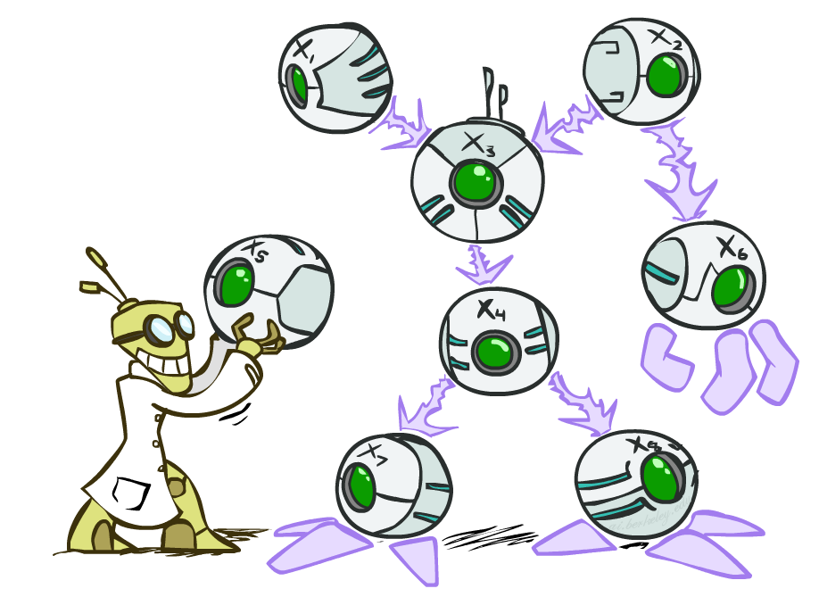]

 

.width-70[]]
]

.footnote[Image credits: [CS188](https://inst.eecs.berkeley.edu/~cs188/), UC Berkeley.]

???

Reminder: the topology encodes conditional independence assumptions!

---

class: middle

.grid[
.kol-3-4[.center.width-100[]]
.kol-1-4[.center.width-100[]]
]

 
$$
\begin{aligned}
P(b,\lnot e, a, \lnot j, m) &= P(b)P(\lnot e)P(a|b, \lnot e)P(\lnot j|a)P(m, a) \\\\
&= 0.001 \times 0.998 \times 0.94 \times 0.1 \times 0.7
\end{aligned}$$

---

class: middle

# Exact inference

---

# Inference

Inference is concerned with the problem *computing a marginal and/or a conditional probability distribution* from a joint probability distribution:

.grid[
.kol-1-3.center[Simple queries:]
.kol-2-3[${\bf P}(X\_i|e)$]
]
.grid[
.kol-1-3.center[Conjunctive queries:]
.kol-2-3[${\bf P}(X\_i,X\_j|e)={\bf P}(X\_i|e){\bf P}(X\_j|X\_i,e)$]
]
.grid[
.kol-1-3.center[Most likely explanation:]
.kol-2-3[$\arg \max_q P(q|e)$]
]
.grid[
.kol-1-3.center[Optimal decisions:]
.kol-2-3[$\arg \max\\\_a \mathbb{E}\_{p(s'|s,a)} \left[ V(s') \right]$]
]

.center.width-30[]

.footnote[Image credits: [CS188](https://inst.eecs.berkeley.edu/~cs188/), UC Berkeley.]

???

Explain what $\arg \max$ means.

---

# Inference by enumeration

Start from the joint distribution ${\bf P}(Q, E\_1, ..., E\_k, H\_1, ..., H\_r)$.

1. Select the entries consistent with the evidence  $E_1, ..., E_k = e_1, ..., e_k$.
2. Marginalize out the hidden variables to obtain the joint of the query and the evidence variables:
$${\bf P}(Q,e\_1,...,e\_k) = \sum\_{h\_1, ..., h\_r} {\bf P}(Q, h\_1, ..., h\_r, e\_1, ..., e\_k).$$
3. Normalize:
 
$$\begin{aligned}
Z &= \sum_q P(q,e_1,...,e_k) \\\\
{\bf P}(Q|e_1, ..., e_k) &= \frac{1}{Z} {\bf P}(Q,e_1,...,e_k)
\end{aligned}$$

---

class: middle

.pull-right[]

Consider the alarm network and the query ${\bf P}(B|j,m)$:  
$\begin{aligned}
{\bf P}(B|j,m) &= \frac{1}{Z} \sum\_e \sum\_a {\bf P}(B,j,m,e,a) \\\\
&\propto \sum\_e \sum\_a {\bf P}(B,j,m,e,a)
\end{aligned}$

Using the Bayesian network, the full joint entries can be rewritten as the product of CPT entries:  
$\begin{aligned}
{\bf P}(B|j,m) &\propto \sum\_e \sum\_a {\bf P}(B)P(e){\bf P}(a|B,e)P(j|a)P(m|a)
\end{aligned}$

???

&\propto P(B) \sum\_e P(e) \sum\_a P(a|B,e)P(j|a)P(m|a)

---

class: middle

.center.width-80[]

Inference by enumeration is slow because the whole joint distribution is joined up before summing out the hidden variables.

.footnote[Image credits: [CS188](https://inst.eecs.berkeley.edu/~cs188/), UC Berkeley.]

---

class: middle

Notice that factors that do not depend on the variables in the summations can be factored out, which means that marginalization does not necessarily have to be done at the end:

$$\begin{aligned}
{\bf P}(B|j,m) &\propto \sum\_e \sum\_a {\bf P}(B)P(e){\bf P}(a|B,e)P(j|a)P(m|a) \\\\
&= {\bf P}(B) \sum\_e P(e) \sum\_a {\bf P}(a|B,e)P(j|a)P(m|a)
\end{aligned}$$

---

class: middle

.center.width-100[]

Same complexity as DFS: $O(n)$ in space, $O(d^n)$ in time.

???

- $n$ is the number of variables.
- $d$ is the size of their domain.

---

class: middle

## Evaluation tree for $P(b|j,m)$

.center.width-80[]

Enumeration is still **inefficient**: there are repeated computations!
- e.g., $P(j|a)P(m|a)$ is computed twice, once for $e$ and once for $\lnot e$.
- These can be avoided by storing *intermediate results*.

???

Inefficient because the product is evaluated left-to-right, in a DFS manner.

---

# Inference by variable elimination

The **variable elimination** (VE) algorithm carries out summations right-to-left and stores intermediate results (called *factors*) to avoid recomputations.
The algorithm interleaves:
- Joining sub-tables
- Eliminating hidden variables

.center.width-80[]

.footnote[Image credits: [CS188](https://inst.eecs.berkeley.edu/~cs188/), UC Berkeley.]

---

class: middle

.center.width-30[]

## Example

$$\begin{aligned}
{\bf P}(B|j, m) &\propto {\bf P}(B,j,m) \\\\
&= {\bf P}(B) \sum\_e P(e) \sum\_a {\bf P}(a|B,e)P(j|a)P(m|a) \\\\
&= \mathbf{f}\_1(B) \times \sum\_e \mathbf{f}\_2(e) \times \sum\_a \mathbf{f}\_3(a,B,e) \times \mathbf{f}\_4(a) \times \mathbf{f}\_5(a) \\\\
&= \mathbf{f}\_1(B) \times \sum\_e \mathbf{f}\_2(e) \times \mathbf{f}\_6(B,e) \quad\text{ (sum out } A\text{)} \\\\
&= \mathbf{f}\_1(B) \times \mathbf{f}\_7(B) \quad\text{ (sum out } E\text{)} \\\\
\end{aligned}$$

---

class: middle

## Factors

- Each **factor $\mathbf{f}_i$** is a multi-dimensional array indexed by the values of its argument variables. E.g.:
.grid[
.kol-1-2[
$$
\begin{aligned}
\mathbf{f}\_4 &= \mathbf{f}\_4(A) = \left(\begin{matrix}
P(j|a) \\\\
P(j|\lnot a) \end{matrix}\right)
= \left(\begin{matrix}
0.90 \\\\
0.05 \end{matrix}\right) \\\\
\mathbf{f}\_4(a) &= 0.90 \\\\
\mathbf{f}\_4(\lnot a) &= 0.5
\end{aligned}$$
]
]
- Factors are initialized with the CPTs annotating the nodes of the Bayesian network, conditioned on the evidence.

---

class: middle

## Join

The *pointwise product* $\times$, or **join**, of two factors $\mathbf{f}_1$ and $\mathbf{f}_2$ yields a new factor $\mathbf{f}\_3$.
- Exactly like a **database join**!
- The variables of $\mathbf{f}\_3$ are the *union* of the variables in $\mathbf{f}_1$ and $\mathbf{f}_2$.
- The elements of $\mathbf{f}\_3$ are given by the product of the corresponding elements in $\mathbf{f}_1$ and $\mathbf{f}_2$.

.center.width-100[]

---

class: middle

## Elimination

*Summing out*, or **eliminating**, a variable from a factor is done by adding up the submatrices formed by fixing the variable to each of its values in turn.

For example, to sum out $A$ from $\mathbf{f}\_3(A, B, C)$, we write:

$$\begin{aligned}
\mathbf{f}(B,C) &= \sum\_a \mathbf{f}\_3(a, B, C) = \mathbf{f}\_3(a, B, C) + \mathbf{f}\_3(\lnot a, B, C) \\\\
&= \left(\begin{matrix}
0.06 & 0.24 \\\\
0.42 & 0.28
\end{matrix}\right) + \left(\begin{matrix}
0.18 & 0.72 \\\\
0.06 & 0.04
\end{matrix}\right) = \left(\begin{matrix}
0.24 & 0.96 \\\\
0.48 & 0.32
\end{matrix}\right)
\end{aligned}$$

---

class: middle

## General Variable Elimination algorithm

Query: ${\bf P}(Q|e\_1, ..., e\_k)$.

1. Start with the initial factors (the local CPTs, instantiated by the evidence).
2. While there are still hidden variables:
    1. Pick a hidden variable $H$
    2. Join all factors mentioning $H$
    3. Eliminate H
3. Join all remaining factors
4. Normalize

---

class: middle, center

(blackboard example)

???

Prepare this for $P(B|j,m)$.

---

class: middle

## Relevance

Consider the query ${\bf P}(J|b)$:
$${\bf P}(J|b) \propto P(b) \sum_e P(e) \sum\_a P(a|b,e) {\bf P}(J|a) \sum\_m P(m|a)$$
- $\sum_m P(m|a) = 1$, therefore $M$ is **irrelevant** for the query.
- In other words, ${\bf P}(J|b)$ remains unchanged if we remove $M$ from the network.

.pull-right[]

.italic[Theorem.] $H$ is irrelevant for ${\bf P}(Q|e)$ unless $H \in \text{ancestors}(\\\{Q\\\} \cup E)$.

---

class: middle

## Complexity

.center.width-50[]

Consider the query ${\bf P}(X\_n|y\_1,...,y\_n)$.

Work through the two elimination orderings:
- $Z, X\_1, ..., X\_{n-1}$
- $X\_1, ..., X\_{n-1}, Z$

What is the size of the maximum factor generated for each of the orderings?
- Answer: $2^{n+1}$ vs. $2^2$ (assuming boolean values)

---

class: middle

The computational and space complexity of variable elimination is determined by the **largest factor**.
- The elimination *ordering* can greatly affect the size of the largest factor.
- Does there always exist an ordering that only results in small factors? **No!**
    - Greedy heuristic: eliminate whichever variable minimizes the size of the factor to be constructed.
    - Singly connected networks (polytrees):
        - Any two nodes are connected by at most one (undirected path).
        - For these networks, time and space complexity of variable elimination are $O(nd^k)$.

---

class: middle

## Worst-case complexity?

.center.width-80[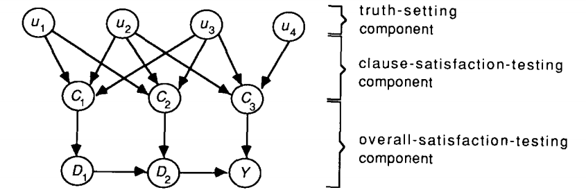]

3SAT is a special case of inference:
- CSP: $(u\_1 \lor u\_2 \lor u\_3) \wedge (\lnot u\_1 \lor \lnot u\_2 \lor u\_3) \wedge (u\_2 \lor \lnot u\_3 \lor u\_4)$
- $P(U\_i=0)=P(U\_i=1)=0.5$
- $C\_1 = U\_1 \lor U\_2 \lor U\_3$; $C\_2 = \lnot U\_1 \lor \lnot  U\_2 \lor U\_3$; $C\_3 = U\_2 \lor \lnot  U\_3 \lor U\_4$
- $D\_1 = C\_1$; $D\_2 = D\_1 \wedge C\_2$
- $Y = D\_2 \wedge C\_3$

???

3SAT is the problem of determining the satisfiability of a formula in conjunctive normal form, where each clause is limited to a most three literals.

---

class: middle

If we can answer whether $P(Y=1)>0$, then we answer whether 3SAT has a solution.
- By reduction, inference in Bayesian networks is therefore **NP-complete**.
- There is no known efficient probabilistic inference algorithm in general.

???

Proof by reduction: transforming a problem (here inference) into another (here checking the satisfiability of a formula).

---

class: middle

# Approximate inference

a.k.a. Monte Carlo methods

---

class: middle

Exact inference is **intractable** for most probabilistic models of practical interest.
(e.g., involving many variables, continuous and discrete, undirected cycles, etc).

## Solution

Abandon exact inference and develop  **approximate** but *faster* inference algorithms:
- *Sampling methods*: produce answers by repeatedly generating random numbers from a distribution of interest.
- *Variational methods*: formulate inference as an optimization problem.
- *Belief propagation methods*: formulate inference as a message-passing algorithm.

---

# Sampling methods

Basic idea:
- Draw $N$ samples from a sampling distribution $S$.
- Compute an approximate posterior probability $\hat{P}$.
- Show this approximate converges to the true probability distribution $P$.

## Why sampling?

Generating samples is often much faster than computing the right answer (e.g., with variable elimination).

.center.width-70[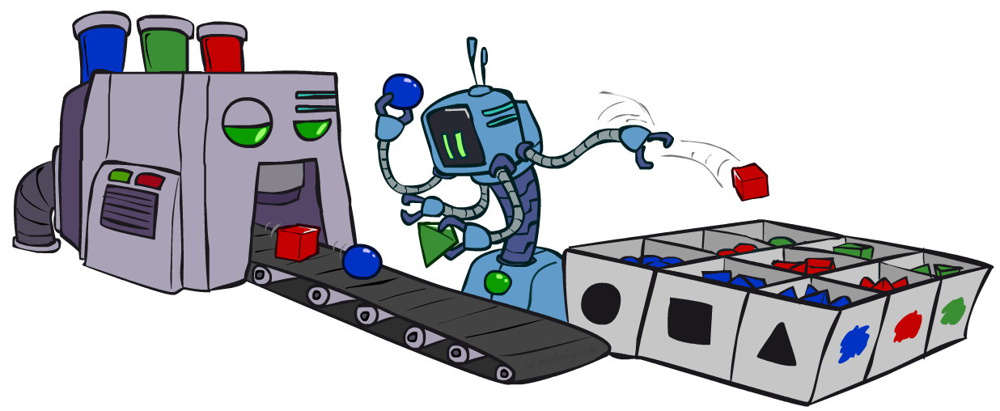]

.footnote[Image credits: [CS188](https://inst.eecs.berkeley.edu/~cs188/), UC Berkeley.]

---

# Sampling

How to sample from the distribution of a discrete variable $X$?
- Assume $k$ discrete outcomes $x_1, ..., x_k$ with probability $P(x_i)$.
- Assume sampling from the uniform $\mathcal{U}(0,1)$ is possible.
    - e.g., as enabled by a standard `rand()` function.
- Divide the $[0,1]$ interval into $k$ regions, with region $i$ having size $P(x_i)$.
- Sample $u \sim \mathcal{U}(0,1)$ and return the value associated to the region in which $u$ falls.

 
.center.width-60[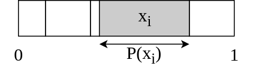]

---

class: middle

.grid[
.kol-1-3.center[
$P(C)$

| $C$ | $P$ |
| --- | --- |
| $\text{red}$ | $0.6$ |
| $\text{green}$ | $0.1$ |
| $\text{blue}$ | $0.3$ |
]
.kol-2-3[ 
$$\begin{aligned}
0 \leq u < 0.6 &\to C = \text{red} \\\\
0.6 \leq u < 0.7 &\to C = \text{green} \\\\
0.7 \leq u < 1 &\to C = \text{blue} \\\\
\end{aligned}$$
]
]

.center.width-70[]

.footnote[Image credits: [CS188](https://inst.eecs.berkeley.edu/~cs188/), UC Berkeley.]

---

# Prior sampling

Sampling from a Bayesian network, *without* observed evidence:
- Sample each variable in turn, **in topological order**.
- The probability distribution from which the value is sampled is conditioned on the values already assigned to the variable's parents.

---

class: middle

.center.width-100[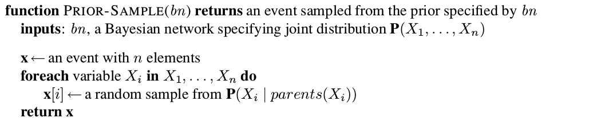]

 

.center.width-100[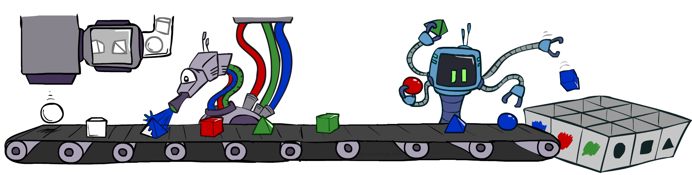]

.footnote[Image credits: [CS188](https://inst.eecs.berkeley.edu/~cs188/), UC Berkeley.]

---

class: middle

.center.width-90[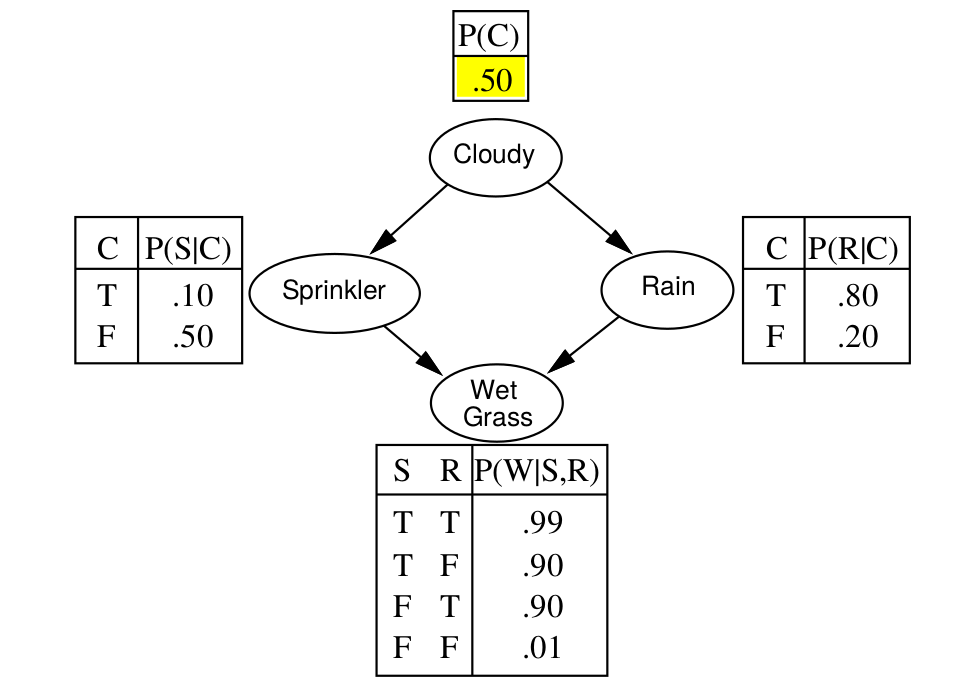]

---

class: middle
count: false

.center.width-90[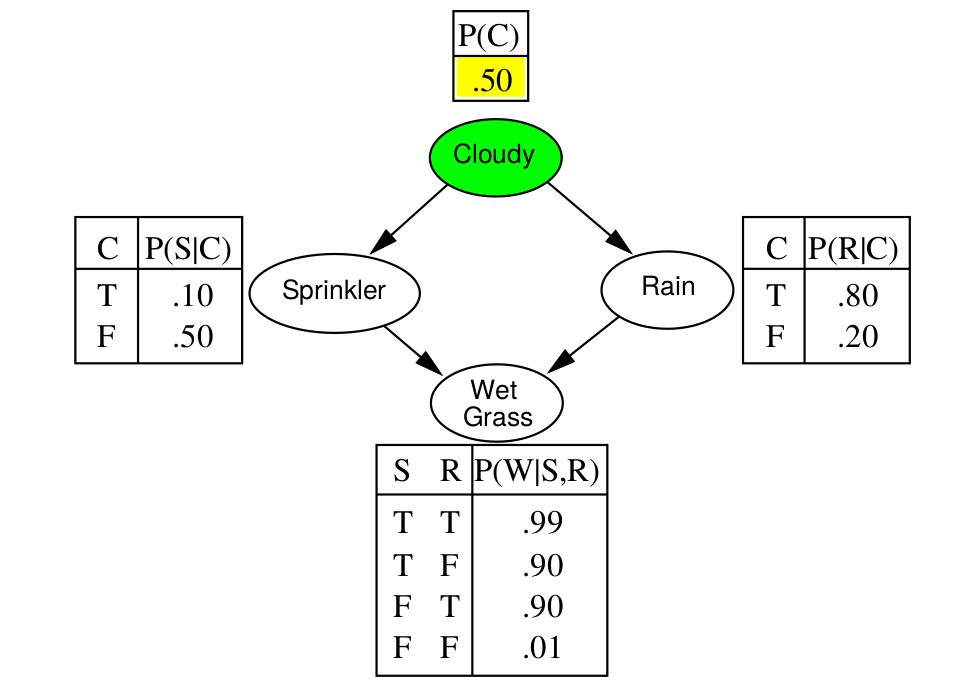]

---

class: middle
count: false

.center.width-90[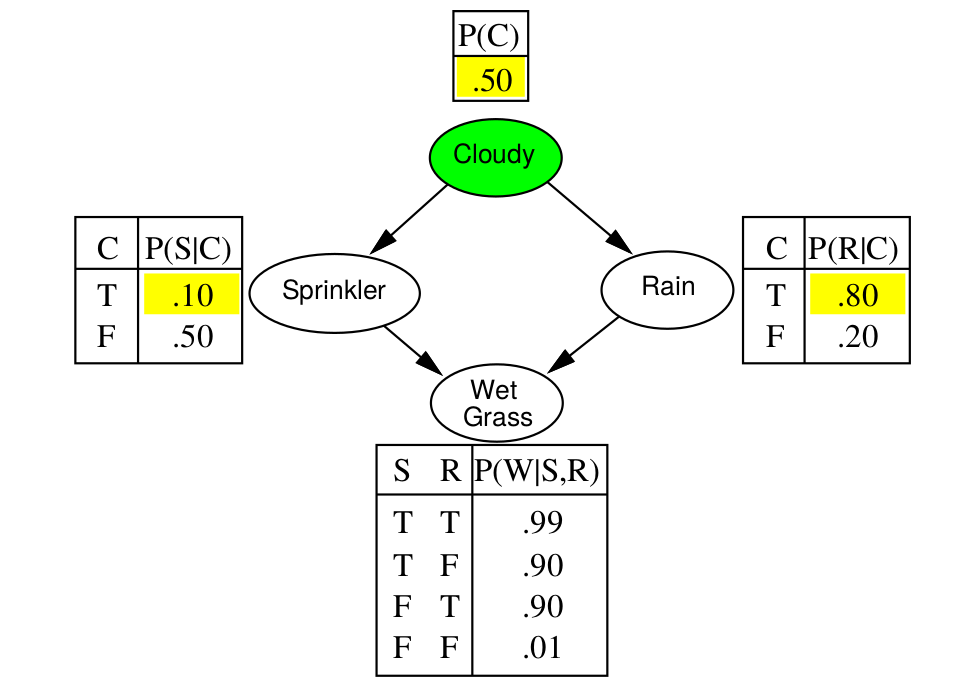]

---

class: middle
count: false

.center.width-90[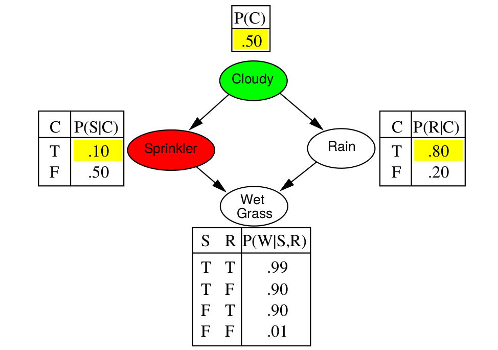]

---

class: middle
count: false

.center.width-90[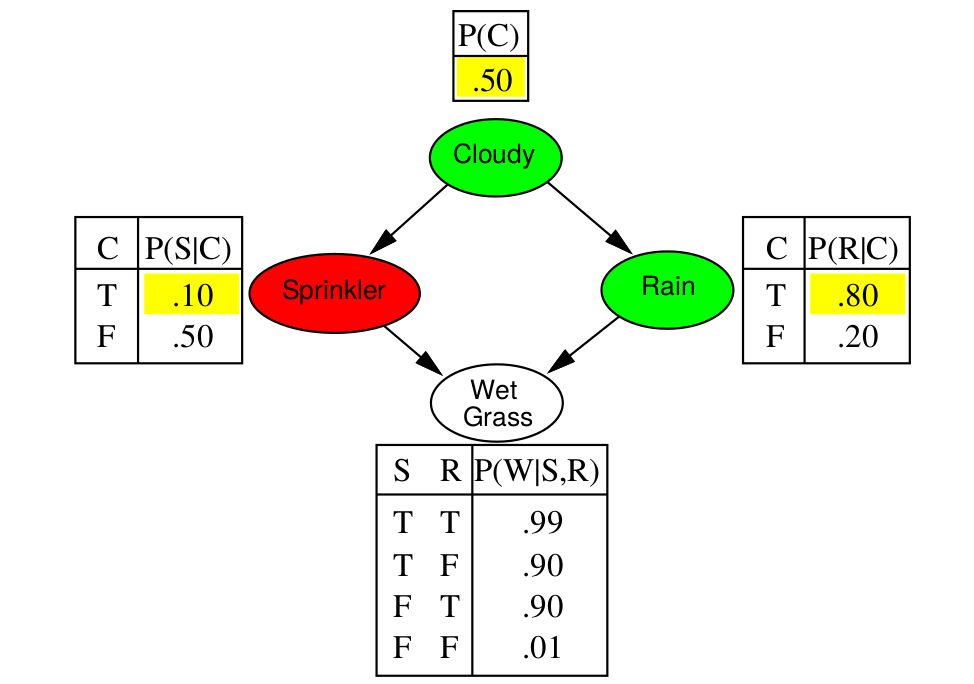]

---

class: middle
count: false

.center.width-90[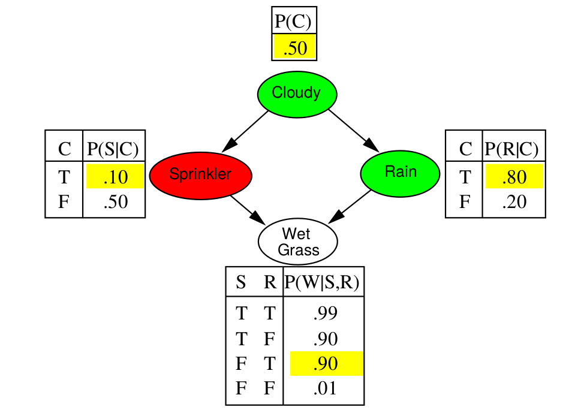]

---

class: middle
count: false

.center.width-90[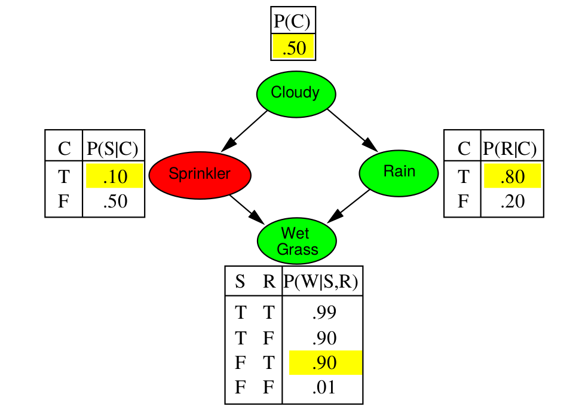]

---

class: middle

## Example

We will collect a bunch of samples from the Bayesian network:

$c, \lnot s, r, w$ 
$c, s, r, w$ 
$\lnot c, s, r, \lnot w$ 
$c, \lnot s, r, w$ 
$\lnot c, \lnot s, \lnot r, w$

If we want to know ${\bf P}(W)$:
- We have counts $\langle w:4, \lnot w:1 \rangle$
- Normalize to obtain $\hat{{\bf P}}(W) = \langle w:0.8, \lnot w:0.2 \rangle$
- $\hat{{\bf P}}(W)$ will get closer to the true distribution ${\bf P}(W)$ as we generate more samples.

---

class: middle

## Analysis

The probability that prior sampling generates a particular event is
$$S\_\text{PS}(x\_1, ..., x\_n) = \prod\_{i=1}^n P(x\_i | \text{parents}(X\_i)) = P(x\_1,...,x\_n)$$
i.e., the Bayesian network's joint probability.

Let $N\_\text{PS}(x\_1, ..., x\_n)$ denote the number of samples of an event. We
define the probability **estimate** $$\hat{P}(x\_1, ..., x\_n) = N\_\text{PS}(x\_1, ..., x\_n) / N.$$

---

class: middle

Then,
$$\begin{aligned}
\lim\_{N \to \infty} \hat{P}(x\_1,...,x\_n) &= \lim\_{N \to \infty} N\_\text{PS}(x\_1, ..., x\_n) / N \\\\
&= S\_\text{PS}(x\_1, ..., x\_n) \\\\
&= P(x\_1, ..., x\_n)
\end{aligned}$$
Therefore, prior sampling is *consistent*:
$$P(x\_1, ..., x\_n) \approx N\_\text{PS}(x\_1, ..., x\_n) / N$$

---

# Rejection sampling

Using prior sampling, an estimate $\hat{P}(x|e)$ can be formed from the proportion of samples $x$ **agreeing with the evidence** $e$ among all samples agreeing with the evidence.

   
.center.width-100[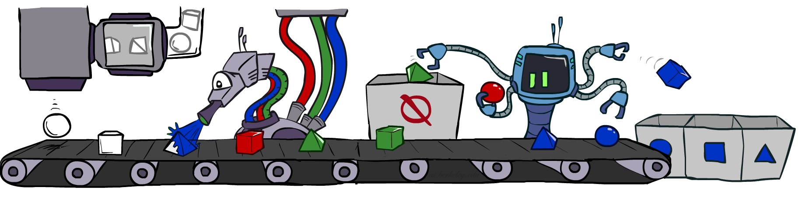]

.footnote[Image credits: [CS188](https://inst.eecs.berkeley.edu/~cs188/), UC Berkeley.]

---

class: middle

.center.width-100[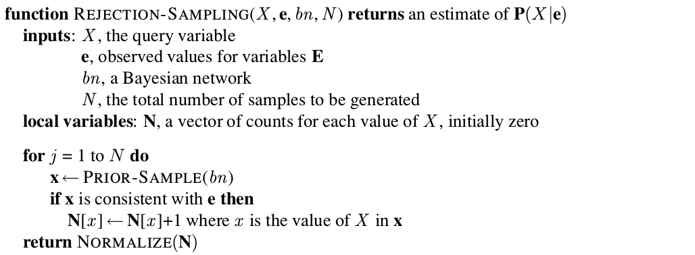]

---

class: middle

## Analysis

Let consider the posterior probability estimate $\hat{P}(x|e)$ formed by rejection sampling:

$$\begin{aligned}
\hat{P}(x|e) &= N\_\text{PS}(x,e) / N\_\text{PS}(e) \\\\
&= \frac{N\_\text{PS}(x,e)}{N} / \frac{N\_\text{PS}(e)}{N} \\\\
&\approx P(x,e) / P(e) \\\\
&= P(x|e)
\end{aligned}$$

Therefore, rejection sampling returns *consistent* posterior estimates.

- The standard deviation of the error in each probability is $O(1/\sqrt{n})$, where $n$ is the number of samples used in the estimate.
- **Problem**: many samples are rejected!
    - Hopelessly expensive if the evidence is unlikely, i.e. if $P(e)$ is small.
    - Evidence is not exploited when sampling.

---

# Likelihood weighting

Idea: *clamp* the evidence variables, sample the rest.
- Problem: the resulting sampling distribution is not consistent.
- Solution: **weight** by probability of evidence given parents.

   
.center.width-100[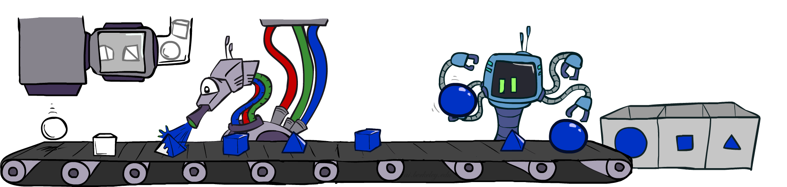]

.footnote[Image credits: [CS188](https://inst.eecs.berkeley.edu/~cs188/), UC Berkeley.]

---

class: middle

.center.width-100[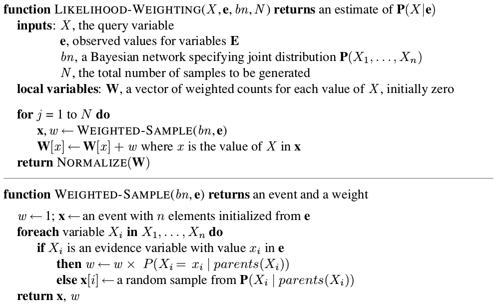]

???

Probability estimates are built by summing up weights instead of ones and normalizing.

---

class: middle

.center.width-100[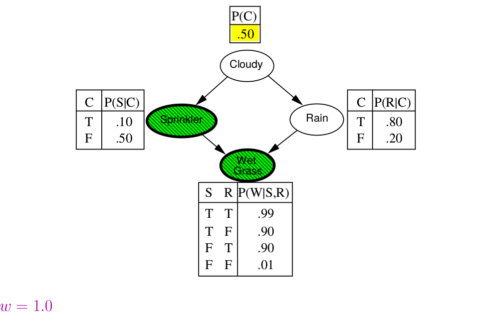]

---

class: middle
count: false

.center.width-100[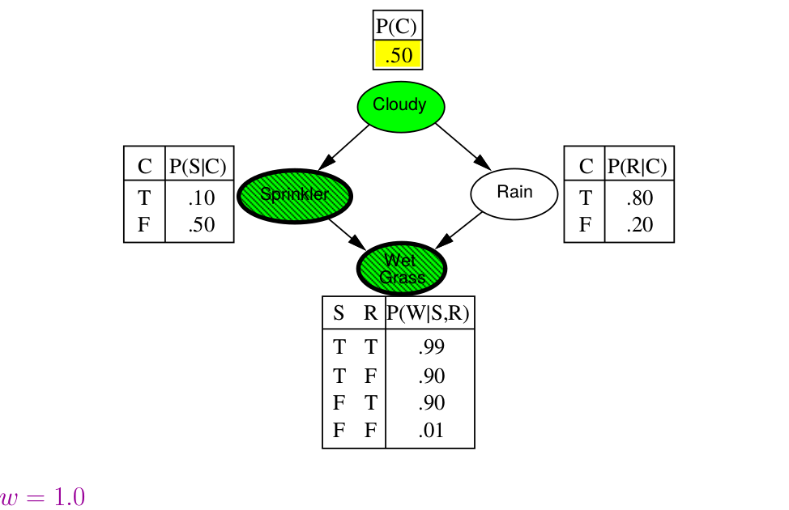]

---

class: middle
count: false

.center.width-100[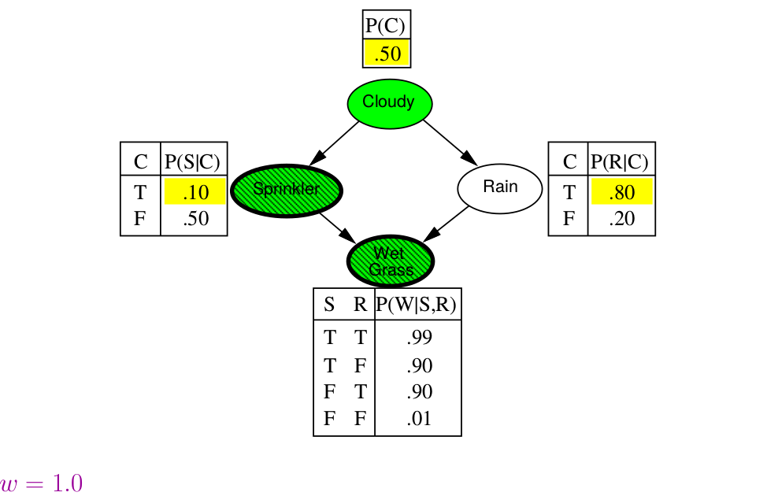]

---

class: middle
count: false

.center.width-100[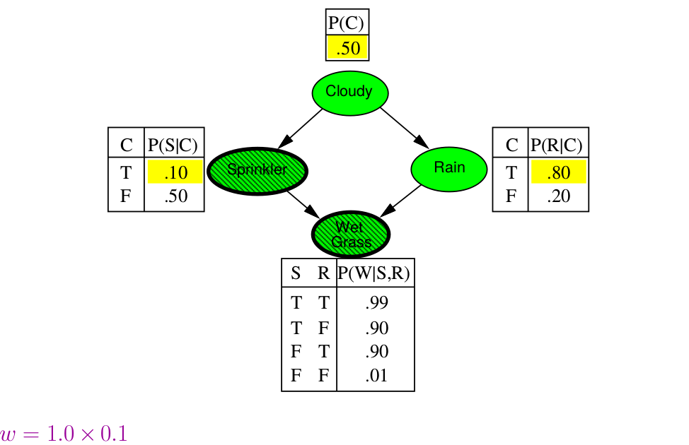]

---

class: middle
count: false

.center.width-100[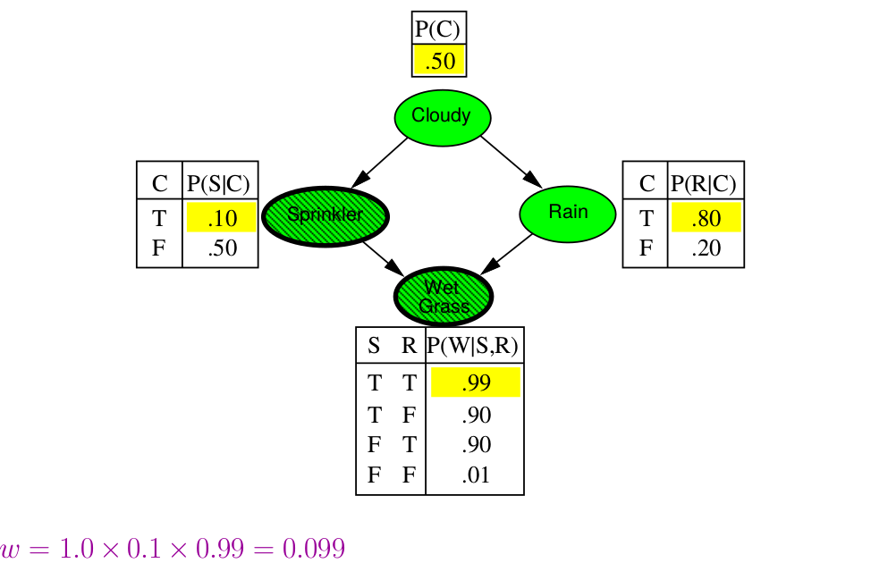]

---

class: middle

## Analysis

The sampling probability for an event with likelihood weighting is
$$S\_\text{WS}(x,e) = \prod\_{i=1}^l P(x\_i|\text{parents}(X\_i)),$$
where the product is over the non-evidence variables.
The weight for a given sample $x,e$ is
$$w(x,e) = \prod\_{i=1}^m P(e\_i|\text{parents}(E\_i)),$$
where the product is over the evidence variables.

The weighted sampling probability is
$$
\begin{aligned}
S\_\text{WS}(x,e) w(x,e) &= \prod\_{i=1}^l P(x\_i|\text{parents}(X\_i)) \prod\_{i=1}^m P(e\_i|\text{parents}(E\_i)) \\\\
&= P(x,e)
\end{aligned}
$$

---

class: middle

The estimated joint probability is computed as follows:

$$\begin{aligned}
\hat{P}(x,e) &= N\_\text{WS}(x,e) w(x,e) / N \\\\
&\approx S\_\text{WS}(x,e) w(x,e) \\\\
&= P(x,e)
\end{aligned}$$

From this, the estimated posterior probability is given by:
$$\begin{aligned}
\hat{P}(x|e) &= \hat{P}(x,e) / \hat{P}(e) \\\\
&\approx P(x,e) / P(e) = P(x|e).
\end{aligned}$$

Hence likelihood weighting returns *consistent* estimates.

---

class: middle

- Likelihood weighting is *helpful*:
    - The evidence is taken into account to generate a sample.
    - More samples will reflect the state of the world suggested by the evidence.
- Likelihood weighting **does not solve all problems**:
    - Performance degrades as the number of evidence variable increases.
    - The evidence influences the choice of downstream variables, but not upstream ones.
        - Ideally, we would like to consider the evidence when we sample each and every variable.

---

# Inference by Markov chain simulation

- **Markov chain Monte Carlo** (MCMC) algorithms are a family of sampling algorithms that generate samples through a Markov chain.
- They generate a sequence of samples by making random changes to a preceding sample, instead of generating each sample from scratch.
- Helpful to think of a Bayesian network as being in a particular *current state* specifying a value for each variable and generating a *next state* by making random changes to the current state.
- Metropolis-Hastings is one of the most famous MCMC methods, of which **Gibbs sampling** is a special case.

---

class: middle

## Gibbs sampling

- Start with an arbitrary instance $x\_1, ..., x\_n$ consistent with the evidence.
- Sample one variable at a time, conditioned on all the rest, but keep the evidence fixed.
- Keep repeating this for a long time.

 
.center.width-100[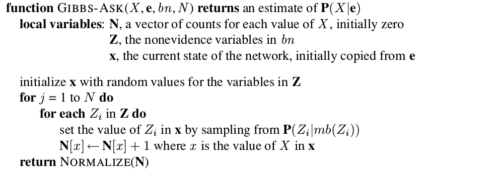]

---

class: middle

- Both upstream and downstream variables condition on evidence.
- In contrast, likelihood weighting only conditions on upstream evidence, and hence the resulting weights might be very small.

---

class: middle

## Example

.grid[
.kol-1-4[
1) Fix the evidence
]
.kol-1-4.width-100[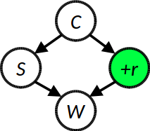]
.kol-1-4[
2) Randomly initialize the other variables
]
.kol-1-4.width-100[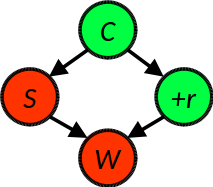]
]

3) Repeat
- Choose a non-evidence variable $X$.
- Resample $X$ from ${\bf P}(X|\text{all other variables})$.

.center.width-100[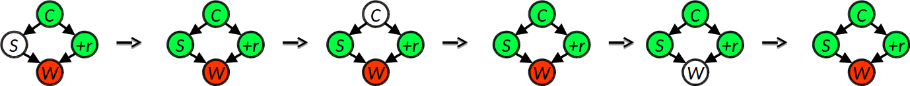]

---

class: middle

## Demo

See `code/lecture6-gibbs.ipynb`.

---

class: middle

## Rationale

The sampling process settles into a **dynamic equilibrium** in which the long-run fraction of time spent in each state is exactly proportional to its posterior probability.

See 14.5.2 for a technical proof.

---

# Summary

- Exact inference by variable elimination .
    - NP-complete on general graphs, but polynomial on polytrees.
    - space = time, very sensitive to topology.
- Approximate inference gives reasonable estimates of the true posterior probabilities in a network and can cope with much larger networks than can exact algorithms.
    - Likelihood weighting does poorly when there is lots of evidence.
    - Likelihood weighting and Gibbs sampling are generally insensitive to topology.
    - Convergence can be slow with probabilities close to 1 or 0.
    - Can handle arbitrary combinations of discrete and continuous variables.

---

class: end-slide, center
count: false

The end.

---

# References

- Cooper, Gregory F. "The computational complexity of probabilistic inference using Bayesian belief networks." Artificial intelligence 42.2-3 (1990): 393-405.
