class: middle, center, title-slide

# Introduction to Artificial Intelligence

Lecture 5: Probabilistic reasoning

  
Prof. Gilles Louppe 
[g.louppe@uliege.be](mailto:g.louppe@uliege.be)

???

R: move stuff from learning on parameter estimation (map, mle)
R: parameter estimation == setting P (Kolmogorov) from data and picking the best one

---

# Today

- Bayesian networks
    - Semantics
    - Construction
    - Independence relations
- Inference
- Parameter learning

.center.width-65[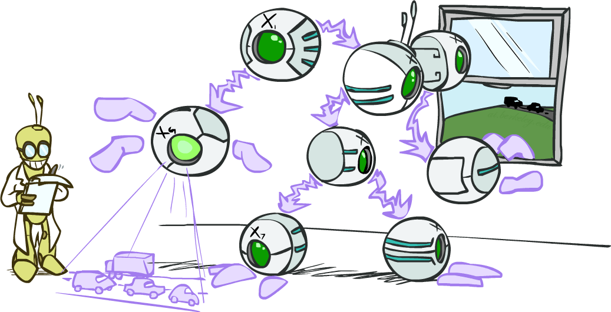]

.footnote[Image credits: [CS188](https://inst.eecs.berkeley.edu/~cs188/), UC Berkeley.]

---

class: middle

# Representing uncertain knowledge

---

class: middle

The explicit representation of the joint probability distribution grows exponentially with the number of variables.

*Independence* and *conditional independence* assumptions reduce the number of probabilities that need to be specified. They can be represented explicitly in the form of a **Bayesian network**.

---

# Bayesian networks

.grid[
.kol-3-4[

A Bayesian network is a .bold[directed acyclic graph] where
- each node corresponds to a random variable;
    - observed or unobserved
    - discrete or continuous
- each edge is directed and indicates a direct probabilistic dependency between two variables;
- each node $X_i$ is annotated with a conditional probability distribution ${\bf P}(X_i | \text{parents}(X_i))$ that defines the distribution of $X_i$ given its parents in the network.

]
.kol-1-4.width-100[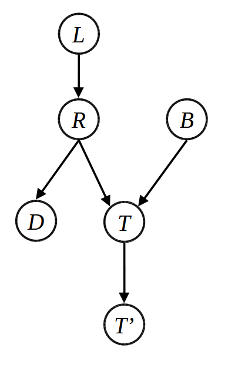]
]

???

In the simplest case, conditional distributions are represented as conditional probability tables (CPTs).

---

class: middle

.center.width-40[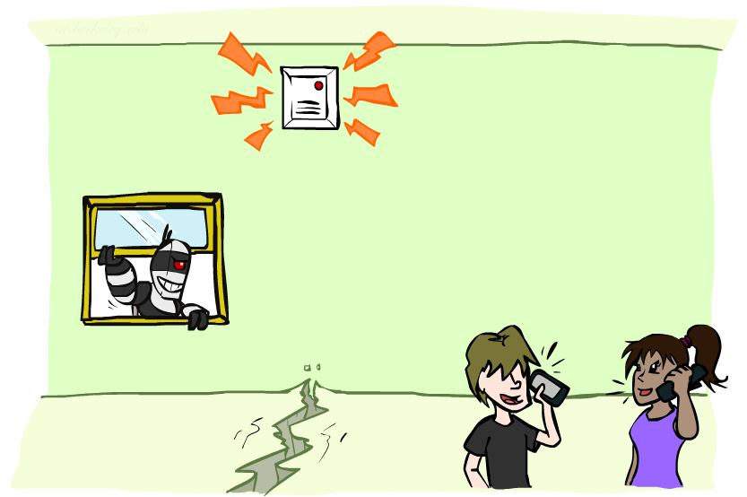]

## Example 1

- Variables: $\text{Burglar}$, $\text{Earthquake}$, $\text{Alarm}$, $\text{JohnCalls}$, $\text{MaryCalls}$.
- Network topology from "causal" knowledge:
    - A burglar can set the alarm off
    - An earthquake can set the alaram off
    - The alarm can cause Mary to call
    - The alarm can cause John to call

.footnote[Image credits: [CS188](https://inst.eecs.berkeley.edu/~cs188/), UC Berkeley.]

???

I am at work, neighbor John calls to say my alarm is ringing, but neighbor
Mary does not call. Sometimes it's set off by minor earthquakes.
Is there a burglar?

---

class: middle

.center.width-90[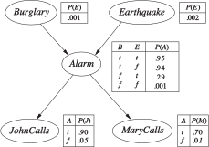]

???

Blackboard: example of calculation, as in the next slide.

---

# Semantics

A Bayesian network implicitly encodes the full joint distribution as a product of local distributions, that is

$$P(x\_1, ..., x\_n) = \prod\_{i=1}^n P(x_i | \text{parents}(X_i)).$$

- By the chain rule, $P(x\_1, ..., x\_n) = \prod\_{i=1}^n P(x\_i | x\_1, ..., x\_{i-1})$.
- Provided that we assume conditional independence of $X\_i$ with its predecessors in the ordering given the parents, and provided $\text{parents}(X\_i) \subseteq \\{ X\_1, ..., X\_{i-1}\\}$:
$$P(x\_i | x\_1, ..., x\_{i-1}) = P(x\_i | \text{parents}(X_i))$$
- Therefore, $P(x\_1, ..., x\_n) = \prod\_{i=1}^n P(x_i | \text{parents}(X_i))$.

---

class: middle

## Example 1 (continued)

$$
\begin{aligned}
P(j, m, a, \lnot b, \lnot e) &= P(j|a) P(m|a)P(a|\lnot b,\lnot e)P(\lnot b)P(\lnot e)\\\\
&= 0.9 \times 0.7 \times 0.001 \times 0.999 \times 0.998 \\\\
&\approx 0.00063
\end{aligned}
$$

---

class: middle

## Example 2

.grid[
.kol-1-2[.width-90[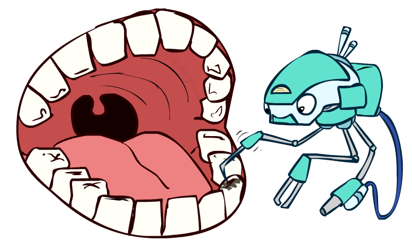]]
.kol-1-2[.width-100[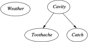]]
]

By construction, the topology of the network encodes conditional independence assertions. Each variable is independent of its non-descendants given its parents. E.g.,
- $\text{Weather}$ is independent of the other variables.
- $\text{Toothache}$ and $\text{Catch}$ are conditionally independent given $\text{Cavity}$.

.footnote[Image credits: [CS188](https://inst.eecs.berkeley.edu/~cs188/), UC Berkeley.]

???

A dentist is examining a patient's teeth. The patient has a cavity, but the dentist does not know this. However, the patient has a toothache, which the dentist observes.

---

class: middle

.grid.center[
.kol-1-3[.width-80[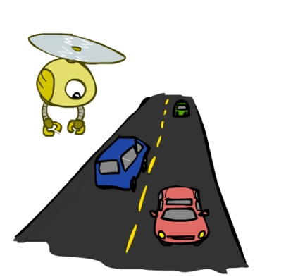]]
.kol-2-3[.width-90[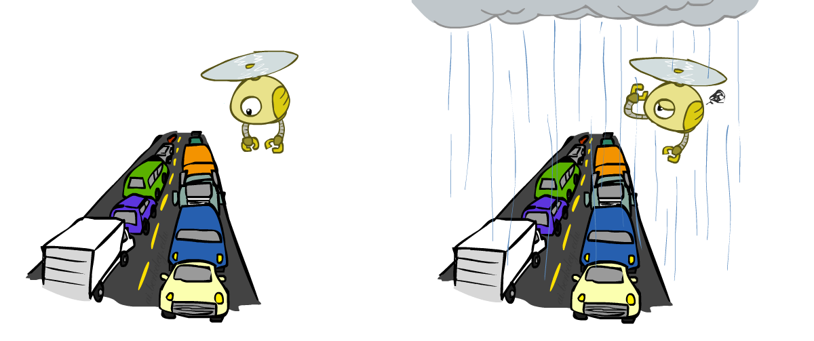]  ]
]

## Example 3

.footnote[Image credits: [CS188](https://inst.eecs.berkeley.edu/~cs188/), UC Berkeley.]

.grid.center[
.kol-1-5[.width-60[]]
.kol-2-5[
${\bf P}(R)$

| $R$ | $P$ |
| --- | --- | --- |
| $\text{r}$ | $0.25$ |
| $\lnot\text{r}$ | $0.75$ |
]
.kol-2-5[
${\bf P}(T|R)$

| $R$ | $T$ | $P$ |
| --- | --- | --- |
| $\text{r}$ | $\text{t}$ | $0.75$ |
| $\text{r}$ | $\lnot\text{t}$ | $0.25$ |
| $\lnot\text{r}$ | $\text{t}$ | $0.5$ |
| $\lnot\text{r}$ | $\lnot\text{t}$ | $0.5$ |
]
]

???

Causal model

---

class: middle

.center.width-60[]

## Example 3 (bis)

.grid.center[
.kol-1-5[.width-60[]]
.kol-2-5[
${\bf P}(T)$

| $T$ | $P$ |
| --- | --- | --- |
| $\text{t}$ | $9/16$ |
| $\lnot\text{t}$ | $7/16$ |
]
.kol-2-5[
${\bf P}(R|T)$

| $T$ | $R$ | $P$ |
| --- | --- | --- |
| $\text{t}$ | $\text{r}$ | $1/3$ |
| $\text{t}$ | $\lnot\text{r}$ | $2/3$ |
| $\lnot\text{t}$ | $\text{r}$ | $1/7$ |
| $\lnot\text{t}$ | $\lnot\text{r}$ | $6/7$ |
]
]

.footnote[Image credits: [CS188](https://inst.eecs.berkeley.edu/~cs188/), UC Berkeley.]

???

Diagnostic model

---

# Construction

Bayesian networks can be constructed in any order, provided that the conditional independence assertions are respected.

## Algorithm

1. Choose some **ordering** of the variables $X\_1, ..., X\_n$.
2. For $i=1$ to $n$:
    1. Add $X\_i$ to the network.
    2. Select a minimal set of parents from $X\_1, ..., X\_{i-1}$ such that $P(x\_i | x\_1, ..., x\_{i-1}) = P(x\_i | \text{parents}(X_i))$.
    3. For each parent, insert a link from the parent to $X\_i$.
    4. Write down the CPT.

---

class: middle

.center.width-100[
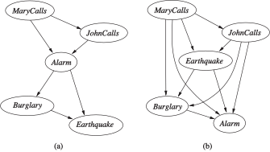
]

.question[Do these networks represent the same distribution? Are they as compact?]

???

For the left network:

- P (J|M ) = P (J)? No
- P (A|J, M ) = P (A|J)? P (A|J, M ) = P (A)? No
- P (B|A, J, M ) = P (B|A)? Yes
- P (B|A, J, M ) = P (B)? No
- P (E|B, A, J, M ) = P (E|A)? No
- P (E|B, A, J, M ) = P (E|A, B)? Yes

---

# Independence relations

Since the topology of a Bayesian network encodes conditional independence assertions, it can be used to answer questions about the independence of variables given some evidence.

   

.center.width-45[]

.center[Example: Are $X$ and $Z$ necessarily independent?]

---

class: middle

## Cascades

.grid[
.kol-1-2[
Is $X$ independent of $Z$? No.

Counter-example:
- Low pressure causes rain causes traffic, high pressure causes no rain causes no traffic.
- In numbers:
    - $P(y|x)=1$,
    - $P(z|y)=1$,
    - $P(\lnot y|\lnot x)=1$,
    - $P(\lnot z|\lnot y)=1$
]
.kol-1-2.center[.width-100[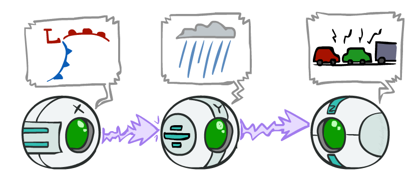]

$X$: low pressure,
$Y$: rain,
$Z$: traffic.

$P(x,y,z)=P(x)P(y|x)P(z|y)$]
]

.footnote[Image credits: [CS188](https://inst.eecs.berkeley.edu/~cs188/), UC Berkeley.]

---

class: middle

.grid[
.kol-1-2[
Is $X$ independent of $Z$, given $Y$? Yes.

$$\begin{aligned}
P(z|x,y) &= \frac{P(x,y,z)}{P(x,y)} \\\\
&= \frac{P(x)P(y|x)P(z|y)}{P(x)P(y|x)} \\\\
&= P(z|y)
\end{aligned}$$

We say that the evidence along the cascade **"blocks"** the influence.

]
.kol-1-2.center[.width-100[]

$X$: low pressure,
$Y$: rain,
$Z$: traffic.

$P(x,y,z)=P(x)P(y|x)P(z|y)$]
]

.footnote[Image credits: [CS188](https://inst.eecs.berkeley.edu/~cs188/), UC Berkeley.]

---

class: middle

.grid[
.kol-1-2[
## Common parent

Is $X$ independent of $Z$? No.

Counter-example:
- Project due causes both forums busy and lab full.
- In numbers:
    - $P(x|y)=1$,
    - $P(\lnot x|\lnot y)=1$,
    - $P(z|y)=1$,
    - $P(\lnot z|\lnot y)=1$
]
.kol-1-2.center[.width-80[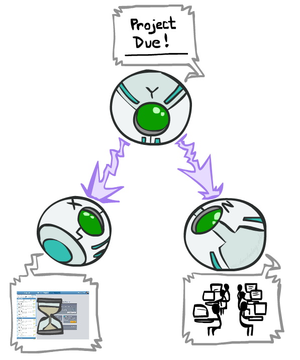]

$X$: forum busy,
$Y$: project due,
$Z$: lab full.

$P(x,y,z)=P(y)P(x|y)P(z|y)$]
]

.footnote[Image credits: [CS188](https://inst.eecs.berkeley.edu/~cs188/), UC Berkeley.]

---

class: middle

.grid[
.kol-1-2[
Is $X$ independent of $Z$, given $Y$? Yes

$$\begin{aligned}
P(z|x,y) &= \frac{P(x,y,z)}{P(x,y)} \\\\
&= \frac{P(y)P(x|y)P(z|y)}{P(y)P(x|y)} \\\\
&= P(z|y)
\end{aligned}$$

Observing the parent blocks the influence between the children.
]
.kol-1-2.center[.width-80[]

$X$: forum busy,
$Y$: project due,
$Z$: lab full.

$P(x,y,z)=P(y)P(x|y)P(z|y)$]
]

.footnote[Image credits: [CS188](https://inst.eecs.berkeley.edu/~cs188/), UC Berkeley.]

---

class: middle

.grid[
.kol-1-2[
## v-structures

Are $X$ and $Y$ independent? Yes.
- The ballgame and the rain cause traffic, but they are not correlated.
- (Prove it!)

Are $X$ and $Y$ independent given $Z$? No!
- Seeing traffic puts the rain and the ballgame in competition as explanation.
- This is **backwards** from the previous cases. Observing a child node *activates* influence between parents.
]
.kol-1-2.center[.width-80[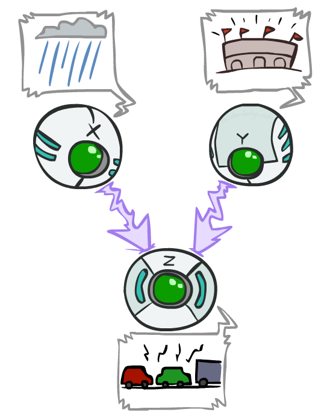]

$X$: rain,
$Y$: ballgame,
$Z$: traffic.

$P(x,y,z)=P(x)P(y)P(z|x,y)$]
]

.footnote[Image credits: [CS188](https://inst.eecs.berkeley.edu/~cs188/), UC Berkeley.]

---

class: middle

## d-separation

Let us assume a complete Bayesian network.
Are $X\_i$ and $X\_j$ conditionally independent given evidence $Z\_1=z\_1, ..., Z\_m=z\_m$?

Consider all (undirected) paths from $X\_i$ to $X\_j$:
- If one or more active path, then independence is not guaranteed.
- Otherwise (i.e., all paths are inactive), then independence is guaranteed.

---

class: middle

.grid[
.kol-2-3[

A path is **active** if each triple along the path is active:
- Cascade $A \to B \to C$ where $B$ is unobserved (either direction).
- Common parent $A \leftarrow B \rightarrow C$ where $B$ is unobserved.
- v-structure $A \rightarrow B \leftarrow C$ where $B$ or one of its descendents is observed.

]
.kol-1-3.width-100[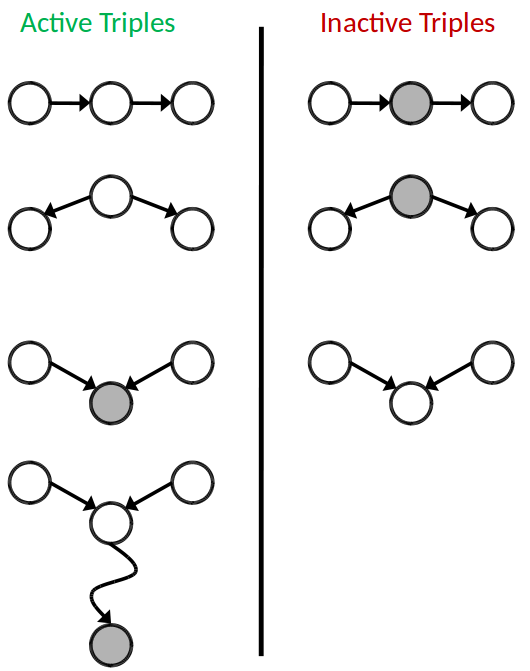]
]

.footnote[Image credits: [CS188](https://inst.eecs.berkeley.edu/~cs188/), UC Berkeley.]

---

class: middle

.grid[
.kol-1-2[
## Example

- $L \perp T' | T$?
- $L \perp B$?
- $L \perp B|T$?
- $L \perp B|T'$?
- $L \perp B|T, R$?

]
.kol-1-2.width-80.center[]
]

???

- Yes
- Yes
- (maybe)
- (maybe)
- Yes

---

exclude: true
class: middle

## Local semantics

.center.width-60[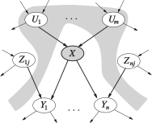]

A node $X$ is conditionally independent to its non-descendants (the $Z_{ij}$) given its parents (the $U_i$).

---

exclude: true
class: middle

## Global semantics

.center.width-60[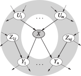]

A node $X$ is conditionally independent of all other nodes in the network given its Markov blanket.

---

class: middle

# Inference

---

class: middle

Inference is concerned with the problem .bold[computing a marginal and/or a conditional probability distribution] from a joint probability distribution:

.grid[
.kol-1-3.center[Simple queries:]
.kol-2-3[${\bf P}(X\_i|e)$]
]
.grid[
.kol-1-3.center[Conjunctive queries:]
.kol-2-3[${\bf P}(X\_i,X\_j|e)={\bf P}(X\_i|e){\bf P}(X\_j|X\_i,e)$]
]
.grid[
.kol-1-3.center[Most likely explanation:]
.kol-2-3[$\arg \max_q P(q|e)$]
]
.grid[
.kol-1-3.center[Optimal decisions:]
.kol-2-3[$\arg \max\\\_a \mathbb{E}\_{p(s'|s,a)} \left[ V(s') \right]$]
]

.center.width-30[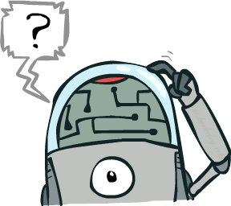]

.footnote[Image credits: [CS188](https://inst.eecs.berkeley.edu/~cs188/), UC Berkeley.]

???

Explain what $\arg \max$ means.

Insist on the importance of inference. Inference <=> reasoning.

---

# Inference by enumeration

Start from the joint distribution ${\bf P}(Q, E\_1, ..., E\_k, H\_1, ..., H\_r)$.

1. Select the entries consistent with the evidence  $E_1, ..., E_k = e_1, ..., e_k$.
2. Marginalize out the hidden variables to obtain the joint of the query and the evidence variables:
$${\bf P}(Q,e\_1,...,e\_k) = \sum\_{h\_1, ..., h\_r} {\bf P}(Q, h\_1, ..., h\_r, e\_1, ..., e\_k).$$
3. Normalize:
 
$$\begin{aligned}
Z &= \sum_q P(q,e_1,...,e_k) \\\\
{\bf P}(Q|e_1, ..., e_k) &= \frac{1}{Z} {\bf P}(Q,e_1,...,e_k)
\end{aligned}$$

---

class: middle

.width-25.center[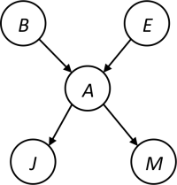]

Consider the alarm network and the query ${\bf P}(B|j,m)$. We have
$$\begin{aligned}
{\bf P}(B|j,m) &= \frac{1}{Z} \sum\_e \sum\_a {\bf P}(B,j,m,e,a) \\\\
&\propto \sum\_e \sum\_a {\bf P}(B,j,m,e,a).
\end{aligned}$$
Using the Bayesian network, the full joint entries can be rewritten as the product of CPT entries 
$$\begin{aligned}
{\bf P}(B|j,m) &\propto \sum\_e \sum\_a {\bf P}(B)P(e){\bf P}(a|B,e)P(j|a)P(m|a).
\end{aligned}$$

???

&\propto P(B) \sum\_e P(e) \sum\_a P(a|B,e)P(j|a)P(m|a)

---

class: middle

.center.width-80[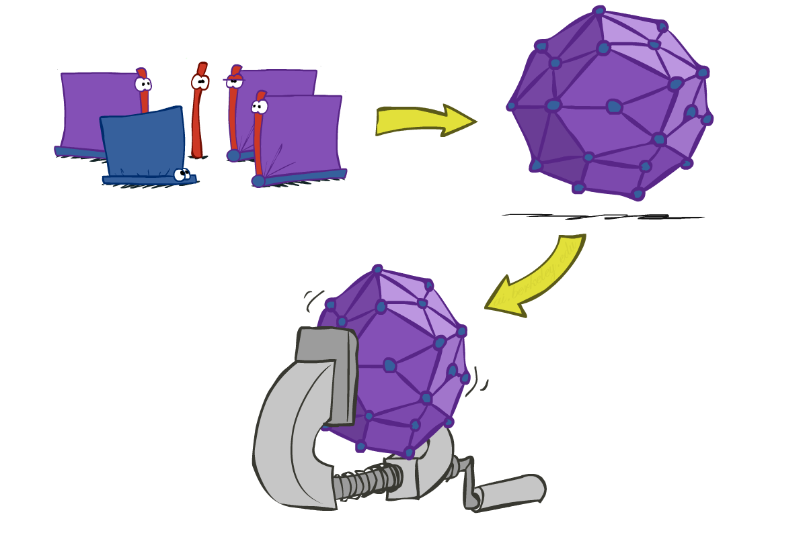]

Inference by enumeration is slow because the whole joint distribution is joined up before summing out the hidden variables.

.footnote[Image credits: [CS188](https://inst.eecs.berkeley.edu/~cs188/), UC Berkeley.]

---

class: middle

Factors that do not depend on the variables in the summations can be factored out, which means that marginalization does not necessarily have to be done at the end, hence saving some computations.

For the alarm network, we have
$$\begin{aligned}
{\bf P}(B|j,m) &\propto \sum\_e \sum\_a {\bf P}(B)P(e){\bf P}(a|B,e)P(j|a)P(m|a) \\\\
&= {\bf P}(B) \sum\_e P(e) \sum\_a {\bf P}(a|B,e)P(j|a)P(m|a).
\end{aligned}$$

---

class: middle

.center.width-100[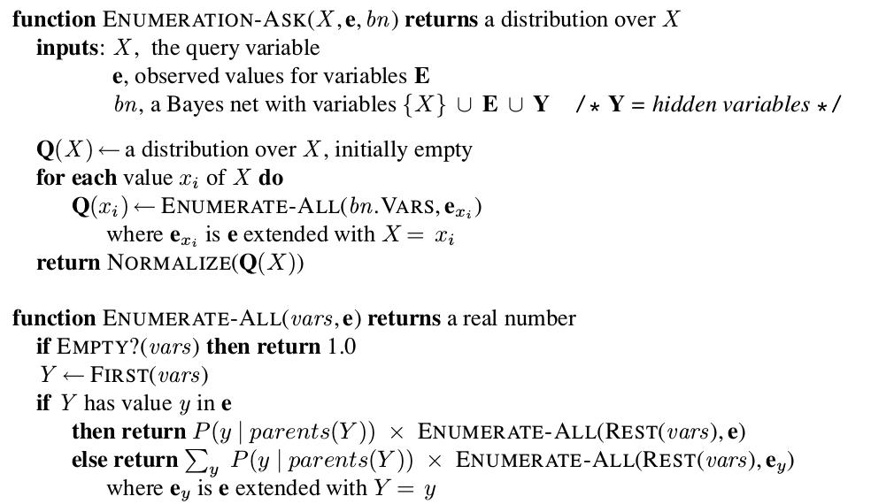]

Same complexity as DFS: $O(n)$ in space, $O(d^n)$ in time.

???

- $n$ is the number of variables.
- $d$ is the size of their domain.

---

class: middle

## Evaluation tree for $P(b|j,m)$

.center.width-80[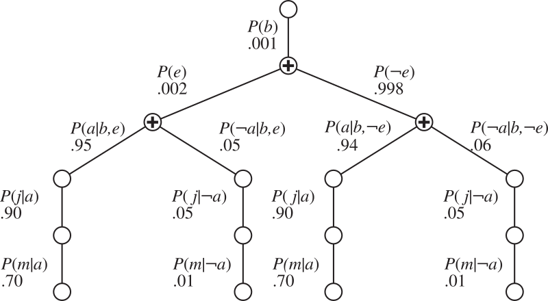]

Despite the factoring, inference by enumeration is still **inefficient**. There are repeated computations!
- e.g., $P(j|a)P(m|a)$ is computed twice, once for $e$ and once for $\lnot e$.
- These can be avoided by storing *intermediate results*.

???

Inefficient because the product is evaluated left-to-right, in a DFS manner.

---

# Inference by variable elimination

The .bold[Variable Elimination] algorithm carries out summations right-to-left and stores intermediate factors to avoid recomputations.
The algorithm interleaves:
- Joining sub-tables
- Eliminating hidden variables

 
.center.width-80[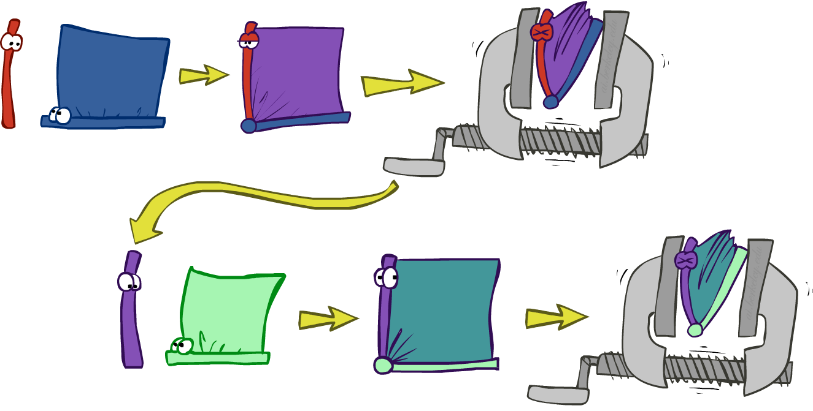]

.footnote[Image credits: [CS188](https://inst.eecs.berkeley.edu/~cs188/), UC Berkeley.]

---

class: middle

## Variable Elimination

Query: ${\bf P}(Q|e\_1, ..., e\_k)$.

1. Start with the initial factors (the local CPTs, instantiated by the evidence).
2. While there are still hidden variables:
    1. Pick a hidden variable $H$
    2. Join all factors mentioning $H$
    3. Eliminate H
3. Join all remaining factors
4. Normalize

---

class: middle

## Factors

- Each **factor $\mathbf{f}_i$** is a multi-dimensional array indexed by the values of its argument variables. E.g.:
.grid[
.kol-1-2[
$$
\begin{aligned}
\mathbf{f}\_4 &= \mathbf{f}\_4(A) = \left(\begin{matrix}
P(j|a) \\\\
P(j|\lnot a) \end{matrix}\right)
= \left(\begin{matrix}
0.90 \\\\
0.05 \end{matrix}\right) \\\\
\mathbf{f}\_4(a) &= 0.90 \\\\
\mathbf{f}\_4(\lnot a) &= 0.5
\end{aligned}$$
]
]
- Factors are initialized with the CPTs annotating the nodes of the Bayesian network, conditioned on the evidence.

---

class: middle

## Join

The *pointwise product* $\times$, or **join**, of two factors $\mathbf{f}_1$ and $\mathbf{f}_2$ yields a new factor $\mathbf{f}\_3$.
- Exactly like a **database join**!
- The variables of $\mathbf{f}\_3$ are the *union* of the variables in $\mathbf{f}_1$ and $\mathbf{f}_2$.
- The elements of $\mathbf{f}\_3$ are given by the product of the corresponding elements in $\mathbf{f}_1$ and $\mathbf{f}_2$.

.center.width-100[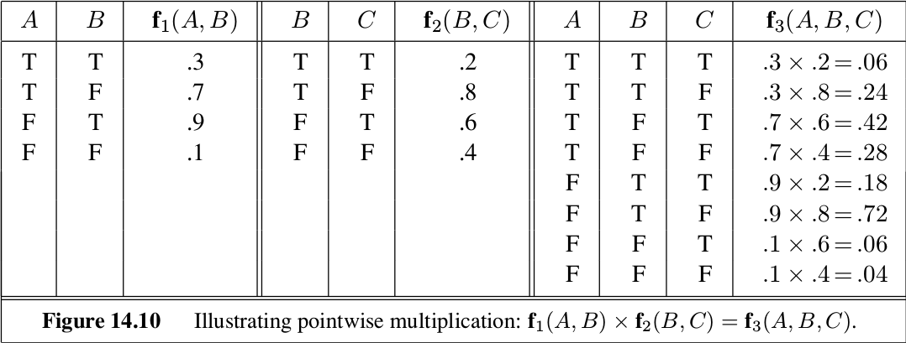]

---

class: middle

## Elimination

*Summing out*, or **eliminating**, a variable from a factor is done by adding up the sub-arrays formed by fixing the variable to each of its values in turn.

For example, to sum out $A$ from $\mathbf{f}\_3(A, B, C)$, we write:

$$\begin{aligned}
\mathbf{f}(B,C) &= \sum\_a \mathbf{f}\_3(a, B, C) = \mathbf{f}\_3(a, B, C) + \mathbf{f}\_3(\lnot a, B, C) \\\\
&= \left(\begin{matrix}
0.06 & 0.24 \\\\
0.42 & 0.28
\end{matrix}\right) + \left(\begin{matrix}
0.18 & 0.72 \\\\
0.06 & 0.04
\end{matrix}\right) = \left(\begin{matrix}
0.24 & 0.96 \\\\
0.48 & 0.32
\end{matrix}\right)
\end{aligned}$$

---

class: middle, center

.center.width-25[]

(blackboard example for $P(B|j,m)$)

---

class: middle

## Relevance

Consider the query ${\bf P}(J|b)$:
$${\bf P}(J|b) \propto P(b) \sum_e P(e) \sum\_a P(a|b,e) {\bf P}(J|a) \sum\_m P(m|a)$$
- $\sum_m P(m|a) = 1$, therefore $M$ is **irrelevant** for the query.
- In other words, ${\bf P}(J|b)$ remains unchanged if we remove $M$ from the network.

.pull-right[]

.italic[Theorem.] $H$ is irrelevant for ${\bf P}(Q|e)$ unless $H \in \text{ancestors}(\\\{Q\\\} \cup E)$.

---

class: middle

## Complexity

.center.width-50[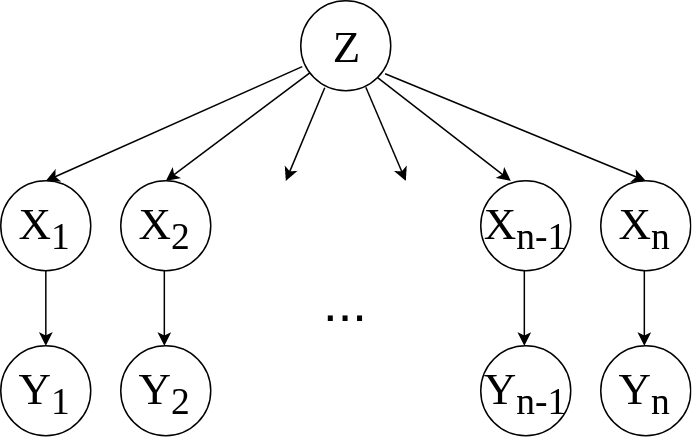]

Consider the query ${\bf P}(X\_n|y\_1,...,y\_n)$.

Work through the two elimination orderings:
- $Z, X\_1, ..., X\_{n-1}$
- $X\_1, ..., X\_{n-1}, Z$

What is the size of the maximum factor generated for each of the orderings?
- Answer: $2^{n+1}$ vs. $2^2$ (assuming boolean values)

---

class: middle

The computational and space complexity of variable elimination is determined by the largest factor.
- The elimination *ordering* can greatly affect the size of the largest factor.
- The optimal ordering is **NP-hard** to find. There is no known polynomial-time algorithm to find it.

---

# Approximate inference

Exact inference is **intractable** for most probabilistic models of practical interest.
(e.g., involving many variables, continuous and discrete, undirected cycles, etc).

We must resort to **approximate** inference algorithms:
- Sampling methods: produce answers by repeatedly generating random numbers from a distribution of interest.
- Variational methods: formulate inference as an optimization problem.
- Belief propagation methods: formulate inference as a message-passing algorithm.
- Machine learning methods: learn an approximation of the target distribution from training examples.

---

class: middle

# Parameter learning

---

class: middle

When modeling a domain, we must choose a probabilistic model such as a Bayesian network. However, specifying the individual probabilities is often difficult. 

A workaround is to use a **parameterized** family ${\bf P}(X | \theta)$ of models, and *estimate* the parameters $\theta$ from data.

---

class: middle

.center.width-100[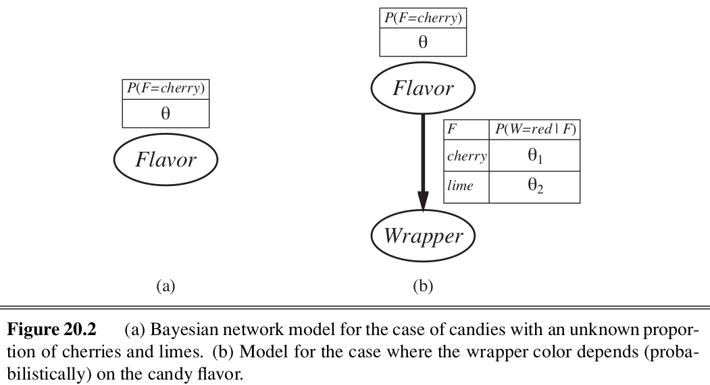]

---

# Maximum likelihood estimation

Suppose we have a set of $N$ i.i.d. observations $\mathbf{d} = \{x\_1, ..., x\_N\}$.

The *likelihood* of the parameters $\theta$ is the probability of the data given the parameters
$$P(\mathbf{d}|\theta) = \prod\_{j=1}^N P(x\_j | \theta).$$

The **maximum likelihood estimate** (MLE) $\theta^\*$  of the parameters is the value of $\theta$ that maximizes the likelihood:
$$\theta^\* = \arg \max\_\theta P(\mathbf{d}|\theta).$$

---

class: middle

In practice,
1. Write down the log-likelihood $L$ of the parameters $\theta$.
2. Write down the derivative of the log likelihood of the parameters $\theta$.
3. Find the parameter values $\theta^\*$ such that the derivatives are zero (and check whether the Hessian is negative definite).

???

Note that:
- evaluating the likelihood may require summing over hidden variables, i.e., inference.
- finding $\theta^\*$ may be hard; modern optimization techniques help.

---

class: middle

## Case (a)

What is the fraction $\theta$ of cherry candies?

Suppose we unwrap $N$ candies, and get $c$ cherries and $l=N-c$ limes.
These are i.i.d. observations, therefore
$$P(\mathbf{d}|\theta) = \prod\_{j=1}^N P(x\_j | \theta) = \theta^c (1-\theta)^l.$$
Maximize this w.r.t. $\theta$, which is easier for the log-likelihood:
$$\begin{aligned}
L(\mathbf{d}|\theta) &= \log P(\mathbf{d}|\theta) = c \log \theta + l \log(1-\theta) \\\\
\frac{\partial L(\mathbf{d}|\theta)}{\partial \theta} &= \frac{c}{\theta} - \frac{l}{1-\theta}=0.
\end{aligned}$$
Hence $\theta=\frac{c}{N}$.
Instead, we can use a **prior** distribution $P(\theta)$ over the parameters, and compute the **posterior** distribution $P(\theta|\mathbf{d})$. Then, as data arrives, we can update the posterior distribution.
???

Highlight that using the empirical estimate as an estimator of the mean can be viewed as consequence of
- deciding on a probabilistic model
- maximum likelihood estimation under this model

Seems sensible, but causes problems with $0$ counts!

---

class: middle

## Case (b)

Red and green wrappers depend probabilistically on flavor.
E.g., the likelihood for a cherry candy in green wrapper is
$$\begin{aligned}
&P(\text{cherry}, \text{green}|\theta,\theta\_1, \theta\_2) \\\\
&= P(\text{cherry}|\theta,\theta\_1, \theta\_2) P(\text{green}|\text{cherry}, \theta,\theta\_1, \theta\_2) \\\\
&= \theta (1-\theta\_1).
\end{aligned}$$

The likelihood for the parameters, given $N$ candies, $r\_c$ red-wrapped cherries, $g\_c$ green-wrapped cherries, etc., is
$$\begin{aligned}
P(\mathbf{d}|\theta,\theta\_1, \theta\_2) =&\,\, \theta^c (1-\theta)^l \theta\_1^{r\_c}(1-\theta\_1)^{g\_c} \theta\_2^{r\_l} (1-\theta\_2)^{g\_l} \\\\
L =&\,\, c \log \theta + l \log(1-\theta)  +  \\\\
   &\,\, r\_c \log \theta\_1 + g\_c \log(1-\theta\_1) + \\\\
   &\,\, r\_l \log \theta\_2 + g\_l \log(1-\theta\_2).
\end{aligned}$$

---

class: middle

The derivatives of $L$ yield 
$$\begin{aligned}
\frac{\partial L}{\partial \theta} &= \frac{c}{\theta} - \frac{l}{1-\theta} = 0 \Rightarrow \theta = \frac{c}{c+l} \\\\
\frac{\partial L}{\partial \theta\_1} &= \frac{r\_c}{\theta\_1} - \frac{g\_c}{1-\theta\_1} = 0 \Rightarrow \theta\_1 = \frac{r\_c}{r\_c + g\_c} \\\\
\frac{\partial L}{\partial \theta\_2} &= \frac{r\_l}{\theta\_2} - \frac{g\_l}{1-\theta\_2} = 0 \Rightarrow \theta\_2 = \frac{r\_l}{r\_l + g\_l}.
\end{aligned}$$

???

Again, results coincide with intuition.

---

# Bayesian parameter learning

With small datasets, maximum likelihood estimation can lead to overfitting.

Instead we can treat parameter learning as a **Bayesian inference** problem, and use a **prior** distribution ${\bf P}(\theta)$ over the parameters.

Then, as data arrives, we can update our beliefs about the parameters to obtain the **posterior** distribution ${\bf P}(\theta|\mathbf{d})$.

???

E.g., if we unwrap 1 candy and get 1 cherry, then the MLE is $\theta^\*=1$, which is not a reasonable conclusion.

---

class: middle

## Case (a)

What is the fraction $\theta$ of cherry candies?

We assume a Beta prior $$P(\theta) = \text{Beta}(\theta|a,b) = \frac{1}{Z} \theta^{a-1} (1-\theta)^{b-1}$$
where $Z$ is a normalization constant. 

Then, observing a cherry candy yields the posterior
$$\begin{aligned}
P(\theta|\text{cherry}) &\propto P(\text{cherry}|\theta) P(\theta) \\\\
&= \theta \text{Beta}(\theta|a,b) \\\\
&= \theta (1-\theta)^{b-1} \theta^{a-1} (1-\theta)^{b-1} \\\\
&= \theta^a (1-\theta)^{b-1} \\\\
&= \text{Beta}(\theta|a+1,b).
\end{aligned}$$

???

Show a live demo!

---

class: middle

## Maximum a posteriori estimation

When the posterior cannot be computed analytically, we can use **maximum a posteriori** (MAP) estimation, which consists in approximating the posterior with the point estimate $\theta^\*$ that maximizes the posterior distribution, i.e.,
$$\theta^\* = \arg \max\_\theta P(\theta|\mathbf{d}) = \arg \max\_\theta P(\mathbf{d}|\theta) P(\theta).$$

---

# Summary

- A Bayesian Network specifies a full joint distribution. BNs are often exponentially smaller than an explicitly enumerated joint distribution.
- The topology of a Bayesian network encodes conditional independence assumptions between random variables.
- Inference is the problem of computing a marginal and/or a conditional probability distribution from a joint probability distribution.
    - Exact inference is possible for simple Bayesian networks, but is intractable for most probabilistic models of practical interest.
    - Approximate inference algorithms are used in practice.
- Parameters of a Bayesian network can be learned from data using maximum likelihood estimation or Bayesian inference.

---

class: end-slide, center
count: false

The end.
