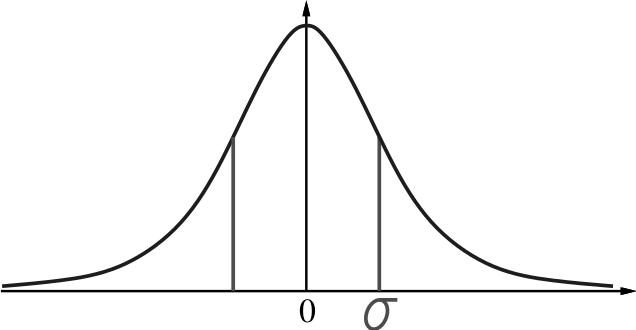
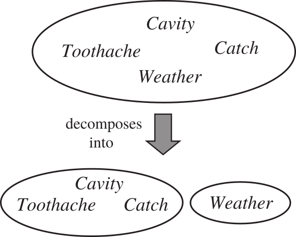
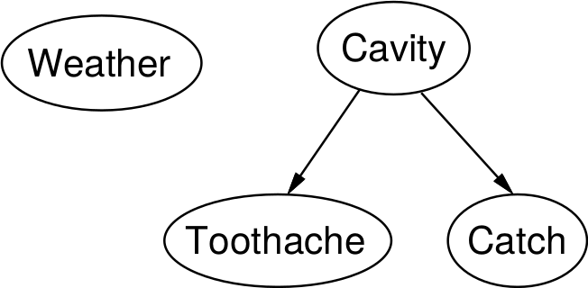
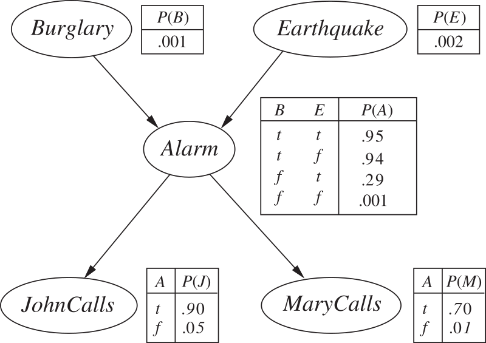

class: middle, center, title-slide

# Introduction to Artificial Intelligence

Lecture 5: Probabilistic reasoning I

---

# Today

.grid[
.col-1-2[
- *Probability*:
    - Random variables
    - Joint and marginal distributions
    - Conditional distributions
    - Product rule, Chain rule, Bayes' rule
    - Inference
- *Bayesian networks*:
    - X, Y , Z
]
.col-1-2[

]
]

**You will need these concepts a lot! (Now and in future courses)**

.footnote[Credits: UC Berkeley, [CS188](http://ai.berkeley.edu/lecture_slides.html)]

---

class: middle, center

# Quantifying uncertainty

---

# Inference in Ghostbusters

.center.width-40[]

- A ghost is in the grid somewhere.
- Sensor readings tell how close a square is to the ghost.
    - On the ghost: red
    - 1 or 2 away: orange
    - 3 or 4 away: yellow
    - 5+ away" green
- Sensors are *noisy*, but we know $P(Color|Distance)$.

.footnote[Credits: UC Berkeley, [CS188](http://ai.berkeley.edu/lecture_slides.html)]

---

# Inference in Ghostbusters

.center[
<video controls preload="auto" height="400" width="640">
  <source src="./figures/lec5/gb-noprob.mp4" type="video/mp4">
</video>]

[Q] Could we use a logical agent for this game?

.footnote[Credits: UC Berkeley, [CS188](http://ai.berkeley.edu/lecture_slides.html)]

---

# Uncertainty

- General situation:
    - *Observed variables* (evidence): agent knows certain things about the state of the world (e.g., sensor readings).
    - *Unobserved variables*: agent needs to reason about other aspects that are **uncertain** (e.g., where the ghost is).
    - *Model*: agent knows or believes something about how the known variables relate to the unknown variables.
- How to handle uncertainty?
    - A purely logical approach either:
        - risks falsehood (because of ignorance about the world or laziness in the model)
        - leads to conclusions that are too weak for decision making.
    - **Probabilistic reasoning** provides a framework for managing our knowledge and *beliefs*.

---

# Probability

- Probabilistic assertions express the agent's inability to reach a definite decision regarding the truth of a proposition.
- Probabilities **summarize** effects of
    - *laziness* (failure to enumerate all world states)
    - *ignorance* (lack of relevant facts, initial conditions, correct model, etc).
- *Subjective* or *Bayesian* **probabilities** relate propositions to one's own state of knowledge.
    - e.g., $P(\text{ghost in } [3,2]) = 0.02$
- These are **not** claims of a "probabilistic tendency" in the current situation (but might be learned from past experience of similar situations).

---

# Probability basics

- Begin with a set $\Omega$, the *sample space*.
    - e.g., 6 possible rolls of a die.
    - $\omega \in \Omega$ is a *sample point*, *possible world* or *atomic event*.
- A **probability space** is a sample space with an assignment $P(\omega)$ for every $\omega \in \Omega$ such that:
    - $0 \leq P(\omega) \leq 1$
    - $\sum_{\omega} P(\omega) = 1$
    - e.g., $P(1) = P(2) = P(3) = P(4) = P(5) = P(6) = \frac{1}{6}$

---

# Random variables

- A **random variable** is a function $X: \Omega \to D\_X$ from the sample space to some domain.
    - e.g., $Odd(1) = true$ and $D_{Odd} = \\{ true, false \\}$.
- $P$ induces a **probability distribution** for any random variable $X$.
    - $P(X=x\_i) = \sum\_{\\{\omega: X(\omega)=x\_i\\}} P(\omega)$
    - e.g., $P(Odd=true) = P(1)+P(3)+P(5) = \frac{1}{2}$.
    - When clear from the context, we will denote $P(X=x\_i)$ as $P(x_i)$.
- In practice, we will use random variables to *represent aspects of the world* about which we (may) have uncertainty.
    - $R$: Is it raining?
    - $T$: Is it hot or cold?
    - $L$: Where is the ghost?
    - ...

---

# Probability for continuous variables

.center.width-50[]

- Express distribution as a *parameterized function of value*:
    - e.g., $P(X=x) = U\[18,26\](x)$ for a uniform density between $18$ and $26$.
- Here, $P$ is a **density** that integrates to $1$.
    - The density probability function is often rather denoted as $f(x)$ or $p(x)$.
- That is, $P(X=20.5) = 0.125$ really means
$$\lim_{dx \to 0} P(20.5 \leq X \leq 20.5+dx)/dx = 0.125$$

---

# Gaussian density

.center.width-70[]

$$P(x) = \frac{1}{\sqrt{2\pi}\sigma} \exp(-(x-\mu)^2 / 2\sigma^2)$$

---

# Probability distributions

- Intuitively, one can think of the *probability distribution* of a random variable as a **table** that associates a probability value to each *outcome* (assignment) of the variable.
- By construction, probability values are *normalized* (i.e., sum to $1$).
- This table can be infinite!

.grid[
.center.col-1-2[
$P(W)$

| $W$ | $P$ |
| --- | --- |
| $sun$ | $0.6$ |
| $rain$ | $0.1$ |
| $fog$ | $0.3$ |
| $meteor$ | $0.0$ |

]
.col-1-2[

]
]

.footnote[Credits: UC Berkeley, [CS188](http://ai.berkeley.edu/lecture_slides.html)]

---

# Joint distributions

- A **joint probability distribution** over a set of random variables $X_1, ..., X_n$ specifies
the probability of each outcome.

$$P(x\_1, ..., x\_n) = \sum\_{\\{\omega: X\_1(\omega)=x\_1, ..., X\_n(\omega)=x\_n\\}} P(\omega)$$

- Example $P(T,W)$:

| $T$ | $W$ | $P$ |
| --- | --- | --- |
| $hot$ | $sun$ | $0.4$ |
| $hot$ | $rain$ | $0.1$ |
| $cold$ | $sun$ | $0.2$ |
| $cold$ | $rain$ | $0.3$ |

---

# Events

- An **event** is a set $E$ of outcomes.
    - $P(E) = \sum_{(x_1, ..., x_n) \in E} P(x_1, ..., x_n)$
- From a joint distribution, the probability of *any event* can be calculated.
    - Probability that it is hot and sunny?
    - Probability that it is hot?
    - Probability that it is hot or sunny?
- Interesting events often correspond to *partial assignments*.
    - e.g., $P(T=hot)$

---

# Marginal distributions

- The **marginal distribution** of a subset of a collection of random variables is the joint probability distribution of the variables contained in the subset.
- Intuitively, marginal distributions are sub-tables which eliminate variables.

.center.grid[
.col-1-3[
$P(T,W)$

| $T$ | $W$ | $P$ |
| --- | --- | --- |
| $hot$ | $sun$ | $0.4$ |
| $hot$ | $rain$ | $0.1$ |
| $cold$ | $sun$ | $0.2$ |
| $cold$ | $rain$ | $0.3$ |
]
.col-1-3[
$P(T)$

| $T$ | $P$ |
| --- | --- |
| $hot$ | $0.5$ |
| $cold$ | $0.5$ |

$P(t) = \sum_w P(t, w)$
]
.col-1-3[
$P(W)$

| $W$ | $P$ |
| --- | --- |
| $sun$ | $0.6$ |
| $rain$ | $0.4$ |

$P(w) = \sum_t P(t, w)$
]
]

[Q] To what events are marginal probabilities associated?

---

# Conditional probability

- **Prior** or unconditional probabilities of an event correspond to some initial belief,
prior to arrival of any evidence.
    - e.g., $P(W=sun) = 0.6$.
    - e.g., $P(\text{ghost in } [3,2]) = 0.02$
- **Posterior** or conditional probabilities correspond to the probability of an event, given some observed evidence.
- Formally,
$$P(a|b) = \frac{P(a,b)}{P(b)}$$
    - e.g., $P(W=sun|T=cold) = \frac{P(W=sun,T=cold)}{P(T=cold)} = \frac{0.2}{0.2 + 0.3} = 0.4$

---

# Conditional distributions

- Conditional distributions are probability distributions over some variables, given **fixed** values for others.

.center.grid[
.col-1-3[
$P(T,W)$

| $T$ | $W$ | $P$ |
| --- | --- | --- |
| $hot$ | $sun$ | $0.4$ |
| $hot$ | $rain$ | $0.1$ |
| $cold$ | $sun$ | $0.2$ |
| $cold$ | $rain$ | $0.3$ |
]
.col-1-3[
$P(W|T=hot)$

| $T$ | $P$ |
| --- | --- |
| $sun$ | $0.8$ |
| $rain$ | $0.2$ |
]
.col-1-3[
$P(W|T=cold)$

| $W$ | $P$ |
| --- | --- |
| $sun$ | $0.4$ |
| $rain$ | $0.6$ |
]
]

[Q] To what events are conditional probabilities associated?

[Q] Do they originate from the same sample and probability space?

---

# Normalization trick

.center.grid[
.col-1-3[
$P(T,W)$

| $T$ | $W$ | $P$ |
| --- | --- | --- |
| $hot$ | $sun$ | $0.4$ |
| $hot$ | $rain$ | $0.1$ |
| $cold$ | $sun$ | $0.2$ |
| $cold$ | $rain$ | $0.3$ |
]
.col-1-3[
$\rightarrow P(c,W)$

| $T$ | $W$ | $P$ |
| --- | --- | --- |
| $cold$ | $sun$ | $0.2$ |
| $cold$ | $rain$ | $0.3$ |

*Select* the joint probabilities matching the evidence $c$.

]
.col-1-3[
$\rightarrow P(W|c)$

| $W$ | $P$ |
| --- | --- |
| $sun$ | $0.4$ |
| $rain$ | $0.6$ |

*Normalize* the selection (make it sum to $1$).

]
]

[Q] Why does this work? Sum of selection is $P(evidence)$!

---

# Probabilistic inference (1)

- **Probabilistic inference** is the problem of computing a desired probability from other known probabilities (e.g., conditional from joint).
- We generally compute conditional probabilities.
    - e.g., $P(\text{on time} | \text{no reported accidents}) = 0.9$
    - These represent the agent's *beliefs* given the evidence.
- Probabilities change with new evidence:
    - e.g., $P(\text{on time} | \text{no reported accidents}, \text{5AM}) = 0.95$
    - e.g., $P(\text{on time} | \text{no reported accidents}, \text{rain}) = 0.8$
    - e.g., $P(\text{ghost in } [3,2] | \text{red in } [3,2]) = 0.99$
    - Observing new evidence causes *beliefs to be updated*.

.center.width-20[]

.footnote[Credits: UC Berkeley, [CS188](http://ai.berkeley.edu/lecture_slides.html)]

---

# Probabilistic inference (2)

- General case:
    - *Evidence* variables: $E_1, ..., E_k = e_1, ..., e_k$
    - *Query* variables: $Q$
    - *Hidden* variables: $H_1, ..., H_r$
    - $(Q \cup E_1, ..., E_k \cup H_1, ..., H_r)$ = all variables $X_1, ..., X_n$
- We want to compute **$P(Q|e_1, ..., e_k)$**.

---

# Inference by enumeration

1. *Select* the entries consistent with the evidence  $E_1, ..., E_k = e_1, ..., e_k$.
2. *Marginalize* out the hidden variables to obtain the joint of the query and the evidence variables.
$$P(Q,e\_1,...,e\_k) = \sum\_{h\_1, ..., h\_r} P(Q, h\_1, ..., h\_r, e\_1, ..., e\_k)$$
3. *Normalize*.
$$Z = \sum_q P(Q=q,e_1,...,e_k)$$
$$P(Q|e_1, ..., e_k) = \frac{1}{Z} P(Q,e_1,...,e_k)$$

---

# Example

.grid[
.col-1-2[

- $P(W)$?
- $P(W|winter)$?
- $P(W|winter,hot)$?

]
.center.col-1-2[

| $S$ | $T$ | $W$ | $P$ |
| --- | --- | --- | --- |
| $summer$ | $hot$ | $sun$ | $0.3$ |
| $summer$ | $hot$ | $rain$ | $0.05$ |
| $summer$ | $cold$ | $sun$ | $0.1$ |
| $summer$ | $cold$ | $rain$ | $0.05$ |
| $winter$ | $hot$ | $sun$ | $0.1$ |
| $winter$ | $hot$ | $rain$ | $0.05$ |
| $winter$ | $cold$ | $sun$ | $0.15$ |
| $winter$ | $cold$ | $rain$ | $0.2$ |

]
]

---

# Complexity

- Inference by enumeration can be used to answer probabilistic queries for *discrete variables* (i.e., with a finite number of values).
- However, enumeration **does not scale**!
    - Assume a domain described by $n$ variables taking at most $d$ values.
    - Space complexity: $O(d^n)$
    - Time complexity: $O(d^n)$
- Can we reduce the size of the representation of the joint distribution?

---

# The product rule

$$P(b)P(a|b) = P(a,b)$$

Example:

.center.grid[
.col-1-3[
$P(W)$

| $W$ | $P$ |
| --- | --- |
| $sun$ | $0.8$ |
| $rain$ | $0.2$ |
]
.col-1-3[
$P(D|W)$

| $D$ | $W$ | $P$ |
| --- | --- | --- |
| $wet$ | $sun$ | $0.1$ |
| $dry$ | $sun$ | $0.9$ |
| $wet$ | $rain$ | $0.7$ |
| $dry$ | $rain$ | $0.3$ |

]
.col-1-3[
$P(D,W)$

| $D$ | $W$ | $P$ |
| --- | --- | --- |
| $wet$ | $sun$ | ? |
| $dry$ | $sun$ | ? |
| $wet$ | $rain$ | ? |
| $dry$ | $rain$ | ? |

]
]

---

# The chain rule

More generally, any joint distribution can always be written as an incremental *product of conditional distributions*.

$$P(x\_1,x\_2,x\_3) = P(x\_1)P(x\_2|x\_1)P(x\_3|x\_1,x\_2)$$
$$P(x\_1,...,x\_n) = \prod\_i P(x\_i | x\_1, ..., x\_{i-1}) $$

[Q] Why is this always true?

---

# Independence

$A$ and $B$ are **independent** iff, for all $a \in D_A$ and $b \in D_B$,
- $P(a|b) = P(a)$, or
- $P(b|a) = P(b)$, or
- $P(a,b) = P(a)P(b)$

Independence is also written as $A \perp B$.

---

# Independence example

.center.width-30[]

$P(\text{toothache}, \text{catch}, \text{cavity}, \text{weather})$ $ = P(\text{toothache}, \text{catch}, \text{cavity}) P(\text{weather})$

- The original 32-entry table reduces to one 8-entry and one 4-entry table (assuming 4 values for $weather$ and boolean values otherwise).
- For $n$ independent coin flips, the joint distribution can be fully *factored* and represented as the product of $n$ 1-entry tables.
    - **$2^n \to n$**
- In practice, absolute independence is rare. What to do?

---

# Conditional independence (1)

$A$ and $B$ are **conditionally independent** given $C$ iff, for all $a \in D_A$, $b \in D_B$ and $c \in D_C$,
- $P(a|b,c) = P(a|c)$, or
- $P(b|a,c) = P(b|c)$, or
- $P(a,b|c) = P(a|c)P(b|c)$

Conditional independence is also written as $A \perp B | C$.

---

# Conditional independence (2)

- Using the chain rule, the join distribution can be factored as a product of conditional distributions.
- Each conditional distribution may potentially be *simplified by conditional independence*.
- Conditional independence assertions can allow probabilistic models to **scale up**.

---

# Conditional independence example

- Assume three random variables $\text{Toothache}$, $\text{Catch}$ and $\text{Cavity}$.
- $\text{Catch}$ is conditionally independent of $\text{Toothache}$, given $\text{Cavity}$.

Therefore, we can write:

$P(\text{toothache}, \text{catch}, \text{cavity})$
$= P(\text{toothache}|\text{catch}, \text{cavity}) P(\text{catch}|\text{cavity}) P(\text{cavity})$
$= P(\text{toothache}|\text{cavity}) P(\text{catch}|\text{cavity}) P(\text{cavity})$

In this case, the representation of the joint distribution reduces to $2+2+1$ independent numbers (instead of $2^n-1$).

---

# Naive Bayes

- More generally, from the product rule, we have:
    - $P(\text{cause},\text{effect}_1, ..., \text{effect}_n) = P(\text{effect}_1, ..., \text{effect}_n|cause) P(\text{cause})$
- *Assuming* pairwise conditional independence between the effects given the cause, it comes:
    - $P(\text{cause},\text{effect}_1, ..., \text{effect}_n) = P(\text{cause}) \prod_i P(\text{effect}_i|cause) $
- This probabilistic model is called a **naive Bayes** model.
    - The complexity of this model is $O(n)$ instead of $O(2^n)$ without the conditional independence assumptions.
    - Naive Bayes can work surprisingly well in practice, even when the assumptions are wrong.

.center.width-80[]

---

# The Bayes' rule

.grid[
.col-2-3[

- The product rule defines two ways to factor the joint distribution of two random variables.
    - $P(a,b) = P(a|b)P(b) = P(b|a)P(a)$
- Therefore,
**$$P(a|b) = \frac{P(b|a)P(a)}{P(b)}$$**
- Why is this helpful?
    - Let us build one conditional from its reverse.
    - Often one conditional is tricky, but the other is simple.
    - This equation is the *foundation of many AI systems*.
]
.col-1-3[
.circle[]
]
]

---

# Inference with Bayes' rule

Example: diagnostic probability from causal probability.

$$P(\text{cause}|\text{effect}) = \frac{P(\text{effect}|\text{cause})P(\text{cause})}{P(\text{effect})}$$

- $P(\text{effect}|\text{cause})$ quantifies the relationship in the *causal direction*.
- $P(\text{cause}|\text{effect})$ describes the *diagnostic direction*.

Let $S$=stiff neck and $M$=meningitis.
- Given
    - $P(s|m) = 0.7$
    - $P(m) = 1/50000$
    - $P(s) = 0.01$
- It comes:
    - $P(m|s) = \frac{P(s|m)P(m)}{P(s)} = \frac{0.7 \times 1/50000}{0.01} = 0.0014$

---

# Ghostbusters, revisited

- Let assume a random variable $G$ for the ghost location and a set of random variables $R_{i,j}$ for the individual readings:
    - We define a **prior distribution** $P(G)$ over ghost locations.
        - Assume it is uniform.
    - We assume a sensor *reading model* $P(R\_{i,j} |G)$.
        - That is, we know what the sensors do.
        - $R_{i,j}$ = reading color measured at $[i,j]$
        - e.g., $P(R_{1,1}=yellow|G=[1,1])=0.1$
        - Two readings are conditionally independent, given the ghost position.
- We can calculate the **posterior distribution** $P(G|R_{i,j})$ using Bayes' rule:
    - $P(G|R\_{i,j}) = \frac{P(R\_{i,j}|G)P(G)}{P(R\_{i,j})}$
- For the next reading, this posterior distribution becomes the prior distribution over ghost locations.

---

# Ghostbusters, revisited

.center[
<video controls preload="auto" height="400" width="640">
  <source src="./figures/lec5/gb-prob.mp4" type="video/mp4">
</video>]

.footnote[Credits: UC Berkeley, [CS188](http://ai.berkeley.edu/lecture_slides.html)]

---

# Frequentism vs. Bayesianism

What do probability values represent?
- The objectivist **frequentist** view is that probabilities are real aspects of the universe.
    - i.e., propensities of objects to behave in certain ways.
    - e.g., the fact that a fair coin comes up heads with probability $0.5$ is a propensity of the coin itself.
- The subjectivist **Bayesian** view is that probabilities are a way of characterizing an agent's beliefs.
    - i.e., probabilities do not have external physical significance.
    - This is the interpretation of probabilities that we will use!

---

class: middle, center

# Probabilistic reasoning

---

# Representing knowledge

- The joint probability distribution can answer any question about the domain.
- However, its representation can be come **intractably large** as the number of variable grows.
- *Independence* and *conditional independence* reduce the number of probabilities that need to be specified in order to define the full joint distribution.
- These relationships can be represented explicitly in the form of a **Bayesian network**.

---

# Bayesian networks

A **Bayesian network** is a *directed graph* in which:
- Each *node* corresponds to a *random variable*.
    - Can be observed or unobserved.
    - Can be discrete or continuous.
- Each *edge* indicate *direct influence* between variables.
    - Formally, edges encode conditional independence.
    - If there is an arrow from node $X$ to node $Y$, $X$ is said to be a *parent* of $Y$.
    - The graph has no directed cycle (i.e., the graph is a DAG).
- Each node $X_i$ has a **conditional probability distribution** $P(X_i | \text{parents}(X_i))$ that quantifies the effect of the parents on the node.
    - In the simplest case, conditional distributions are represented as conditional probability table (CTP).

---

# Example (1)

The topology of the network encodes conditional independence assertions:

.center.width-60[]

- $\text{Weather}$ is independent of the other variables.
- $\text{Toothache}$ and $\text{Catch}$ are conditionally independent given $\text{Cavity}$.

---

# Example (2a)

I am at work, neighbor John calls to say my alarm is ringing, but neighbor
Mary does not call. Sometimes it's set off by minor earthquakes.
Is there a burglar?

- Variables: $\text{Burglar}$, $\text{Earthquake}$, $\text{Alarm}$, $\text{JohnCalls}$, $\text{MaryCalls}$.
- Network topology reflects "causal" knowledge:
    - A burglar can set the alarm off
    - An earthquake can set the alaram off
    - The alarm can cause Mary to call
    - The alarm can cause John to call

---

# Example (2b)

.center.width-80[]

---

# Compactness

- A CPT for boolean $X_i$ with $k$ boolean parents has $2^k$ rows for the combinations of parent values.
- Each row requires one number $p$ for $X_i = true$.
    - The number of $X_i=false$ is just $1-p$.
- If each variable has no more than $k$ parents, the complete network requires $O(n \times 2^k)$ numbers.
    - i.e., grows **linearly with $n$**, vs. $O(2^n)$ for the full joint distribution.
- For the burglary net, we need $1+1+4+2+2=10$ numbers (vs. $2^5-1=31$).

---

# Global semantics

---

# Summary

- Uncertainty arises because of laziness and ignorance. It is **inescapable** in complex non-deterministic or partially observable environments.
- **Probabilistic reasoning** provides a framework for managing our knowledge and *beliefs*.
- ...
