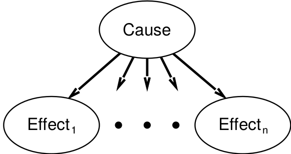

class: middle, center, title-slide

# Introduction to Artificial Intelligence

Lecture 5: Representing uncertain knowledge

  
Prof. Gilles Louppe 
[g.louppe@uliege.be](g.louppe@uliege.be)

???

R: https://kuleshov.github.io/cs228-notes/representation/directed/
R: add a slide on how to "read" a bayesian network (and how to infer some independence properties)

---

# Today

.grid[
.kol-1-2[
- Probability:
    - Random variables
    - Joint and marginal distributions
    - Conditional distributions
    - Product rule, Chain rule, Bayes' rule
    - Inference
- Bayesian networks:
    - Representing uncertain knowledge
    - Semantics
    - Construction
]
.kol-1-2[
.width-90[]
]
]

**Do not overlook this lecture!**  You will need these concepts a lot. (Now and in future courses)

.footnote[Image credits: [CS188](http://ai.berkeley.edu/lecture_slides.html), UC Berkeley.]

---

class: middle

# Quantifying uncertainty

---

# Ghostbusters

.grid[
.kol-1-2[
A ghost is *hidden* in the grid somewhere.
Sensor readings tell how close a square is to the ghost.
- On the ghost: red
- 1 or 2 away: orange
- 3 away: yellow
- 4+ away green

Sensors are **noisy**, but we know the probability $P(\text{color}|\text{distance})$ for all colors and all distances.
]
.kol-1-2[.width-100[]]
]

.footnote[Image credits: [CS188](http://ai.berkeley.edu/lecture_slides.html), UC Berkeley.]

---

class: middle, black-slide

.center[
<video controls preload="auto" height="400" width="640">
  <source src="./figures/lec5/gb-noprob.mp4" type="video/mp4">
</video>]

[Q] Could we use a logical agent for this game?

.footnote[Image credits: [CS188](http://ai.berkeley.edu/lecture_slides.html), UC Berkeley.]

---

# Uncertainty

General situation:
- *Observed variables* (evidence): agent knows certain things about the state of the world (e.g., sensor readings).
- *Unobserved variables*: agent needs to reason about other aspects that are **uncertain** (e.g., where the ghost is).
- (Probabilistic) *model*: agent knows or believes something about how the known variables relate to the unknown variables.

How to handle uncertainty?
- A purely logical approach either:
    - risks falsehood (because of ignorance about the world or laziness in the model), or
    - leads to conclusions that are too weak for decision making.
- **Probabilistic reasoning** provides a framework for managing our knowledge and *beliefs*.

---

# Probability

- Probabilistic assertions express the agent's inability to reach a definite decision regarding the truth of a proposition.
- Probability values **summarize** effects of
    - *laziness* (failure to enumerate all world states)
    - *ignorance* (lack of relevant facts, initial conditions, correct model, etc).
- (Bayesian subjective) Probabilities relate propositions to one's own state of knowledge (or lack thereof).
    - e.g., $P(\text{ghost in cell } [3,2]) = 0.02$
- These are **not** claims of a "probabilistic tendency" in the current situation (but might be learned from past experience of similar situations).

---

# Kolmogorov's probability theory

Begin with a set $\Omega$, the **sample space**.

$\omega \in \Omega$ is a *sample point*, possible world or atomic event.

A **probability space** is a sample space equipped with an assignment $P : \mathcal{P}(\Omega) \to \mathbb{R}$ such that:
- 1st axiom: $P(\omega) \in \mathbb{R}$, $0 \leq P(\omega)$ for all $\omega \in \Omega$.
- 2nd axiom: $P(\Omega) = 1$.
- 3rd axiom: $P(\\{ \omega\_1, ..., \omega\_n \\}) = \sum\_{i=1}^n P(\omega\_i)$ for any set of samples.

where $\mathcal{P}(\Omega)$ the power set of $\Omega$.

---

class: middle

## Example

- $\Omega$ = the 6 possible rolls of a die.
- $\omega\_i$ (for $i=1, ..., 6$) are the sample points, each corresponding than an outcome of the die.
- Assignment $P$ for a fair die:
$$P(1) = P(2) = P(3) = P(4) = P(5) = P(6) = \frac{1}{6}$$

---

# Random variables

- A **random variable** is a function $X: \Omega \to D\_X$ from the sample space to some domain defining its *outcomes*.
    - e.g., $Odd: \Omega \to \\{ \text{true}, \text{false} \\}$ such that $Odd(\omega) = (\omega \% 2 = 1)$.
- $P$ induces a **probability distribution** for any random variable $X$.
    - $P(X=x\_i) = \sum\_{\\{\omega: X(\omega)=x\_i\\}} P(\omega)$
    - e.g., $P(Odd=\text{true}) = P(1)+P(3)+P(5) = \frac{1}{2}$.
- In practice, we will use random variables to *represent aspects of the world* about which we (may) have uncertainty.
    - $R$: Is it raining?
    - $T$: Is it hot or cold?
    - $L$: Where is the ghost?

---

# Probability distributions

For discrete variables, the **probability distribution** can be encoded by a discrete list of the probabilities of the outcomes, known as the *probability mass function*.

One can think of the probability distribution as a **table** that associates a probability value to each *outcome* of the variable.
- This table can be infinite!
- By construction, probability values are *normalized* (i.e., sum to $1$).

.grid[
.center.kol-1-2[
$P(W)$

| $W$ | $P$ |
| --- | --- |
| $\text{sun}$ | $0.6$ |
| $\text{rain}$ | $0.1$ |
| $\text{fog}$ | $0.3$ |
| $\text{meteor}$ | $0.0$ |

]
.kol-1-2[.width-100[]]
]

.footnote[Image credits: [CS188](http://ai.berkeley.edu/lecture_slides.html), UC Berkeley.]

---

# Notations

- Random variables are written in upper roman letters: $X$, $Y$, etc.
- Realizations of a random variable are written in corresponding lower case letters.
   E.g., $x\_1$, $x\_2$, ..., $x\_n$ could be of outcomes of the random variable $X$.
- The probability value of the realization $x$ is written as $P(X=x)$.
- When clear from context, this will be abbreviated as $P(x)$.
- The probability distribution of the random variable $X$ is denoted as $P(X)$. This corresponds e.g. to a full probability table (and not to a single scalar value!).

---

# Joint distributions

 A **joint probability distribution** over a set of random variables $X_1, ..., X_n$ specifies
the probability of each (combined) outcome:

$$P(X\_1=x\_1, ..., X\_n=x\_n) = \sum\_{\\{\omega: X\_1(\omega)=x\_1, ..., X\_n(\omega)=x\_n\\}} P(\omega)$$

## Example

.center[$P(T,W)$]

| $T$ | $W$ | $P$ |
| --- | --- | --- |
| $\text{hot}$ | $\text{sun}$ | $0.4$ |
| $\text{hot}$ | $\text{rain}$ | $0.1$ |
| $\text{cold}$ | $\text{sun}$ | $0.2$ |
| $\text{cold}$ | $\text{rain}$ | $0.3$ |

---

# Events

An **event** is a set $E$ of outcomes.
- $P(E) = \sum_{(x_1, ..., x_n) \in E} P(X\_1=x_1, ..., X\_n=x_n)$

From a joint distribution, the probability of *any event* can be calculated.
- Probability that it is hot and sunny?
- Probability that it is hot?
- Probability that it is hot or sunny?

Interesting events often correspond to *partial assignments*.
- e.g., $P(T=\text{hot})$

---

# Marginal distributions

The **marginal distribution** of a subset of a collection of random variables is the joint probability distribution of the variables contained in the subset.

.center.grid[
.kol-1-3[
$P(T,W)$

| $T$ | $W$ | $P$ |
| --- | --- | --- |
| $\text{hot}$ | $\text{sun}$ | $0.4$ |
| $\text{hot}$ | $\text{rain}$ | $0.1$ |
| $\text{cold}$ | $\text{sun}$ | $0.2$ |
| $\text{cold}$ | $\text{rain}$ | $0.3$ |
]
.kol-1-3[
$P(T)$

| $T$ | $P$ |
| --- | --- |
| $\text{hot}$ | $0.5$ |
| $\text{cold}$ | $0.5$ |

$P(t) = \sum_w P(t, w)$
]
.kol-1-3[
$P(W)$

| $W$ | $P$ |
| --- | --- |
| $\text{sun}$ | $0.6$ |
| $\text{rain}$ | $0.4$ |

$P(w) = \sum_t P(t, w)$
]
]

Intuitively, marginal distributions are sub-tables which eliminate variables.

[Q] To what events are marginal probabilities associated?

---

# Conditional probability

**Prior** or unconditional probabilities of an event correspond to some initial belief,
prior to arrival of any evidence.
- e.g., $P(W=\text{sun}) = 0.6$.

**Posterior** or conditional probabilities correspond to the probability of an event, given some observed evidence.
Formally,
$$P(A=a|B=b) = \frac{P(A=a,B=b)}{P(B=b)}.$$

???

Draw the Venn diagram of
p(a), p(b), p(a,b) and explain p(a|b).
^ add that plot

(A and B are boolean rvs defined on Omega)

---

class: middle

## Example

$$P(W=\text{sun}|T=\text{cold}) = \frac{P(W=\text{sun},T=\text{cold})}{P(T=\text{cold})} = \frac{0.2}{0.2 + 0.3} = 0.4$$

---

# Conditional distributions

 Conditional distributions are probability distributions over some variables, given **fixed** values for others.

.center.grid[
.kol-1-3[
$P(T,W)$

| $T$ | $W$ | $P$ |
| --- | --- | --- |
| $\text{hot}$ | $\text{sun}$ | $0.4$ |
| $\text{hot}$ | $\text{rain}$ | $0.1$ |
| $\text{cold}$ | $\text{sun}$ | $0.2$ |
| $\text{cold}$ | $\text{rain}$ | $0.3$ |
]
.kol-1-3[
$P(W|T=\text{hot})$

| $T$ | $P$ |
| --- | --- |
| $\text{sun}$ | $0.8$ |
| $\text{rain}$ | $0.2$ |
]
.kol-1-3[
$P(W|T=\text{cold})$

| $W$ | $P$ |
| --- | --- |
| $\text{sun}$ | $0.4$ |
| $\text{rain}$ | $0.6$ |
]
]

[Q] To what events are conditional probabilities associated?

[Q] Is a conditional distribution defined on the same sample and probability space than the joint?

---

class: middle

## Normalization trick

.center.grid[
.kol-1-3[
$P(T,W)$

| $T$ | $W$ | $P$ |
| --- | --- | --- |
| $\text{hot}$ | $\text{sun}$ | $0.4$ |
| $\text{hot}$ | $\text{rain}$ | $0.1$ |
| $\text{cold}$ | $\text{sun}$ | $0.2$ |
| $\text{cold}$ | $\text{rain}$ | $0.3$ |
]
.kol-1-3[
$\rightarrow P(T=\text{cold},W)$

| $T$ | $W$ | $P$ |
| --- | --- | --- |
| $\text{cold}$ | $\text{sun}$ | $0.2$ |
| $\text{cold}$ | $\text{rain}$ | $0.3$ |

*Select* the joint probabilities matching the evidence $T=\text{cold}$.

]
.kol-1-3[
$\rightarrow P(W|T=\text{cold})$

| $W$ | $P$ |
| --- | --- |
| $\text{sun}$ | $0.4$ |
| $\text{rain}$ | $0.6$ |

*Normalize* the selection (make it sum to $1$).

]
]

[Q] Why does this work?

---

# Probabilistic inference

Probabilistic **inference** is the problem of computing a desired probability from other known probabilities (e.g., conditional from joint).

- We generally compute conditional probabilities.
    - e.g., $P(\text{on time} | \text{no reported accidents}) = 0.9$
    - These represent the agent's *beliefs* given the evidence.
- Probabilities change with new evidence:
    - e.g., $P(\text{on time} | \text{no reported accidents}, \text{5AM}) = 0.95$
    - e.g., $P(\text{on time} | \text{no reported accidents}, \text{rain}) = 0.8$
    - e.g., $P(\text{ghost in } [3,2] | \text{red in } [3,2]) = 0.99$
    - Observing new evidence causes *beliefs to be updated*.

.center.width-20[]

.footnote[Image credits: [CS188](http://ai.berkeley.edu/lecture_slides.html), UC Berkeley.]

---

class: middle

## General case
- *Evidence* variables: $E_1, ..., E_k = e_1, ..., e_k$
- *Query* variables: $Q$
- *Hidden* variables: $H_1, ..., H_r$
- $(Q \cup E_1, ..., E_k \cup H_1, ..., H_r)$ = all variables $X_1, ..., X_n$

**Inference** is the problem of computing **$P(Q|e_1, ..., e_k)$**.

---

# Inference by enumeration

Start from the joint distribution $P(Q, E\_1, ..., E\_k, H\_1, ..., H\_r)$.

1. Select the entries consistent with the evidence  $E_1, ..., E_k = e_1, ..., e_k$.
2. Marginalize out the hidden variables to obtain the joint of the query and the evidence variables:
$$P(Q,e\_1,...,e\_k) = \sum\_{h\_1, ..., h\_r} P(Q, h\_1, ..., h\_r, e\_1, ..., e\_k).$$
3. Normalize:
 
$$\begin{aligned}
Z &= \sum_q P(q,e_1,...,e_k) \\\\
P(Q|e_1, ..., e_k) &= \frac{1}{Z} P(Q,e_1,...,e_k)
\end{aligned}$$

---

class: middle

## Example

.grid[
.kol-1-2[

- $P(W)$?
- $P(W|\text{winter})$?
- $P(W|\text{winter},\text{hot})$?

]
.center.kol-1-2[

| $S$ | $T$ | $W$ | $P$ |
| --- | --- | --- | --- |
| $\text{summer}$ | $\text{hot}$ | $\text{sun}$ | $0.3$ |
| $\text{summer}$ | $\text{hot}$ | $\text{rain}$ | $0.05$ |
| $\text{summer}$ | $\text{cold}$ | $\text{sun}$ | $0.1$ |
| $\text{summer}$ | $\text{cold}$ | $\text{rain}$ | $0.05$ |
| $\text{winter}$ | $\text{hot}$ | $\text{sun}$ | $0.1$ |
| $\text{winter}$ | $\text{hot}$ | $\text{rain}$ | $0.05$ |
| $\text{winter}$ | $\text{cold}$ | $\text{sun}$ | $0.15$ |
| $\text{winter}$ | $\text{cold}$ | $\text{rain}$ | $0.2$ |

]
]

---

class: middle

## Complexity

- Inference by enumeration can be used to answer probabilistic queries for *discrete variables* (i.e., with a finite number of values).
- However, enumeration **does not scale**!
    - Assume a domain described by $n$ variables taking at most $d$ values.
    - Space complexity: $O(d^n)$
    - Time complexity: $O(d^n)$
- Can we reduce the size of the representation of the joint distribution?

---

# The product rule

$$P(b)P(a|b) = P(a,b)$$

## Example

.center.grid[
.kol-1-3[
$P(W)$

| $W$ | $P$ |
| --- | --- |
| $\text{sun}$ | $0.8$ |
| $\text{rain}$ | $0.2$ |
]
.kol-1-3[
$P(D|W)$

| $D$ | $W$ | $P$ |
| --- | --- | --- |
| $\text{wet}$ | $\text{sun}$ | $0.1$ |
| $\text{dry}$ | $\text{sun}$ | $0.9$ |
| $\text{wet}$ | $\text{rain}$ | $0.7$ |
| $\text{dry}$ | $\text{rain}$ | $0.3$ |

]
.kol-1-3[
$P(D,W)$

| $D$ | $W$ | $P$ |
| --- | --- | --- |
| $\text{wet}$ | $\text{sun}$ | ? |
| $\text{dry}$ | $\text{sun}$ | ? |
| $\text{wet}$ | $\text{rain}$ | ? |
| $\text{dry}$ | $\text{rain}$ | ? |

]
]

---

# The chain rule

More generally, any joint distribution can always be written as an incremental product of conditional distributions:

$$
\begin{aligned}
P(x\_1,x\_2,x\_3) &= P(x\_1)P(x\_2|x\_1)P(x\_3|x\_1,x\_2) \\\\
P(x\_1,...,x\_n) &= \prod\_{i=1}^n P(x\_i | x\_1, ..., x\_{i-1})
\end{aligned}
$$

[Q] Why is this always true?

---

# Independence

$A$ and $B$ are **independent** iff, for all $a \in D_A$ and $b \in D_B$,
- $P(a|b) = P(a)$, or
- $P(b|a) = P(b)$, or
- $P(a,b) = P(a)P(b)$

Independence is also written as $A \perp B$.

---

class: middle

## Example 1

.center.width-50[]

$P(\text{toothache}, \text{catch}, \text{cavity}, \text{weather})$ $ = P(\text{toothache}, \text{catch}, \text{cavity}) P(\text{weather})$

The original 32-entry table reduces to one 8-entry and one 4-entry table (assuming 4 values for $\text{Weather}$ and boolean values otherwise).

---

class: middle

## Example 2

For $n$ independent coin flips, the joint distribution can be fully **factored** and represented as the product of $n$ 1-entry tables.
- **$2^n \to n$**

[Q] In practice, absolute independence is rare. What can we do?

---

# Conditional independence

$A$ and $B$ are **conditionally independent** given $C$ iff, for all $a \in D_A$, $b \in D_B$ and $c \in D_C$,
- $P(a|b,c) = P(a|c)$, or
- $P(b|a,c) = P(b|c)$, or
- $P(a,b|c) = P(a|c)P(b|c)$

Conditional independence is also written as $A \perp B | C$.

---

class: middle

- Using the chain rule, the join distribution can be factored as a product of conditional distributions.
- Each conditional distribution may potentially be *simplified by conditional independence*.
- Conditional independence assertions allow probabilistic models to **scale up**.

---

class: middle

## Example 1

- Assume three random variables $\text{Toothache}$, $\text{Catch}$ and $\text{Cavity}$.
- $\text{Catch}$ is conditionally independent of $\text{Toothache}$, given $\text{Cavity}$.

Therefore, we can write:

$P(\text{toothache}, \text{catch}, \text{cavity})$
$= P(\text{toothache}|\text{catch}, \text{cavity}) P(\text{catch}|\text{cavity}) P(\text{cavity})$
$= P(\text{toothache}|\text{cavity}) P(\text{catch}|\text{cavity}) P(\text{cavity})$

In this case, the representation of the joint distribution reduces to $2+2+1$ independent numbers (instead of $2^n-1$).

---

class: middle

## Example 2 (Naive Bayes)

- More generally, from the product rule, we have:
    - $P(\text{cause},\text{effect}_1, ..., \text{effect}_n) = P(\text{effect}_1, ..., \text{effect}_n|\text{cause}) P(\text{cause})$
- Assuming *pairwise conditional independence* between the effects given the cause, it comes:
    - $P(\text{cause},\text{effect}_1, ..., \text{effect}_n) = P(\text{cause}) \prod_i P(\text{effect}_i|\text{cause}) $
- This probabilistic model is called a **naive Bayes** model.
    - The complexity of this model is $O(n)$ instead of $O(2^n)$ without the conditional independence assumptions.
    - Naive Bayes can work surprisingly well in practice, even when the assumptions are wrong.

---

class: middle, center, red-slide
count: false

The next slide is .bold[super] important.

---

# The Bayes' rule

.grid[
.kol-2-3[

The product rule defines two ways to factor the joint distribution of two random variables.
    $$P(a,b) = P(a|b)P(b) = P(b|a)P(a)$$
Therefore,
**$$P(a|b) = \frac{P(b|a)P(a)}{P(b)}.$$**
]
.kol-1-3[
.circle.width-100[]
]
]

- $P(a)$ is the prior belief on $a$.
- $P(b)$ is the probability of the evidence $b$.
- $P(a|b)$ is the posterior belief on $a$, given the evidence $b$.
- $P(b|a)$ is the conditional probability of $b$ given $a$. Depending on the context, this term is called the likelihood.

---

class: middle

$$P(a|b) = \frac{P(b|a)P(a)}{P(b)}$$

Why is this helpful?
- The Bayes rule let us build one conditional from its reverse.
- Often one conditional is tricky, but the other is simple.

This equation is the **foundation of many AI systems**.

---

class: middle

## Example: diagnostic probability from causal probability.

$$P(\text{cause}|\text{effect}) = \frac{P(\text{effect}|\text{cause})P(\text{cause})}{P(\text{effect})}$$

- $P(\text{effect}|\text{cause})$ quantifies the relationship in the *causal direction*.
- $P(\text{cause}|\text{effect})$ describes the *diagnostic direction*.

Let $S$=stiff neck and $M$=meningitis.
Given
- $P(s|m) = 0.7$
- $P(m) = 1/50000$
- $P(s) = 0.01,$

it comes
- $P(m|s) = \frac{P(s|m)P(m)}{P(s)} = \frac{0.7 \times 1/50000}{0.01} = 0.0014.$

---

# Ghostbusters, revisited

- Let assume a random variable $G$ for the ghost location and a set of random variables $R_{i,j}$ for the individual readings.
- We define a **prior distribution** $P(G)$ over ghost locations.
    - Assume it is uniform.
- We assume a sensor *reading model* $P(R\_{i,j} |G)$.
    - That is, we know what the sensors do.
    - $R_{i,j}$ = reading color measured at $[i,j]$
        - e.g., $P(R_{1,1}=\text{yellow}|G=[1,1])=0.1$
    - Two readings are conditionally independent, given the ghost position.

---

class: middle

- We can calculate the **posterior distribution** $P(G|R\_{i,j})$ using Bayes' rule:
$$P(G|R\_{i,j}) = \frac{P(R\_{i,j}|G)P(G)}{P(R\_{i,j})}.$$
- For the next reading $R\_{i',j'}$, this posterior distribution becomes the prior distribution over ghost locations, which we update similarly.

---

class: middle, black-slide

.center[
<video controls preload="auto" height="400" width="640">
  <source src="./figures/lec5/gb-prob.mp4" type="video/mp4">
</video>]

[Q] What if we had chosen a different prior?

.footnote[Image credits: [CS188](http://ai.berkeley.edu/lecture_slides.html), UC Berkeley.]

---

# Frequentism vs. Bayesianism

What do probability values represent?
- The objectivist **frequentist** view is that probabilities are real aspects of the universe.
    - i.e., propensities of objects to behave in certain ways.
    - e.g., the fact that a fair coin comes up heads with probability $0.5$ is a propensity of the coin itself.
- The subjectivist **Bayesian** view is that probabilities are a way of characterizing an agent's beliefs or uncertainty.
    - i.e., probabilities do not have external physical significance.
    - *This is the interpretation of probabilities that we will use!*

---

class: middle

# Probabilistic reasoning

---

# Representing knowledge

- The joint probability distribution can answer any question about the domain.
- However, its representation can become **intractably large** as the number of variable grows.
- *Independence* and *conditional independence* reduce the number of probabilities that need to be specified in order to define the full joint distribution.
- These relationships can be represented explicitly in the form of a **Bayesian network**.

---

# Bayesian networks

A **Bayesian network** is a *directed graph* in which:
- Each *node* corresponds to a *random variable*.
    - Can be observed or unobserved.
    - Can be discrete or continuous.
- Each *edge* indicates "direct influence" between variables.
    - If there is an arrow from node $X$ to node $Y$, $X$ is said to be a *parent* of $Y$.
    - The graph has no directed cycle (i.e., the graph is a DAG).
- Each node $X_i$ is annotated with a **conditional probability distribution** $P(X_i | \text{parents}(X_i))$ that quantifies the effect of the parents on the node.
    - In the simplest case, conditional distributions are represented as conditional probability table (CTP).

---

class: middle

## Example 1

The topology of the network encodes conditional independence assertions:

.center.width-60[]

- $\text{Weather}$ is independent of the other variables.
- $\text{Toothache}$ and $\text{Catch}$ are conditionally independent given $\text{Cavity}$.

[Q] What is the BN for $n$ independent coin flips?

---

class: middle

## Example 2 (Naive Bayes)

In a Naive Bayes model, we assume pairwise conditional independence between the effects given the cause:

.center.width-60[]

---

class: middle

## Example 3

.center.width-40[]

I am at work, neighbor John calls to say my alarm is ringing, but neighbor
Mary does not call. Sometimes it's set off by minor earthquakes.
Is there a burglar?

- Variables: $\text{Burglar}$, $\text{Earthquake}$, $\text{Alarm}$, $\text{JohnCalls}$, $\text{MaryCalls}$.
- Network topology from "causal" knowledge:
    - A burglar can set the alarm off
    - An earthquake can set the alaram off
    - The alarm can cause Mary to call
    - The alarm can cause John to call

.footnote[Image credits: [CS188](http://ai.berkeley.edu/lecture_slides.html), UC Berkeley.]

---

class: middle

.center.width-90[]

---

# Semantics

A Bayesian network implicitly **encodes** the full joint distribution as the product of the local distributions:

$$P(x\_1, ..., x\_n) = \prod\_{i=1}^n P(x_i | \text{parents}(X_i))$$

## Example
$P(j, m, a, \lnot b, \lnot e)$ 
$= P(j|a) P(m|a)P(a|\lnot b,\lnot e)P(\lnot b)P(\lnot e)$ 
$= 0.9 \times 0.7 \times 0.001 \times 0.999 \times 0.998$ 
$\approx 0.00063$

---

class: middle

Why does $\prod\_{i=1}^n P(x_i | \text{parents}(X_i))$ result in a proper joint distribution?
- By the *chain rule*, $P(x\_1, ..., x\_n) = \prod\_{i=1}^n P(x\_i | x\_1, ..., x\_{i-1})$.
- Assume **conditional independencies** of $X\_i$ with its predecessors in the ordering given the parents, and provided $\text{parents}(X\_i) \subseteq \\{ X\_1, ..., X\_{i-1}\\}$:
$$P(x\_i | x\_1, ..., x\_{i-1}) = P(x\_i | \text{parents}(X_i))$$
- Therefore $P(x\_1, ..., x\_n) = \prod\_{i=1}^n P(x_i | \text{parents}(X_i))$.

---

# Local semantics

.center.width-60[]

A node $X$ is conditionally independent to its non-descendants (the $Z_{ij}$) given its parents (the $U_i$).

---

# Global semantics

.center.width-60[]

A node $X$ is conditionally independent of all other nodes in the network given its Markov blanket.

---

# Construction

Bayesian networks are correct representations of the domain only if each node is conditionally independent of its other predecessors in the node ordering, given its parents.

This suggests the following methodology for *building* Bayesian networks:

1. Choose an **ordering** of variables $X\_1, ..., X\_n$.
2. For $i=1$ to $n$:
    - Add $X\_i$ to the network.
    - Select a minimal set of parents from $X\_1, ..., X\_{i-1}$ such that $P(x\_i | x\_1, ..., x\_{i-1}) = P(x\_i | \text{parents}(X_i))$.
    - For each parent, insert a link from the parent to $X\_i$.
    - Write down the CPT.

---

class: middle

## Examples

.center.width-100[

These networks are alternatives to Example 3.
]

[Q] What do you think of these BNs?

???

For the left network:

- P (J|M ) = P (J)? No
- P (A|J, M ) = P (A|J)? P (A|J, M ) = P (A)? No
- P (B|A, J, M ) = P (B|A)? Yes
- P (B|A, J, M ) = P (B)? No
- P (E|B, A, J, M ) = P (E|A)? No
- P (E|B, A, J, M ) = P (E|A, B)? Yes

---

# Compactness

- A CPT for boolean $X_i$ with $k$ boolean parents has $2^k$ rows for the combinations of parent values.
- Each row requires one number $p$ for $X_i = true$.
    - The number of $X_i=false$ is just $1-p$.
- If each variable has no more than $k$ parents, the complete network requires $O(n \times 2^k)$ numbers.
    - i.e., grows **linearly with $n$**, vs. $O(2^n)$ for the full joint distribution.
- For the burglary net, we need $1+1+4+2+2=10$ numbers (vs. $2^5-1=31$).
- Compactness depends on the *node ordering*.
    - Compare the three networks representing the same joint distribution.

---

# Causality?

- When the network reflects the true causal patterns:
    - Often more compact (nodes have fewer parents).
    - Often easier to think about.
    - Often easier to elicit from experts.
- But, Bayesian networks **need not be causal**.
    - Sometimes no causal network exists over the domain (e.g., if variables are missing).
    - Edges reflect **correlation**, not causation.
- What do the edges really mean then?
    - Topology *may* happen to encode causal structure.
    - **Topology really encodes conditional independence.**

.center.width-50[]

.footnote[Image credits: [CS188](http://ai.berkeley.edu/lecture_slides.html), UC Berkeley.]

---

class: middle, center

.center.circle.width-30[]
.caption[Judeas Pearl]

Correlation does not imply causation.

Causes cannot be expressed in the language of probability theory.

---

class: middle

Philosophers have tried to define causation in terms of probability: $X$ causes $Y$ if $X$ raises the probability of $Y$.

However, the inequality
$$P(Y|X) > P(Y)$$
fails to capture the intuition behind "probability raising", which is fundamentally a causal concept connoting a causal influence of $X$ over $Y$.
- Instead, the expression means that if we observe $X$, then the probability of $Y$ increases.
- But this increase may come about for other reasons!

---

class: middle

The correct formulation should read
$$P(Y|do(X=x)) > P(Y),$$
where $do(X=x)$ stands for an external intervention where $X$ is set to the value $x$ instead of being observed.

---

class: middle

## Observing vs. intervening

- The reading in barometer is useful to predict rain.
$$P(\text{rain}|\text{Barometer}=\text{high}) > P(\text{rain}|\text{Barometer}=\text{low})$$
- But hacking a barometer will not cause rain!
$$P(\text{rain}|\text{Barometer hacked to high}) = P(\text{rain}|\text{Barometer hacked to low})$$

---

# Summary

- Uncertainty arises because of laziness and ignorance. It is **inescapable** in complex non-deterministic or partially observable environments.
- **Probabilistic reasoning** provides a framework for managing our knowledge and *beliefs*.
- Bayesian networks are DAGs whose nodes correspond to random variables; each node has a conditional distribution for the node, given its parents.
- A Bayesian Network specifies a full joint distribution.
    - They are often **exponentially** smaller than an explicitly enumerated joint distribution.

---

class: end-slide, center
count: false

The end.
