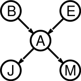
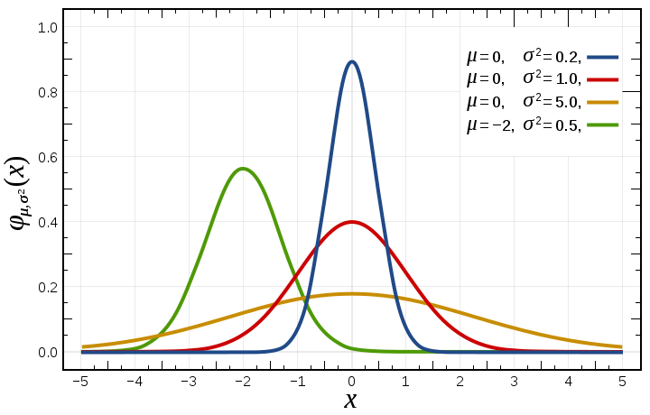

class: middle, center, title-slide

# Introduction to Artificial Intelligence

Lecture 6: Inference in Bayesian networks

???

R: took 2h30 to cover everything

---

# Today

- *Exact inference*
    - Inference by enumeration
    - Inference by variable elimination
    - Complexity of exact inference
- *Bayesian networks with continuous variables*
- *Approximate inference*
    - Stochastic simulation
    - Rejection sampling
    - Likelihood weighting
    - Gibbs sampling

---

class: middle, center

# Exact inference

---

# Inference tasks

- Inference: **computing a desired probability** from a joint probability distribution.
- Examples:
    - *Simple queries*: $P(X\_i|E=e)$
    - *Conjunctive queries*: $P(X\_i,X\_j|E=e)=P(X\_i|E=e)P(X\_j|X\_i,E=e)$
    - *Most likely explanation*: $\arg \max_q P(Q=q|E=e)$
        - Do you need to necessarily know $P(Q=q|E=e)$ to answer this?
    - *Optimal decisions*: take the decision that maximizes the expected utility of the outcomes.
        - requires to $P(outcome|action,evidence)$ for weighting the corresponding utility.
    - *Value of information*: which evidence to seek next?

---

# Inference by enumeration

Start from the joint distribution $P(Q, E\_1, ..., E\_k, H\_1, ..., H\_r)$.
1. *Select* the entries consistent with the evidence  $E_1, ..., E_k = e_1, ..., e_k$.
2. *Marginalize* out the hidden variables to obtain the joint of the query and the evidence values $P(Q,e\_1,...,e\_k)$.
3. *Normalize* by $Z = P(e_1,...,e_k) = \sum_q P(q,e_1,...,e_k)$.

---

# Inference by enumeration in BNs

Consider the burglary network and the query $P(B|j,m)$:

.pull-right[]

$P(B|j,m)$ 
$= P(B,j,m) / P(j,m)$ 
$= \alpha P(B,j,m)$ 
$= \alpha \sum_e \sum_a P(B,j,m,e,a)$

Rewrite full joint entries using product of CPT entries:

$P(B|j,m)$ 
$= \alpha \sum_e \sum_a P(B)P(e)P(a|B,e)P(j|a)P(m|a)$
$= \alpha  P(B) \sum_e P(e) \sum_a P(a|B,e)P(j|a)P(m|a)$

Recursive depth-first enumeration: **$O(n)$** space, **$O(d^n)$** time

---

# Enumeration algorithm

.center.width-100[]

---

# Evaluation tree

.center.width-90[]

Enumeration is **inefficient**: there are repeated computations!
- e.g., $P(j|a)P(m|a)$ is computed twice, once for $e$ and once for $\lnot e$.
- These can be avoided by *storing intermediate results*.

---

# Inference by variable elimination

- The **variable elimination** (VE) algorithm carries out summations right-to-left and *stores intermediate results* (called **factors**) to avoid recomputations.
- The algorithm interleaves:
    - Joining sub-tables
    - Eliminating hidden variables

<!-- 

Example:

$P(B|j,m)$ 
$= \alpha  P(B) \sum_e P(e) \sum_a P(a|B,e)P(j|a)P(m|a)$ 
$= \alpha  f_1(B) \sum_e f_2(E) \sum_a f_3(A,B,E) f_4(A) f_5(A)$ 
$= \alpha  f_1(B) \sum_e f_2(E) f_6(B,E)$ (eliminate $A$) 
$= \alpha  f_1(B) f_7(B)$ (eliminate $E$)  -->

---

# VE: factors

- Each **factor $f_i$** is a matrix indexed by the values of its argument variables. E.g.:

.center.width-90[]

- Factors are initialized with the CPTs annotating the nodes of the Bayesian network, conditioned on the evidence.

---

# VE: join

The *pointwise product*, or **join**, of two factors $f_1$ and $f_2$ yields a new factor $f$.
- Exactly like a **database join**!
- The variables of $f$ are the *union* of the variables in $f_1$ and $f_2$.
- The elements of $f$ are given by the product of the corresponding elements in $f_1$ and $f_2$.

.center.width-100[]

---

# VE: elimination

*Summing out*, or **eliminating**, a variable from a sum of products of factors:
- move any constant factor outside the summation;
- add up submatrices of pointwise product of remaining factors.

Example (eliminate $E$):

$\sum_e f_2(E) f_3(A,B,E) f_4(A) f_5(A)$ 
$= f_4(A) f_5(A) \sum_e f_2(E) f_3(A,B,E)$ 
$= f_4(A) f_5(A) f_6'(A,B)$

---

# Variable elimination algorithm

Query: $P(Q|e_1, ..., e_n)$.

Algorithm:
- Start with initial factors:
    - Local CPTs (but instantiated by evidence).
- While there are still hidden variables (not Q nor evidence):
    - Pick a hidden variable $H$
        - The elimination ordering is a design parameter.
    - Join all factors mentioning $H$
    - Eliminate (sum out) $H$
- Join all remaining factors and normalize.

---

# Example

.center[(blackboard example)]

---

# Relevance

- Consider the query $P(JohnCalls|Burglar=true)$.
    - $P(J|b) = \alpha P(b) \sum_e P(e) \sum_a P(a|b,e) P(J|a) \sum_m P(m|a)$
- $\sum_m P(m|a) = 1$, therefore $M$ is **irrelevant** for the query.
- In other words, $P(J|b)$ remains unchanged if we remove $M$ from the network.
- **Theorem**: $H$ is irrelevant for $P(Q|E=e)$ unless $H \in \text{ancestors}(\\\{Q\\\} \cup E)$

---

# Elimination ordering

.center.width-50[]

- Consider the query $P(X\_n|y\_1,...,y\_n)$.
- Work through the two elimination orderings:
    - $Z, X\_1, ..., X\_{n-1}$
    - $X\_1, ..., X\_{n-1}, Z$
- What is the size of the maximum factor generated for each of the orderings?
- Answer: $2^{n+1}$ vs. $2^2$ (assuming boolean values)

???

R: prepare that

---

# Complexity of exact inference

- The computational and space complexity of variable elimination is determined by **the largest factor**.
- The elimination *ordering* can greatly affect the size of the largest factor.
- Does there always exist an ordering that only results in small factors? **No!**
- *Singly connected networks* (polytrees):
    - Any two nodes are connected by at most one (undirected path).
    - For these networks, time and space complexity of variable elimination are $O(nd^k)$.

---

class: smaller

# Worst case complexity?

.center.width-70[]

3SAT is a special case of inference:
- CSP: $(u\_1 \lor u\_2 \lor u\_3) \wedge (\lnot u\_1 \lor \lnot u\_2 \lor u\_3) \wedge (u\_2 \lor \lnot u\_3 \lor u\_4)$
- $P(U\_i=0)=P(U\_i=1)=0.5$
- $C\_1 = U\_1 \lor U\_2 \lor U\_3$; $C\_2 = \lnot U\_1 \lor \lnot  U\_2 \lor U\_3$; $C\_3 = U\_2 \lor \lnot  U\_3 \lor U\_4$
- $D\_1 = C\_1$; $D\_2 = D\_1 \wedge C\_2$
- $Y = D\_2 \wedge C\_3$

If we can answer whether $P(Y=1)>0$, then we answer whether 3SAT has a solution.
By reduction, inference in Bayesian networks is therefore **NP-hard**.
- There is no known efficient probabilistic inference algorithm in general.

???

R: rehearse this slide

---

class: middle, center

# Bayesian networks with continuous variables

---

# Continuous variables

- For continuous variables, the probability distribution can be described by a probability **density** function.
    - That is, the distribution is described by a *continuous function* of its value:
        - e.g., $P(X=x) = U\[18,26\](x)$ for a uniform density between $18$ and $26$.
    - a density *integrates* to $1$ and is non-negative everywhere.
- The absolute likelihood that a continuous variable $X$ takes value $x$ is $0$.
- The (integral of the) density provides the probability of falling within a particular range of values.
- E.g., $P(X=20.5) = 0.125$ really means
$\lim_{dx \to 0} P(20.5 \leq X \leq 20.5+dx)/dx = 0.125$.

.center.width-40[]

???

R: rehearse this slide

---

# Gaussian distribution

.center.width-60[]

$$P(x)=\mathcal{N}(\mu,\sigma)(x)=\frac{1}{\sqrt{2\pi\sigma^2}} \exp(-\frac{(x-\mu)^2}{2\sigma^2})$$

- $\mu$ and $\sigma$ are *parameters* of the distribution.
- The *multivariate* Gaussian distribution generalizes to $n \geq 1$ random variables.

---

# Hybrid Bayesian networks

.center.width-40[]

- What if we have both *discrete* (e.g., $\text{subsidy}$ and $\text{buys}$) and *continuous*
variables (e.g., $\text{harvest}$ and $\text{cost}$) in a same network?
- Options:
    - *discretization*: transform continuous variables into discrete variables.
        - issues: possibly large errors due to precision loss, large CPTs.
    - define the conditional distribution with a **finitely parameterized** canonical distribution.
        - e.g., assume it is a gaussian distribution.
    - use a non-parametric representation.

---

# Continuous child variables

- We need to specify a *conditional density* function for each continuous child variable
given continuous parents, for each possible assignment to discrete parents.
    - e.g., we need to specify both $P(c|h,s)$ and $P(c|h,\lnot s)$
- Common choice: the **linear Gaussian model** (LG):
    - $P(c|h,s) = \mathcal{N}(a\_th+b\_t, \sigma_t^2)(c)$
    - $P(c|h,\lnot s) = \mathcal{N}(a\_tf+b\_f, \sigma_f^2)(c)$

.center.width-90[]

---

# Conditional Gaussian network

- The joint distribution of an all-continuous network with LG distributions
is a multivariate Gaussian.
- The joint distribution of a network with discrete+LG continuous variables is
a **conditional Gaussian network**.
    - i.e., a multivariate Gaussian over all continuous variables for each combination of the discrete variable values.

---

# Discrete child variables, with continuous parents

- We need to specify a *conditional distribution* for each discrete child variable,
given continuous parents.
- It is often reasonable to assume that the probability values of the discrete outcomes are almost piece-wise constant but *vary smoothly in intermediate regions*.
- E.g., $P(b|c)$ could be a "soft" threshold:

.grid[
.col-1-3[
.center.width-50[]
]
.col-2-3[
The **probit distribution** uses integral of Gaussian:
- $\Phi(x) = \int\_{-\infty}^x \mathcal{N}(0,1)(x) dx$
- $P(b|c) = \Phi((-c+\mu) / \sigma)$
]
]

---

# Variable elimination

- Variable elimination in Hybrid Bayesian networks can be conducted similarly as in the discrete case,
  by replacing **summations with integrations**.
- Exact inference remains possible *under some assumptions* (e.g., linear Gaussian models).
    - in which case exact analytical computations can be derived.
- However, this often **does not scale** to arbitrary continuous distributions.
    - e.g., numerical approximations of integrals amount to discretize continuous variables.

---

class: middle, center

# Approximate inference

---

# Approximate inference

- Exact inference is **intractable** for most probabilistic models of practical interest.
    - e.g., involving many variables, continuous and discrete, undirected cycles, etc.
- Solution: abandon exact inference and develop  **approximate** but *faster* inference algorithms.
- Main families of approximate inference algorithms:
    - *Sampling methods*: produce answers by repeatedly generating random numbers from a distribution of interest.
        - This is the family of methods we will consider.
    - *Variational methods*: formulate inference as an optimization problem.
    - *(Loopy) belief propagation* methods: formulate inference as a message-passing algorithm.

---

# Sampling from a distribution

.center.width-50[]

- How to sample from the distribution of a *discrete* variable $X$?
    - Assume $k$ discrete outcomes $x_1, ..., x_k$ with probability $P(x_i)$.
    - Assume sampling from $U[0,1]$ is possible.
        - e.g., as enabled by a standard `rand()` function.
    - Divide the $[0,1]$ interval into $d$ regions, with region $i$ having size $P(x_i)$.
    - Sample $u \sim U[0,1]$ and return the value associated to the region in which $u$ falls.
- The same algorithm extends to *continuous* variables, assuming access to the **inverse cumulative distribution function** $F^{-1}$.
    - for $p \in [0,1]$, $F^{-1}(p) = x$ such that $F(x)=p$, where $F$ is the CDF.
    - $F^{-1}$ is known analytically for most canonical distributions (e.g., Gaussian).

[Q] How to extend to arbitrary multivariate distributions?

???

Draw the situation for the continuous case.

---

# Ancestral sampling

Sampling from a Bayesian network, *without observed evidence*:
- Sample each variable in turn, **in topological order**.
- The probability distribution from which the value is sampled is conditioned on the values already assigned to the variable's parents.

.center.width-100[]

---

# Example (1)

.center.width-90[]

---

# Example (2)

.center.width-90[]

---

# Example (3)

.center.width-90[]

---

# Example (4)

.center.width-90[]

---

# Example (5)

.center.width-90[]

---

# Example (6)

.center.width-90[]

---

# Example (7)

.center.width-90[]

---

# Analysis of ancestral sampling

- The probability that ancestral sampling generates a particular event is
$$S\_{PS}(x\_1, ..., x\_n) = \prod\_{i=1}^n P(x\_i | \text{parents}(X\_i)) = P(x\_1,...,x\_n)$$
i.e., the Bayesian network's joint probability.
- Let the number of samples of an event be $N\_{PS}(x\_1, ..., x\_n)$. We
define the **probability estimate** $$\hat{P}(x\_1, ..., x\_n) = N\_{PS}(x\_1, ..., x\_n) / N.$$
- Then: 
$\lim\_{N \to \infty} \hat{P}(x\_1,...,x\_n) = \lim\_{N \to \infty} N\_{PS}(x\_1, ..., x\_n) / N$ 
$\quad \quad \quad \quad \quad \quad \quad \quad \quad= S\_{PS}(x\_1, ..., x\_n)$ 
$\quad \quad \quad \quad \quad \quad \quad \quad \quad= P(x\_1, ..., x\_n)$
- That is, the sampling procedure is *consistent*: $P(x\_1, ..., x\_n) \approx N\_{PS}(x\_1, ..., x\_n) / N$.

---

# Rejection sampling

Using ancestral sampling, an estimate $\hat{P}(x|e)$ can be formed from the samples *agreeing with the evidence*.

.center.width-100[]

[Q] Can we use a similar idea to sample continuous variables for which $P$ is known but $F^{-1}$ isn't?

???

Explain general rejection sampling.

---

# Analysis of rejection sampling

- Let consider the posterior **probability estimate** $\hat{P}(x|e)$ formed by rejection sampling:  
$\hat{P}(x|e) = \alpha N\_{PS}(x,e)$ (by definition of the algorithm) 
$= N\_{PS}(x,e) / N\_{PS}(e)$ 
$\approx P(x,e) / P(e)$ 
$= P(x|e)$
- Therefore, rejection sampling returns *consistent* posterior estimates.
- The standard deviation of the error in each probability is $O(1/\sqrt{n})$.
- **Problem**: many samples are rejected!
    - Hopelessly expensive if $P(e)$ is small.
    - Evidence is not exploited when sampling.

???

R: improve the description of how probability estimates are built.

---

# Likelihood weighting

Idea: *fix evidence* variables, sample the rest.
- Problem: the resulting sampling distribution is not consisent.
- Solution: **weight** by probability of evidence given parents.

.center.width-80[]

---

# Example (1)

.center.width-100[]

---

# Example (2)

.center.width-100[]

---

# Example (3)

.center.width-100[]

---

# Example (4)

.center.width-100[]

---

# Example (5)

.center.width-100[]

---

class: smaller

# Analysis of likelihood weighting (1)

- The sampling probability for an event with likelihood weighting is
$$S\_{WS}(z,e) = \prod\_{i=1}^l P(z\_i|\text{parents}(Z\_i)),$$
where the product is over the non-evidence variables.
- The weight for a given sample $z,e$ is
$$w(z,e) = \prod\_{i=1}^m P(e\_i|\text{parents}(E\_i)),$$
where the product is over the evidence variables.
- The weighted sampling probability is
  
$S\_{WS}(z,e) w(z,e) = \prod\_{i=1}^l P(z\_i|\text{parents}(Z\_i)) \prod\_{i=1}^m P(e\_i|\text{parents}(E\_i))$ 
$\quad \quad \quad \quad \quad \quad \quad= P(z,e).$

???

R: improve the description of how probability estimates are built.

---

class: smaller

# Analysis of likelihood weighting (2)

- The estimated posterior probability is computed as follows:
  
$\hat{P}(x|e) = \alpha \sum\_y N\_{WS}(x,y,e) w(x,y,e)$ 
$\,\,\,\,\,\,\,\,\,\,\,\,\,\,\,\,\,\approx \alpha' \sum\_y S\_{WS}(x,y,e) w(x,y,e)$ 
$\,\,\,\,\,\,\,\,\,\,\,\,\,\,\,\,\,= \alpha' \sum\_y P(x,y,e)$ 
$\,\,\,\,\,\,\,\,\,\,\,\,\,\,\,\,\,= \alpha' P(x,e) = P(x|e)$
- Hence likelihood weighting returns *consistent* estimates.
- Performance **still degrades** with many evidence variables.
    - A few samples have nearly all the total weight.

[Q] What should be the normalization constants $\alpha$ and $\alpha'$ to obtain correct results?

???

- $\alpha = 1 / \sum w$
- $\alpha' = 1 / (N \sum w)$

---

# Likelihood weighting

- Likelihood weighting is *good*:
    - The evidence is taken into account to generate a sample.
    - More of the samples will reflect the state of the world suggested by the evidence.
- Likelihood weighting **does not solve all problems**:
    - The evidence influences the choice of downstream variables, but not upstream ones.
- We would like to consider evidence when we sample *every variable*.

---

# Gibbs sampling

- *Procedure*:
    - Keep track of a full instance $x\_1, ..., x\_n$. Start with an arbitrary instance consistent with the evidence.
    - Sample one variable at a time, conditioned on all the rest.
        - Keep the evidence fixed.
    - Keep repeating this for a long time.
- *Property*:
    - The sampling process settles into a **dynamic equilibrium** in which the long-run fraction of time spent in each state is exactly proportional to its posterior probability.
- *Rationale*:
    - Both upstream and downstream variables condition on evidence.
    - In contrast, likelihood weighting only conditions on upstream evidence, and hence the resulting weights might be very small.

---

# Gibbs sampling

.center.width-100[]

Note that we need to derive $P(Z\_i|mb(Z\_i))$:
- $mb(Z\_i)$ is the **Markov blanket** of $Z\_i$.
- i.e., the set of  $Z\_i$'s parents, children and children's parents.

---

# Example

.grid[
.col-1-4[
1) Fix the evidence
]
.col-1-4[]
.col-1-4[
2) Randomly initialize the other variables
]
.col-1-4[]
]

3) Repeat
- Choose a non-evidence variable $X$
- Resample $X$ from $P(X|\text{all other variables})$

.center.width-100[]

---

# Further reading on Gibbs sampling

- Gibbs sampling produces samples from the query distribution $P(X|e)$ in the limit of re-sampling infinitely often.
- Gibbs sampling is a special case of a more general methods called
**Markov chain Monte Carlo** (MCMC) methods.
    - *Metropolis-Hastings* is one of the more famous MCMC methods.
        - In fact, Gibbs sampling is a special case of Metropolis-Hastings.
- You may read about *Monte Carlo* methods: they are just sampling.

---

class: center, middle

(Gibbs sampling demo)

---

# Summary

- **Exact inference** by variable elimination .
    - NP-hard on general graphs, but polynomial on polytrees.
    - space = time, very sensitive to topology.
- **Approximate inference** gives reasonable estimates of the true posterior probabilities in a network and can cope with much larger networks than can exact algorithms.
    - LW does poorly when there is lots of evidence.
    - LW and GS generally insensitive to topology.
    - Convergence can be slow with probabilities close to 1 or 0.
    - Can handle arbitrary combinations of discrete and continuous variables.
- Want to know more about sampling?
    - Follow [MATH2022 Large sample analysis: theory and practice](https://www.programmes.uliege.be/cocoon/en/cours/MATH2022-1.html).

---

# References

- Cooper, Gregory F. "The computational complexity of probabilistic inference using Bayesian belief networks." Artificial intelligence 42.2-3 (1990): 393-405.
