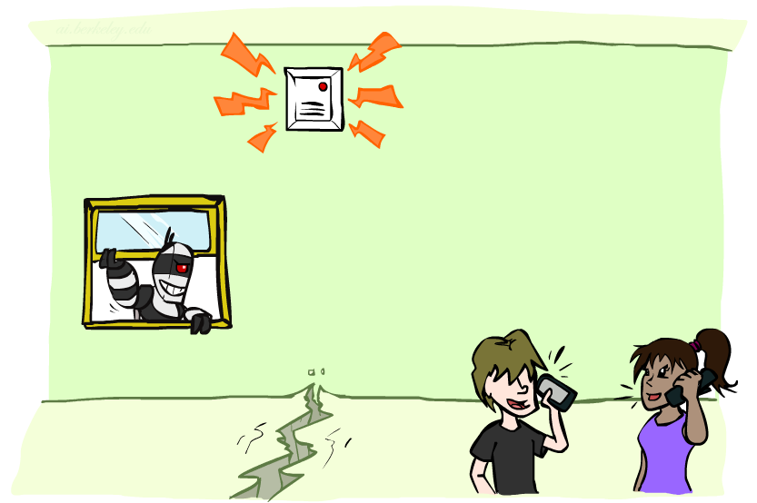

class: middle, center, title-slide

# Introduction to Artificial Intelligence

Lecture 6: Inference in Bayesian networks

  
Prof. Gilles Louppe 
[g.louppe@uliege.be](g.louppe@uliege.be)

???

R: took 2h30 to cover everything
R: slide on MCMC
R: cartoons from cs188 18 and 19
R: re draw the figures for continuous variables (see DL lectures style)
R: theoretical results of approximate algorithms?

---

# Today

.grid[
.kol-1-2[
- Exact inference
    - Inference by enumeration
    - Inference by variable elimination
    - Complexity of exact inference
- Continuous variables
- Approximate inference
    - Ancestral sampling
    - Rejection sampling
    - Likelihood weighting
    - Gibbs sampling
]
.kol-1-2[
  
.width-100[]
]
]

.footnote[Credits: [CS188](http://ai.berkeley.edu/lecture_slides.html), UC Berkeley.]

---

# Bayesian networks

.grid[
.kol-2-3[
A Bayesian network is a *directed acyclic graph* in which:
- Each node corresponds to a *random variable*.
- Each node $X_i$ is annotated with a **conditional probability distribution** $P(X_i | \text{parents}(X_i))$ that quantifies the effect of the parents on the node.

A Bayesian network implicitly **encodes** the full joint distribution as the product of the local distributions:
    $$P(x\_1, ..., x\_n) = \prod\_{i=1}^n P(x_i | \text{parents}(X_i))$$
]
.kol-1-3.center[.width-100[]

 

.width-70[]]
]

.footnote[Credits: [CS188](http://ai.berkeley.edu/lecture_slides.html), UC Berkeley.]

---

class: middle

.grid[
.kol-3-4[.center.width-100[]]
.kol-1-4[.center.width-100[]]
]

 
$$
\begin{aligned}
P(b,\lnot e, a, \lnot j, m) &= P(b)P(\lnot e)P(a|b, \lnot e)P(\lnot j|a)P(m, a) \\\\
&= 0.001 \times 0.998 \times 0.94 \times 0.1 \times 0.7
\end{aligned}$$

---

class: middle

# Exact inference

---

# Inference

Inference is concerned with the problem **computing a desired probability** from a joint probability distribution:

.grid[
.kol-1-3.center[Simple queries:]
.kol-2-3[$P(X\_i|e)$]
]
.grid[
.kol-1-3.center[Conjunctive queries:]
.kol-2-3[$P(X\_i,X\_j|e)=P(X\_i|e)P(X\_j|X\_i,e)$]
]
.grid[
.kol-1-3.center[Most likely explanation:]
.kol-2-3[$\arg \max_q P(q|e)$]
]
.grid[
.kol-1-3.center[Optimal decisions:]
.kol-2-3[$\arg \max\\\_a \mathbb{E}\_{p(s'|s,a)} \left[ V(s') \right]$]
]

.center.width-30[]

.footnote[Credits: [CS188](http://ai.berkeley.edu/lecture_slides.html), UC Berkeley.]

---

# Inference by enumeration

Start from the joint distribution $P(Q, E\_1, ..., E\_k, H\_1, ..., H\_r)$.

1. Select the entries consistent with the evidence  $E_1, ..., E_k = e_1, ..., e_k$.
2. Marginalize out the hidden variables to obtain the joint of the query and the evidence variables:
$$P(Q,e\_1,...,e\_k) = \sum\_{h\_1, ..., h\_r} P(Q, h\_1, ..., h\_r, e\_1, ..., e\_k).$$
3. Normalize:
 
$$\begin{aligned}
Z &= \sum_q P(q,e_1,...,e_k) \\\\
P(Q|e_1, ..., e_k) &= \frac{1}{Z} P(Q,e_1,...,e_k)
\end{aligned}$$

---

class: middle

- Consider the alarm network and the query $P(B|j,m)$:  
$\begin{aligned}
P(B|j,m) &\propto \sum\_e \sum\_a P(B,j,m,e,a)
\end{aligned}$
- Using the Bayesian network, the full joint entries can be rewritten as the product of CPT entries:  
$\begin{aligned}
P(B|j,m) &\propto \sum\_e \sum\_a P(B)P(e)P(a|B,e)P(j|a)P(m|a) \\\\
&\propto P(B) \sum\_e P(e) \sum\_a P(a|B,e)P(j|a)P(m|a)
\end{aligned}$

???

be more explicit about $\alpha$

---

class: middle

.center.width-100[]

---

class: middle

## Evaluation tree

.center.width-80[]

Enumeration is **inefficient**: there are repeated computations!
- e.g., $P(j|a)P(m|a)$ is computed twice, once for $e$ and once for $\lnot e$.
- These can be avoided by *storing intermediate results*.

---

class: middle

.center.width-80[]

Inference by enumeration is slow because the whole joint distribution is joined up before summing out the hidden variables.

.footnote[Credits: [CS188](http://ai.berkeley.edu/lecture_slides.html), UC Berkeley.]

---

# Inference by variable elimination

The **variable elimination** (VE) algorithm carries out summations right-to-left and *stores intermediate results* (called **factors**) to avoid recomputations.
The algorithm interleaves:
- Joining sub-tables
- Eliminating hidden variables

.center.width-80[]

.footnote[Credits: [CS188](http://ai.berkeley.edu/lecture_slides.html), UC Berkeley.]

<!-- 

Example:

$P(B|j,m)$ 
$= \alpha  P(B) \sum_e P(e) \sum_a P(a|B,e)P(j|a)P(m|a)$ 
$= \alpha  f_1(B) \sum_e f_2(E) \sum_a f_3(A,B,E) f_4(A) f_5(A)$ 
$= \alpha  f_1(B) \sum_e f_2(E) f_6(B,E)$ (eliminate $A$) 
$= \alpha  f_1(B) f_7(B)$ (eliminate $E$)  -->

---

class: middle

## Factors

- Each **factor $f_i$** is a matrix indexed by the values of its argument variables. E.g.:

.center.width-90[]

- Factors are initialized with the CPTs annotating the nodes of the Bayesian network, conditioned on the evidence.

---

class: middle

## Join

The *pointwise product*, or **join**, of two factors $f_1$ and $f_2$ yields a new factor $f$.
- Exactly like a **database join**!
- The variables of $f$ are the *union* of the variables in $f_1$ and $f_2$.
- The elements of $f$ are given by the product of the corresponding elements in $f_1$ and $f_2$.

.center.width-100[]

---

class: middle

## Elimination

*Summing out*, or **eliminating**, a variable from a sum of products of factors:
- move any constant factor outside the summation;
- add up submatrices of pointwise product of remaining factors.

Example (eliminate $E$):

$\begin{aligned}
&\sum\_e f\_2(E) f\_3(A,B,E) f\_4(A) f\_5(A) \\\\
&= f\_4(A) f\_5(A) \sum\_e f\_2(E) f\_3(A,B,E) \\\\
&= f\_4(A) f\_5(A) f\_6'(A,B)
\end{aligned}$

---

class: middle

.width-100[]

---

class: middle

## Example

(blackboard example)

???

Prepare this!!

---

# Relevance

Consider the query $P(J|b)$:
$$P(J|b) \propto P(b) \sum_e P(e) \sum\_a P(a|b,e) P(J|a) \sum\_m P(m|a)$$
- $\sum_m P(m|a) = 1$, therefore $M$ is **irrelevant** for the query.
- In other words, $P(J|b)$ remains unchanged if we remove $M$ from the network.

## Theorem

$H$ is irrelevant for $P(Q|E=e)$ unless $H \in \text{ancestors}(\\\{Q\\\} \cup E)$.

---

# Complexity

.center.width-50[]

Consider the query $P(X\_n|y\_1,...,y\_n)$.
Work through the two elimination orderings:
- $Z, X\_1, ..., X\_{n-1}$
- $X\_1, ..., X\_{n-1}, Z$

What is the size of the maximum factor generated for each of the orderings?
- Answer: $2^{n+1}$ vs. $2^2$ (assuming boolean values)

???

R: prepare that

---

class: middle

The computational and space complexity of variable elimination is determined by **the largest factor**.
- The elimination *ordering* can greatly affect the size of the largest factor.
- Does there always exist an ordering that only results in small factors? **No!**
- Singly connected networks (polytrees):
    - Any two nodes are connected by at most one (undirected path).
    - For these networks, time and space complexity of variable elimination are $O(nd^k)$.

---

# Worst-case complexity?

.center.width-80[]

3SAT is a special case of inference:
- CSP: $(u\_1 \lor u\_2 \lor u\_3) \wedge (\lnot u\_1 \lor \lnot u\_2 \lor u\_3) \wedge (u\_2 \lor \lnot u\_3 \lor u\_4)$
- $P(U\_i=0)=P(U\_i=1)=0.5$
- $C\_1 = U\_1 \lor U\_2 \lor U\_3$; $C\_2 = \lnot U\_1 \lor \lnot  U\_2 \lor U\_3$; $C\_3 = U\_2 \lor \lnot  U\_3 \lor U\_4$
- $D\_1 = C\_1$; $D\_2 = D\_1 \wedge C\_2$
- $Y = D\_2 \wedge C\_3$

---

class: middle

If we can answer whether $P(Y=1)>0$, then we answer whether 3SAT has a solution.
By reduction, inference in Bayesian networks is therefore **NP-hard**.
- There is no known efficient probabilistic inference algorithm in general.

???

R: rehearse this slide

---

class: middle

# Continuous variables

---

# Random variables

Let $X: \Omega \to D\_X$ be a random variable.
- When $D\_X$ is finite or countably infinite, $X$ is called a discrete random variable.
- Its probability distribution is described by a probability mass function that assigns a probability to each value $x \in D\_X$.
- When $D\_X$ is uncountably infinite (e.g., $D\_X = \mathbb{R}$), $X$ is called a *continuous random variable*.
- If $X$ is absolutely continuous, its probability distribution is described by a **density function** $p$ that assigns a probability to any interval $[a,b] \subseteq D\_X$ such that
$$P(a < X \leq b) = \int\_a^b p(x) dx,$$
where $p$ is non-negative piecewise continuous and such that $\int\_{D\_X} p(x)dx=1$.

???

R: definition of absolutely continuous

---

# Uniform

.center.width-60[]

The uniform distribution $\mathcal{U}(a,b)$ is described by the density function
$$
p(x) = \begin{cases}
\frac{1}{b-a} & \text{if } x \in \[a,b\]\\\\
0 & \text{otherwise}
\end{cases}$$
where $a \in \mathbb{R}$ and $b \in \mathbb{R}$ are the bounds of its support.

---

# Normal

.center.width-60[]

The normal (or Gaussian) distribution $\mathcal{N}(\mu,\sigma)$ is described by the density function
$$p(x) = \frac{1}{\sqrt{2\pi\sigma^2}} \exp\left(-\frac{(x-\mu)^2}{2\sigma^2}\right)$$
where $\mu \in \mathbb{R}$ and $\sigma \in \mathbb{R}^+$ are its mean and standard deviation parameters.

---

# Multivariate normal

.center.width-60[]

The multivariate normal distribution generalizes to $N$ random variables. Its (joint) density function is defined as
$$p(\mathbf{x}=x\_1, ..., x\_n) = \frac{1}{\sqrt{(2\pi)^n|\Sigma|}} \exp\left(-\frac{1}{2} (\mathbf{x}-\mathbf{\mu})^T \Sigma^{-1} (\mathbf{x}-\mu) \right) $$
where $\mu \in \mathbb{R}^n$ and $\Sigma \in R^{n\times n}$ is positive semi-definite.

---

# Hybrid Bayesian networks

  
.center.width-60[]

What if we have both *discrete* (e.g., $\text{Subsidy}$ and $\text{Buys}$) and *continuous*
variables (e.g., $\text{Harvest}$ and $\text{Cost}$) in a same Bayesian network?

---

class: middle

## Options

- Discretization: transform continuous variables into discrete variables.
    - Issues: possibly large errors due to precision loss, large CPTs.
- Define the conditional distribution with a **finitely parameterized** canonical distribution.
    - e.g., assume it is a Gaussian distribution.
- Use a non-parametric representation.

---

class: middle

## Continuous child variables

- We need to specify a conditional density function for each continuous child variable
given continuous parents, for each possible assignment to discrete parents.
    - e.g., we need to specify both $p(c|h,s)$ and $p(c|h,\lnot s)$
- Common choice: the **linear Gaussian model** (LG):
    - $p(c|h,s) = \mathcal{N}(a\_th+b\_t, \sigma_t^2)(c)$
    - $p(c|h,\lnot s) = \mathcal{N}(a\_fh+b\_f, \sigma_f^2)(c)$

.center.width-90[]

---

class: middle

## Conditional Gaussian network

- The joint distribution of an all-continuous network with linear Gaussian distributions
is a multivariate Gaussian.
- The joint distribution of a network with discrete or linear Gaussian continuous variables is
a **conditional Gaussian network**.
    - i.e., a multivariate Gaussian over all continuous variables for each combination of the discrete variable values.

---

class: middle

## Discrete child variables, with continuous parents

- We need to specify a conditional distribution for each discrete child variable,
given continuous parents.
- It is often reasonable to assume that the probability values of the discrete outcomes are almost piece-wise constant but *vary smoothly in intermediate regions*.

---

class: middle

For example, if $B$ is binary, $P(b|c)$ could be a "soft" threshold, such as the **probit distribution** for which
$$P(b | c) = \Phi((c - \mu) / \sigma),$$
where $\Phi$ is the cumulative distribution function of the (standard) normal distribution.

.center.width-60[]

---

# Variable elimination

Variable elimination in hybrid Bayesian networks can be conducted similarly as in the discrete case,
by replacing **summations with integrations**.
- Exact inference remains possible *under some assumptions*.
    - e.g., for linear Gaussian models, queries can all be derived analytically.
- However, this often **does not scale** to arbitrary continuous distributions.
    - e.g., numerical approximations of integrals amount to discretize continuous variables.

---

class: middle

# Approximate inference

a.k.a. Monte Carlo methods

---

# Approximate inference

- Exact inference is **intractable** for most probabilistic models of practical interest.
    - e.g., involving many variables, continuous and discrete, undirected cycles, etc.
- Solution: abandon exact inference and develop  **approximate** but *faster* inference algorithms.
- Main families of approximate inference algorithms:
    - *Sampling methods*: produce answers by repeatedly generating random numbers from a distribution of interest.
        - This is the family of methods we will consider.
    - *Variational methods*: formulate inference as an optimization problem.
    - *(Loopy) belief propagation* methods: formulate inference as a message-passing algorithm.

---

# Sampling from a distribution

.center.width-50[]

- How to sample from the distribution of a *discrete* variable $X$?
    - Assume $k$ discrete outcomes $x_1, ..., x_k$ with probability $P(x_i)$.
    - Assume sampling from $U[0,1]$ is possible.
        - e.g., as enabled by a standard `rand()` function.
    - Divide the $[0,1]$ interval into $d$ regions, with region $i$ having size $P(x_i)$.
    - Sample $u \sim U[0,1]$ and return the value associated to the region in which $u$ falls.
- The same algorithm extends to *continuous* variables, assuming access to the **inverse cumulative distribution function** $F^{-1}$.
    - for $p \in [0,1]$, $F^{-1}(p) = x$ such that $F(x)=p$, where $F$ is the CDF.
    - $F^{-1}$ is known analytically for most canonical distributions (e.g., Gaussian).

[Q] How to extend to arbitrary multivariate distributions?

???

Draw the situation for the continuous case.

---

# Ancestral sampling

Sampling from a Bayesian network, *without observed evidence*:
- Sample each variable in turn, **in topological order**.
- The probability distribution from which the value is sampled is conditioned on the values already assigned to the variable's parents.

.center.width-100[]

---

class: middle

.center.width-90[]

---

class: middle
count: false

.center.width-90[]

---

class: middle
count: false

.center.width-90[]

---

class: middle
count: false

.center.width-90[]

---

class: middle
count: false

.center.width-90[]

---

class: middle
count: false

.center.width-90[]

---

class: middle
count: false

.center.width-90[]

---

class: middle

## Analysis

- The probability that ancestral sampling generates a particular event is
$$S\_{PS}(x\_1, ..., x\_n) = \prod\_{i=1}^n P(x\_i | \text{parents}(X\_i)) = P(x\_1,...,x\_n)$$
i.e., the Bayesian network's joint probability.
- Let the number of samples of an event be $N\_{PS}(x\_1, ..., x\_n)$. We
define the **probability estimate** $$\hat{P}(x\_1, ..., x\_n) = N\_{PS}(x\_1, ..., x\_n) / N.$$
- Then: 
$\lim\_{N \to \infty} \hat{P}(x\_1,...,x\_n) = \lim\_{N \to \infty} N\_{PS}(x\_1, ..., x\_n) / N$ 
$\quad \quad \quad \quad \quad \quad \quad \quad \quad= S\_{PS}(x\_1, ..., x\_n)$ 
$\quad \quad \quad \quad \quad \quad \quad \quad \quad= P(x\_1, ..., x\_n)$
- That is, the sampling procedure is *consistent*: $P(x\_1, ..., x\_n) \approx N\_{PS}(x\_1, ..., x\_n) / N$.

---

# Rejection sampling

Using ancestral sampling, an estimate $\hat{P}(x|e)$ can be formed from the samples *agreeing with the evidence*.

.center.width-100[]

[Q] Can we use a similar idea to sample continuous variables for which $P$ is known but $F^{-1}$ isn't?

???

Explain general rejection sampling.

---

class: middle

## Analysis

- Let consider the posterior **probability estimate** $\hat{P}(x|e)$ formed by rejection sampling:  
$\hat{P}(x|e) = \alpha N\_{PS}(x,e)$ (by definition of the algorithm) 
$= N\_{PS}(x,e) / N\_{PS}(e)$ 
$\approx P(x,e) / P(e)$ 
$= P(x|e)$
- Therefore, rejection sampling returns *consistent* posterior estimates.
- The standard deviation of the error in each probability is $O(1/\sqrt{n})$.
- **Problem**: many samples are rejected!
    - Hopelessly expensive if $P(e)$ is small.
    - Evidence is not exploited when sampling.

???

R: improve the description of how probability estimates are built.

---

# Likelihood weighting

Idea: *fix evidence* variables, sample the rest.
- Problem: the resulting sampling distribution is not consisent.
- Solution: **weight** by probability of evidence given parents.

.center.width-80[]

---

class: middle

.center.width-100[]

---

class: middle
count: false

.center.width-100[]

---

class: middle
count: false

.center.width-100[]

---

class: middle
count: false

.center.width-100[]

---

class: middle
count: false

.center.width-100[]

---

class: middle

## Analysis

- The sampling probability for an event with likelihood weighting is
$$S\_{WS}(z,e) = \prod\_{i=1}^l P(z\_i|\text{parents}(Z\_i)),$$
where the product is over the non-evidence variables.
- The weight for a given sample $z,e$ is
$$w(z,e) = \prod\_{i=1}^m P(e\_i|\text{parents}(E\_i)),$$
where the product is over the evidence variables.
- The weighted sampling probability is
  
$S\_{WS}(z,e) w(z,e) = \prod\_{i=1}^l P(z\_i|\text{parents}(Z\_i)) \prod\_{i=1}^m P(e\_i|\text{parents}(E\_i))$ 
$\quad \quad \quad \quad \quad \quad \quad= P(z,e).$

???

R: improve the description of how probability estimates are built.

---

class: middle

- The estimated posterior probability is computed as follows:
  
$\hat{P}(x|e) = \alpha \sum\_y N\_{WS}(x,y,e) w(x,y,e)$ 
$\,\,\,\,\,\,\,\,\,\,\,\,\,\,\,\,\,\approx \alpha' \sum\_y S\_{WS}(x,y,e) w(x,y,e)$ 
$\,\,\,\,\,\,\,\,\,\,\,\,\,\,\,\,\,= \alpha' \sum\_y P(x,y,e)$ 
$\,\,\,\,\,\,\,\,\,\,\,\,\,\,\,\,\,= \alpha' P(x,e) = P(x|e)$
- Hence likelihood weighting returns *consistent* estimates.
- Performance **still degrades** with many evidence variables.
    - A few samples have nearly all the total weight.

[Q] What should be the normalization constants $\alpha$ and $\alpha'$ to obtain correct results?

???

- $\alpha = 1 / \sum w$
- $\alpha' = 1 / (N \sum w)$

---

# Likelihood weighting

- Likelihood weighting is *good*:
    - The evidence is taken into account to generate a sample.
    - More of the samples will reflect the state of the world suggested by the evidence.
- Likelihood weighting **does not solve all problems**:
    - The evidence influences the choice of downstream variables, but not upstream ones.
- We would like to consider evidence when we sample *every variable*.

---

# Gibbs sampling

- *Procedure*:
    - Keep track of a full instance $x\_1, ..., x\_n$. Start with an arbitrary instance consistent with the evidence.
    - Sample one variable at a time, conditioned on all the rest.
        - Keep the evidence fixed.
    - Keep repeating this for a long time.
- *Property*:
    - The sampling process settles into a **dynamic equilibrium** in which the long-run fraction of time spent in each state is exactly proportional to its posterior probability.
- *Rationale*:
    - Both upstream and downstream variables condition on evidence.
    - In contrast, likelihood weighting only conditions on upstream evidence, and hence the resulting weights might be very small.

---

# Gibbs sampling

.center.width-100[]

Note that we need to derive $P(Z\_i|mb(Z\_i))$:
- $mb(Z\_i)$ is the **Markov blanket** of $Z\_i$.
- i.e., the set of  $Z\_i$'s parents, children and children's parents.

---

# Example

.grid[
.kol-1-4[
1) Fix the evidence
]
.kol-1-4.width-100[]
.kol-1-4[
2) Randomly initialize the other variables
]
.kol-1-4.width-100[]
]

3) Repeat
- Choose a non-evidence variable $X$
- Resample $X$ from $P(X|\text{all other variables})$

.center.width-100[]

---

# Further reading on Gibbs sampling

- Gibbs sampling produces samples from the query distribution $P(X|e)$ in the limit of re-sampling infinitely often.
- Gibbs sampling is a special case of a more general methods called
**Markov chain Monte Carlo** (MCMC) methods.
    - *Metropolis-Hastings* is one of the more famous MCMC methods.
        - In fact, Gibbs sampling is a special case of Metropolis-Hastings.
- You may read about *Monte Carlo* methods: they are just sampling.

---

class: center, middle

(Gibbs sampling demo)

---

# Summary

- **Exact inference** by variable elimination .
    - NP-hard on general graphs, but polynomial on polytrees.
    - space = time, very sensitive to topology.
- **Approximate inference** gives reasonable estimates of the true posterior probabilities in a network and can cope with much larger networks than can exact algorithms.
    - LW does poorly when there is lots of evidence.
    - LW and GS generally insensitive to topology.
    - Convergence can be slow with probabilities close to 1 or 0.
    - Can handle arbitrary combinations of discrete and continuous variables.
- Want to know more about sampling?
    - Follow [MATH2022 Large sample analysis: theory and practice](https://www.programmes.uliege.be/cocoon/en/cours/MATH2022-1.html).

---

class: end-slide, center
count: false

The end.

---

# References

- Cooper, Gregory F. "The computational complexity of probabilistic inference using Bayesian belief networks." Artificial intelligence 42.2-3 (1990): 393-405.

???

MATHEMATICAL PROBABILITY THEORY IN A
NUTSHELL 1
