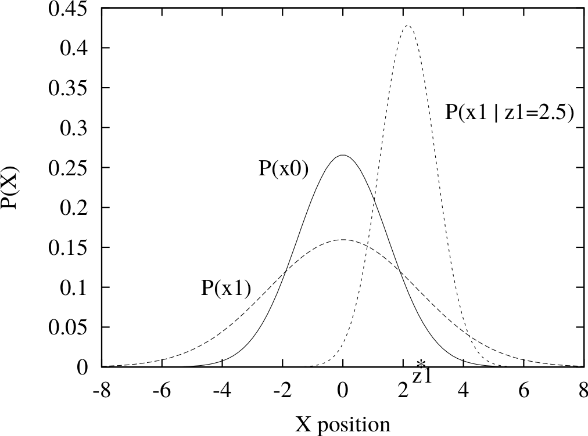
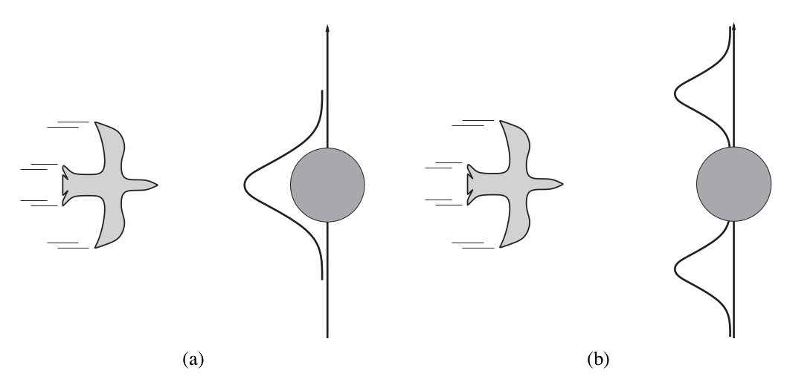
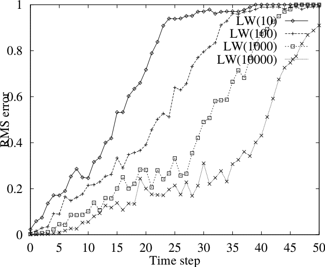

class: middle, center, title-slide

# Introduction to Artificial Intelligence

Lecture 7: Reasoning over time

  
Prof. Gilles Louppe 
[g.louppe@uliege.be](g.louppe@uliege.be)

???

R: add EM!! crucially missing
R: refaire les plots comme pour lecture 6
R: trim down the part on DBN
R: Bayes filter -> then kf as a special case

---

# Today

.grid[
.kol-1-2[
- Markov models
    - Markov processes
    - Inference tasks
        - Prediction
        - Filtering
        - Smoothing
        - Most likely explanation
    - Hidden Markov models
- Filtering
    - Kalman filter
    - Dynamic Bayesian networks
    - Particle filters
]
.kol-1-2[   .width-100[]
]
]

.footnote[Image credits: [CS188](http://ai.berkeley.edu/lecture_slides.html), UC Berkeley.]

---

class: middle, black-slide

.center[
<video controls preload="auto" height="400" width="640">
  <source src="./figures/lec7/pacman-no-beliefs.mp4" type="video/mp4">
</video>

Pacman revenge: How to make good use of the sonar readings?
]

.footnote[Image credits: [CS188](http://ai.berkeley.edu/lecture_slides.html), UC Berkeley.]

---

class: middle

# Markov models

---

# Reasoning over time

Often, we want to **reason about a sequence** of observations.
- Speech recognition
- Robot localization
- User attention
- Medical monitoring.

For this reason, we need to introduce **time** (or space) in our model.

---

class: middle

## Modelling time

Consider the world as a *discrete* series of *time slices*, each of which contains a set of random variables:
- $\mathbf{X}\_t$ denotes the set of **unobservable** state variables at time $t$.
- $\mathbf{E}\_t$ denotes the set of *observable* evidence variables at time $t$.

We specify:
- a **transition model** $P(\mathbf{X}\_t | \mathbf{X}\_{0:t-1})$ that defines the probability distribution over the latest state variables, given the previous (unobserved) values.
- a **sensor model** $P(\mathbf{E}\_t | \mathbf{X}\_{0:t}, \mathbf{E}\_{0:t-1})$ that defines the probability distribution over the latest evidence variables, given all previous (observed and unobserved) values.

---

# Markov processes

## Markov assumption
- The current state of the world depends only on its immediate previous state(s).
- i.e., $\mathbf{X}\_t$ depends on only a bounded subset of $\mathbf{X}\_{0:t-1}$.

Random processes that satisfy this assumption are called **Markov processes**.

---

class: middle

## First-order Markov processes

- Markov processes such that $$P(\mathbf{X}\_t | \mathbf{X}\_{0:t-1}) = P(\mathbf{X}\_t | \mathbf{X}\_{t-1}).$$
- i.e., $\mathbf{X}\_t$ and $\mathbf{X}\_{0:t-2}$ are conditionally independent given $\mathbf{X}\_{t-1}$.

 
.center.width-100[]

---

class: middle

## Second-order Markov processes

- Markov processes such that $$P(\mathbf{X}\_t | \mathbf{X}\_{0:t-1}) = P(\mathbf{X}\_t | \mathbf{X}\_{t-2}, \mathbf{X}\_{t-1}).$$
- i.e., $\mathbf{X}\_t$ and $\mathbf{X}\_{0:t-3}$ are conditionally independent given $\mathbf{X}\_{t-1}$ and $\mathbf{X}\_{t-2}$.

 
.center.width-100[]

---

class: middle

## Sensor Markov assumption

- Additionally, we make a (first-order) **sensor Markov assumption**: $$P(\mathbf{E}\_t | \mathbf{X}\_{0:t}, \mathbf{E}\_{0:t-1}) = P(\mathbf{E}\_t | \mathbf{X}\_{t})$$

## Stationarity assumption

-  The transition and the sensor models are the same for all $t$ (i.e., the laws of physics do not change with time).

---

# Joint distribution

 
.center.width-100[]
 

A Markov process can be described as a *growable* Bayesian network, unrolled infinitely through time, with a specified **restricted structure** between time steps.

Therefore, the *joint distribution* of all variables up to $t$ in a (first-order) Markov process is
    $$P(\mathbf{X}\_{0:t}, \mathbf{E}\_{1:t}) = P(\mathbf{X}\_{0}) \prod\_{i=1}^t P(\mathbf{X}\_{i} | \mathbf{X}\_{i-1}) P(\mathbf{E}\_{i}|\mathbf{X}\_{i}).$$

???

[Q] Why is this true? Don't the variables $\mathbf{X}\_{t+1:\infty}$ and $\mathbf{E}\_{t+1:\infty}$ also characterize the joint distribution of the former?

---

class: middle

## Example: Will you take your umbrella today?

.center.width-80[]

.grid[
.kol-1-2[
.center.width-100[]
]
.kol-1-2[
- $P(\text{Umbrella}\_t | \text{Rain}\_t)$?
- $P(\text{Rain}\_t | \text{Umbrella}\_{0:t-1})$?
- $P(\text{Rain}\_{t+2} | \text{Rain}\_{t})$?
]]

.footnote[Image credits: [CS188](http://ai.berkeley.edu/lecture_slides.html), UC Berkeley.]

---

class: middle

.center.width-60[]

The transition model $P(\text{Rain}\_t | \text{Rain}\_{t-1})$ can equivalently be represented by a state transition diagram.

---

# Inference tasks

- *Prediction*: $P(\mathbf{X}\_{t+k}| \mathbf{e}\_{1:t})$ for $k>0$
    - Computing the posterior distribution over future states.
    - Used for evaluation of possible action sequences.
- *Filtering*: $P(\mathbf{X}\_{t}| \mathbf{e}\_{1:t})$
    - Filtering is what a rational agent does to keep track of the current hidden state $\mathbf{X}\_t$, its **belief state**, so that rational decisions can be made.
- *Smoothing*: $P(\mathbf{X}\_{k}| \mathbf{e}\_{1:t})$ for $0 \leq k < t$
    - Computing the posterior distribution over past states.
    - Used for building better estimates, since it incorporates more evidence.
    - Essential for learning.    
- *Most likely explanation*: $\arg \max\_{\mathbf{x}\_{1:t}} P(\mathbf{x}\_{1:t}| \mathbf{e}\_{1:t})$
    - Decoding with a noisy channel, speech recognition, etc.

---

# Prediction

.center.width-50[]

To predict the future  $P(\mathbf{X}\_{t+k}| \mathbf{e}\_{1:t})$:
- **Push** the prior belief state $P(\mathbf{X}\_{t} | \mathbf{e}\_{1:t})$ through the transition model:
$$P(\mathbf{X}\_{t+1}| \mathbf{e}\_{1:t}) = \sum\_{\mathbf{x}\_{t}} P(\mathbf{X}\_{t+1} | \mathbf{x}\_{t}) P(\mathbf{x}\_{t} | \mathbf{e}\_{1:t})$$

- Repeat up to $t+k$, using $P(\mathbf{X}\_{t+k-1}| \mathbf{e}\_{1:t})$ to compute $P(\mathbf{X}\_{t+k}| \mathbf{e}\_{1:t})$.

.footnote[Image credits: [CS188](http://ai.berkeley.edu/lecture_slides.html), UC Berkeley.]

---

class: middle, black-slide

.center[
<video controls preload="auto" height="400" width="640">
  <source src="./figures/lec7/gb-basics.mp4" type="video/mp4">
</video>]

.center[Basic dynamics (Ghostbusters)]

.footnote[Image credits: [CS188](http://ai.berkeley.edu/lecture_slides.html), UC Berkeley.]

---

class: middle, black-slide

.center[
<video controls preload="auto" height="400" width="640">
  <source src="./figures/lec7/gb-circular.mp4" type="video/mp4">
</video>]

.center[Circular dynamics (Ghostbusters)]

.footnote[Image credits: [CS188](http://ai.berkeley.edu/lecture_slides.html), UC Berkeley.]

---

class: middle, black-slide

.center[
<video controls preload="auto" height="400" width="640">
  <source src="./figures/lec7/gb-whirlpool.mp4" type="video/mp4">
</video>]

.center[Whirlpool dynamics (Ghostbusters)]

.footnote[Image credits: [CS188](http://ai.berkeley.edu/lecture_slides.html), UC Berkeley.]

---

class: middle

.center[
.width-100[]

.width-100[]

As time passes, uncertainty "accumulates" if we do not accumulate new evidence.
]

.footnote[Image credits: [CS188](http://ai.berkeley.edu/lecture_slides.html), UC Berkeley.]

---

# Stationary distributions

What if $t \to \infty$?
- For most chains, the influence of the initial distribution gets lesser and lesser over time.
- Eventually, the distribution converges to a fixed point, called the **stationary distribution**.
- This distribution is such that
$$P(\mathbf{X}\_\infty) = P(\mathbf{X}\_{\infty+1}) = \sum\_{\mathbf{x}\_\infty} P(\mathbf{X}\_{\infty+1} | \mathbf{x}\_\infty) P(\mathbf{x}\_\infty) $$

---

class: middle

## Example

$
\begin{aligned}
P(\mathbf{X}\_\infty = \text{sun}) =&\, P(\mathbf{X}\_{\infty+1} = \text{sun}) \\\\
=&\, P(\mathbf{X}\_{\infty+1}=\text{sun} | \mathbf{X}\_{\infty}=\text{sun}) P(\mathbf{X}\_{\infty}=\text{sun})\\\\
 & + P(\mathbf{X}\_{\infty+1}=\text{sun} | \mathbf{X}\_{\infty}=\text{rain}) P(\mathbf{X}\_{\infty}=\text{rain})\\\\
=&\, 0.9 P(\mathbf{X}\_{\infty}=\text{sun}) + 0.3 P(\mathbf{X}\_{\infty}=\text{rain})
\end{aligned}
$

Therefore, $P(\mathbf{X}\_\infty=\text{sun}) = 3 P(\mathbf{X}\_\infty=\text{rain})$.

Which implies that
$P(\mathbf{X}\_\infty=\text{sun}) = \frac{3}{4}$ and
$P(\mathbf{X}\_\infty=\text{rain}) = \frac{1}{4}$.

.footnote[Image credits: [CS188](http://ai.berkeley.edu/lecture_slides.html), UC Berkeley.]

???

| $\mathbf{X}\_{t-1}$ | $\mathbf{X}\_{t}$ | $P$ |
| --- | --- | --- |
| $sun$ | $sun$ | 0.9 |
| $sun$ | $rain$ | 0.1 |
| $rain$ | $sun$ | 0.3 |
| $rain$ | $rain$ | 0.7 |

---

# Filtering

 
.center.width-90[]
 

What if we collect new observations?
Beliefs get reweighted, and uncertainty "decreases":

$$P(\mathbf{X}\_{t+1}| \mathbf{e}\_{1:t+1}) \propto P(\mathbf{e}\_{t+1} | \mathbf{X}\_{t+1}) P(\mathbf{X}\_{t+1} | \mathbf{e}\_{1:t})$$

---

class: middle

## Bayes filter

An agent maintains a *belief state* estimate $P(\mathbf{X}\_{t}| \mathbf{e}\_{1:t})$ (its prior) and updates it as new evidences $\mathbf{e}\_{t+1}$ are collected (to obtain its posterior).

Recursive Bayesian estimation:
- (Predict step): Project the current state belief forward from $t$ to $t+1$ through the transition model.
- (Update step): Update this new state using the evidence $\mathbf{e}\_{t+1}$.

???

$P(\mathbf{X}\_{t+1}| \mathbf{e}\_{1:t+1}) = f(\mathbf{e}\_{t+1}, P(\mathbf{X}\_{t}| \mathbf{e}\_{1:t}))$

---

class: middle

$$
\begin{aligned}
P(\mathbf{X}\_{t+1}| \mathbf{e}\_{1:t+1}) &= P(\mathbf{X}\_{t+1}| \mathbf{e}\_{1:t}, \mathbf{e}\_{t+1}) \\\\
&= \alpha P(\mathbf{e}\_{t+1}| \mathbf{X}\_{t+1}, \mathbf{e}\_{1:t}) P(\mathbf{X}\_{t+1}| \mathbf{e}\_{1:t}) \\\\
&= \alpha P(\mathbf{e}\_{t+1}| \mathbf{X}\_{t+1}) P(\mathbf{X}\_{t+1}| \mathbf{e}\_{1:t}) \\\\
&= \alpha P(\mathbf{e}\_{t+1}| \mathbf{X}\_{t+1}) \sum\_{\mathbf{x}\_t} P(\mathbf{X}\_{t+1}|\mathbf{x}\_t, \mathbf{e}\_{1:t}) P(\mathbf{x}\_t | \mathbf{e}\_{1:t}) \\\\
&= \alpha P(\mathbf{e}\_{t+1}| \mathbf{X}\_{t+1}) \sum\_{\mathbf{x}\_t} P(\mathbf{X}\_{t+1}|\mathbf{x}\_t) P(\mathbf{x}\_t | \mathbf{e}\_{1:t})
\end{aligned}
$$

where
- the normalization constant $$\alpha = \frac{1}{P(\mathbf{e}\_{t+1} | \mathbf{e}\_{1:t})} = 1 / \sum\_{\mathbf{x}\_{t+1}} P(\mathbf{e}\_{t+1} | \mathbf{x}\_{t+1}) P(\mathbf{x}\_{t+1} | \mathbf{e}\_{1:t}) $$  is used to make probabilities sum to 1;
- in the last expression, the first and second terms are given by the model while the third is obtained recursively.

<!-- $P(\mathbf{X}\_{t+1}| \mathbf{e}\_{1:t+1}) = P(\mathbf{X}\_{t+1}| \mathbf{e}\_{1:t}, \mathbf{e}\_{t+1})$ 
$\quad = \alpha P(\mathbf{e}\_{t+1}| \mathbf{X}\_{t+1}, \mathbf{e}\_{1:t}) P(\mathbf{X}\_{t+1}| \mathbf{e}\_{1:t}) \quad $ 
$\quad = \alpha P(\mathbf{e}\_{t+1}| \mathbf{X}\_{t+1}) P(\mathbf{X}\_{t+1}| \mathbf{e}\_{1:t})$ 
$\quad = \alpha P(\mathbf{e}\_{t+1}| \mathbf{X}\_{t+1}) \sum\_{\mathbf{x}\_t} P(\mathbf{X}\_{t+1}|\mathbf{x}\_t, \mathbf{e}\_{1:t}) P(\mathbf{x}\_t | \mathbf{e}\_{1:t}) $ 
$\quad = \alpha P(\mathbf{e}\_{t+1}| \mathbf{X}\_{t+1}) \sum\_{\mathbf{x}\_t} P(\mathbf{X}\_{t+1}|\mathbf{x}\_t) P(\mathbf{x}\_t | \mathbf{e}\_{1:t}) $ -->

---

class: middle

We can think of $P(\mathbf{X}\_t | \mathbf{e}\_{1:t})$ as a *message* $\mathbf{f}\_{1:t}$ that is propagated **forward** along the sequence, modified by each transition and updated by each new observation.
- Thus, the process can be implemented as $\mathbf{f}\_{1:t+1} = \alpha\, \text{forward}(\mathbf{f}\_{1:t}, \mathbf{e}\_{t+1} )$.
- The complexity of a forward update is constant (in time and space) with $t$.

---

class: middle

## Example

.center.width-80[]

 

.grid[
.kol-1-4[]
.kol-1-4.center[

| $R\_{t-1}$ | $P(R\_t)$ |
| ---------- | --------- |
| $true$ | $0.7$ |
| $false$ | $0.3$ |

]
.kol-1-4.center[

| $R\_{t}$ | $P(U\_t)$ |
| ---------- | --------- |
| $true$ | $0.9$ |
| $false$ | $0.2$ |

]
]

???

Solve on blackboard.

---

# Smoothing

We want to compute $P(\mathbf{X}\_{k}| \mathbf{e}\_{1:t})$ for $0 \leq k < t$.

Divide evidence $\mathbf{e}\_{1:t}$ into $\mathbf{e}\_{1:k}$ and $\mathbf{e}\_{k+1:t}$. Then,

$$
\begin{aligned}
P(\mathbf{X}\_k | \mathbf{e}\_{1:t}) &= P(\mathbf{X}\_k | \mathbf{e}\_{1:k}, \mathbf{e}\_{k+1:t}) \\\\
&= \alpha P(\mathbf{X}\_k | \mathbf{e}\_{1:k}) P(\mathbf{e}\_{k+1:t} | \mathbf{X}\_k, \mathbf{e}\_{1:k}) \\\\
&= \alpha P(\mathbf{X}\_k | \mathbf{e}\_{1:k}) P(\mathbf{e}\_{k+1:t} | \mathbf{X}\_k).
\end{aligned}
$$

---

class: middle

Let the **backward** message $\mathbf{b}\_{k+1:t}$ correspond to $P(\mathbf{e}\_{k+1:t} | \mathbf{X}\_k)$. Then,
$$P(\mathbf{X}\_k | \mathbf{e}\_{1:t}) = \alpha\, \mathbf{f}\_{1:k} \mathbf{b}\_{k+1:t}$$

This backward message can be computed using backwards recursion:

$$
\begin{aligned}
P(\mathbf{e}\_{k+1:t} | \mathbf{X}\_k) &= \sum\_{\mathbf{x}\_{k+1}} P(\mathbf{e}\_{k+1:t} | \mathbf{X}\_k, \mathbf{x}\_{k+1}) P(\mathbf{x}\_{k+1} | \mathbf{X}\_k) \\\\
&= \sum\_{\mathbf{x}\_{k+1}} P(\mathbf{e}\_{k+1:t} | \mathbf{x}\_{k+1}) P(\mathbf{x}\_{k+1} | \mathbf{X}\_k) \\\\
&= \sum\_{\mathbf{x}\_{k+1}} P(\mathbf{e}\_{k+1} | \mathbf{x}\_{k+1}) P(\mathbf{e}\_{k+2:t} | \mathbf{x}\_{k+1}) P(\mathbf{x}\_{k+1} | \mathbf{X}\_k)
\end{aligned}
$$

The first and last factors are given by the model. The second factor is obtained recursively. Therefore,
$$\mathbf{b}\_{k+1:t} = \text{backward}(\mathbf{b}\_{k+2:t}, \mathbf{e}\_{k+1} ).$$

---

# Forward-backward algorithm

.center.width-100[]

Complexity:
- Smoothing for a particular time step $k$ takes: $O(t)$
- Smoothing a whole sequence (because of caching):  $O(t)$

---

class: middle

## Example

.center.width-80[]

???

Solve on blackboard.

---

xxx

# Most likely explanation

- The most likely sequence  **is not** the sequence of most likely states!
- The most likely path to each $\mathbf{x}\_{t+1}$, is the most likely path to *some* $\mathbf{x}\_t$ plus one more step. Therefore,
  
$\max\_{\mathbf{x}\_{1:t}} P(\mathbf{x}\_{1:t}, \mathbf{X}\_{t+1} | \mathbf{e}\_{1:t+1})$ 
$\quad = \alpha P(\mathbf{e}\_{t+1}|\mathbf{X}\_{t+1}) \max\_{\mathbf{x}\_t}( P(\mathbf{X}\_{t+1} | \mathbf{x}\_t) \max\_{\mathbf{x}\_{1:t-1}} P(\mathbf{x}\_{1:t-1}, \mathbf{x}\_{t} | \mathbf{e}\_{1:t}) )$
- Identical to filtering, except that the forward message $\mathbf{f}\_{1:t} = P(\mathbf{X}\_t | \mathbf{e}\_{1:t})$ is replaced by:
  
$\mathbf{m}\_{1:t} = \max\_{\mathbf{x}\_{1:t-1}} P(\mathbf{x}\_{1:t-1}, \mathbf{X}\_{t} | \mathbf{e}\_{1:t})$  
i.e., $\mathbf{m}\_{1:t}(i)$ gives the probability of the most likely path to state $i$.
- The update has its sum replaced by max, giving the **Viterbi algorithm**:
  
$\mathbf{m}\_{1:t+1} = \alpha P(\mathbf{e}\_{t+1} | \mathbf{X}\_{t+1}) \max\_{\mathbf{x}\_{1:t}} P(\mathbf{X}\_{t+1} | \mathbf{x}\_{t}) \mathbf{m}\_{1:t}$

---

class: middle

## Example

.center.width-90[]

[Q] How do you retrieve the path, in addition to its likelihood?

---

# Hidden Markov models

So far, we described Markov processes over arbitrary sets of state variables $\mathbf{X}\_t$ and evidence variables $\mathbf{E}\_t$.
- A **hidden Markov model** (HMM) is a Markov process in which the state $\mathbf{X}\_t$ and the evidence $\mathbf{E}\_t$ are both *single discrete* random variables.
    - e.g., $\mathbf{X}\_t = X\_t$, with domain $\\\{1, ..., S\\\}$.
- This restricted structure allows for a matrix formulation of the inference algorithms.

---

class: middle

## Note on terminology

Some authors instead divide Markov models into two classes, depending on the observability of the system state:
- Observable system state: Markov chains
- Partially-observable system state: Hidden Markov models.

We follow here the terminology of the textbook.

---

## Simplified matrix algorithms

- The transition model $P(X\_t | X\_{t-1})$ becomes an $S \times S$ *transition matrix* $\mathbf{T}$, where $\mathbf{T}\_{ij} = P(X\_t=j | X\_{t-1}=i)$.
- The sensor model $P(E\_t | X\_t)$ is defined, for convenience, as an  $S \times S$ *sensor matrix*
$\mathbf{O}\_t$ whose $i$-th diagonal element is $P(e\_t | X\_t = i)$ and whose other entries are 0.
- If we use column vectors to represent forward and backward messages, then we have:
$$\mathbf{f}\_{1:t+1} = \alpha \mathbf{O}\_{t+1} \mathbf{T}^T \mathbf{f}\_{1:t}$$
$$\mathbf{b}\_{k+1:t} = \mathbf{T} \mathbf{O}\_{k+1} \mathbf{b}\_{k+2:t}$$
- Therefore the forward-backward algorithm needs time $O(S^2t)$ and space $O(St)$.

???

R: is the evidence binary?

---

class: middle

## Example

xxx

---

# Applications

HMMs are used in many fields where the goal is to recover a data sequence that is not immediately observable, but other data that depend on the sequence are.

- Computational finance
- Speech recognition (see Lecture 10)
- Speech synthesis
- Part-of-speech tagging
- Machine translation
- Handwriting recognition
- Time series analysis
- Activity recognition
- etc

---

class: middle

# Filters

---

# Continuous variables

xxx introduce instead the robot example

From noisy observations collected over time, we want to estimate **continuous** state variables.
- e.g. the position $\mathbf{X}\_t$ and velocity $\mathbf{\dot{X}}\_t$ of a robot.

We still assume *discrete* time steps.

  

[Q] How can we model this system to make filtering efficient and accurate?

---

class: middle

The Bayes filter similarly applies to **continuous** state and evidence variables $\mathbf{X}\_{t}$ and $\mathbf{E}\_{t}$, in which case summations are replaced with integrals:
$$
\begin{aligned}
p(\mathbf{x}\_{t+1}| \mathbf{e}\_{1:t+1}) &= \alpha\, p(\mathbf{e}\_{t+1}| \mathbf{x}\_{t+1}) \int p(\mathbf{x}\_{t+1}|\mathbf{x}\_t) p(\mathbf{x}\_t | \mathbf{e}\_{1:t}) d{\mathbf{x}\_t}
\end{aligned}
$$
where the normalization constant is
$$\alpha = 1\, / \int p(\mathbf{e}\_{t+1} | \mathbf{x}\_{t+1}) p(\mathbf{x}\_{t+1} | \mathbf{e}\_{1:t}) d\mathbf{x}\_{t+1}.$$

---

# Kalman filters

.center.width-50[]

A **Kalman filter** assumes:
- Gaussian prior
- Linear Gaussian transition model
- Linear Gaussian sensor model

---

# Updating Gaussian distributions

- *Prediction step*:
    - If $P(\mathbf{X}\_t | \mathbf{e}\_{1:t})$ is Gaussian and the transition model $P(\mathbf{X}\_{t+1} | \mathbf{x}\_{t})$ is linear Gaussian, then
$$P(\mathbf{X}\_{t+1} | \mathbf{e}\_{1:t}) = \int\_{\mathbf{x}\_t} P(\mathbf{X}\_{t+1} | \mathbf{x}\_{t}) P(\mathbf{x}\_{t} | \mathbf{e}\_{1:t}) d\mathbf{x}\_t $$
is Gaussian.
- *Update step*:
    - If $P(\mathbf{X}\_{t+1} | \mathbf{e}\_{1:t})$ is Gaussian and the sensor model $P(\mathbf{e}\_{t+1} | \mathbf{X}\_{t+1})$ is linear Gaussian, then
$$P(\mathbf{X}\_{t+1} | \mathbf{e}\_{1:t+1}) = \alpha P(\mathbf{e}\_{t+1} | \mathbf{X}\_{t+1}) P(\mathbf{X}\_{t+1} | \mathbf{e}\_{1:t})$$
is also Gaussian.
- Hence, for a Kalman filter, $P(\mathbf{X}\_t | \mathbf{e}\_{1:t})$ is a multivariate Gaussian $\mathcal{N}(\mathbf{\mu}\_t, \mathbf{\Sigma}\_t)$ for all $t$.
- General (nonlinear, non-Gaussian) process: the description of the posterior grows **unboundedly** as $t \to \infty$.

---

# 1D example

- Gaussian random walk on $X$-axis:
    - Gaussian prior with variance $\sigma_0^2$.
    - The transition model adds random perturbations of constant variance $\sigma\_x^2$.
    - The sensor model yields measurements with Gaussian noise with variance $\sigma\_z^2$.
- Then the update equations given a new evidence $z\_{t+1}$ are:
    - $\mu\_{t+1} = \frac{(\sigma\_t^2 + \sigma\_x^2) z\_{t+1} + \sigma\_z^2 \mu_t }{\sigma\_t^2 + \sigma\_x^2 + \sigma\_z^2}$
    - $\sigma\_{t+1}^2 = \frac{(\sigma_t^2 + \sigma\_x^2) \sigma\_z^2}{\sigma\_t^2 + \sigma\_x^2 + \sigma\_z^2}$

.center.width-40[]

???

We can interpret
the calculation for the new mean $\mu\_{t+1}$ as simply a weighted mean of the new observation
$z\_{t+1}$ and the old mean $\mu\_t$ .
- If the observation is unreliable, then $\sigma\_z^2$ is large and we pay more
attention to the old mean;
- if the old mean is unreliable ($\sigma\_t^2$ is large) or the process is highly
unpredictable ($\sigma\_x^2$ is large), then we pay more attention to the observation

---

# General Kalman update

- Transition and sensor models:
    - $P(\mathbf{x}\_{t+1} | \mathbf{x}\_t) = \mathcal{N}(\mathbf{F}\mathbf{x}\_t, \mathbf{\Sigma}\_x)(\mathbf{x}\_{t+1})$
    - $P(\mathbf{z}\_{t} | \mathbf{x}\_t) = \mathcal{N}(\mathbf{H}\mathbf{x}\_t, \mathbf{\Sigma}\_z)(\mathbf{z}\_{t})$
- $\mathbf{F}$ and $\mathbf{\Sigma}\_x$  are matrices describing the linear transition model and transition noise covariance.
- $\mathbf{H}$ and $\mathbf{\Sigma}\_z$ are the corresponding matrices for the sensor model.
- The filter computes the following update:
    - $\mu\_{t+1} = \mathbf{F}\mathbf{\mu}\_t + \mathbf{K}\_{t+1} (\mathbf{z}\_{t+1} - \mathbf{H} \mathbf{F} \mathbf{\mu}\_t)$
    - $\mathbf{\Sigma}\_{t+1} = (\mathbf{I} - \mathbf{K}\_{t+1} \mathbf{H}) (\mathbf{F}\mathbf{\Sigma}\_t \mathbf{F}^T + \mathbf{\Sigma}\_x)$
        - where $\mathbf{K}\_{t+1} = (\mathbf{F}\mathbf{\Sigma}\_t \mathbf{F}^T + \mathbf{\Sigma}\_x) \mathbf{H}^T (\mathbf{H}(\mathbf{F}\mathbf{\Sigma}\_t \mathbf{F}^T + \mathbf{\Sigma}\_x)\mathbf{H}^T + \mathbf{\Sigma}\_z)^{-1}$ is the *Kalman gain matrix*.
- Note that $\mathbf{\Sigma}\_t$ and $\mathbf{K}\_t$ are independent of the evidence. Therefore, they can be computed offline.

???

These equations intuitively make sense.

Consider
the update for the mean state estimate $\mu\_{t+1}$.
- The term  $\mathbf{F}\mathbf{\mu}\_t$ is the predicted state at $t + 1$,
- so
$\mathbf{H} \mathbf{F} \mathbf{\mu}\_t$ is the predicted observation.
- Therefore, the term $\mathbf{z}\_{t+1} - \mathbf{H} \mathbf{F} \mathbf{\mu}\_t$ represents the error in
the predicted observation.
- This is multiplied by $ \mathbf{K}\_{t+1}$ to correct the predicted state; hence,
$ \mathbf{K}\_{t+1}$ is a measure of how seriously to take the new observation relative to the prediction.

---

# 2D tracking: filtering

.center.width-80[]

---

# 2D tracking: smoothing

.center.width-80[]

---

# Apollo Guidance Computer

.grid[
.col-3-4[
- The Kalman filter put man on the Moon, **literally**!
- The onboard guidance software of Saturn-V used a *Kalman filter*.
    - Used to merge new data with past position measurements to produce an optimal position estimate of the spacecraft.
]
.col-1-4[
]
]
.center.width-50[]

.footnote[Credits: [Apollo-11 source code](https://github.com/chrislgarry/Apollo-11/blob/4f3a1d4374d4708737683bed78a501a321b6042c/Comanche055/MEASUREMENT_INCORPORATION.agc#L208)]

---

# Limitations

- The Kalman filter cannot be applied if the transition model is **non-linear**.
- The *Extended Kalman Filter* models transitions as locally linear around $\mathbf{x}\_t = \mu\_t$.
    - Still fails if the system is locally unsmooth.

.center.width-80[]

---

# Dynamic Bayesian networks

- A **dynamic Bayesian network** (DBN) is a Bayesian network that represents a temporal probability model.
    - Over infinitely many time steps.
- Each slice of a DBN can have any number of state variables $\mathbf{X}\_t$ and evidence variables $\mathbf{E}\_t$.
- Nodes can be arbitrarily connected
    - to nodes from the same slice
    - to nodes from previous slices
- The Markov assumption **need not** to be satisfied.

.center.width-70[]

---

# DBNs vs HMMs

- Every HMM is a single-variable DBN.
- Every discrete DBN can be transformed into an HMM.
    - Group state (resp. evidence) variables into a single variable whose values are all possible tuples of values of the individual state variables.
- By decomposing a system state into its constituent variables, DBNs can take advantage of the **sparseness** of the temporal probability model.
    - $20$ boolean state variables, each of which has $3$ parents in the preceding slice.
    - The DBN transition model counts $20 \times 2^3 = 160$ probabilities.  
    - The corresponding HMM has $2^{20}$ state values and therefore $2^{40}$ probabilities in the transition matrix!

.center.width-60[]

---

# DBNs vs Kalman filters

- Every Kalman filter model is a DBN.
- Few DBNs are Kalman filter models.
    - The real world requires non-Gaussian posteriors.
    - DBNs can model **arbitrary distributions**.

---

# Exact inference in DBNs

.center.width-80[]

- Straightforward method for exact inference: **unroll** the network through time and run any exact algorithm.
    - e.g., variable elimination.
- Problem: inference cost for each update grows with $t$.
- *Rollup filtering*: add slice $t+1$, sum out slice $t$ using variable elimination.
    - Largest factor is $O(d^{n+k})$ and the total update cost per step is $O(nd^{n+k})$.
    - Better than HMMs, which is $O(d^{2n})$, but still **infeasible** for large numbers of variables.

[Q] Compare rollup filtering to forward-backward in Markov processes.

---

# Likelihood weighting for DBNs

- If exact inference is intractable, then let's use instead *approximate inference*. What about likelihood weighting?
- Generated LW samples **pay no attention** to the evidence!
    - The fraction of samples that remain close to the actual series of events drops exponentially with $t$.
    - Therefore, the number of required samples for inference grows exponentially with $t$.

.center.width-50[]

---

# Particle filtering

- Basic idea:
    - Maintain a *finite* population of samples, called **particles**.
    - Ensure the particles track the high-likelihood regions of the
state space.
    - Throw away samples that have very low weight, **according to the evidence**.
    - Replicate those that have high weight.
- Scale to high-dimensional state spaces ($n > 10^5$).
- Can be shown to be *consistent*.

.center.width-90[]

---

# Update cycle

.center.width-100[]

---

# Performance

Approximation error of particle filtering remains bounded over time.
- At least *empirically*.
- Theoretical analysis is difficult.

.center.width-70[]

---

class: center

# Robot localization

.center.width-70[]

Run demo.

---

# Pacman, revisited

.center[
<video controls preload="auto" height="400" width="640">
  <source src="./figures/lec7/pacman-with-beliefs.mp4" type="video/mp4">
</video>]

.footnote[Image credits: [CS188](http://ai.berkeley.edu/lecture_slides.html), UC Berkeley.]

---

# Summary

- Temporal models use state and sensor variables replicated over time.
- *Markov assumptions* and *stationarity assumption*. So we only need:
    - transition model $P(\mathbf{X}\_{t+1} | \mathbf{X}\_t)$
    - sensor model $P(\mathbf{E}\_t | \mathbf{X}\_t)$
- Inference tasks include filtering, prediction, smoothing and most likely sequence.
    - All can be done recursively with constant cost per time step.
- HMMs have a signel discrete state variable.
- Kalman filters allow $n$ *continuous* state variables, assume a linear Gaussian model.
- DBNs generalize HMMs and Kalman filters.
    - Exact inference is usually **intractable**.
    - Particle filtering is a good approximate filtering algorithm for DBNs.

---

class: end-slide, center
count: false

The end.

---

# References
