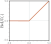
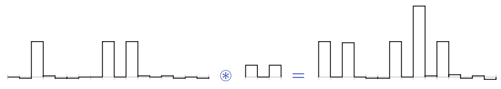

class: middle, center, title-slide

# Introduction to Artificial Intelligence

Lecture 7: Machine learning and neural networks

  
Prof. Gilles Louppe 
[g.louppe@uliege.be](mailto:g.louppe@uliege.be)

---

# Today

.center.width-60[]

Learning from data is a key component of artificial intelligence. In this lecture, we will introduce the principles of:
- Machine learning
- Neural networks

.footnote[Credits: [CS188](https://inst.eecs.berkeley.edu/~cs188/), UC Berkeley.]

---

class: middle

## Learning agents

What if the environment is **unknown**?
- Learning provides an automated way to modify the agent's internal decision mechanisms to improve its own performance.
- It exposes the agent to reality rather than trying to hardcode reality into the agent's program.

More generally, learning is useful for any task where it is difficult to write a program that performs the task but easy to obtain examples of desired behavior.

---

class: middle

# Machine learning

---

class: middle

.center[
.width-40[] &nbsp; &nbsp;
.width-40[]
]

.question[How would you write a computer program that recognizes cats from dogs?]

---

class: middle

.center.width-60[]

---

count: false
class: middle

.center.width-60[]

---

count: false
class: black-slide, middle
background-image: url(./figures/lec7/cat3.png)
background-size: cover

---

count: false
class: black-slide, middle

background-image: url(./figures/lec7/cat4.png)
background-size: cover

---

class: middle

.center.width-100[]

.center[The deep learning approach.]

---

# Problem statement

.grid[
.kol-2-3[

Let $\mathbf{d} \sim p(\mathbf{x}, y)$ be a dataset of $N$ example input-output pairs
    $$\mathbf{d} = \\\\{ (\mathbf{x}\_1, y\_1), (\mathbf{x}\_2, y\_2), ..., (\mathbf{x}\_N, y\_N) \\\\},$$
where $\mathbf{x}\_i \in \mathbb{R}^d$ are $d$-dimensional vectors representing the input values and $y_i \in \mathcal{Y}$ are the corresponding output values.

From this data, we want to identify a probabilistic model $$p\_\theta(y|\mathbf{x})$$ that best explains the data.

]
.kol-1-3[  .center.width-80[]]
]

---

class: middle

.center.width-60[]

.center[Regression ($y \in \mathbb{R}$) and classification ($y \in \\\\{0, 1, ..., C-1\\\\}$) problems.]

.footnote[Credits: [Simon J.D. Prince](https://udlbook.github.io/udlbook/), 2023.]

---

class: middle

.center.width-60[]

.center[Supervised learning with structured outputs ($y \in \mathcal{Y}$).]

.footnote[Credits: [Simon J.D. Prince](https://udlbook.github.io/udlbook/), 2023.]

---

# Linear regression

Let us first assume that $y \in \mathbb{R}$.

 
.center.width-90[]

.footnote[Credits: [CS188](https://inst.eecs.berkeley.edu/~cs188/), UC Berkeley.]

???

Do it on the blackboard.

---

class: middle

.grid[
.kol-1-5[ .center.width-100[]]
.kol-4-5[.center.width-50[]]
]

Linear regression considers a parameterized linear Gaussian model for its parametric model of $p(y|\\mathbf{x})$, that is
$$p(y|\mathbf{x}) = \mathcal{N}(y | \mathbf{w}^T \mathbf{x} + b, \sigma^2),$$
where $\mathbf{w}$ and $b$ are parameters to determine.

.footnote[Credits: [Simon J.D. Prince](https://udlbook.github.io/udlbook/), 2023.]

---

  

To learn the conditional distribution $p(y|\mathbf{x})$, we maximize
$$p(y|\mathbf{x}) = \frac{1}{\sqrt{2\pi}\sigma} \exp\left(-\frac{1}{2}\frac{(y-(\mathbf{w}^T \mathbf{x} + b))^2}{\sigma^2}\right)$$
w.r.t. $\mathbf{w}$ and $b$ over the data $\mathbf{d} = \\\{ (\mathbf{x}\_j, y\_j) \\\}$.

--

count: false

By constraining the derivatives of the log-likelihood to $0$, we arrive to the problem of minimizing
$$\mathcal{L}(\mathbf{w},b) = \sum\_{j=1}^N (y\_j - (\mathbf{w}^T \mathbf{x}\_j + b))^2.$$
Therefore, minimizing the sum of squared errors corresponds to the MLE solution for a linear fit, assuming Gaussian noise of fixed variance. 

---

class: middle

.center.width-45[]

.center[
  
Minimizing the negative log-likelihood of a linear Gaussian model reduces to minimizing the sum of squared residuals.]

.footnote[Credits: [Simon J.D. Prince](https://udlbook.github.io/udlbook/), 2023.]

---

class: middle

If we absorb the bias term $b$ into the weight vector $\mathbf{w}$ by adding a constant feature $x_0=1$ to the input vector $\mathbf{x}$, the solution $\mathbf{w}^\*$ is given analytically by
$$\mathbf{w}^\* = (\mathbf{X}^T \mathbf{X})^{-1} \mathbf{X}^T \mathbf{y},$$
where $\mathbf{X}$ is the input matrix made of the stacked input vectors $\mathbf{x}_j$ (including the constant feature) and $\mathbf{y}$ is the output vector made of the output values $y_j$.

---

# Logistic regression

Let us now assume $y \in \\{0,1\\}$.

 
.center.width-50[]

.footnote[Credits: [CS188](https://inst.eecs.berkeley.edu/~cs188/), UC Berkeley.]

---

class: middle

Logistic regression models the conditional as
$$P(Y=1|\mathbf{x}) = \sigma(\mathbf{w}^T \mathbf{x}+b),$$
where the sigmoid activation function
$\sigma(x) = \frac{1}{1 + \exp(-x)}$
looks like a soft heavyside:
.center.width-60[]

???

This model is the core building block of deep neural networks!

---

class: middle

Following the principle of maximum likelihood estimation, we have

$$\begin{aligned}
&\arg \max\_{\mathbf{w},b} P(\mathbf{d}|\mathbf{w},b) \\\\
&= \arg \max\_{\mathbf{w},b} \prod\_{\mathbf{x}\_i, y\_i \in \mathbf{d}} P(Y=y\_i|\mathbf{x}\_i, \mathbf{w},b) \\\\
&= \arg \max\_{\mathbf{w},b} \prod\_{\mathbf{x}\_i, y\_i \in \mathbf{d}} \sigma(\mathbf{w}^T \mathbf{x}\_i + b)^{y\_i}  (1-\sigma(\mathbf{w}^T \mathbf{x}\_i + b))^{1-y\_i}  \\\\
&= \arg \min\_{\mathbf{w},b} \underbrace{\sum\_{\mathbf{x}\_i, y\_i \in \mathbf{d}} -{y\_i} \log\sigma(\mathbf{w}^T \mathbf{x}\_i + b) - {(1-y\_i)} \log (1-\sigma(\mathbf{w}^T \mathbf{x}\_i + b))}\_{\mathcal{L}(\mathbf{w}, b) = \sum\_i \ell(y\_i, \hat{y}(\mathbf{x}\_i; \mathbf{w}, b))}
\end{aligned}$$

This loss is an estimator of the **cross-entropy** $$H(p,q) = \mathbb{E}_p[-\log q]$$ for  $p=Y|\mathbf{x}\_i$ and $q=\hat{Y}|\mathbf{x}\_i$. 

Unfortunately, there is no closed-form solution for the MLE of $\mathbf{w}$ and $b$.

---

class: middle

## Gradient descent

Let $\mathcal{L}(\theta)$ denote a loss function defined over model parameters $\theta$ (e.g., $\mathbf{w}$ and $b$).

To minimize $\mathcal{L}(\theta)$, **gradient descent** uses local linear information to iteratively move towards a (local) minimum.

For $\theta\_0$, a first-order approximation around $\theta\_0$ can be defined as
$$\hat{\mathcal{L}}(\epsilon; \theta\_0) = \mathcal{L}(\theta\_0) + \epsilon^T\nabla\_\theta \mathcal{L}(\theta\_0) + \frac{1}{2\gamma}||\epsilon||^2.$$

.center.width-50[]

---

class: middle

A minimizer of the approximation $\hat{\mathcal{L}}(\epsilon; \theta\_0)$ is given for
$$\begin{aligned}
\nabla\_\epsilon \hat{\mathcal{L}}(\epsilon; \theta\_0) &= 0 \\\\
 &= \nabla\_\theta \mathcal{L}(\theta\_0) + \frac{1}{\gamma} \epsilon,
\end{aligned}$$
which results in the best improvement for the step $\epsilon = -\gamma \nabla\_\theta \mathcal{L}(\theta\_0)$.

Therefore, model parameters can be updated iteratively using the update rule
$$\theta\_{t+1} = \theta\_t -\gamma \nabla\_\theta \mathcal{L}(\theta\_t),$$
where
- $\theta_0$ are the initial parameters of the model,
- $\gamma$ is the learning rate.

---

class: center, middle

---

count: false
class: center, middle

---

count: false
class: center, middle

---

count: false
class: center, middle

---

count: false
class: center, middle

---

count: false
class: center, middle

---

count: false
class: center, middle

---

count: false
class: center, middle

---

class: middle, center

(Step-by-step code example)

---

class: middle

## Example: imitation learning in Pacman

Can we learn to play Pacman only from observations?
- Feature vectors $\mathbf{x} = g(s)$ are extracted from the game states $s$. Output values $y$ corresponds to actions $a$ .
- State-action pairs $(\mathbf{x}, y)$ are collected by observing an expert playing.
- We want to learn the actions that the expert would take in a given situation. That is, learn the mapping $f:\mathbb{R}^d \to \mathcal{A}$.
- This is a multiclass classification problem that can be solved by combining binary classifers.

.center.width-70[]

.footnote[Credits: [CS188](https://inst.eecs.berkeley.edu/~cs188/), UC Berkeley.]

---

class: middle, black-slide

.center[
<video controls muted preload="auto" height="400" width="640">
  <source src="./figures/lec7/training1.mp4" type="video/mp4">
</video>

The agent observes a very good Minimax-based agent for two games and updates its weight vectors as data are collected.
]

.footnote[Credits: [CS188](https://inst.eecs.berkeley.edu/~cs188/), UC Berkeley.]

---

class: middle, black-slide

.center[
<video controls muted preload="auto" height="400" width="640">
  <source src="./figures/lec7/training2.mp4" type="video/mp4">
</video>

  ]

.footnote[Credits: [CS188](https://inst.eecs.berkeley.edu/~cs188/), UC Berkeley.]

---

class: middle, black-slide

.center[
<video controls muted preload="auto" height="400" width="640">
  <source src="./figures/lec7/apprentice.mp4" type="video/mp4">
</video>

After two training episodes, the ML-based agents plays. 
No more Minimax!
]

.footnote[Credits: [CS188](https://inst.eecs.berkeley.edu/~cs188/), UC Berkeley.]

---

class: middle

# Deep Learning

(a short introduction)

---

# Shallow networks

A shallow network is a function $$f : \mathbb{R}^{d\_\text{in}} \to \mathbb{R}^{d\_\text{out}}$$ that maps multi-dimensional inputs $\mathbf{x}$ to multi-dimensional outputs $\mathbf{y}$ through a hidden layer $\mathbf{h} = [h\_0, h\_1, ..., h\_{q-1}] \in \mathbb{R}^q $, such that
$$\begin{aligned}
h\_j &= \sigma\left(\sum\_{i=0}^{d\_\text{in} - 1} w\_{ji} x\_i + b\_j  \right) \\\\
y\_k &= \sum\_{j=0}^{q-1} v\_{kj} h\_j + c\_k,
\end{aligned}$$
where $w\_{ji}$, $b\_j$, $v\_{kj}$ and $c\_k$ ($i=0, ..., d\_\text{in}-1$, $j=0, ..., q-1$, $k=0, ..., d\_\text{out}-1$) are the model parameters and $\sigma$ is an activation function.

---

class: middle

## Single-input single-output networks

We first consider the case where $d\_\text{in} = 1$ and $d\_\text{out} = 1$ for the single-input single-output network
$$y = v\_{0} \sigma(w\_{0} x + b\_0) + v\_{1} \sigma(w\_{1} x + b\_1) + v\_{2} \sigma(w\_{2} x + b\_2) + c$$
where $w\_{0}$, $w\_{1}$, $w\_{2}$, $b\_0$, $b\_1$, $b\_2$, $v\_{0}$, $v\_{1}$, $v\_{2}$ and $c$ are the model parameters and where the activation function $\sigma$ is $\text{ReLU}(\cdot) = \max(0, \cdot)$.

.center.width-40[]

.footnote[Credits: [Simon J.D. Prince](https://udlbook.github.io/udlbook/), 2023.]

---

class: middle

.center.width-100[]

This network defines a family of piecewise linear functions where the positions of the joints, the slopes and the heights of the functions are determined by the 10 parameters $w\_{0}$, $w\_{1}$, $w\_{2}$, $b\_0$, $b\_1$, $b\_2$, $v\_{0}$, $v\_{1}$, $v\_{2}$ and $c$.

.footnote[Credits: [Simon J.D. Prince](https://udlbook.github.io/udlbook/), 2023.]

---

class: middle

.center.width-70[]

.footnote[Credits: [Simon J.D. Prince](https://udlbook.github.io/udlbook/), 2023.]

---

class: middle

.center.width-100[]

a) The input $x$ is on the left, the hidden units $h_0$, $h_1$ and $h_2$ are in the middle, and the output $y$ is on the right. Computation flows from left to right. 

b) More compact representation of the same network where we omit the bias terms, the weight labels and the activation functions.

.footnote[Credits: [Simon J.D. Prince](https://udlbook.github.io/udlbook/), 2023.]

---

class: middle

## Universal approximation theorem

The number $q$ of hidden units $h\_j$ in a measure of the .italic[capacity] of the shallow network. With $\text{ReLU}$ activation functions, the hidden units define (up to) $q$ joints in the input space, hence defining $q+1$ linear regions in the output space.

The **universal approximation theorem** states that a single-hidden-layer network with a finite number of hidden units can approximate any continuous function on a compact subset of $\mathbb{R}^d$ to arbitrary accuracy.

---

class: middle

.center.width-100[]

.footnote[Credits: [Simon J.D. Prince](https://udlbook.github.io/udlbook/), 2023.]

---

class: middle

## Multivariate outputs

To extend the network to multivariate outputs $\mathbf{y} = [y\_0, y\_1, .., y\_{d\_\text{out} - 1}]$, we simply add more output units as linear combinations of the hidden units. 

For example, a network with two output units $y\_0$ and $y\_1$ might have the following structure:
$$\begin{aligned}
h\_0 &= \sigma\left( w\_0 x + b\_0 \right) \\\\
h\_1 &= \sigma\left( w\_1 x + b\_1 \right) \\\\
h\_2 &= \sigma\left( w\_2 x + b\_2 \right) \\\\
h\_3 &= \sigma\left( w\_3 x + b\_3 \right) \\\\
y\_0 &= v\_{00} h\_0 + v\_{01} h\_1 + v\_{02} h\_2 + v\_{03} h\_3 + c\_0 \\\\
y\_1 &= v\_{10} h\_0 + v\_{11} h\_1 + v\_{12} h\_2 + v\_{13} h\_3 + c\_1
\end{aligned}$$

---

class: middle

.center.width-100[]

a) With two output units, the network can model two functions of the input $x$. 

b) The four joints of these functions are constrained to be at the same positions, but the slopes and heights of the functions can vary independently.

.footnote[Credits: [Simon J.D. Prince](https://udlbook.github.io/udlbook/), 2023.]

---

class: middle

## Multivariate inputs

To extend the network to multivariate inputs $\mathbf{x} = [x\_0, x\_1, ..., x\_{d\_{\text{in}}-1}]$, we extend the linear relations between the input and the hidden units. 

For example, a network with two inputs $\mathbf{x} = [x\_0, x\_1]$ and a scalar output $y$ might have three hidden units $h\_0$, $h\_1$ and $h\_2$ defined as
$$\begin{aligned}
h\_0 &= \sigma\left( w\_{00} x\_0 + w\_{01} x\_1 + b\_0 \right) \\\\
h\_1 &= \sigma\left( w\_{10} x\_0 + w\_{11} x\_1 + b\_1 \right) \\\\
h\_2 &= \sigma\left( w\_{20} x\_0 + w\_{21} x\_1 + b\_2 \right).
\end{aligned}$$

The hidden units are then combined to produce the output $y$ as
$$y = v\_0 h\_0 + v\_1 h\_1 + v\_2 h\_2 + c.$$

---

class: middle

.center.width-60[]

.footnote[Credits: [Simon J.D. Prince](https://udlbook.github.io/udlbook/), 2023.]

---

# Deep networks

We first consider the composition two shallow networks, where the output of the first network is fed as input to the second network as
$$\begin{aligned}
h\_0 &= \sigma\left( w\_{0} x + b\_0 \right) \\\\
h\_1 &= \sigma\left( w\_{1} x + b\_1 \right) \\\\
h\_2 &= \sigma\left( w\_{2} x + b\_2 \right) \\\\
y &= v\_{0} h\_0 + v\_{1} h\_1 + v\_{2} h\_2 + c \\\\
h\_0' &= \sigma\left( w'\_{0} y + b'\_0 \right) \\\\
h\_1' &= \sigma\left( w'\_{1} y + b'\_1 \right) \\\\
h\_2' &= \sigma\left( w'\_{2} y + b'\_2 \right) \\\\
y' &= v'\_{0} h\_0' + v'\_{1} h\_1' + v'\_{2} h\_2' + c'.
\end{aligned}$$

.center.width-85[]

.footnote[Credits: [Simon J.D. Prince](https://udlbook.github.io/udlbook/), 2023.]

---

class: middle

With $\text{ReLU}$ activation functions, this network also describes a family of piecewise linear functions. However, each linear region defined by the hidden units of the first network is further divided by the hidden units of the second network.

.center.width-80[]

.footnote[Credits: [Simon J.D. Prince](https://udlbook.github.io/udlbook/), 2023.]

---

class: middle

.center.width-100[]

a) The first network folds the input space back on itself.

b) The second network applies its function to the folded space.

c) The final output is revealed by unfolding the folded space.

.footnote[Credits: [Simon J.D. Prince](https://udlbook.github.io/udlbook/), 2023.]

---

class: middle

Similarly, composing a multivariate shallow network with a shallow network further divides the input space into more linear regions.

.center.width-100[]

.footnote[Credits: [Simon J.D. Prince](https://udlbook.github.io/udlbook/), 2023.]

---

class: middle

## From composing shallow networks to deep networks

Since the operation from $[h\_0, h\_1, h\_2]$ to $y$ is linear and the operation from $y$ to $[h'\_0, h'\_1, h'\_2]$ is also linear, their composition in series is linear. 

It follows that the composition of the two shallow networks is a special case of a deep network with two hidden layers where the first layer is defined as
$$\begin{aligned}
h\_0 &= \sigma\left( w\_{0} x + b\_0 \right) \\\\
h\_1 &= \sigma\left( w\_{1} x + b\_1 \right) \\\\
h\_2 &= \sigma\left( w\_{2} x + b\_2 \right),
\end{aligned}$$
the second layer is defined as
$$\begin{aligned}
h\_0' &= \sigma\left( w'\_{00} h\_0 + w'\_{01} h\_1 + w'\_{02} h\_2 + b'\_0 \right) \\\\
h\_1' &= \sigma\left( w'\_{10} h\_0 + w'\_{11} h\_1 + w'\_{12} h\_2 + b'\_1 \right) \\\\
h\_2' &= \sigma\left( w'\_{20} h\_0 + w'\_{21} h\_1 + w'\_{22} j\_2 + b'\_2 \right)
\end{aligned}$$
and the output is defined as
$$y = v\_0 h\_0' + v\_1 h\_1' + v\_2 h\_2' + c.$$

---

class: middle

.center.width-100[]

.footnote[Credits: [Simon J.D. Prince](https://udlbook.github.io/udlbook/), 2023.]

---

class: middle

.center.width-70[]

.footnote[Credits: [Simon J.D. Prince](https://udlbook.github.io/udlbook/), 2023.]

---

class: middle

## General formulation

The computation of a hidden layer can be written in matrix form as
$$\begin{aligned}
\mathbf{h} &= \begin{bmatrix} h\_0 \\\\ h\_1 \\\\ \vdots \\\\ h\_{q-1} \end{bmatrix} = \sigma\left( \begin{bmatrix} w\_{00} & w\_{01} & \cdots & w\_{0(d\_\text{in}-1)} \\\\ w\_{10} & w\_{11} & \cdots & w\_{1(d\_\text{in}-1)} \\\\ \vdots & \vdots & \ddots & \vdots \\\\ w\_{(q-1)0} & w\_{(q-1)1} & \cdots & w\_{(q-1)(d\_\text{in}-1)} \end{bmatrix} \begin{bmatrix} x\_0 \\\\ x\_1 \\\\ \vdots \\\\ x\_{d\_\text{in}-1} \end{bmatrix} + \begin{bmatrix} b\_0 \\\\ b\_1 \\\\ \vdots \\\\ b\_{q-1} \end{bmatrix} \right) \\\\
&= \sigma(\mathbf{W}^T \mathbf{x} + \mathbf{b})
\end{aligned}$$
where $\mathbf{W} \in \mathbb{R}^{d\_\text{in} \times q}$ is the weight matrix of the hidden layer and $\mathbf{b} \in \mathbb{R}^{q}$ is the bias vector of the hidden layer.

---

class: middle

Hidden layers can be composed in series to form a deep network with $L$ layers such that
$$\begin{aligned}
\mathbf{h}\_0 &= \mathbf{x} \\\\
\mathbf{h}\_1 &= \sigma(\mathbf{W}^T\_1 \mathbf{h}\_0 + \mathbf{b}\_1) \\\\
\mathbf{h}\_2 &= \sigma(\mathbf{W}^T\_2 \mathbf{h}\_1 + \mathbf{b}\_2) \\\\
\vdots \\\\
\mathbf{h}\_L &= \sigma(\mathbf{W}^T\_L \mathbf{h}\_{L-1} + \mathbf{b}\_L) \\\\
\mathbf{y} &= \mathbf{h}\_L,
\end{aligned}$$
where $\mathbf{W}\_\ell \in \mathbb{R}^{q\_{l-1} \times q\_\ell}$ is the weight matrix of the $\ell$-th layer, $\mathbf{b}\_\ell \in \mathbb{R}^{q\_\ell}$ is the bias vector of the $\ell$-th layer, and $\mathbf{h}\_\ell \in \mathbb{R}^{q\_\ell}$ is the hidden vector of the $\ell$-th layer.

This model is the feedforward neural network/fully connected network/multilayer perceptron (MLP).

---

class: middle

## Activation functions

The choice of the activation function $\sigma$ is crucial for the expressiveness of the network and the optimization of the model parameters. 

.center.width-100[]

.footnote[Credits: [Simon J.D. Prince](https://udlbook.github.io/udlbook/), 2023.]

---

class: middle

## Output layers

- For regression, the width $q$ of the last layer $L$ is set to the dimensionality of the output $d\_\text{out}$ and the activation function is the identity $\sigma(\cdot) = \cdot$, which results in a vector $\mathbf{h}\_L \in \mathbb{R}^{d\_\text{out}}$.
- For binary classification, the width $q$ of the last layer $L$ is set to $1$ and the activation function is the sigmoid $\sigma(\cdot) = \frac{1}{1 + \exp(-\cdot)}$, which results in a single output $h\_L \in [0,1]$ that models the probability $p(y=1|\mathbf{x})$.
- For multi-class classification, the sigmoid activation $\sigma$ in the last layer can be generalized to produce a vector $\mathbf{h}\_L \in \bigtriangleup^C$ of probability estimates $p(y=i|\mathbf{x})$.
This activation is the $\text{Softmax}$ function, where its $i$-th output is defined as
$$\text{Softmax}(\mathbf{z})\_i = \frac{\exp(z\_i)}{\sum\_{j=1}^C \exp(z\_j)},$$
for $i=1, ..., C$.

---

class: middle

## Loss functions

The parameters (e.g., $\mathbf{W}\_\ell$ and $\mathbf{b}\_\ell$ for each layer $\ell$) of a deep network $f(\mathbf{x}; \theta)$ are learned by minimizing a loss function $\mathcal{L}(\theta)$ over a dataset $\mathbf{d} = \\\{ (\mathbf{x}\_j, \mathbf{y}\_j) \\\}$ of input-output pairs.

The loss function is derived from the likelihood: 
- For regression, assuming a Gaussian likelihood, the loss is the mean squared error $\mathcal{L}(\theta) = \frac{1}{N} \sum\_{(\mathbf{x}\_j, \mathbf{y}\_j) \in \mathbf{d}} (\mathbf{y}\_j - f(\mathbf{x}\_j; \theta))^2$.
- For classification, assuming a categorical likelihood, the loss is the cross-entropy $\mathcal{L}(\theta) = -\frac{1}{N} \sum\_{(\mathbf{x}\_j, \mathbf{y}\_j) \in \mathbf{d}} \sum\_{i=1}^C y\_{ij} \log f\_{i}(\mathbf{x}\_j; \theta)$.

---

class: middle, center

(Step-by-step code example)

---

class: middle

## MLPs on images?

The MLP architecture is appropriate for tabular data, but not for images.
- Each pixel of an image is a feature, leading to a high-dimensional input vector.
- Each hidden unit is connected to all input units, leading to a high-dimensional weight matrix.

---

class: middle

We want to design a neural architecture such that:
- in the earliest layers, the network responds similarly to similar patches of the image, regardless of their location;
- the earliest layers focus on local regions of the image, without regard for the contents of the image in distant regions;
- in the later layers, the network combines the information from the earlier layers to focus on larger and larger regions of the image, eventually combining all the information from the image to classify the image into a category.

---

# Convolutional networks

Convolutional neural networks extend fully connected architectures with
- convolutional layers acting as local feature detectors;
- pooling layers acting as spatial down-samplers.

 
.center.width-80[]

---

class: middle

## 1d convolution

For the one-dimensional input $\mathbf{x} \in \mathbb{R}^W$ and the convolutional kernel $\mathbf{u} \in \mathbb{R}^w$, the discrete **convolution** $\mathbf{x} \circledast \mathbf{u}$ is a vector of size $W - w + 1$ such that
$$\begin{aligned}
(\mathbf{x} \circledast \mathbf{u})[i] &= \sum\_{m=0}^{w-1} \mathbf{x}\_{m+i}  \mathbf{u}\_m .
\end{aligned}
$$

---

class: middle 

Convolutions can implement differential operators:
$$(0,0,0,0,1,2,3,4,4,4,4) \circledast (-1,1) = (0,0,0,1,1,1,1,0,0,0) $$
.center.width-100[]
or crude template matchers:
$$(0, 0, 3, 0, 0, 0, 0, 0, 3, 0, 3, 0, 0, 0) \circledast (1, 0, 1) = (3, 0, 3, 0, 0, 0, 3, 0, 6, 0, 3, 0)$$
.center.width-100[]

.footnote[Credits: Francois Fleuret, [EE559 Deep Learning](https://fleuret.org/ee559/), EPFL.]

---

class: middle

## Convolutional layers

A convolutional layer is defined by a set of $K$ kernels $\mathbf{u}$ of size $c\times h \times w$, where $h$ and $w$ are the height and width of the kernel, and $c$ is the number of channels of the input.

Assuming as input a 3D tensor $\mathbf{x} \in \mathbb{R}^{C \times H \times W}$, the output of the convolutional layer is a set of $K$ feature maps of size $H' \times W'$, where $H' = H - h + 1$ and $W' = W - w + 1$. Each feature map $\mathbf{o}$ is the result of convolving the input with a kernel, that is
$$\mathbf{o}\_{j,i} = (\mathbf{x} \circledast \mathbf{u})[j,i] = \sum\_{c=0}^{C-1}  \sum\_{n=0}^{h-1} \sum\_{m=0}^{w-1}    \mathbf{x}\_{c,n+j,m+i} \mathbf{u}\_{c,n,m}$$

---

class: middle

.center[]

.footnote[Credits: Francois Fleuret, [EE559 Deep Learning](https://fleuret.org/ee559/), EPFL.]

---

class: middle

Convolutional layers are a special case of fully connected layers where each hidden unit is connected to a local region of the input through shared weights. 
- The connectivity allows the network to learn local patterns in the input.
- Weight sharing allows the network to learn the same patterns at different locations in the input.

---

class: middle

## Pooling layers

Pooling layers are used to progressively reduce the spatial size of the representation, hence capturing longer-range dependencies between features.

Considering a pooling area of size $h \times w$ and a 3D input tensor $\mathbf{x} \in \mathbb{R}^{C\times(rh)\times(sw)}$, max-pooling produces a tensor $\mathbf{o} \in \mathbb{R}^{C \times r \times s}$ such that
$$\mathbf{o}\_{c,j,i} = \max\_{n < h, m < w} \mathbf{x}_{c,rj+n,si+m}.$$

---

class: middle

.center[]

.footnote[Credits: Francois Fleuret, [EE559 Deep Learning](https://fleuret.org/ee559/), EPFL.]

---

class: middle, center

(Step-by-step code example)

???

See also https://poloclub.github.io/cnn-explainer/

---

# Transformers

Transformers are a type of neural network architecture that are based on self-attention mechanisms instead of fully connected or convolutional layers. 

For language, transformers are trained as classifiers 
$$p(w\_t | w\_{1:t-1})$$
where $w\_t$ is the next word in the sequence and $w\_{1:t-1}$ are the previous words.

---

class: middle

.center.width-60[]

---

class: middle

.width-100[]

A brutal simplicity: 

- The more data, the better the model.
- The more parameters, the better the model.
- The more compute, the better the model.

???

The simplicity behind transformers is brutal. You'd think that there is more sophistication behind the scenes, but there is not. It is just a neural network that guesses the next words.

Not only that, but the research community has also found that the performance of transformers follows a power law. The more data, the better the model. The more parameters, the better the model. The more compute, the better the model. No matter how much data, parameters, and compute you have, you can always do better by increasing them, and there is no sign of saturation yet.

This is a very different paradigm than what we used to do in deep learning, where we would spend a lot of time designing the architecture of the neural network. Here, the architecture is always the same, and the only thing that matters is the amount of data, the number of parameters, and the amount of compute.

---

class: middle

# AI beyond Pacman

---

class: black-slide, middle

.center[
<iframe width="640" height="400" src="https://www.youtube.com/embed/HS1wV9NMLr8?&loop=1&start=0" frameborder="0" volume="0" allowfullscreen></iframe>

How AI Helps Autonomous Vehicles See Outside the Box 
(See also [other episodes](https://www.youtube.com/playlist?list=PLZHnYvH1qtOYkElUMqYiHDMrGTPnqRhSr) from NVIDIA DRIVE Labs)
]

---

class: black-slide, middle, center

.width-100[]

Hydranet (Tesla, 2021)

???

70 networks

---

class: black-slide, middle

.center[
<iframe width="640" height="400" src="https://www.youtube.com/embed/_eNUtLHXJkc?&loop=1&start=0" frameborder="0" volume="0" allowfullscreen></iframe>

Improving Tuberculosis Monitoring with Deep Learning
]

---

# Summary

- Deep learning is a powerful tool for learning from data.
- Neural networks are composed of layers of neurons that are connected to each other.
- The weights of the connections are learned by minimizing a loss function.
- Convolutional networks are used for image processing.
- Transformers are used for language processing.

---

class: middle

.center.circle.width-30[]

.italic[For the last forty years we have programmed computers; for the next forty years we will train them.]

.pull-right[Chris Bishop, 2020.]

---

class: end-slide, center
count: false

The end.