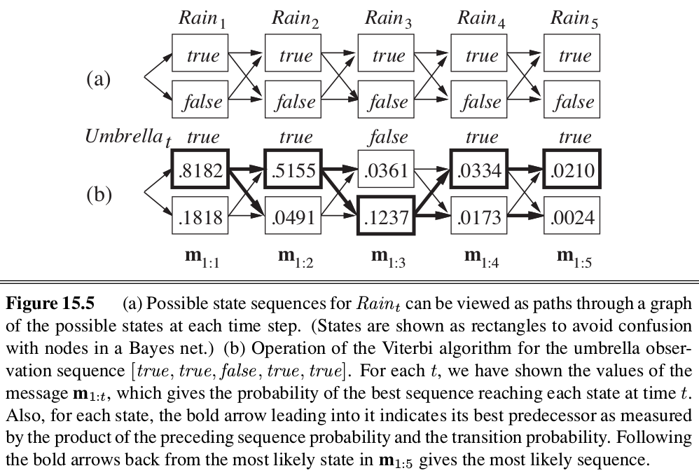

class: middle, center, title-slide

# Introduction to Artificial Intelligence

Lecture 7: Reasoning over time

---

# Today

- *Markov models*
    - Markov processes
    - Inference tasks
        - Prediction
        - Filtering
        - Smoothing
        - Most likely explanation
    - Hidden Markov models
- *Filtering*
    - Kalman filter
    - Dynamic Bayesian networks
    - Particle filters

---

# Pacman sonar

.center[
<video controls preload="auto" height="400" width="640">
  <source src="./figures/lec7/pacman-no-beliefs.mp4" type="video/mp4">
</video>]

.footnote[Credits: UC Berkeley, [CS188](http://ai.berkeley.edu/lecture_slides.html)]

---

class: middle, center

# Markov models

---

# Reasoning over time or space

- Often, we want to **reason about a sequence** of observations.
    - Speech recognition
    - Robot localization
    - User attention
    - Medical monitoring.
- Therefore, we need to introduce **time** (or *space*) in our model.
- Consider the world as a *discrete* series of *time slices*, each of which contains a set of random variables.
    - $\mathbf{X}\_t$ denotes the set of **unobservable** state variables at time $t$.
    - $\mathbf{E}\_t$ denotes the set of *observable* evidence variables at time $t$.
- We specify a **transition model** $P(\mathbf{X}\_t | \mathbf{X}\_{0:t-1})$ that defines the probability distribution over the latest state variables, given the previous values.
- Similarly, we define a **sensor model** $P(\mathbf{E}\_t | \mathbf{X}\_{0:t}, \mathbf{E}\_{0:t-1})$.

---

# Markov processes

- **Markov assumption**: $\mathbf{X}\_t$ depends on only a bounded subset of $\mathbf{X}\_{0:t-1}$.
    - Processes that satisfy this assumption are called **Markov processes** or **Markov chains**.
- *First-order* Markov processes: $P(\mathbf{X}\_t | \mathbf{X}\_{0:t-1}) = P(\mathbf{X}\_t | \mathbf{X}\_{t-1})$.
    - i.e., $\mathbf{X}\_t$ and $\mathbf{X}\_{0:t-2}$ are conditionally independent given $\mathbf{X}\_{t-1}$.
- *Second-order* Markov processes: $P(\mathbf{X}\_t | \mathbf{X}\_{0:t-1}) = P(\mathbf{X}\_t | \mathbf{X}\_{t-2}, \mathbf{X}\_{t-1})$.

.center.width-50[]

- Additionally, we make a **sensor Markov assumption**: $P(\mathbf{E}\_t | \mathbf{X}\_{0:t}, \mathbf{E}\_{0:t-1}) = P(\mathbf{E}\_t | \mathbf{X}\_{t})$
- *Stationary* process: the transition and the sensor models are the same for all $t$ (i.e., the laws of physics do not change with time).

---

# Joint distribution

.center.width-70[]

- A Markov process can be described as a *growable* Bayesian network, unrolled through time, with a specified restricted structure between time steps.
    - i.e., we can use standard Bayesian network reasoning when truncating the sequence.
- Therefore, the *joint distribution* of all variables up to $t$ in a (first-order) Markov process is:
    $$P(\mathbf{X}\_{0:t}, \mathbf{E}\_{1:t}) = P(\mathbf{X}\_{0}) \prod\_{i=1}^t P(\mathbf{X}\_{i} | \mathbf{X}\_{i-1}) P(\mathbf{E}\_{i}|\mathbf{X}\_{i}) $$

---

# Example: Weather

.center.width-80[]
.grid[
.col-2-3[
- $P(Umbrella\_t | Rain\_t)$?
- $P(Rain\\\_t | Umbrella\\\_{0:t-1})$?
- $P(Rain\\\_{t+2} | Rain\\\_{t})$?
]
.col-1-3.center[

Transition model $P(Rain\\\_t | Rain\\\_{t-1})$]]
[Q] How else can you represent the transition model?

---

# Inference tasks

- *Filtering*: $P(\mathbf{X}\_{t}| \mathbf{e}\_{1:t})$
    - Filtering is what a rational agent does to keep track of the current state (its **belief state**), so that rational decisions can be made.
- *Prediction*: $P(\mathbf{X}\_{t+k}| \mathbf{e}\_{1:t})$ for $k>0$
    - Computing the posterior distribution over future states.
    - Used for evaluation of possible action sequences.
- *Smoothing*: $P(\mathbf{X}\_{k}| \mathbf{e}\_{1:t})$ for $0 \leq k < t$
    - Computing the posterior distribution over past states.
    - Used for building better estimates, since it incorporates more evidence.
    - Essential for learning.    
- *Most likely explanation*: $\arg \max\_{\mathbf{x}\_{1:t}} P(\mathbf{x}\_{1:t}| \mathbf{e}\_{1:t})$
    - Decoding with a noisy channel, speech recognition, etc.

---

# Prediction

.center.width-100[]

 

- To predict the future, the current *belief state* $P(\mathbf{X}\_{t} | \mathbf{e}\_{1:t})$ get *pushed* through the transition model.
$$P(\mathbf{X}\_{t+1}| \mathbf{e}\_{1:t}) = \sum\_{\mathbf{x}\_{t}} P(\mathbf{X}\_{t+1} | \mathbf{x}\_{t}) P(\mathbf{x}\_{t} | \mathbf{e}\_{1:t})$$
- As time passes, uncertainty "accumulates" if we do not accumulate new evidence.

---

# Ghostbusters: Basic dynamics

.center[
<video controls preload="auto" height="400" width="640">
  <source src="./figures/lec7/gb-basics.mp4" type="video/mp4">
</video>]

.footnote[Credits: UC Berkeley, [CS188](http://ai.berkeley.edu/lecture_slides.html)]

---

# Ghostbusters: Circular dynamics

.center[
<video controls preload="auto" height="400" width="640">
  <source src="./figures/lec7/gb-circular.mp4" type="video/mp4">
</video>]

.footnote[Credits: UC Berkeley, [CS188](http://ai.berkeley.edu/lecture_slides.html)]

---

# Ghostbusters: Whirlpool

.center[
<video controls preload="auto" height="400" width="640">
  <source src="./figures/lec7/gb-whirlpool.mp4" type="video/mp4">
</video>]

.footnote[Credits: UC Berkeley, [CS188](http://ai.berkeley.edu/lecture_slides.html)]

---

# Stationary distributions

What if $t \to \infty$?
- For most chains, the influence of the initial distribution gets less and less over time.
- Eventually, the distribution converges to a fixed point, called the **stationary distribution**.
- It satisfies:
$$P(\mathbf{X}\_\infty) = P(\mathbf{X}\_{\infty+1}) = \sum\_{\mathbf{x}\_\infty} P(\mathbf{X}\_{\infty+1} | \mathbf{x}\_\infty) P(\mathbf{x}\_\infty) $$

---

# Example

.width-50.center[]

.grid[
.col-3-4[
$P(\mathbf{X}\_\infty = sun) = P(\mathbf{X}\_{\infty+1} = sun)$ 
$\quad = P(\mathbf{X}\_{\infty+1}=sun | \mathbf{X}\_{\infty}=sun) P(\mathbf{X}\_{\infty}=sun)$  $\quad\quad + P(\mathbf{X}\_{\infty+1}=sun | \mathbf{X}\_{\infty}=rain) P(\mathbf{X}\_{\infty}=rain)$ 
$\quad = 0.9 P(\mathbf{X}\_{\infty}=sun) + 0.3 P(\mathbf{X}\_{\infty}=rain)$

Therefore, $P(\mathbf{X}\_\infty = sun) = 3 P(\mathbf{X}\_\infty = rain)$

Which implies that: 
$P(\mathbf{X}\_\infty = sun) = \frac{3}{4}$ 
$P(\mathbf{X}\_\infty = rain) = \frac{1}{4}$

]
.col-1-4[

.center[
| $\mathbf{X}\_{t-1}$ | $\mathbf{X}\_{t}$ | $P$ |
| --- | --- | --- |
| $sun$ | $sun$ | 0.9 |
| $sun$ | $rain$ | 0.1 |
| $rain$ | $sun$ | 0.3 |
| $rain$ | $rain$ | 0.7 |
]

   

]
]

.footnote[Credits: UC Berkeley, [CS188](http://ai.berkeley.edu/lecture_slides.html)]

---

# Observation

.center.width-60[]

 

- What if we collect new observations?
- Beliefs get *reweighted*, and uncertainty "decreases".

$$P(\mathbf{X}\_{t+1}| \mathbf{e}\_{1:t+1}) = \alpha P(\mathbf{e}\_{t+1} | \mathbf{X}\_{t+1}) P(\mathbf{X}\_{t+1} | \mathbf{e}\_{1:t})$$

---

# Filtering (1)

- An agent should maintain a current *belief state* estimate $P(\mathbf{X}\_{t}| \mathbf{e}\_{1:t})$ and update it as new evidences $\mathbf{e}\_{t+1}$ are collected.
    - Rather than going back over the entire history of percepts for each update.
- **Recursive estimation**: $P(\mathbf{X}\_{t+1}| \mathbf{e}\_{1:t+1}) = f(\mathbf{e}\_{t+1}, P(\mathbf{X}\_{t}| \mathbf{e}\_{1:t}))$
    - Project the current state belief forward from $t$ to $t+1$
    - Update this new state using the evidence $\mathbf{e}\_{t+1}$.

$P(\mathbf{X}\_{t+1}| \mathbf{e}\_{1:t+1}) = P(\mathbf{X}\_{t+1}| \mathbf{e}\_{1:t}, \mathbf{e}\_{t+1})$ 
$\quad = \alpha P(\mathbf{e}\_{t+1}| \mathbf{X}\_{t+1}, \mathbf{e}\_{1:t}) P(\mathbf{X}\_{t+1}| \mathbf{e}\_{1:t}) \quad $ 
$\quad = \alpha P(\mathbf{e}\_{t+1}| \mathbf{X}\_{t+1}) P(\mathbf{X}\_{t+1}| \mathbf{e}\_{1:t})$ 
$\quad = \alpha P(\mathbf{e}\_{t+1}| \mathbf{X}\_{t+1}) \sum\_{\mathbf{x}\_t} P(\mathbf{X}\_{t+1}|\mathbf{x}\_t, \mathbf{e}\_{1:t}) P(\mathbf{x}\_t | \mathbf{e}\_{1:t}) $ 
$\quad = \alpha P(\mathbf{e}\_{t+1}| \mathbf{X}\_{t+1}) \sum\_{\mathbf{x}\_t} P(\mathbf{X}\_{t+1}|\mathbf{x}\_t) P(\mathbf{x}\_t | \mathbf{e}\_{1:t}) $

The first and second terms are given by the model. The third is obtained recursively.

---

# Filtering (2)

- We can think of $P(\mathbf{X}\_t | \mathbf{e}\_{1:t})$ as a *message* $\mathbf{f}\_{1:t}$ that is propagated **forward** along the sequence, modified by each transition and updated by each new observation.
- Thus, the process can be implemented as $\mathbf{f}\_{1:t+1} = \alpha\, \text{forward}(\mathbf{f}\_{1:t}, \mathbf{e}\_{t+1} )$.
- The complexity of a forward update is constant (in time and space) with $t$.

        

[Q] What is the explicit form of the normalization constant $\alpha$?

---

# Example

.center.width-80[]

---

# Smoothing

Divide evidence $\mathbf{e}\_{1:t}$ into $\mathbf{e}\_{1:k}$ and $\mathbf{e}\_{k+1:t}$. Then:

$P(\mathbf{X}\_k | \mathbf{e}\_{1:t}) = P(\mathbf{X}\_k | \mathbf{e}\_{1:k}, \mathbf{e}\_{k+1:t})$ 
$\quad = \alpha P(\mathbf{X}\_k | \mathbf{e}\_{1:k}) P(\mathbf{e}\_{k+1:t} | \mathbf{X}\_k, \mathbf{e}\_{1:k})$ 
$\quad = \alpha P(\mathbf{X}\_k | \mathbf{e}\_{1:k}) P(\mathbf{e}\_{k+1:t} | \mathbf{X}\_k)$ 
$\quad = \alpha\, \mathbf{f}\_{1:k} \mathbf{b}\_{k+1:t}$

The **backward** message $\mathbf{b}\_{k+1:t}$ can be computed using backwards recursion:

$P(\mathbf{e}\_{k+1:t} | \mathbf{X}\_k) = \sum\_{\mathbf{x}\_{k+1}} P(\mathbf{e}\_{k+1:t} | \mathbf{X}\_k, \mathbf{x}\_{k+1}) P(\mathbf{x}\_{k+1} | \mathbf{X}\_k) $ 
$\quad = \sum\_{\mathbf{x}\_{k+1}} P(\mathbf{e}\_{k+1:t} | \mathbf{x}\_{k+1}) P(\mathbf{x}\_{k+1} | \mathbf{X}\_k) $ 
$\quad = \sum\_{\mathbf{x}\_{k+1}} P(\mathbf{e}\_{k+1} | \mathbf{x}\_{k+1}) P(\mathbf{e}\_{k+2:t} | \mathbf{x}\_{k+1}) P(\mathbf{x}\_{k+1} | \mathbf{X}\_k)$

The first and last factors are given by the model. The second factor is obtained recursively. Therefore,

$\mathbf{b}\_{k+1:t} = \text{backward}(\mathbf{b}\_{k+2:t}, \mathbf{e}\_{k+1} )$.

---

# Forward-backward algorithm

.center.width-100[]

Complexity:
- Smoothing for a particular time step $k$ takes: $O(t)$
- Smoothing a whole sequence, naively: $O(t^2)$
- Smoothing a whole sequence, by caching messages:  $O(t)$

---

# Example

.center.width-80[]

---

# Most likely explanation

- The most likely sequence  **is not** the sequence of most likely states!
- The most likely path to each $\mathbf{x}\_{t+1}$, is the most likely path to *some* $\mathbf{x}\_t$ plus one more step. Therefore,
  
$\max\_{\mathbf{x}\_{1:t}} P(\mathbf{x}\_{1:t}, \mathbf{X}\_{t+1} | \mathbf{e}\_{1:t+1})$ 
$\quad = \alpha P(\mathbf{e}\_{t+1}|\mathbf{X}\_{t+1}) \max\_{\mathbf{x}\_t}( P(\mathbf{X}\_{t+1} | \mathbf{x}\_t) \max\_{\mathbf{x}\_{1:t-1}} P(\mathbf{x}\_{1:t-1}, \mathbf{x}\_{t} | \mathbf{e}\_{1:t}) )$
- Identical to filtering, except that the forward message $\mathbf{f}\_{1:t} = P(\mathbf{X}\_t | \mathbf{e}\_{1:t})$ is replaced by:
  
$\mathbf{m}\_{1:t} = \max\_{\mathbf{x}\_{1:t-1}} P(\mathbf{x}\_{1:t-1}, \mathbf{X}\_{t} | \mathbf{e}\_{1:t})$  
i.e., $\mathbf{m}\_{1:t}(i)$ gives the probability of the most likely path to state $i$.
- The update has its sum replaced by max, giving the **Viterbi algorithm**:
  
$\mathbf{m}\_{1:t+1} = \alpha P(\mathbf{e}\_{t+1} | \mathbf{X}\_{t+1}) \max\_{\mathbf{x}\_{1:t}} P(\mathbf{X}\_{t+1} | \mathbf{x}\_{t}) \mathbf{m}\_{1:t}$

---

# Example

.center.width-90[]

[Q] How do you retrieve the path, in addition to its likelihood?

---

# Hidden Markov models

- So far, we described Markov processes over arbitrary sets of state variables $\mathbf{X}\_t$ and evidence variables $\mathbf{E}\_t$.
- A **hidden Markov model** (HMM) is a Markov process in which the state $\mathbf{X}\_t$ and the evidence $\mathbf{E}\_t$ are both *single discrete* random variables.
    - i.e., $\mathbf{X}\_t = X\_t$, with domain $\\\{1, ..., S\\\}$.
- This restricted structure allows for a simple *matrix implementation* of the inference algorithms.

---

# Simplified matrix algorithms

- The transition model $P(X\_t | X\_{t-1})$ becomes an $S \times S$ *transition matrix* $\mathbf{T}$, where $\mathbf{T}\_{ij} = P(X\_t=j | X\_{t-1}=i)$.
- The sensor model $P(E\_t | X\_t)$ is defined, for convenience, as an  $S \times S$ *sensor matrix*
$\mathbf{O}\_t$ whose $i$-th diagonal element is $P(e\_t | X\_t = i)$ and whose other entries are 0.
- If we use column vectors to represent forward and backward messages, then we have:
$$\mathbf{f}\_{1:t+1} = \alpha \mathbf{O}\_{t+1} \mathbf{T}^T \mathbf{f}\_{1:t}$$
$$\mathbf{b}\_{k+1:t} = \mathbf{T} \mathbf{O}\_{k+1} \mathbf{b}\_{k+2:t}$$
- Therefore the forward-backward algorithm needs time $O(S^2t)$ and space $O(St)$.

---

# Applications

HMMs can be applied in many fields where the goal is to recover a data sequence that is not immediately observable, but other data data that depend on the sequence are.

- Computational finance
- **Speech recognition**
- Speech synthesis
- Part-of-speech tagging
- Machine translation
- Handwriting recognition
- Time series analysis
- Activity recognition
- ...

---

# Pacman sonar, revisited

.center[
<video controls preload="auto" height="400" width="640">
  <source src="./figures/lec7/pacman-with-beliefs.mp4" type="video/mp4">
</video>]

.footnote[Credits: UC Berkeley, [CS188](http://ai.berkeley.edu/lecture_slides.html)]

---

class: middle, center

# Filters

---

# Filtering

continuous states

---

# Kalman filters

---

# Dynamic Bayesian networks

relation to HMMs
relation to KF

---

# Exact inference in DBNs

---

# Particle filters

---

# Summary

---

# References
