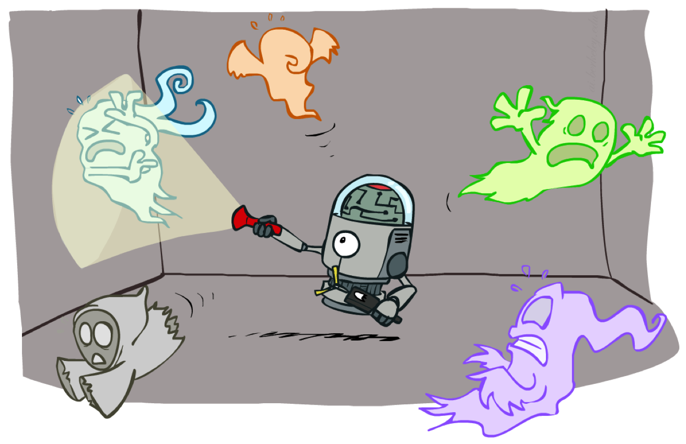
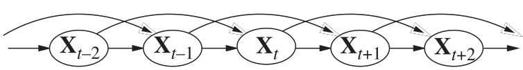
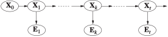
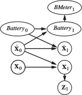
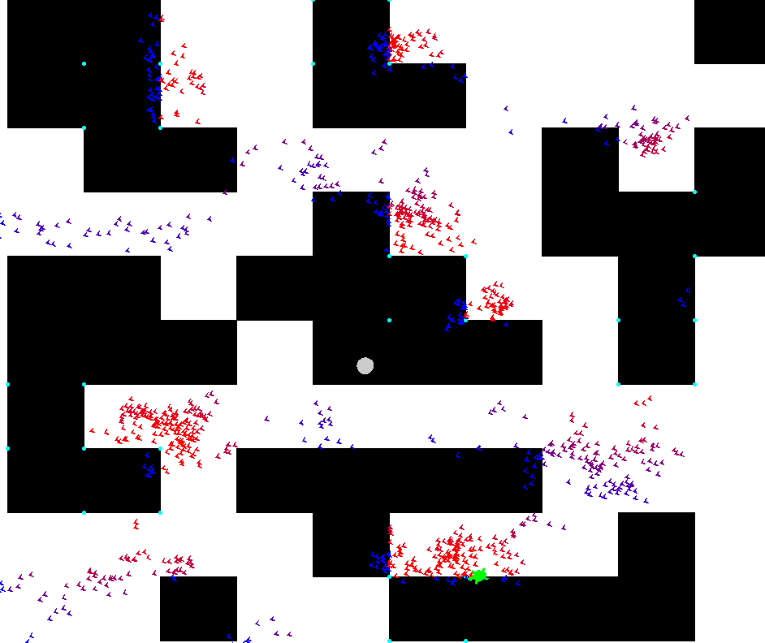

class: middle, center, title-slide

# Introduction to Artificial Intelligence

Lecture 7: Reasoning over time

  
Prof. Gilles Louppe 
[g.louppe@uliege.be](g.louppe@uliege.be)

---

# Today

.grid[
.kol-1-2[
- Markov models
    - Markov processes
    - Inference tasks
        - Prediction
        - Filtering
        - Smoothing
        - Most likely explanation
    - Hidden Markov models
    - Dynamic Bayesian networks
- Filters
    - Kalman filter
    - Particle filter
]
.kol-1-2[   .width-100[]
]
]

.footnote[Image credits: [CS188](http://ai.berkeley.edu/lecture_slides.html), UC Berkeley.]

---

class: middle, black-slide

.center[
<video controls preload="auto" height="400" width="640">
  <source src="./figures/lec7/pacman-no-beliefs.mp4" type="video/mp4">
</video>

Pacman revenge: How to make good use of the sonar readings?
]

.footnote[Image credits: [CS188](http://ai.berkeley.edu/lecture_slides.html), UC Berkeley.]

---

class: middle

# Markov models

---

# Reasoning over time

Often, we want to **reason about a sequence** of observations.
- Speech recognition
- Robot localization
- User attention
- Medical monitoring.

For this reason, we need to introduce **time** (or space) in our model.

---

class: middle

## Modelling time

Consider the world as a *discrete* series of *time slices*, each of which contains a set of random variables:
- $\mathbf{X}\_t$ denotes the set of **unobservable** state variables at time $t$.
- $\mathbf{E}\_t$ denotes the set of *observable* evidence variables at time $t$.

We specify:
- a **transition model** $P(\mathbf{X}\_t | \mathbf{X}\_{0:t-1})$ that defines the probability distribution over the latest state variables, given the previous (unobserved) values.
- a **sensor model** $P(\mathbf{E}\_t | \mathbf{X}\_{0:t}, \mathbf{E}\_{0:t-1})$ that defines the probability distribution over the latest evidence variables, given all previous (observed and unobserved) values.

---

# Markov processes

## Markov assumption
- The current state of the world depends only on its immediate previous state(s).
- i.e., $\mathbf{X}\_t$ depends on only a bounded subset of $\mathbf{X}\_{0:t-1}$.

Random processes that satisfy this assumption are called **Markov processes**.

---

class: middle

## First-order Markov processes

- Markov processes such that $$P(\mathbf{X}\_t | \mathbf{X}\_{0:t-1}) = P(\mathbf{X}\_t | \mathbf{X}\_{t-1}).$$
- i.e., $\mathbf{X}\_t$ and $\mathbf{X}\_{0:t-2}$ are conditionally independent given $\mathbf{X}\_{t-1}$.

 
.center.width-100[]

---

class: middle

## Second-order Markov processes

- Markov processes such that $$P(\mathbf{X}\_t | \mathbf{X}\_{0:t-1}) = P(\mathbf{X}\_t | \mathbf{X}\_{t-2}, \mathbf{X}\_{t-1}).$$
- i.e., $\mathbf{X}\_t$ and $\mathbf{X}\_{0:t-3}$ are conditionally independent given $\mathbf{X}\_{t-1}$ and $\mathbf{X}\_{t-2}$.

 
.center.width-100[]

---

class: middle

## Sensor Markov assumption

- Additionally, we make a (first-order) **sensor Markov assumption**: $$P(\mathbf{E}\_t | \mathbf{X}\_{0:t}, \mathbf{E}\_{0:t-1}) = P(\mathbf{E}\_t | \mathbf{X}\_{t})$$

## Stationarity assumption

-  The transition and the sensor models are the same for all $t$ (i.e., the laws of physics do not change with time).

---

# Joint distribution

 
.center.width-100[]
 

A Markov process can be described as a *growable* Bayesian network, unrolled infinitely through time, with a specified **restricted structure** between time steps.

Therefore, the *joint distribution* of all variables up to $t$ in a (first-order) Markov process is
    $$P(\mathbf{X}\_{0:t}, \mathbf{E}\_{1:t}) = P(\mathbf{X}\_{0}) \prod\_{i=1}^t P(\mathbf{X}\_{i} | \mathbf{X}\_{i-1}) P(\mathbf{E}\_{i}|\mathbf{X}\_{i}).$$

???

[Q] Why is this true? Don't the variables $\mathbf{X}\_{t+1:\infty}$ and $\mathbf{E}\_{t+1:\infty}$ also characterize the joint distribution of the former?

---

class: middle

## Example: Will you take your umbrella today?

.center.width-80[]

.grid[
.kol-1-2[
.center.width-100[]
]
.kol-1-2[
- $P(\text{Umbrella}\_t | \text{Rain}\_t)$?
- $P(\text{Rain}\_t | \text{Umbrella}\_{0:t-1})$?
- $P(\text{Rain}\_{t+2} | \text{Rain}\_{t})$?
]]

.footnote[Image credits: [CS188](http://ai.berkeley.edu/lecture_slides.html), UC Berkeley.]

---

class: middle

.center.width-60[]

The transition model $P(\text{Rain}\_t | \text{Rain}\_{t-1})$ can equivalently be represented by a state transition diagram.

---

# Inference tasks

- *Prediction*: $P(\mathbf{X}\_{t+k}| \mathbf{e}\_{1:t})$ for $k>0$
    - Computing the posterior distribution over future states.
    - Used for evaluation of possible action sequences.
- *Filtering*: $P(\mathbf{X}\_{t}| \mathbf{e}\_{1:t})$
    - Filtering is what a rational agent does to keep track of the current hidden state $\mathbf{X}\_t$, its **belief state**, so that rational decisions can be made.
- *Smoothing*: $P(\mathbf{X}\_{k}| \mathbf{e}\_{1:t})$ for $0 \leq k < t$
    - Computing the posterior distribution over past states.
    - Used for building better estimates, since it incorporates more evidence.
    - Essential for learning.    
- *Most likely explanation*: $\arg \max\_{\mathbf{x}\_{1:t}} P(\mathbf{x}\_{1:t}| \mathbf{e}\_{1:t})$
    - Decoding with a noisy channel, speech recognition, etc.

---

# Base cases

.grid[
.kol-1-2.center[
.width-80[]

$\begin{aligned}
P(\mathbf{X}\_1 | \mathbf{e}\_1) &= \frac{P(\mathbf{X}\_1, \mathbf{e}\_1)}{P(\mathbf{e}\_1)} \\\\
&\propto P(\mathbf{X}\_1, \mathbf{e}\_1) \\\\
&= P(\mathbf{X}\_1) P(\mathbf{e}\_1 | \mathbf{X}\_1)
\end{aligned}$

Update $P(\mathbf{X}\_1)$ with the evidence $\mathbf{e}\_1$, given the sensor model.
]
.kol-1-2.center[
.width-80[]

$\begin{aligned}
P(\mathbf{X}\_2) &= \sum\_{\mathbf{x}\_1} P(\mathbf{X}\_2, \mathbf{x}\_1) \\\\
&= \sum\_{\mathbf{x}\_1} P(\mathbf{x}\_1) P(\mathbf{X}\_2 | \mathbf{x}\_1)
\end{aligned}$

Push $P(\mathbf{X}\_1)$ forward through the transition model.
]
]

.footnote[Image credits: [CS188](http://ai.berkeley.edu/lecture_slides.html), UC Berkeley.]

---

# Prediction

.center.width-50[]

To predict the future  $P(\mathbf{X}\_{t+k}| \mathbf{e}\_{1:t})$:
- **Push** the prior belief state $P(\mathbf{X}\_{t} | \mathbf{e}\_{1:t})$ through the transition model:
$$P(\mathbf{X}\_{t+1}| \mathbf{e}\_{1:t}) = \sum\_{\mathbf{x}\_{t}} P(\mathbf{X}\_{t+1} | \mathbf{x}\_{t}) P(\mathbf{x}\_{t} | \mathbf{e}\_{1:t})$$

- Repeat up to $t+k$, using $P(\mathbf{X}\_{t+k-1}| \mathbf{e}\_{1:t})$ to compute $P(\mathbf{X}\_{t+k}| \mathbf{e}\_{1:t})$.

.footnote[Image credits: [CS188](http://ai.berkeley.edu/lecture_slides.html), UC Berkeley.]

---

class: middle, black-slide

.center[
<video controls preload="auto" height="400" width="640">
  <source src="./figures/lec7/gb-basics.mp4" type="video/mp4">
</video>]

.center[Basic dynamics (Ghostbusters)]

.footnote[Image credits: [CS188](http://ai.berkeley.edu/lecture_slides.html), UC Berkeley.]

---

class: middle, black-slide

.center[
<video controls preload="auto" height="400" width="640">
  <source src="./figures/lec7/gb-circular.mp4" type="video/mp4">
</video>]

.center[Circular dynamics (Ghostbusters)]

.footnote[Image credits: [CS188](http://ai.berkeley.edu/lecture_slides.html), UC Berkeley.]

---

class: middle, black-slide

.center[
<video controls preload="auto" height="400" width="640">
  <source src="./figures/lec7/gb-whirlpool.mp4" type="video/mp4">
</video>]

.center[Whirlpool dynamics (Ghostbusters)]

.footnote[Image credits: [CS188](http://ai.berkeley.edu/lecture_slides.html), UC Berkeley.]

---

class: middle

.center[
.width-100[]

.width-100[]

As time passes, uncertainty "accumulates" if we do not accumulate new evidence.
]

.footnote[Image credits: [CS188](http://ai.berkeley.edu/lecture_slides.html), UC Berkeley.]

---

# Stationary distributions

What if $t \to \infty$?
- For most chains, the influence of the initial distribution gets lesser and lesser over time.
- Eventually, the distribution converges to a fixed point, called the **stationary distribution**.
- This distribution is such that
$$P(\mathbf{X}\_\infty) = P(\mathbf{X}\_{\infty+1}) = \sum\_{\mathbf{x}\_\infty} P(\mathbf{X}\_{\infty+1} | \mathbf{x}\_\infty) P(\mathbf{x}\_\infty) $$

---

class: middle

## Example

$
\begin{aligned}
P(\mathbf{X}\_\infty = \text{sun}) =&\, P(\mathbf{X}\_{\infty+1} = \text{sun}) \\\\
=&\, P(\mathbf{X}\_{\infty+1}=\text{sun} | \mathbf{X}\_{\infty}=\text{sun}) P(\mathbf{X}\_{\infty}=\text{sun})\\\\
 & + P(\mathbf{X}\_{\infty+1}=\text{sun} | \mathbf{X}\_{\infty}=\text{rain}) P(\mathbf{X}\_{\infty}=\text{rain})\\\\
=&\, 0.9 P(\mathbf{X}\_{\infty}=\text{sun}) + 0.3 P(\mathbf{X}\_{\infty}=\text{rain})
\end{aligned}
$

Therefore, $P(\mathbf{X}\_\infty=\text{sun}) = 3 P(\mathbf{X}\_\infty=\text{rain})$.

Which implies that
$P(\mathbf{X}\_\infty=\text{sun}) = \frac{3}{4}$ and
$P(\mathbf{X}\_\infty=\text{rain}) = \frac{1}{4}$.

.footnote[Image credits: [CS188](http://ai.berkeley.edu/lecture_slides.html), UC Berkeley.]

???

| $\mathbf{X}\_{t-1}$ | $\mathbf{X}\_{t}$ | $P$ |
| --- | --- | --- |
| $sun$ | $sun$ | 0.9 |
| $sun$ | $rain$ | 0.1 |
| $rain$ | $sun$ | 0.3 |
| $rain$ | $rain$ | 0.7 |

---

# Filtering

 
.center.width-90[]
 

What if we collect new observations?
Beliefs get reweighted, and uncertainty "decreases":

$$P(\mathbf{X}\_{t+1}| \mathbf{e}\_{1:t+1}) \propto P(\mathbf{e}\_{t+1} | \mathbf{X}\_{t+1}) P(\mathbf{X}\_{t+1} | \mathbf{e}\_{1:t})$$

---

class: middle

## Bayes filter

An agent maintains a *belief state* estimate $P(\mathbf{X}\_{t}| \mathbf{e}\_{1:t})$ and updates it as new evidences $\mathbf{e}\_{t+1}$ are collected.

Recursive Bayesian estimation:
- (Predict step): Project the current state belief forward from $t$ to $t+1$ through the transition model.
- (Update step): Update this new state using the evidence $\mathbf{e}\_{t+1}$.

???

$P(\mathbf{X}\_{t+1}| \mathbf{e}\_{1:t+1}) = f(\mathbf{e}\_{t+1}, P(\mathbf{X}\_{t}| \mathbf{e}\_{1:t}))$

---

class: middle

$$
\begin{aligned}
P(\mathbf{X}\_{t+1}| \mathbf{e}\_{1:t+1}) &= P(\mathbf{X}\_{t+1}| \mathbf{e}\_{1:t}, \mathbf{e}\_{t+1}) \\\\
&= \alpha P(\mathbf{e}\_{t+1}| \mathbf{X}\_{t+1}, \mathbf{e}\_{1:t}) P(\mathbf{X}\_{t+1}| \mathbf{e}\_{1:t}) \\\\
&= \alpha P(\mathbf{e}\_{t+1}| \mathbf{X}\_{t+1}) P(\mathbf{X}\_{t+1}| \mathbf{e}\_{1:t}) \\\\
&= \alpha P(\mathbf{e}\_{t+1}| \mathbf{X}\_{t+1}) \sum\_{\mathbf{x}\_t} P(\mathbf{X}\_{t+1}|\mathbf{x}\_t, \mathbf{e}\_{1:t}) P(\mathbf{x}\_t | \mathbf{e}\_{1:t}) \\\\
&= \alpha P(\mathbf{e}\_{t+1}| \mathbf{X}\_{t+1}) \sum\_{\mathbf{x}\_t} P(\mathbf{X}\_{t+1}|\mathbf{x}\_t) P(\mathbf{x}\_t | \mathbf{e}\_{1:t})
\end{aligned}
$$

where
- the normalization constant $$\alpha = \frac{1}{P(\mathbf{e}\_{t+1} | \mathbf{e}\_{1:t})} = 1 / \sum\_{\mathbf{x}\_{t+1}} P(\mathbf{e}\_{t+1} | \mathbf{x}\_{t+1}) P(\mathbf{x}\_{t+1} | \mathbf{e}\_{1:t}) $$  is used to make probabilities sum to 1;
- in the last expression, the first and second terms are given by the model while the third is obtained recursively.

<!-- $P(\mathbf{X}\_{t+1}| \mathbf{e}\_{1:t+1}) = P(\mathbf{X}\_{t+1}| \mathbf{e}\_{1:t}, \mathbf{e}\_{t+1})$ 
$\quad = \alpha P(\mathbf{e}\_{t+1}| \mathbf{X}\_{t+1}, \mathbf{e}\_{1:t}) P(\mathbf{X}\_{t+1}| \mathbf{e}\_{1:t}) \quad $ 
$\quad = \alpha P(\mathbf{e}\_{t+1}| \mathbf{X}\_{t+1}) P(\mathbf{X}\_{t+1}| \mathbf{e}\_{1:t})$ 
$\quad = \alpha P(\mathbf{e}\_{t+1}| \mathbf{X}\_{t+1}) \sum\_{\mathbf{x}\_t} P(\mathbf{X}\_{t+1}|\mathbf{x}\_t, \mathbf{e}\_{1:t}) P(\mathbf{x}\_t | \mathbf{e}\_{1:t}) $ 
$\quad = \alpha P(\mathbf{e}\_{t+1}| \mathbf{X}\_{t+1}) \sum\_{\mathbf{x}\_t} P(\mathbf{X}\_{t+1}|\mathbf{x}\_t) P(\mathbf{x}\_t | \mathbf{e}\_{1:t}) $ -->

---

class: middle

We can think of $P(\mathbf{X}\_t | \mathbf{e}\_{1:t})$ as a *message* $\mathbf{f}\_{1:t}$ that is propagated **forward** along the sequence, modified by each transition and updated by each new observation.
- Thus, the process can be implemented as $\mathbf{f}\_{1:t+1} = \alpha\, \text{forward}(\mathbf{f}\_{1:t}, \mathbf{e}\_{t+1} )$.
- The complexity of a forward update is constant (in time and space) with $t$.

---

class: middle

## Example

.center.width-80[]

 

.grid[
.kol-1-4[]
.kol-1-4.center[

| $R\_{t-1}$ | $P(R\_t)$ |
| ---------- | --------- |
| $true$ | $0.7$ |
| $false$ | $0.3$ |

]
.kol-1-4.center[

| $R\_{t}$ | $P(U\_t)$ |
| ---------- | --------- |
| $true$ | $0.9$ |
| $false$ | $0.2$ |

]
]

???

Solve on blackboard.

---

class: middle, black-slide

.center[
<video controls preload="auto" height="400" width="640">
  <source src="./figures/lec7/pacman-with-beliefs.mp4" type="video/mp4">
</video>

Ghostbusters with a Bayes filter
]

.footnote[Image credits: [CS188](http://ai.berkeley.edu/lecture_slides.html), UC Berkeley.]

---

# Smoothing

We want to compute $P(\mathbf{X}\_{k}| \mathbf{e}\_{1:t})$ for $0 \leq k < t$.

Divide evidence $\mathbf{e}\_{1:t}$ into $\mathbf{e}\_{1:k}$ and $\mathbf{e}\_{k+1:t}$. Then,

$$
\begin{aligned}
P(\mathbf{X}\_k | \mathbf{e}\_{1:t}) &= P(\mathbf{X}\_k | \mathbf{e}\_{1:k}, \mathbf{e}\_{k+1:t}) \\\\
&= \alpha P(\mathbf{X}\_k | \mathbf{e}\_{1:k}) P(\mathbf{e}\_{k+1:t} | \mathbf{X}\_k, \mathbf{e}\_{1:k}) \\\\
&= \alpha P(\mathbf{X}\_k | \mathbf{e}\_{1:k}) P(\mathbf{e}\_{k+1:t} | \mathbf{X}\_k).
\end{aligned}
$$

---

class: middle

Let the **backward** message $\mathbf{b}\_{k+1:t}$ correspond to $P(\mathbf{e}\_{k+1:t} | \mathbf{X}\_k)$. Then,
$$P(\mathbf{X}\_k | \mathbf{e}\_{1:t}) = \alpha\, \mathbf{f}\_{1:k} \mathbf{b}\_{k+1:t}$$

This backward message can be computed using backwards recursion:

$$
\begin{aligned}
P(\mathbf{e}\_{k+1:t} | \mathbf{X}\_k) &= \sum\_{\mathbf{x}\_{k+1}} P(\mathbf{e}\_{k+1:t} | \mathbf{X}\_k, \mathbf{x}\_{k+1}) P(\mathbf{x}\_{k+1} | \mathbf{X}\_k) \\\\
&= \sum\_{\mathbf{x}\_{k+1}} P(\mathbf{e}\_{k+1:t} | \mathbf{x}\_{k+1}) P(\mathbf{x}\_{k+1} | \mathbf{X}\_k) \\\\
&= \sum\_{\mathbf{x}\_{k+1}} P(\mathbf{e}\_{k+1} | \mathbf{x}\_{k+1}) P(\mathbf{e}\_{k+2:t} | \mathbf{x}\_{k+1}) P(\mathbf{x}\_{k+1} | \mathbf{X}\_k)
\end{aligned}
$$

The first and last factors are given by the model. The second factor is obtained recursively. Therefore,
$$\mathbf{b}\_{k+1:t} = \text{backward}(\mathbf{b}\_{k+2:t}, \mathbf{e}\_{k+1} ).$$

---

# Forward-backward algorithm

.center.width-100[]

Complexity:
- Smoothing for a particular time step $k$ takes: $O(t)$
- Smoothing a whole sequence (because of caching):  $O(t)$

---

class: middle

## Example

.center.width-80[]

???

Solve on blackboard.

---

.pull-right.width-80[]

# Most likely explanation

Suppose that $[true, true, false, true, true]$ is the umbrella sequence.

What is the weather sequence that is the most likely to explain this?
- Does the absence of umbrella at day 3 means it wasn't raining?
- Or did the director forget to bring it?
- If it didn't rain on day 3, perhaps it didn't rain on day 4 either, but the director brought the umbrella just in case?

Among all $2^5$ sequences, is there an (efficient) way to find the most likely one?

.footnote[Image credits: [CS188](http://ai.berkeley.edu/lecture_slides.html), UC Berkeley.]

---

class: middle

- The most likely sequence  **is not** the sequence of the most likely states!
- The most likely path to each $\mathbf{x}\_{t+1}$, is the most likely path to *some* $\mathbf{x}\_t$ plus one more step. Therefore,
$$
\begin{aligned}
&\max\_{\mathbf{x}\_{1:t}} P(\mathbf{x}\_{1:t}, \mathbf{X}\_{t+1} | \mathbf{e}\_{1:t+1}) \\\\
&= \alpha P(\mathbf{e}\_{t+1}|\mathbf{X}\_{t+1}) \max\_{\mathbf{x}\_t}( P(\mathbf{X}\_{t+1} | \mathbf{x}\_t) \max\_{\mathbf{x}\_{1:t-1}} P(\mathbf{x}\_{1:t-1}, \mathbf{x}\_{t} | \mathbf{e}\_{1:t}) )
\end{aligned}
$$
- Identical to filtering, except that the forward message $\mathbf{f}\_{1:t} = P(\mathbf{X}\_t | \mathbf{e}\_{1:t})$ is replaced with
$$\mathbf{m}\_{1:t} = \max\_{\mathbf{x}\_{1:t-1}} P(\mathbf{x}\_{1:t-1}, \mathbf{X}\_{t} | \mathbf{e}\_{1:t}),$$
where $\mathbf{m}\_{1:t}(i)$ gives the probability of the most likely path to state $i$.
- The update has its sum replaced by max, resulting in the **Viterbi algorithm**:
$$\mathbf{m}\_{1:t+1} = \alpha P(\mathbf{e}\_{t+1} | \mathbf{X}\_{t+1}) \max\_{\mathbf{x}\_{1:t}} P(\mathbf{X}\_{t+1} | \mathbf{x}\_{t}) \mathbf{m}\_{1:t}$$

---

class: middle

## Example

.center.width-90[]

???

[Q] How do you retrieve the path, in addition to its likelihood?

---

# Hidden Markov models

So far, we described Markov processes over arbitrary sets of state variables $\mathbf{X}\_t$ and evidence variables $\mathbf{E}\_t$.
- A **hidden Markov model** (HMM) is a Markov process in which the state $\mathbf{X}\_t$ and the evidence $\mathbf{E}\_t$ are both *single discrete* random variables.
    - e.g., $\mathbf{X}\_t = X\_t$, with domain $D\_{X\_t} = \\\{1, ..., S\\\}$.
- This restricted structure allows for a reformulation of the forward-backward algorithm in terms of matrix-vector operations.

---

class: middle

## Note on terminology

Some authors instead divide Markov models into two classes, depending on the observability of the system state:
- Observable system state: Markov chains
- Partially-observable system state: Hidden Markov models.

We follow here the terminology of the textbook.

---

class: middle

## Simplified matrix algorithms

- The transition model $P(X\_t | X\_{t-1})$ becomes an $S \times S$ **transition matrix** $\mathbf{T}$, such that $$\mathbf{T}\_{ij} = P(X\_t=j | X\_{t-1}=i).$$
- The sensor model $P(e\_t | X\_t)$ is defined as an  $S \times S$ **sensor matrix**
$\mathbf{O}\_t$ whose $i$-th diagonal element is $P(e\_t | X\_t = i)$ and whose other entries are $0$.
- If we use column vectors to represent forward and backward messages, then we have:
$$\mathbf{f}\_{1:t+1} = \alpha \mathbf{O}\_{t+1} \mathbf{T}^T \mathbf{f}\_{1:t}$$
$$\mathbf{b}\_{k+1:t} = \mathbf{T} \mathbf{O}\_{k+1} \mathbf{b}\_{k+2:t}$$
- Therefore the forward-backward algorithm needs time $O(S^2t)$ and space $O(St)$.

---

class: middle

## Example

Suppose that $[true, true, false, true, true]$ is the umbrella sequence.

$$
\begin{aligned}
\mathbf{T} &= \left(\begin{matrix}
0.7 & 0.3 \\\\
0.3 & 0.7
\end{matrix}\right)\\\\
\mathbf{O}\_1 = \mathbf{O}\_2 = \mathbf{O}\_4 = \mathbf{O}\_5 &= \left(\begin{matrix}
0.9 & 0.0 \\\\
0.0 & 0.2
\end{matrix}\right) \\\\
\mathbf{O}\_2 &= \left(\begin{matrix}
0.1 & 0.0 \\\\
0.0 & 0.8
\end{matrix}\right)
\end{aligned}
$$

See `code/lecture7-forward-backward.ipynb` for the execution.

---

class: middle

## Applications

HMMs are used in many fields where the goal is to recover a data sequence that is not immediately observable, but other data that depend on the sequence are.

- Speech recognition (see Lecture 10)
- Speech synthesis
- Part-of-speech tagging
- Machine translation
- Robotics
- Computational finance
- Handwriting recognition
- Time series analysis
- Activity recognition

---

class: middle

# Filters

---

class: middle

.center.width-50[]

Suppose we want track the position and velocity of a robot from noisy observations collected over time.

Formally, we want to estimate **continuous** state variables such as
- the position $\mathbf{X}\_t$ of the robot at time $t$,
- the velocity $\mathbf{\dot{X}}\_t$ of the robot at time $t$.

We assume *discrete* time steps.

.footnote[Image credits: [CS188](http://ai.berkeley.edu/lecture_slides.html), UC Berkeley.]

---

class: middle

The Bayes filter similarly applies to **continuous** state and evidence variables $\mathbf{X}\_{t}$ and $\mathbf{E}\_{t}$, in which case summations are replaced with integrals:
$$
\begin{aligned}
p(\mathbf{x}\_{t+1}| \mathbf{e}\_{1:t+1}) &= \alpha\, p(\mathbf{e}\_{t+1}| \mathbf{x}\_{t+1}) \int p(\mathbf{x}\_{t+1}|\mathbf{x}\_t) p(\mathbf{x}\_t | \mathbf{e}\_{1:t}) d{\mathbf{x}\_t}
\end{aligned}
$$
where the normalization constant is
$$\alpha = 1\, / \int p(\mathbf{e}\_{t+1} | \mathbf{x}\_{t+1}) p(\mathbf{x}\_{t+1} | \mathbf{e}\_{1:t}) d\mathbf{x}\_{t+1}.$$

---

# Kalman filter

 

.center.width-50[]

The **Kalman filter** is a special case of the Bayes filter, which assumes:
- Gaussian prior
- Linear Gaussian transition model
- Linear Gaussian sensor model

---

class: middle

## Linear Gaussian models

.grid[
.kol-1-2.center[
   

$p(\mathbf{x}\_{t+1} | \mathbf{x}\_t) = \mathcal{N}(\mathbf{x}\_{t+1} | \mathbf{A} \mathbf{x}\_t + \mathbf{b}, \mathbf{\Sigma}\_{\mathbf{x}})$

Transition model

]
.kol-1-2.center[

$p(\mathbf{e}\_{t} | \mathbf{x}\_t) = \mathcal{N}(\mathbf{e}\_t | \mathbf{C} \mathbf{x}\_t + \mathbf{d}, \mathbf{\Sigma}\_{\mathbf{e}})$

Sensor model
]
]

---

class: middle

## Cheat sheet for Gaussian models (Bishop, 2006)

Given a marginal Gaussian distribution for $\mathbf{x}$ and a linear Gaussian distribution for $\mathbf{y}$ given $\mathbf{x}$ in the form
$$
\begin{aligned}
p(\mathbf{x}) &= \mathcal{N}(\mathbf{x}|\mu, \mathbf{\Lambda}^{-1}) \\\\
p(\mathbf{y}|\mathbf{x}) &= \mathcal{N}(\mathbf{y}|\mathbf{A}\mathbf{x}+\mathbf{b}, \mathbf{L}^{-1})
\end{aligned}
$$
the marginal distribution of $\mathbf{y}$ and the conditional distribution of $\mathbf{x}$ given $\mathbf{y}$ are given by
$$
\begin{aligned}
p(\mathbf{y}) &= \mathcal{N}(\mathbf{y}|\mathbf{A}\mu + \mathbf{b}, \mathbf{L}^{-1} + \mathbf{A}\mathbf{\Lambda}^{-1}\mathbf{A}^T) \\\\
p(\mathbf{x}|\mathbf{y}) &= \mathcal{N}(\mathbf{x}|\mathbf{\Sigma}\left(\mathbf{A}^T\mathbf{L}(\mathbf{y}-\mathbf{b}) + \mathbf{\Lambda}\mu\right), \mathbf{\Sigma})
\end{aligned}$$
where
$$\mathbf{\Sigma} = (\mathbf{\Lambda} + \mathbf{A}^T \mathbf{L}\mathbf{A})^{-1}.$$

---

class: middle

## Filtering Gaussian distributions

- .italic[Prediction step:]  
If the distribution $p(\mathbf{x}\_t | \mathbf{e}\_{1:t})$ is Gaussian and the transition model $p(\mathbf{x}\_{t+1} | \mathbf{x}\_{t})$ is linear Gaussian, then the one-step predicted distribution given by
$$p(\mathbf{x}\_{t+1} | \mathbf{e}\_{1:t}) = \int p(\mathbf{x}\_{t+1} | \mathbf{x}\_{t}) p(\mathbf{x}\_{t} | \mathbf{e}\_{1:t}) d\mathbf{x}\_t $$
is also a Gaussian distribution.
- .italic[Update step:]  
If the prediction $p(\mathbf{x}\_{t+1} | \mathbf{e}\_{1:t})$ is Gaussian and the sensor model $p(\mathbf{e}\_{t+1} | \mathbf{x}\_{t+1})$ is linear Gaussian, then after conditioning on new evidence, the updated distribution
$$p(\mathbf{x}\_{t+1} | \mathbf{e}\_{1:t+1}) \propto p(\mathbf{e}\_{t+1} | \mathbf{x}\_{t+1}) p(\mathbf{x}\_{t+1} | \mathbf{e}\_{1:t})$$
is also a Gaussian distribution.

---

class: middle

Therefore, for the Kalman filter,  $p(\mathbf{x}\_t | \mathbf{e}\_{1:t})$ is a multivariate Gaussian distribution $\mathcal{N}(\mathbf{\mu}\_t, \mathbf{\Sigma}\_t)$ for all $t$.

- Filtering reduces to the computation of the parameters $\mu_t$ and  $\mathbf{\Sigma}\_t$.
- By contrast, for general (nonlinear, non-Gaussian) processes, the description of the posterior grows **unboundedly** as $t \to \infty$.

---

class: middle

## 1D example

Gaussian random walk:
- Gaussian prior: $$p(x\_0) = \mathcal{N}(\mu\_0, \sigma\_0^2) $$
- The transition model adds random perturbations of constant variance:
    $$p(x\_{t+1}|x\_t) =  \mathcal{N}(x\_t, \sigma\_x^2)$$
- The sensor model yields measurements with Gaussian noise of constant variance:
    $$p(e\_{t}|x\_t) =  \mathcal{N}(x\_t, \sigma\_e^2)$$

---

class: middle

The one-step predicted distribution is given by
$$
\begin{aligned}
p(x\_1) &= \int p(x\_1 | x\_0) p(x\_0) dx\_0 \\\\
&= \alpha \int \exp\left(-\frac{1}{2} \frac{(x\_{1} - x\_0)^2}{\sigma\_x^2}\right) \exp\left(-\frac{1}{2} \frac{(x\_0 - \mu\_0)^2}{\sigma\_0^2}\right) dx\_0 \\\\
&= \alpha \int \exp\left( -\frac{1}{2} \frac{\sigma\_0^2 (x\_1 - x\_0)^2 + \sigma\_x^2(x\_0 - \mu\_0)^2}{\sigma\_0^2 \sigma\_x^2} \right) dx\_0 \\\\
&... \,\, \text{(simplify by completing the square)} \\\\
&= \alpha \exp\left( -\frac{1}{2} \frac{(x\_1 - \mu\_0)^2}{\sigma\_0^2 + \sigma\_x^2} \right) \\\\
&= \mathcal{N}(x\_1 | \mu\_0, \sigma\_0^2 + \sigma\_x^2)
\end{aligned}
$$

Note that the same result can be obtained by using instead the Gaussian models identities.

???

Check Bishop page 93 for another derivation.

---

class: middle

For the update step, we need to condition on the observation at the first time step:
$$
\begin{aligned}
p(x\_1 | e\_1) &= \alpha p(e\_1 | x\_1) p(x\_1) \\\\
&= \alpha \exp\left(-\frac{1}{2} \frac{(e\_{1} - x\_1)^2}{\sigma\_e^2}\right)  \exp\left( -\frac{1}{2} \frac{(x\_1 - \mu\_0)^2}{\sigma\_0^2 + \sigma\_x^2} \right) \\\\
&= \alpha \exp\left( -\frac{1}{2} \frac{\left(x\_1 - \frac{(\sigma\_0^2 + \sigma\_x^2) e\_1 + \sigma\_e^2 \mu\_0}{\sigma\_0^2 + \sigma\_x^2 + \sigma\_e^2}\right)^2}{\frac{(\sigma\_0^2 + \sigma\_x^2)\sigma\_e^2}{\sigma\_0^2 + \sigma\_x^2 + \sigma\_e^2}} \right) \\\\
&= \mathcal{N}\left(x\_1 \bigg\vert \frac{(\sigma\_0^2 + \sigma\_x^2) e\_1 + \sigma\_e^2 \mu\_0}{\sigma\_0^2 + \sigma\_x^2 + \sigma\_e^2}, \frac{(\sigma\_0^2 + \sigma\_x^2)\sigma\_e^2}{\sigma\_0^2 + \sigma\_x^2 + \sigma\_e^2}\right)
\end{aligned}
$$

---

class: middle

.center.width-70[]

In summary, the update equations given a new evidence $e\_{t+1}$ are:
$$
\begin{aligned}
\mu\_{t+1} &= \frac{(\sigma\_t^2 + \sigma\_x^2) e\_{t+1} + \sigma\_e^2 \mu\_t }{\sigma\_t^2 + \sigma\_x^2 + \sigma\_e^2} \\\\
\sigma\_{t+1}^2 &= \frac{(\sigma_t^2 + \sigma\_x^2) \sigma\_e^2}{\sigma\_t^2 + \sigma\_x^2 + \sigma\_e^2}
\end{aligned}
$$

???

We can interpret
the calculation for the new mean $\mu\_{t+1}$ as simply a weighted mean of the new observation
$e\_{t+1}$ and the old mean $\mu\_t$ .
- If the observation is unreliable, then $\sigma\_e^2$ is large and we pay more
attention to the old mean;
- if the old mean is unreliable ($\sigma\_t^2$ is large) or the process is highly
unpredictable ($\sigma\_x^2$ is large), then we pay more attention to the observation

---

class: middle

## General Kalman update

The same derivations generalize to multivariate normal distributions.

Assuming the transition and sensor models
$$
\begin{aligned}
p(\mathbf{x}\_{t+1} | \mathbf{x}\_t) &= \mathcal{N}(\mathbf{x}\_{t+1} | \mathbf{F} \mathbf{x}\_t, \mathbf{\Sigma}\_{\mathbf{x}}) \\\\
p(\mathbf{e}\_{t} | \mathbf{x}\_t) &= \mathcal{N}(\mathbf{e}\_{t} | \mathbf{H} \mathbf{x}\_t, \mathbf{\Sigma}\_{\mathbf{e}}),
\end{aligned}
$$
we arrive at the following general update equations:
$$
\begin{aligned}
\mu\_{t+1} &= \mathbf{F}\mathbf{\mu}\_t + \mathbf{K}\_{t+1} (\mathbf{e}\_{t+1} - \mathbf{H} \mathbf{F} \mathbf{\mu}\_t) \\\\
\mathbf{\Sigma}\_{t+1} &= (\mathbf{I} - \mathbf{K}\_{t+1} \mathbf{H}) (\mathbf{F}\mathbf{\Sigma}\_t \mathbf{F}^T + \mathbf{\Sigma}\_x) \\\\
\mathbf{K}\_{t+1} &= (\mathbf{F}\mathbf{\Sigma}\_t \mathbf{F}^T + \mathbf{\Sigma}\_x) \mathbf{H}^T (\mathbf{H}(\mathbf{F}\mathbf{\Sigma}\_t \mathbf{F}^T + \mathbf{\Sigma}\_x)\mathbf{H}^T + \mathbf{\Sigma}\_e)^{-1}
\end{aligned}$$
where $\mathbf{K}\_{t+1}$ is the Kalman gain matrix.

???

Note that $\mathbf{\Sigma}\_{t+1}$ and $\mathbf{K}\_{t+1}$ are independent of the evidence. Therefore, they can be computed offline.

These equations intuitively make sense.

Consider
the update for the mean state estimate $\mu\_{t+1}$.
- The term  $\mathbf{F}\mathbf{\mu}\_t$ is the predicted state at $t + 1$,
- so
$\mathbf{H} \mathbf{F} \mathbf{\mu}\_t$ is the predicted observation.
- Therefore, the term $\mathbf{e}\_{t+1} - \mathbf{H} \mathbf{F} \mathbf{\mu}\_t$ represents the error in
the predicted observation.
- This is multiplied by $ \mathbf{K}\_{t+1}$ to correct the predicted state; hence,
$ \mathbf{K}\_{t+1}$ is a measure of how seriously to take the new observation relative to the prediction.

---

class: middle

## 2D tracking: filtering

.center.width-90[]

---

class: middle

## 2D tracking: smoothing

.center.width-90[]

---

class: middle

## Apollo guidance computer

- The Kalman filter put man on the Moon, literally!
- The onboard guidance software of Saturn-V used a Kalman filter to merge new data with past position measurements to produce an optimal position estimate of the spacecraft.

.grid[
.kol-1-3[.width-100[]]
.kol-1-3[.width-100[]]
.kol-1-3[.width-100[]]
]

.footnote[Credits: [Apollo-11 source code](https://github.com/chrislgarry/Apollo-11/blob/4f3a1d4374d4708737683bed78a501a321b6042c/Comanche055/MEASUREMENT_INCORPORATION.agc#L208)]

---

class: center, black-slide, middle

<iframe width="640" height="400" src="https://www.youtube.com/embed/aNzGCMRnvXQ?cc_load_policy=1&hl=en&version=3" frameborder="0" allowfullscreen></iframe>

---

# Dynamic Bayesian networks

.grid[
.kol-2-3[.center.width-100[]]
.kol-1-3[.center.width-80[]]
]

Dynamics Bayesian networks (DBNs) can be used for tracking multiple variables over time, using multiple sources of evidence.
- Idea: Repeat a fixed Bayes net structure at each time $t$.
- Variables from time $t$ condition on those from $t-1$.
- DBNs are a generalization of HMMs and of the Kalman filter.

.footnote[Image credits: [CS188](http://ai.berkeley.edu/lecture_slides.html), UC Berkeley.]

---

class: middle

## Exact inference

.center.width-100[]

Unroll the network through time and run any exact inference algorithm (e.g., variable elimination)
- Problem: inference cost for each update grows with $t$.
- Rollup filtering: add slice $t+1$, sum out slice $t$ using variable elimination.
    - Largest factor is $O(d^{n+k})$ and the total update cost per step is $O(nd^{n+k})$.
    - Better than HMMs, which is $O(d^{2n})$, but still **infeasible** for large numbers of variables.

---

class: middle

## Likelihood weighting

If exact inference in DBNs intractable, then let's use *approximate inference* instead.
- Likelihood weighting? Generated LW samples **pay no attention** to the evidence!
- The fraction of samples that remain close to the actual series of events drops exponentially with $t$.
- Therefore, the number of required samples for inference grows exponentially with $t$.

$\Rightarrow$ We need a better solution!

---

# Particle filter

 Basic idea:
- Maintain a finite population of samples, called **particles**.
    - The representation of our beliefs is a list of $N$ particles.
- Ensure the particles track the high-likelihood regions of the
state space.
- Throw away samples that have very low weight, according to the evidence.
- Replicate those that have high weight.

This scale to high dimensions!

.center.width-50[]

.footnote[Image credits: [CS188](http://ai.berkeley.edu/lecture_slides.html), UC Berkeley.]

---

class: middle

## Update cycle

.center.width-100[]

.footnote[Image credits: [CS188](http://ai.berkeley.edu/lecture_slides.html), UC Berkeley.]

---

class: middle

.center.width-100[]

---

class: middle

## Robot localization

.center.width-70[]

.center[(See demo)]

---

# Summary

- Temporal models use state and sensor variables replicated over time.
- The Markov and stationarity assumptions imply that we only need to specify
    - a transition model $P(\mathbf{X}\_{t+1} | \mathbf{X}\_t)$,
    - a sensor model $P(\mathbf{E}\_t | \mathbf{X}\_t)$.
- Inference tasks include filtering, prediction, smoothing and finding the most likely sequence.
- Filter algorithms are all based on the core of idea of
    - projecting the current belief through the transition model,
    - update or correct the prediction according to the new evidence.

---

class: end-slide, center
count: false

The end.

---

# References

- Kalman, Rudolph Emil. "A new approach to linear filtering and prediction problems." Journal of basic Engineering 82.1 (1960): 35-45.
- Bishop, Christopher "Pattern Recognition and Machine Learning" (2006).
