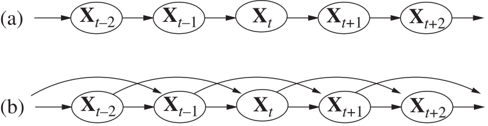

class: middle, center, title-slide

# Introduction to Artificial Intelligence

Lecture 7: Reasoning over time

---

# Today

- Markov models
- Hidden Karkov models
- Filtering

---

class: middle, center

# Markov models

---

# Reasoning over time or space

- Often, we want to **reason about a sequence** of observations.
    - Speech recognition
    - Robot localization
    - User attention
    - Medical monitoring.
- Therefore, we need to introduce **time** (or *space*) in our model.
- Consider the world as a *discrete* series of *time slices*, each of which contains a set of random variables.
    - $\mathbf{X}\_t$ denotes the set of state variables at time $t$.
    - $\mathbf{E}\_t$ denotes the set of observable evidence variables at time $t$.
- We specify a **transition model** $P(\mathbf{X}\_t | \mathbf{X}\_{0:t-1})$ that defines the probability distribution over the latest state variables, given the previous values.
- Similarly, we define a **sensor model** $P(\mathbf{E}\_t | \mathbf{X}\_{0:t}, \mathbf{E}\_{0:t-1})$.

---

# Markov models

- **Markov assumption**: $\mathbf{X}\_t$ depends on only a bounded subset of $\mathbf{X}\_{0:t-1}$.
    - Processes that satisfy this assumption are called **Markov processes**.
- *First-order* Markov processes: $P(\mathbf{X}\_t | \mathbf{X}\_{0:t-1}) = P(\mathbf{X}\_t | \mathbf{X}\_{t-1})$.
    - i.e., $\mathbf{X}\_t$ and $\mathbf{X}\_{0:t-2}$ are conditionally independent given $\mathbf{X}\_{t-1}$.
- *Second-order* Markov processes: $P(\mathbf{X}\_t | \mathbf{X}\_{0:t-1}) = P(\mathbf{X}\_t | \mathbf{X}\_{t-2}, \mathbf{X}\_{t-1})$.

.center.width-50[]

- Additionally, we make a **sensor Markov assumption**: $P(\mathbf{E}\_t | \mathbf{X}\_{0:t}, \mathbf{E}\_{0:t-1}) = P(\mathbf{E}\_t | \mathbf{X}\_{t})$
- *Stationary* process: the transition and the sensor models are the same for all $t$ (i.e., the laws of physics do not change with time).

---

# Joint distribution

.center.width-70[]

- A Markov process can be described as a *growable* Bayesian network, unrolled through time, with a specified restricted structure between time steps.
- Therefore, the *joint distribution* of all variables up to $t$ in a (first-order) Markov process is:
    $$P(\mathbf{X}\_{0:t}, \mathbf{E}\_{1:t}) = P(\mathbf{X}\_{0}) \prod\_{i=1}^t P(\mathbf{X}\_{i} | \mathbf{X}\_{i-1}) P(\mathbf{E}\_{i}|\mathbf{X}\_{i}) $$

---

# Example of Markov chain: Weather

---

# Inference tasks

---

# Filtering and prediction

---

# Ghostbusters: Basic dynamics

---

# Ghostbusters: Circular dynamics

---

# Ghostbusters: Whirlpool dynamics

---

# Stationary distributions

---

# Example

---

# Smoothing

---

# Finding the most likely explanation

---

class: middle, center

# Hidden Markov models

---

# Pacman with sonar

---

# Hidden Markov models

---

# Example: HMM Weather

---

# Example: Ghostbusters HMM

---

class: middle, center

# Filtering

---

# Filtering / Monitoring

---

# Robot localization

---

# Inference

---

# Summary

---

# References
