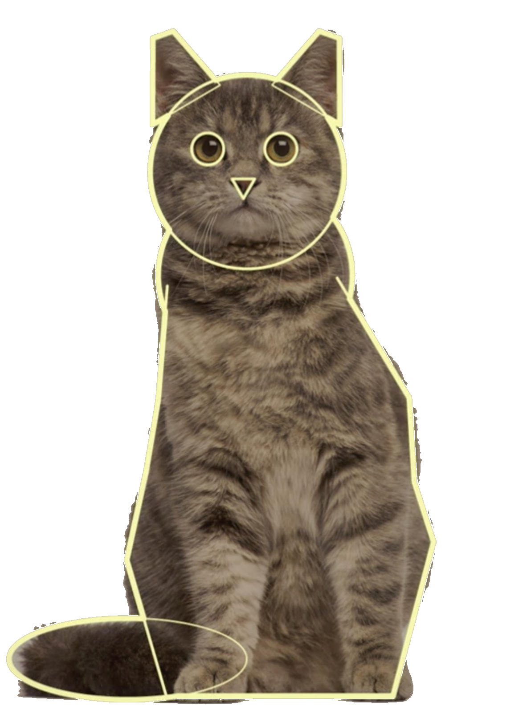

class: middle, center, title-slide

# Introduction to Artificial Intelligence

Lecture 7: Machine learning and neural networks

  
Prof. Gilles Louppe 
[g.louppe@uliege.be](mailto:g.louppe@uliege.be)

---

# Today

.center.width-60[]

Learning from data is a key component of artificial intelligence. In this lecture, we will introduce the principles of:
- Machine learning
- Neural networks

.footnote[Credits: [CS188](https://inst.eecs.berkeley.edu/~cs188/), UC Berkeley.]

---

class: middle

## Learning agents

What if the environment is **unknown**?
- Learning provides an automated way to modify the agent's internal decision mechanisms to improve its own performance.
- It exposes the agent to reality rather than trying to hardcode reality into the agent's program.

.success[More generally, learning is useful for any task where it is difficult to write a program that performs the task but easy to obtain examples of desired behavior.]

---

class: middle

# Machine learning

---

class: middle

.center[
.width-40[] &nbsp; &nbsp;
.width-40[]
]

.center[How would you write a computer program that recognizes cats from dogs?]

---

class: middle

.center.width-60[]

---

count: false
class: middle

.center.width-60[]

---

count: false
class: black-slide, middle
background-image: url(./figures/lec7/cat3.png)
background-size: cover

---

count: false
class: black-slide, middle

background-image: url(./figures/lec7/cat4.png)
background-size: cover

---

class: middle

.center.width-100[]

.center[The deep learning approach: train a highly parameterized model  to produce correct outputs (e.g., class labels) from inputs (e.g., images).]

---

# Problem statement

.grid[
.kol-2-3[

Let $\mathbf{d} \sim p(\mathbf{x}, y)$ be a dataset of $N$ example input-output pairs
    $$\mathbf{d} = \\\\{ (\mathbf{x}\_1, y\_1), (\mathbf{x}\_2, y\_2), ..., (\mathbf{x}\_N, y\_N) \\\\},$$
where $\mathbf{x}\_i \in \mathbb{R}^d$ are $d$-dimensional vectors representing the input values and $y_i \in \mathcal{Y}$ are the corresponding output values.

From this data, we want to identify a probabilistic model $$p\_\theta(y|\mathbf{x})$$ that best explains the data.

]
.kol-1-3[  .center.width-80[]]
]

---

class: middle

.center.width-60[]

.center[Regression ($y \in \mathbb{R}$) and classification ($y \in \\\\{0, 1, ..., C-1\\\\}$) problems.]

.footnote[Credits: [Simon J.D. Prince](https://udlbook.github.io/udlbook/), 2023.]

---

class: middle

.center.width-60[]

.center[Supervised learning with structured outputs ($y \in \mathcal{Y}$).]

.footnote[Credits: [Simon J.D. Prince](https://udlbook.github.io/udlbook/), 2023.]

---

# Linear regression

Let us first assume that $y \in \mathbb{R}$.

 
.center.width-90[]

.footnote[Credits: [CS188](https://inst.eecs.berkeley.edu/~cs188/), UC Berkeley.]

???

Do it on the blackboard.

---

class: middle

.grid[
.kol-1-5[ .center.width-100[]]
.kol-4-5[.center.width-50[]]
]

Linear regression considers a parameterized linear Gaussian model for its parametric model of $p(y|\\mathbf{x})$, that is
$$p(y|\mathbf{x}) = \mathcal{N}(y | \mathbf{w}^T \mathbf{x} + b, \sigma^2),$$
where $\mathbf{w}$ and $b$ are parameters to determine.

.footnote[Credits: [Simon J.D. Prince](https://udlbook.github.io/udlbook/), 2023.]

---

  

Following the principle of maximum likelihood estimation, we maximize
$$p(y|\mathbf{x}) = \frac{1}{\sqrt{2\pi}\sigma} \exp\left(-\frac{1}{2}\frac{(y-(\mathbf{w}^T \mathbf{x} + b))^2}{\sigma^2}\right)$$
w.r.t. $\mathbf{w}$ and $b$ over the data $\mathbf{d} = \\\{ (\mathbf{x}\_j, y\_j) \\\}$.

--

count: false

By constraining the derivatives of the log-likelihood to $0$, we arrive to the problem of minimizing
$$\mathcal{L}(\mathbf{w},b) = \sum\_{j=1}^N (y\_j - (\mathbf{w}^T \mathbf{x}\_j + b))^2.$$
Therefore, minimizing the sum of squared errors corresponds to the MLE solution for a linear fit, assuming Gaussian noise of fixed variance. 

---

class: middle

.center.width-45[]

.center[
  
Minimizing the negative log-likelihood of a linear Gaussian model reduces to minimizing the sum of squared residuals.]

.footnote[Credits: [Simon J.D. Prince](https://udlbook.github.io/udlbook/), 2023.]

---

class: middle

If we absorb the bias term $b$ into the weight vector $\mathbf{w}$ by adding a constant feature $x_0=1$ to the input vector $\mathbf{x}$, the solution $\mathbf{w}^\*$ is given analytically by
$$\mathbf{w}^\* = (\mathbf{X}^T \mathbf{X})^{-1} \mathbf{X}^T \mathbf{y},$$
where $\mathbf{X}$ is the input matrix made of the stacked input vectors $\mathbf{x}_j$ (including the constant feature) and $\mathbf{y}$ is the output vector made of the output values $y_j$.

---

# Logistic regression

Let us now assume $y \in \\{0,1\\}$.

 
.center.width-50[]

.footnote[Credits: [CS188](https://inst.eecs.berkeley.edu/~cs188/), UC Berkeley.]

---

class: middle

Logistic regression models the conditional as
$$P(Y=1|\mathbf{x}) = \sigma(\mathbf{w}^T \mathbf{x}+b),$$
where the sigmoid activation function
$\sigma(x) = \frac{1}{1 + \exp(-x)}$
looks like a soft heavyside:
.center.width-60[]

???

This model is the core building block of deep neural networks!

---

class: middle

Following the principle of maximum likelihood estimation, we have

$$\begin{aligned}
&\arg \max\_{\mathbf{w},b} P(\mathbf{d}|\mathbf{w},b) \\\\
&= \arg \max\_{\mathbf{w},b} \prod\_{\mathbf{x}\_i, y\_i \in \mathbf{d}} P(Y=y\_i|\mathbf{x}\_i, \mathbf{w},b) \\\\
&= \arg \max\_{\mathbf{w},b} \prod\_{\mathbf{x}\_i, y\_i \in \mathbf{d}} \sigma(\mathbf{w}^T \mathbf{x}\_i + b)^{y\_i}  (1-\sigma(\mathbf{w}^T \mathbf{x}\_i + b))^{1-y\_i}  \\\\
&= \arg \min\_{\mathbf{w},b} \underbrace{\sum\_{\mathbf{x}\_i, y\_i \in \mathbf{d}} -{y\_i} \log\sigma(\mathbf{w}^T \mathbf{x}\_i + b) - {(1-y\_i)} \log (1-\sigma(\mathbf{w}^T \mathbf{x}\_i + b))}\_{\mathcal{L}(\mathbf{w}, b) = \sum\_i \ell(y\_i, \hat{y}(\mathbf{x}\_i; \mathbf{w}, b))}
\end{aligned}$$

This loss is an estimator of the **cross-entropy** $$H(p,q) = \mathbb{E}_p[-\log q]$$ for  $p=Y|\mathbf{x}\_i$ and $q=\hat{Y}|\mathbf{x}\_i$. 

Unfortunately, there is no closed-form solution for the MLE of $\mathbf{w}$ and $b$.

---

class: middle

## Gradient descent

Let $\mathcal{L}(\theta)$ denote a loss function (e.g., the negative log-likelihood) defined over model parameters $\theta$ (e.g., $\mathbf{w}$ and $b$).

To minimize $\mathcal{L}(\theta)$, **gradient descent** relies on 1st-order Taylor approximations
$$\mathcal{L}(\theta + \epsilon) \approx \mathcal{L}(\theta) + \epsilon^T\nabla\_\theta \mathcal{L}(\theta)$$
and adds a quadratic regularization term to ensure that the approximation is valid only in a neighborhood of $\theta$, leading to the approximation
$$\hat{\mathcal{L}}(\epsilon; \theta) = \mathcal{L}(\theta) + \epsilon^T\nabla\_\theta \mathcal{L}(\theta) + \frac{1}{2\gamma} \|\epsilon\|^2,$$
where $\gamma > 0$ controls the size of the neighborhood.

---

class: middle

.center[]

---

class: middle

A minimizer of the approximation $\hat{\mathcal{L}}(\epsilon; \theta\_0)$ is given for
$$\begin{aligned}
\nabla\_\epsilon \hat{\mathcal{L}}(\epsilon; \theta\_0) &= 0 \\\\
 &= \nabla\_\theta \mathcal{L}(\theta\_0) + \frac{1}{\gamma} \epsilon,
\end{aligned}$$
which results in the best improvement for the step $\epsilon = -\gamma \nabla\_\theta \mathcal{L}(\theta\_0)$.

Therefore, model parameters can be updated iteratively using the update rule
$$\theta\_{t+1} = \theta\_t -\gamma \nabla\_\theta \mathcal{L}(\theta\_t),$$
where
- $\theta_0$ are the initial parameters of the model,
- $\gamma$ is the learning rate.

---

class: center, middle

---

count: false
class: center, middle

---

count: false
class: center, middle

---

count: false
class: center, middle

---

count: false
class: center, middle

---

count: false
class: center, middle

---

count: false
class: center, middle

---

count: false
class: center, middle

---

class: middle, center

(Step-by-step code example)

---

class: middle

## Measuring performance

ML models are trained to minimize the loss $\mathcal{L}(\theta)$ on a training dataset $\mathbf{d}\_\text{train}$. However, a low training loss does not guarantee good performance on unseen data, as the model may have memorized the training data.

To assess its generalization performance, a model should be evaluated on a separate test dataset $\mathbf{d}\_\text{test}$ that was not used during training. This evaluation provides an estimate of how well the model will perform on new, unseen data.

 
.center.width-100[]

.footnote[Credits: [Simon J.D. Prince](https://udlbook.github.io/udlbook/), 2023.]

---

class: middle

## Example: imitation learning in Pacman

Can we learn to play Pacman only from observations?
- Feature vectors $\mathbf{x} = g(s)$ are extracted from the game states $s$. Output values $y$ corresponds to actions $a$ .
- State-action pairs $(\mathbf{x}, y)$ are collected by observing an expert playing.
- We want to learn the actions that the expert would take in a given situation. That is, learn the mapping $f:\mathbb{R}^d \to \mathcal{A}$.
- This is a multiclass classification problem.

.center.width-70[]

.footnote[Credits: [CS188](https://inst.eecs.berkeley.edu/~cs188/), UC Berkeley.]

???

!!! This year's project is about imitation learning in Pacman.

---

class: middle, black-slide

.center[
<video controls muted preload="auto" height="400" width="640">
  <source src="./figures/lec7/training1.mp4" type="video/mp4">
</video>

The agent observes a very good Minimax-based agent for two games and updates its weight vectors as data are collected.
]

.footnote[Credits: [CS188](https://inst.eecs.berkeley.edu/~cs188/), UC Berkeley.]

---

class: middle, black-slide

.center[
<video controls muted preload="auto" height="400" width="640">
  <source src="./figures/lec7/training2.mp4" type="video/mp4">
</video>

  ]

.footnote[Credits: [CS188](https://inst.eecs.berkeley.edu/~cs188/), UC Berkeley.]

---

class: middle, black-slide

.center[
<video controls muted preload="auto" height="400" width="640">
  <source src="./figures/lec7/apprentice.mp4" type="video/mp4">
</video>

After two training episodes, the ML-based agents plays. 
No more Minimax!
]

.footnote[Credits: [CS188](https://inst.eecs.berkeley.edu/~cs188/), UC Berkeley.]

---

class: middle

# Deep Learning

(a short introduction)

---

# Shallow networks

 
.center.width-100[]

A shallow network is a function $$f : \mathbb{R}^{d\_\text{in}} \to \mathbb{R}^{d\_\text{out}}$$ that maps multi-dimensional inputs $\mathbf{x} \in \mathbb{R}^{d\_\text{in}}$ to multi-dimensional outputs $\mathbf{y} \in \mathbb{R}^{d\_\text{out}}$ through a hidden layer $\mathbf{h} = [h\_0, h\_1, ..., h\_{q-1}] \in \mathbb{R}^q$.

.footnote[Credits: [Simon J.D. Prince](https://udlbook.github.io/udlbook/), 2023.]

---

class: middle

The hidden layer is a non-linear transformation of the input, such that
$$h\_j = \sigma\left(\sum\_{i=0}^{d\_\text{in} - 1} w\_{ji} x\_i + b\_j  \right)$$
for $j=0, ..., q-1$, where $w\_{ji}$ and $b\_j$ ($i=0, ..., d\_\text{in}-1$, $j=0, ..., q-1$) are the model parameters and $\sigma$ is an activation function.

The output layer is a linear transformation of the hidden layer, such that
$$y\_k = \sum\_{j=0}^{q-1} v\_{kj} h\_j + c\_k$$
for $k=0, ..., d\_\text{out}-1$, where $v\_{kj}$ and $c\_k$ ($j=0, ..., q-1$, $k=0, ..., d\_\text{out}-1$) are the model parameters.

---

class: middle

## Single-input single-output networks

We first consider the case where $d\_\text{in} = 1$ and $d\_\text{out} = 1$ for the single-input single-output network
$$y = v\_{0} \sigma(w\_{0} x + b\_0) + v\_{1} \sigma(w\_{1} x + b\_1) + v\_{2} \sigma(w\_{2} x + b\_2) + c$$
where $w\_{0}$, $w\_{1}$, $w\_{2}$, $b\_0$, $b\_1$, $b\_2$, $v\_{0}$, $v\_{1}$, $v\_{2}$ and $c$ are the model parameters and where the activation function $\sigma$ is $\text{ReLU}(\cdot) = \max(0, \cdot)$.

 
.center.width-100[]

.footnote[Credits: [Simon J.D. Prince](https://udlbook.github.io/udlbook/), 2023.]

---

class: middle

.center.width-70[]

.footnote[Credits: [Simon J.D. Prince](https://udlbook.github.io/udlbook/), 2023.]

---

class: middle

.center.width-100[]

This shallow network defines a family of piecewise linear functions where the positions of the joints, the slopes and the heights of the functions are determined by the 10 parameters $w\_{0}$, $w\_{1}$, $w\_{2}$, $b\_0$, $b\_1$, $b\_2$, $v\_{0}$, $v\_{1}$, $v\_{2}$ and $c$.

.footnote[Credits: [Simon J.D. Prince](https://udlbook.github.io/udlbook/), 2023.]

---

class: middle

## Universal approximation theorem

The **universal approximation theorem** states that any continuous function can be approximated arbitrarily well by a shallow network with sufficiently many hidden units. 

For example, for 1d input and 1d output, any continuous function $f: \mathbb{R} \to \mathbb{R}$ can be approximated to arbitrary accuracy by a piecewise linear function with enough linear segments, which can be represented by a shallow network with enough hidden units.

---

class: middle

.center.width-100[]

.footnote[Credits: [Simon J.D. Prince](https://udlbook.github.io/udlbook/), 2023.]

---

class: middle

## Multivariate outputs

To extend the network to multivariate outputs $\mathbf{y} = [y\_0, y\_1, .., y\_{d\_\text{out} - 1}]$, we simply add more output units as linear combinations of the hidden units. 

For example, a network with two output units $y\_0$ and $y\_1$ might have the following structure:
$$\begin{aligned}
h\_0 &= \sigma\left( w\_0 x + b\_0 \right) \\\\
h\_1 &= \sigma\left( w\_1 x + b\_1 \right) \\\\
h\_2 &= \sigma\left( w\_2 x + b\_2 \right) \\\\
h\_3 &= \sigma\left( w\_3 x + b\_3 \right) \\\\
y\_0 &= v\_{00} h\_0 + v\_{01} h\_1 + v\_{02} h\_2 + v\_{03} h\_3 + c\_0 \\\\
y\_1 &= v\_{10} h\_0 + v\_{11} h\_1 + v\_{12} h\_2 + v\_{13} h\_3 + c\_1
\end{aligned}$$

---

class: middle

.center.width-100[]

a) With two output units, the network can model two functions of the input $x$. 

b) The four joints of these functions are constrained to be at the same positions, but the slopes and heights of the functions can vary independently.

.footnote[Credits: [Simon J.D. Prince](https://udlbook.github.io/udlbook/), 2023.]

---

class: middle

## Multivariate inputs

To extend the network to multivariate inputs $\mathbf{x} = [x\_0, x\_1, ..., x\_{d\_{\text{in}}-1}]$, we extend the linear relations between the input and the hidden units. 

.center.width-50[]

For example, a network with two inputs $\mathbf{x} = [x\_0, x\_1]$ might have three hidden units $h\_0$, $h\_1$ and $h\_2$ defined as
$$\begin{aligned}
h\_0 &= \sigma\left( w\_{00} x\_0 + w\_{01} x\_1 + b\_0 \right) \\\\
h\_1 &= \sigma\left( w\_{10} x\_0 + w\_{11} x\_1 + b\_1 \right) \\\\
h\_2 &= \sigma\left( w\_{20} x\_0 + w\_{21} x\_1 + b\_2 \right).
\end{aligned}$$

.footnote[Credits: [Simon J.D. Prince](https://udlbook.github.io/udlbook/), 2023.]

---

class: middle

.center.width-60[]

.footnote[Credits: [Simon J.D. Prince](https://udlbook.github.io/udlbook/), 2023.]

---

# Deep networks

We first consider the composition of two shallow networks, where the output of the first network is fed as input to the second network as
$$\begin{aligned}
h\_0 &= \sigma\left( w\_{0} x + b\_0 \right) \\\\
h\_1 &= \sigma\left( w\_{1} x + b\_1 \right) \\\\
h\_2 &= \sigma\left( w\_{2} x + b\_2 \right) \\\\
y &= v\_{0} h\_0 + v\_{1} h\_1 + v\_{2} h\_2 + c \\\\
h\_0' &= \sigma\left( w'\_{0} y + b'\_0 \right) \\\\
h\_1' &= \sigma\left( w'\_{1} y + b'\_1 \right) \\\\
h\_2' &= \sigma\left( w'\_{2} y + b'\_2 \right) \\\\
y' &= v'\_{0} h\_0' + v'\_{1} h\_1' + v'\_{2} h\_2' + c'.
\end{aligned}$$

.center.width-85[]

.footnote[Credits: [Simon J.D. Prince](https://udlbook.github.io/udlbook/), 2023.]

---

class: middle

With $\text{ReLU}$ activation functions, this network also describes a family of piecewise linear functions. However, each linear region defined by the hidden units of the first network is further divided by the hidden units of the second network.

.center.width-80[]

.footnote[Credits: [Simon J.D. Prince](https://udlbook.github.io/udlbook/), 2023.]

---

class: middle

.center.width-100[]

The composition of two shallow networks can be interpreted as a folding operation in three steps:

a) The first network folds the input space back on itself. 
b) The second network applies its function to the folded space. 
c) The final output is revealed by unfolding the folded space.

.footnote[Credits: [Simon J.D. Prince](https://udlbook.github.io/udlbook/), 2023.]

---

class: middle

Similarly, composing a multivariate shallow network with a shallow network further divides the input space into more linear regions.

.center.width-100[]

.footnote[Credits: [Simon J.D. Prince](https://udlbook.github.io/udlbook/), 2023.]

---

class: middle

## From composing shallow networks to deep networks

Since the operation from $[h\_0, h\_1, h\_2]$ to $y$ is linear and the operation from $y$ to $[h'\_0, h'\_1, h'\_2]$ is also linear, their composition in series is linear. 

It follows that the composition of the two shallow networks is a special case of a deep network with two hidden layers.

.center.width-100[]

.footnote[Credits: [Simon J.D. Prince](https://udlbook.github.io/udlbook/), 2023.]

---

class: middle

Mathematically, the first layer is defined as
$$\begin{aligned}
h\_0 &= \sigma\left( w\_{0} x + b\_0 \right) \\\\
h\_1 &= \sigma\left( w\_{1} x + b\_1 \right) \\\\
h\_2 &= \sigma\left( w\_{2} x + b\_2 \right),
\end{aligned}$$
while the second layer is defined from the outputs of the first layer as
$$\begin{aligned}
h\_0' &= \sigma\left( w'\_{00} h\_0 + w'\_{01} h\_1 + w'\_{02} h\_2 + b'\_0 \right) \\\\
h\_1' &= \sigma\left( w'\_{10} h\_0 + w'\_{11} h\_1 + w'\_{12} h\_2 + b'\_1 \right) \\\\
h\_2' &= \sigma\left( w'\_{20} h\_0 + w'\_{21} h\_1 + w'\_{22} j\_2 + b'\_2 \right),
\end{aligned}$$
and the output as
$$y = v\_0 h\_0' + v\_1 h\_1' + v\_2 h\_2' + c.$$

---

class: middle

.center.width-70[]

.footnote[Credits: [Simon J.D. Prince](https://udlbook.github.io/udlbook/), 2023.]

---

class: middle

## Multilayer perceptron

We first note that the computation of a hidden layer with $q$ hidden units can be written in matrix form as
$$\begin{aligned}
\mathbf{h} &= \begin{bmatrix} h\_0 \\\\ h\_1 \\\\ \vdots \\\\ h\_{q-1} \end{bmatrix} = \sigma\left( \begin{bmatrix} w\_{00} & w\_{01} & \cdots & w\_{0(d\_\text{in}-1)} \\\\ w\_{10} & w\_{11} & \cdots & w\_{1(d\_\text{in}-1)} \\\\ \vdots & \vdots & \ddots & \vdots \\\\ w\_{(q-1)0} & w\_{(q-1)1} & \cdots & w\_{(q-1)(d\_\text{in}-1)} \end{bmatrix} \begin{bmatrix} x\_0 \\\\ x\_1 \\\\ \vdots \\\\ x\_{d\_\text{in}-1} \end{bmatrix} + \begin{bmatrix} b\_0 \\\\ b\_1 \\\\ \vdots \\\\ b\_{q-1} \end{bmatrix} \right) \\\\
&= \sigma(\mathbf{W}^T \mathbf{x} + \mathbf{b})
\end{aligned}$$
where $\mathbf{x} \in \mathbb{R}^{d\_\text{in}}$ is the input vector, $\mathbf{W} \in \mathbb{R}^{d\_\text{in} \times q}$ is the weight matrix of the hidden layer and $\mathbf{b} \in \mathbb{R}^{q}$ is the bias vector.

---

class: middle

Using this notation, layers can be composed in series to form a deep network with $K$ hidden layers such that
$$\begin{aligned}
\mathbf{h}\_0 &= \mathbf{x} \\\\
\mathbf{h}\_1 &= \sigma(\mathbf{W}^T\_1 \mathbf{h}\_0 + \mathbf{b}\_1) \\\\
\mathbf{h}\_2 &= \sigma(\mathbf{W}^T\_2 \mathbf{h}\_1 + \mathbf{b}\_2) \\\\
\vdots \\\\
\mathbf{h}\_K &= \sigma(\mathbf{W}^T\_K \mathbf{h}\_{K-1} + \mathbf{b}\_K) \\\\
\mathbf{y} &= \sigma(\mathbf{W}^T\_{y} \mathbf{h}\_K + \mathbf{b}\_{y})
\end{aligned}$$
where $\mathbf{W}\_k \in \mathbb{R}^{q\_{k-1} \times q\_k}$ is the weight matrix of the $k$-th hidden layer and $\mathbf{b}\_k \in \mathbb{R}^{q\_k}$ is the bias vector of the $k$-th layer.

The resulting function $f(\mathbf{x}; \theta)$ is a highly non-linear mapping from inputs $\mathbf{x}$ to outputs $\mathbf{y}$, where $\theta$ denotes the set of all model parameters. This architecture is known as the .bold[multilayer perceptron].

---

class: middle

A shallow network with one input, one output, and $q$ hidden units can create up to $q+1$ linear regions and is defined by $O(q)$ parameters.

A deep network with $K$ hidden layers, each with $q$ hidden units, can create up to $(q+1)^K$ linear regions and is defined by $O(Kq^2)$ parameters.

 

.center.width-100[]

.footnote[Credits: [Simon J.D. Prince](https://udlbook.github.io/udlbook/), 2023.]

---

class: middle

## Activation functions

Activation functions $\sigma: \mathbb{R} \to \mathbb{R}$ introduce non-linearities in the network, enabling the model to learn complex functions.

Common activation functions include:
- Sigmoid: $\sigma(x) = \frac{1}{1 + \exp(-x)}$, which maps inputs to the range $(0, 1)$.
- Hyperbolic tangent (tanh): $\sigma(x) = \tanh(x) = \frac{\exp(x) - \exp(-x)}{\exp(x) + \exp(-x)}$, which maps inputs to the range $(-1, 1)$.
- Rectified Linear Unit (ReLU): $\sigma(x) = \max(0, x)$, which introduces sparsity and mitigates the vanishing gradient problem.

The choice of the activation function $\sigma$ is crucial for the expressiveness of the network and the optimization of the model parameters. 

---

class: middle

.center.width-100[]

.footnote[Credits: [Simon J.D. Prince](https://udlbook.github.io/udlbook/), 2023.]

---

class: middle

## Output layers $\mathbf{y}=\sigma(\mathbf{W}^T\_y \mathbf{h}\_K + \mathbf{b}\_y)$

- For regression, the width $q$ of the output layer is set to the dimensionality of the output $d\_\text{out}$ and the activation function is the identity $\sigma(\cdot) = \cdot$.
- For binary classification, the width $q$ of the output layer is set to $1$ and the activation function is the sigmoid $\sigma(\cdot) = \frac{1}{1 + \exp(-\cdot)}$, which results in a single output that models the probability $p(y=1|\mathbf{x})$.
- For multi-class classification, the sigmoid activation $\sigma$ in the output layer can be generalized to produce a vector $\mathbf{y} \in \bigtriangleup^C$ of probability estimates $p(Y=i|\mathbf{x})$.
This activation is the $\text{Softmax}$ function, where its $i$-th output is defined as
$$\text{Softmax}(\mathbf{z})\_i = \frac{\exp(z\_i)}{\sum\_{j=1}^C \exp(z\_j)},$$
for $i=1, ..., C$.

---

class: middle

## Loss functions

The parameters (e.g., $\mathbf{W}\_k$ and $\mathbf{b}\_k$ for each layer $k$) of a deep network $f(\mathbf{x}; \theta)$ are learned by minimizing a loss function $\mathcal{L}(\theta)$ over a dataset $\mathbf{d} = \\\{ (\mathbf{x}\_j, \mathbf{y}\_j) \\\}$ of input-output pairs.

The loss function is derived from the likelihood: 
- For regression, assuming a Gaussian likelihood, the loss is the mean squared error $\mathcal{L}(\theta) = \frac{1}{N} \sum\_{(\mathbf{x}\_j, \mathbf{y}\_j) \in \mathbf{d}} (\mathbf{y}\_j - f(\mathbf{x}\_j; \theta))^2$.
- For classification, assuming a categorical likelihood, the loss is the cross-entropy $\mathcal{L}(\theta) = -\frac{1}{N} \sum\_{(\mathbf{x}\_j, \mathbf{y}\_j) \in \mathbf{d}} \sum\_{i=1}^C y\_{ij} \log f\_{i}(\mathbf{x}\_j; \theta)$.

---

class: middle, center

(Step-by-step code example)

---

# Convolutional networks

Images have properties that suggest the need for specialized architectures:
- They are high-dimensional inputs (e.g., $512 \times 512$ pixels = 262144 inputs).
- Nearby pixels are strongly correlated.
- The same patterns can appear at different locations in the image.
- Patterns are hierarchical: simple patterns combine to form more complex patterns.
- The interpretation of an image is stable under geometric transformations. 

.alert[The MLP architecture would fail to exploit these properties, leading to poor performance and high computational cost.]

---

class: middle
background-image: url('figures/lec7/wally.jpg')
background-size: contain
background-position: center

.footnote[Credits: Martin Handford, [Where's Wally?](https://en.wikipedia.org/wiki/Where%27s_Wally%3F) series.]

---

class: middle

## 1d convolution

For the one-dimensional input $\mathbf{x} \in \mathbb{R}^W$ and the convolutional kernel $\omega \in \mathbb{R}^w$, the discrete **convolution** $\mathbf{x} \circledast \omega$ is a vector of size $W - w + 1$ such that
$$\begin{aligned}
(\mathbf{x} \circledast \omega)[i] &= \sum\_{m=0}^{w-1} \mathbf{x}\_{m+i}  \omega\_m .
\end{aligned}
$$

.italic[
Technically, $\circledast$ denotes the cross-correlation operator.
However, most machine learning libraries call it convolution.
]

---

class: middle

.center.width-100[]

 
.center[1d convolution with a kernel $\omega = (\omega\_1, \omega\_2, \omega\_3)$ applied to the input signal $\mathbf{x}$.  
The output is obtained by sliding the kernel over the input and computing the inner product at each position.]

.footnote[Credits: [Simon J.D. Prince](https://udlbook.github.io/udlbook/), 2023.]

---

class: middle

## 2d convolution

For the 2d input tensor $\mathbf{x} \in \mathbb{R}^{H \times W}$ and the 2d convolutional kernel $\omega \in \mathbb{R}^{h \times w}$, the discrete **convolution** $\mathbf{x} \circledast \omega$ is a matrix of size $(H-h+1) \times (W-w+1)$ such that
$$(\mathbf{x} \circledast \omega)[j,i] = \sum\_{n=0}^{h-1} \sum\_{m=0}^{w-1}    \mathbf{x}\_{n+j,m+i} \omega_{n,m}$$

???

Draw: Explain the intuition behind the sum of element-wise products which reduces to an inner product between the kernel and a region of the input.

---

class: middle

.center.width-100[]

.center[2d convolution with a kernel $\omega  \in \mathbb{R}^{3 \times 3}$ applied to the input signal $\mathbf{x}$.]

.footnote[Credits: [Simon J.D. Prince](https://udlbook.github.io/udlbook/), 2023.]

---

class: middle

## Channels

The 2d convolution can be extended to tensors with multiple channels.

For the 3d input tensor $\mathbf{x} \in \mathbb{R}^{C \times H \times W}$ and the 3d convolutional kernel $\omega \in \mathbb{R}^{C \times h \times w}$, the discrete 2d convolution $\mathbf{x} \circledast \omega$ is a 2d tensor of size $(H-h+1) \times (W-w+1)$ such that
$$(\mathbf{x} \circledast \omega)[j,i] = \sum\_{c=0}^{C-1}\sum\_{n=0}^{h-1} \sum\_{m=0}^{w-1}    \mathbf{x}\_{c,n+j,m+i} \omega_{c,n,m}$$

---

class: middle

.center.width-100[]

.center[2d convolution applied to a color image with three channels (R, G, B).]

.footnote[Credits: [Simon J.D. Prince](https://udlbook.github.io/udlbook/), 2023.]

---

class: middle

## Convolutional layers

A convolutional layer is defined by a set of $K$ kernels $\omega_k$ of size $C \times h \times w$. It applies the 2d convolution operation to the input tensor $\mathbf{x}$ of size $C \times H \times W$ to produce a set of $K$ feature maps $\mathbf{o}\_k$.

---

class: middle

## Pooling layers

Pooling layers are used to progressively reduce the spatial size of the representation, hence capturing longer-range dependencies between features.

Considering a pooling area of size $h \times w$ and a 3D input tensor $\mathbf{x} \in \mathbb{R}^{C\times(rh)\times(sw)}$, max-pooling produces a tensor $\mathbf{o} \in \mathbb{R}^{C \times r \times s}$ such that
$$\mathbf{o}\_{c,j,i} = \max\_{n < h, m < w} \mathbf{x}_{c,rj+n,si+m}.$$

---

class: middle

.center.width-100[]

.center[Subsampling, max-pooling and average-pooling with a pooling area of size $2 \times 2$.]

.footnote[Credits: [Simon J.D. Prince](https://udlbook.github.io/udlbook/), 2023.]

---

class: middle

## Convolutional neural networks (CNNs)

A convolutional neural network (CNN) is a deep neural network that uses convolutional layers and pooling layers to process multi-dimensional inputs such as images.

- Convolutional layers extract local features from the input while preserving spatial relationships.
- Pooling layers reduce the spatial dimensions of the feature maps, allowing the network to capture more global features.
- Fully connected layers at the end of the network combine the extracted features to make predictions.

---

class: middle

.center.width-70[]

.center[The AlexNet architecture for image classification (Krizhevsky et al., 2012).]

.footnote[Credits: [Simon J.D. Prince](https://udlbook.github.io/udlbook/), 2023.]

---

class: middle, center

(Step-by-step code example)

???

See also https://poloclub.github.io/cnn-explainer/

---

# Transformers

Transformers are deep neural networks at the core of large-scale language models.

 

.center.width-100[]

.footnote[Credits: [Simon J.D. Prince](https://udlbook.github.io/udlbook/), 2023.]

---

class: middle

For language modeling, transformers define an .bold[autoregressive model] that predicts the next word in a sequence given the previous words. 

Formally,
$$p(w\_{1:t})= p(w\_1) \prod\_{t=2}^T p(w\_t|w\_{1:t-1}),$$
where $w\_t$ is the next word in the sequence and $w\_{1:t-1}$ are the previous words.

---

class: middle

.center.width-100[]

The decoder-only transformer is a stack of $K$ transformer blocks that process the input sequence in parallel using (masked) self-attention.

The output of the last block is used to predict the next word in the sequence, as in a regular classifier.

.footnote[Credits: [Simon J.D. Prince](https://udlbook.github.io/udlbook/), 2023.]

---

class: middle

.width-100[]

## Scaling laws 

- The more data, the better the model.
- The more parameters, the better the model.
- The more compute, the better the model.

(... at least until 2024-2025.)

---

class: middle

# AI beyond Pacman

---

class: black-slide, middle

.center[
<iframe width="640" height="400" src="https://www.youtube.com/embed/HS1wV9NMLr8?&loop=1&start=0" frameborder="0" volume="0" allowfullscreen></iframe>

How AI Helps Autonomous Vehicles See Outside the Box 
(See also [other episodes](https://www.youtube.com/playlist?list=PLZHnYvH1qtOYkElUMqYiHDMrGTPnqRhSr) from NVIDIA DRIVE Labs)
]

---

class: black-slide, middle, center

.width-100[]

Hydranet (Tesla, 2021)

???

70 networks

---

class: middle, black-slide, center

<iframe width="600" height="450" src="https://www.youtube.com/embed/AbdVsi1VjQY" frameborder="0" allowfullscreen></iframe>

How machine learning is advancing medicine (Google, 2018)

---

# Summary

- Deep learning is a powerful tool for learning from data.
- Neural networks are composed of layers of neurons that are connected to each other.
- The weights of the connections are learned by minimizing a loss function.
- Convolutional networks are used for image processing.
- Transformers are used for language processing.

---

class: middle

.center.circle.width-30[]

.italic[For the last forty years we have programmed computers; for the next forty years we will train them.]

.pull-right[Chris Bishop, 2020.]

---

class: end-slide, center
count: false

The end.