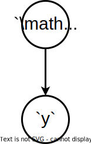
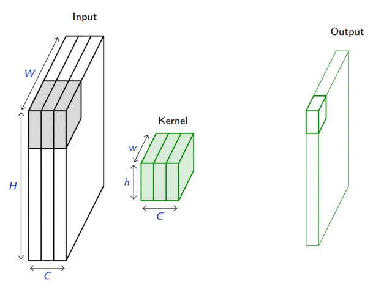
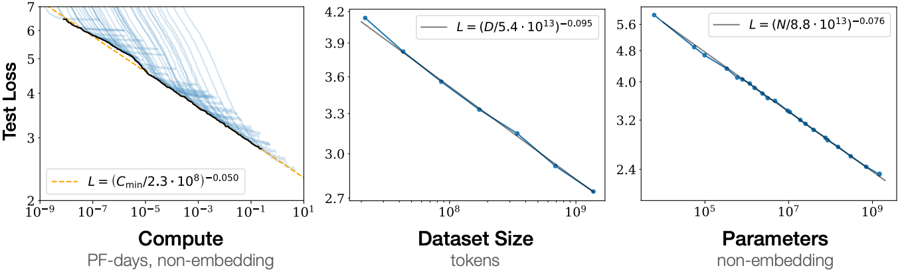

class: middle, center, title-slide

# Introduction to Artificial Intelligence

Lecture 7: Machine learning and neural networks

  
Prof. Gilles Louppe 
[g.louppe@uliege.be](mailto:g.louppe@uliege.be)

---

# Today

.center.width-50[]

Make our agents able to learn from experience.
- Machine learning
- Deep learning
  - Multi-layer perceptron
  - Convolutional neural networks
  - Recurrent neural networks

.footnote[Image credits: [CS188](https://inst.eecs.berkeley.edu/~cs188/), UC Berkeley.]

---

class: middle

## Learning agents

What if the environment is **unknown**?
- Learning provides an automated way to modify the agent's internal decision mechanisms to improve its own performance.
- It exposes the agent to reality rather than trying to hardcode reality into the agent's program.

---

class: middle

# Machine learning

---

class: middle

.center[
.width-40[] &nbsp; &nbsp;
.width-40[]
]

.question[How would you write a computer program that recognizes cats from dogs?]

---

class: middle

.center.width-60[]

---

count: false
class: black-slide, middle

.center.width-50[]

.center[The good old-fashioned approach.]

---

count: false
class: black-slide, middle

.center.width-80[]

---

count: false
class: black-slide, middle

.center.width-80[]

---

class: middle

.center.width-100[]

.center[The deep learning approach.]

---

# Problem statement

.grid[
.kol-2-3[

Let $\mathbf{d} \sim p(\mathbf{x}, y)$ be a dataset of $N$ example input-output pairs
    $$\mathbf{d} = \\\\{ (\mathbf{x}\_1, y\_1), (\mathbf{x}\_2, y\_2), ..., (\mathbf{x}\_N, y\_N) \\\\},$$
where $\mathbf{x}\_i$ are the input values and $y_i$ are the corresponding output values.

From this data, we want to identify a probabilistic model $$p(y|\mathbf{x})$$ that best explains the data.

]
.kol-1-3[.center.width-80[]]
]

---

class: middle

## Feature vectors

- Inputs $\mathbf{x} \in \mathbb{R}^d$ are described as real-valued vectors of $d$ attributes or features values.
- If the data is not originally expressed as real-valued vectors, then it needs to be prepared and transformed to this format.

.center.width-80[]

.footnote[Image credits: [CS188](https://inst.eecs.berkeley.edu/~cs188/), UC Berkeley.]

---

# Linear regression

Let us first assume that $y \in \mathbb{R}$.

 
.center.width-90[]

.footnote[Image credits: [CS188](https://inst.eecs.berkeley.edu/~cs188/), UC Berkeley.]

???

Do it on the blackboard.

---

class: middle

.grid[
.kol-1-5[.center.width-100[]]
.kol-4-5[.center.width-60[]]
]

Linear regression considers a parameterized linear Gaussian model for its parametric model of $p(y|\\mathbf{x})$, that is
$$p(y|\mathbf{x}) = \mathcal{N}(y | \mathbf{w}^T \mathbf{x} + b, \sigma^2),$$
where $\mathbf{w}$ and $b$ are parameters to determine.

---

  

To learn the conditional distribution $p(y|\mathbf{x})$, we maximize
$$p(y|\mathbf{x}) = \frac{1}{\sqrt{2\pi}\sigma} \exp\left(-\frac{(y-(\mathbf{w}^T \mathbf{x} + b))^2}{2\sigma^2}\right)$$
w.r.t. $\mathbf{w}$ and $b$ over the data $\mathbf{d} = \\\{ (\mathbf{x}\_j, y\_j) \\\}$.

--

count: false

By constraining the derivatives of the log-likelihood to $0$, we arrive to the problem of minimizing
$$\sum\_{j=1}^N (y\_j - (\mathbf{w}^T \mathbf{x}\_j + b))^2.$$
Therefore, minimizing the sum of squared errors corresponds to the MLE solution for a linear fit, assuming Gaussian noise of fixed variance.

---

class: middle

.center.width-80[]

---

# Logistic regression

Let us now assume $y \in \\{0,1\\}$.

 
.center.width-50[]

.footnote[Image credits: [CS188](https://inst.eecs.berkeley.edu/~cs188/), UC Berkeley.]

---

class: middle

Logistic regression models the conditional as
$$P(Y=1|\mathbf{x}) = \sigma(\mathbf{w}^T \mathbf{x}+b),$$
where the sigmoid activation function
$\sigma(x) = \frac{1}{1 + \exp(-x)}$
looks like a soft heavyside:
.center.width-60[]

???

This model is core building block of deep neural networks!

---

class: middle

Following the principle of maximum likelihood estimation, we have

$$\begin{aligned}
&\arg \max\_{\mathbf{w},b} P(\mathbf{d}|\mathbf{w},b) \\\\
&= \arg \max\_{\mathbf{w},b} \prod\_{\mathbf{x}\_i, y\_i \in \mathbf{d}} P(Y=y\_i|\mathbf{x}\_i, \mathbf{w},b) \\\\
&= \arg \max\_{\mathbf{w},b} \prod\_{\mathbf{x}\_i, y\_i \in \mathbf{d}} \sigma(\mathbf{w}^T \mathbf{x}\_i + b)^{y\_i}  (1-\sigma(\mathbf{w}^T \mathbf{x}\_i + b))^{1-y\_i}  \\\\
&= \arg \min\_{\mathbf{w},b} \underbrace{\sum\_{\mathbf{x}\_i, y\_i \in \mathbf{d}} -{y\_i} \log\sigma(\mathbf{w}^T \mathbf{x}\_i + b) - {(1-y\_i)} \log (1-\sigma(\mathbf{w}^T \mathbf{x}\_i + b))}\_{\mathcal{L}(\mathbf{w}, b) = \sum\_i \ell(y\_i, \hat{y}(\mathbf{x}\_i; \mathbf{w}, b))}
\end{aligned}$$

This loss is an instance of the **cross-entropy** $$H(p,q) = \mathbb{E}_p[-\log q]$$ for  $p=Y|\mathbf{x}\_i$ and $q=\hat{Y}|\mathbf{x}\_i$.

---

# Gradient descent

Let $\mathcal{L}(\theta)$ denote a loss function defined over model parameters $\theta$ (e.g., $\mathbf{w}$ and $b$).

To minimize $\mathcal{L}(\theta)$, **gradient descent** uses local linear information to iteratively move towards a (local) minimum.

For $\theta\_0 \in \mathbb{R}^d$, a first-order approximation around $\theta\_0$ can be defined as
$$\hat{\mathcal{L}}(\epsilon; \theta\_0) = \mathcal{L}(\theta\_0) + \epsilon^T\nabla\_\theta \mathcal{L}(\theta\_0) + \frac{1}{2\gamma}||\epsilon||^2.$$

.center.width-50[]

---

class: middle

A minimizer of the approximation $\hat{\mathcal{L}}(\epsilon; \theta\_0)$ is given for
$$\begin{aligned}
\nabla\_\epsilon \hat{\mathcal{L}}(\epsilon; \theta\_0) &= 0 \\\\
 &= \nabla\_\theta \mathcal{L}(\theta\_0) + \frac{1}{\gamma} \epsilon,
\end{aligned}$$
which results in the best improvement for the step $\epsilon = -\gamma \nabla\_\theta \mathcal{L}(\theta\_0)$.

Therefore, model parameters can be updated iteratively using the update rule
$$\theta\_{t+1} = \theta\_t -\gamma \nabla\_\theta \mathcal{L}(\theta\_t),$$
where
- $\theta_0$ are the initial parameters of the model,
- $\gamma$ is the learning rate.

---

class: center, middle

---

count: false
class: center, middle

---

count: false
class: center, middle

---

count: false
class: center, middle

---

count: false
class: center, middle

---

count: false
class: center, middle

---

count: false
class: center, middle

---

count: false
class: center, middle

---

class: middle, center

(Step-by-step code example)

---

# Apprenticeship

Can we learn to play Pacman only from observations?
- Feature vectors $\mathbf{x} = g(s)$ are extracted from the game states $s$. Output values $y$ corresponds to actions $a$ .
- State-action pairs $(\mathbf{x}, y)$ are collected by observing an expert playing.
- We want to learn the actions that the expert would take in a given situation. That is, learn the mapping $f:\mathbb{R}^d \to \mathcal{A}$.
- This is a multiclass classification problem that can be solved by combining binary classifers.

.center.width-70[]

.footnote[Image credits: [CS188](https://inst.eecs.berkeley.edu/~cs188/), UC Berkeley.]

???

[Q] How is this (very) different from reinforcement learning?

---

class: middle, black-slide

.center[
<video controls muted preload="auto" height="400" width="640">
  <source src="./figures/lec7/training1.mp4" type="video/mp4">
</video>

The agent observes a very good Minimax-based agent for two games and updates its weight vectors as data are collected.
]

.footnote[Image credits: [CS188](https://inst.eecs.berkeley.edu/~cs188/), UC Berkeley.]

---

class: middle, black-slide

.center[
<video controls muted preload="auto" height="400" width="640">
  <source src="./figures/lec7/training2.mp4" type="video/mp4">
</video>

  ]

.footnote[Image credits: [CS188](https://inst.eecs.berkeley.edu/~cs188/), UC Berkeley.]

---

class: middle, black-slide

.center[
<video controls muted preload="auto" height="400" width="640">
  <source src="./figures/lec7/apprentice.mp4" type="video/mp4">
</video>

After two training episodes, the ML-based agents plays. 
No more Minimax!
]

.footnote[Image credits: [CS188](https://inst.eecs.berkeley.edu/~cs188/), UC Berkeley.]

---

class: middle

# Deep Learning

(a short introduction)

---

# Multi-layer perceptron

So far we considered the logistic unit $h=\sigma\left(\mathbf{w}^T \mathbf{x} + b\right)$, where $h \in \mathbb{R}$, $\mathbf{x} \in \mathbb{R}^d$, $\mathbf{w} \in \mathbb{R}^d$ and $b \in \mathbb{R}$.

These units can be composed *in parallel* to form a **layer** with $q$ outputs:
$$\mathbf{h} = \sigma(\mathbf{W}^T \mathbf{x} + \mathbf{b})$$
where  $\mathbf{h} \in \mathbb{R}^q$, $\mathbf{x} \in \mathbb{R}^d$, $\mathbf{W} \in \mathbb{R}^{d\times q}$, $b \in \mathbb{R}^d$ and where $\sigma(\cdot)$ is upgraded to the element-wise sigmoid function.

---

class: middle

Similarly, layers can be composed *in series*, such that:
$$\begin{aligned}
\mathbf{h}\_0 &= \mathbf{x} \\\\
\mathbf{h}\_1 &= \sigma(\mathbf{W}\_1^T \mathbf{h}\_0 + \mathbf{b}\_1) \\\\
... \\\\
\mathbf{h}\_L &= \sigma(\mathbf{W}\_L^T \mathbf{h}\_{L-1} + \mathbf{b}\_L) \\\\
f(\mathbf{x}; \theta) &= \mathbf{h}\_L
\end{aligned}$$
where $\theta$ denotes the model parameters $\\{ \mathbf{W}\_k, \mathbf{b}\_k, ... | k=1, ..., L\\}$ and can be determined through gradient descent.

This model is the **multi-layer perceptron**, also known as the fully connected feedforward network.

---

class: middle

.width-100[]

.footnote[Credits: [Dive into Deep Learning](https://d2l.ai/chapter_multilayer-perceptrons/mlp.html), 2023.]

---

class: middle

- For binary classification, the width $q$ of the last layer $L$ is set to $1$, which results in a single output $h\_L \in [0,1]$ that models the probability $p(y=1|\mathbf{x})$.
- For multi-class classification, the sigmoid activation $\sigma$ in the last layer can be generalized to produce a vector $\mathbf{h}\_L \in \bigtriangleup^C$ of probability estimates $p(y=i|\mathbf{x})$.
  
This activation is the $\text{Softmax}$ function, where its $i$-th output is defined as
$$\text{Softmax}(\mathbf{z})\_i = \frac{\exp(z\_i)}{\sum\_{j=1}^C \exp(z\_j)},$$
for $i=1, ..., C$.

---

class: middle

Activation functions are key to the expressiveness of neural networks. They are usually chosen to be non-linear, such as the sigmoid function $\sigma(x) = \frac{1}{1 + \exp(-x)}$ or the ReLU function $\text{ReLU}(x) = \max(0, x)$.

.center[

 

]

---

class: middle, center

(Step-by-step code example)

---

class: black-slide
background-image: url(./figures/lec7/waldo-football.jpg)
background-size: cover

# Neural networks for images

???

The game consists of a number of chaotic scenes bursting with activities. Waldo shows up somewhere in each, typically lurking in some unlikely location. The reader’s goal is to locate him. Despite his characteristic outfit, this can be surprisingly difficult, due to the large number of distractions. However, what Waldo looks like does not depend upon where Waldo is located. We could sweep the image with a Waldo detector that could assign a score to each patch, indicating the likelihood that the patch contains Waldo

---

class: middle

The MLP architecture is appropriate for tabular data, but not for images.
We want to design a neural architecture such that:
- in the earliest layers, the network respond similarly to similar patches of the image, regardless of their location;
- the earliest layers focus on local regions of the image, without regard for the contents of the image in distant regions;
- in the later layers, the network combines the information from the earlier layers to focus on larger and larger regions of the image, eventually combining all the information from the image to classify the image into a category.

---

# Convolutional networks

Convolutional neural networks extend fully connected architectures with
- convolutional layers acting as local feature detectors;
- pooling layers acting as spatial down-samplers.

 
.center.width-80[]

---

class: middle

## Convolutional layers

A convolutional layer is defined by a set of $K$ kernels $\mathbf{u}\_{k}$ of size $h \times w \times c$, where $h$ and $w$ are the height and width of the kernel, and $c$ is the number of channels of the input.

Assuming as input a 3D tensor $\mathbf{x} \in \mathbb{R}^{C \times H \times W}$, the output of the convolutional layer is a set of $K$ feature maps of size $H' \times W'$, where $H' = H - h + 1$ and $W' = W - w + 1$. Each feature map $\mathbf{o}$ is the result of convolving the input with a kernel, that is
$$\mathbf{o}\_{j,i} = \sum\_{c=0}^{C-1} (\mathbf{x}\_c \circledast \mathbf{u}\_c)[j,i] = \sum\_{c=0}^{C-1}  \sum\_{n=0}^{h-1} \sum\_{m=0}^{w-1}    \mathbf{x}\_{c,n+j,m+i} \mathbf{u}\_{c,n,m}$$

---

class: middle

.center[]

.footnote[Credits: Francois Fleuret, [EE559 Deep Learning](https://fleuret.org/ee559/), EPFL.]

---

class: black-slide
background-image: url(./figures/lec7/waldo-mask.jpg)
background-size: cover

---

class: middle

## Pooling layers

Pooling layers are used to progressively reduce the spatial size of the representation, hence capturing longer-range dependencies between features.

Considering a pooling area of size $h \times w$ and a 3D input tensor $\mathbf{x} \in \mathbb{R}^{C\times(rh)\times(sw)}$, max-pooling produces a tensor $\mathbf{o} \in \mathbb{R}^{C \times r \times s}$ such that
$$\mathbf{o}\_{c,j,i} = \max\_{n < h, m < w} \mathbf{x}_{c,rj+n,si+m}.$$

---

class: middle

.center[]

.footnote[Credits: Francois Fleuret, [EE559 Deep Learning](https://fleuret.org/ee559/), EPFL.]

---

class: middle, black-slide

.center[
<iframe width="640" height="400" src="https://www.youtube.com/embed/zj_JlVqWK1M?&loop=1&start=0" frameborder="0" volume="0" allowfullscreen></iframe>

A convolutional network combines convolutional, pooling  and fully connected layers.
]

---

class: middle, center

(Step-by-step code example)

---

# Recurrent networks

When the input is a sequence $\mathbf{x}\_{1:T}$, the feedforward network can be made **recurrent** by computing a sequence $\mathbf{h}\_{1:T}$ of hidden states, where $\mathbf{h}\_{t}$ is a function of both $\mathbf{x}\_{t}$ and the previous hidden states in the sequence.

For example,
$$\mathbf{h}\_{t} = \sigma(\mathbf{W}\_{xh}^T \mathbf{x} + \mathbf{W}\_{hh}^T \mathbf{h}\_{t-1} + \mathbf{b}),$$
where $\mathbf{h}\_{t-1}$ is the previous hidden state in the sequence.

---

class: middle

Notice how this is similar to filtering and dynamic decision networks:
- $\mathbf{h}\_t$ can be viewed as some current belief state;
- $\mathbf{x}\_{1:T}$ is a sequence of observations;
- $\mathbf{h}\_{t+1}$ is computed from the current belief state $\mathbf{h}\_t$ and the latest evidence $\mathbf{x}\_t$ through some fixed computation (in this case a neural network, instead of being inferred from the assumed dynamics).
- $\mathbf{h}\_t$ can also be used to decide on some action, through another network $f$ such that $a\_t = f(\mathbf{h}\_t;\theta)$.

---

class: middle, black-slide

.center[
<iframe width="640" height="400" src="https://www.youtube.com/embed/Ipi40cb_RsI?&loop=1&start=0" frameborder="0" volume="0" allowfullscreen></iframe>

A recurrent network playing Mario Kart.
]

---

# Transformers

Transformers are a type of neural network architecture that are based on self-attention mechanisms instead of fully connected or convolutional layers. 

For language, transformers are trained as classifiers 
$$p(w\_t | w\_{1:t-1})$$
where $w\_t$ is the next word in the sequence and $w\_{1:t-1}$ are the previous words.

---

class: middle

.center.width-60[]

---

class: middle

.width-100[]

A brutal simplicity: 

- The more data, the better the model.
- The more parameters, the better the model.
- The more compute, the better the model.

???

The simplicity behind transformers is brutal. You'd think that there is more sophistication behind the scenes, but there is not. It is just a neural network that guesses the next words.

Not only that, but the research community has also found that the performance of transformers follows a power law. The more data, the better the model. The more parameters, the better the model. The more compute, the better the model. No matter how much data, parameters, and compute you have, you can always do better by increasing them, and there is no sign of saturation yet.

This is a very different paradigm than what we used to do in deep learning, where we would spend a lot of time designing the architecture of the neural network. Here, the architecture is always the same, and the only thing that matters is the amount of data, the number of parameters, and the amount of compute.

---

class: middle

# AI beyond Pacman

---

class: black-slide, middle

.center[
<iframe width="640" height="400" src="https://www.youtube.com/embed/HS1wV9NMLr8?&loop=1&start=0" frameborder="0" volume="0" allowfullscreen></iframe>

How AI Helps Autonomous Vehicles See Outside the Box 
(See also [other episodes](https://www.youtube.com/playlist?list=PLZHnYvH1qtOYkElUMqYiHDMrGTPnqRhSr) from NVIDIA DRIVE Labs)
]

---

class: black-slide, middle, center

.width-100[]

Hydranet (Tesla, 2021)

???

70 networks

---

class: black-slide, middle

.center[
<iframe width="640" height="400" src="https://www.youtube.com/embed/_eNUtLHXJkc?&loop=1&start=0" frameborder="0" volume="0" allowfullscreen></iframe>

Improving Tuberculosis Monitoring with Deep Learning
]

---

# Summary

- Learning is a key element of intelligence.
- Supervised learning is used to learn functions from a set of training examples.
    - Linear models are simple predictive models, effective on some tasks but usually insufficiently expressive.
    - Neural networks are defined as a composition of squashed linear models.

???

- Reinforcement learning = learning to behave in an unknown environment from sparse rewards.
- Unsupervised learning = learning a model of the world by observing it.

---

class: middle

.center.circle.width-30[]

.italic[For the last forty years we have programmed computers; for the next forty years we will train them.]

.pull-right[Chris Bishop, 2020.]

---

class: end-slide, center
count: false

The end.