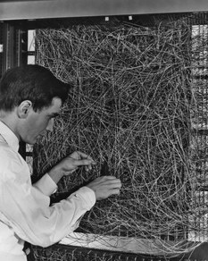
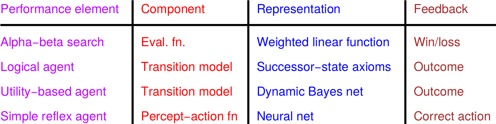
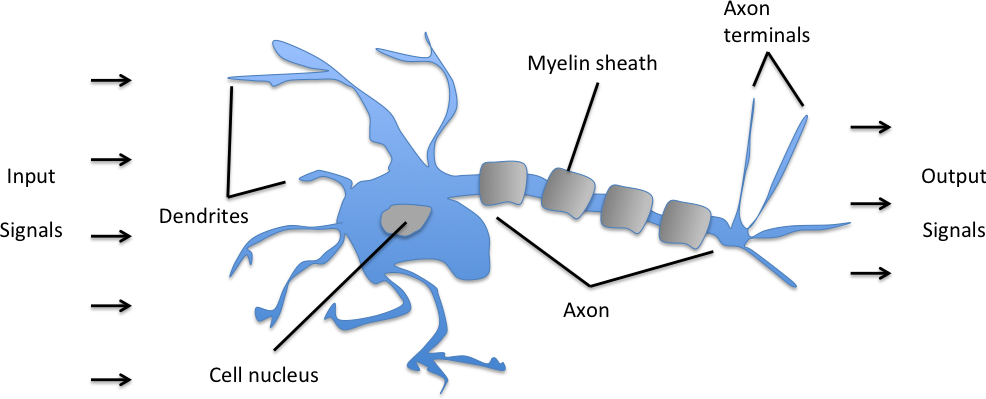
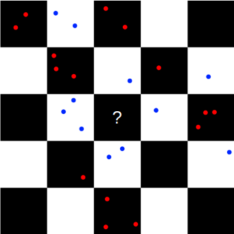
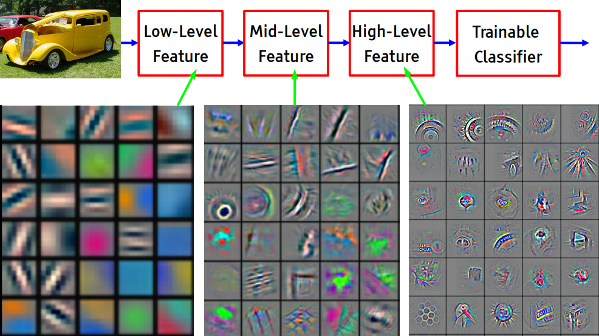
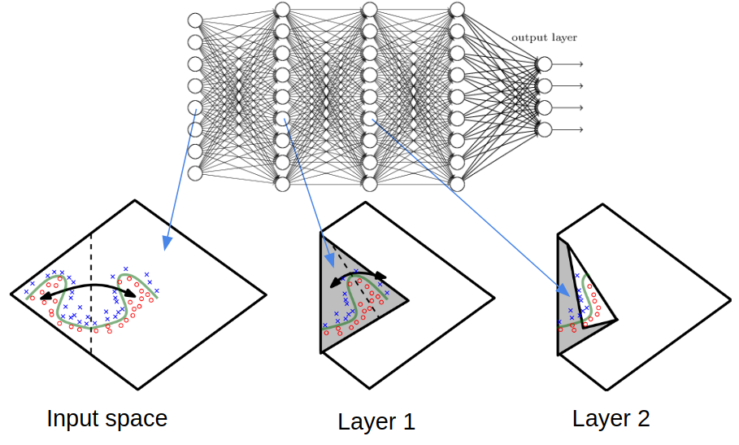

class: middle, center, title-slide

# Introduction to Artificial Intelligence

Lecture 8: Learning

---

# Today

.grid[
.col-2-3[
- *Learning*
- *Statistical learning*
- *Supervised learning*
- *Reinforcement learning*
- *Unsupervised learning*
]
.col-1-3[]
]

---

# Intelligence?

- What we covered so far...
    - Search algorithms, using a state space specified by domain knowledge.
    - Adversarial search, for known and fully observable games.
    - Constraint satisfaction problems, by exploiting a known structure of the states.
    - Logical inference, using well-specified facts and inference rules.
    - Reasoning about uncertain knowledge, as represented using domain-motivated probabilistic models.
- Enough to implement complex and rational behaviors, *in some situations*.
- But is that **intelligence**? Aren't we missing a critical component?

---

# Chomsky vs. Piaget

.grid[
.col-2-3[
- *Noam Chomsky* (innatism):
    - State that humans possess a genetically determined faculty for thought and language.
    - The structures of language and thought are set in motion through interaction with the environment.
- *Jean Piaget* (constructivism):
    - Deny the existence of innate cognitive structure specific for thought and language.
    - Postulate instead all cognitive acquisitions, including language, to be the outcome of a gradual process of construction, i.e., a learning procedure.
]
.col-1-3[]
]

[Q] What about AI? Should it be a pre-wired efficient machine? Or a machine that can learn and improve? or maybe a bit of both?

---

# The debate continues...

.center[
<iframe width="640" height="480" src="https://www.youtube.com/embed/aCCotxqxFsk?&loop=1&start=0" frameborder="0" volume="0" allowfullscreen></iframe>
]

---

# Learning

- What if the environment is *unknown*?
- **Learning** can be used as a system construction method.
    - i.e., expose the agent to reality rather trying to hardcode reality into the agent's program.
- Learning can be used as an *automated way* to modify the agent's decision mechanisms to improve performance.

---

# Learning agents

.center.width-100[]

???

- *Performance element*:
    - The current system for selecting actions.
- The *critic* observes the world and passes information to the *learning element*.
    - The learning element tries to modifies the performance element to avoid reproducing this situation in the future.
- The *problem generator* identifies certain areas of behavior in need of improvement and suggest experiments.

---

# Learning element

- The design of the **learning element** is dictated by:
    - What type of performance element is used.
    - Which functional component is to be learned.
    - How that functional component is represented.
    - What kind of feedback is available.
- Examples:    

.center.width-70[]
- The nature and frequency of the feedback often determines a learning strategy:
    - *Supervised learning*: correct answer for each instance.
    - *Reinforcement learning*: occasional rewards.
    - *Unsupervised learning*: no feedback!

---

class: middle, center,

# Statistical learning

---

# Learning probabilistic models

- Agents can handle uncertainty by using a **specified** probabilistic model of the world.
- This model may then be combined with decision theory to take actions.
- In lack of a good probabilistic model, what should an agent do?
- **Learn** it from experience with the world!

---

# Bayesian learning

- View **learning as Bayesian updating** of probability distribution over the *hypothesis space*.
    - $H$ is the hypothesis variable, values are $h\_1$, $h\_2$, ... and the prior is $P(H)$.
    - $\mathbf{d}$ is the observed data.
- Given the data so far, each hypothesis has a posterior probability $$P(h\_i|\mathbf{d}) = \alpha P(\mathbf{d}|h\_i) P(h\_i)$$ where $P(\mathbf{d}|h\_i)$ is called the *likelihood*.
- Predictions use a likelihood-weighted average over the hypotheses:
$$P(X|\mathbf{d}) = \sum\_i P(X|\mathbf{d}, h\_i) P(h\_i | \mathbf{d}) = \sum\_i P(X|h\_i) P(h\_i | \mathbf{d})$$
- No need to pick one best-guess hypothesis!

---

# Example

- Suppose there are five kinds of bags of candies. Assume a prior $P(H)$:
    - $P(h\_1)=0.1$, with $h\_1$: 100% cherry candies
    - $P(h\_2)=0.2$, with $h\_2$: 75% cherry candies + 25% lime candies
    - $P(h\_3)=0.4$, with $h\_3$: 50% cherry candies + 50% lime candies
    - $P(h\_4)=0.2$, with $h\_4$: 25% cherry candies + 75% lime candies
    - $P(h\_5)=0.1$, with $h\_5$: 100% lime candies

.center.width-70[]
- Then we observe candies drawn from som bag:

.center.width-40[]
- What kind of bag is it? What flavour will the next candy be?

---

# Posterior probability of hypotheses

.center.width-70[]

---

# Prediction probability

.center.width-70[]

- This example illustrates the fact that the Bayesian prediction *eventually agrees with the true hypothesis*.
- The posterior probability of any false hypothesis eventually vanishes.

---

# MAP approximation

- Summing over the hypothesis space is often *intractable*.
    - e.g., there are $2^{2^n}$ $n$-ary boolean functions of boolean inputs.
- **Maximum a posteriori** (MAP) learning:
$$h\_{MAP} = \arg \max\_{h\_i} P(h\_i | \mathbf{d})$$
- That is, maximize $P(\mathbf{d}|h\_i) P(h\_i)$ or $\log P(\mathbf{d}|h\_i) + \log P(h\_i)$.
    - Log terms can be be viewed as (negative of) *bits to encode data given hypothesis* + *bits to encode hypothesis*.
    - This is the basic idea of minimum description length learning, i.e., Occam's razor.
- Finding the MAP hypothesis is often much easier than Bayesian learning, since it requires solving an optimization problem instead of a large summation problem.
- For deterministic hypotheses, $P(\mathbf{d}|h\_i)=1$ if $h\_i$ is consistent, and $0$ otherwise.
    - Therefore, MAP yields the simplest consistent hypothesis.

---

# Maximum likelihood

- For large data sets, the prior $P(H)$ becomes irrelevant.
- **Maximum likelihood estimation** (MLE):
$$h\_{MLE} = \arg \max\_{h\_i} P(\mathbf{d} | h\_i)$$
- That is, simply get the best fit to the data.
    - Identical to MAP for uniform prior.
- MLE is the standard (non-Bayesian) statistical learning method.
    - Procedure:
        - Choose a parameterized family of models to describe the data.
            - requires substantial insight and sometimes new models.
        - Write down the likelihood of the data as a function of the parameters.
            - may require summing over hidden variables, i.e., inference.
        - Write down the derivative of the log likelihood w.r.t. each parameter.
        - Find the parameter values such that the derivatives are zero.
            - may be hard/impossible; modern optimization techniques help.

---

# Parameter learning BNs

.center.width-100[]

---

# MLE, case (a)

- Bag from a new manufacturer; fraction $\theta$ of cherry candies?
    - Any $\theta$ is possible: continuum of hypotheses $h\_\theta$.
    - $\theta$ is a **parameter** for this simple binomial family of models.
- Suppose we unwrap $N$ candies, and get $c$ cherries and $l=N-c$ limes.
- These are *i.i.d.* observations, so:
$$P(\mathbf{d}|h\_\theta) = \prod\_{j=1}^N P(d\_j | h\_\theta) = \theta^c (1-\theta)^l$$
- Maximize this w.r.t. $\theta$, which is easier for the *log-likelihood*:
    - $L(\mathbf{d}|h\_\theta) = \log P(\mathbf{d}|h\_\theta) = c \log \theta + l \log(1-\theta)$
    - $\frac{d L(\mathbf{d}|h\_\theta)}{d \theta} = \frac{c}{\theta} - \frac{l}{1-\theta}=0$, therefore $\theta=\frac{c}{N}$.
    - Seems *sensible*, but causes problems with $0$ counts!
---

# MLE, case (b)

- Red/green wrapper depends probabilistically on flavor.
- Likelihood for e.g. a cherry candy in green wrapper:
  
$P(F=cherry, W=green|h\_{\theta,\theta\_1, \theta\_2})$ 
$= P(F=cherry|h\_{\theta,\theta\_1, \theta\_2}) P(W=green|F=cherry, h\_{\theta,\theta\_1, \theta\_2})$ 
$= \theta (1-\theta\_1)$
- The likelihood for the data, given $N$ candies, $r\_c$ red-wrapped cherries, $g\_c$ green-wrapped cherries, etc. is:
  
$P(\mathbf{d}|h\_{\theta,\theta\_1, \theta\_2}) = \theta^c (1-\theta)^l \theta\_1^{r\_c}(1-\theta\_1)^{g\_c} \theta\_2^{r\_l} (1-\theta\_2)^{g\_l}$
  
$L = c \log \theta + l \log(1-\theta) $ 
$\,\,\,\,+ r\_c \log \theta\_1 + g\_c \log(1-\theta\_1)$ 
$\,\,\,\,+ r\_l \log \theta\_2 + g\_l \log(1-\theta\_2)$

---

# MLE, case (b), cont.

- Derivatives of $L$ contain only the relevant parameter:
    - $\frac{\partial L}{\partial \theta} = \frac{c}{\theta} - \frac{l}{1-\theta} = 0 \quad\Rightarrow\quad \theta = \frac{c}{c+l}$
    - $\frac{\partial L}{\partial \theta\_1} = \frac{r\_c}{\theta\_1} - \frac{g\_c}{1-\theta\_1} = 0 \quad\Rightarrow\quad \theta\_1 = \frac{r\_c}{r\_c + g\_c}$
    - $\frac{\partial L}{\partial \theta\_2} = \frac{r\_l}{\theta\_2} - \frac{g\_l}{1-\theta\_2} = 0 \quad\Rightarrow\quad \theta\_2 = \frac{r\_l}{r\_l + g\_l}$
- Again, results coincide with intuition.
- This can be extended to any Bayesian network with parameterized CPTs.
- Importantly, with *complete data*, maximum likelihood parameter learning for a Bayesian network **decomposes into separate learning problems**, one for each parameter.

---

# MLE for linear Gaussian models

.center.width-70[]

- Assume a **parameterized** *linear Gaussian model* with one continuous parent $X$ and one continuous child $Y$.
- To learn the conditional distribution $P(Y|X)$, we maximize
$$P(y|x) = \frac{1}{\sqrt{2\pi}\sigma} \exp(-\frac{(y-(\theta\_1 x + \theta\_2))^2}{2\sigma^2})$$
w.r.t. $\theta\_1$ and $\theta\_2$ over the data $\mathbf{d}$.

---

# MLE for linear Gaussian models

- Constraint the derivatives of the log-likelihood to 0 and simplify. We arrive to the problem of minimizing
$$\sum\_{j=1}^N (y\_j - (\theta\_1 x\_j + \theta\_2))^2$$
- That is, minimizing the sum of squared errors corresponds to MLE solution for a linear fit, *assuming Gaussian noise of fixed variance*.
- This is also known as **linear regression**.

[Q] Can you derive the equivalence?

---

# Recap

- Full Bayesian learning gives best possible predictions but is **intractable**.
- MAP learning *balances complexity with accuracy* on training data.
- Maximum likelihood is equivalent to *assuming a uniform prior*.

---

# Going further

- When some variables are hidden, local maximum likelihood solutions can be found using the **EM algorithm** or approximation methods such as **variational inference**.
- Learning the structure of Bayesian networks is also possible. This is an example of *model selection* and usually involves a discrete search in the space of structures.
- *Non-parametric* models represent a distribution using the collection of data points.
Thus, the number of parameters grows with the training set.

???

https://www.cs.cmu.edu/~tom/10-702/Zoubin-702.pdf

---

class: middle, center,

# Supervised learning

---

# Supervised learning

- Assume a **training set** $\mathbf{d}\_\text{train} \sim P(X,Y)$ of $N$ example input-output pairs
    $$\mathbf{d}\_\text{train} = \\\{ (\mathbf{x}\_1, y\_1), (\mathbf{x}\_2, y\_2), ..., (\mathbf{x}\_N, y\_N) \\\},$$
    where
    - $\mathbf{x}\_i$ are the input data;
    - $y_i$ was generated by an unknown function $y\_i=f(\mathbf{x}\_i)$.
- From this data, we wish to *learn* a function $h$ that approximates the true function $f$.
- Sometimes, $f$ is stochastic, i.e., $y$ is not strictly a function $x$, and we have to learn the conditional $P(Y|x)$.

---

# Generalization

- The function $h$ is a **hypothesis**.
- To measure the accuracy of a hypothesis, we evaluate its predictions on a *test set* $\mathbf{d}\_\text{test} \sim P(X,Y)$ that is independent of the training set.
- A hypothesis $h$ **generalizes** well if it correctly predicts the value of $y$ for novel examples
(resp., its conditional density).

.center.width-80[]

[Q] Which of those is best?

---

# Best model?

- Supervised learning can be done by choosing the hypothesis $h^\*$ that is most probable **on new data** $\mathbf{d}\_\text{test} \sim P(X,Y)$:
$$h^* = \arg \max\_{h \in \mathcal{H}} P(h|\mathbf{d}\_\text{test})$$
- By Bayes's rule, this is equivalent to
$$h^* = \arg \max\_{h \in \mathcal{H}} P(\mathbf{d}\_\text{test}|h)P(h)$$
where $P(\mathbf{d}\_\text{test}|h)$ = $\prod\_{(\mathbf{x}, y) \in \mathbf{d}\_\text{test}} P(y|x,h)$
- This is the same as:
    - Maximum a posteriori estimation.
    - Maximum likelihood estimation if $P(h)$ is uniform.
- **Issue**: in practice, we often only have a *finite* test set!

???

R: be clearer, we want to be good in generalization, not on one specific test set.

---

class: middle, center

What is $\mathcal{H}$?

How to find $h^\* \in \mathcal{H}$?

---

# Feature vectors

- Assume the input samples $\mathbf{x}\_i \in \mathbb{R}^p$ are described as real-valued vectors of $p$ *attribute* or *feature* values.
- If the data is not originally expressed as real-valued vectors, then it needs to be prepared and transformed to this format.

.center.width-60[]

[Q] Given this data representation, what family $\mathcal{H}$ of hypothesis shall we consider?

.footnote[Credits: UC Berkeley, [CS188](http://ai.berkeley.edu/lecture_slides.html)]

---

# Brains (simplified)

.center.width-80[]

- $10^{11}$ neurons of $>20$ types, $10^{14}$ synapses.
- Information are (*presumably*) stored in synapses.
- Signals are noisy spike trains of electrical potential.

.footnote[Credits: Sebastian Raschka, [Single-Layer Neural Networks and Gradient Descent](http://sebastianraschka.com/Articles/2015_singlelayer_neurons.html)]

---

# Linear classifiers (1)

.center.width-70[]

- Taking loose inspiration from neuroscience, we may consider an **overly** simplified *model* of neuron (McCulloch and Pitts, 1943).
- The linear classifier model is a squashed linear function of its inputs.

.footnote[Credits: Sebastian Raschka, [Single-Layer Neural Networks and Gradient Descent](http://sebastianraschka.com/Articles/2015_singlelayer_neurons.html)]

---

# Linear classifiers (2)

- Assume $Y$ takes binary values in $\\\{-1,1\\\}$.
- The linear classifier model is a squashed linear function of its inputs:
$$h(\mathbf{x}; \mathbf{w}) = sign(w\_0 + \sum\_{j=1}^p w\_j x\_j)$$
    - Inputs are *feature values* $x\_j$;
    - Each feature has a *weight* $w\_j$;
    - $w\_0$ is the *intercept*;
    - Feature and weight values are *linearly combined* as $w\_0 + \sum w\_j x\_j$
        - Assuming a constant dummy input feature $x\_0=1$, we write $\mathbf{w}^T\mathbf{x}$;
    - This sum is squashed through an *activation function*. E.g.,
        - if positive, output $+1$,
        - if negative, output $-1$.

---

# Binary decision rules

.center.width-30[]

- Intuitively, predictions are computed by comparing the feature vector $\mathbf{x}$ to the weight vector $\mathbf{w}$.
- Learning boils down to figuring out a good weight vector from the training set.
- The family $\mathcal{H}$ of hypothesis is induced from the set of possible parameters values $\mathbf{w}$, that is $\mathbb{R}^{p+1}$.

[Q] $\mathcal{H}$ is huge! How do we find a good hypothesis?

???

The dot product tells you what amount of one vector goes in the direction of another.

---

# Learning: Binary perceptron

.grid[
.col-1-2[
- Start with $\mathbf{w}=0$.
- For each training example:
    - Classify with current $\mathbf{w}$.
    - If the prediction is correct, then do nothing.
    - If the prediction is incorrect, then update parameters.

]
.col-1-2[]
]

.footnote[Credits: UC Berkeley, [CS188](http://ai.berkeley.edu/lecture_slides.html)]

---

# Learning: Binary perceptron

.center.width-30[]

- Start with $\mathbf{w}=0$.
- For each training example $(\mathbf{x},y)$:
    - Classify with current weights: $\hat{y} = sign(\mathbf{w}^T \mathbf{x})$
    - If $y=\hat{y}$, do nothing.
    - Otherwise, update parameters: $\mathbf{w} = \mathbf{w} + y\mathbf{x}$

---

# Multiclass perceptron

.center.width-30[]

- If we have more than $2$ classes, then
    - Define a weight vector $\mathbf{w}\_c$ for each class $c$.
    - The activation for class $c$ is $\mathbf{w}\_c^T \mathbf{x}$.
- Learning:
    - Start with $\mathbf{w}\_c=0$ for all $c$.
    For each training example $(\mathbf{x},y)$:
        - Classify with current weights: $\hat{y} = \arg \max\_{c}\, \mathbf{w}\_c^T \mathbf{x}$
        - If $y=\hat{y}$, do nothing.
        - Otherwise, update parameters:
            - $\mathbf{w}\_y = \mathbf{w}\_y + \mathbf{x}$ (raise score of right answer)
            - $\mathbf{w}\_{\hat{y}} = \mathbf{w}\_{\hat{y}} - \mathbf{x}$ (lower score of wrong answer).

---

# Multiclass perceptron

.center[
<video controls preload="auto" height="400" width="640">
  <source src="./figures/lec8/multiclass-perceptron.mp4" type="video/mp4">
</video>]

.footnote[Credits: UC Berkeley, [CS188](http://ai.berkeley.edu/lecture_slides.html)]

---

# Properties of the perceptron

.center.width-60[]
.caption[Separable vs. Non-separable]

- (Novikoff, 1962): If the training set is *linearly separable*, the perceptron will
eventually **converge** (binary case).
- Assume the training set is *linearly separable*. Let $S$ be a sequence of labeled examples consistent with a linear threshold function ${\mathbf{w}^\*}^T \mathbf{x}$, where $\mathbf{w}^\*$ is a unit-length vector. The number of mistakes $M$ on $S$ made by the Perceptron is at most $\frac{1}{\gamma^2}$, where $\gamma$ is the $L\_2$ *margin* of ${\mathbf{w}^\*}$ on $S$:
    $$\gamma = \min\_{\mathbf{x} \in S} \frac{|{\mathbf{w}^\*}^T \mathbf{x}|}{||\mathbf{x}||}.$$

---

# Pacman apprenticeship

.center.width-60[]

- Examples are state-action pairs $(s, a)$ that we collect by observing an expert playing.
- Features are defined over states, e.g. $g(s)$.
- We want to learn the actions that the expert would take in a given situation.
    - i.e., learn the mapping $a=f(g(s))$.
- This is a multiclass classification problem.

.footnote[Credits: UC Berkeley, [CS188](http://ai.berkeley.edu/lecture_slides.html)]

---

# Training (1)

.center[
<video controls preload="auto" height="400" width="640">
  <source src="./figures/lec8/training1.mp4" type="video/mp4">
</video>]

The Perceptron agent observes a very good Minimax-based agent for two games and updates its weight vectors as data are collected.

.footnote[Credits: UC Berkeley, [CS188](http://ai.berkeley.edu/lecture_slides.html)]

---

# Training (2)

.center[
<video controls preload="auto" height="400" width="640">
  <source src="./figures/lec8/training2.mp4" type="video/mp4">
</video>]

.footnote[Credits: UC Berkeley, [CS188](http://ai.berkeley.edu/lecture_slides.html)]

---

# Apprentice

.center[
<video controls preload="auto" height="400" width="640">
  <source src="./figures/lec8/apprentice.mp4" type="video/mp4">
</video>]

After two training episodes, the Perceptron agents plays. No more Minimax!

.footnote[Credits: UC Berkeley, [CS188](http://ai.berkeley.edu/lecture_slides.html)]

---

# Checkerboard problem

.center.width-30[]

- We want to learn a binary classifier to determine the color (blue or red) of a point given its position.
- Based only on *local generalization*, we can correctly guess the color of a new point if it lies within the same square as a training example.
- **No guarantee** that the learned hypothesis correctly extends the checkerboard pattern in squares that do not contain training examples.
- In general, to distinguish $O(k)$ regions, traditional supervised learning methods require $O(k)$ examples.

???

R: improve the flow a bit, the motivation (this and the next slides)

---

# Compositional assumption

**Hypothesis**: The data was generated by a composition of factors, potentially at multiple levels in a hierarchy.

.center.width-100[]

---

# Multi-layer perceptron

.center.width-100[]

- The **multi-layer perceptron** (MLP) is a hierarchical *composition* of individual perceptron-like models, called *neurons*. The MLP is an example of **neural network**.
- The network parameters are the union of the individual neuron parameters.
- Parameters are learned efficiently using stochastic gradient descent.

---

# Deep Learning

.center.width-70[]

- Effectively, training a *deep neural network* amounts to learn the parameters of a hierarchical representation of the data, tailored for the target task.
- The high-level features are not-preprogrammed! *Concepts* are learned by the network itself.

.footnote[Credits: Yann Lecun (NYU), [Deep Learning, 2017](https://cilvr.nyu.edu/doku.php?id=deeplearning2017:schedule)]

---

# Expressiveness

.center.width-70[]

- The compositional assumption used in deep learning allows **exponential gains** in the number of required training examples.
- $O(2^k)$ regions can be defined from $O(k)$ examples, as long as one introduces dependencies between disconnected regions.

---

# Applications

Deep learning is now at the core of many *state-of-the-art systems*, including:
- Image recognition
- Speech recognition
- Natural language processing
- Scientific studies
- Autonomous agents

---

class: middle, center

# Reinforcement learning

---

# Reinforcement learning

- Supervised learning can be used to learn functions or probabilistic models, **provided the (large) availability of training data**.
- Reinforcement learning (RL) is learning *what to do* in the absence of labeled examples of what to do.
- Instead of labeled examples, an agent may perceive *sparse* feedback, called **rewards**, indicating whether or not the consequences of its actions were good.
- In addition, the agent does not know:
    - how the world works;
    - how rewards are computed.
- RL might be considered to encompass all of AI: an agent is placed in an unknown environment and must learn to behave successfully therein.

---

# Playing Pinball

.center[
<iframe width="640" height="480" src="https://www.youtube.com/embed/l5o429V1bbU?&loop=1&start=0" frameborder="0" volume="0" allowfullscreen></iframe>
]

---

# Playing Seaquest

.center[
<iframe width="640" height="480" src="https://www.youtube.com/embed/5WXVJ1A0k6Q?&loop=1&start=0" frameborder="0" volume="0" allowfullscreen></iframe>
]

---

# Playing Enduro

.center[
<iframe width="640" height="480" src="https://www.youtube.com/embed/6kO4eZWeKOM?&loop=1&start=0" frameborder="0" volume="0" allowfullscreen></iframe>
]

[Q] What about the real world, for which there is no simulator?

---

class: middle, center

# Unsupervised learning

---

# Unsupervised learning

- Most of the learning performed by animals and humans is **unsupervised**.
    - Without labeled examples nor rewards.
- We learn how the world works by observing it:
    - We learn that the world is 3-dimensional.
    - We learn that objects can move independently of each other.
    - We learn *object permanence*.
    - We learn to predict what the world will look one second or one hour from now.
- We build a model of the world through *predictive unsupervised learning*.
    - This predictive model gives us **common sense**.
    - Unsupervised learning discovers regularities in the world.

.center.width-30[]

.footnote[Credits: Yann Lecun (NYU), [Deep Learning, 2017](https://cilvr.nyu.edu/doku.php?id=deeplearning2017:schedule)]

---

# Common sense

- Learning a predictive model of the world gives us *common sense*.
- If I say: "Bernard picks up his bag and leaves the room".
- You can **infer**:
    - Bernard stood up, extended his arm to pick the bag, walked towards the door, opened the door, walked out.
    - He and his bag are not in the room anymore.
    - He probably did not dematerialized or flied out.

.center.width-50[]

.footnote[Credits: Yann Lecun (NYU), [Deep Learning, 2017](https://cilvr.nyu.edu/doku.php?id=deeplearning2017:schedule)]

---

# How do we do that?

We have no clue! (mostly)

---

# Summary

- *Learning* is a key element of intelligence.
- **Statistical learning** aims at learning probabilistic models (their parameters or structures) automatically from data.
- **Supervised learning** is used to learn functions from a set of training examples.
    - Linear models are simple predictive models, effective on some tasks but usually insufficiently expressive.
    - Neural networks are composition of squashed linear models.
    - *Deep learning* = learning hierarchical representations.
- Reinforcement learning = learning to behave in an unknown environment from sparse rewards.
- Unsupervised learning = learning a model of the world by observing it.

---

# Going further?

We *barely scratched* the surface today...

- ELEN0062: Introduction to Machine Learning
- INFO8004: Advanced Machine Learning  (Spring 2018)
- INFO8003: Optimal decision making for complex problems (Spring 2018)
- INFOXXXX: Deep Learning (Spring 2019)
