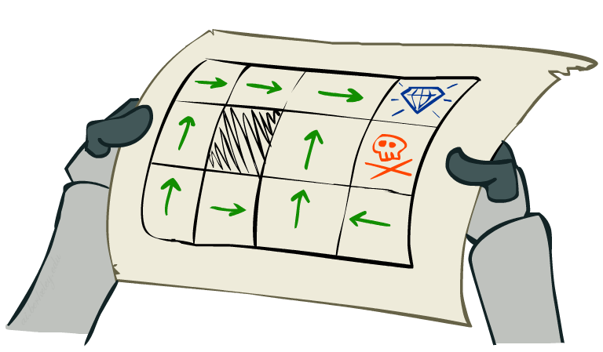

class: middle, center, title-slide

# Introduction to Artificial Intelligence

Lecture 8: Making decisions

  
Prof. Gilles Louppe 
[g.louppe@uliege.be](g.louppe@uliege.be)

???

https://courses.cs.washington.edu/courses/cse473/14sp/slides/8-MDPs.pdf

R: add demos
R: finish with bandits?
R: pomdp -> lec 20 of bair

---

# Today

.center.width-50[]

Reason under uncertainty and **take decisions**:
- Markov decision processes
    - MDPs
    - Bellman equation
    - Value iteration
    - Policy iteration
- Partially observable Markov decision processes

.footnote[Image credits: [CS188](http://ai.berkeley.edu/lecture_slides.html), UC Berkeley.]

---

class: middle

.grid[
.kol-1-5[]
.kol-3-5[.center.width-90[]]
.kol-1-5[]
]

---

# Grid world

.grid[
.kol-2-3[
Assume our agent lives in $4 \times 3$ grid environment.
- Noisy movements: actions do not always go as planned.
    - Each action achieves the intended effect with probability $0.8$.
    - The rest of the time, with probability $0.2$, the action moves the agent at right angles to the intented direction.
    - If there is a wall in the direction the agent would have been taken, the agent stays put.
- The agent receives rewards at each time step.
    - Small 'living' reward each step (can be negative).
    - Big rewards come at the end (good or bad).

Goal: maximize sum of rewards.
]
.kol-1-3[     .width-100[]]
]

.footnote[Image credits: [CS188](http://ai.berkeley.edu/lecture_slides.html), UC Berkeley.]

---

class: middle

.grid.center[
.kol-1-4.center[
Deterministic actions

.width-100[]
]
.kol-3-4.center[
Stochastic actions  

.width-90[]
]
]

.footnote[Image credits: [CS188](http://ai.berkeley.edu/lecture_slides.html), UC Berkeley.]

---

class: middle

# Markov decision processes

---

# Markov decision processes

A **Markov decision process** (MDP) is a 5-tuple $(\mathcal{S}, \mathcal{A}, P, R, \gamma)$ such that:
- $\mathcal{S}$ is a set of states $s$;
- $\mathcal{A}$ is a set of actions $a$;
- $P$ is a transition model such that  $P(s'|s,a)$ denotes the probability of reaching state $s'$ if action $a$ is done in state $s$;
- $R$ is reward function that maps immediate (finite) reward values $R(s)$ obtained in states $s$;
- $0 < \gamma \leq 1$ is a discount factor, which represents the difference in importance between future and present rewards.

---

class: middle

.grid[
.kol-1-5.center[
    
$$s\_{t+1}$$
$$r\_{t+1} = R(s\_{t+1})$$
]
.kol-3-5.center[
$$s\_t$$
.width-90[]
$$s\_{t+1} \sim P(s\_{t+1}|s\_t,a\_t)$$
]
.kol-1-5[
     
$$a\_t$$
]
]

---

class: middle

.grid.center[
.kol-1-2[.center.width-70[]]
.kol-1-2[.center.width-70[]]
]
 

## Example

- $s \in \mathcal{S}$: locations $(i,j)$ on the grid.
- $a \in \mathcal{A}$: $[\text{Up}, \text{Down}, \text{Right}, \text{Left}]$.
- Transition model: $P(s'|s,a)$
- Reward:
$$
R(s) = \begin{cases}
-0.03 & \text{for non-terminal states} \\\\
\pm 1  & \text{for terminal states}
\end{cases}
$$
- $\gamma = 0.9$.

.footnote[Image credits: [CS188](http://ai.berkeley.edu/lecture_slides.html), UC Berkeley.]

---

class: middle

.grid[
.kol-3-4[
## What is Markovian about MDPs?

Given the present state, the future and the past are independent:
$$P(S\_{t+1} | S\_t, A\_t, S\_{t-1}, A\_{t-1}, ..., S\_0) = P(S\_{t+1} | S\_t, A\_t)$$
This is similar to search problems, where the successor function could only depend on the current state.
]
.kol-1-4.center[.circle.width-100[]
.caption[Andrey Markov]]
]

---

# Policies

.grid[
.kol-2-3[
- In deterministic single-agent search problems, our goal was to find an optimal plan, or *sequence* of actions, from start to goal.
- For MDPs, we want to find an optimal **policy** $\pi^* : \mathcal{S} \to \mathcal{A}$.
    - A policy $\pi$ maps actions to states.
    - An optimal policy is one that maximizes the expected utility, e.g. the expected sum of rewards.
    - An explicit policy defines a reflex agent.
- Expectiminimax did not compute entire policies, but only some action for a single state.

]
.kol-1-3[
 
.width-100[]
.center[Optimal policy when $R(s)=-0.03$ for all non-terminal states $s$.]
]
]

.footnote[Image credits: [CS188](http://ai.berkeley.edu/lecture_slides.html), UC Berkeley.]

---

class: middle

.width-90.center[]

(a) Optimal policy when $R(s)=-0.04$ for all non-terminal states $s$.
(b) Optimal policies for four different ranges of $R(s)$.

Depending on $R(s)$, the **balance between risk and reward** changes from risk-taking to very conservative.

???

Discuss the balance between risk and rewards.

---

# Utilities over time

.center.width-70[]

What preferences should an agent have over state or reward sequences?
- More or less? $[1, 2, 2]$ or $[2,3,4]$?
- Now or later? $[0,0,1]$ or $[1,0,0]$?

.footnote[Image credits: [CS188](http://ai.berkeley.edu/lecture_slides.html), UC Berkeley.]

---

class: middle

## Theorem

If we assume **stationary** preferences over reward sequences, i.e. such that
$$[r\_0, r\_1, r\_2, ...] \succ [r\_0, r\_1', r\_2', ...] \Leftrightarrow [r\_1, r\_2, ...] \succ [r\_1', r\_2', ...],$$
then there are only two coherent ways to assign utilities to sequences:

.grid[
.kol-1-3.center[
Additive utility:

Discounted utility: 
($0<\gamma<1$)
]
.kol-2-3[
$V([r\_0, r\_1, r\_2, ...]) = r\_0 + r\_1 + r\_2 + ...$

$V([r\_0, r\_1, r\_2, ...]) = r\_0 + \gamma r\_1 + \gamma^2 r\_2r + ...$
]
]

---

class: middle

.grid[
.kol-1-2[

## Discounting

- Each we time we transition to the next state, we multiply in the discount once.
- Why discount?
    - Sooner rewards probably do have higher utility than later rewards.
    - Will help our algorithms converge.
]
.kol-1-2[.width-100[]]
]

Example: discount $\gamma=0.5$ 
- $V([1,2,3]) = 1 + 0.5\times 2 + 0.25 \times 3$ 
- $V([1,2,3]) < V([3,2,1])$

.footnote[Image credits: [CS188](http://ai.berkeley.edu/lecture_slides.html), UC Berkeley.]

---

class: middle

## Infinite sequences

What if the agent lives forever? Do we get infinite rewards? Comparing reward sequences with $+\infty$ utility becomes undefined.

Solutions:
- Finite horizon: (similar to depth-limited search)
    - Terminate episodes after a fixed number of steps $T$.
    - Results in non-stationary policies ($\pi$ depends on time left).
- Discounting (with $0 < \gamma < 1$):
    $$V([r\_0, r\_1, ..., r\_\infty]) = \sum\_{t=0}^{\infty} \gamma^t r\_t \leq \frac{R\_{max}}{1-\gamma}$$
  Smaller $\gamma$ results in a shorter horizon.
- Absorbing state: guarantee that for every policy, a terminal state will eventually be reached.

---

# Optimal policies

The expected utility obtained by executing $\pi$ starting in $s$ is given by
$$V^\pi(s) = \mathbb{E}\left[\sum\_{t=0}^\infty \gamma^t R(s\_t) \right],$$
where the expectation is with respect to the probability distribution over state sequences determined by $s$ and $\pi$.

Among all policies the agent could execute, the **optimal policy** is the policy $\pi\_s^\*$ that maximizes the expected utility:
$$\pi\_s^\* = \arg \max\_\pi V^\pi(s)$$

Because of discounted utilities, the optimal policy is *independent* of the starting state $s$. Therefore we simply write $\pi^\*$.

---

# Utilities of states

The utility (or value) $V(s)$ of a state is now simply defined as $V^{\pi^\*}(s)$.
- That is, the expected (discounted) reward if the agent executes an optimal policy starting from $s$.
- Notice that $R(s)$ and $V(s)$ are quite different quantities:
    - $R(s)$ is the short term reward for having reached $s$.
    - $V(s)$ is the long term total reward from $s$ onward.

---

class: middle

.center.width-50[]

Utilities of the states in Grid World, calculated with $\gamma=1$ and $R(s)=-0.04$ for non-terminal states.

---

class: middle

.center.width-30[]

Using the principle of maximum expected utility (MEU), the optimal action maximizes the expected utility of the subsequent state.

That is,
$$\pi^\*(s) = \arg \max\_{a} \sum\_{s'} P(s'|s,a) V(s').$$

Therefore, we can derive optimal policies if we can estimate the utilities of states.

.footnote[Image credits: [CS188](http://ai.berkeley.edu/lecture_slides.html), UC Berkeley.]

---

# Bellman equation

There is a direct relationship between the utility of a state and the utility of its neighbors:

The utility of a state is the immediate reward for that state, plus the expected discounted utility of the next state, assuming that the agent chooses the optimal action.

That is,
$$V(s) = R(s) + \gamma  \max\_{a} \sum\_{s'} P(s'|s,a) V(s').$$
- These equations are called the **Bellman equations**. They form a system of $n=|\mathcal{S}|$ non-linear equations with as many unknowns.
- The utilities of states, defined as the expected utility of subsequent state sequences, are solutions of the set of Bellman equations. In fact, they are *unique* solutions.

---

class: middle

.center.width-90[]

.footnote[Image credits: [CS188](http://ai.berkeley.edu/lecture_slides.html), UC Berkeley.]

---

class: middle

## Example

$$
\begin{aligned}
V(1,1) = -0.04 + \gamma \max  [& 0.8 V(1,2) + 0.1 V(2,1) + 0.1 V(1,1), \\\\
    & 0.9 V(1,1) + 0.1 V(1,2), \\\\
    & 0.9 V(1,1) + 0.1 V(2,1), \\\\
    & 0.8 V(2,1) + 0.1 V(1,2) + 0.1 V(1,1)]
\end{aligned}
$$

---

# Value iteration

Because of the $\max$ operator, the Bellman equations are non-linear and the resolution of the system is problematic.

The **value iteration** algorithm provides an fixed-point iteration procedure for computing the state values $V(s)$:
- Let $V\_i(s)$ be the utility value for $s$ at the $i$-th iteration step.
- The **Bellman update** consists in updating simultaneously all the states to make them *locally consistent* with the Bellman equation:
$$V\_{i+1}(s) = R(s) + \gamma \max\_a \sum\_{s'} P(s'|s,a) V\_i(s') $$
- Repeat until convergence.

---

class: middle

.center.width-100[]

---

class: middle

## Convergence

xxx

---

# Policy iteration

xxx

---

class: middle

.center.width-100[]

---

class: middle

# Partially observable Markov decision processes

---

# POMPDs

---

# Belief MDP

---

class: middle

.grid[
.kol-1-5.center[
    
$$e\_{t+1}$$

$$r\_{t+1} = R(s\_{t+1})$$
]
.kol-3-5.center[
$$b\_t(s) = P(s\_t | a\_{1:t-1}, e\_{1:t})$$
.width-90[]
$$s\_{t+1} \sim P(s\_{t+1}|s\_t,a\_t)$$
$$e\_{t+1} \sim P(e\_{t+1} | s\_{t+1})$$
]
.kol-1-5[
     
$$a\_t$$
]
]

---

# Value iteration

inefficient

---

# Online agents

expectiminimax solution

---

see bair 10

connection with learning and RL

bandits example?

---

# Summary

---

class: end-slide, center
count: false

The end.

---

# References
