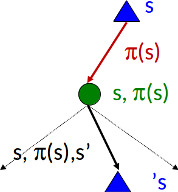
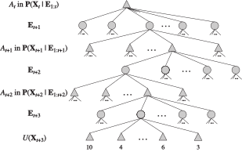

class: middle, center, title-slide

# Introduction to Artificial Intelligence

Lecture 8: Making decisions

  
Prof. Gilles Louppe 
[g.louppe@uliege.be](mailto:g.louppe@uliege.be)

???

R: prepare one code example
R: prepare handwritten developments

---

# Today

.center.width-50[]

Reasoning under uncertainty and **taking decisions**:
- Markov decision processes
    - MDPs
    - Bellman equation
    - Value iteration
    - Policy iteration
- Partially observable Markov decision processes

.footnote[Image credits: [CS188](https://inst.eecs.berkeley.edu/~cs188/), UC Berkeley.]

---

# Grid world

.grid[
.kol-2-3[
Assume our agent lives in a $4 \times 3$ grid environment.
- Noisy movements: actions do not always go as planned.
    - Each action achieves the intended effect with probability $0.8$.
    - The rest of the time, with probability $0.2$, the action moves the agent at right angles to the intented direction.
    - If there is a wall in the direction the agent would have been taken, the agent stays put.
- The agent receives rewards at each time step.
    - Small 'living' reward each step (can be negative).
    - Big rewards come at the end (good or bad).

Goal: maximize sum of rewards.
]
.kol-1-3[     .width-100[]]
]

.footnote[Image credits: [CS188](https://inst.eecs.berkeley.edu/~cs188/), UC Berkeley.]

---

class: middle

.grid.center[
.kol-1-4.center[
Deterministic actions

.width-100[]
]
.kol-3-4.center[
Stochastic actions  

.width-90[]
]
]

.footnote[Image credits: [CS188](https://inst.eecs.berkeley.edu/~cs188/), UC Berkeley.]

---

class: middle

# Markov decision processes

---

# Markov decision processes

A **Markov decision process** (MDP) is a tuple $(\mathcal{S}, \mathcal{A}, P, R)$ such that:
- $\mathcal{S}$ is a set of states $s$;
- $\mathcal{A}$ is a set of actions $a$;
- $P$ is a (stationary) transition model such that  $P(s'|s,a)$ denotes the probability of reaching state $s'$ if action $a$ is done in state $s$;
- $R$ is a reward function that maps immediate (finite) reward values $R(s)$ obtained in states $s$.

---

class: middle

.grid[
.kol-1-5.center[
    
$$s'$$
$$r' = R(s')$$
]
.kol-3-5.center[
$$s$$
.width-90[]
$$s' \sim P(s'|s,a)$$
]
.kol-1-5[
     
$$a$$
]
]

---

class: middle

.grid.center[
.kol-1-2[.center.width-70[]]
.kol-1-2[.center.width-70[]]
]
 

## Example

- $\mathcal{S}$: locations $(i,j)$ on the grid.
- $\mathcal{A}$: $[\text{Up}, \text{Down}, \text{Right}, \text{Left}]$.
- Transition model: $P(s'|s,a)$
- Reward:
$$
R(s) = \begin{cases}
-0.3 & \text{for non-terminal states} \\\\
\pm 1  & \text{for terminal states}
\end{cases}
$$

.footnote[Image credits: [CS188](https://inst.eecs.berkeley.edu/~cs188/), UC Berkeley.]

---

class: middle

.grid[
.kol-3-4[
## What is Markovian about MDPs?

Given the present state, the future and the past are independent:
$$P(s\_{t+1} | s\_t, a\_t, s\_{t-1}, a\_{t-1}, ..., s\_0) = P(s\_{t+1} | s\_t, a\_t)$$
This is similar to search problems, where the successor function could only depend on the current state.
]
.kol-1-4.center[.circle.width-100[]
.caption[Andrey Markov]]
]

---

# Policies

.grid[
.kol-2-3[
- In deterministic single-agent search problems, our goal was to find an optimal plan, or *sequence* of actions, from start to goal.
- For MDPs, we want to find an optimal **policy** $\pi^* : \mathcal{S} \to \mathcal{A}$.
    - A policy $\pi$ maps states to actions.
    - An optimal policy is one that maximizes the expected utility, e.g. the expected sum of rewards.
    - An explicit policy defines a reflex agent.
- Expectiminimax did not compute entire policies, but only some action for a single state.

]
.kol-1-3[
 
.width-100[]
.center[Optimal policy when $R(s)=-0.3$ for all non-terminal states $s$.]
]
]

.footnote[Image credits: [CS188](https://inst.eecs.berkeley.edu/~cs188/), UC Berkeley.]

---

class: middle

.width-90.center[]

(a) Optimal policy when $R(s)=-0.04$ for all non-terminal states $s$.
(b) Optimal policies for four different ranges of $R(s)$.

Depending on $R(s)$, the **balance between risk and reward** changes from risk-taking to very conservative.

???

Discuss the balance between risk and rewards.

---

# Utilities over time

.center.width-70[]

What preferences should an agent have over state or reward sequences?
- More or less? $[2,3,4]$ or $[1, 2, 2]$?
- Now or later? $[1,0,0]$ or $[0,0,1]$?

.footnote[Image credits: [CS188](https://inst.eecs.berkeley.edu/~cs188/), UC Berkeley.]

---

class: middle

## Theorem

If we assume **stationary** preferences over reward sequences, i.e. such that
$$[r\_0, r\_1, r\_2, ...] \succ [r\_0, r\_1', r\_2', ...] \Rightarrow [r\_1, r\_2, ...] \succ [r\_1', r\_2', ...],$$
then there are only two coherent ways to assign utilities to sequences:

.grid[
.kol-1-3.center[
Additive utility:

Discounted utility: 
($0<\gamma<1$)
]
.kol-2-3[
$V([r\_0, r\_1, r\_2, ...]) = r\_0 + r\_1 + r\_2 + ...$

$V([r\_0, r\_1, r\_2, ...]) = r\_0 + \gamma r\_1 + \gamma^2 r\_2r + ...$
]
]

???

Explain what coherent means.

---

class: middle

.grid[
.kol-1-2[

## Discounting

- Each time we transition to the next state, we multiply in the discount once.
- Why discount?
    - Sooner rewards probably do have higher utility than later rewards.
    - Will help our algorithms converge.
]
.kol-1-2[.width-100[]]
]

Example: discount $\gamma=0.5$ 
- $V([1,2,3]) = 1 + 0.5\times 2 + 0.25 \times 3$ 
- $V([1,2,3]) < V([3,2,1])$

.footnote[Image credits: [CS188](https://inst.eecs.berkeley.edu/~cs188/), UC Berkeley.]

---

class: middle

## Infinite sequences

What if the agent lives forever? Do we get infinite rewards? Comparing reward sequences with $+\infty$ utility is problematic.

Solutions:
- Finite horizon: (similar to depth-limited search)
    - Terminate episodes after a fixed number of steps $T$.
    - Results in non-stationary policies ($\pi$ depends on time left).
- Discounting (with $0 < \gamma < 1$ and rewards bounded by $\pm R\_\text{max}$):
    $$V([r\_0, r\_1, ..., r\_\infty]) = \sum\_{t=0}^{\infty} \gamma^t r\_t \leq \frac{R\_\text{max}}{1-\gamma}$$
  Smaller $\gamma$ results in a shorter horizon.
- Absorbing state: guarantee that for every policy, a terminal state will eventually be reached.

---

class: middle

.center.width-25[]

## Policy evaluation

The expected utility obtained by executing $\pi$ starting in $s$ is given by
$$V^\pi(s) = \mathbb{E}\left[\sum\_{t=0}^\infty \gamma^t R(s\_t) \right]\Biggr\rvert\_{s\_0=s}$$
where the expectation is with respect to the probability distribution over state sequences determined by $s$ and $\pi$.

.footnote[Image credits: [CS188](https://inst.eecs.berkeley.edu/~cs188/), UC Berkeley.]

---

class: middle

## Optimal policies

Among all policies the agent could execute, the **optimal policy** is the policy $\pi\_s^\*$ that maximizes the expected utility:
$$\pi\_s^\* = \arg \max\_\pi V^\pi(s)$$

Because of discounted utilities, the optimal policy is *independent* of the starting state $s$. Therefore we simply write $\pi^\*$.

---

# Values of states

The utility, or value, $V(s)$ of a state is now simply defined as $V^{\pi^\*}(s)$.
- That is, the expected (discounted) reward if the agent executes an optimal policy starting from $s$.
- Notice that $R(s)$ and $V(s)$ are quite different quantities:
    - $R(s)$ is the short term reward for having reached $s$.
    - $V(s)$ is the long term total reward from $s$ onward.

---

class: middle

.center.width-50[]

Utilities of the states in Grid World, calculated with $\gamma=1$ and $R(s)=-0.04$ for non-terminal states.

---

class: middle

.center.width-40[]

## Policy extraction

Using the principle of maximum expected utility, the optimal action maximizes the expected utility of the subsequent state.
That is,
$$\pi^\*(s) = \arg \max\_{a} \sum\_{s'} P(s'|s,a) V(s').$$

Therefore, we can extract the optimal policy provided we can estimate the utilities of states.

.footnote[Image credits: [CS188](https://inst.eecs.berkeley.edu/~cs188/), UC Berkeley.]

???

Point out the circularity of the argument!

---

class: middle

$$\pi^\*(s) = \arg \max\_{a} \sum\_{s'} P(s'|s,a) V(s')$$

.center.width-90[]

.footnote[Image credits: [CS188](https://inst.eecs.berkeley.edu/~cs188/), UC Berkeley.]

---

# The Bellman equation

The utility of a state is the immediate reward for that state, plus the expected discounted utility of the next state, assuming that the agent chooses the optimal action:
$$V(s) = R(s) + \gamma  \max\_{a} \sum\_{s'} P(s'|s,a) V(s').$$
- These equations are called the **Bellman equations**. They form a system of $n=|\mathcal{S}|$ non-linear equations with as many unknowns.
- The utilities of states, defined as the expected utility of subsequent state sequences, are solutions of the set of Bellman equations.

???

There is a direct relationship between the utility of a state and the utility of its neighbors.

The Bellman equation combines the expected utility (slide 16) with the policy extraction equation (slide 20).

---

class: middle

## Example

$$
\begin{aligned}
V(1,1) = -0.04 + \gamma \max  [& 0.8 V(1,2) + 0.1 V(2,1) + 0.1 V(1,1), \\\\
    & 0.9 V(1,1) + 0.1 V(1,2), \\\\
    & 0.9 V(1,1) + 0.1 V(2,1), \\\\
    & 0.8 V(2,1) + 0.1 V(1,2) + 0.1 V(1,1)]
\end{aligned}
$$

---

# Value iteration

Because of the $\max$ operator, the Bellman equations are non-linear and solving the system is problematic.

The **value iteration** algorithm provides a fixed-point iteration procedure for computing the state utilities $V(s)$:
- Let $V\_i(s)$ be the estimated utility value for $s$ at the $i$-th iteration step.
- The **Bellman update** consists in updating simultaneously all the estimates to make them *locally consistent* with the Bellman equation:
$$V\_{i+1}(s) = R(s) + \gamma \max\_a \sum\_{s'} P(s'|s,a) V\_i(s') $$
- Repeat until convergence.

---

class: middle

.center.width-100[]

???

The stopping criterion is based on the fact that if the update is small, then the error is also small. That is, if
$$||V\_{i+1} - V\_i|| < \epsilon (1-\gamma)/\gamma$$
then $$||V\_{i+1}-V||<\epsilon$$

---

class: middle

## Convergence

Let $V\_i$ and $V\_{i+1}$ be successive approximations to the true utility $V$.

.bold[Theorem.] For any two approximations $V\_i$ and $V'\_i$,
$$||V\_{i+1} - V'\_{i+1}||\_\infty \leq \gamma ||V\_i - V'\_i||\_\infty.$$
- That is, the Bellman update is a contraction by a factor $\gamma$ on the space of utility vector.
- Therefore, any two approximations must get closer to each other, and in particular any approximation must get closer to the true $V$.

$\Rightarrow$ Value iteration always converges to a unique solution of the Bellman equations whenever $\gamma < 1$.

---

class: middle

## Performance

Since $||V\_{i+1} - V||\_\infty \leq \gamma ||V\_i - V||\_\infty$,
the error is reduced by a factor of at least $\gamma$ at each iteration.

Therefore, value iteration converges exponentially fast:
- The maximum initial error is $||V\_0 - V||\_\infty \leq 2R\_\text{max} / (1-\gamma)$.
- To reach an error of at most $\epsilon$ after $N$ iterations, we require $\gamma^N 2R\_\text{max}/(1-\gamma) \leq \epsilon$.

.center.width-100[]

???

Figure on the right: $\gamma$ helps with convergence.

---

class: middle

.center.width-30[]

## Problems with value iteration

Value iteration repeats the Bellman updates:
$$V\_{i+1}(s) = R(s) + \gamma \max\_a \sum\_{s'} P(s'|s,a) V\_i(s') $$
- Problem 1: it is slow – $O(|\mathcal{S}|^2 |\mathcal{A}|)$ per iteration.
- Problem 2: the $\max$ at each state rarely changes.
- Problem 3: the policy $\pi\_i$ extracted from the estimate $V\_i$ might be optimal even if $V\_i$ is inaccurate!

---

# Policy iteration

The **policy iteration** algorithm instead directly computes the policy (instead of state values). It alternates the following two steps:
- Policy evaluation: given $\pi\_i$, calculate $V\_i = V^{\pi\_i}$, i.e. the utility of each state if $\pi\_i$ is executed.
- Policy improvement: calculate a new policy $\pi\_{i+1}$ using one-step look-ahead based on $V\_i$:
$$\pi\_{i+1}(s) = \arg\max\_a \sum\_{s'} P(s'|s,a)V\_i(s')$$

This algorithm is still optimal, and might converge (much) faster under some conditions.

---

class: middle

.center.width-25[]

## Policy evaluation

At the $i$-th iteration we have a simplified version of the Bellman equations that relate the utility of $s$ to the utilities of its neighbors:
$$V\_i(s)  = R(s) + \gamma \sum\_{s'} P(s'|s,\pi\_i(s)) V\_i(s')$$
These equations are now **linear** because the $\max$ operator has been removed.
- for $n$ states, we have $n$ equations with $n$ unknowns;
- this can be solved exactly in $O(n^3)$ by standard linear algebra methods.

???

Notice how we replaced $a$ with $\pi\_i(s)$.

---

class: middle

In some cases $O(n^3)$ is too prohibitive. Fortunately, it is not necessary to perform exact policy evaluation. An approximate solution is sufficient.

One way is to run $k$ iterations of simplified Bell updates:
$$V\_{i+1}(s) = R(s) + \gamma \sum\_{s'} P(s'|s,\pi\_i(s))V\_i(s') $$

This hybrid algorithm is called **modified policy iteration**.

---

class: middle

.center.width-100[]

---

# Recap example: 2048

.grid[
.kol-2-3[

The game 2048 is a Markov decision process!

- $\mathcal{S}$: all possible configurations of the board (huge!)
- $\mathcal{A}$: swiping left, right, up or down.
- $P(s'|s,a)$: encodes the game's dynamic
    - collapse matching tiles
    - place a random tile on the board
- $R(s)=1$ if $s$ is a winning state, and $0$ otherwise.
]
.kol-1-3[
.width-100[]
]
]

---

class: middle

.center.width-60[]

.center[The transition model for a $2\times 2$ board and a winning state at $8$.]

.footnote[Image credits: [jdlm.info](https://jdlm.info/articles/2018/03/18/markov-decision-process-2048.html), The Mathematics of 2048.]

---

class: middle, center

Optimal play for a $3\times 3$ grid and a winning state at $1024$.

See [jdlm.info: The Mathematics of 2048](https://jdlm.info/articles/2018/03/18/markov-decision-process-2048.html).

---

class: middle

# Partially observable Markov decision processes

---

# POMDPs

What if the environment is only **partially observable**?
- The agent does not know in which state $s$ it is in.
    - Therefore, it cannot evaluate the reward $R(s)$ associated to the unknown state.
    - Also, it makes no sense to talk about a policy $\pi(s)$.
- Instead, the agent collects percepts $e$ through a sensor model $P(e|s)$, from which it can reason about the unknown state $s$.

.center.width-60[]

.footnote[Image credits: [CS188](https://inst.eecs.berkeley.edu/~cs188/), UC Berkeley.]

---

class: middle

We will assume that the agent maintains a belief state $b$.
- $b$ represents a probability distribution ${\bf P}(S)$ of the current agent's beliefs over  its state;
- $b(s)$  denotes the probability $P(S=s)$ under the current belief state;
- the belief state $b$ is updated as evidence $e$ are collected.

This is filtering!

---

class: middle

.grid[
.kol-1-5.center[
     
$$e'$$
]
.kol-3-5.center[
$$b$$
.width-90[]
$$s' \sim P(s'|s,a)$$
$$e' \sim P(e' | s')$$
]
.kol-1-5[
     
$$a$$
]
]

---

# Belief MDP

.bold[Theorem (Astrom, 1965).] The optimal action depends only on the agent's current belief state.
- The optimal policy can be described by a mapping $\pi^\*(b)$ from beliefs to actions.
- It does not depend on the actual state the agent is in.

In other words, POMDPs can be reduced to an MDP in belief-state space, provided we can define a transition model $P(b'|b,a)$ and a reward function $\rho$ over belief states.

---

class: middle

If $b$ was the previous belief state and the agent does action $a$ and perceives $e$, then the new belief state over $S'$ is given by
$$b' = \alpha {\bf P}(e|S') \sum\_{s} {\bf P}(S'|s,a)b(s) = \alpha\, \text{forward}(b,a,e).$$

Therefore,
$$
\begin{aligned}
P(b'|b,a) &= \sum\_e P(b',e|b,a)\\\\
&= \sum\_e P(b'|b,a,e) P(e|b,a) \\\\
&= \sum\_e P(b'|b,a,e) \sum\_{s'} P(e|b,a,s') P(s'|b,a) \\\\
&= \sum\_e P(b'|b,a,e) \sum\_{s'} P(e|s') \sum\_{s} P(s'|s,a) b(s)
\end{aligned}
$$

where $P(b'|b,a,e)=1$ if $b'=\text{forward}(b,a,e)$ and $0$ otherwise.

---

class: middle

We can also define a reward function for belief states as the expected reward for the actual state the agent might be in:
$$\rho(b) = \sum\_{s} b(s) R(s)$$

---

class: middle

.grid[
.kol-1-5.center[
    
$$b'$$

$$\rho(b')$$
]
.kol-3-5.center[
$$b$$
.width-90[]
$$b' \sim P(b'|b,a)$$
]
.kol-1-5[
     
$$a$$
]
]

---

class: middle

Although we have reduced POMDPs to MDPs, the Belief MDP we obtain has a **continuous** (and usually high-dimensional) state space.
- None of the algorithms described earlier directly apply.
- In fact, solving POMDPs remains a difficult problem for which there is no known efficient exact algorithm.
- Yet, Nature is a POMDP.

---

# Online agents

While it is difficult to directly derive $\pi^\*$, a decision-theoretic agent can be constructed for POMDPs:
- The transition and sensor models are represented by a *dynamic Bayesian network*;
- The dynamic Bayesian network is extended with decision ($A$) and utility ($R$ and $U$) nodes to form a dynamic decision network;
- A **filtering algorithm** is used to incorporate each new percept and action and to update the belief state representation;
- Decisions are made by projecting forward possible action sequences and choosing (approximately) the best one, in a manner similar to a truncated *Expectiminimax*.

---

class: middle

.width-100[]

At time $t$, the agent must decide what to do.
- Shaded nodes represent variables with known values.
- The network is unrolled for a finite horizon.
- It includes nodes for the reward of $\mathbf{X}\_{t+1}$ and $\mathbf{X}\_{t+2}$, but the (estimated) utility of $\mathbf{X}\_{t+3}$.

---

class: middle

.center.width-60[]

Part of the look-ahead solution of the previous decision network:
- Each triangular node is a belief state in which the agent makes a decision.
    - The belief state at each node can be computed by applying a filtering algorithm to the sequence of percepts and actions leading to it.
- The round nodes correspond to choices by the environment.

A decision can be extracted from the search tree by backing up the (estimated) utility values from the leaves, taking the average at the chance nodes and taking the maximum at the decision nodes.

???

Notice that there are no chance nodes
corresponding to the action outcomes; this is because the belief-state update for an action is
deterministic regardless of the actual outcome.

That is, we transition from $b$ to $b'$, instead of $s$ to $s'$.

---

# Summary

- Sequential decision problems in uncertain environments, called MDPs, are defined by transition model and a reward function.
- The utility of a state sequence is the sum of all the rewards over the sequence, possibly discounted over time.
    - The solution of an MDP is a policy that associates a decision with every state that the agent might reach.
    - An optimal policy maximizes the utility of the state sequence encountered when it is executed.
- Value iteration and policy iteration can both be used for solving MDPs.
- POMDPs are much more difficult than MDPs. However, a decision-theoretic agent can be constructed for those environments.

---

class: end-slide, center
count: false

The end.

---

# References

- Åström, Karl J. "Optimal control of Markov processes with incomplete state information." Journal of Mathematical Analysis and Applications 10.1 (1965): 174-205.
