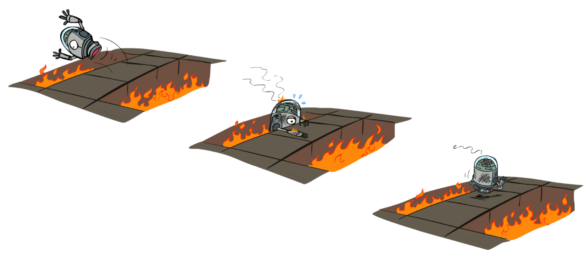

class: middle, center, title-slide

# Introduction to Artificial Intelligence

Lecture 9: Reinforcement learning

  
Prof. Gilles Louppe 
[g.louppe@uliege.be](mailto:g.louppe@uliege.be)

---

# Today

---

class: middle

# MDPs

A short recap.

---

# MDPs

---

# The Bellman equation

---

# Value iteration

---

# Policy iteration

---

class: middle

# Reinforcement learning

---

A Markov decision process assumes the knowledge of a transition model $P(s'|s,a)$
and of a reward function $R$.
What if the MDP is unknown?
- We do not know which states are good nor what actions do!
- We must observe or interact with the environment in order  to jointly *learn* these dynamics and act upon them.

$\Rightarrow$ This is **reinforcement learning**.

 
.center.width-80[]

.footnote[Image credits: [CS188](https://inst.eecs.berkeley.edu/~cs188/), UC Berkeley.]

---

show videos of https://twitter.com/YAWScience/status/1304199719036444672?s=09

---

what just happened?

---

class: middle

Reinforcement learning include two main families of algorithms:
  

.grid[
.kol-1-2[
## Model-based

- Learn an approximate model for $P(s'|s,a)$ and $R$ based on experiences.
- Solve the resulting approximate MDP with value or policy iteration.

]
.kol-1-2[
## Model-free

- Learn an approximate model for $V$ based on experiences.
- Extract a policy from the approximate state values $V$.
]
]

Learning approximate models from experiences can be done with *supervised learning* (see Lecture 9).

---

# Model-based learning 

---

# Model-free learning

---

# Temporal-difference learning

---

# Q-Learning

optimal quantities -> introduce q-values and the corresponding bellman equation
q-value iteration
q-learning

---

# Generalizing across states

approximate q-learning
linear value functions
pacman demo

---

class: middle, black-slide

.center[
<iframe width="640" height="480" src="https://www.youtube.com/embed/l5o429V1bbU?&loop=1&start=0" frameborder="0" volume="0" allowfullscreen></iframe>

Playing Pinball
]

---

class: middle, black-slide

.center[
<iframe width="640" height="480" src="https://www.youtube.com/embed/5WXVJ1A0k6Q?&loop=1&start=0" frameborder="0" volume="0" allowfullscreen></iframe>

Playing Seaquest
]

---

class: middle, black-slide

.center[
<iframe width="640" height="480" src="https://www.youtube.com/embed/6kO4eZWeKOM?&loop=1&start=0" frameborder="0" volume="0" allowfullscreen></iframe>

Playing Enduro
]

---

# Summary