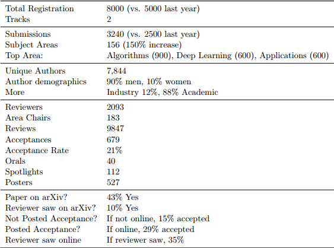
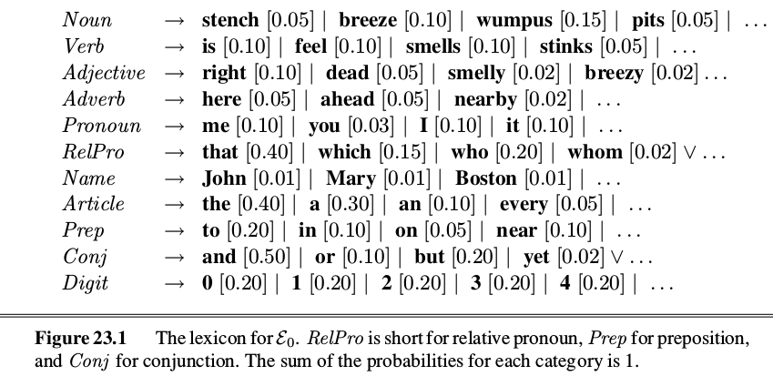
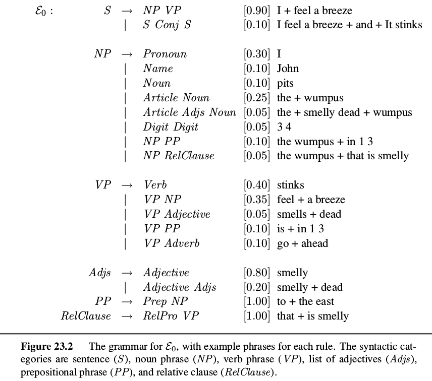
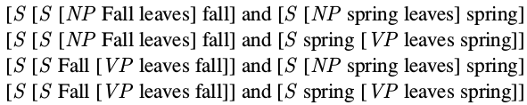
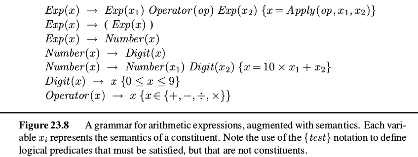
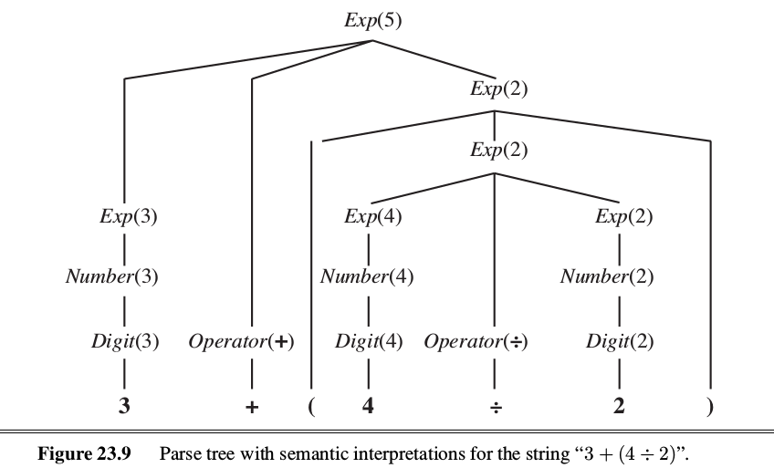
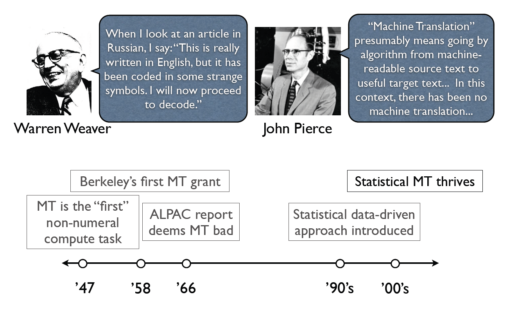

class: middle, center, title-slide

# Introduction to Artificial Intelligence

Lecture 9: Communication

---

# Today

- A guided tour of NIPS 2017
- Natural language processing
    - Parsing
    - Semantics
- Machine translation

---

class: center, middle

# NIPS 2017

---

class: middle, center

.width-100[]

---

# NIPS?

- Research conference and workshops on *Neural Information Processing Systems* (NIPS).
- **\#1 conference** on machine learning, artificial intelligence and computational neuroscience.
- Pre-proceedings available for [download](http://papers.nips.cc/book/advances-in-neural-information-processing-systems-30-2017).

.center.width-50[]

---

# Stats

.center.width-80[]

---

# Highlights

.center[
<iframe width="640" height="480" src="https://www.youtube.com/embed/YJnddoa8sHk?&loop=1&start=0" frameborder="0" volume="0" allowfullscreen></iframe>
]

.center[Deep Learning: Practice and Trends]

---

# Highlights

.center[
<iframe width="640" height="480" src="https://www.youtube.com/embed/LvmjbXZyoP0?&loop=1&start=0" frameborder="0" volume="0" allowfullscreen></iframe>
]

.center[Geometric Deep Learning on Graphs and Manifold]

---

# Highlights

.center[
<iframe width="640" height="480" src="https://www.youtube.com/embed/iXp-wc0QV8w?&loop=1&start=0" frameborder="0" volume="0" allowfullscreen></iframe>
]

.center[Reverse-Engineering Intelligence Using Probabilistic Programs]

---

# Highlights

.center[
<iframe width="640" height="480" src="https://www.youtube.com/embed/po9z_tMuEwE?&loop=1&start=0" frameborder="0" volume="0" allowfullscreen></iframe>
]

.center[Deep Learning for Robotics]

---

# Highlights

.center[
<iframe width="640" height="480" src="https://www.youtube.com/embed/A3ekFcZ3KNw?&loop=1&start=0" frameborder="0" volume="0" allowfullscreen></iframe>
]

.center[AlphaZero]

---

# Highlights

.center[
<iframe width="640" height="480" src="https://www.youtube.com/embed/fMym_BKWQzk?&loop=1&start=0" frameborder="0" volume="0" allowfullscreen></iframe>
]

.center[The Trouble with Bias]

---

# Highlights

.center[
<iframe width="640" height="480" src="https://www.youtube.com/embed/9saauSBgmcQ?&loop=1&start=0" frameborder="0" volume="0" allowfullscreen></iframe>
]

.center[Bayesian Deep Learning and Deep Bayesian Learning]

---

# Highlights

.center[
<iframe width="640" height="480" src="https://www.youtube.com/embed/NHTGY8VCinY?&loop=1&start=0" frameborder="0" volume="0" allowfullscreen></iframe>
]

.center[Deep Probabilistic Modelling with Gaussian Processes]

---

# Highlights

.center[
<iframe width="640" height="480" src="https://www.youtube.com/embed/rhNxt0VccsE?&loop=1&start=0" frameborder="0" volume="0" allowfullscreen></iframe>
]

.center[Learning to Run competition]

---

# Topics to watch out for

- Generative adversarial networks
- Hierarchical reinforcement learning
- Probabilistic programming
- Meta-learning
- Bayesian deep learning
- Dealing with data bias
- Optimal transport
- Emergent communication

---

# Academia vs Private labs

- NIPS remains an *academic* research conference.
- But there is an increasing presence of **strong private research labs**.
    - Google Brain, Google DeepMind, NVidia, Facebook, IBM, Intel, Microsoft, etc.
    - All are aggressively hiring!

.center[
<iframe width="640" height="320" src="https://www.youtube.com/embed/J5p3XVTXb0o?&loop=1&start=0" frameborder="0" volume="0" allowfullscreen></iframe>
]

---

class: center, middle

# Natural language processing

---

# Natural Language Processing

.center.width-70[]

- Fundamental goal:
    - Analyze and process human language, broadly, robustly, accurately, ...
- End systems that we want to build:
    - **Ambitious**: speech recognition, machine translation, information extraction, dialog interfaces, question answering, etc.
    - *Modest*: spelling correction, text categorization, etc.

.footnote[Credits: UC Berkeley, [CS188](http://ai.berkeley.edu/lecture_slides.html)]

---

# Probabilistic context-free grammar

- A **grammar** is a collection of rules that defines a *language* as a set of allowable strings of words.
- Probabilistic context-free grammars are grammars such that:
    - production rules do not depend on context (context-free);
    - a probability is assigned to every string (probabilistic).
- Example:
    - $VP \rightarrow Verb [0.7] | VP \, NP [0.3]$
- Let $\xi\_0$ be a language suitable for communication between agents exploring the Wumpus world.

---

# Lexicon of $\xi\_0$

.center.width-80[]

???

Lexicon = list of allowable words.

---

# Grammar of $\xi\_0$

.center.width-80[]

---

- Unfortunately, this grammar **overgenerates**:
    - It generates sentences that are not grammatical (in English).
    - e.g., "Me go Boston" or "I smell pits wumpus John"
- It also **undergenerates**:
    - Many English sentences are rejected.
    - e.g., "I think the wumpus is smelly."

???

Grammar = compact list of allowable sentences.

---

# Parse tree

.center.width-80[]

---

# Syntactic analysis

.center.width-80[]

- **Parsing** is the process of analyzing a string of words to uncover its phrase structure.
- This process can be carried out efficiently using the CYK algorithm:
    - Imagine a state-action space where actions correspond to production rules.
    - Use A* to search the space efficiently until the string has been compressed to a single item $S$.

---

class: center, middle

[(demo)](http://tomato.banatao.berkeley.edu:8080/parser/parser.html)

---

# Ambiguity

- There may be several distinct parse trees for a given sentence.
- E.g., the sentence "Fall leaves fall and spring leaves spring." admit 4 parse trees:

.center.width-80[]

- With A*:
    - Define the cost of a state as the inverse of its probability as defined by the rules applied so far.
    - Estimate the remaining distance using machine learning.
    - With very high probability, the procedure yields the most probable tree.

---

# Learning PCFGs

- A PCFG has many rules, with a probability for each rule.
- **Learning** the grammar might be better than a knowledge engineering approach.
- If we are given a corpus of correctly parses sentences, the rules and their probability can be estimated directly from this data.
    - E.g., count nodes $S$ and nodes $\[S \[NP ...\]\[VP ...\]\]$ over all trees to estimate the probability of $S \rightarrow  NP \, VP$.
- If we dont have labeled sentences, then we have to learn both the rules and their probability.
    - This is more complicated, but several algorithms exist:
        - Assume (or cross-validate) a number of categories $X, Y, Z, ...$.
        - Assume the grammar includes every possible rule $X \rightarrow Y Z$ or $X \rightarrow word$.
        - Use an expectation-minimization algorithm estimate the probabilities.

---

# Semantic interpretation

.center.width-80[]

- Semantics can be added to each rule of a grammar.
- The rules obey the principle of **compositional semantics**:
    - The semantics of a phrase is a function of the semantics of the subphrases.
- In general, semantics can be properly defined with *first-order logic*, where nodes are either associated to a logical term, a logical sentence or a predicate.

---

.center.width-80[]

---

# Real language

- A real language like English is difficult to map to a grammar and to a semantics, because of the following reasons:
    - Long-distance dependencies
    - Ambiguities (lexical, syntax, semantic)
    - Metonymies (figure of speech)
    - Metaphors
- Recovering the most probable intended *meaning* is called **disambiguation**. To do disambiguation properly, we need to combine:
    - The *world model*: the likelihood that a proposition occurs in the world.
    - The *mental model*: the likelihood that the speaker forms the intention of communicating some fact to the hearer.
    - The *language model*: the likelihood that a certain string of words will be chosen.
    - The *acoustic model*: the likelihood that a certain sequence of sounds will be generated.
- Combining perfectly all these pieces together remains an **open problem**!

---

# Eliza

.grid[
.col-2-3[
- *Eliza* is one of the earliest instances of a **chatterbot** (Weizenbaum, 1964).
- Led to a long line of chatterbots.
- How does it work?
    - Trivial NLP: string match and substitution.
    - Trivial knowledge: tiny script / response database.
    - Example: matching "I remember \_\_\_" results in "Do you often think of \_\_\_?"
]
.col-1-3[]
]

.footnote[Credits: UC Berkeley, [CS188](http://ai.berkeley.edu/lecture_slides.html)]

---

# Modern chatbots

.grid[
.col-1-2[]
.col-1-2[]
]

.center[Siri, Google Assistant, Alexa, etc]

---

# Machine translation

.center.width-80[]

- Translate text from one language to another, while *preserving the intended meaning*.
- Recombines fragments of example translations.
- Challenges:
    - What fragments? [Learning to translate]
    - How to make efficient? [Fast translation search]

.footnote[Credits: UC Berkeley, [CS188](http://ai.berkeley.edu/lecture_slides.html)]

---

# Issue of dictionary lookups

.center.width-80[]

.footnote[Credits: UC Berkeley, [CS188](http://ai.berkeley.edu/lecture_slides.html)]

---

# History

.center.width-100[]

.footnote[Credits: UC Berkeley, [CS188](http://ai.berkeley.edu/lecture_slides.html)]

---

# Data-driven machine translation

.center.width-100[]

.footnote[Credits: UC Berkeley, [CS188](http://ai.berkeley.edu/lecture_slides.html)]

---

# Statistical machine translation

To translate a sentence in English ($e$) into French ($f$), we seek the strings of words $f^\*$ that maximizes

$$f^\* = \arg\max\_f P(f|e) = \arg\max\_f P(e|f)P(f)$$

- $P(f)$ is the *language model*
- $P(e|f)$ is the *translation model* (from French to English)

---

# HMM translation model

.center.width-100[]

.footnote[Credits: UC Berkeley, [CS188](http://ai.berkeley.edu/lecture_slides.html)]

---

# Levels of transfer

.center.width-100[]

.footnote[Credits: UC Berkeley, [CS188](http://ai.berkeley.edu/lecture_slides.html)]

---

# Neural translation

- Modern machine translation systems are all based on neural networks.

.center.width-80[]

---

# Unsupervised machine translation (1)

- The latest approaches (e.g., arXiv:1711.00043) do not even need to have a bilingual corpus!
- Machine translation can be learned in a **fully unsupervised** way.

.center.width-100[]

---

# Unsupervised machine translation (2)

.center.width-100[]

---

# References

- Vogel, S. et al. "HMM-based word alignment in statistical translation.", 1996.
- Bahdanau, Dzmitry, Kyunghyun Cho, and Yoshua Bengio. "Neural machine translation by jointly learning to align and translate." arXiv preprint arXiv:1409.0473 (2014).
- Lample, Guillaume, Ludovic Denoyer, and Marc'Aurelio Ranzato. "Unsupervised Machine Translation Using Monolingual Corpora Only." arXiv preprint arXiv:1711.00043 (2017).
