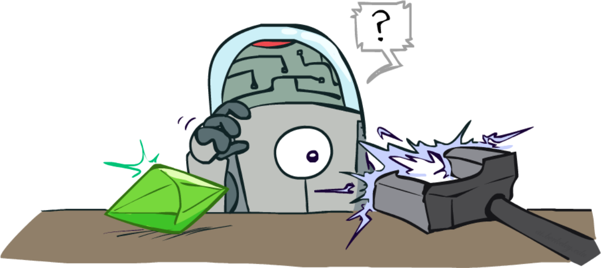

class: middle, center, title-slide

# Introduction to Artificial Intelligence

Lecture 9: Reinforcement Learning

  
Prof. Gilles Louppe 
[g.louppe@uliege.be](mailto:g.louppe@uliege.be)

---

# Today

How to make decisions under uncertainty, **while learning** about the environment?

.grid[
.kol-1-2[
- Reinforcement learning (RL)
- Passive RL
  - Model-based estimation
  - Model-free estimation
    - Direct utility estimation
    - Temporal-difference learning
- Active RL
  - Model-based learning
  - Q-Learning
  - Generalizing across states
]
.kol-1-2.width-100[   ]
]

.footnote[Image credits: [CS188](https://inst.eecs.berkeley.edu/~cs188/), UC Berkeley.]

---

class: middle

.width-100[]

.footnote[Image credits: [CS188](https://inst.eecs.berkeley.edu/~cs188/), UC Berkeley.]

???

Offline solution = Planning

---

class: middle

# MDPs

A short recap.

---

# MDPs

A **Markov decision process** (MDP) is a tuple $(\mathcal{S}, \mathcal{A}, P, R)$ such that:
- $\mathcal{S}$ is a set of states $s$;
- $\mathcal{A}$ is a set of actions $a$;
- $P$ is a (stationary) transition model such that  $P(s'|s,a)$ denotes the probability of reaching state $s'$ if action $a$ is done in state $s$;
- $R$ is a reward function that maps immediate (finite) reward values $R(s)$ obtained in states $s$.
- ($0 < \gamma \leq 1$ is the discount factor.)

---

class: middle

.grid[
.kol-1-5.center[
    
$$s'$$
$$r' = R(s')$$
]
.kol-3-5.center[
$$s$$
.width-90[]
$$s' \sim P(s'|s,a)$$
]
.kol-1-5[
     
$$a$$
]
]

---

class: middle

## Remarks

- Although MDPs generalize to continuous state-action spaces, we assume in this lecture that both $\mathcal{S}$ and $\mathcal{A}$ are discrete and finite.
- The formalism we use to define MDPs is not unique. A quite well-established and equivalent variant is to define the reward function with respect to a transition $(s,a,s')$, i.e. $R(s,a,s')$. This results in new (but equivalent) formulations of the algorithms covered in Lecture 8.

---

# The Bellman equation

The utility of a state is the immediate reward for that state, plus the expected discounted utility of the next state, assuming that the agent chooses the optimal action:
$$V(s) = R(s) + \gamma  \max\_{a} \sum\_{s'} P(s'|s,a) V(s').$$

.center.width-75[]

.footnote[Image credits: [CS188](https://inst.eecs.berkeley.edu/~cs188/), UC Berkeley.]

---

# Value iteration

The **value iteration** algorithm provides a fixed-point iteration procedure for computing the state utilities $V(s)$:
- Let $V\_i(s)$ be the estimated utility value for $s$ at the $i$-th iteration step.
- The **Bellman update** consists in updating simultaneously all the estimates to make them *locally consistent* with the Bellman equation:
$$V\_{i+1}(s) = R(s) + \gamma \max\_a \sum\_{s'} P(s'|s,a) V\_i(s'). $$
- Repeat until convergence.

---

# Policy iteration

The **policy iteration** algorithm directly computes the policy (instead of state values). It alternates the following two steps:
- Policy evaluation: given $\pi\_i$, calculate $V\_i = V^{\pi\_i}$, i.e. the utility of each state if $\pi\_i$ is executed:
$$V\_i(s)  = R(s) + \gamma \sum\_{s'} P(s'|s,\pi\_i(s)) V\_i(s').$$
- Policy improvement: calculate a new policy $\pi\_{i+1}$ using one-step look-ahead based on $V\_i$:
$$\pi\_{i+1}(s) = \arg\max\_a \sum\_{s'} P(s'|s,a)V\_i(s').$$

---

class: middle

# Reinforcement learning

---

class: middle, black-slide

.center[
<video controls preload="auto" height="500" width="700">
  <source src="./figures/lec9/chicken1.mp4" type="video/mp4">
</video>]

.footnote[Video credits: [Megan Hayes](https://twitter.com/PigMegan), [@YAWScience](https://twitter.com/YAWScience/status/1304199719036444672), 2020.]

---

class: middle, black-slide

.center[
<video controls preload="auto" height="500" width="700">
  <source src="./figures/lec9/chicken2.mp4" type="video/mp4">
</video>]

.footnote[Video credits: [Megan Hayes](https://twitter.com/PigMegan), [@YAWScience](https://twitter.com/YAWScience/status/1304199719036444672), 2020.]

---

class: middle 

## What just happened?

- This wasn't planning, it was reinforcement learning!
- There was an MDP, but the chicken couldn't solve it with just computation.
- The chicken needed to actually act to figure it out.

## Important ideas in reinforcement learning that came up
- Exploration: you have to try unknown actions to get information.
- Exploitation: eventually, you have to use what you know.
- Regret: even if you learn intelligently, you make mistakes.
- Sampling: because of chance, you have to try things repeatedly.
- Difficult: learning can be much harder than solving a known MDP.

???

There was a chicken, in some unknown MDP. The chicken wanted to maximise his reward.

---

# Reinforcement learning

We still assume a Markov decision process $(\mathcal{S}, \mathcal{A}, P, R)$ such that:
- $\mathcal{S}$ is a set of states $s$;
- $\mathcal{A}$ is a set of actions $a$;
- $P$ is a (stationary) transition model such that  $P(s'|s,a)$ denotes the probability of reaching state $s'$ if action $a$ is done in state $s$;
- $R$ is a reward function that maps immediate (finite) reward values $R(s)$ obtained in states $s$.

Our goal is find the optimal policy $\pi^\*(s)$.

---

class: middle

## New twist 

The transition model $P(s'|s,a)$ and the reward function $R(s)$ are **unknown**.
- We do not know which states are good nor what actions do!
- We must observe or interact with the environment in order  to jointly *learn* these dynamics and act upon them.
.grid[
.kol-1-5.center[
    
$$s'$$
$$r' = \underbrace{R(s')}\_{???}$$
]
.kol-3-5.center[
$$s$$
.width-90[]
$$s' \sim \underbrace{P(s'|s,a)}\_{???}$$
]
.kol-1-5[
     
$$a$$
]
]

???

Imagine playing a new game whose rules you don’t know; after a
hundred or so moves, your opponent announces, “You lose.” This is reinforcement learning
in a nutshell.

---

# Passive RL

.center.width-50[]

## Goal: policy evaluation
- The agent's policy $\pi$ is fixed.
- Its goal is to learn the utilities $V^\pi(s)$.
- The learner has no choice about what actions to take. It just executes the policy and learns from experience.

.footnote[Image credits: [CS188](https://inst.eecs.berkeley.edu/~cs188/), UC Berkeley.]

???

This is not offline planning. You actually take actions in the world! (Since $P$ and $R$ are unknown)

---

class: middle

.center.width-30[]

The agent executes a set of **trials** (or episodes) in the environment using policy $\pi$.
Trial trajectories $(s, r, a, s'), (s', r', a', s''), ...$ might look like this:
- Trial 1: $(B, -1, \text{east}, C), (C, -1, \text{east}, D), (D, +10, \text{exit}, \perp)$
- Trial 2: $(B, -1, \text{east}, C), (C, -1, \text{east}, D), (D, +10, \text{exit}, \perp)$
- Trial 3: $(E, -1, \text{north}, C), (C, -1, \text{east}, D), (D, +10, \text{exit}, \perp)$
- Trial 4: $(E, -1, \text{north}, C), (C, -1, \text{east}, A), (A, -10, \text{exit}, \perp)$

---

# Model-based estimation

A **model-based** agent estimates approximate transition and reward models $\hat{P}$ and $\hat{R}$ based on experiences and then evaluates the resulting empirical MDP.

- Step 1: Learn an empirical MDP.
  - Estimate $\hat{P}(s'|s,a)$ from empirical samples $(s,a,s')$ or with supervised learning.
  - Discover each $\hat{R}(s)$ for each $s$.
- Step 2: Evaluate $\pi$ using $\hat{P}$ and $\hat{R}$, e.g. as
  $$V(s)  = \hat{R}(s) + \gamma \sum\_{s'} \hat{P}(s'|s,\pi(s)) V(s').$$

.center.width-55[]

.footnote[Image credits: [CS188](https://inst.eecs.berkeley.edu/~cs188/), UC Berkeley.]

---

class: middle

## Example

.grid[
.kol-1-4.smaller-x[
Policy $\pi$:

.width-100[]
]
.kol-3-4[
.smaller-x[
Trajectories:

$(B, -1, \text{east}, C), (C, -1, \text{east}, D), (D, +10, \text{exit}, \perp)$
$(B, -1, \text{east}, C), (C, -1, \text{east}, D), (D, +10, \text{exit}, \perp)$
$(E, -1, \text{north}, C), (C, -1, \text{east}, D), (D, +10, \text{exit}, \perp)$
$(E, -1, \text{north}, C), (C, -1, \text{east}, A), (A, -10, \text{exit}, \perp)$

]
]
]

.grid.smaller-x[
.kol-1-2[
Learned transition model $\hat{P}$:

$\hat{P}(C|B, \text{east}) = 1$ 
$\hat{P}(D|C, \text{east}) = 0.75$ 
$\hat{P}(A|C, \text{east}) = 0.25$ 
$(...)$
]
.kol-1-2[
Learned reward $\hat{R}$:

$\hat{R}(B) = -1$ 
$\hat{R}(C) = -1$ 
$\hat{R}(D) = +10$  
$(...)$
]
]

---

# Model-free estimation

Can we learn $V^\pi$ in a **model-free** fashion, without explicitly modeling the environment, i.e. without learning $\hat{P}$ and $\hat{R}$?

---

# Direct utility estimation

(a.k.a. Monte Carlo evaluation)

- The utility $V^\pi(s)$ of state $s$ is the expected total reward from the state onward (called the expected **reward-to-go**)
$$V^\pi(s) = \mathbb{E}\left[\sum\_{t=0}^\infty \gamma^t R(s\_t) \right]\Biggr\rvert\_{s\_0=s}$$
- Each trial provides a *sample* of this quantity for each state visited.
- Therefore, at the end of each sequence, one can update a sample average $\hat{V}^\pi(s)$ by:
  - computing the observed reward-to-go for each state;
  - updating the estimated utility for that state, by keeping a running average.
- In the limit of infinitely many trials, the sample average will converge to the true expectation.

---

class: middle

## Example ($\gamma=1$)

.grid[
.kol-1-4.smaller-x[
Policy $\pi$:

.width-100[]
]
.kol-3-4[
.smaller-x[
Trajectories:

$(B, -1, \text{east}, C), (C, -1, \text{east}, D), (D, +10, \text{exit}, \perp)$
$(B, -1, \text{east}, C), (C, -1, \text{east}, D), (D, +10, \text{exit}, \perp)$
$(E, -1, \text{north}, C), (C, -1, \text{east}, D), (D, +10, \text{exit}, \perp)$
$(E, -1, \text{north}, C), (C, -1, \text{east}, A), (A, -10, \text{exit}, \perp)$
]
]
]

.grid[
.kol-1-4.smaller-x[
Output values $\hat{V}^\pi(s)$:

.width-100[]
]
.kol-3-4.center.italic[  

If both $B$ and $E$ go to $C$ under $\pi$,  how can their values be different?]
]

---

class: middle

Unfortunately, direct utility estimation misses the fact that the state values $V^\pi(s)$ are not independent, since they obey the Bellman equations for a fixed policy:
$$V^\pi(s) = R(s) + \gamma \sum\_{s'}P(s'|s,\pi(s)) V^\pi(s').$$
Therefore, direct utility estimation misses opportunities for learning and takes a long time to learn.

---

# Temporal-difference learning

Temporal-difference (TD) learning consists in updating $V^\pi(s)$ each time the agent experiences a transition $(s, r=R(s), a=\pi(s), s')$.

.width-20.center[]

When a transition from $s$ to $s'$ occurs, the temporal-difference update steers $V^\pi(s)$ to better agree with the Bellman equations for a fixed policy, i.e.
$$V^\pi(s) \leftarrow V^\pi(s) + \alpha \underbrace{(r + \gamma V^\pi(s') - V^\pi(s))}\_{\text{temporal difference error}}$$
where $\alpha$ is the *learning rate* parameter.

???

Instead waiting for a complete trajectory to update $V^\pi(s)$, ...

...

- If $r + \gamma V^\pi(s') > V^\pi(s)$ then the prediction $V^\pi(s)$ underestimates the value, hence the increment.
- If $r + \gamma V^\pi(s') < V^\pi(s)$ then the prediction $V^\pi(s)$ overestimates the value, hence the decrement.

---

class: middle

Alternatively, the TD-update can be viewed as a single gradient descent step on the squared error between the target $r+ \gamma V^\pi(s')$ and the prediction $V^\pi(s)$. (More later.)

---

class: middle

## Exponential moving average

The TD-update can equivalently be expressed as the exponential moving average
$$V^\pi(s) \leftarrow (1-\alpha)V^\pi(s) + \alpha (r + \gamma V^\pi(s')).$$

Intuitively,
- this makes recent samples more important;
- this forgets about the past (distant past values were wrong anyway).
  
---

class: middle 

## Example ($\gamma=1$, $\alpha=0.5$)

.grid[
.kol-1-4[]
.kol-1-2.center[.width-45[] .width-45[]

Transition: $(B, -1, \text{east}, C)$
]
]

TD-update:

$\begin{aligned}
V^\pi(B) &\leftarrow V^\pi(B) + \alpha(R(B) + \gamma V^\pi(C) - V^\pi(B)) \\\\
&\leftarrow 0 + 0.5 (-1 + 0 - 0) \\\\
&\leftarrow -0.5
\end{aligned}$

---

class: middle

.grid[
.kol-1-4[]
.kol-1-2.center[.width-45[] .width-45[]

Transition: $(C, -1, \text{east}, D)$
]
]

TD-update:

$\begin{aligned}
V^\pi(C) &\leftarrow V^\pi(C) + \alpha(R(C) + \gamma V^\pi(D) - V^\pi(C)) \\\\
&\leftarrow 0 + 0.5 (-1 + 8 - 0) \\\\
&\leftarrow 3.5
\end{aligned}$

???

Note how the large reward eventually propagates back to the states leading to it. 

Doing the first update again would result in a better value for $B$.

---

class: middle

## Convergence

- Notice that the TD-update involves only the observed successor $s'$, whereas the actual Bellman equations for a fixed policy involves all possible next states. Nevertheless, the *average* value of $V^\pi(s)$ will converge to the correct value.
- If we change $\alpha$ from a fixed parameter to a function that decreases as the number of times a state has been visited increases, then $V^\pi(s)$  will itself converge to the correct value.

---

# Active RL

.center.width-80[]

## Goal: learn an optimal policy
- The agent's policy is not fixed anymore.
- Its goal is to learn the optimal policy $\pi^\*$ or the state values $V(s)$.
- The learner makes choices!
- Fundamental trade-off: exploration vs. exploitation.

.footnote[Image credits: [CS188](https://inst.eecs.berkeley.edu/~cs188/), UC Berkeley.]

---

# Model-based learning

The passive model-based agent can be made active by instead finding the optimal policy $\pi^*$ for the empirical MDP.

For example, having obtained a utility function $V$ that is optimal for the learned model (e.g., with Value Iteration), the optimal action by one-step look-ahead to maximize the expected utility is
$$\pi^*(s) = \arg \max\_a \sum\_{s'} \hat{P}(s'|s,a) V(s').$$

---

class: middle, center

.width-100[]

The agent **does not** learn the true utilities or the true optimal policy!

---

class: middle

The resulting policy is **greedy** and **suboptimal**:
- The learned transition and reward models $\hat{P}$ and $\hat{R}$ are not the same as the true environment since they are based on the samples obtained by the agent's policy, which biases the learning.
- Therefore, what is optimal in the learned model can be suboptimal in the true environment.

---

# Exploration

Actions do more than provide rewards according to the current learned model. 
They also contribute to learning the true environment. 

This is the **exploitation-exploration** trade-off:
- Exploitation: follow actions that maximize the rewards, under the current learned model;
- Exploration: follow actions to explore and learn about the true environment.

.center.width-60[]

.footnote[Image credits: [CS188](https://inst.eecs.berkeley.edu/~cs188/), UC Berkeley.]

---

class: middle 

## How to explore?

Simplest approach for forcing exploration: random actions ($\epsilon$-greedy).
- With a (small) probability $\epsilon$, act randomly.
- With a (large) probability $(1-\epsilon)$, follow the current policy.

$\epsilon$-greedy does eventually explore the space, but keeps trashing around once learning is done.

---

class: middle 

## When to explore?

Better idea: explore areas whose badness is not (yet) established, then stop exploring.

Formally, let $V^+(s)$ denote an optimistic estimate of the utility of state $s$ and let $N(s,a)$ be the number of times actions $a$ has been tried in $s$. 

For Value Iteration, the update equation becomes
$$V^+\_{i+1}(s) = R(s) + \gamma \max\_a f(\sum_{s'} P(s'|s,a) V^+\_i(s'), N(s,a)),$$
where $f(v, n)$ is called the **exploration function**. 

The function $f(v,n)$ should be increasing in $v$ and decreasing in $n$. A simple choice is $f(v,n) = v + K/n$.

???

This is similar to MCTS! (Lecture 3)

---

# Model-free learning

Although temporal difference learning provides a way to estimate $V^\pi$ in a model-free fashion, we would still have to learn a model $P(s'|s,a)$ to choose an action based on a one-step look-ahead.

 
.center.width-50[]

.footnote[Image credits: [CS188](https://inst.eecs.berkeley.edu/~cs188/), UC Berkeley.]

---

# Détour: Q-values

.grid[
.kol-1-2[
- The state-value $V(s)$ of the state $s$ is the expected utility starting in $s$ and acting optimally.
- The state-action-value $Q(s,a)$ of the q-state $(s,a)$ is the expected utility starting out having taken action $a$ from $s$ and thereafter acting optimally.
]
.kol-1-2.width-100[]
]

---

class: middle

## Optimal policy

The optimal policy $\pi^\*(s)$ can be defined in terms of either $V(s)$ or $Q(s,a)$:
$$\begin{aligned}
\pi^\*(s) &= \arg \max\_a \sum\_{s'} P(s'|s,a) V(s') \\\\
&= \arg \max\_a Q(s,a)
\end{aligned}$$

.footnote[Image credits: [CS188](https://inst.eecs.berkeley.edu/~cs188/), UC Berkeley.]

---

class: middle

## Bellman equations for $Q$

Since $V(s) = \max\_a Q(s,a)$, the Q-values $Q(s,a)$ are recursively defined as
$$\begin{aligned}
Q(s,a) &= R(s) + \gamma \sum\_{s'} P(s'|s,a) V(s') \\\\
&= R(s) + \gamma \sum\_{s'} P(s'|s,a) \max\_{a'} Q(s',a').
\end{aligned} $$

As for value iteration, the last equation can be used as an update equation for a fixed-point iteration procedure that calculates the Q-values $Q(s,a)$. However, it still requires knowing $P(s'|s,a)$!

---

# Q-Learning

The state-action-values $Q(s,a)$ can be learned in a model-free fashion using a temporal-difference method known as **Q-Learning**.

Q-Learning consists in updating $Q(s,a)$ each time the agent experiences a transition $(s, r=R(s), a, s')$.

The update equation for TD Q-Learning is
$$Q(s,a) \leftarrow Q(s,a) + \alpha (r + \gamma \max\_{a'} Q(s',a') - Q(s,a)).$$

.alert[Since $\pi^*(s) = \arg \max\_a Q(s,a)$, a TD agent that learns Q-values does not need a model of the form $P(s'|s,a)$, neither for learning nor for action selection!]

---

class: middle

.width-100[]

---

class: middle

.width-30.center[]

## Convergence

Q-Learning **converges to an optimal policy**, even when acting suboptimally.
- This is called off-policy learning.
- Technical caveats:
  - You have to explore enough.
  - The learning rate must eventually become small enough.
  - ... but it shouldn't decrease too quickly.

.footnote[Image credits: [CS188](https://inst.eecs.berkeley.edu/~cs188/), UC Berkeley.]

---

# Generalizing across states

.grid[
.kol-2-3[
- Basic Q-Learning keeps a table for all Q-values $Q(s,a)$.
- In realistic situations, we cannot possibly learn about every single state!
  - Too many states to visit them all in training.
  - Too many states to hold the Q-table in memory.
- We want to generalize:
  - Learn about some small number of training states from experience.
  - Generalize that experience to new, similar situations.
  - This is supervised *machine learning* again!
]
.kol-1-3.width-100[  ]
]

.footnote[Image credits: [CS188](https://inst.eecs.berkeley.edu/~cs188/), UC Berkeley.]

---

class: middle

## Example: Pacman
.grid.center[
.kol-1-8[]
.kol-1-4[(a)

.width-100[]]
.kol-1-4[(b)

.width-100[]]
.kol-1-4[(c)

.width-100[]]
.kol-1-8[]
]

If we discover by experience that (a) is bad, then in naive Q-Learning, we know nothing about (b) nor (c)!

.footnote[Image credits: [CS188](https://inst.eecs.berkeley.edu/~cs188/), UC Berkeley.]

---

class: middle 

.grid[
.kol-3-4[
## Feature-based representations

Solution: describe a state $s$ using a vector $\mathbf{x} = [f\_1(s), ..., f\_d(s)] \in \mathbb{R}^d$ of features.
- Features are functions $f\_k$ from states to real numbers that capture important properties of the state.
- Example features:
  - Distance to closest ghost
  - Distance to closest dot
  - Number of ghosts
  - ...
- Can similarly describe a q-state $(s, a)$ with features $f\_k(s,a)$.
]
.kol-1-4.width-100[]
]

.footnote[Image credits: [CS188](https://inst.eecs.berkeley.edu/~cs188/), UC Berkeley.]

---

class: middle

.center.width-50[]

## Approximate Q-Learning

Using a feature-based representation, the Q-table can now be replaced with a function approximator, such as a linear model 
$$Q(s,a) = w\_1 f\_1(s,a) + w\_2 f\_2(s,a) + ... + w\_d f\_d(s,a).$$

Upon the transition $(s, r, a, s')$, the update becomes
$$
w\_k \leftarrow  w\_k + \alpha (r + \gamma \max\_{a'} Q(s', a') - Q(s,a)) f\_k(s,a),
$$
for all $w\_k$.

.footnote[Image credits: [CS188](https://inst.eecs.berkeley.edu/~cs188/), UC Berkeley.]

???

Remember that the TD-update can be viewed as a online GD update, except now we dot not directly modify $Q(s,a)$ but rather the parameters of the function approximator.

---

class: middle

In linear regression, imagine we had only one point $\mathbf{x}$ with features $[f\_1, ..., f\_d]$. Then,
$$
\begin{aligned}
\ell(\mathbf{w}) &= \frac{1}{2} \left( y - \sum\_k w\_k f\_k \right)^2 \\\\
\frac{\partial \ell}{\partial w\_k} &= -\left(y -  \sum\_k w\_k f_k \right) f\_k \\\\
w\_k &\leftarrow w\_k + \alpha \left(y -  \sum\_k w\_k f\_k \right) f\_k,
\end{aligned}
$$

hence the Q-update
$$w\_k \leftarrow w\_k + \alpha \left(\underbrace{r + \gamma \max\_{a'} Q(s', a')}\_{\text{target}\, y} -  \underbrace{Q(s,a)}\_{\text{prediction}} \right) f\_k(s,a).$$

---

class: middle

## DQN

Similarly, the Q-table can be replaced with a neural network as function approximator, resulting in the *DQN* algorithm.

.center.width-100[]

---

class: middle, center

(demo)

---

class: middle

# Applications

---

class: middle, black-slide

.center[
<iframe width="640" height="480" src="https://www.youtube.com/embed/Tnu4O_xEmVk?&loop=1&start=0" frameborder="0" volume="0" allowfullscreen></iframe>

MarIQ
]

---

class: middle, black-slide

.center[
<iframe width="640" height="480" src="https://www.youtube.com/embed/l5o429V1bbU?&loop=1&start=0" frameborder="0" volume="0" allowfullscreen></iframe>

Playing Atari Games (Pinball)
]

---

class: middle, black-slide

.center[
<iframe width="640" height="480" src="https://www.youtube.com/embed/W4joe3zzglU?&loop=1&start=0" frameborder="0" volume="0" allowfullscreen></iframe>

Robotic manipulation
]

---

class: middle, black-slide

.center[
<iframe width="640" height="480" src="https://www.youtube.com/embed/fBiataDpGIo?&loop=1&start=0" frameborder="0" volume="0" allowfullscreen></iframe>

Drone racing
]

---

# Summary

.width-100[]

.footnote[Image credits: [CS188](https://inst.eecs.berkeley.edu/~cs188/), UC Berkeley.]

---

class: middle

## My mission .green[&#10004;]

By the end of this course, you will have built autonomous agents that efficiently make decisions in fully informed, partially observable and adversarial settings. Your agents will draw inferences in uncertain and unknown environments and optimize actions for arbitrary reward structures. 

---

class: end-slide, center
count: false

The end.
