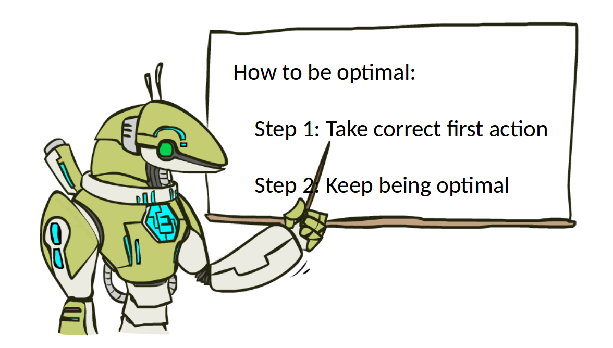

class: middle, center, title-slide

# Introduction to Artificial Intelligence

Lecture 9: Reinforcement learning

  
Prof. Gilles Louppe 
[g.louppe@uliege.be](mailto:g.louppe@uliege.be)

---

# Today

How to make decisions under uncertainty, **while learning** about the environment?

- Reinforcement learning (RL)
- Passive RL
  - Direct utility estimation
  - Adaptive dynamic programming
  - Temporal-difference learning
- Active RL
  - Q-Learning
  - Generalizing across states
  
.center.width-55[]

.footnote[Image credits: [CS188](https://inst.eecs.berkeley.edu/~cs188/), UC Berkeley.]

---

class: middle

# MDPs

A short recap.

---

# MDPs

A **Markov decision process** (MDP) is a tuple $(\mathcal{S}, \mathcal{A}, P, R)$ such that:
- $\mathcal{S}$ is a set of states $s$;
- $\mathcal{A}$ is a set of actions $a$;
- $P$ is a (stationary) transition model such that  $P(s'|s,a)$ denotes the probability of reaching state $s'$ if action $a$ is done in state $s$;
- $R$ is a reward function that maps immediate (finite) reward values $R(s)$ obtained in states $s$.

---

class: middle

.grid[
.kol-1-5.center[
    
$$s'$$
$$r' = R(s')$$
]
.kol-3-5.center[
$$s$$
.width-90[]
$$s' \sim P(s'|s,a)$$
]
.kol-1-5[
     
$$a$$
]
]

---

# The Bellman equation

The utility of a state is the immediate reward for that state, plus the expected discounted utility of the next state, assuming that the agent chooses the optimal action:
$$V(s) = R(s) + \gamma  \max\_{a} \sum\_{s'} P(s'|s,a) V(s').$$

.center.width-75[]

.footnote[Image credits: [CS188](https://inst.eecs.berkeley.edu/~cs188/), UC Berkeley.]

---

# Value iteration

The **value iteration** algorithm provides a fixed-point iteration procedure for computing the state utilities $V(s)$:
- Let $V\_i(s)$ be the estimated utility value for $s$ at the $i$-th iteration step.
- The **Bellman update** consists in updating simultaneously all the estimates to make them *locally consistent* with the Bellman equation:
$$V\_{i+1}(s) = R(s) + \gamma \max\_a \sum\_{s'} P(s'|s,a) V\_i(s') $$
- Repeat until convergence.

---

# Policy iteration

The **policy iteration** algorithm directly computes the policy (instead of state values). It alternates the following two steps:
- Policy evaluation: given $\pi\_i$, calculate $V\_i = V^{\pi\_i}$, i.e. the utility of each state if $\pi\_i$ is executed:
$$V\_i(s)  = R(s) + \gamma \sum\_{s'} P(s'|s,\pi\_i(s)) V\_i(s')$$
- Policy improvement: calculate a new policy $\pi\_{i+1}$ using one-step look-ahead based on $V\_i$:
$$\pi\_{i+1}(s) = \arg\max\_a \sum\_{s'} P(s'|s,a)V\_i(s')$$

---

class: middle

# Reinforcement learning

---

class: middle, black-slide

.center[
<video controls preload="auto" height="500" width="700">
  <source src="./figures/lec9/chicken1.mp4" type="video/mp4">
</video>]

.footnote[Image credits: [@YAWScience](https://twitter.com/YAWScience/status/1304199719036444672), 2020.]

---

class: middle, black-slide

.center[
<video controls preload="auto" height="500" width="700">
  <source src="./figures/lec9/chicken2.mp4" type="video/mp4">
</video>]

.footnote[Image credits: [@YAWScience](https://twitter.com/YAWScience/status/1304199719036444672), 2020.]

---

class: middle 

## What just happened?

- This wasn't planning, it was reinforcement learning!
- There was an MDP, but the chicken couldn't solve it with just computation.
- The chicken needed to actually act to figure it out.

## Important ideas in reinforcement learning that came up
- Exploration: you have to try unknown actions to get information.
- Exploitation: eventually, you have to use what you know.
- Regret: even if you learn intelligently, you make mistakes.
- Sampling: because of chance, you have to try things repeatedly.
- Difficult: learning can be much harder than solving a known MDP.

---

# Reinforcement learning

Still assume a Markov decision process $(\mathcal{S}, \mathcal{A}, P, R)$ such that:
- $\mathcal{S}$ is a set of states $s$;
- $\mathcal{A}$ is a set of actions $a$;
- $P$ is a (stationary) transition model such that  $P(s'|s,a)$ denotes the probability of reaching state $s'$ if action $a$ is done in state $s$;
- $R$ is a reward function that maps immediate (finite) reward values $R(s)$ obtained in states $s$.

Still looking for a policy $\pi(s)$.

---

class: middle

## New twist 

The transition model $P(s'|s,a)$ and the reward function $R$ are **unknown**.
- We do not know which states are good nor what actions do!
- We must observe or interact with the environment in order  to jointly *learn* these dynamics and act upon them.
.grid[
.kol-1-5.center[
    
$$s'$$
$$r' = \underbrace{R(s')}\_{???}$$
]
.kol-3-5.center[
$$s$$
.width-90[]
$$s' \sim \underbrace{P(s'|s,a)}\_{???}$$
]
.kol-1-5[
     
$$a$$
]
]

???

Imagine playing a new game whose rules you don’t know; after a
hundred or so moves, your opponent announces, “You lose.” This is reinforcement learning
in a nutshell.

---

# Passive RL

.center.width-50[]

## Goal: policy evaluation
- The agent's policy $\pi$ is fixed.
- Its goal is to learn the utilities $V^\pi(s)$.
- The learner has no choice about what actions to take. It just executes the policy and learns from experience.

.footnote[Image credits: [CS188](https://inst.eecs.berkeley.edu/~cs188/), UC Berkeley.]

???

This is not offline planning. You actually take actions in the world! (Since $P$ and $R$ are unknown)

---

class: middle

.center.width-30[]

The agent executes a set of **trials** (or episodes) in the environment using policy $\pi$.
Trial trajectories $(s, r, a, s'), (s', r', a', s''), ...$ might look like this:
- Trial 1: $(B, -1, \text{east}, C), (C, -1, \text{east}, D), (D, +10, \text{exit}, \perp)$
- Trial 2: $(B, -1, \text{east}, C), (C, -1, \text{east}, D), (D, +10, \text{exit}, \perp)$
- Trial 3: $(E, -1, \text{north}, C), (C, -1, \text{east}, D), (D, +10, \text{exit}, \perp)$
- Trial 4: $(E, -1, \text{north}, C), (C, -1, \text{east}, A), (A, -10, \text{exit}, \perp)$

---

# Model-based learning

A **model-based** agent learns approximate transition and reward models $\hat{P}$ and $\hat{R}$ based on experiences and then evaluate the resulting empirical MDP.

- Step 1: Learn an empirical MDP.
  - Estimate $\hat{P}(s'|s,a)$ from empirical samples $(s,a,s')$ (as in Lecture 5) or with supervised learning (as in Lecture 7).
  - Discover each $\hat{R}(s)$ for each $s$.
- Step 2: Evaluate $\pi$ using $\hat{P}$ and $\hat{R}$, e.g. as
  $$V(s)  = \hat{R}(s) + \gamma \sum\_{s'} \hat{P}(s'|s,\pi(s)) V(s').$$

.center.width-55[]

.footnote[Image credits: [CS188](https://inst.eecs.berkeley.edu/~cs188/), UC Berkeley.]

---

class: middle

## Example

.grid[
.kol-1-4.smaller-x[
Policy $\pi$:

.width-100[]
]
.kol-3-4[
.smaller-x[
Trajectories:
- $(B, -1, \text{east}, C), (C, -1, \text{east}, D), (D, +10, \text{exit}, \perp)$
- $(B, -1, \text{east}, C), (C, -1, \text{east}, D), (D, +10, \text{exit}, \perp)$
- $(E, -1, \text{north}, C), (C, -1, \text{east}, D), (D, +10, \text{exit}, \perp)$
- $(E, -1, \text{north}, C), (C, -1, \text{east}, A), (A, -10, \text{exit}, \perp)$

]
]
]

.grid.smaller-x[
.kol-1-2[
Learned transition model $\hat{P}$:
- $\hat{P}(C|B, \text{east}) = 1$
- $\hat{P}(D|C, \text{east}) = 0.75$
- $\hat{P}(A|C, \text{east}) = 0.25$
- (...)
]
.kol-1-2[
Learned reward $\hat{R}$:
- $\hat{R}(B) = -1$
- $\hat{R}(C) = -1$
- $\hat{R}(D) = +10$
- (...)
]
]

---

class: middle

## Model-free learning

Can we learn $V^\pi$ directly, without explicitly learning $\hat{P}$ and $\hat{R}$?

---

# Direct utility estimation

- The utility $V^\pi(s)$ of state $s$ is the expected total reward from the state onward (called the expected **reward-to-go**)
$$V^\pi(s) = \mathbb{E}\left[\sum\_{t=0}^\infty \gamma^t R(s\_t) \right]\Biggr\rvert\_{s\_0=s}$$
- Each trial provides a *sample* of this quantity for each state visited.
- Therefore, at the end of each sequence, one can update a sample average $\hat{V}^\pi(s)$ by:
  - computing the observed reward-to-go for each state;
  - updating the estimated utility for that state, by keeping a running average.
- In the limit of infinitely many trials, the sample average will converge to the true expectation.

---

class: middle

## Example

.grid[
.kol-1-4.smaller-x[
Policy $\pi$:

.width-100[]
]
.kol-3-4[
.smaller-x[
Trajectories:
- $(B, -1, \text{east}, C), (C, -1, \text{east}, D), (D, +10, \text{exit}, \perp)$
- $(B, -1, \text{east}, C), (C, -1, \text{east}, D), (D, +10, \text{exit}, \perp)$
- $(E, -1, \text{north}, C), (C, -1, \text{east}, D), (D, +10, \text{exit}, \perp)$
- $(E, -1, \text{north}, C), (C, -1, \text{east}, A), (A, -10, \text{exit}, \perp)$
]
]
]

.grid[
.kol-1-4.smaller-x[
Output values:

.width-100[]
]
.kol-3-4.center.italic[  

If both $B$ and $E$ go to $C$ under $\pi$,  how can their values be different?]
]

---

class: middle

Unfortunately, direct utility estimation misses the fact that the utilities of states are not independent, since they obey the Bellman equations for a fixed policy:
$$V^\pi(s) = R(s) + \gamma \sum\_{s'}P(s'|s,\pi(s)) V^\pi(s').$$
Therefore, direct utility estimation misses opportunities for learning and takes a long time to learn.

---

# Temporal-difference learning

Temporal-difference learning consists in updating $V^\pi(s)$ each time the agent experiences a transition $(s, r, a=\pi(s), s')$.

.width-20.center[]

When a transition from $s$ to $s'$ occurs, the temporal-difference update steers $V^\pi(s)$ to better agree with the Bellman equations for a fixed policy, i.e.
$$V^\pi(s) \leftarrow V^\pi(s) + \alpha \underbrace{(R(s) + \gamma V^\pi(s') - V^\pi(s))}\_{\text{temporal difference error}}$$
where $\alpha$ is the *learning rate* parameter.

---

class: middle

## Exponential moving average

The TD update can equivalently be expressed as the exponential moving average
$$V^\pi(s) \leftarrow (1-\alpha)V^\pi(s) + \alpha (R(s) + \gamma V^\pi(s')).$$

Intuitively,
- this makes recent samples more important;
- this forgets about the past (distant past values were wrong anyway).

---

class: middle

## Convergence

- Notice that the TD update involves only the observed successor $s'$, whereas the actual Bellman equations for a fixed policy involves all possible next states. Nevertheless, the *average* value of $V^\pi(s)$ will converge to the correct value.
- If we change $\alpha$ from a fixed parameter to a function that decreases as the number of times a state has been visited increases, then $V^\pi(s)$  will itself converge to the correct value.

---

class: middle 

## Example

xxx produce an example similar to lec10 slide 35

---

# Active RL

.center.width-80[]

## Goal: learn an optimal policy
- The agent's policy is not fixed anymore.
- Its goal is to learn the optimal policy $\pi^\*$ or the state values $V(s)$.
- The learner makes choices!
- Fundamental trade-off: exploration vs. exploitation.

.footnote[Image credits: [CS188](https://inst.eecs.berkeley.edu/~cs188/), UC Berkeley.]

---

# Exploration

---

# Q-Learning

optimal quantities -> introduce q-values and the corresponding bellman equation
q-value iteration
q-learning

---

# Generalizing across states

approximate q-learning
linear value functions
pacman demo

---

class: middle

# Applications

xxx find more interesting applications!

---

breakout

---

class: middle, black-slide

.center[
<iframe width="640" height="480" src="https://www.youtube.com/embed/l5o429V1bbU?&loop=1&start=0" frameborder="0" volume="0" allowfullscreen></iframe>

Playing Pinball
]

---

# Summary

summary of rl

---

summary of decision making algorithms

---

class: end-slide, center
count: false

The end.
