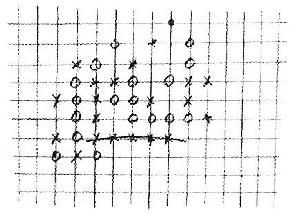

class: middle, center, title-slide

# Introduction to Artificial Intelligence

Fall 2018

  
Prof. Gilles Louppe 
[g.louppe@uliege.be](g.louppe@uliege.be)

---

# Logistics

Contact:

- Prof. Gilles Louppe ([g.louppe@uliege.be](mailto:g.louppe@uliege.be))
- Teaching assistants:
    - Antoine Wehenkel ([antoine.wehenkel@uliege.be](antoine.wehenkel@uliege.be))
    - Samy Aittahar ([saittahar@uliege.be](mailto:saittahar@uliege.be))

---

# Textbook

.center.width-30[]

Stuart Russel, Peter Norvig. .italic["Artificial Intelligence: A Modern Approach"], Third Edition, Global Edition.

This book is **strongly recommended**.

---

# Slides

Slides are partially adapted from:
- [CS188 Introduction to AI](http://ai.berkeley.edu/lecture_slides.html) (UC Berkeley)
- [CS430 Introduction to AI](http://web.engr.oregonstate.edu/~tgd/classes/430/) (Oregon State University)

---

# Lectures

- Theoretical lectures
- Exercise sessions

---

# Evaluation

- Oral exam (50%)
- Programming project 1 (15%)
- Programming project 2 (35%)

---

# Philosophy

## Thorough and detailed

- Understand the landscape of artificial intelligence.
- Be able to write from scratch, debug and run (some) AI algorithms.

## Well established algorithms and state-of-the-art

- Well-established algorithms for building intelligent agents.
- Introduction to materials new from research ($\leq$ 5 years old).
- Understand some of the open questions and challenges in the field.

## Practical

- Fun and challenging course project.

---

class: middle

# Outline

---

# 1. Foundations

-   The foundations, history and state-of-the-art *(Chapter 1)*
-   Intelligent agents: modeling a rational behavior in a complex environment *(Chapter 2)*

---

# 2. Solving problems by searching

-   Basic search methods *(Chapter 3)*

---

# 3. Constraint satisfaction problems

- CSPs, backtracking, local search, ... *(Chapter 6)*
- Logical inference as a CSP

---

# 4. Games

-   Games, optimal decisions, stochastic game, ... *(Chapter 5)*
-   *Extra:* Deep Blue, AlphaGo

---

# 5. Representing uncertain knowledge

-   Quantifying Uncertainty *(Chapter 13)*

---

# 6. Inference in Bayesian networks

-   Probabilistic reasoning *(Chapter 14)*

---

# 7. Reasoning over time

-   Probabilistic reasoning over time *(Chapter 15)*

---

# 8. Making decisions

-   Making simple decisions *(Chapter 16)*
-   Making complex decisions *(Chapter 17)*

---

# 9. Learning

-   Discussion on the need for learning
-   Overview of various learning paradigms *(Chapters 18, 19, 20, 21)*
-   *Extra:* Deep learning as a promising path towards AI (Bengio)

---

# 10. Communication

-   Natural language processing *(Chapter 22)*.
-   Natural language for communication *(Chapter 23)*.
-   *Extra:* Q&A systems

---

# 11. Artificial General Intelligence and beyond

Artificial General Intelligence
-   Recursive self-improvement, meta learning *(Research)*
-   AIXI *(Research)*

Philosophical foundations and future of AI
-   Philosophical foundations *(Chapter 26)*
-   Future of AI, open challenges, safety *(Chapter 27)*
-   *Extra:*  Probably approximately correct theory

---

class: middle

# Projects

---

# Projects

.grid[
.col-2-3[
- Programming project 1 (15%):
    - Implement a simple agent for *tic-tac-toe* (3x3 and larger grids)
- Programming project 2 (35%):
    - Implement an intelligent **Pacman** agent
    - Increasing levels of intelligence
]
.col-1-3[

]
]
