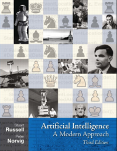

class: middle, center, title-slide

# Introduction to Artificial Intelligence

Fall 2019

  
Prof. Gilles Louppe 
[g.louppe@uliege.be](mailto:g.louppe@uliege.be)

---

# Logistics

This course is given by:
- Theory: Gilles Louppe
- Exercises: Antoine Wehenkel
- Projects: Samy Aittahar, Pascal Leroy and Florian Merchie

Feel free to contact us at [info8006@montefiore.ulg.ac.be](mailto:info8006@montefiore.ulg.ac.be) for help!

.center[
.circle.width-20[] &nbsp;
.circle.width-20[]

.circle.width-15[] &nbsp;
.circle.width-15[] &nbsp;
.circle.width-15[]
]

---

# Outline

- Lecture 0: Artificial intelligence
- Lecture 1: Intelligent agents
- Lecture 2: Solving problems by searching
- Lecture 3: Constraint satisfaction problems
- Lecture 4: Adversarial search
- Lecture 5: Representing uncertain knowledge
- Lecture 6: Inference in Bayesian networks
- Lecture 7: Reasoning over time
- Lecture 8: Making decisions
- Lecture 9: Learning
- Lecture 10: Communication
- Lecture 11: Artificial General Intelligence and beyond

---

# Philosophy

## Thorough and detailed
- Understand the landscape of artificial intelligence.
- Be able to write from scratch, debug and run (some) AI algorithms.

## Well established algorithms and state-of-the-art
- Well-established algorithms for building intelligent agents.
- Introduction to materials new from research ($\leq$ 5 years old).
- Understand some of the open questions and challenges in the field.

## Practical
- Fun and challenging course project.

---

# Lectures

- Theoretical lectures
- Exercise sessions

---

# Materials

Slides are available at [github.com/glouppe/info8006-introduction-to-ai](https://github.com/glouppe/info8006-introduction-to-ai).
- In HTML and in PDFs.
- Posted online the day before the lesson (hopefully).
- Minor improvements/fixes from previous years.

Some lessons are partially adapted from "[Introduction to Artificial Intelligence](http://ai.berkeley.edu/lecture_slides.html)" (CS188), from UC Berkeley.

.center.width-80[]

---

# Textbook

.center.width-30[]

The core content of this course is based on the following textbook:

> .italic[Stuart Russel, Peter Norvig. "Artificial Intelligence: A Modern Approach", Third Edition, Global Edition.]

This textbook is **strongly recommended**, although not required.

---

# Projects

## Reading assignment

Read a major scientific paper in Artificial Intelligence.
(Paper to be announced later.)

.center.width-40[]

---

class: middle

## Programming projects

Implement an intelligent agent for playing **Pacman**. The project will be divided into three parts, with increasing levels of difficulty.

.center.width-40[]

---

# Evaluation

- Written exam (60%)
    - Short questions on the reading assignment will be part of the exam.
- Programming projects (40%)
    - Project 1: 10%
    - Project 2: 15%
    - Project 3: 15%
    - Programming projects are **mandatory** for presenting the exam.

---

# Going further

This course is designed as an introduction to the many other courses available at ULiège and (broadly) related to AI, including:

- **INFO8006: Introduction to Artificial Intelligence $\leftarrow$ you are there**
- ELEN0062: Introduction to Machine Learning
- INFO8004: Advanced Machine Learning
- INFO8010: Deep Learning
- INFO8003: Optimal decision making for complex problems
- INFO0948: Introduction to Intelligent Robotics
- INFO0049: Knowledge representation
- ELEN0016: Computer vision
- ELEN0060: Information and coding theory
- MATH2022: Large-sample analysis: theory and practice
- DROI8031: Introduction to the law of robots

???

Mention pre-requisites:
- programming experience
- probability theory

---

class: end-slide, center
count: false

Let's start!
