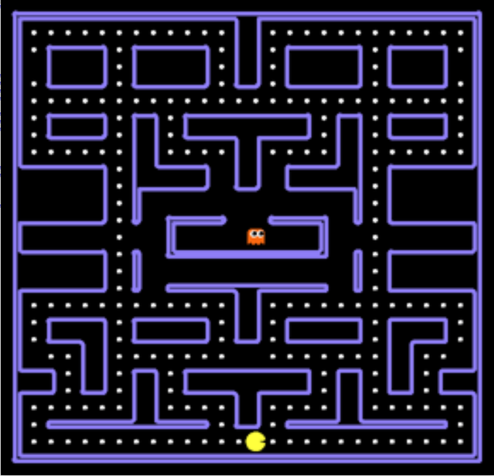

# Pacman

<p align="center">

</p>

The goal of this programming project is to implement intelligent agents for the game of Pacman. The project is divided into three parts:
- **Part 1.** You must implement a Search agent for eating all the food dots as quickly as possible.
- **Part 2.** You must implement a Minimax agent for eating all the food dots as quickly as possible, while avoiding the ghost enemies that are chasing you.
- **Part 3.** You must implement a MDP agent for eating all the food dots as quickly as possible, in a maze where some of the walls may appear and disappear at random.


## Table of contents

- [Installation](#installation)
    * [Setup](#setup)
    * [Usage](#usage)
- [Instructions](#instructions)
    * [Part 1: Search agent](#search-agent--part-1-3-)
    * [Part 2: Minimax agent](#search-agent-against-ghosts--part-2-3-)
    * [Part 3: MDP agent](#search-agent-against-ghosts-with-blinking-walls--part-3-3-)
- [FAQ](#helpers)
    * [Game score](#score)
    * [API](#api)
    * [Illegal moves](#illegal-moves)
- [Evaluation](#evaluation)
- [Credits](#credits)

---

## Installation

The instructions below have been tested under Windows, Linux and MacOS.

We recommend to install a Python (3) environment using the Anaconda distribution. Further instructions can be found on the [Anaconda user guide](https://conda.io/docs/user-guide/install/index.html). Once installed, open the Anaconda prompt (Windows) or a terminal (Linux/MacOS).

### Setup

(Linux/MacOS) Create a `pacman` environment and activate it:
```bash
conda create -n pacman python=3.6
source activate pacman
```

(Windows) Create a `pacman` environment and activate it:
```bash
conda create -n pacman python=3.6
activate pacman
```

From now, it is assumed that `pacman` is activated.

Dependencies should be installed through `conda`:
```bash
conda install numpy
```

### Usage

Start the game with a Pacman agent controlled by the keyboard (keys `j`, `l`, `i`, `k` or arrow keys):
```bash
python run.py
```

**Options**:

`--agentfile`: Start the game with a Pacman agent following a user-defined control policy:
```bash
python run.py  --agentfile randomagent.py
```

`--silentdisplay`: Disable the graphical user interface:
```bash
python run.py --silentdisplay
```

`--layout`: Start the game with a user-specifed layout for the maze (see the `/pacman_module/layouts/` folder):
```bash
python run.py --layout medium
```

`--ghostagent`: Start the game with a user-specifed ghost pattern among (`dumby`,`greedy`,`smarty`):
```bash
python run.py --ghostagent greedy
```

`-h`: For further details, check the command-line help section:
```bash
python run.py -h
```

---

## Instructions

For each part of the project, you must provide the following deliverables:

- The source code of your Pacman agent(s).
- A report in PDF format of 4 pages (at most).

The three parts of the project must be carried out in groups of 2 students (with the same group across all parts).

You deliverables must be submitted as an archive on the [Montefiore submission platform](https://submit.montefiore.ulg.ac.be/teacher/courseDetails/INFO8006/).

### Part 1: Search agent

This part is due on **October 26, 2018 at 23:59**. This is a **hard** deadline.

In this first part of the project, only food dots are in the maze. No ghost is present.
Your task is to design an intelligent based on search algorithms (see [Lecture 2](https://glouppe.github.io/info8006-introduction-to-ai/?p=lecture2.md)) for eating all the dots as quickly as possible.

You are asked to implement an agent based on each of these search algorithms:
 - Depth-First Search (DFS)
 - Breadth-First Search (BFS)
 - Uniform Cost Search (UCS)
 - A* (and an associated heuristic of your choice).

Each agent should be implemented as a `PacmanAgent` class. Each should be specified in a different Python file (`dfs.py`, `bfs.py`, `ucs.py`, `astar.py`), following the template of `pacmanagent.py`.

Your report should be organized into 3 parts:
1. You must formalize the game as a search problem, as seen in [Lecture 2](https://glouppe.github.io/info8006-introduction-to-ai/?p=lecture2.md).
2. You should run your agents against the 3 maze layouts located the  `/pacman_module/layouts/` folder.
  For each layout, report as a bar plot the performance of your 4 agents in terms of i) final score, ii) total computation time and iii) total number of expanded nodes. In total, you should therefore produce 9 bar plots.
3. Discuss the performance and limitations of your agents, with respect to their search algorithm, the heuristic (in the case of A*) and the maze layout. Comment on possible improvements.

### Part 2: Minimax agent

This part is due on **November 23, 2018 at 23:59**. This is a **hard** deadline.

In this second part, Pacman can no longer wander peacefully in its maze. It is chased by a ghost that tries to kill him!

The ghost follows one of the following policies, as set through the `--ghostagent` command line option:
 - `dumby`: Rotate on itself in a counterclockwise fashion until it can go on its left.
 - `greedy`: Select the next position that is the closest to Pacman.
 - `smarty`: Select the next position which leads to the shortest path towards Pacman.

Your task is to design an intelligent agent based on adversarial search algorithms (see [Lecture 4](https://glouppe.github.io/info8006-introduction-to-ai/?p=lecture4.md)) for eating all the dots as quickly as possible while avoiding the ghost.

You are asked to implement an agent based on each of these adversarial search algorithms:
 - Minimax.
 - Minimax with alpha-beta pruning.
 - H-Minimax.

Each agent should be implemented as a `PacmanAgent` class. Each should be specified in a different Python file (`minimax.py`, `alphabeta.py` and `hminimax.py`), following the template of `pacmanagent.py`.

Your implementation of Minimax (with or without alpha-beta pruning) should be able to solve the smaller map `small_adv` against all kinds of ghosts. It is not required to be able to solve the larger maps (`medium_adv` and `large_adv`). On the other hand, your implementation of H-Minimax should solve all maps against all ghosts, within reasonable time and with a sufficient level of optimality.

Your report should be organized into 3 parts:
1. You must formalize the game as an adversarial search problem, as seen in [Lecture 4](https://glouppe.github.io/info8006-introduction-to-ai/?p=lecture4.md).
2. You should run your 3 Pacman agents on the `small_adv` maze layout against all 3 ghost agents.
  For each ghost agent, report as a bar plot the performance of your 3 Pacman agents in terms of i) final score, ii) total computation time and iii) total number of expanded nodes. In total, you should therefore produce 9 bar plots.
3. Discuss the performance and limitations of your agents, with respect to their search algorithm, the maze layout (`small_adv`, `medium_adv` and `large_adv`) and the ghost agent. Evaluate the impact of your custom evaluation and cutoff functions. Comment on possible improvements.

### Part 3: MDP agent

TBD.

---

## FAQ

### Game score

The score function of the game is computed as follows:

`score = -#time steps + 10*#number of eaten food dots + 200*#number of eaten ghost + (-500 if #losing end) + (500 if #winning end)`.

We ask you to implement an agent that wins the game while maximizing its score.

Note that you should ask yourself if this score function satisfies all the properties of the search algorithms you will implement. If not, you are free to modify it as long as the optimal solutions remain the same.

### API

You must implement your agent as a `PacmanAgent` class, following the template of `pacmanagent.py`.
The core of your algorithm should be implemented or called within the `get_action` method. This method  receives the current state `s` of the game and should return the action to take.

Useful methods of the state are specified below:

 - ```s.generatePacmanSuccessors()``` : Returns a list of pairs of successor states and moves given the current state ```s``` for the pacman agent.
    * This method **must** be called for any node expansion for pacman agent.
 - ```s.generateGhostSuccessors(agentIndex)``` : Returns a list of pairs of successor states and moves given the current state ```s``` for the agent indexed by ```agentIndex>0```.
    * This method **must** be called for any node expansion for ghost agent.
 - ```s.getLegalActions(agentIndex)``` : Returns a list of legal moves given the state ```s``` and the agent indexed by ```agentIndex```. 0 is always the Pacman agent.
 - ```s.getPacmanPosition()``` : Returns the Pacman position in a ```(x,y)``` pair.
 - ```s.getScore()``` : Returns the total score of a state (as defined above).
 - ```s.getFood()``` : Returns a boolean matrix which gives the position of all food dots.
 - ```s.getWalls()``` : Returns a boolean matrix which gives the position of all walls.
 - ```s.getGhostPositions()``` : Returns the position of all ghosts in the maze.
 - ```s.getCapsules()``` : Returns a list of positions of the remaining capsules in the maze.
 - ```s.isWin()``` : Returns True if the state is in a *winning end*.
 - ```s.isLose()``` : Returns True if the state is in a *losing end*.

Implementation examples are provided in `humanagent.py` and `randomagent.py`.

### Illegal moves

You need to ensure that your agent always returns a legal move. If it is not the case, the previous move is repeated if it is still legal. Otherwise, it remains in the same location.

---

## Evaluation

The evaluation of your deliverables is based on the following criteria:

- Performance of your intelligent agent (as evaluated by its final score, its total computation time and its total number of expanded nodes). Note that your agents might be evaluated on mazes that are not included within the `/pacman_module/layouts/` folder.
- Quality and clarity of your report.
	* Avoid long and vague sentences and be straight to the point.
	* Follow the structure mentioned in the instructions.

- Quality, clarity and structure of the source code.
	* Avoid single-file long code source, and prefers to use a multiple-files modular architecture.
	* Name your variables-attributes-classes according to their usage.
    * Comment your code so that explanations are concise and clear enough to allow the reader to understand the semantics in a quick look.
	* Your source code must be Python 3 and [PEP8](https://www.python.org/dev/peps/pep-0008/) compatible.

:warning: Plagiarism is checked and sanctioned by a grade of 0.

---

## Credits

Credits: [UC Berkeley](http://ai.berkeley.edu/project_overview.html)
