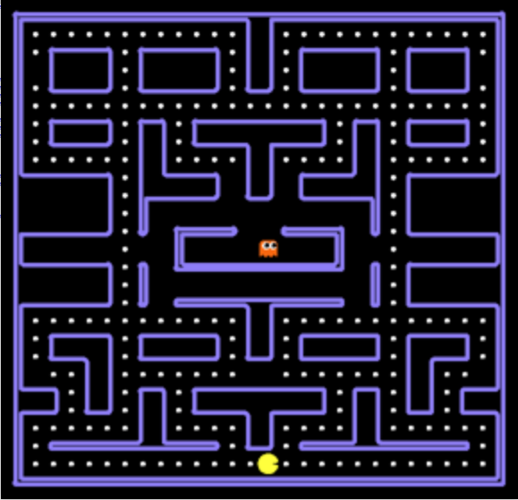

# Pacman programming project

<p align="center"></p>

The goal of this programming project is to implement intelligent agents for the game of Pacman. The project is divided into three parts:
- [Project 0](project0): you have to implement a Search agent for eating all the food dots as quickly as possible.
- [Project 1](project1): you have to implement a Minimax agent for eating all the food dots as quickly as possible, while avoiding the ghost enemies that are chasing you.
- [Project 2](project2): you have to implement a Bayes filter for tracking all the non-visible ghosts' positions.

## Installation

> The instructions below have been tested under Windows, Linux and MacOS.

We recommend to install a Python (3) environment using the `conda` package manager. The easiest way is to install [Miniconda](https://docs.conda.io/en/latest/miniconda.html). You also need a code editor that supports Python. If you don't already have one, here are a few you might consider : [Sublime Text](https://www.sublimetext.com/), [VS Code](https://code.visualstudio.com/), [Vim](https://www.vim.org/), ...

Once Miniconda is installed, open the Anaconda prompt (Windows) or a terminal (Linux/MacOS).

### Setup

Create a `pacman` environment, activate it and install the dependencies:

```console
$ conda create --name pacman python=3.8
$ conda activate pacman
$ conda install numpy
```

From now, it is assumed that `pacman` is activated.

### Usage

- `--agent`: start the game with a user-specifed Pacman agent
    ```console
    $ python run.py --agent humanagent
    ```

- `--ghost`: start the game with a user-specifed Ghost agent (`dumby`, `greedy`, `smarty` or `eastrandy`)
    ```console
    $ python run.py --ghost dumby
    ```

- `--layout`: start the game with a user-specifed maze layout (see `pacman_module/layouts` directory)
    ```console
    $ python run.py --layout medium
    ```

- `--nographics`: disable the graphical user interface
    ```console
    $ python run.py --agent dfs --nographics
    ```

## Instructions

All parts (1, 2 & 3) of the project must be carried out in groups of maximum 3 students. You must keep the same group across all parts. For each part, login to [Gradescope](https://www.gradescope.com/) with your `@student.uliege.be` account and submit the requested deliverables. Don't forget to add other group members for each submission.

We tolerate only **one delay of maximum 24 hours**. For example, if you submit your first part late, no more delay will be allowed for the two other parts. In case of *more than one delay*, the concerned parts will receive a *0/20* grade.

## Typical mistakes and bad practices

We show through this section a list of common mistakes and bad practices that we have observed through past projects. Although this section is non exhaustive and thus is subject to regular updates, we hope that the following list will help you to avoid many pitfalls that can hurt the quality of your project.

### Style/Documentation

* Source code is not PEP-8 compliant. Fulfilling the required specifications help to the readability of your source code. PEP-8 guidelines are provided at [Style Guide for Python Code](https://www.python.org/dev/peps/pep-0008/). You can use dedicated [scripts](https://pypi.org/project/pycodestyle/) to check PEP-8 compliance of your source code.

* Function specifications are either wrong or missing. They must be present and they must **formally** describe the function out of ambiguity. Its purpose is to provide an easier-to-understand description of the function than the code itself. An example of a correct specification is provided below :
    ```python
    def fibonacci(n):
        """Computes the n-th member of the Fibonacci sequence.
        Recursive definition:
            f(0) = 0, f(1) = 1, f(n) = f(n-1) + f(n-2) for n > 1

        Arguments:
            n: Positive index of the Fibonacci sequence.

        Returns:
            The n-th member of the Fibonacci sequence.
        """

        if n <= 1:
            return n

        return fibonacci(n-1) + fibonacci(n-2)
    ```

* Variables and functions are not named accordingly to their meanings. A source code in which names are based on target meanings is easier to read and might need less comments to be readable.

* Comments are either uninformative, too verbose or missing. They are important to structure the code and to provide high-level insights on how each part of code interacts with each other, and how the source code is actually behaving (useful for optimization among other benefits). They must contains few words and be straight to the point.

### Implementation

* Incorrect implementation of the algorithms. This is often due to the violation of any specification of the algorithms, or to an incorrect implementation of the problem statement, e.g., a wrong goal test is provided to the algorithm. Be sure to understand the problem statement you need to describe and the algorithms you are required to implement.
* Over confidence on implementation correctness by testing on a small subset of problem instances. While tests are useful to spot implementation errors, they cannot discard all of them. Even if your implementation "works" on some instances of the problem statement, and even if you are encouraged to do such tests, you need to carefully verify your implementation. This includes 1) the correctness of the inputs given to your algorithms with respect to the problem statement and 2) the fulfilment of the algorithms specifications in your implementation.
* Inefficiency during execution. Only a few seconds is necessary in the worst case to solve each instance of the problem statement we provide in the projects. While you should first have a working version of your implementation, you should also be careful to limit the computation time below these few seconds.
* Import and edge-cases errors, e.g. index out of bounds. While a typo in import sections does not jeopardize the implementation correctness - as long as the required files are present -, it is often difficult for the reader to decide if edge-cases error are either typos or part of the incorrect implementation. The safest policy being the latter, we refer to it when evaluating your work.

## FAQ

### Game score

The score function of the game is computed as follows:

```
score = 10 * #number of eaten food dots
      - 5 * #number of eaten capsules
      + 200 * #number of eaten ghost
      - 1 * #time steps
      - 500 if losing end
      + 500 if winning end
```

We ask you to implement an agent that wins the game while maximizing its score.

Note that you should ask yourself if this score function satisfies all the properties of the search algorithms you will implement. If not, you are free to modify it as long as the optimal solutions remain the same.

### API

You must implement your agent as a `PacmanAgent` class, following the template of `pacmanagent.py`.
The core of your algorithm should be implemented or called within the `get_action` method. This method  receives the current state `s` of the game and should return the action to take.

Useful methods of the state are specified below:

- `s.generatePacmanSuccessors()`: Returns a list of pairs of successor states and moves given the current state `s` for the pacman agent.
    * This method **must** be called for any node expansion for pacman agent.
- `s.generateGhostSuccessors(agentIndex)`: Returns a list of pairs of successor states and moves given the current state `s` for the ghost agent indexed by `agentIndex>0`.
    * This method **must** be called for any node expansion for ghost agent.
- `s.getLegalActions(agentIndex)`: Returns a list of legal moves given the state `s` and the agent indexed by `agentIndex`. 0 is always the Pacman agent.
- `s.getPacmanPosition()`: Returns the Pacman position in a `(x,y)` pair.
- `s.getScore()`: Returns the total score of a state (as defined above).
- `s.getFood()`: Returns a boolean matrix which gives the position of all food dots.
- `s.getNumFood()`: Returns a scalar which gives the number of food dots remaining.
- `s.getWalls()`: Returns a boolean matrix which gives the position of all walls.
- `s.getGhostPosition(agentIndex)`: Returns the position of the ghost agent indexed by `agentIndex>0`.
- `s.getGhostDirection(agentIndex)`: Returns the direction of the ghost agent indexed by `agentIndex>0`.
- `s.getCapsules()`: Returns a list of positions of the remaining capsules in the maze.
- `s.isWin()`: Returns `True` if the state is in a *winning end*.
- `s.isLose()`: Returns `True` if the state is in a *losing end*.

Implementation examples are provided in `humanagent.py` and `randomagent.py`.

### Illegal moves

You need to ensure that your agent always returns a legal move. If it is not the case, the previous move is repeated if it is still legal. Otherwise, it remains in the same location.

### Questions about the projects

The purpose of the projects is to give you an opportunity to have a practical approach of the core concepts of the course. However, you might be stuck during your work progression. Although we are glad to help you to figure out how to solve your various issues, the relevance of our guidance strongly relies on the specificity of your questions, which implies that you have at least tried to solve your issues by referring to the lectures.

You may send your questions at **info8006@montefiore.ulg.ac.be**. You may also meet us at our office on Wednesday 12PM-2PM (Arnaud Delaunoy, R.103).

If none of these time slots suits you, feel free to send an email in order to fix an appointment. When you send your email, make sure to already suggest a few time slots. These can be outside the duty periods mentioned above. Do not wait a couple of days before the **hard** deadline to start your project and/or ask your questions. Be also aware that we cannot guarantee to answer your questions outside office hours.

## Credits

The programming projects are adapted from [CS188 (UC Berkeley)](http://ai.berkeley.edu/project_overview.html).
